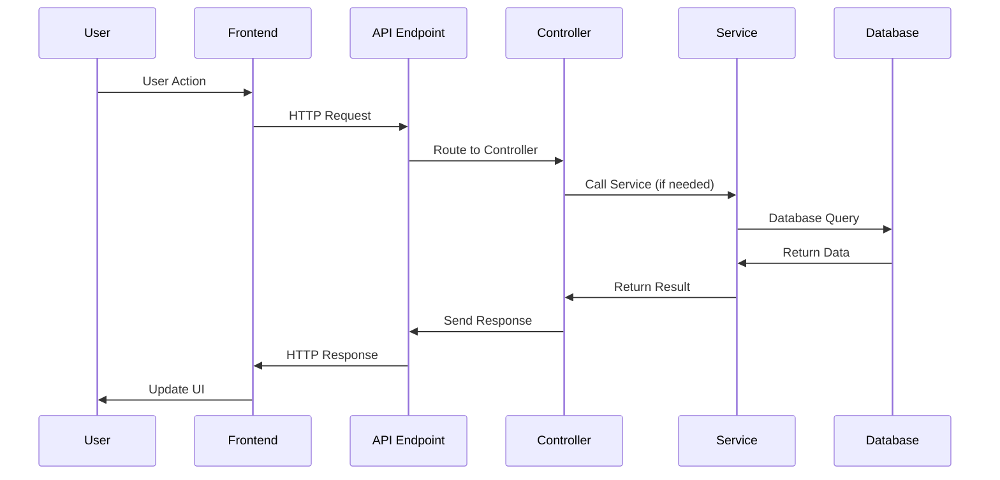

# Feature: [Feature Name]

## Overview

**Purpose**: [Brief description of what this feature does]

**User Story**: [As a [user type], I want to [action] so that [benefit]]

**Key Functionality**:
- [Functionality 1]
- [Functionality 2]
- [Functionality 3]

**Access Level**: [Public / Job Seeker Only / Employer Only / Admin Only / Mixed]

**URL Path**: `/path/to/feature`

---

## User Flow

### Primary Flow
1. User [action]
2. System [response]
3. User [action]
4. System [response]

### Alternative Flows
- **Flow A**: [Description of alternative flow]
- **Flow B**: [Description of error flow]

### Edge Cases
- [Edge case 1]
- [Edge case 2]

---

## Frontend Implementation

### Screen Structure

**Main Page Component**:
- File: `frontend/src/app/[path]/page.jsx`
- Type: [Server Component / Client Component]

**Client Component** (if separate):
- File: `frontend/src/app/[path]/[ComponentName]PageClient.jsx`
- Purpose: [Why this is a separate client component]

**Styling**:
- CSS File: `frontend/src/app/[path]/page.css`
- CSS Modules: [Yes/No]
- Responsive: [Yes/No]

### Component Hierarchy

```
[MainPageComponent]
  ├── [Component1]
  │   ├── [SubComponent1.1]
  │   └── [SubComponent1.2]
  ├── [Component2]
  └── [Component3]
```

**Key Components**:
1. **[ComponentName]**
   - Location: `frontend/src/components/[path]/ComponentName.jsx`
   - Purpose: [What this component does]
   - Props: [List of props]

### State Management

**React Query Hooks**:
```javascript
// Hook 1: [Purpose]
const { data, isLoading, error } = useQuery({
  queryKey: ['key'],
  queryFn: fetchFunction
});

// Hook 2: [Purpose]
const mutation = useMutation({
  mutationFn: mutationFunction
});
```

**Local State**:
```javascript
const [state1, setState1] = useState(initialValue);
const [state2, setState2] = useState(initialValue);
```

**Redux Store** (if used):
- Action: `[actionName]`
- Reducer: `[reducerName]`
- Selector: `[selectorName]`

### API Integration

**Endpoints Called**:

| Endpoint | Method | Purpose | Authentication |
|----------|--------|---------|----------------|
| `/api/endpoint1` | GET | [Purpose] | Required |
| `/api/endpoint2` | POST | [Purpose] | Required |

**API Client Functions**:
```javascript
// File: frontend/src/[api file path]
export const fetchData = async () => {
  const response = await fetch('/api/endpoint');
  return response.json();
};
```

### Form Handling (if applicable)

**Form Fields**:
- `field1`: [Type, Required/Optional, Validation rules]
- `field2`: [Type, Required/Optional, Validation rules]

**Validation**:
- Client-side: [Library used, rules]
- Server-side: [Backend validation details]

**Form Submission**:
```javascript
const handleSubmit = async (formData) => {
  // Form submission logic
};
```

### UI States

**Loading State**:
- [Description of loading UI]

**Error State**:
- [Description of error UI]
- Error handling: [How errors are displayed]

**Success State**:
- [Description of success UI]
- Success feedback: [How success is communicated]

**Empty State**:
- [Description of empty state UI]

---

## Backend Implementation

### API Endpoint

**Route Definition**:
```javascript
// File: backend/src/routes/[routeFile].js
router.[METHOD]("/endpoint-path", [middleware], controllerFunction);
```

**Full Endpoint Path**: `/[basePath]/endpoint-path`

**HTTP Method**: [GET / POST / PUT / DELETE / PATCH]

**Authentication Required**: [Yes/No]

**Authorization**: [Role-based access if applicable]

### Middleware Chain

1. **[Middleware1]**: [Purpose]
   - File: `backend/src/middleware/[middlewareFile].js`
   
2. **[Middleware2]**: [Purpose]
   - File: `backend/src/middleware/[middlewareFile].js`

### Controller

**Controller Function**:
```javascript
// File: backend/src/controllers/[controllerFile].js
const controllerFunction = async (req, res, next) => {
  // Controller logic overview
};
```

**Request Validation**:
- [Validation rules]
- [Error responses]

**Response Format**:
```javascript
// Success Response
{
  success: true,
  data: { /* response data */ },
  message: "Success message"
}

// Error Response
{
  success: false,
  message: "Error message",
  error: { /* error details */ }
}
```

### Service Layer (if applicable)

**Service Functions**:
```javascript
// File: backend/src/services/[serviceFile].js
const serviceFunction = async (params) => {
  // Business logic
};
```

**Business Logic**:
- [Key business rules]
- [Data transformations]
- [External API integrations]

### Database Operations

**Models Used**:
1. **[ModelName]**
   - File: `backend/src/models/[modelFile].js`
   - Schema: [Brief schema description]
   - Key fields: [List important fields]

**Database Queries**:
```javascript
// Query 1: [Purpose]
const data = await Model.find({ /* query */ });

// Query 2: [Purpose]
const result = await Model.findOne({ /* query */ });
```

**Operations**:
- Create: [Description]
- Read: [Description]
- Update: [Description]
- Delete: [Description]

**Relationships**:
- [Model1] → [Relationship] → [Model2]

### External Integrations (if applicable)

**External Services**:
- [Service Name]: [Purpose]
- API: [API endpoint/docs]
- Authentication: [Auth method]

**Third-party Libraries**:
- [Library Name]: [Purpose]

---

## Data Flow

### Complete Request-Response Cycle



### Request Payload Example

```json
{
  "field1": "value1",
  "field2": "value2"
}
```

### Response Payload Example

```json
{
  "success": true,
  "data": {
    "field1": "value1",
    "field2": "value2"
  },
  "message": "Operation successful"
}
```

---

## Error Handling

### Frontend Error Handling

**Error Types**:
- Network errors: [How handled]
- Validation errors: [How handled]
- Server errors: [How handled]

**Error Display**:
- [Method used to show errors - toast, inline, modal, etc.]

### Backend Error Handling

**Error Middleware**:
- File: `backend/src/middleware/errorMiddleware.js`

**Error Types**:
- Validation errors: [Status code, format]
- Authentication errors: [Status code, format]
- Server errors: [Status code, format]

**Error Response Format**:
```javascript
{
  success: false,
  message: "Error message",
  error: {
    // Error details
  }
}
```

---

## Environment Variables

**Frontend**:
- `NEXT_PUBLIC_API_URL`: [Purpose]

**Backend**:
- `VARIABLE_NAME`: [Purpose]

---

## Testing Considerations

### Test Scenarios

**Happy Path**:
1. [Test case 1]
2. [Test case 2]

**Error Cases**:
1. [Test case 1]
2. [Test case 2]

**Edge Cases**:
1. [Test case 1]
2. [Test case 2]

---

## Related Features

- [Link to related feature 1]
- [Link to related feature 2]

---

## Additional Notes

**Dependencies**:
- [Feature/module this depends on]

**Known Issues**:
- [Any known bugs or limitations]

**Future Enhancements**:
- [Planned improvements]

**Performance Considerations**:
- [Any performance-related notes]

---

## Code References

### Frontend Files
- `frontend/src/app/[path]/page.jsx`
- `frontend/src/app/[path]/[ComponentName]PageClient.jsx`
- `frontend/src/components/[component]/ComponentName.jsx`

### Backend Files
- `backend/src/routes/[routeFile].js`
- `backend/src/controllers/[controllerFile].js`
- `backend/src/services/[serviceFile].js`
- `backend/src/models/[modelFile].js`

---

*Last Updated: [Date]*
*Documented By: [Name]*

