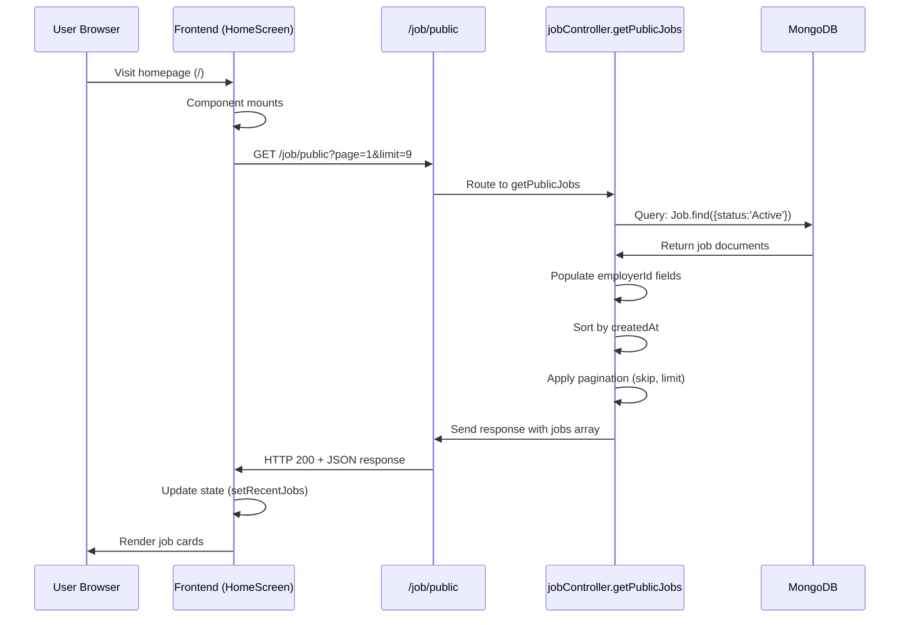

# Feature: Home/Landing Page

## Overview

**Purpose**: The Home/Landing Page serves as the main entry point to the Atract platform, providing an overview of the platform's features and capabilities for both job seekers and employers. It displays recent job listings, highlights key features, and guides users to sign up or explore jobs.

**User Story**: As a visitor, I want to understand what Atract offers and see recent job opportunities so that I can decide whether to sign up or explore jobs.

**Key Functionality**:
- Display platform introduction and value proposition
- Show recent job listings (9 most recent active jobs)
- Highlight features for job seekers and employers
- Provide navigation to sign-up, job browsing, and free tools
- Display platform statistics and benefits
- Guide users through the platform's workflow

**Access Level**: Public (No authentication required)

**URL Path**: `/`

---

## User Flow

### Primary Flow
1. User visits the homepage (`/`)
2. Page loads and displays hero section with platform introduction
3. User scrolls to see:
   - Platform statistics (Active Job Seekers, Trusted Companies, Match Success Rate, Faster Hiring)
   - Recent job listings (9 jobs displayed)
   - Job Seeker features section
   - Employer features section
   - "How It Works" section
   - Benefits section
   - Call-to-action section
4. User clicks "Get Started Free" → Redirected to authentication flow
5. User clicks "Explore Jobs" → Redirected to `/jobs` page
6. User clicks on a job card → Redirected to job detail page (`/[shortId]`)

### Alternative Flows
- **Mobile Free Tools Banner**: On mobile, a banner for free tools appears at the top
- **Job Click Flow**: User clicks on a job card or "Apply" button → Navigates to job detail page
- **Error Flow**: If recent jobs fail to load, error message is displayed instead of jobs

### Edge Cases
- No jobs available: Empty state message is shown
- Network error when fetching jobs: Error message displayed, page still functional
- User clicks utility banners (if configured): Checks for authentication, shows login modal if needed

---

## Frontend Implementation

### Screen Structure

**Main Page Component**:
- File: `frontend/src/app/page.js`
- Type: Client Component (uses "use client" directive)

**Client Component**:
- File: `frontend/src/components/home/HomeScreen.jsx`
- Purpose: Main landing page component with all sections, animations, and interactions

**Styling**:
- CSS File: `frontend/src/components/home/HomeScreen.css`
- CSS Modules: No
- Responsive: Yes (mobile-first design)

### Component Hierarchy

```
Home (page.js)
  └── HomeScreen (HomeScreen.jsx)
      ├── Hero Section
      │   ├── Mobile Free Tools Banner (conditional)
      │   ├── Utility Banners (conditional)
      │   ├── Hero Content (title, description, CTAs)
      │   ├── Hero Image
      │   └── Stats Cards
      ├── Recent Jobs Section
      │   ├── Section Header
      │   ├── Job Cards Grid (or Skeleton/Error/Empty states)
      │   └── "Explore more jobs" CTA
      ├── Job Seeker Features Section
      │   ├── Section Header
      │   ├── Features Grid
      │   └── Image Showcase
      ├── Employer Features Section
      │   ├── Section Header
      │   ├── Features Grid
      │   └── Image Showcase (reversed)
      ├── How It Works Section
      │   ├── Section Header
      │   └── Steps Grid
      ├── Benefits Section
      │   └── Benefits Grid
      ├── CTA Section
      │   ├── CTA Content
      │   └── CTA Image
      └── PdfLoginModal (conditional)
```

**Key Components**:
1. **HomeScreen**
   - Location: `frontend/src/components/home/HomeScreen.jsx`
   - Purpose: Main landing page container with all sections
   - Props: `onGetStarted` (optional callback function)

2. **PdfLoginModal**
   - Location: `frontend/src/components/pdfLoginModal/PdfLoginModal.jsx`
   - Purpose: Modal for PDF tool authentication when accessing protected routes
   - Used: When user clicks utility banners without authentication

### State Management

**Local State**:
```javascript
const [recentJobs, setRecentJobs] = useState([]);
const [recentJobsLoading, setRecentJobsLoading] = useState(false);
const [recentJobsError, setRecentJobsError] = useState(null);
const [showPdfLoginModal, setShowPdfLoginModal] = useState(false);
const [pendingRoute, setPendingRoute] = useState(null);
```

**React Router**:
```javascript
const router = useRouter(); // Next.js navigation
```

**Data Fetching**:
- Uses `useEffect` hook with `axios` for fetching recent jobs
- No React Query for this feature (direct axios call)

### API Integration

**Endpoints Called**:

| Endpoint | Method | Purpose | Authentication |
|----------|--------|---------|----------------|
| `/job/public?page=1&limit=9` | GET | Fetch 9 most recent active jobs | Not required |

**API Client Functions**:
```javascript
// Direct axios call in useEffect
const fetchRecentJobs = async () => {
  try {
    setRecentJobsLoading(true);
    setRecentJobsError(null);
    const resp = await axios.get(
      `${process.env.NEXT_PUBLIC_JOB_URL}/public?page=1&limit=9`
    );
    if (resp.data?.success && Array.isArray(resp.data.data)) {
      setRecentJobs(resp.data.data);
    } else {
      setRecentJobs([]);
      setRecentJobsError("Unable to load jobs right now.");
    }
  } catch (err) {
    console.error("Recent jobs fetch error:", err);
    setRecentJobsError("Unable to load jobs right now.");
  } finally {
    setRecentJobsLoading(false);
  }
};
```

**Environment Variables**:
- `NEXT_PUBLIC_JOB_URL`: Base URL for job API (e.g., `http://localhost:5001/job`)

### UI States

**Loading State**:
- Skeleton loaders displayed for 9 job cards
- Loading indicators show while fetching jobs

**Error State**:
- Error message displayed: "Unable to load jobs right now."
- Page remains functional, other sections still visible

**Success State**:
- Job cards displayed in grid layout
- Jobs are clickable and navigate to detail page

**Empty State**:
- Message displayed: "No jobs to show right now."
- "Explore more jobs" button still available

### Animations

**Animation Library**: Framer Motion (`framer-motion`)

**Animation Variants**:
- `fadeInUp`: Elements fade in and slide up
- `fadeIn`: Simple fade in
- `scaleIn`: Scale and fade in
- `stagger`: Sequential animation for children

**Sections with Animations**:
- Hero section: Staggered animations for content
- Stats cards: Hover scale effects
- Feature cards: Hover lift effects
- Step cards: Hover scale and lift
- All sections: Scroll-triggered animations (using `whileInView`)

### Helper Functions

**Date Formatting**:
```javascript
const formatDate = (dateString) => {
  // Formats date as "Today", "X days ago", or full date string
};
```

**Salary Formatting**:
```javascript
const formatSalary = (min, max) => {
  // Formats salary as "₹XL - ₹YL" or "Not disclosed"
};
```

**Job Click Handler**:
```javascript
const handleJobClick = (shortId) => {
  if (!shortId) return;
  router.push(`/${shortId}`);
};
```

---

## Backend Implementation

### API Endpoint

**Route Definition**:
```javascript
// File: backend/src/routes/jobRoutes.js
router.get("/public", jobController.getPublicJobs);
```

**Full Endpoint Path**: `/job/public`

**HTTP Method**: GET

**Authentication Required**: No (Public endpoint)

**Query Parameters**:
- `page` (optional, default: 1): Page number for pagination
- `limit` (optional, default: 20): Number of jobs per page
- For home page: `page=1&limit=9`

### Middleware Chain

**No middleware required** (public endpoint)

### Controller

**Controller Function**:
```javascript
// File: backend/src/controllers/jobController.js
const getPublicJobs = async (req, res) => {
  // Fetches active jobs with pagination and filters
};
```

**Request Validation**:
- Query parameters are parsed with defaults
- Page and limit are converted to integers
- No strict validation (public endpoint, fails gracefully)

**Response Format**:
```javascript
// Success Response
{
  success: true,
  data: [
    {
      _id: "jobId",
      jobTitle: "Software Engineer",
      companyName: "Tech Corp",
      location: "Bangalore",
      minSalary: 500000,
      maxSalary: 1000000,
      jobDescription: "...",
      skills: ["JavaScript", "React"],
      shortId: "abc1234",
      createdAt: "2024-01-01T00:00:00.000Z",
      employerId: {
        companyName: "Tech Corp",
        companyLogo: "https://..."
      },
      // ... other job fields
    }
  ],
  pagination: {
    currentPage: 1,
    totalPages: 5,
    totalJobs: 100,
    limit: 9,
    hasNextPage: true,
    hasPrevPage: false
  }
}

// Error Response
{
  success: false,
  message: "Internal server error"
}
```

### Database Operations

**Models Used**:
1. **Job**
   - File: `backend/src/models/job.js`
   - Schema: Contains job details (title, company, location, salary, description, etc.)
   - Key fields:
     - `status`: Must be 'Active' for public jobs
     - `applicationClosingDate`: Must be in the future
     - `employerId`: Reference to Employer model
     - `shortId`: Unique identifier for job URLs
     - `createdAt`: Used for sorting

2. **Employer** (populated)
   - File: `backend/src/models/employer.js`
   - Populated fields: `companyName`, `companyLogo`

**Database Queries**:
```javascript
// Main query: Find active jobs with closing date in future
const query = { 
  status: 'Active',
  applicationClosingDate: { $gte: todayStart }
};

// Fetch jobs with employer data, sorted by creation date
const jobs = await Job.find(query)
  .populate('employerId', 'companyName companyLogo')
  .sort({ createdAt: -1, applicationOpeningDate: -1 })
  .skip(skip)
  .limit(limitNum)
  .lean();

// Get total count for pagination
const totalJobs = await Job.countDocuments(query);
```

**Operations**:
- Read: Fetch active jobs with pagination
- Population: Populate employer information (companyName, companyLogo)
- Sorting: By createdAt (descending), then applicationOpeningDate (descending)

**Relationships**:
- Job → `employerId` (ObjectId) → Employer
- Employer → `companyName`, `companyLogo` (populated fields)

### Query Details

**Filter Logic**:
- Only jobs with `status: 'Active'` are shown
- Only jobs where `applicationClosingDate >= today` are shown
- Jobs are sorted by `createdAt` (most recent first), then by `applicationOpeningDate`

**Pagination**:
- Calculates `skip` based on page number
- Uses `limit` parameter (9 for home page)
- Returns pagination metadata

**Performance**:
- Uses `.lean()` for faster queries (returns plain objects instead of Mongoose documents)
- Limits to 9 jobs for home page (reduces data transfer)
- Only populates necessary employer fields

---

## Data Flow

### Complete Request-Response Cycle



### Request Payload Example

```
GET /job/public?page=1&limit=9
Headers: (none required)
Body: (none)
```

### Response Payload Example

```json
{
  "success": true,
  "data": [
    {
      "_id": "65a1b2c3d4e5f6g7h8i9j0k1",
      "jobTitle": "Senior Software Engineer",
      "companyName": "Tech Solutions Inc",
      "location": "Bangalore, Karnataka",
      "minSalary": 800000,
      "maxSalary": 1500000,
      "jobType": "Full-time",
      "workMode": "Hybrid",
      "jobDescription": "We are looking for an experienced software engineer...",
      "skills": ["JavaScript", "React", "Node.js"],
      "shortId": "abc1234",
      "createdAt": "2024-01-15T10:30:00.000Z",
      "applicationOpeningDate": "2024-01-15T00:00:00.000Z",
      "applicationClosingDate": "2024-02-15T23:59:59.999Z",
      "employerId": {
        "_id": "65a1b2c3d4e5f6g7h8i9j0k2",
        "companyName": "Tech Solutions Inc",
        "companyLogo": "https://example.com/logo.png"
      }
    }
    // ... 8 more jobs
  ],
  "pagination": {
    "currentPage": 1,
    "totalPages": 12,
    "totalJobs": 108,
    "limit": 9,
    "hasNextPage": true,
    "hasPrevPage": false
  }
}
```

### Frontend Data Processing

**Job Data Processing**:
```javascript
// Extract company name and logo from populated employerId
const companyName = job.employerId?.companyName || job.companyName || "Company";
const companyLogo = job.employerId?.companyLogo;

// Extract skills (first 3 for display)
const skills = Array.isArray(job.skills) ? job.skills.slice(0, 3) : [];

// Format date for display
const postedDate = formatDate(job.createdAt); // "2 days ago"

// Format salary for display
const salary = formatSalary(job.minSalary, job.maxSalary); // "₹8.0L - ₹15.0L"
```

---

## Error Handling

### Frontend Error Handling

**Error Types**:
- Network errors: Caught in try-catch, displays error message
- API errors: Checks `resp.data?.success`, handles invalid responses
- Empty data: Shows empty state message

**Error Display**:
- Error message: "Unable to load jobs right now."
- Displayed in place of job grid
- Page remains functional, other sections visible
- Error state stored in `recentJobsError`

**Error Recovery**:
- User can still navigate to `/jobs` page
- Page doesn't crash, only jobs section shows error

### Backend Error Handling

**Error Middleware**:
- File: `backend/src/middleware/errorMiddleware.js`
- Global error handler catches unhandled errors

**Error Types**:
- Database errors: Caught in try-catch, returns 500 with error message
- Validation errors: Not applicable (public endpoint with loose validation)

**Error Response Format**:
```javascript
{
  success: false,
  message: error.message || "Internal server error"
}
```

**Status Codes**:
- 200: Success
- 500: Internal server error

---

## UI/UX Details

### Sections Breakdown

1. **Hero Section**
   - Badge: "Trusted by 500+ Companies"
   - Title: "Find Your Dream Job or Perfect Candidate with AI-Powered Intelligence"
   - Description: Platform value proposition
   - CTAs: "Get Started Free", "Explore Jobs"
   - Hero image with overlay
   - Stats cards: 10K+ Job Seekers, 500+ Companies, 95% Match Rate, 3x Faster Hiring

2. **Recent Jobs Section**
   - Header: "Recently Posted - Latest opportunities curated for you"
   - Grid: 3 columns (responsive, 1 column on mobile)
   - Job cards show: Title, company, location, salary, date, description preview, skills, Apply button
   - "Explore more jobs" CTA

3. **Job Seeker Features Section**
   - 6 feature cards: Smart Job Discovery, AI Resume Builder, Skill Assessments, Video Interviews, Real-time Updates, Career Insights
   - Image showcase with benefits list

4. **Employer Features Section**
   - 6 feature cards with stats: AI Candidate Matching, Automated Screening, Video Proctoring, Analytics Dashboard, Quick Posting, Quality Candidates
   - Image showcase (reversed layout)

5. **How It Works Section**
   - 3 steps: Create Profile, AI Finds Matches, Apply & Get Hired
   - Step cards with icons and descriptions

6. **Benefits Section**
   - 4 benefit cards: Save Time, Global Reach, Secure & Private, Top Quality

7. **CTA Section**
   - Final call-to-action with "Get Started Free" and "Browse Jobs" buttons
   - Success image

### Responsive Design

- **Desktop**: Multi-column layouts, larger images, hover effects
- **Tablet**: Adjusted column counts, optimized spacing
- **Mobile**: Single column layouts, mobile-specific banner for free tools, stacked sections

### Accessibility

- Semantic HTML structure
- ARIA labels where needed (e.g., `aria-hidden="true"` for decorative elements)
- Keyboard navigation support
- Alt text for images

---

## Environment Variables

**Frontend**:
- `NEXT_PUBLIC_JOB_URL`: Base URL for job API (e.g., `http://localhost:5001/job`)

**Backend**:
- No specific environment variables required for this endpoint

---

## Testing Considerations

### Test Scenarios

**Happy Path**:
1. User visits homepage, sees hero section and stats
2. Recent jobs load successfully and display correctly
3. User clicks on job card, navigates to job detail page
4. User clicks "Get Started Free", navigates to sign-up
5. User clicks "Explore Jobs", navigates to jobs page

**Error Cases**:
1. API fails to respond: Error message displayed, page remains functional
2. No jobs available: Empty state message displayed
3. Network timeout: Error message displayed

**Edge Cases**:
1. API returns invalid data structure: Handled with array check
2. Job missing required fields: Gracefully handled with fallbacks (companyName defaults to "Company")
3. Empty skills array: Skills section not displayed
4. Missing salary information: Shows "Not disclosed"

**Performance**:
1. Large number of jobs: Pagination limits to 9 jobs
2. Slow network: Loading states prevent layout shift
3. Image loading: Images have fallbacks and lazy loading

---

## Related Features

- **Job Detail Page** (`/[shortId]`): Linked from job cards
- **Job Search/Browse** (`/jobs`): "Explore Jobs" CTA links here
- **Authentication Flow**: "Get Started Free" triggers sign-up
- **Free Tools** (`/free-tools`): Mobile banner links here
- **Navigation Bar**: Provides consistent navigation across site

---

## Additional Notes

**Dependencies**:
- `framer-motion`: Animation library
- `axios`: HTTP client for API calls
- `next/navigation`: Next.js routing
- `react-icons`: Icon library (Fa*, Hi*, Lucide icons)
- `js-cookie`: Cookie management (for PDF login modal)

**Known Issues**:
- None documented

**Future Enhancements**:
- Utility banners system is in place but currently empty array
- Could add more dynamic content sections
- Could add personalization based on user location/preferences

**Performance Considerations**:
- Images are loaded from Unsplash (external CDN)
- Job data is fetched once on mount (no refetching)
- Animations are optimized with `whileInView` to trigger only when visible
- Uses `.lean()` in backend query for faster MongoDB operations

**SEO Considerations**:
- Homepage is public and indexable
- Contains descriptive content about platform
- Structured sections for search engines

---

## Code References

### Frontend Files
- `frontend/src/app/page.js` - Main page entry point
- `frontend/src/components/home/HomeScreen.jsx` - Main component (975 lines)
- `frontend/src/components/home/HomeScreen.css` - Styling
- `frontend/src/components/pdfLoginModal/PdfLoginModal.jsx` - Login modal component
- `frontend/src/components/navBar/NavBar.jsx` - Navigation bar (rendered in layout)

### Backend Files
- `backend/src/routes/jobRoutes.js` - Route definition (line 9)
- `backend/src/controllers/jobController.js` - Controller function `getPublicJobs` (lines 735-958)
- `backend/src/models/job.js` - Job model schema
- `backend/src/models/employer.js` - Employer model schema

---

*Last Updated: [Current Date]*
*Documented By: TSD Documentation System*

