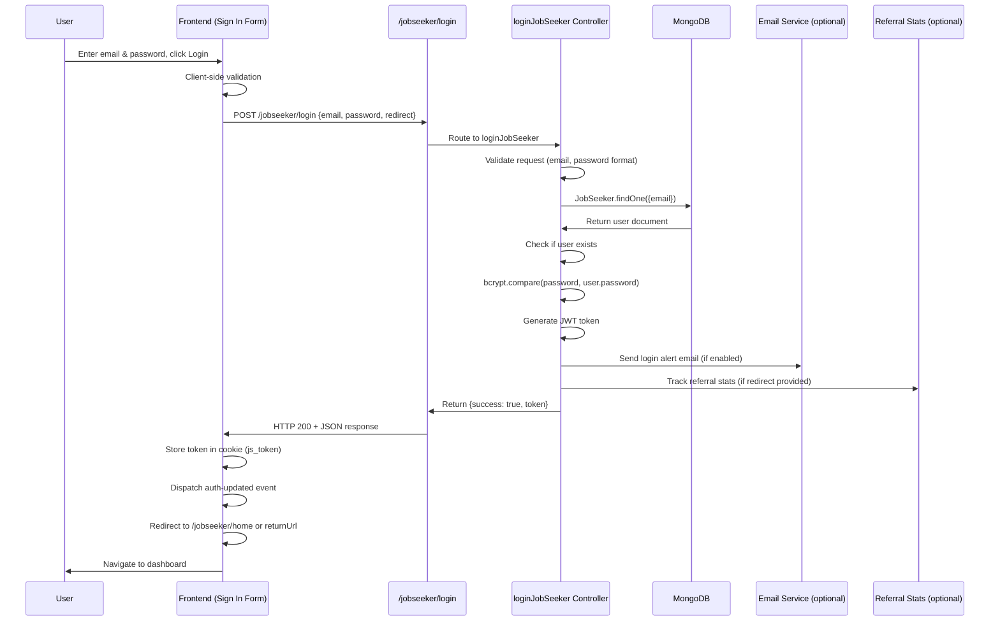

# Feature: Job Seeker Sign In

## Overview

**Purpose**: The Job Seeker Sign In page allows existing job seekers to authenticate and access their account. Users can log in using their email and password, and upon successful authentication, they are redirected to their dashboard or a specified return URL.

**User Story**: As a job seeker, I want to sign in to my account so that I can access my profile, applications, saved jobs, and other personalized features.

**Key Functionality**:
- Email and password authentication
- Form validation (email format, password strength)
- JWT token generation and storage
- Redirect handling (returnUrl support)
- Login alert email notifications (optional)
- Referral tracking support
- Password visibility toggle
- Integration with sign-up and forgot password flows

**Access Level**: Public (No authentication required to access the sign-in page)

**URL Path**: `/signin/jobseeker`

**Query Parameters**:
- `returnUrl` (optional): URL to redirect to after successful login (encoded)
- `register` (optional): If `true`, shows sign-up form instead of sign-in

---

## User Flow

### Primary Flow - Sign In
1. User navigates to `/signin/jobseeker`
2. Page displays sign-in form with email and password fields
3. User enters email and password
4. Client-side validation occurs (email format, password format)
5. User clicks "Login" button
6. Request sent to `/jobseeker/login` API endpoint
7. Backend validates credentials
8. On success: JWT token returned and stored in cookie (`js_token`)
9. Auth update event dispatched to update navigation
10. User redirected to `/jobseeker/home` (or `returnUrl` if provided)

### Alternative Flows
- **Invalid Credentials**: Error message displayed ("Account not found" or "Incorrect password")
- **Validation Error**: Inline validation errors shown for email/password format
- **Network Error**: Generic error message displayed ("Unable to login. Try again.")
- **Switch to Sign Up**: User clicks "Create Account" → Switches to registration form
- **Forgot Password**: User clicks "Forgot Password?" → Opens forgot password modal

### Edge Cases
- User already logged in: Should be redirected (handled by navigation/auth system)
- ReturnUrl provided: User redirected to specified URL after login
- Email alert enabled: Login alert email sent after successful authentication
- Referral tracking: If redirect/returnUrl param exists, referral stats are tracked

---

## Frontend Implementation

### Screen Structure

**Main Page Component**:
- File: `frontend/src/app/signin/jobseeker/page.jsx`
- Type: Client Component (wrapped in Suspense)

**Client Component**:
- File: `frontend/src/app/signin/jobseeker/JobseekerSigninClient.jsx`
- Purpose: Main authentication component handling sign-in, sign-up, and forgot password flows

**Styling**:
- CSS File: `frontend/src/app/signin/jobseeker/page.css`
- CSS Modules: No
- Responsive: Yes (split-screen layout on desktop, stacked on mobile)

### Component Hierarchy

```
Page (page.jsx)
  └── Suspense
      └── JobseekerSigninClient (JobseekerSigninClient.jsx)
          ├── Left Side (Image Section)
          │   ├── Background Image
          │   └── Overlay (Text)
          ├── Right Side (Form Section)
          │   ├── Auth Box
          │   │   ├── Title & Subtitle
          │   │   ├── Sign In Form (mode === "signin")
          │   │   │   ├── Email Input
          │   │   │   ├── Password Input (with visibility toggle)
          │   │   │   ├── Login Button
          │   │   │   └── Forgot Password Link
          │   │   ├── Sign Up Form (mode === "signup") - *Separate feature*
          │   │   └── Error Messages
          │   └── Switch Mode Section (Sign In ↔ Sign Up)
          └── Forgot Password Modal (conditional)
```

### State Management

**Local State (Sign In)**:
```javascript
const [email, setEmail] = useState("");
const [password, setPassword] = useState("");
const [showPass, setShowPass] = useState(false); // Password visibility
const [loading, setLoading] = useState(false); // Loading state
const [otpError, setOtpError] = useState(""); // Error message (shared with other flows)
const [mode, setMode] = useState("signin"); // "signin" or "signup"
```

**Router & Search Params**:
```javascript
const router = useRouter();
const searchParams = useSearchParams();
```

**Cookie Management**:
- Uses `js-cookie` library for cookie operations
- Token stored as `js_token` cookie

### Form Handling

**Form Fields**:

1. **Email Address**
   - Type: `email`
   - Required: Yes
   - Validation: Email regex pattern (`/\S+@\S+\.\S+/`)
   - Auto-complete: `email`
   - Auto-lowercase: Yes
   - Error: "Enter a valid email" (if invalid format)

2. **Password**
   - Type: `password` (toggleable to `text`)
   - Required: Yes
   - Validation: Password strength requirements
     - Minimum 8 characters
     - Must include uppercase letter
     - Must include lowercase letter
     - Must include number
     - Must include special character
   - Auto-complete: `current-password`
   - Visibility toggle: Eye icon to show/hide password
   - Error: Detailed validation message if requirements not met

**Client-Side Validation**:
```javascript
const isEmailValid = /\S+@\S+\.\S+/.test(email);

const isPasswordValid =
  password.length >= 8 &&
  /[A-Z]/.test(password) &&
  /[a-z]/.test(password) &&
  /[0-9]/.test(password) &&
  /[^A-Za-z0-9]/.test(password);

const formValid = isEmailValid && isPasswordValid;
```

**Form Submission**:
```javascript
const handleLogin = async () => {
  try {
    setLoading(true);
    setOtpError("");

    // Get returnUrl from query params
    const returnUrl = searchParams.get('returnUrl');
    
    const res = await axios.post(
      `${process.env.NEXT_PUBLIC_JOBSEEKER_URL}/login`,
      {
        email: email.toLowerCase(),
        password,
        redirect: returnUrl || null, // Pass returnUrl as redirect to backend
      }
    );

    if (res.data.success) {
      Cookies.set("js_token", res.data.token);
      window.dispatchEvent(new Event("auth-updated"));
      
      // Redirect to returnUrl if provided, otherwise to home
      const returnUrl = searchParams.get('returnUrl');
      const redirectPath = returnUrl ? decodeURIComponent(returnUrl) : "/jobseeker/home";
      router.push(redirectPath);
      return;
    }

    // If login failed
    setOtpError(res.data.message || "Login failed");

  } catch (err) {
    setOtpError("Unable to login. Try again.");
  } finally {
    setLoading(false);
  }
};
```

### API Integration

**Endpoints Called**:

| Endpoint | Method | Purpose | Authentication |
|----------|--------|---------|----------------|
| `/jobseeker/login` | POST | Authenticate user and get JWT token | Not required |

**API Client Functions**:
```javascript
// Direct axios call in handleLogin function
const res = await axios.post(
  `${process.env.NEXT_PUBLIC_JOBSEEKER_URL}/login`,
  {
    email: email.toLowerCase(),
    password,
    redirect: returnUrl || null
  }
);
```

**Environment Variables**:
- `NEXT_PUBLIC_JOBSEEKER_URL`: Base URL for job seeker API (e.g., `http://localhost:5001/jobseeker`)

### UI States

**Loading State**:
- Submit button shows circular progress indicator
- Form fields are disabled
- Button text changes to show loading state

**Error State**:
- Error message displayed below form
- Specific error messages:
  - "Account not found with this email"
  - "Incorrect password"
  - "Unable to login. Try again." (network/unknown errors)
  - Client-side validation errors for email/password format

**Success State**:
- Token stored in cookie
- Auth update event dispatched
- User redirected to dashboard or returnUrl
- No visual feedback on sign-in page (redirects immediately)

**Empty State**:
- Form starts with empty fields
- Validation errors hidden until user interacts

### Password Visibility Toggle

```javascript
const [showPass, setShowPass] = useState(false);

// In JSX
<input
  type={showPass ? "text" : "password"}
  // ... other props
/>
<span className="eye-icon" onClick={() => setShowPass(!showPass)}>
  {showPass ? <FaEyeSlash /> : <FaEye />}
</span>
```

### Mode Switching (Sign In ↔ Sign Up)

```javascript
const switchMode = (m) => {
  const returnUrl = searchParams.get("returnUrl");
  const returnUrlParam = returnUrl ? `&returnUrl=${encodeURIComponent(returnUrl)}` : "";
  
  if (m === "signup") {
    router.replace(`/signin/jobseeker?register=true${returnUrlParam}`);
    resetSignupFlow();
  } else {
    router.replace(`/signin/jobseeker${returnUrl ? `?returnUrl=${encodeURIComponent(returnUrl)}` : ""}`);
    // Reset form fields
  }
};
```

---

## Backend Implementation

### API Endpoint

**Route Definition**:
```javascript
// File: backend/src/routes/jobSeekerRoutes.js
router.post("/login", jobSeekerController.loginJobSeeker);
```

**Full Endpoint Path**: `/jobseeker/login`

**HTTP Method**: POST

**Authentication Required**: No (Public endpoint for login)

### Middleware Chain

**No middleware required** (public endpoint)

### Controller

**Controller Function**:
```javascript
// File: backend/src/controllers/jobSeekerController.js
const loginJobSeeker = async (req, res) => {
  // Authentication logic
};
```

**Request Validation**:
```javascript
// Required fields check
if (!email || !password) {
  return res.status(400).json({
    success: false,
    message: "Email and password are required",
  });
}

// Email format validation
if (!emailRegex.test(email)) {
  return res.status(400).json({
    success: false,
    message: "Enter a valid email",
  });
}

// Password format validation
if (!passwordRegex.test(password)) {
  return res.status(400).json({
    success: false,
    message: "Password must contain uppercase, lowercase, number, special character & minimum 8 characters",
  });
}
```

**Response Format**:
```javascript
// Success Response
{
  success: true,
  message: "Login successful",
  token: "jwt_token_here"
}

// Error Response - Account Not Found
{
  success: false,
  message: "Account not found with this email"
}

// Error Response - Incorrect Password
{
  success: false,
  message: "Incorrect password"
}

// Error Response - Validation Error
{
  success: false,
  message: "Email and password are required"
}
```

### Authentication Logic

**Process Flow**:
1. Validate request body (email, password presence)
2. Validate email format
3. Validate password format
4. Find user by email (case-insensitive)
5. Check if user exists
6. Compare password with hashed password (bcrypt)
7. Generate JWT token
8. (Optional) Send login alert email
9. (Optional) Track referral stats
10. Return token

**Code Implementation**:
```javascript
// Find user
const user = await JobSeeker.findOne({ email: email.toLowerCase() });

if (!user) {
  return res.status(200).json({
    success: false,
    message: "Account not found with this email",
  });
}

// Verify password
const isMatch = await bcrypt.compare(password, user.password);

if (!isMatch) {
  return res.status(200).json({
    success: false,
    message: "Incorrect password",
  });
}

// Generate JWT token
const token = jwt.sign(
  { userId: user._id, userName: user.fullName },
  process.env.JWT_SECRET || "A123B456cdef1234567"
);
```

### Database Operations

**Models Used**:
1. **JobSeeker**
   - File: `backend/src/models/jobSeeker.js`
   - Schema fields used:
     - `email`: Unique identifier (lowercase)
     - `password`: Hashed password (bcrypt)
     - `fullName`: Used in JWT token
     - `emailAlertOnLogin`: Boolean flag for email alerts
     - `_id`: User ID used in JWT token

2. **JobSeekerReferralStats** (optional, for referral tracking)
   - File: `backend/src/models/jobSeekerReferralStats.js`
   - Used when `redirect`/`returnUrl` parameter is provided

**Database Queries**:
```javascript
// Find user by email (case-insensitive lookup)
const user = await JobSeeker.findOne({ email: email.toLowerCase() });
```

**Operations**:
- Read: Find user by email
- (Optional) Create/Update: Referral stats tracking
- No updates to JobSeeker document on login

**Password Verification**:
- Uses `bcrypt.compare()` to verify plain password against hashed password
- Passwords are hashed using bcrypt with salt rounds of 10

### JWT Token Generation

**Token Payload**:
```javascript
{
  userId: user._id,        // MongoDB ObjectId
  userName: user.fullName  // User's full name
}
```

**Token Configuration**:
- Secret: `process.env.JWT_SECRET` or default fallback
- Expiration: Not set (default behavior, typically long-lived)
- Algorithm: Default (HS256)

### Email Alert (Optional)

**Condition**: Only if `user.emailAlertOnLogin === true`

**Email Content**:
- Subject: "Login Alert - Atract"
- HTML content with login details (time, email)
- Includes security notice if login was unauthorized

**Implementation**:
```javascript
if (user.emailAlertOnLogin) {
  try {
    const loginTime = new Date().toLocaleString('en-US', {
      timeZone: 'Asia/Kolkata',
      dateStyle: 'medium',
      timeStyle: 'short'
    });

    // HTML email content
    await sendMail(user.email, "Login Alert - Atract", htmlContent);
  } catch (emailError) {
    console.error("Failed to send login alert email:", emailError);
    // Don't fail login if email fails
  }
}
```

### Referral Tracking (Optional)

**Condition**: Only if `redirect`/`returnUrl` parameter is provided in request

**Tracking Logic**:
1. Check if redirect parameter exists (in query or body)
2. Check if user has resume saved
3. Check if user has other profile details filled
4. Create or update `JobSeekerReferralStats` document
5. Track referral source and user completion status

**Implementation**:
```javascript
const redirectTo = req.query.redirect || req.body.redirect || req.query.returnUrl || req.body.returnUrl;
if (redirectTo) {
  // Check resume status
  const hasResume = user.resume && user.resume.trim().length > 0;
  
  // Check other profile details
  const hasOtherDetails = !!(
    user.mobileNumber ||
    user.skills?.length > 0 ||
    // ... other fields
  );
  
  // Create or update referral stats
  let referralStats = await JobSeekerReferralStats.findOne({ userId: user._id });
  if (!referralStats) {
    await JobSeekerReferralStats.create({
      userId: user._id,
      redirectTo: redirectTo,
      alreadyHadAccount: true,
      isResumeSaved: hasResume,
      isOtherDetailsFilled: hasOtherDetails,
    });
  } else {
    // Update existing document
  }
}
```

---

## Data Flow

### Complete Request-Response Cycle



### Request Payload Example

```json
{
  "email": "user@example.com",
  "password": "SecurePass123!",
  "redirect": "/jobseeker/home" // optional
}
```

### Response Payload Examples

**Success Response**:
```json
{
  "success": true,
  "message": "Login successful",
  "token": "eyJhbGciOiJIUzI1NiIsInR5cCI6IkpXVCJ9.eyJ1c2VySWQiOiI2NWExYjJjM2Q0ZTVmNmcyaDhpOWowazEiLCJ1c2VyTmFtZSI6IkpvaG4gRG9lIiwiaWF0IjoxNzA1MzIxNjAwfQ.example"
}
```

**Error Response - Account Not Found**:
```json
{
  "success": false,
  "message": "Account not found with this email"
}
```

**Error Response - Incorrect Password**:
```json
{
  "success": false,
  "message": "Incorrect password"
}
```

**Error Response - Validation Error**:
```json
{
  "success": false,
  "message": "Email and password are required"
}
```

### Frontend Data Processing

**Token Storage**:
```javascript
// Store token in cookie
Cookies.set("js_token", res.data.token);

// Dispatch event to update auth state across app
window.dispatchEvent(new Event("auth-updated"));
```

**Redirect Handling**:
```javascript
const returnUrl = searchParams.get('returnUrl');
const redirectPath = returnUrl ? decodeURIComponent(returnUrl) : "/jobseeker/home";
router.push(redirectPath);
```

---

## Error Handling

### Frontend Error Handling

**Error Types**:
- Network errors: Caught in try-catch, displays "Unable to login. Try again."
- API errors: Checks `res.data.success`, displays `res.data.message`
- Validation errors: Client-side validation with inline error messages

**Error Display**:
- Error message displayed in `otpError` state (shared variable name with other flows)
- Errors shown below form fields
- Inline validation errors for email/password format
- Specific error messages from backend displayed to user

**Error Recovery**:
- User can correct email/password and retry
- Form remains functional after error
- No data loss (fields retain values)

### Backend Error Handling

**Error Types**:
- Validation errors: Returns 400 with validation message
- User not found: Returns 200 with `success: false` (for security, doesn't reveal if email exists)
- Incorrect password: Returns 200 with `success: false` (for security)
- Server errors: Returns 500 with generic error message

**Error Response Status Codes**:
- 200: Used for authentication failures (security best practice - doesn't reveal if email exists)
- 400: Used for validation errors (missing fields, invalid format)
- 500: Used for server errors

**Security Considerations**:
- Authentication failures return 200 status (not 401/403) to prevent email enumeration
- Generic error messages prevent information leakage
- Password comparison uses bcrypt (timing-safe)
- Email stored in lowercase for case-insensitive lookup

---

## Security Features

### Password Security
- Passwords hashed using bcrypt with salt rounds of 10
- Password comparison uses `bcrypt.compare()` (timing-safe)
- Password requirements enforced (uppercase, lowercase, number, special char, min 8 chars)

### JWT Token Security
- Token signed with secret key (from environment variable)
- Token contains user ID and name (not sensitive data)
- Token stored in HTTP-only cookie (recommended, though currently using js-cookie)

### Input Validation
- Email format validation (regex)
- Password format validation (regex)
- Email normalized to lowercase
- SQL injection prevention (using Mongoose, parameterized queries)

### Authentication Security
- Generic error messages (prevent email enumeration)
- Failed login attempts don't reveal if email exists
- Password never logged or exposed

---

## UI/UX Details

### Layout

**Desktop**:
- Split-screen layout (50/50)
- Left side: Background image with overlay text
- Right side: White background with form
- Form centered vertically

**Mobile**:
- Stacked layout (image on top, form below)
- Full-width components
- Responsive padding and spacing

### Form Elements

**Email Input**:
- Placeholder: "Enter your email"
- Auto-complete: `email`
- Auto-focus: No (for better UX)
- Real-time validation feedback

**Password Input**:
- Placeholder: "Enter your password"
- Auto-complete: `current-password`
- Visibility toggle icon (eye/eye-slash)
- Real-time validation feedback with detailed requirements

**Login Button**:
- Primary button style
- Disabled state when form invalid or loading
- Loading indicator (circular progress) when submitting
- Full-width button

### Visual Feedback

**Loading States**:
- Button shows circular progress indicator
- Form fields disabled
- Button text changes

**Validation States**:
- Inline error messages below fields
- Error styling (red text)
- Real-time validation as user types

**Error States**:
- Error message displayed below form
- Error styling consistent with validation errors

### Accessibility

- Semantic HTML (form, input, label elements)
- Proper label associations
- Auto-complete attributes for password managers
- Keyboard navigation support
- ARIA labels where needed

---

## Environment Variables

**Frontend**:
- `NEXT_PUBLIC_JOBSEEKER_URL`: Base URL for job seeker API (e.g., `http://localhost:5001/jobseeker`)

**Backend**:
- `JWT_SECRET`: Secret key for JWT token signing (required)
- Email service configuration (for login alerts): See email service setup

---

## Testing Considerations

### Test Scenarios

**Happy Path**:
1. User enters valid email and password → Login successful → Redirected to dashboard
2. User provides returnUrl → Login successful → Redirected to returnUrl
3. User with email alert enabled → Login successful → Email sent

**Error Cases**:
1. User enters non-existent email → Error: "Account not found with this email"
2. User enters incorrect password → Error: "Incorrect password"
3. User enters invalid email format → Client-side validation error
4. User enters weak password → Client-side validation error
5. Network error → Error: "Unable to login. Try again."
6. Server error → Error: "Internal server error"

**Edge Cases**:
1. Email with mixed case → Normalized to lowercase
2. User already logged in → Should redirect (handled by auth system)
3. returnUrl with special characters → Properly encoded/decoded
4. Email alert fails → Login still succeeds (error logged)
5. Referral tracking fails → Login still succeeds (error logged)
6. Very long email/password → Handled by input maxLength (if set)

**Security Testing**:
1. SQL injection attempts → Prevented by Mongoose
2. XSS attempts → Prevented by React's default escaping
3. CSRF attempts → Should use CSRF tokens (if implemented)
4. Brute force attempts → Rate limiting should be implemented
5. Token manipulation → Invalid tokens rejected by auth middleware

---

## Related Features

- **Job Seeker Sign Up**: Same page component, different mode (`mode === "signup"`)
- **Forgot Password**: Modal within same page component
- **Job Seeker Dashboard** (`/jobseeker/home`): Default redirect destination
- **Job Seeker Profile**: Accessible after authentication
- **Job Seeker Settings**: Where email alert preferences are configured
- **Referral Stats**: Tracks referral source when redirect parameter provided

---

## Additional Notes

**Dependencies**:
- `axios`: HTTP client for API calls
- `js-cookie`: Cookie management
- `next/navigation`: Next.js routing
- `react-icons/fa`: Icon library (FaEye, FaEyeSlash)
- `@mui/material`: Material-UI for loading spinner

**Known Issues**:
- Token stored using `js-cookie` instead of HTTP-only cookie (security consideration)
- No rate limiting on login attempts (should be implemented)
- No account lockout after multiple failed attempts (should be implemented)

**Future Enhancements**:
- Implement HTTP-only cookies for token storage
- Add rate limiting for login attempts
- Add account lockout after N failed attempts
- Add "Remember me" functionality
- Add social login (Google, LinkedIn, etc.)
- Add 2FA (two-factor authentication)
- Add device fingerprinting for security

**Performance Considerations**:
- Password hashing is CPU-intensive (bcrypt), but acceptable for login
- Database query is simple (indexed email lookup)
- Email sending is async and doesn't block login
- Referral tracking is async and doesn't block login

**User Experience**:
- Form validation provides immediate feedback
- Password visibility toggle improves UX
- Loading states prevent duplicate submissions
- Error messages are user-friendly
- Smooth transition to dashboard after login

---

## Code References

### Frontend Files
- `frontend/src/app/signin/jobseeker/page.jsx` - Page entry point (12 lines)
- `frontend/src/app/signin/jobseeker/JobseekerSigninClient.jsx` - Main component (1041 lines)
- `frontend/src/app/signin/jobseeker/page.css` - Styling

### Backend Files
- `backend/src/routes/jobSeekerRoutes.js` - Route definition (line 19)
- `backend/src/controllers/jobSeekerController.js` - Controller function `loginJobSeeker` (lines 293-471)
- `backend/src/models/jobSeeker.js` - JobSeeker model schema
- `backend/src/models/jobSeekerReferralStats.js` - Referral stats model (optional)

---

*Last Updated: [Current Date]*
*Documented By: TSD Documentation System*

