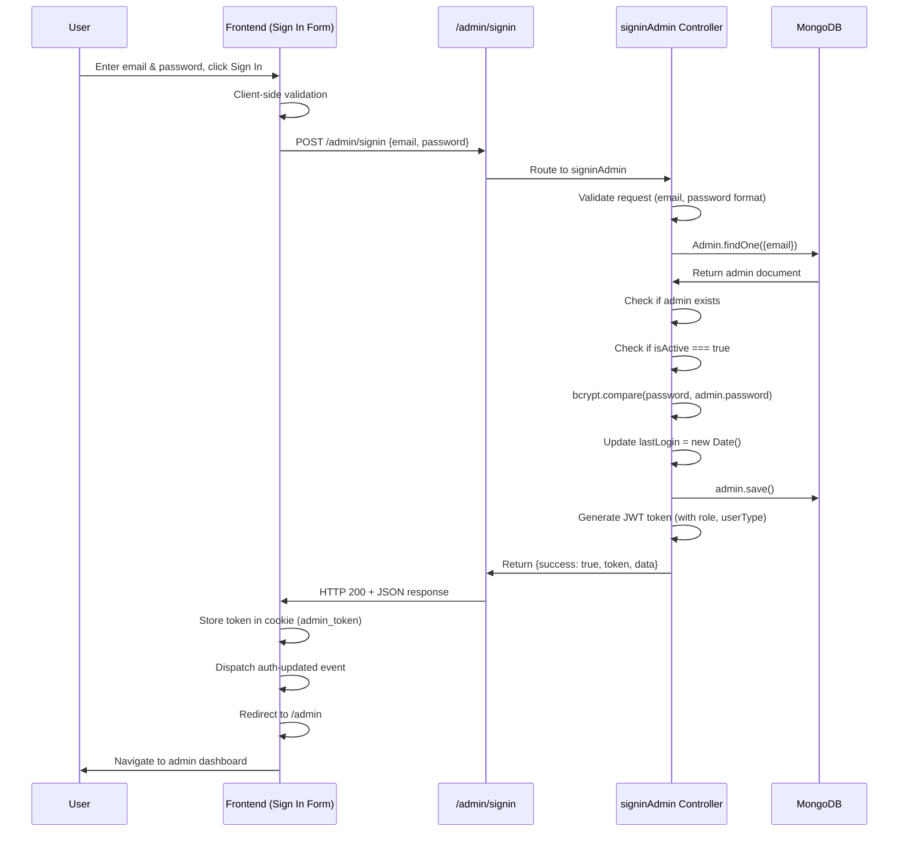

# Feature: Admin Sign In

## Overview

**Purpose**: The Admin Sign In page allows system administrators to authenticate and access the admin dashboard. This is a simplified authentication interface specifically designed for administrative users with enhanced security features.

**User Story**: As an admin, I want to sign in to my account so that I can access the admin dashboard, manage system settings, monitor job alerts, and perform administrative tasks.

**Key Functionality**:
- Email and password authentication
- Form validation (email format, password strength)
- JWT token generation and storage
- Account activation status check
- Last login timestamp update
- Password visibility toggle
- Admin-specific JWT token with role information

**Access Level**: Public (No authentication required to access the sign-in page)

**URL Path**: `/signin/admin`

**Query Parameters**: None

---

## User Flow

### Primary Flow - Sign In
1. User navigates to `/signin/admin`
2. Page displays sign-in form with email and password fields
3. User enters email and password
4. Client-side validation occurs (email format, password format)
5. User clicks "Sign In" button
6. Request sent to `/admin/signin` API endpoint
7. Backend validates credentials
8. Backend checks if account is active
9. On success: JWT token returned and stored in cookie (`admin_token`)
10. Last login timestamp updated
11. Auth update event dispatched to update navigation
12. User redirected to `/admin` (admin dashboard)

### Alternative Flows
- **Invalid Credentials**: Error message displayed ("Invalid email or password" - combined message)
- **Account Deactivated**: Error message displayed ("Account is deactivated. Please contact system administrator.") with 403 status
- **Validation Error**: Inline validation errors shown for email/password format
- **Network Error**: Generic error message displayed ("Unable to sign in. Please try again.")

### Edge Cases
- User already logged in: Should be redirected (handled by navigation/auth system)
- Deactivated account: Returns 403 status code with deactivation message
- Network failure: Error message displayed, user can retry

---

## Frontend Implementation

### Screen Structure

**Main Page Component**:
- File: `frontend/src/app/signin/admin/page.jsx`
- Type: Client Component (wrapped in Suspense)

**Client Component**:
- File: `frontend/src/app/signin/admin/AdminSigninClient.jsx`
- Purpose: Admin authentication component (simplified, no sign-up or forgot password flows)

**Styling**:
- CSS File: `frontend/src/app/signin/admin/page.css`
- CSS Modules: No
- Responsive: Yes (centered layout)

### Component Hierarchy

```
Page (page.jsx)
  └── Suspense
      └── AdminSigninClient (AdminSigninClient.jsx)
          └── Admin Sign In Container
              └── Sign In Box
                  ├── Title & Subtitle
                  └── Sign In Form
                      ├── Email Input
                      ├── Password Input (with visibility toggle)
                      ├── Sign In Button
                      └── Error Messages
```

**Key Differences from Other Sign-In Pages**:
- No split-screen layout (centered single form)
- No image/visual elements
- No sign-up option
- No forgot password option
- Simpler, more focused UI

### State Management

**Local State**:
```javascript
const [email, setEmail] = useState("");
const [password, setPassword] = useState("");
const [showPass, setShowPass] = useState(false); // Password visibility
const [loading, setLoading] = useState(false); // Loading state
const [error, setError] = useState(""); // Error message
```

**Router**:
```javascript
const router = useRouter();
```

**Cookie Management**:
- Uses `js-cookie` library for cookie operations
- Token stored as `admin_token` cookie

### Form Handling

**Form Fields**:

1. **Email Address**
   - Type: `email`
   - Required: Yes
   - Validation: Email regex pattern (`/\S+@\S+\.\S+/`)
   - Auto-complete: `email`
   - Auto-lowercase: Yes
   - Error: "Enter a valid email" (if invalid format)

2. **Password**
   - Type: `password` (toggleable to `text`)
   - Required: Yes
   - Validation: Password strength requirements
     - Minimum 8 characters
     - Must include uppercase letter
     - Must include lowercase letter
     - Must include number
     - Must include special character
   - Auto-complete: `current-password`
   - Visibility toggle: Eye icon to show/hide password
   - Error: Detailed validation message if requirements not met

**Client-Side Validation**:
```javascript
const isEmailValid = /\S+@\S+\.\S+/.test(email);

const isPasswordValid =
  password.length >= 8 &&
  /[A-Z]/.test(password) &&
  /[a-z]/.test(password) &&
  /[0-9]/.test(password) &&
  /[^A-Za-z0-9]/.test(password);

const formValid = isEmailValid && isPasswordValid;
```

**Form Submission**:
```javascript
const handleSignin = async (e) => {
  e.preventDefault();
  
  if (!formValid) {
    return;
  }

  try {
    setLoading(true);
    setError("");

    // Get base URL from employer URL or use default
    const employerUrl = process.env.NEXT_PUBLIC_EMPLOYER_URL || '';
    const baseUrl = employerUrl.includes('/employer') 
      ? employerUrl.replace('/employer', '') 
      : (process.env.NEXT_PUBLIC_BACKEND_URL || 'http://localhost:5001');
    
    const res = await axios.post(
      `${baseUrl}/admin/signin`,
      {
        email: email.toLowerCase(),
        password,
      }
    );

    if (res.data.success) {
      Cookies.set("admin_token", res.data.token);
      window.dispatchEvent(new Event("auth-updated"));
      router.push("/admin");
      return;
    }

    // If signin failed
    setError(res.data.message || "Sign in failed");

  } catch (err) {
    setError(
      err.response?.data?.message || "Unable to sign in. Please try again."
    );
  } finally {
    setLoading(false);
  }
};
```

**Key Differences**:
- No returnUrl/redirect parameter handling
- Always redirects to `/admin`
- Base URL derivation from environment variables (different approach)
- Simpler error handling

### API Integration

**Endpoints Called**:

| Endpoint | Method | Purpose | Authentication |
|----------|--------|---------|----------------|
| `/admin/signin` | POST | Authenticate admin and get JWT token | Not required |

**API Client Functions**:
```javascript
// Base URL derivation
const employerUrl = process.env.NEXT_PUBLIC_EMPLOYER_URL || '';
const baseUrl = employerUrl.includes('/employer') 
  ? employerUrl.replace('/employer', '') 
  : (process.env.NEXT_PUBLIC_BACKEND_URL || 'http://localhost:5001');

// Direct axios call
const res = await axios.post(
  `${baseUrl}/admin/signin`,
  {
    email: email.toLowerCase(),
    password,
  }
);
```

**Environment Variables**:
- `NEXT_PUBLIC_EMPLOYER_URL`: Used to derive base URL (optional)
- `NEXT_PUBLIC_BACKEND_URL`: Fallback base URL (optional)
- Default: `http://localhost:5001`

### UI States

**Loading State**:
- Submit button shows circular progress indicator
- Form fields are disabled
- Button text changes to show loading state

**Error State**:
- Error message displayed below form
- Specific error messages:
  - "Invalid email or password" (combined message for both email/password errors)
  - "Account is deactivated. Please contact system administrator." (403 status)
  - "Unable to sign in. Please try again." (network/unknown errors)
  - Client-side validation errors for email/password format

**Success State**:
- Token stored in cookie
- Auth update event dispatched
- User redirected to admin dashboard
- No visual feedback on sign-in page (redirects immediately)

**Empty State**:
- Form starts with empty fields
- Validation errors hidden until user interacts

### Password Visibility Toggle

```javascript
const [showPass, setShowPass] = useState(false);

// In JSX
<input
  type={showPass ? "text" : "password"}
  // ... other props
/>
<span 
  className="admin-signin-eye-icon" 
  onClick={() => setShowPass(!showPass)}
>
  {showPass ? <FaEyeSlash /> : <FaEye />}
</span>
```

---

## Backend Implementation

### API Endpoint

**Route Definition**:
```javascript
// File: backend/src/routes/adminRoutes.js
router.post("/signin", adminController.signinAdmin);
```

**Full Endpoint Path**: `/admin/signin`

**HTTP Method**: POST

**Authentication Required**: No (Public endpoint for admin sign-in)

### Middleware Chain

**No middleware required** (public endpoint)

### Controller

**Controller Function**:
```javascript
// File: backend/src/controllers/adminController.js
const signinAdmin = async (req, res) => {
  // Authentication logic
};
```

**Request Validation**:
```javascript
// Required fields check
if (!email || !password) {
  return res.status(400).json({
    success: false,
    message: "Email and password are required",
  });
}

// Email format validation
if (!emailRegex.test(email)) {
  return res.status(400).json({
    success: false,
    message: "Enter a valid email",
  });
}

// Password format validation
if (!passwordRegex.test(password)) {
  return res.status(400).json({
    success: false,
    message: "Password must contain uppercase, lowercase, number, special character & minimum 8 characters",
  });
}
```

**Response Format**:
```javascript
// Success Response
{
  success: true,
  message: "Sign in successful",
  token: "jwt_token_here",
  data: {
    _id: "admin_id",
    fullName: "Admin Name",
    email: "admin@example.com",
    role: "admin",
    lastLogin: "2024-01-15T10:30:00.000Z"
  }
}

// Error Response - Account Not Found / Incorrect Password
{
  success: false,
  message: "Invalid email or password"
}

// Error Response - Account Deactivated
{
  success: false,
  message: "Account is deactivated. Please contact system administrator."
}

// Error Response - Validation Error
{
  success: false,
  message: "Email and password are required"
}
```

### Authentication Logic

**Process Flow**:
1. Validate request body (email, password presence)
2. Validate email format
3. Validate password format
4. Find admin by email (case-insensitive)
5. Check if admin exists
6. Check if account is active (`isActive` flag)
7. Compare password with hashed password (bcrypt)
8. Update last login timestamp
9. Generate JWT token (with role and userType)
10. Return token and admin data

**Code Implementation**:
```javascript
// Find admin
const admin = await Admin.findOne({ email: email.toLowerCase() });

if (!admin) {
  return res.status(200).json({
    success: false,
    message: "Invalid email or password", // Combined message for security
  });
}

// Check if account is active
if (!admin.isActive) {
  return res.status(403).json({
    success: false,
    message: "Account is deactivated. Please contact system administrator.",
  });
}

// Verify password
const isMatch = await bcrypt.compare(password, admin.password);

if (!isMatch) {
  return res.status(200).json({
    success: false,
    message: "Invalid email or password", // Combined message for security
  });
}

// Update last login
admin.lastLogin = new Date();
await admin.save();

// Generate JWT token
const token = jwt.sign(
  { userId: admin._id, userName: admin.fullName, role: admin.role, userType: 'admin' },
  process.env.ADMIN_JWT_SECRET || process.env.JWT_SECRET || "A123B456cdef1234567"
);
```

**Key Differences from Other Sign-Ins**:
- Account activation check (`isActive` flag) - returns 403 if deactivated
- Updates `lastLogin` timestamp on successful login
- Combined error message for email/password (enhanced security)
- JWT token includes `role` and `userType: 'admin'`
- Can use separate `ADMIN_JWT_SECRET` environment variable
- Returns admin profile data in response

### Database Operations

**Models Used**:
1. **Admin**
   - File: `backend/src/models/admin.js`
   - Schema fields used:
     - `email`: Unique identifier (lowercase)
     - `password`: Hashed password (bcrypt)
     - `fullName`: Used in JWT token
     - `role`: Admin role (used in JWT token)
     - `isActive`: Boolean flag for account status
     - `lastLogin`: Timestamp (updated on login)
     - `_id`: Admin ID used in JWT token

**Database Queries**:
```javascript
// Find admin by email (case-insensitive lookup)
const admin = await Admin.findOne({ email: email.toLowerCase() });

// Update last login (after successful authentication)
admin.lastLogin = new Date();
await admin.save();
```

**Operations**:
- Read: Find admin by email
- Update: Update `lastLogin` timestamp on successful login

**Password Verification**:
- Uses `bcrypt.compare()` to verify plain password against hashed password
- Passwords are hashed using bcrypt with salt rounds of 10

### JWT Token Generation

**Token Payload**:
```javascript
{
  userId: admin._id,        // MongoDB ObjectId
  userName: admin.fullName, // Admin's full name
  role: admin.role,         // Admin role (admin, super_admin, moderator, support)
  userType: 'admin'         // User type identifier
}
```

**Token Configuration**:
- Secret: `process.env.ADMIN_JWT_SECRET` or `process.env.JWT_SECRET` or default fallback
- Expiration: Not set (default behavior, typically long-lived)
- Algorithm: Default (HS256)

**Key Differences**:
- Can use separate `ADMIN_JWT_SECRET` for enhanced security (isolates admin tokens)
- Includes `role` field for role-based access control
- Includes `userType: 'admin'` for easy identification in middleware

---

## Data Flow

### Complete Request-Response Cycle



### Request Payload Example

```json
{
  "email": "admin@atract.com",
  "password": "SecurePass123!"
}
```

### Response Payload Examples

**Success Response**:
```json
{
  "success": true,
  "message": "Sign in successful",
  "token": "eyJhbGciOiJIUzI1NiIsInR5cCI6IkpXVCJ9.eyJ1c2VySWQiOiI2NWExYjJjM2Q0ZTVmNmcyaDhpOWowazEiLCJ1c2VyTmFtZSI6IkFkbWluIFVzZXIiLCJyb2xlIjoiYWRtaW4iLCJ1c2VyVHlwZSI6ImFkbWluIiwiaWF0IjoxNzA1MzIxNjAwfQ.example",
  "data": {
    "_id": "65a1b2c3d4e5f6g7h8i9j0k1",
    "fullName": "Admin User",
    "email": "admin@atract.com",
    "role": "admin",
    "lastLogin": "2024-01-15T10:30:00.000Z"
  }
}
```

**Error Response - Invalid Credentials**:
```json
{
  "success": false,
  "message": "Invalid email or password"
}
```

**Error Response - Account Deactivated**:
```json
{
  "success": false,
  "message": "Account is deactivated. Please contact system administrator."
}
```

**Error Response - Validation Error**:
```json
{
  "success": false,
  "message": "Email and password are required"
}
```

### Frontend Data Processing

**Token Storage**:
```javascript
// Store token in cookie (admin token)
Cookies.set("admin_token", res.data.token);

// Dispatch event to update auth state across app
window.dispatchEvent(new Event("auth-updated"));
```

**Redirect Handling**:
```javascript
// Always redirect to admin dashboard
router.push("/admin");
```

**Base URL Derivation**:
```javascript
// Derive base URL from environment variables
const employerUrl = process.env.NEXT_PUBLIC_EMPLOYER_URL || '';
const baseUrl = employerUrl.includes('/employer') 
  ? employerUrl.replace('/employer', '') 
  : (process.env.NEXT_PUBLIC_BACKEND_URL || 'http://localhost:5001');
```

---

## Error Handling

### Frontend Error Handling

**Error Types**:
- Network errors: Caught in try-catch, displays "Unable to sign in. Please try again."
- API errors: Checks `res.data.success`, displays `res.data.message`
- Validation errors: Client-side validation with inline error messages
- 403 errors: Displays deactivation message (handled by axios error response)

**Error Display**:
- Error message displayed in `error` state
- Errors shown below form
- Inline validation errors for email/password format
- Specific error messages from backend displayed to user

**Error Recovery**:
- User can correct email/password and retry
- Form remains functional after error
- No data loss (fields retain values)

### Backend Error Handling

**Error Types**:
- Validation errors: Returns 400 with validation message
- Admin not found: Returns 200 with `success: false` and combined message (for security)
- Incorrect password: Returns 200 with `success: false` and combined message (for security)
- Account deactivated: Returns 403 with deactivation message
- Server errors: Returns 500 with generic error message

**Error Response Status Codes**:
- 200: Used for authentication failures (security best practice - doesn't reveal if email exists)
- 400: Used for validation errors (missing fields, invalid format)
- 403: Used for deactivated accounts (Forbidden)
- 500: Used for server errors

**Security Considerations**:
- Authentication failures return 200 status with combined "Invalid email or password" message (prevents email enumeration)
- Generic error messages prevent information leakage
- Password comparison uses bcrypt (timing-safe)
- Email stored in lowercase for case-insensitive lookup
- Separate check for account deactivation (returns 403 to distinguish from invalid credentials)

---

## Security Features

### Password Security
- Passwords hashed using bcrypt with salt rounds of 10
- Password comparison uses `bcrypt.compare()` (timing-safe)
- Password requirements enforced (uppercase, lowercase, number, special char, min 8 chars)

### JWT Token Security
- Token signed with secret key (from environment variable)
- Can use separate `ADMIN_JWT_SECRET` for admin tokens (enhanced isolation)
- Token contains user ID, name, role, and userType (not sensitive data)
- Token stored in HTTP-only cookie (recommended, though currently using js-cookie)

### Account Security
- Account activation check (`isActive` flag) - prevents access to deactivated accounts
- Last login tracking for audit purposes
- Role-based access control (role stored in JWT token)

### Input Validation
- Email format validation (regex)
- Password format validation (regex)
- Email normalized to lowercase
- SQL injection prevention (using Mongoose, parameterized queries)

### Authentication Security
- Combined error messages for email/password (prevent email enumeration)
- Failed login attempts don't reveal if email exists
- Password never logged or exposed
- Account deactivation returns 403 (distinct from invalid credentials)

---

## UI/UX Details

### Layout

**Design**:
- Centered layout (no split-screen)
- Single column form
- Minimal, professional design
- Focused on functionality (no decorative elements)

**Mobile**:
- Responsive centered layout
- Full-width form on mobile
- Appropriate padding and spacing

### Form Elements

**Email Input**:
- Placeholder: "Enter your email"
- Auto-complete: `email`
- Auto-focus: No (for better UX)
- Real-time validation feedback

**Password Input**:
- Placeholder: "Enter your password"
- Auto-complete: `current-password`
- Visibility toggle icon (eye/eye-slash)
- Real-time validation feedback with detailed requirements

**Sign In Button**:
- Primary button style
- Disabled state when form invalid or loading
- Loading indicator (circular progress) when submitting
- Full-width button

### Visual Feedback

**Loading States**:
- Button shows circular progress indicator
- Form fields disabled
- Button text changes

**Validation States**:
- Inline error messages below fields
- Error styling (red text)
- Real-time validation as user types

**Error States**:
- Error message displayed below form
- Error styling consistent with validation errors

### Accessibility

- Semantic HTML (form, input, label elements)
- Proper label associations
- Auto-complete attributes for password managers
- Keyboard navigation support
- ARIA labels where needed

---

## Environment Variables

**Frontend**:
- `NEXT_PUBLIC_EMPLOYER_URL`: Used to derive base URL (optional)
- `NEXT_PUBLIC_BACKEND_URL`: Fallback base URL (optional)

**Backend**:
- `ADMIN_JWT_SECRET`: Secret key for admin JWT token signing (optional, falls back to JWT_SECRET)
- `JWT_SECRET`: Fallback secret key for JWT token signing (required if ADMIN_JWT_SECRET not set)

---

## Testing Considerations

### Test Scenarios

**Happy Path**:
1. User enters valid email and password → Sign in successful → Redirected to admin dashboard
2. Last login timestamp updated → Verify `lastLogin` field is updated in database

**Error Cases**:
1. User enters non-existent email → Error: "Invalid email or password"
2. User enters incorrect password → Error: "Invalid email or password"
3. User enters invalid email format → Client-side validation error
4. User enters weak password → Client-side validation error
5. Account is deactivated → Error: "Account is deactivated. Please contact system administrator." (403 status)
6. Network error → Error: "Unable to sign in. Please try again."
7. Server error → Error: "Internal server error"

**Edge Cases**:
1. Email with mixed case → Normalized to lowercase
2. User already logged in → Should redirect (handled by auth system)
3. Deactivated account → Returns 403 status (distinct from invalid credentials)
4. Very long email/password → Handled by input maxLength (if set)

**Security Testing**:
1. SQL injection attempts → Prevented by Mongoose
2. XSS attempts → Prevented by React's default escaping
3. CSRF attempts → Should use CSRF tokens (if implemented)
4. Brute force attempts → Rate limiting should be implemented
5. Token manipulation → Invalid tokens rejected by auth middleware
6. Email enumeration → Combined error messages prevent enumeration
7. Account deactivation bypass → Verify 403 status and proper check

---

## Related Features

- **Admin Dashboard** (`/admin`): Default redirect destination
- **Admin Profile**: Accessible after authentication
- **Admin Middleware** (`adminAuthMiddleware.js`): Verifies admin tokens for protected routes
- **Admin Routes**: Protected admin endpoints that use admin authentication

---

## Additional Notes

**Dependencies**:
- `axios`: HTTP client for API calls
- `js-cookie`: Cookie management
- `next/navigation`: Next.js routing
- `react-icons/fa`: Icon library (FaEye, FaEyeSlash)
- `@mui/material`: Material-UI for loading spinner

**Differences from Other Sign-Ins**:
- Token stored as `admin_token` (vs `js_token` for job seekers, `emp_token` for employers)
- Uses `/admin/signin` endpoint (not `/admin/login`)
- Simpler UI (no image, no sign-up, no forgot password)
- Account activation check (returns 403 if deactivated)
- Last login timestamp update
- Combined error message for email/password (enhanced security)
- JWT token includes `role` and `userType: 'admin'`
- Can use separate `ADMIN_JWT_SECRET` environment variable
- Returns admin profile data in response
- Different base URL derivation logic

**Known Issues**:
- Token stored using `js-cookie` instead of HTTP-only cookie (security consideration)
- No rate limiting on sign-in attempts (should be implemented)
- No account lockout after multiple failed attempts (should be implemented)
- Base URL derivation is somewhat complex (could be simplified)

**Future Enhancements**:
- Implement HTTP-only cookies for token storage
- Add rate limiting for sign-in attempts
- Add account lockout after N failed attempts
- Add 2FA (two-factor authentication)
- Add device fingerprinting for security
- Add audit logging for admin sign-ins
- Simplify base URL derivation logic
- Add IP whitelisting for admin accounts
- Add session management

**Performance Considerations**:
- Password hashing is CPU-intensive (bcrypt), but acceptable for sign-in
- Database query is simple (indexed email lookup)
- Last login update is a simple save operation
- No external service calls (unlike job seeker/employer sign-ins)

**User Experience**:
- Form validation provides immediate feedback
- Password visibility toggle improves UX
- Loading states prevent duplicate submissions
- Error messages are user-friendly
- Smooth transition to dashboard after sign-in
- Minimal, focused interface appropriate for admin users

---

## Code References

### Frontend Files
- `frontend/src/app/signin/admin/page.jsx` - Page entry point (12 lines)
- `frontend/src/app/signin/admin/AdminSigninClient.jsx` - Main component (160 lines)
- `frontend/src/app/signin/admin/page.css` - Styling

### Backend Files
- `backend/src/routes/adminRoutes.js` - Route definition (line 8)
- `backend/src/controllers/adminController.js` - Controller function `signinAdmin` (lines 12-93)
- `backend/src/models/admin.js` - Admin model schema

---

*Last Updated: [Current Date]*
*Documented By: TSD Documentation System*

