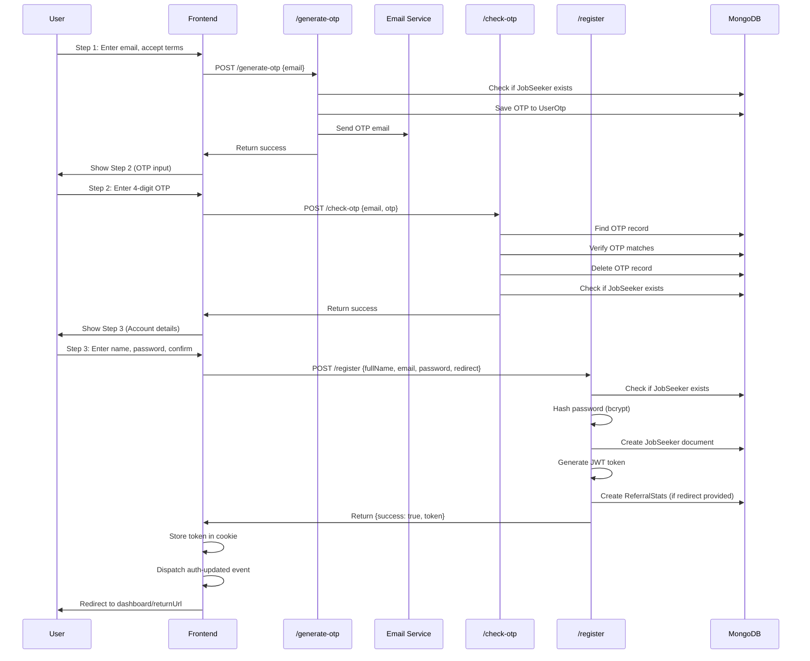

# Feature: Job Seeker Registration

## Overview

**Purpose**: The Job Seeker Registration feature allows new users to create an account through a secure 3-step process that includes email verification via OTP (One-Time Password). This ensures email ownership and prevents duplicate account creation.

**User Story**: As a new job seeker, I want to register for an account so that I can access job search features, save jobs, apply to positions, and manage my profile.

**Key Functionality**:
- 3-step registration process (Email → OTP Verification → Account Details)
- Email verification via OTP (4-digit code sent to email)
- Terms and conditions acceptance
- Full name and password setup
- Account creation with JWT token generation
- Automatic login after registration
- Referral tracking support (optional)
- Redirect handling (returnUrl support)

**Access Level**: Public (No authentication required)

**URL Path**: `/signin/jobseeker?register=true`

**Query Parameters**:
- `register` (required): Must be `true` to show registration form
- `returnUrl` (optional): URL to redirect to after successful registration (encoded)

---

## User Flow

### Primary Flow - Complete Registration
1. User navigates to `/signin/jobseeker?register=true`
2. **Step 1 - Email Entry**:
   - User enters email address
   - User accepts terms and conditions
   - User clicks "Send OTP"
   - System sends 4-digit OTP to email
3. **Step 2 - OTP Verification**:
   - User receives OTP via email
   - User enters 4-digit OTP in individual input fields
   - System validates OTP
   - On success: Proceed to Step 3
4. **Step 3 - Account Details**:
   - User enters full name (3-40 characters)
   - User creates password (with strength requirements)
   - User confirms password
   - User clicks "Complete Registration"
   - System creates account
   - JWT token generated and stored
   - User automatically logged in
   - User redirected to dashboard or returnUrl

### Alternative Flows
- **Email Already Exists**: Error message displayed, user must use different email
- **Invalid OTP**: Error message displayed, user can retry or change email
- **OTP Not Received**: User can change email and request new OTP
- **Validation Errors**: Inline validation errors shown for each field
- **Network Error**: Generic error message displayed, user can retry
- **Switch to Sign In**: User can switch to sign-in mode at any time

### Edge Cases
- User switches modes during registration: Form state is reset
- returnUrl provided: User redirected to specified URL after registration
- Referral tracking: If redirect/returnUrl param exists, referral stats are tracked
- OTP expires: User must request new OTP (no explicit expiry, but OTP is deleted after use)

---

## Frontend Implementation

### Screen Structure

**Main Page Component**:
- File: `frontend/src/app/signin/jobseeker/page.jsx`
- Type: Client Component (wrapped in Suspense)

**Client Component**:
- File: `frontend/src/app/signin/jobseeker/JobseekerSigninClient.jsx`
- Purpose: Combined authentication component handling both sign-in and registration flows
- Mode: Controlled by `mode` state (`"signin"` or `"signup"`)

**Styling**:
- CSS File: `frontend/src/app/signin/jobseeker/page.css`
- CSS Modules: No
- Responsive: Yes (split-screen layout on desktop, stacked on mobile)

### Component Hierarchy

```
Page (page.jsx)
  └── Suspense
      └── JobseekerSigninClient (JobseekerSigninClient.jsx)
          └── Sign Up Flow (mode === "signup")
              ├── Step 1 - Email Entry
              │   ├── Email Input
              │   ├── Terms & Conditions Checkbox
              │   └── Send OTP Button
              ├── Step 2 - OTP Verification
              │   ├── OTP Info Text
              │   ├── OTP Input Fields (4 inputs)
              │   ├── Verify OTP Button
              │   └── Change Email Button
              └── Step 3 - Account Details
                  ├── Full Name Input
                  ├── Password Input (with visibility toggle)
                  ├── Confirm Password Input (with visibility toggle)
                  └── Complete Registration Button
```

### State Management

**Local State (Registration)**:
```javascript
const [signupEmail, setSignupEmail] = useState("");
const [otpSent, setOtpSent] = useState(false);
const [otp, setOtp] = useState(["", "", "", ""]); // Array of 4 strings for OTP digits
const [step3, setStep3] = useState(false); // Step 3 flag
const [fullName, setFullName] = useState("");
const [regPassword, setRegPassword] = useState("");
const [confirmRegPassword, setConfirmRegPassword] = useState("");
const [showPassReg, setShowPassReg] = useState(false); // Password visibility
const [showPassReg2, setShowPassReg2] = useState(false); // Confirm password visibility
const [acceptedTerms, setAcceptedTerms] = useState(false);
const [loading, setLoading] = useState(false);
const [otpError, setOtpError] = useState("");
```

**Router & Search Params**:
```javascript
const router = useRouter();
const searchParams = useSearchParams();
```

**Cookie Management**:
- Uses `js-cookie` library for cookie operations
- Token stored as `js_token` cookie after successful registration

### Registration Flow - Step by Step

#### Step 1: Email Entry and OTP Generation

**Form Fields**:
1. **Email Address**
   - Type: `email`
   - Required: Yes
   - Validation: Email regex pattern (`/\S+@\S+\.\S+/`)
   - Auto-lowercase: Yes
   - Error: "Enter a valid email" (if invalid format)

2. **Terms and Conditions Checkbox**
   - Required: Yes (must be checked)
   - Links to: `/jobseeker/terms`
   - Opens in new tab

**Client-Side Validation**:
```javascript
const validSignupEmail = /\S+@\S+\.\S+/.test(signupEmail.toLowerCase());

// Button disabled if email invalid or terms not accepted
disabled={!validSignupEmail || !acceptedTerms || loading}
```

**Send OTP Handler**:
```javascript
const handleSendOtp = async () => {
  try {
    setLoading(true);
    setOtpError("");

    const res = await axios.post(
      `${process.env.NEXT_PUBLIC_JOBSEEKER_URL}/generate-otp`,
      {
        loginType: "E-Mail",
        loginValue: signupEmail.toLowerCase(),
      }
    );

    if (res.data.success) {
      setOtpSent(true); // Move to Step 2
    } else {
      if (res.data.alreadyExists) {
        setOtpError("Account already exists with this email. Use a different email.");
        return;
      }
      setOtpError("Failed to send OTP. Try again.");
    }
  } catch (err) {
    setOtpError(
      err.response?.data?.message || "Unable to send OTP. Try again."
    );
  } finally {
    setLoading(false);
  }
};
```

#### Step 2: OTP Verification

**OTP Input Fields**:
- 4 separate input fields (one for each digit)
- Each field accepts only numeric input (0-9)
- Auto-focus moves to next field when digit entered
- Backspace moves focus to previous field
- All 4 digits must be entered to enable "Verify OTP" button

**OTP Input Handling**:
```javascript
const handleOtpChange = (value, idx) => {
  if (!/^[0-9]?$/.test(value)) return; // Only allow digits

  const newOtp = [...otp];
  newOtp[idx] = value;
  setOtp(newOtp);
  setOtpError("");

  // Auto-focus next field
  if (value && idx < 3) {
    document.getElementById(`otp-${idx + 1}`)?.focus();
  }
};

const handleOtpBackspace = (e, idx) => {
  if (e.key === "Backspace" && !otp[idx] && idx > 0) {
    document.getElementById(`otp-${idx - 1}`)?.focus();
  }
};
```

**Verify OTP Handler**:
```javascript
const handleVerifyOtp = async () => {
  try {
    setLoading(true);
    setOtpError("");

    const res = await axios.post(
      `${process.env.NEXT_PUBLIC_JOBSEEKER_URL}/check-otp`,
      {
        loginType: "E-Mail",
        loginValue: signupEmail.toLowerCase(),
        otp: otp, // Array of 4 digits
      }
    );

    if (res.data.success) {
      setStep3(true); // Move to Step 3
      return;
    }

    // Account exists (edge case)
    if (res.data.alreadyExists) {
      setOtpError("Account already exists with this email. Use a different email.");
      return;
    }

    // Invalid OTP
    setOtpError(res.data.message || "Invalid OTP. Try again.");

  } catch (err) {
    setOtpError("Unable to verify OTP. Try again.");
  } finally {
    setLoading(false);
  }
};
```

**Change Email Button**:
- Resets registration flow back to Step 1
- Clears OTP and email state

#### Step 3: Account Details

**Form Fields**:

1. **Full Name**
   - Type: `text`
   - Required: Yes
   - Validation: 3-40 characters
   - Max length: 40 characters
   - Error: "Full name must be at least 3 characters"

2. **Password**
   - Type: `password` (toggleable to `text`)
   - Required: Yes
   - Validation: Password strength requirements
     - Minimum 8 characters
     - Must include uppercase letter
     - Must include lowercase letter
     - Must include number
     - Must include special character
   - Visibility toggle: Eye icon
   - Error: Detailed validation message if requirements not met

3. **Confirm Password**
   - Type: `password` (toggleable to `text`)
   - Required: Yes
   - Validation: Must match password
   - Visibility toggle: Eye icon
   - Error: "Passwords do not match"

**Client-Side Validation**:
```javascript
const regPassValid =
  regPassword.length >= 8 &&
  /[A-Z]/.test(regPassword) &&
  /[a-z]/.test(regPassword) &&
  /[0-9]/.test(regPassword) &&
  /[^A-Za-z0-9]/.test(regPassword);

const regConfirmMatch = regPassword === confirmRegPassword;

const registrationValid =
  fullName.length >= 3 &&
  fullName.length <= 40 &&
  regPassValid &&
  regConfirmMatch;
```

**Complete Registration Handler**:
```javascript
const handleRegistration = async () => {
  try {
    setLoading(true);
    setOtpError("");

    // Get returnUrl from query params to pass to backend
    const returnUrl = searchParams.get('returnUrl');
    
    const res = await axios.post(
      `${process.env.NEXT_PUBLIC_JOBSEEKER_URL}/register`,
      {
        fullName,
        email: signupEmail.toLowerCase(),
        password: regPassword,
        redirect: returnUrl || null, // Pass returnUrl as redirect to backend
      }
    );

    if (res.data.success) {
      const { token } = res.data;

      if (token) {
        Cookies.set('js_token', token);
        window.dispatchEvent(new Event("auth-updated"));
        
        // Redirect to returnUrl if provided, otherwise to home
        const returnUrl = searchParams.get('returnUrl');
        const redirectPath = returnUrl ? decodeURIComponent(returnUrl) : "/jobseeker/home";
        router.push(redirectPath);
      }
    } else if (res.data.alreadyExists) {
      setOtpError("Account already exists with this email.");
    } else {
      setOtpError(res.data.message || "Registration failed.");
    }

  } catch (err) {
    setOtpError("Unable to complete registration.");
  } finally {
    setLoading(false);
  }
};
```

### API Integration

**Endpoints Called**:

| Endpoint | Method | Purpose | Step | Authentication |
|----------|--------|---------|------|----------------|
| `/jobseeker/generate-otp` | POST | Generate and send OTP to email | Step 1 | Not required |
| `/jobseeker/check-otp` | POST | Verify OTP code | Step 2 | Not required |
| `/jobseeker/register` | POST | Create new job seeker account | Step 3 | Not required |

**Environment Variables**:
- `NEXT_PUBLIC_JOBSEEKER_URL`: Base URL for job seeker API (e.g., `http://localhost:5001/jobseeker`)

### UI States

**Loading State**:
- Submit buttons show circular progress indicator
- Form fields are disabled
- Button text changes to show loading state

**Error State**:
- Error message displayed in `otpError` state
- Errors shown below form
- Inline validation errors for each field
- Specific error messages from backend displayed

**Success State**:
- Token stored in cookie
- Auth update event dispatched
- User redirected to dashboard or returnUrl
- No visual feedback on registration page (redirects immediately)

**Step Navigation**:
- Controlled by `otpSent` and `step3` flags
- Cannot skip steps (must complete in order)
- Can reset flow using "Change Email" button

---

## Backend Implementation

### API Endpoints

#### 1. Generate OTP

**Route Definition**:
```javascript
// File: backend/src/routes/jobSeekerRoutes.js
router.post("/generate-otp", jobSeekerController.generateOtp);
```

**Full Endpoint Path**: `/jobseeker/generate-otp`

**HTTP Method**: POST

**Authentication Required**: No (Public endpoint)

**Request Body**:
```json
{
  "loginType": "E-Mail",
  "loginValue": "user@example.com"
}
```

**Response Format**:
```json
// Success Response
{
  "success": true,
  "message": "OTP generated and sent successfully"
}

// Error Response - Email Already Exists
{
  "success": false,
  "alreadyExists": true,
  "message": "Account already exists with this email. Use a different email to continue."
}
```

**Controller Logic**:
```javascript
// File: backend/src/controllers/jobSeekerController.js
const generateOtp = async (req, res) => {
  // 1. Validate request (loginType, loginValue)
  // 2. Check if job seeker already exists
  // 3. Generate 4-digit OTP (1000-9999)
  // 4. Save OTP to UserOtp collection
  // 5. Send OTP via email
  // 6. Return success response
};
```

**Database Operations**:
- Read: Check if JobSeeker exists by email
- Create/Update: Save OTP to UserOtp collection (upsert operation)

#### 2. Check OTP

**Route Definition**:
```javascript
router.post("/check-otp", jobSeekerController.checkOtp);
```

**Full Endpoint Path**: `/jobseeker/check-otp`

**HTTP Method**: POST

**Authentication Required**: No (Public endpoint)

**Request Body**:
```json
{
  "loginType": "E-Mail",
  "loginValue": "user@example.com",
  "otp": [1, 2, 3, 4] // or "1234" as string
}
```

**Response Format**:
```json
// Success Response
{
  "success": true,
  "message": "OTP verified successfully. Proceed to registration."
}

// Error Response - Invalid OTP
{
  "success": false,
  "message": "Invalid OTP"
}

// Error Response - OTP Not Found
{
  "success": false,
  "message": "OTP not found for this E-Mail"
}

// Error Response - Account Already Exists
{
  "success": false,
  "alreadyExists": true,
  "message": "Account already exists with this email. Use a different email to continue."
}
```

**Controller Logic**:
```javascript
const checkOtp = async (req, res) => {
  // 1. Validate request (loginType, loginValue, otp)
  // 2. Find OTP record in UserOtp collection
  // 3. Compare provided OTP with stored OTP
  // 4. If valid: Delete OTP entry
  // 5. Check if job seeker already exists (double-check)
  // 6. Return success or error response
};
```

**Database Operations**:
- Read: Find OTP record by userData (email)
- Delete: Remove OTP entry after successful verification
- Read: Check if JobSeeker exists (double-check)

#### 3. Register Job Seeker

**Route Definition**:
```javascript
router.post("/register", jobSeekerController.registerJobSeeker);
```

**Full Endpoint Path**: `/jobseeker/register`

**HTTP Method**: POST

**Authentication Required**: No (Public endpoint)

**Request Body**:
```json
{
  "fullName": "John Doe",
  "email": "user@example.com",
  "password": "SecurePass123!",
  "redirect": "/jobseeker/home" // optional
}
```

**Response Format**:
```json
// Success Response
{
  "success": true,
  "message": "Registration successful",
  "token": "jwt_token_here",
  "user": {
    "_id": "user_id",
    "fullName": "John Doe",
    "email": "user@example.com",
    // ... other fields (password excluded)
  }
}

// Error Response - Validation Error
{
  "success": false,
  "message": "Full name, email and password are required"
}

// Error Response - Account Already Exists
{
  "success": false,
  "alreadyExists": true,
  "message": "Account already exists with this email. Use a different email to continue."
}
```

**Controller Logic**:
```javascript
const registerJobSeeker = async (req, res) => {
  // 1. Validate request (fullName, email, password)
  // 2. Validate fullName length (3-40 characters)
  // 3. Validate email format
  // 4. Validate password format (strength requirements)
  // 5. Check if email already taken (double-check)
  // 6. Hash password using bcrypt
  // 7. Create new JobSeeker document
  // 8. Generate JWT token
  // 9. Track referral stats (if redirect parameter provided)
  // 10. Return success response with token
};
```

**Database Operations**:
- Read: Check if JobSeeker exists by email
- Create: Create new JobSeeker document
- Create: Create JobSeekerReferralStats document (optional, if redirect provided)

### Middleware Chain

**No middleware required** (all endpoints are public)

### Database Models

#### UserOtp Model

**File**: `backend/src/models/userOtp.js`

**Schema**:
```javascript
{
  userData: String,  // Email address (indexed)
  userOtp: Number,   // 4-digit OTP (1000-9999)
  createdAt: Date,   // Auto-generated
  updatedAt: Date    // Auto-generated
}
```

**Operations**:
- Create/Update: Upsert OTP record
- Read: Find OTP by userData (email)
- Delete: Remove OTP after verification

#### JobSeeker Model

**File**: `backend/src/models/jobSeeker.js`

**Fields Used in Registration**:
- `fullName`: String (required, 3-40 characters)
- `email`: String (required, unique, lowercase)
- `password`: String (required, hashed with bcrypt)

#### JobSeekerReferralStats Model

**File**: `backend/src/models/jobSeekerReferralStats.js`

**Schema** (for referral tracking):
```javascript
{
  userId: ObjectId,        // Reference to JobSeeker
  redirectTo: String,      // Referral source URL
  alreadyHadAccount: Boolean, // false for new registrations
  isResumeSaved: Boolean,
  isOtherDetailsFilled: Boolean,
  createdAt: Date,
  updatedAt: Date
}
```

### Password Hashing

**Algorithm**: bcrypt
**Salt Rounds**: 10
**Implementation**:
```javascript
const hashedPassword = await bcrypt.hash(password, 10);
```

### JWT Token Generation

**Token Payload**:
```javascript
{
  userId: newUser._id,        // MongoDB ObjectId
  userName: newUser.fullName  // User's full name
}
```

**Token Configuration**:
- Secret: `process.env.JWT_SECRET`
- Expiration: Not set (default behavior)
- Algorithm: Default (HS256)

### Email Service

**OTP Email Content**:
- Subject: "Your OTP to Login - Atract"
- HTML email with styled OTP display
- OTP displayed in large, bold numbers
- Includes security notice

**Email Template** (from generateOtp):
```html
<div style="font-family: Roboto, sans-serif; max-width: 500px; margin: auto; border-radius: 10px; padding: 25px; border: 1px solid #e5e7eb;">
  <h2 style="text-align:center; color:#2563eb; margin-bottom:20px;">Your Atract Login OTP</h2>
  <p style="font-size:15px; color:#374151;">Hello,</p>
  <p style="font-size:15px; color:#374151;">Use the OTP below to verify your login request:</p>
  <div style="text-align:center; margin: 25px 0;">
    <span style="display:inline-block; padding:12px 20px; font-size:28px; font-weight:bold; border-radius:8px; background:#f3f4f6; letter-spacing:10px;">
      ${otp}
    </span>
  </div>
  <p style="font-size:15px; color:#374151;">
    If you did not initiate this request, please ignore this email.
  </p>
  <p style="font-size:14px; color:#6b7280; text-align:center; margin-top:25px;">
    © ${new Date().getFullYear()} Atract — Smart AI Hiring Platform
  </p>
</div>
```

### Referral Tracking (Optional)

**Condition**: Only if `redirect`/`returnUrl` parameter is provided in registration request

**Tracking Logic**:
1. Extract redirect parameter from request
2. Create JobSeekerReferralStats document
3. Set `alreadyHadAccount: false` (new user)
4. Set initial tracking flags (`isResumeSaved: false`, `isOtherDetailsFilled: false`)
5. Store referral source URL

**Implementation**:
```javascript
const redirectTo = req.query.redirect || req.body.redirect || req.query.returnUrl || req.body.returnUrl;
if (redirectTo) {
  try {
    await JobSeekerReferralStats.create({
      userId: newUser._id,
      redirectTo: redirectTo,
      alreadyHadAccount: false,
      isResumeSaved: false,
      isOtherDetailsFilled: false,
    });
  } catch (trackingError) {
    console.error("Error tracking referral stats on registration:", trackingError);
    // Don't fail registration if tracking fails
  }
}
```

---

## Data Flow

### Complete Registration Flow



### Request/Response Examples

#### Generate OTP Request
```json
POST /jobseeker/generate-otp
{
  "loginType": "E-Mail",
  "loginValue": "user@example.com"
}
```

#### Generate OTP Response (Success)
```json
{
  "success": true,
  "message": "OTP generated and sent successfully"
}
```

#### Check OTP Request
```json
POST /jobseeker/check-otp
{
  "loginType": "E-Mail",
  "loginValue": "user@example.com",
  "otp": [1, 2, 3, 4]
}
```

#### Check OTP Response (Success)
```json
{
  "success": true,
  "message": "OTP verified successfully. Proceed to registration."
}
```

#### Register Request
```json
POST /jobseeker/register
{
  "fullName": "John Doe",
  "email": "user@example.com",
  "password": "SecurePass123!",
  "redirect": "/jobseeker/home"
}
```

#### Register Response (Success)
```json
{
  "success": true,
  "message": "Registration successful",
  "token": "eyJhbGciOiJIUzI1NiIsInR5cCI6IkpXVCJ9...",
  "user": {
    "_id": "65a1b2c3d4e5f6g7h8i9j0k1",
    "fullName": "John Doe",
    "email": "user@example.com",
    "createdAt": "2024-01-15T10:30:00.000Z",
    "updatedAt": "2024-01-15T10:30:00.000Z"
  }
}
```

---

## Error Handling

### Frontend Error Handling

**Error Types**:
- Network errors: Caught in try-catch, generic error message displayed
- API errors: Checks `res.data.success`, displays `res.data.message`
- Validation errors: Client-side validation with inline error messages
- OTP errors: Specific messages for invalid OTP, OTP not found, etc.

**Error Display**:
- Error message displayed in `otpError` state (shared across all steps)
- Errors shown below form
- Inline validation errors for each field
- Specific error messages from backend displayed

**Error Recovery**:
- User can retry at any step
- OTP can be re-requested by changing email
- Form state is preserved within each step
- Can switch between sign-in and sign-up modes

### Backend Error Handling

**Error Types**:
- Validation errors: Returns 400 with validation message
- Email already exists: Returns 200 with `success: false` and `alreadyExists: true`
- Invalid OTP: Returns 200 with `success: false` and error message
- OTP not found: Returns 200 with `success: false` and error message
- Server errors: Returns 500 with generic error message

**Status Codes**:
- 200: Used for most failures (prevents information leakage)
- 400: Used for validation errors
- 201: Used for successful registration
- 500: Used for server errors

**Security Considerations**:
- Generic error messages prevent information leakage
- Email existence is checked but not revealed explicitly
- OTP is deleted after successful verification (one-time use)
- Password never logged or exposed

---

## Security Features

### Email Verification
- OTP-based email verification ensures email ownership
- 4-digit OTP (1000-9999) provides reasonable security
- OTP deleted after use (prevents replay attacks)
- OTP stored temporarily in database

### Password Security
- Passwords hashed using bcrypt with salt rounds of 10
- Password strength requirements enforced
- Password never stored in plain text
- Password confirmation prevents typos

### Input Validation
- Email format validation (regex)
- Password format validation (regex)
- Full name length validation (3-40 characters)
- Email normalized to lowercase
- SQL injection prevention (using Mongoose)

### Account Security
- Email uniqueness check (prevents duplicate accounts)
- Terms acceptance required (legal compliance)
- JWT token generated only after successful registration
- Referral tracking doesn't expose sensitive information

---

## UI/UX Details

### Step 1 - Email Entry

**Form Elements**:
- Email input with placeholder
- Terms and conditions checkbox with link
- "Send OTP" button (disabled until valid email and terms accepted)

**Visual Feedback**:
- Real-time email validation
- Loading state on button during OTP send
- Success: Moves to Step 2
- Error: Error message displayed below form

### Step 2 - OTP Verification

**Form Elements**:
- Info text showing email address
- 4 individual OTP input fields
- "Verify OTP" button (disabled until 4 digits entered)
- "Change Email" button (resets to Step 1)

**Visual Feedback**:
- Auto-focus moves between fields
- Loading state on button during verification
- Success: Moves to Step 3
- Error: Error message displayed, can retry

**OTP Input UX**:
- Each field accepts only one digit
- Auto-advance to next field on input
- Backspace moves to previous field
- Visual feedback for each digit

### Step 3 - Account Details

**Form Elements**:
- Full name input with character limit indicator
- Password input with visibility toggle
- Confirm password input with visibility toggle
- "Complete Registration" button (disabled until all fields valid)

**Visual Feedback**:
- Real-time validation for each field
- Password strength indicator (via error messages)
- Password match validation
- Loading state on button during registration
- Success: Redirects to dashboard
- Error: Error message displayed, can retry

### Progress Indication

**No explicit progress bar**, but:
- Step transitions are clear (form changes)
- Step titles change: "Create Your Account" → "Complete Your Registration"
- Can't skip steps (validation prevents it)

---

## Testing Considerations

### Test Scenarios

**Happy Path**:
1. User completes all 3 steps successfully → Account created → Redirected to dashboard
2. User provides returnUrl → Account created → Redirected to returnUrl
3. User completes registration with referral tracking → Referral stats created

**Step 1 Errors**:
1. Invalid email format → Validation error displayed
2. Email already exists → Error: "Account already exists with this email"
3. Terms not accepted → Button disabled
4. Network error → Error: "Unable to send OTP. Try again."

**Step 2 Errors**:
1. Invalid OTP → Error: "Invalid OTP. Try again."
2. OTP not found → Error: "OTP not found for this E-Mail"
3. Account created between steps → Error: "Account already exists with this email"
4. Network error → Error: "Unable to verify OTP. Try again."

**Step 3 Errors**:
1. Full name too short → Validation error displayed
2. Weak password → Validation error displayed
3. Passwords don't match → Validation error displayed
4. Email already taken (race condition) → Error: "Account already exists with this email"
5. Network error → Error: "Unable to complete registration."

**Edge Cases**:
1. User switches modes during registration → Form state reset
2. User requests multiple OTPs → Latest OTP overwrites previous
3. User uses old OTP after requesting new one → Old OTP invalid
4. Very long full name → Truncated at 40 characters
5. OTP with leading zeros → Handled correctly (stored as number, converted properly)

**Security Testing**:
1. SQL injection attempts → Prevented by Mongoose
2. XSS attempts → Prevented by React's default escaping
3. OTP brute force → Should implement rate limiting (not currently implemented)
4. Email enumeration → Generic error messages prevent enumeration
5. Password exposure → Password hashed, never logged

---

## Related Features

- **Job Seeker Sign In**: Same page component, different mode (`mode === "signin"`)
- **Forgot Password**: Modal within same page component
- **Job Seeker Dashboard** (`/jobseeker/home`): Default redirect destination
- **Job Seeker Terms** (`/jobseeker/terms`): Terms and conditions page
- **Referral Stats**: Tracks referral source when redirect parameter provided

---

## Additional Notes

**Dependencies**:
- `axios`: HTTP client for API calls
- `js-cookie`: Cookie management
- `next/navigation`: Next.js routing
- `react-icons/fa`: Icon library (FaEye, FaEyeSlash)
- `@mui/material`: Material-UI for loading spinner

**Known Issues**:
- Token stored using `js-cookie` instead of HTTP-only cookie (security consideration)
- No rate limiting on OTP generation (should be implemented)
- No OTP expiry time (OTP remains valid until used or new one generated)
- No resend OTP functionality (user must change email to get new OTP)

**Future Enhancements**:
- Implement HTTP-only cookies for token storage
- Add rate limiting for OTP generation
- Add OTP expiry time (e.g., 10 minutes)
- Add "Resend OTP" functionality
- Add SMS OTP option (currently only email)
- Add social login (Google, LinkedIn, etc.)
- Add email verification link option
- Add CAPTCHA to prevent abuse
- Add password strength meter (visual indicator)

**Performance Considerations**:
- Password hashing is CPU-intensive (bcrypt), but acceptable for registration
- Database queries are simple (indexed lookups)
- Email sending is async and doesn't block registration
- OTP generation is fast (random number generation)

**User Experience**:
- Clear step-by-step process
- Real-time validation feedback
- Password visibility toggles improve UX
- Auto-focus in OTP fields improves flow
- Loading states prevent duplicate submissions
- Error messages are user-friendly
- Smooth transition to dashboard after registration

---

## Code References

### Frontend Files
- `frontend/src/app/signin/jobseeker/page.jsx` - Page entry point (12 lines)
- `frontend/src/app/signin/jobseeker/JobseekerSigninClient.jsx` - Main component (1041 lines)
- `frontend/src/app/signin/jobseeker/page.css` - Styling

### Backend Files
- `backend/src/routes/jobSeekerRoutes.js` - Route definitions (lines 13, 15, 17)
- `backend/src/controllers/jobSeekerController.js` - Controller functions:
  - `generateOtp` (lines 44-122)
  - `checkOtp` (lines 126-189)
  - `registerJobSeeker` (lines 193-289)
- `backend/src/models/jobSeeker.js` - JobSeeker model schema
- `backend/src/models/userOtp.js` - UserOtp model schema
- `backend/src/models/jobSeekerReferralStats.js` - Referral stats model

---

*Last Updated: [Current Date]*
*Documented By: TSD Documentation System*

