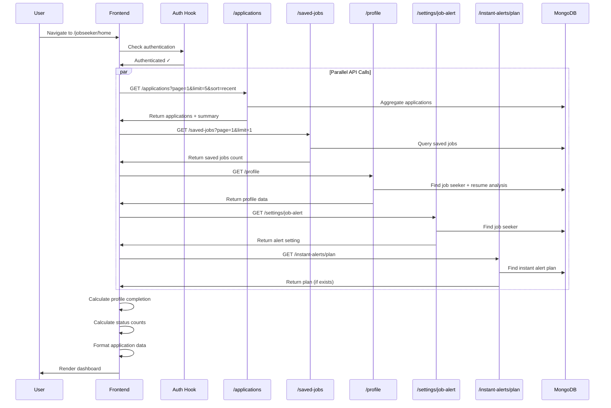
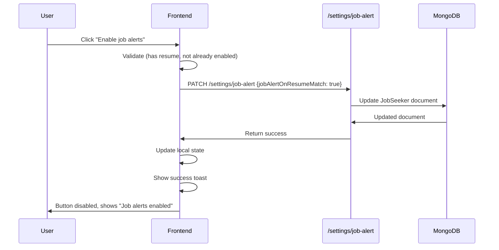

# Feature: Job Seeker Home Dashboard

## Overview

**Purpose**: The Job Seeker Home Dashboard provides a centralized overview of a job seeker's job search activity, including application statistics, saved jobs, profile completion status, recent applications, and quick access to key features. It serves as the primary landing page after login.

**User Story**: As a job seeker, I want to see an overview of my job search activity on the dashboard so that I can quickly understand my application status, profile completion, and access important features.

**Key Functionality**:
- Welcome message with personalized greeting
- Resume status indicator and job alert toggle
- Application statistics (total applications, pending review, shortlisted)
- Saved jobs count
- Profile completion percentage with progress bar
- Recent applications list with status and updates
- Quick action buttons (Search Jobs, My Applications, Saved Jobs, Complete Profile)
- Activity summary (application updates)
- Empty state when no applications exist
- Instant alerts promotional banner (when no active plan)
- Active instant alerts banner (when plan is active)
- Job match alert toggle (enable/disable email alerts for resume-matched jobs)

**Access Level**: Authenticated (Job Seeker only)

**URL Path**: `/jobseeker/home`

**Authentication Required**: Yes (JWT token via `js_token` cookie)

---

## User Flow

### Primary Flow - View Dashboard
1. User navigates to `/jobseeker/home`
2. Authentication check via `useJobSeekerAuth` hook
3. If not authenticated: Redirect to `/signin/jobseeker`
4. If authenticated: Dashboard loads
5. **Data Loading**:
   - Fetch job applications (page 1, limit 5, sort: recent)
   - Fetch saved jobs count (page 1, limit 1)
   - Fetch job seeker profile
   - Fetch job alert setting
   - Fetch instant alert plan (if applicable)
6. **Dashboard Display**:
   - Welcome section with user's first name
   - Resume status card with job alert toggle
   - Statistics cards (5 cards: Applications, Pending, Shortlisted, Saved Jobs, Profile Complete)
   - Quick action buttons
   - Profile completion card (if < 100%)
   - Recent applications list (if applications exist)
   - Activity summary (if updates exist)
   - Empty state (if no applications and no saved jobs)
7. User can interact with various sections and navigate to other pages

### Alternative Flows
- **No Resume Uploaded**: Resume status shows "No resume uploaded yet" with "Add resume" link
- **Job Alerts Disabled**: Toggle button shows "Enable job alerts" (disabled if no resume)
- **Job Alerts Enabled**: Toggle button shows "Job alerts enabled" and is disabled
- **Profile Complete**: Profile completion card is hidden
- **No Applications**: Recent applications section is hidden, empty state shown
- **No Updates**: Activity summary section is hidden
- **Instant Plan Active**: Shows active plan banner instead of promotional banner

### Edge Cases
- Loading state: Skeleton loader shown while data is fetching
- Error state: If API calls fail, default values are used (0 counts, empty arrays)
- Authentication expiration: Redirects to sign-in page
- Network error: Graceful degradation with cached data or default values
- Profile completion calculation: Handles null/undefined values gracefully

---

## Frontend Implementation

### Screen Structure

**Main Page Component**:
- File: `frontend/src/app/jobseeker/(screens)/home/page.jsx`
- Type: Client Component
- Lines: ~600 lines

**Styling**:
- CSS File: `frontend/src/app/jobseeker/(screens)/home/page.css`
- CSS Modules: No
- Responsive: Yes

### Component Hierarchy

```
JobSeekerHomeScreen (page.jsx)
  ├── useJobSeekerAuth() - Authentication check
  ├── Toaster (react-hot-toast) - Toast notifications
  ├── Instant Alerts Banner (conditional - promotional or active)
  ├── Welcome Section
  ├── Loading State (CircularProgress)
  └── Dashboard Content (conditional)
      ├── Resume Status Card
      ├── Stats Cards (5 cards)
      ├── Quick Actions
      ├── Profile Completion Card (conditional)
      ├── Recent Applications List (conditional)
      ├── Activity Summary (conditional)
      └── Empty State (conditional)
```

### State Management

**React Query Hooks**:
```javascript
// Job Applications
const { data: applicationsData, isLoading: loadingApplications } = useJobApplications({
    page: 1,
    limit: 5,
    sort: "recent"
});

// Saved Jobs
const { data: savedJobsData, isLoading: loadingSavedJobs } = useSavedJobs({
    page: 1,
    limit: 1
});

// Profile
const { data: profileData, isLoading: loadingProfile } = useJobSeekerProfile();
```

**Local State**:
```javascript
const [mounted, setMounted] = useState(false);
const [jobMatchAlertEnabled, setJobMatchAlertEnabled] = useState(null);
const [jobMatchAlertLoading, setJobMatchAlertLoading] = useState(false);
const [instantPlan, setInstantPlan] = useState(null);
const [instantPlanLoading, setInstantPlanLoading] = useState(false);
```

**Computed Values**:
```javascript
const applications = applicationsData?.data || [];
const applicationsSummary = applicationsData?.summary || {
    totalApplications: 0,
    totalUpdates: 0,
    statusBreakdown: []
};
const savedJobsCount = savedJobsData?.pagination?.totalJobs || 0;
const isLoading = loadingApplications || loadingSavedJobs || loadingProfile;
const userName = profileData?.fullName || "User";
const showSkeleton = !mounted || isLoading;
const hasResume = Boolean(profileData?.resume);
const hasInstantPlan = Boolean(instantPlan?.status === "active" && instantPlan?.endDate);
```

### Profile Completion Calculation

**Fields Weighted**:
- `fullName`: 10 points
- `mobileNumber`: 8 points
- `gender`: 5 points
- `dateOfBirth`: 5 points
- `address`: 8 points
- `highestQualification`: 10 points
- `passoutYear`: 5 points
- `experienceInYears`: 5 points
- `noticePeriod`: 5 points
- `linkedinUrl`: 8 points
- `githubUrl`: 8 points
- `skills` (array with items): 12 points
- `languages` (array with items): 8 points
- `profilePicture`: 8 points
- `resume`: 8 points

**Total**: 125 points

**Calculation Logic**:
```javascript
const profileCompletion = useMemo(() => {
    if (!profileData) return 0;
    
    const fields = [
        { value: profileData.fullName, weight: 10 },
        // ... other fields
    ];
    
    let completed = 0;
    let total = 0;
    
    fields.forEach(field => {
        total += field.weight;
        if (field.value && field.value !== "" && field.value !== null) {
            if (Array.isArray(field.value)) {
                if (field.value.length > 0) {
                    completed += field.weight;
                }
            } else {
                completed += field.weight;
            }
        }
    });
    
    return Math.round((completed / total) * 100);
}, [profileData]);
```

### Status Counts Calculation

**Status Breakdown**:
```javascript
const statusCounts = useMemo(() => {
    const breakdown = applicationsSummary.statusBreakdown || [];
    return {
        pending: breakdown.find(s => s.status === 'pending')?.count || 0,
        reviewed: breakdown.find(s => s.status === 'reviewed')?.count || 0,
        shortlisted: breakdown.find(s => s.status === 'shortlisted')?.count || 0,
        rejected: breakdown.find(s => s.status === 'rejected')?.count || 0
    };
}, [applicationsSummary]);
```

### Resume Status & Job Alert Toggle

**Resume Status Card**:
- Shows success indicator if resume exists
- Shows warning indicator if no resume
- Displays appropriate message based on resume status
- "Add resume" link if no resume (links to `/jobseeker/profile`)
- "Resume added" chip if resume exists

**Job Alert Toggle**:
- Button to enable/disable job match alerts
- Disabled if:
  - No resume uploaded (`!hasResume`)
  - Alert is already enabled (`jobMatchAlertEnabled`)
  - Currently loading (`jobMatchAlertLoading`)
- Icon: `<FaBell />`
- Click handler: `handleEnableJobAlerts`

**Enable Job Alerts Handler**:
```javascript
const handleEnableJobAlerts = async () => {
    if (jobMatchAlertLoading || jobMatchAlertEnabled) return;
    
    const token = Cookies.get("js_token");
    if (!token) {
        toast.error("Please sign in to manage alerts.");
        router.push("/signin/jobseeker");
        return;
    }
    
    setJobMatchAlertLoading(true);
    try {
        await axios.patch(`${process.env.NEXT_PUBLIC_JOBSEEKER_URL}/settings/job-alert`, {
            jobAlertOnResumeMatch: true
        }, {
            headers: {
                Authorization: `Bearer ${token}`
            }
        });
        setJobMatchAlertEnabled(true);
        toast.success("Email alerts enabled for jobs matching your resume.");
    } catch (error) {
        toast.error(error?.response?.data?.message || "Unable to update alert preference.");
    } finally {
        setJobMatchAlertLoading(false);
    }
};
```

### Instant Alerts Banner

**Promotional Banner** (when `!hasInstantPlan`):
- Title: "Instant job alerts. Be first to apply."
- Description: "When a matching job is posted, we'll send you an alert right away."
- Pills: "Lightning-fast alerts", "AI-matched to your resume", "Only ₹200/mo"
- Clickable: Links to `/jobseeker/profile`
- Arrow icon on right

**Active Plan Banner** (when `hasInstantPlan`):
- Title: "Instant Alerts is active"
- Description: "{remainingDays} days remaining · Renew before {endDate}"
- Status chip: "Active"
- Not clickable

**Remaining Days Calculation**:
```javascript
const remainingInstantDays = hasInstantPlan
    ? Math.max(0, Math.ceil((new Date(instantPlan.endDate) - new Date()) / (1000 * 60 * 60 * 24)))
    : 0;
```

### Statistics Cards

**Five Stat Cards**:
1. **Total Applications**
   - Icon: `<FaBriefcase />` (primary color)
   - Value: `applicationsSummary.totalApplications || 0`
   - Label: "Total Applications"

2. **Pending Review**
   - Icon: `<FaClock />` (warning color)
   - Value: `statusCounts.pending`
   - Label: "Pending Review"

3. **Shortlisted**
   - Icon: `<FaCheckCircle />` (success color)
   - Value: `statusCounts.shortlisted`
   - Label: "Shortlisted"

4. **Saved Jobs**
   - Icon: `<FaBookmark />` (info color)
   - Value: `savedJobsCount`
   - Label: "Saved Jobs"

5. **Profile Complete**
   - Icon: `<FaUser />` (secondary color)
   - Value: `{profileCompletion}%`
   - Label: "Profile Complete"

### Quick Action Buttons

**Four Action Buttons**:
1. **Search Jobs**
   - Icon: `<FaSearch />`
   - Link: `/jobs`
   - Style: Primary

2. **My Applications**
   - Icon: `<FaBriefcase />`
   - Link: `/jobseeker/my-applications`
   - Style: Secondary

3. **Saved Jobs**
   - Icon: `<FaBookmark />`
   - Link: `/jobseeker/saved-jobs`
   - Style: Secondary

4. **Complete Profile** (conditional - only if `profileCompletion < 100`)
   - Icon: `<FaUser />`
   - Link: `/jobseeker/profile`
   - Style: Warning

### Profile Completion Card

**Conditional Display**: Only shown if `profileCompletion < 100`

**Content**:
- Header: "Complete Your Profile" with percentage badge
- Progress bar: Visual indicator with color coding:
  - Green (≥80%)
  - Orange (≥50%)
  - Red (<50%)
- Description: "Complete your profile to increase your chances of getting hired. Add missing information to reach 100%."
- Link: "Update Profile" (links to `/jobseeker/profile`)

### Recent Applications List

**Conditional Display**: Only shown if `applications.length > 0`

**Content**:
- Header: "Recent Applications" with "View All" link (links to `/jobseeker/my-applications`)
- List: Up to 5 most recent applications
- Each application item:
  - Company logo (or placeholder with initial)
  - Job title and company name
  - Status badge (color-coded: shortlisted=green, reviewed=blue, rejected=red, pending=orange)
  - Applied date
  - Latest update (if exists)
  - Employer engagement indicators:
    - "Viewed {relativeTime}" (if `employerEngagement.viewedAt`)
    - "Resume downloaded {relativeTime}" (if `employerEngagement.resumeDownloadedAt`)
  - Clickable: Links to `/{shortId}` (job detail page)

**Formatting Functions**:
```javascript
// Relative time (e.g., "2 hours ago", "3 days ago")
const formatRelativeTime = (dateString) => {
    // Returns: "just now", "5mins ago", "2hrs ago", "1 day ago", etc.
};

// Date format (e.g., "Jan 15, 2024")
const formatDate = (dateString) => {
    return date.toLocaleDateString('en-US', {
        month: 'short',
        day: 'numeric',
        year: 'numeric'
    });
};

// Status color
const getStatusColor = (status) => {
    switch (status?.toLowerCase()) {
        case 'shortlisted': return '#10b981';
        case 'reviewed': return '#3b82f6';
        case 'rejected': return '#ef4444';
        default: return '#f59e0b'; // pending
    }
};
```

### Activity Summary

**Conditional Display**: Only shown if `applicationsSummary.totalUpdates > 0`

**Content**:
- Header: "Recent Activity"
- Icon: `<FaRegEnvelopeOpen />`
- Value: `applicationsSummary.totalUpdates`
- Label: "Application Updates"
- Description: "You have {count} update(s) on your applications. Check your applications page for details."
- Link: "View Updates" (links to `/jobseeker/my-applications`)

### Empty State

**Conditional Display**: Only shown if `applications.length === 0 && savedJobsCount === 0`

**Content**:
- Icon: `<FaBriefcase />`
- Title: "Start Your Job Search"
- Description: "You haven't applied to any jobs yet. Start exploring opportunities and apply to jobs that match your skills."
- Button: "Browse Jobs" (links to `/jobs`)

### API Integration

**Endpoints Called**:

| Endpoint | Method | Purpose | Authentication |
|----------|--------|---------|----------------|
| `/jobseeker/applications` | GET | Fetch job applications | Bearer token |
| `/jobseeker/saved-jobs` | GET | Fetch saved jobs count | Bearer token |
| `/jobseeker/profile` | GET | Fetch job seeker profile | Bearer token |
| `/jobseeker/settings/job-alert` | GET | Fetch job alert setting | Bearer token |
| `/jobseeker/settings/job-alert` | PATCH | Enable job alerts | Bearer token |
| `/jobseeker/instant-alerts/plan` | GET | Fetch instant alert plan | Bearer token |

**Environment Variables**:
- `NEXT_PUBLIC_JOBSEEKER_URL`: Base URL for job seeker API

**React Query Configuration**:
- **Job Applications**: staleTime: 2 minutes, gcTime: 5 minutes
- **Saved Jobs**: staleTime: 2 minutes, gcTime: 5 minutes
- **Profile**: staleTime: 5 minutes, gcTime: 10 minutes
- **Error Handling**: On 401, removes token and redirects to sign-in

### UI States

**Loading State**:
- Skeleton loader with CircularProgress
- Message: "Loading your dashboard..."
- Shown when: `!mounted || isLoading`

**Error State**:
- Graceful degradation: Uses default values (0 counts, empty arrays)
- No explicit error UI (errors handled silently)
- Authentication errors: Redirect to sign-in

**Success State**:
- All sections render with data
- Interactive elements enabled
- No explicit success message

**Empty State**:
- Shown when no applications and no saved jobs
- Encourages user to start job search
- Link to jobs page

---

## Backend Implementation

### API Endpoints

#### 1. Get Job Applications List

**Route Definition**:
```javascript
// File: backend/src/routes/jobSeekerRoutes.js
router.get("/applications", verifyToken, jobSeekerController.getJobApplicationsList);
```

**Full Endpoint Path**: `/jobseeker/applications`

**HTTP Method**: GET

**Authentication Required**: Yes (Bearer token via `verifyToken` middleware)

**Query Parameters**:
- `page` (optional, default: 1): Page number
- `limit` (optional, default: 20, max: 50): Number of results per page
- `search` (optional): Search term (searches in jobTitle, companyName, location)
- `status` (optional): Filter by application status (pending, reviewed, shortlisted, rejected)
- `submissionType` (optional): Filter by submission type
- `jobType` (optional): Filter by job type
- `workMode` (optional): Filter by work mode
- `sort` (optional, default: "recent"): Sort order (recent, oldest, status)

**Response Format**:
```json
{
  "success": true,
  "data": [
    {
      "applicationId": "application_id",
      "jobId": "job_id",
      "jobTitle": "Software Engineer",
      "companyName": "Tech Company",
      "companyInitial": "T",
      "companyLogo": "logo_url_or_null",
      "location": "Bangalore",
      "workMode": "Remote",
      "jobType": "Full-time",
      "shortId": "job_short_id",
      "status": "pending",
      "submissionType": "direct",
      "appliedAt": "2024-01-15T10:30:00.000Z",
      "latestUpdateAt": "2024-01-15T10:30:00.000Z",
      "requiresBasicTest": false,
      "requiresVideoProctoredTest": false,
      "statusTimeline": [...],
      "employerEngagement": {
        "viewedAt": "2024-01-15T11:00:00.000Z",
        "resumeDownloadedAt": null
      },
      "totalUpdates": 1,
      "employerUpdates": 0
    }
  ],
  "pagination": {
    "currentPage": 1,
    "totalPages": 5,
    "totalRecords": 100,
    "limit": 20,
    "hasNextPage": true,
    "hasPrevPage": false
  },
  "summary": {
    "totalApplications": 100,
    "totalUpdates": 150,
    "statusBreakdown": [
      { "status": "pending", "count": 40 },
      { "status": "reviewed", "count": 30 },
      { "status": "shortlisted", "count": 20 },
      { "status": "rejected", "count": 10 }
    ]
  }
}
```

**Controller Logic** (`getJobApplicationsList`):
- Uses MongoDB aggregation pipeline
- Matches applications by jobSeeker ID
- Unwinds applicants array
- Applies filters (status, submissionType, jobType, workMode, search)
- Looks up job and employer data
- Sorts by specified order
- Uses $facet for pagination and summary statistics
- Returns formatted results with pagination and summary

#### 2. Get Saved Jobs

**Route Definition**:
```javascript
router.get("/saved-jobs", verifyToken, jobSeekerController.getSavedJobs);
```

**Full Endpoint Path**: `/jobseeker/saved-jobs`

**HTTP Method**: GET

**Authentication Required**: Yes

**Query Parameters**:
- `page` (optional, default: 1): Page number
- `limit` (optional, default: 20): Number of results per page
- `search` (optional): Search term
- `status` (optional): Filter by job status
- `jobType` (optional): Filter by job type
- `workMode` (optional): Filter by work mode
- `sortBy` (optional, default: "createdAt"): Sort field
- `sortOrder` (optional, default: "desc"): Sort order

**Response Format**:
```json
{
  "success": true,
  "data": [...],
  "pagination": {
    "currentPage": 1,
    "totalPages": 1,
    "totalJobs": 5,
    "limit": 20,
    "hasNextPage": false,
    "hasPrevPage": false
  }
}
```

**Controller Logic** (`getSavedJobs`):
- Fetches job seeker's `savedJobIds` array
- Queries Job collection with `$in` operator
- Applies filters and search
- Sorts and paginates results
- Returns formatted job list with pagination

#### 3. Get Profile

**Route Definition**:
```javascript
router.get("/profile", verifyToken, jobSeekerController.getProfile);
```

**Full Endpoint Path**: `/jobseeker/profile`

**HTTP Method**: GET

**Authentication Required**: Yes

**Response Format**:
```json
{
  "success": true,
  "data": {
    "_id": "user_id",
    "fullName": "John Doe",
    "email": "user@example.com",
    "mobileNumber": "+1234567890",
    "gender": "male",
    "dateOfBirth": "1990-01-01T00:00:00.000Z",
    "address": "123 Main St",
    "highestQualification": "Bachelor's",
    "passoutYear": 2012,
    "experienceInYears": 5,
    "noticePeriod": "30 days",
    "linkedinUrl": "https://linkedin.com/in/johndoe",
    "githubUrl": "https://github.com/johndoe",
    "skills": ["JavaScript", "React"],
    "languages": ["English", "Hindi"],
    "profilePicture": "picture_url_or_null",
    "resume": "resume_url_or_null",
    "jobAlertOnResumeMatch": false,
    "emailAlertOnLogin": false,
    // ... other fields
    "resumeParsedDetails": {...},
    "resumeAnalysis": {...}
  }
}
```

**Controller Logic** (`getProfile`):
- Finds job seeker by ID (excludes password)
- Finds latest resume analysis (if exists)
- Attaches resume parsed details and analysis status
- Returns complete profile data

#### 4. Get Job Alert Setting

**Route Definition**:
```javascript
router.get("/settings/job-alert", verifyToken, jobSeekerController.getJobMatchAlertSetting);
```

**Full Endpoint Path**: `/jobseeker/settings/job-alert`

**HTTP Method**: GET

**Authentication Required**: Yes

**Response Format**:
```json
{
  "success": true,
  "data": {
    "jobAlertOnResumeMatch": false,
    "email": "user@example.com"
  }
}
```

**Controller Logic** (`getJobMatchAlertSetting`):
- Finds job seeker by ID
- Selects `jobAlertOnResumeMatch` and `email` fields
- Returns current setting value

#### 5. Update Job Alert Setting

**Route Definition**:
```javascript
router.patch("/settings/job-alert", verifyToken, jobSeekerController.updateJobMatchAlertSetting);
```

**Full Endpoint Path**: `/jobseeker/settings/job-alert`

**HTTP Method**: PATCH

**Authentication Required**: Yes

**Request Body**:
```json
{
  "jobAlertOnResumeMatch": true
}
```

**Response Format**:
```json
{
  "success": true,
  "data": {
    "jobAlertOnResumeMatch": true,
    "email": "user@example.com"
  }
}
```

**Controller Logic** (`updateJobMatchAlertSetting`):
- Validates `jobAlertOnResumeMatch` is boolean
- Updates job seeker document
- Returns updated setting value

#### 6. Get Instant Alert Plan

**Route Definition**:
```javascript
// File: backend/src/routes/jobSeekerRoutes.js
router.get("/instant-alerts/plan", verifyToken, jobSeekerInstantAlertController.getInstantAlertPlan);
```

**Full Endpoint Path**: `/jobseeker/instant-alerts/plan`

**HTTP Method**: GET

**Authentication Required**: Yes

**Response Format**:
```json
{
  "success": true,
  "hasPlan": true,
  "plan": {
    "status": "active",
    "endDate": "2024-02-15T00:00:00.000Z",
    // ... other plan details
  }
}
```

**Controller Logic** (`getInstantAlertPlan`):
- Fetches user's instant alert plan from `JobSeekerInstantAlertPlan` collection
- Checks if plan is active and not expired
- Returns plan details if active, otherwise `hasPlan: false`

### Middleware Chain

**Authentication Middleware**:
- File: `backend/src/middleware/authMiddleware.js`
- Function: `verifyToken`
- Validates JWT token from Authorization header
- Attaches `userId` to `req.userId`
- On failure: Returns 401 Unauthorized

### Database Models

**JobSeeker Model** (`backend/src/models/jobSeeker.js`):
- Fields used:
  - `fullName`, `email`, `mobileNumber`, `gender`, `dateOfBirth`
  - `address`, `highestQualification`, `passoutYear`
  - `experienceInYears`, `noticePeriod`
  - `linkedinUrl`, `githubUrl`, `skills`, `languages`
  - `profilePicture`, `resume`
  - `jobAlertOnResumeMatch`, `emailAlertOnLogin`
  - `savedJobIds` (array of Job ObjectIds)

**JobApplication Model** (`backend/src/models/jobApplication.js`):
- Fields used:
  - `job` (reference to Job)
  - `applicants` (array):
    - `jobSeeker` (reference to JobSeeker)
    - `status`, `submissionType`
    - `appliedAt`, `statusTimeline`
    - `employerEngagement` (viewedAt, resumeDownloadedAt)

**Job Model** (`backend/src/models/job.js`):
- Fields used:
  - `jobTitle`, `companyName`, `location`
  - `workMode`, `jobType`, `status`
  - `shortId`, `employerId`

**JobSeekerInstantAlertPlan Model** (`backend/src/models/jobSeekerInstantAlertPlan.js`):
- Fields used:
  - `userId` (reference to JobSeeker)
  - `status` (active, expired, cancelled)
  - `endDate`

---

## Data Flow

### Dashboard Load Flow



### Enable Job Alert Flow



---

## Error Handling

### Frontend Error Handling

**Authentication Errors**:
- 401 responses: Remove token, redirect to sign-in
- Handled in React Query hooks (`retry` and `onError` callbacks)

**Network Errors**:
- Graceful degradation: Uses default values (empty arrays, 0 counts)
- No explicit error UI shown to user
- Errors logged to console

**Loading States**:
- Skeleton loader shown during initial load
- Individual sections can show loading state
- Prevents multiple simultaneous requests

**Form Validation**:
- Job alert toggle: Disabled if no resume or already enabled
- Client-side validation before API calls

### Backend Error Handling

**Authentication Errors**:
- Missing/invalid token: 401 Unauthorized
- User not found: 404 Not Found

**Validation Errors**:
- Invalid parameters: 400 Bad Request
- Missing required fields: 400 Bad Request

**Server Errors**:
- Database errors: 500 Internal Server Error
- Generic error messages to prevent information leakage

**Status Codes**:
- 200: Success
- 400: Bad Request (validation errors)
- 401: Unauthorized (authentication required)
- 404: Not Found (resource not found)
- 500: Internal Server Error

---

## Security Features

### Authentication
- JWT token required for all endpoints
- Token validated via middleware
- Token stored in HTTP-only cookie (recommended) or client-side cookie

### Authorization
- User can only access their own data
- `req.userId` from token used to filter queries
- No cross-user data access possible

### Input Validation
- Query parameters validated (page, limit, etc.)
- Limit constraints (max 50 for applications)
- Search terms sanitized (regex escaping)

### Data Protection
- Password excluded from profile response
- Sensitive fields not exposed
- Profile data only accessible to owner

---

## UI/UX Details

### Layout Structure

**Page Container**:
- Max-width container
- Responsive padding
- Consistent spacing

**Section Order**:
1. Instant Alerts Banner (top, conditional)
2. Welcome Section
3. Resume Status Card
4. Statistics Cards (grid layout, responsive)
5. Quick Actions (horizontal layout, responsive)
6. Profile Completion Card (conditional)
7. Recent Applications List (conditional)
8. Activity Summary (conditional)
9. Empty State (conditional, bottom)

### Visual Design

**Colors**:
- Primary: Blue (#2563eb)
- Success: Green (#10b981)
- Warning: Orange (#f59e0b)
- Error: Red (#ef4444)
- Secondary: Gray (#6b7280)

**Status Colors**:
- Shortlisted: Green
- Reviewed: Blue
- Rejected: Red
- Pending: Orange

**Icons**:
- React Icons (Font Awesome)
- Consistent icon usage across sections
- Icon-color associations

**Typography**:
- Clear hierarchy (h1, h3, p)
- Readable font sizes
- Consistent spacing

### Responsive Design

**Desktop**:
- Multi-column layout for stats cards
- Horizontal quick actions
- Full-width sections

**Mobile**:
- Single-column layout
- Stacked cards
- Touch-friendly button sizes
- Scrollable content

### Accessibility

**ARIA Labels**:
- Buttons have appropriate labels
- Status indicators are readable
- Links are descriptive

**Keyboard Navigation**:
- All interactive elements focusable
- Tab order logical
- Enter/Space for button activation

**Screen Reader Support**:
- Semantic HTML elements
- Descriptive text content
- Icon labels where needed

---

## Testing Considerations

### Test Scenarios

**Happy Path**:
1. Authenticated user loads dashboard → All sections display with data
2. User enables job alerts → Alert enabled, button updates, toast shown
3. User clicks application → Navigates to job detail page
4. User clicks quick action → Navigates to appropriate page

**Edge Cases**:
1. No resume uploaded → Resume status shows warning, alert toggle disabled
2. Profile 100% complete → Profile completion card hidden
3. No applications → Recent applications hidden, empty state shown
4. No saved jobs → Saved jobs count shows 0
5. Instant plan active → Active plan banner shown, promotional hidden
6. Instant plan expired → Promotional banner shown

**Error Scenarios**:
1. Authentication expired → Redirects to sign-in
2. Network error → Graceful degradation, default values shown
3. API error → Error logged, default values shown
4. Invalid data → Handled gracefully, defaults used

**Performance**:
1. Large number of applications → Pagination handles efficiently
2. Slow API responses → Loading states shown
3. Parallel API calls → All load concurrently
4. Cached data → React Query uses cached data when available

**Accessibility**:
1. Keyboard navigation → All elements focusable
2. Screen reader → Semantic HTML, descriptive text
3. Color contrast → Meets WCAG standards
4. Touch targets → Adequate size for mobile

---

## Related Features

- **Job Seeker Profile** (`/jobseeker/profile`): Profile management, resume upload
- **My Applications** (`/jobseeker/my-applications`): Full applications list
- **Saved Jobs** (`/jobseeker/saved-jobs`): Saved jobs list
- **Jobs Search** (`/jobs`): Job search and browsing
- **Job Detail** (`/{shortId}`): Individual job detail page

---

## Additional Notes

**Dependencies**:
- `@tanstack/react-query`: Data fetching and caching
- `axios`: HTTP client
- `js-cookie`: Cookie management
- `react-hot-toast`: Toast notifications
- `@mui/material`: Loading spinner
- `react-icons/fa`: Icon library
- `next/navigation`: Routing

**Performance Optimizations**:
- React Query caching reduces API calls
- Memoized calculations (profileCompletion, statusCounts)
- Conditional rendering (only render sections when data exists)
- Parallel API calls for faster loading

**Future Enhancements**:
- Real-time updates (WebSocket integration)
- More detailed analytics charts
- Export functionality
- Customizable dashboard layout
- More granular filtering options
- Bulk actions for applications

**Known Limitations**:
- Profile completion calculation is hardcoded (field weights)
- No real-time updates (requires page refresh)
- Job alert toggle only enables (no disable on dashboard)
- Limited error feedback to user

---

## Code References

### Frontend Files
- `frontend/src/app/jobseeker/(screens)/home/page.jsx` - Main component (~600 lines)
- `frontend/src/app/jobseeker/(screens)/home/page.css` - Styling
- `frontend/src/hooks/useJobApplications.js` - Applications hook
- `frontend/src/hooks/useSavedJobs.js` - Saved jobs hook
- `frontend/src/hooks/useJobSeekerProfile.js` - Profile hook
- `frontend/src/hooks/useJobSeekerAuth.js` - Auth hook

### Backend Files
- `backend/src/routes/jobSeekerRoutes.js` - Route definitions
- `backend/src/controllers/jobSeekerController.js` - Controller functions:
  - `getJobApplicationsList` (lines 1687-1875)
  - `getSavedJobs` (lines 1542-1651)
  - `getProfile` (lines 475-536)
  - `getJobMatchAlertSetting` (lines 4281-4306)
  - `updateJobMatchAlertSetting` (lines 4350-4388)
- `backend/src/controllers/jobSeekerInstantAlertController.js` - Instant alert controller
- `backend/src/middleware/authMiddleware.js` - Authentication middleware
- `backend/src/models/jobSeeker.js` - JobSeeker model
- `backend/src/models/jobApplication.js` - JobApplication model
- `backend/src/models/job.js` - Job model

---

*Last Updated: [Current Date]*
*Documented By: TSD Documentation System*

