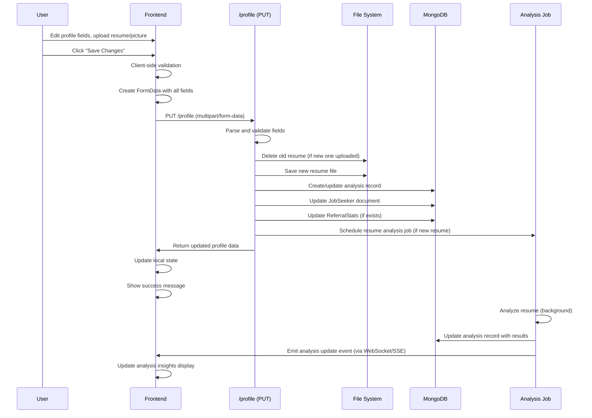
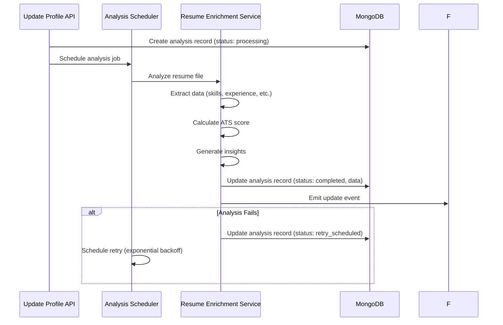

# Feature: Job Seeker Profile

## Overview

**Purpose**: The Job Seeker Profile feature allows job seekers to create, view, and update their complete profile information including personal details, education, skills, languages, resume, profile picture, and job preferences. It includes resume analysis capabilities, profile completion tracking, and auto-fill functionality based on resume parsing.

**User Story**: As a job seeker, I want to manage my profile information so that employers can find me and I can receive relevant job recommendations based on my skills and experience.

**Key Functionality**:
- Personal information management (name, email, mobile, gender, date of birth, address, location)
- Education details (qualification, passout year)
- Experience information (years of experience, notice period, current CTC, expected CTC)
- Skills management (add, remove, search skills)
- Languages management (add/edit languages with proficiency levels and capabilities)
- Profile picture upload/remove
- Resume upload/delete/view with preview
- Resume analysis and insights (ATS score, skills extraction, auto-fill)
- Profile completion percentage tracking
- Job alert settings (enable/disable personalized alerts)
- Instant alerts promotion and management
- Auto-fill profile from resume analysis
- Social links (LinkedIn, GitHub)
- Quick navigation links

**Access Level**: Authenticated (Job Seeker only)

**URL Path**: `/jobseeker/profile`

**Authentication Required**: Yes (JWT token via `js_token` cookie)

---

## User Flow

### Primary Flow - View and Update Profile
1. User navigates to `/jobseeker/profile`
2. Authentication check via `useJobSeekerAuth` hook
3. If not authenticated: Redirect to `/signin/jobseeker`
4. If authenticated: Profile page loads
5. **Data Loading**:
   - Fetch job seeker profile (including resume analysis)
   - Fetch instant alert plan (if applicable)
6. **Profile Display**:
   - Profile completion percentage (circular progress indicator)
   - All form sections populated with existing data
   - Resume preview (if resume exists)
   - Resume analysis insights (if analysis completed)
7. User edits any field(s)
8. User clicks "Save Changes" button
9. Form validation runs (client-side)
10. If valid: Profile update API called with FormData
11. Success: Profile updated, success message shown, form state reset
12. Resume analysis triggered (if new resume uploaded)

### Alternative Flows
- **Resume Upload**: User uploads new resume → File validated → Uploaded → Analysis triggered → Insights displayed
- **Resume Delete**: User clicks delete → Confirmation modal → Resume deleted → Analysis records cleaned
- **Profile Picture Upload**: User uploads picture → Preview shown → Saved on form submit
- **Profile Picture Delete**: User clicks delete → Confirmation modal → Picture removed
- **Skills Management**: User adds/removes skills → Saved on form submit
- **Languages Management**: User opens language modal → Adds/edits language → Saves → Saved on form submit
- **Auto-fill from Resume**: Resume analysis completes → Auto-fill modal appears → User accepts → Fields populated
- **Job Alert Enable**: User enables alerts → Modal shown → Enabled → Banner updated

### Edge Cases
- First-time profile: Empty form, no resume, completion at 0%
- Resume analysis in progress: Loading indicator shown, insights unavailable
- Resume analysis failed: Error state shown, retry possible
- Large file uploads: Size validation prevents upload (>10MB)
- Invalid file types: Only PDF/Word documents accepted for resume
- Network errors: Error message shown, changes not saved
- Form validation errors: Inline errors shown for each field
- Profile picture formats: Image files accepted (jpeg, png, etc.)

---

## Frontend Implementation

### Screen Structure

**Main Page Component**:
- File: `frontend/src/app/jobseeker/(screens)/profile/page.jsx`
- Type: Client Component
- Lines: ~2818 lines (large component)

**Styling**:
- CSS File: `frontend/src/app/jobseeker/(screens)/profile/page.css`
- CSS Modules: No
- Responsive: Yes (mobile and desktop support)

### Component Hierarchy

```
ProfileScreen (page.jsx)
  ├── useJobSeekerAuth() - Authentication check
  ├── Promotional Banners (conditional)
  │   ├── Job Alert Enable Banner
  │   ├── Instant Alert Active Banner
  │   └── Instant Alert Promotional Banner
  ├── Profile Completion Indicator (circular progress)
  ├── Quick Navigation Links
  ├── Form Sections
  │   ├── Personal Information
  │   ├── Profile Picture
  │   ├── Education
  │   ├── Experience
  │   ├── Skills
  │   ├── Languages
  │   ├── Social Links
  │   └── Resume Section
  │       ├── Resume Upload/Preview
  │       └── Resume Analysis Insights
  └── Modals (conditional)
      ├── Language Modal
      ├── Delete Resume Modal
      ├── Delete Profile Picture Modal
      ├── Job Alert Enable Modal
      └── Instant Alert Modal
```

### State Management

**React Query Hooks**:
```javascript
// Profile data
const { data: profileData, isLoading: loading } = useJobSeekerProfile();

// Profile update mutation
const updateProfileMutation = useUpdateJobSeekerProfile();

// Profile picture deletion mutation
const deleteProfilePictureMutation = useDeleteJobSeekerProfilePicture();
```

**Local State - Form Fields**:
```javascript
const [fullName, setFullName] = useState("");
const [email, setEmail] = useState(""); // Read-only
const [mobileNumber, setMobileNumber] = useState("");
const [gender, setGender] = useState("");
const [dateOfBirth, setDateOfBirth] = useState("");
const [highestQualification, setHighestQualification] = useState("");
const [isCustomQualification, setIsCustomQualification] = useState(false);
const [customQualification, setCustomQualification] = useState("");
const [passoutYear, setPassoutYear] = useState("");
const [experienceInYears, setExperienceInYears] = useState("");
const [noticePeriod, setNoticePeriod] = useState("");
const [currentCTC, setCurrentCTC] = useState("");
const [expectedCTC, setExpectedCTC] = useState("");
const [linkedinUrl, setLinkedinUrl] = useState("");
const [githubUrl, setGithubUrl] = useState("");
const [address, setAddress] = useState("");
const [currentLocation, setCurrentLocation] = useState("");
const [skills, setSkills] = useState([]);
const [languages, setLanguages] = useState([]);
const [profilePicture, setProfilePicture] = useState(null);
const [profilePicturePreview, setProfilePicturePreview] = useState(null);
const [resumeFile, setResumeFile] = useState(null);
const [resumeFileName, setResumeFileName] = useState("");
const [resumeUrl, setResumeUrl] = useState(null);
```

**Local State - UI State**:
```javascript
const [mounted, setMounted] = useState(false);
const [saving, setSaving] = useState(false);
const [deletingResume, setDeletingResume] = useState(false);
const [deletingProfilePicture, setDeletingProfilePicture] = useState(false);
const [showDeleteModal, setShowDeleteModal] = useState(false);
const [showDeletePictureModal, setShowDeletePictureModal] = useState(false);
const [removeProfilePictureRequested, setRemoveProfilePictureRequested] = useState(false);
const [error, setError] = useState("");
const [success, setSuccess] = useState("");
const [analysisState, setAnalysisState] = useState({
    resumeAnalysis: {},
    resumeParsedDetails: {}
});
const [isDragActive, setIsDragActive] = useState(false);
const [previewUrl, setPreviewUrl] = useState(null);
const [previewLoading, setPreviewLoading] = useState(false);
const [locationQuery, setLocationQuery] = useState("");
const [showLocationDropdown, setShowLocationDropdown] = useState(false);
const [showLanguageModal, setShowLanguageModal] = useState(false);
const [editingLanguageIndex, setEditingLanguageIndex] = useState(null);
const [languageForm, setLanguageForm] = useState({
    language: "",
    proficiency: "",
    read: false,
    write: false,
    speak: false
});
const [jobAlertOnResumeMatch, setJobAlertOnResumeMatch] = useState(false);
const [showJobAlertModal, setShowJobAlertModal] = useState(false);
const [showInstantAlertModal, setShowInstantAlertModal] = useState(false);
const [instantPlan, setInstantPlan] = useState(null);
const [errors, setErrors] = useState({});
```

### Profile Completion Calculation

**Fields Weighted** (same as dashboard):
- `fullName`: 10 points
- `mobileNumber`: 8 points
- `gender`: 5 points
- `dateOfBirth`: 5 points
- `address`: 8 points
- `highestQualification`: 10 points
- `passoutYear`: 5 points
- `experienceInYears`: 5 points
- `noticePeriod`: 5 points
- `linkedinUrl`: 8 points
- `githubUrl`: 8 points
- `skills` (array with items): 12 points
- `languages` (array with items): 8 points
- `profilePicture`: 8 points
- `resume`: 8 points

**Total**: 125 points

**Calculation**: `Math.round((completed / total) * 100)`

**Visual Indicator**: Circular progress indicator with color coding:
- Red (<50%)
- Orange (≥50%)
- Green (≥80%)

### Form Sections

#### 1. Personal Information
- **Full Name**: Text input, 3-40 characters, required
- **Email**: Text input, read-only (from account)
- **Mobile Number**: Text input, 10 digits, Indian format validation
- **Gender**: Dropdown (male, female, other)
- **Date of Birth**: Date input, cannot be in future
- **Address**: Textarea
- **Current Location**: Autocomplete with Indian cities list

#### 2. Profile Picture
- **Upload**: File input (image files)
- **Preview**: Shows current/selected picture
- **Delete**: Button to remove picture (with confirmation modal)
- **Drag & Drop**: Supported for file upload

#### 3. Education
- **Highest Qualification**: Dropdown with options:
  - 10th Pass, 12th Pass, Diploma, Bachelor's Degree, Master's Degree, MBA, Ph.D., Professional Degree, Technical Certification, Other
- **Custom Qualification**: Text input (if "Other" selected)
- **Passout Year**: Dropdown (1950 to current year + 10)

#### 4. Experience
- **Experience in Years**: Number input, 0-50 years
- **Notice Period**: Text input (e.g., "30 days", "2 weeks")
- **Current CTC**: Number input, positive number
- **Expected CTC**: Number input, positive number

#### 5. Skills
- **Skill Selector Component**: Custom component for adding/removing skills
- **Skill Search**: Search functionality to find skills
- **Skill Display**: Tags/chips showing selected skills
- **Add/Remove**: Interactive skill management

#### 6. Languages
- **Languages List**: Array of language objects
- **Language Object**:
  - `language`: String (language name)
  - `proficiency`: String (Basic, Conversational, Fluent, Native)
  - `read`: Boolean
  - `write`: Boolean
  - `speak`: Boolean
- **Language Modal**: Modal for adding/editing languages
- **Language Search**: Search functionality in modal
- **Proficiency Dropdown**: Select proficiency level

#### 7. Social Links
- **LinkedIn URL**: Text input, LinkedIn URL validation
- **GitHub URL**: Text input, GitHub URL validation

#### 8. Resume Section
- **Resume Upload**: File input (PDF, DOC, DOCX)
- **File Validation**: 
  - Max size: 10MB
  - Allowed types: PDF, Word documents
- **Resume Preview**: PDF viewer or download link
- **Resume Delete**: Button to delete resume (with confirmation modal)
- **Resume Analysis Status**: 
  - Processing indicator
  - Completed with insights
  - Failed state
- **Resume Insights** (when analysis completed):
  - Skills extracted from resume
  - ATS Score (0-100)
  - ATS Insights (strengths, weaknesses)
  - Summary
  - Auto-fill suggestions

### Resume Analysis & Auto-fill

**Analysis States**:
- `processing`: Analysis in progress
- `completed`: Analysis completed successfully
- `failed`: Analysis failed
- `retry_scheduled`: Retry scheduled
- `disabled`: Analysis disabled

**Auto-fill Logic**:
- Triggered when resume analysis completes
- Only fills empty fields (checks both form and profile data)
- Fields auto-filled:
  - Mobile number
  - Gender
  - Date of birth
  - Address
  - Current location
  - Highest qualification
  - Passout year
  - Languages
  - LinkedIn URL
  - GitHub URL
  - Experience years
  - Skills (merged with existing)

**Auto-fill Modal**:
- Shows when analysis completes and fields can be filled
- Lists fields that will be filled
- User can accept or dismiss
- Toast notification shown when fields are auto-filled

### File Upload Handling

**Resume Upload**:
```javascript
const handleResumeChange = (e) => {
    const file = e.target.files[0];
    if (file) {
        // Size validation (10MB max)
        if (file.size > 10 * 1024 * 1024) {
            setErrors({ ...errors, resume: "File size must be less than 10MB" });
            return;
        }
        // Type validation (PDF or Word)
        if (!file.type.includes("pdf") && !file.type.includes("doc") && !file.type.includes("docx")) {
            setErrors({ ...errors, resume: "Please upload a PDF or Word document" });
            return;
        }
        setResumeFile(file);
        setResumeFileName(file.name);
    }
};
```

**Profile Picture Upload**:
- Similar validation (image files)
- Preview shown immediately
- Base64 encoding for storage

**Drag & Drop Support**:
- Resume and profile picture support drag & drop
- Visual feedback when dragging over drop zone

### Form Submission

**Submit Handler**:
```javascript
const handleSubmit = async (e) => {
    e.preventDefault();
    
    // Client-side validation
    if (!fullName || fullName.length < 3) {
        setError("Full name must be at least 3 characters");
        return;
    }
    
    // Create FormData for multipart/form-data
    const formData = new FormData();
    formData.append("fullName", fullName);
    formData.append("mobileNumber", mobileNumber);
    // ... append all fields
    
    // Handle profile picture
    if (removeProfilePictureRequested) {
        formData.append("removeProfilePicture", "true");
    } else if (profilePicture || profilePicturePreview) {
        formData.append("profilePicture", profilePicture || profilePicturePreview);
    }
    
    // Handle resume
    if (resumeFile) {
        formData.append("resume", resumeFile);
    }
    
    // Append JSON arrays as strings
    formData.append("skills", JSON.stringify(skills));
    formData.append("languages", JSON.stringify(languages));
    
    // Submit
    setSaving(true);
    try {
        const updatedData = await updateProfileMutation.mutateAsync(formData);
        setSuccess("Profile updated successfully!");
        // Update local state with response data
        // Reset form file states
    } catch (err) {
        setError(err.response?.data?.message || "Failed to update profile");
    } finally {
        setSaving(false);
    }
};
```

### Validation

**Client-Side Validation**:
- Full name: 3-40 characters
- Mobile number: 10 digits, Indian format
- Email: Read-only, no validation needed
- Date of birth: Cannot be in future
- URLs: Format validation (LinkedIn, GitHub)
- File sizes: Resume (10MB), Profile picture (reasonable size)
- File types: Resume (PDF/Word), Profile picture (images)

**Server-Side Validation**:
- All client-side validations plus:
- Passout year: 1950 to current year + 10
- Experience: 0-50 years
- Notice period: 0-365 days
- CTC: Positive numbers
- Skills: Array validation
- Languages: Object structure validation

### API Integration

**Endpoints Called**:

| Endpoint | Method | Purpose | Authentication |
|----------|--------|---------|----------------|
| `/jobseeker/profile` | GET | Fetch profile data | Bearer token |
| `/jobseeker/profile` | PUT | Update profile | Bearer token |
| `/jobseeker/resume` | DELETE | Delete resume | Bearer token |
| `/jobseeker/profile-picture` | DELETE | Delete profile picture | Bearer token |
| `/jobseeker/instant-alerts/plan` | GET | Fetch instant alert plan | Bearer token |
| `/jobseeker/settings/job-alert` | GET | Fetch job alert setting | Bearer token |
| `/jobseeker/settings/job-alert` | PATCH | Update job alert setting | Bearer token |

**Environment Variables**:
- `NEXT_PUBLIC_JOBSEEKER_URL`: Base URL for job seeker API

---

## Backend Implementation

### API Endpoints

#### 1. Get Profile

**Route Definition**:
```javascript
router.get("/profile", verifyToken, jobSeekerController.getProfile);
```

**Full Endpoint Path**: `/jobseeker/profile`

**HTTP Method**: GET

**Authentication Required**: Yes

**Response Format**: (See Job Seeker Dashboard documentation for details)

**Controller Logic** (`getProfile`):
- Finds job seeker by ID (excludes password)
- Finds latest resume analysis record
- Attaches resume parsed details and analysis status
- Returns complete profile data

#### 2. Update Profile

**Route Definition**:
```javascript
router.put("/profile", verifyToken, upload.single('resume'), jobSeekerController.updateProfile);
```

**Full Endpoint Path**: `/jobseeker/profile`

**HTTP Method**: PUT

**Authentication Required**: Yes

**Content-Type**: `multipart/form-data`

**Request Body** (FormData):
- `fullName`: String (optional)
- `mobileNumber`: String (optional)
- `gender`: String (optional: "male", "female", "other")
- `dateOfBirth`: String (optional, ISO date)
- `highestQualification`: String (optional)
- `passoutYear`: Number (optional)
- `experienceInYears`: Number (optional, 0-50)
- `noticePeriod`: String (optional)
- `currentCTC`: Number (optional)
- `expectedCTC`: Number (optional)
- `linkedinUrl`: String (optional)
- `githubUrl`: String (optional)
- `address`: String (optional)
- `currentLocation`: String (optional)
- `skills`: String (JSON array, optional)
- `languages`: String (JSON array, optional)
- `profilePicture`: File or base64 string (optional)
- `removeProfilePicture`: String "true" (optional, to remove picture)
- `resume`: File (optional, PDF/DOC/DOCX)

**Response Format**:
```json
{
  "success": true,
  "message": "Profile updated successfully",
  "data": {
    // Updated job seeker document with resume analysis data
  }
}
```

**Controller Logic** (`updateProfile`):
1. Parse skills and languages from JSON strings
2. Validate all fields
3. Build update object with only provided fields
4. Handle profile picture (upload or remove)
5. Handle resume file upload:
   - Delete old resume file
   - Save new resume file
   - Create resume analysis record
   - Schedule background analysis job
6. Update job seeker document
7. Update referral tracking stats (if document exists)
8. Attach latest resume analysis data to response
9. Return updated profile data

**File Upload Handling**:
- Uses `multer` middleware for file uploads
- Resume stored at: `/uploads/resumes/{userId}/{filename}`
- Profile picture stored as base64 string in database
- Old files deleted when new ones uploaded

**Resume Analysis Trigger**:
- When new resume uploaded:
  - Stops any scheduled analysis for user
  - Deletes old analysis records (for different resume paths)
  - Creates new analysis record with "processing" status
  - Schedules background analysis job
  - Emits analysis update event

#### 3. Delete Resume

**Route Definition**:
```javascript
router.delete("/resume", verifyToken, jobSeekerController.deleteResume);
```

**Full Endpoint Path**: `/jobseeker/resume`

**HTTP Method**: DELETE

**Authentication Required**: Yes

**Response Format**:
```json
{
  "success": true,
  "message": "Resume deleted successfully"
}
```

**Controller Logic** (`deleteResume`):
1. Find job seeker by ID
2. Check if resume exists
3. Delete resume file from filesystem
4. Delete all resume analysis records for user
5. Stop scheduled analysis jobs
6. Update job seeker document (set resume to null)
7. Return success response

#### 4. Delete Profile Picture

**Route Definition**:
```javascript
router.delete("/profile-picture", verifyToken, jobSeekerController.deleteProfilePicture);
```

**Full Endpoint Path**: `/jobseeker/profile-picture`

**HTTP Method**: DELETE

**Authentication Required**: Yes

**Response Format**:
```json
{
  "success": true,
  "message": "Profile picture deleted successfully"
}
```

**Controller Logic** (`deleteProfilePicture`):
1. Find job seeker by ID
2. Update job seeker document (set profilePicture to null)
3. Return success response

### Resume Analysis Background Job

**Job Flow**:
1. Resume uploaded → Analysis record created with "processing" status
2. Background job scheduled (with delay)
3. Job executes:
   - Validates resume file exists
   - Calls resume enrichment service
   - Extracts data (skills, experience, etc.)
   - Updates analysis record with extracted data
   - Sets status to "completed"
   - Emits update event
4. On failure:
   - Retries up to MAX_ATTEMPTS (typically 3)
   - Sets status to "retry_scheduled" or "failed"
   - Schedules retry with exponential backoff

**Resume Enrichment Service**:
- Extracts structured data from resume
- Provides ATS score calculation
- Generates insights (strengths, weaknesses)
- Creates embeddings for semantic search
- Supports multiple providers (configurable)

### Database Models

**JobSeeker Model** (`backend/src/models/jobSeeker.js`):
- All profile fields stored
- `resume`: String (path to file)
- `profilePicture`: String (base64 data URI)
- `skills`: Array of Strings
- `languages`: Array of Objects

**JobSeekerResumeAnalysis Model** (`backend/src/models/jobSeekerResumeAnalysis.js`):
- `jobSeekerId`: ObjectId reference
- `resumePath`: String
- `status`: String (processing, completed, failed, etc.)
- `inProgress`: Boolean
- `attempts`: Number
- `skills`: Array
- `atsScore`: Number
- `atsInsights`: Array
- `parsedDetails`: Object (all extracted data)
- `embedding`: Array (for semantic search)

### Middleware Chain

**Authentication Middleware**:
- `verifyToken`: Validates JWT token, attaches userId

**File Upload Middleware**:
- `upload.single('resume')`: Multer middleware for resume file upload
- Config: Storage in `/uploads/resumes/{userId}/`
- File naming: `resume-{timestamp}.{ext}`

---

## Data Flow

### Profile Update Flow



### Resume Analysis Flow



---

## Error Handling

### Frontend Error Handling

**Validation Errors**:
- Inline errors shown for each field
- Form submission blocked until errors resolved
- Specific error messages for each validation rule

**Network Errors**:
- Error message displayed at top of form
- Error persists until user dismisses or retries
- 401 errors: Redirect to sign-in

**File Upload Errors**:
- Size limit errors: Shown immediately
- Type errors: Shown immediately
- Upload errors: Generic error message

**Analysis Errors**:
- Failed analysis: Error state shown in analysis section
- Retry scheduled: Status shown, user can wait
- Processing: Loading indicator shown

### Backend Error Handling

**Validation Errors**:
- Returns 400 with specific error message
- Field-level validation messages

**File Errors**:
- File not found: 404
- Upload failed: 500
- Invalid file type: 400

**Database Errors**:
- User not found: 404
- Update failed: 500
- Generic error messages (no sensitive info exposed)

**Status Codes**:
- 200: Success
- 400: Bad Request (validation errors)
- 401: Unauthorized (authentication required)
- 404: Not Found (resource not found)
- 500: Internal Server Error

---

## Security Features

### Authentication
- JWT token required for all endpoints
- Token validated via middleware
- User can only update their own profile

### Authorization
- `req.userId` from token used for all operations
- No cross-user access possible
- File paths include userId for isolation

### Input Validation
- All fields validated on server
- File type and size validation
- URL format validation (LinkedIn, GitHub)
- XSS prevention (data sanitization)

### File Security
- Files stored in user-specific directories
- File type validation before storage
- Size limits enforced
- Old files deleted when new ones uploaded

### Data Protection
- Password never returned in profile response
- Sensitive data handled securely
- Profile data only accessible to owner

---

## UI/UX Details

### Layout Structure

**Page Sections** (top to bottom):
1. Banners (conditional):
   - Job alert enable banner
   - Instant alert active banner
   - Instant alert promotional banner
2. Profile completion indicator (circular progress)
3. Quick navigation links (sticky on scroll)
4. Form sections:
   - Personal Information
   - Profile Picture
   - Education
   - Experience
   - Skills
   - Languages
   - Social Links
   - Resume

### Visual Design

**Profile Completion Indicator**:
- Circular progress (SVG)
- Color coding: Red (<50%), Orange (≥50%), Green (≥80%)
- Percentage displayed in center
- Animation on update

**Form Sections**:
- Clear section headers
- Consistent field styling
- Inline validation errors
- Required field indicators

**Resume Section**:
- Upload area with drag & drop
- Preview viewer (PDF)
- Analysis insights card (when available)
- Status indicators (processing, completed, failed)

**Modals**:
- Overlay with backdrop
- Centered modal container
- Clear header, body, footer
- Close button (X icon)
- Action buttons (Cancel, Save/Delete)

### Responsive Design

**Desktop**:
- Two-column layout for some sections
- Larger form fields
- Side-by-side buttons

**Mobile**:
- Single-column layout
- Full-width form fields
- Stacked buttons
- Touch-friendly input sizes
- Dropdown positioning adjustments

### Accessibility

**Keyboard Navigation**:
- Tab order logical through form
- Enter to submit
- Escape to close modals
- Arrow keys for dropdowns

**Screen Reader Support**:
- Semantic HTML elements
- ARIA labels on buttons
- Form labels properly associated
- Error messages announced

**Visual Indicators**:
- Clear error states
- Loading states
- Success feedback
- Disabled states

---

## Testing Considerations

### Test Scenarios

**Happy Path**:
1. User updates profile → All fields saved → Success message shown
2. User uploads resume → Resume saved → Analysis triggered → Insights shown
3. User uploads profile picture → Picture saved → Preview updated
4. User enables job alerts → Alert enabled → Banner updated

**Validation**:
1. Invalid field values → Errors shown → Form not submitted
2. File size too large → Error shown → File not uploaded
3. Invalid file type → Error shown → File not uploaded
4. Missing required fields → Errors shown → Form not submitted

**File Operations**:
1. Resume upload → File saved → Old file deleted
2. Resume delete → File deleted → Analysis records cleaned
3. Profile picture upload → Picture saved → Preview shown
4. Profile picture delete → Picture removed → Preview cleared

**Resume Analysis**:
1. Resume uploaded → Analysis starts → Processing indicator shown
2. Analysis completes → Insights displayed → Auto-fill modal shown
3. Analysis fails → Error state shown → Retry possible
4. Multiple resumes → Only latest analysis shown

**Auto-fill**:
1. Analysis completes → Auto-fill modal appears
2. User accepts → Fields populated → Toast shown
3. User dismisses → Fields not populated
4. Partial profile → Only empty fields filled

**Edge Cases**:
1. Very large profile → All data loads correctly
2. No resume → Resume section shows upload prompt
3. Empty profile → Completion at 0%, all fields empty
4. Network error → Error message shown, changes not saved
5. Concurrent updates → Last write wins (handled by backend)

---

## Related Features

- **Job Seeker Home Dashboard** (`/jobseeker/home`): Shows profile completion
- **Resume Builder**: Alternative way to create resume
- **Job Search** (`/jobs`): Uses profile data for job matching
- **Job Applications** (`/jobseeker/my-applications`): Uses profile/resume data
- **Job Alert Settings**: Managed from profile page

---

## Additional Notes

**Dependencies**:
- `@tanstack/react-query`: Data fetching and caching
- `axios`: HTTP client
- `js-cookie`: Cookie management
- `react-hot-toast`: Toast notifications
- `@mui/material`: Loading spinner
- `react-icons/fa`: Icon library
- `multer`: File upload middleware (backend)
- `resume-enrichment-service`: Resume analysis service

**Performance Considerations**:
- Large file uploads handled asynchronously
- Resume analysis runs in background
- Profile data cached via React Query
- Images optimized (base64 encoding for small files)

**Known Limitations**:
- Profile picture stored as base64 (may impact performance for large images)
- Resume analysis is asynchronous (insights not immediate)
- Auto-fill only triggers once per analysis completion
- Large profile forms may be overwhelming for new users

**Future Enhancements**:
- Image compression for profile pictures
- Resume versioning/history
- More detailed resume analysis insights
- Profile export functionality
- Bulk field updates
- Profile templates
- Import from LinkedIn
- Video introduction upload

---

## Code References

### Frontend Files
- `frontend/src/app/jobseeker/(screens)/profile/page.jsx` - Main component (~2818 lines)
- `frontend/src/app/jobseeker/(screens)/profile/page.css` - Styling
- `frontend/src/hooks/useJobSeekerProfile.js` - Profile hooks
- `frontend/src/components/skills/SkillSelector.jsx` - Skill selector component
- `frontend/src/components/promotionalBanner/PromotionalBanner.jsx` - Promotional banner
- `frontend/src/constants/indianCities.js` - Cities list for location autocomplete

### Backend Files
- `backend/src/routes/jobSeekerRoutes.js` - Route definitions
- `backend/src/controllers/jobSeekerController.js` - Controller functions:
  - `getProfile` (lines 475-545)
  - `updateProfile` (lines 825-1234)
  - `deleteResume` (lines 1417-1480)
  - `deleteProfilePicture` (lines 1482-1515)
  - `runResumeAnalysisJob` (lines 642-822)
  - `scheduleResumeAnalysisJob` (lines 629-640)
- `backend/src/models/jobSeeker.js` - JobSeeker model
- `backend/src/models/jobSeekerResumeAnalysis.js` - Resume analysis model
- `backend/src/services/resumeEnrichmentService.js` - Resume analysis service

---

*Last Updated: [Current Date]*
*Documented By: TSD Documentation System*

