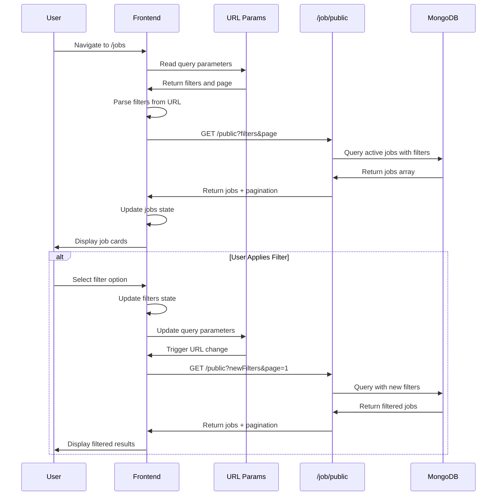
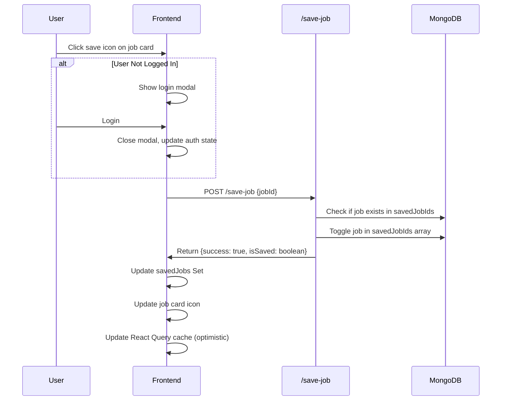

# Feature: Job Search & Browsing

## Overview

**Purpose**: The Job Search & Browsing feature allows users (both authenticated and anonymous) to search, filter, and browse active job listings. It provides comprehensive filtering options, pagination, job saving functionality, and seamless navigation to job detail pages.

**User Story**: As a job seeker (or visitor), I want to search and filter job listings so that I can find relevant opportunities that match my preferences, skills, location, and other criteria.

**Key Functionality**:
- Browse active job listings (public access, no authentication required)
- Comprehensive filtering system (10+ filter categories with multi-select support)
- Pagination (20 jobs per page)
- Save/unsave jobs (requires authentication)
- View job details (click to navigate)
- URL-based filter state (shareable URLs)
- Responsive design (desktop sidebar filters, mobile filter drawer)
- Job count display
- Empty state handling
- Loading and error states
- Login modal integration (for save functionality)
- Promotional banner display

**Access Level**: Public (No authentication required for browsing, authentication required for saving jobs)

**URL Path**: `/jobs`

**Query Parameters**:
- `page`: Page number (default: 1)
- `department`: Array of departments
- `jobType`: Array of job types
- `employmentType`: Array of employment types
- `experience`: Array of experience levels
- `workMode`: Array of work modes
- `location`: Array of locations
- `highestQualification`: Array of qualifications
- `minSalary`: Array of minimum salary values
- `maxSalary`: Array of maximum salary values (paired with minSalary)
- `numberOfOpenings`: Array of opening ranges
- `freshness`: Array of posted date filters
- `openingDateFreshness`: Array of opening date filters

---

## User Flow

### Primary Flow - Browse and Filter Jobs
1. User navigates to `/jobs`
2. Page loads with default filters (no filters applied)
3. **Job List Display**:
   - Jobs fetched from API (20 per page)
   - Job cards displayed with key information
   - Pagination controls shown (if multiple pages)
4. **Apply Filters**:
   - User selects filters from sidebar (desktop) or filter drawer (mobile)
   - Filters applied immediately (URL updated, jobs refreshed)
   - Active filter count displayed
5. **Navigate Results**:
   - User clicks job card → Navigates to job detail page (`/{shortId}`)
   - User changes page → New jobs loaded
   - User clears filters → All filters removed, jobs refreshed
6. **Save Job** (optional, requires login):
   - User clicks save icon on job card
   - If not logged in: Login modal appears
   - If logged in: Job saved/unsaved, icon updates

### Alternative Flows
- **URL with Filters**: User shares/bookmarks filtered URL → Filters loaded from URL → Jobs fetched with filters
- **No Results**: Filters applied but no jobs match → Empty state shown with message
- **Mobile Browsing**: Filters accessible via drawer (bottom sheet), jobs list below
- **Error State**: API error occurs → Error message displayed, user can retry
- **Loading State**: Jobs fetching → Loading spinner shown

### Edge Cases
- **No Active Jobs**: Empty state shown
- **Filter Combination**: Multiple filters from different categories applied simultaneously
- **Pagination Edge**: Last page, first page navigation
- **Save State Sync**: Saved jobs state synchronized when user logs in/out
- **URL State**: Browser back/forward navigation maintains filter state

---

## Frontend Implementation

### Screen Structure

**Main Page Component**:
- File: `frontend/src/app/jobs/page.jsx`
- Type: Client Component (wrapped in Suspense)

**Client Component**:
- File: `frontend/src/app/jobs/JobsPageClient.jsx`
- Type: Client Component
- Lines: ~1149 lines

**Styling**:
- CSS File: `frontend/src/app/jobs/page.css`
- CSS Modules: No
- Responsive: Yes (desktop sidebar, mobile drawer)

### Component Hierarchy

```
Page (page.jsx)
  └── Suspense
      └── JobsPageClient (JobsPageClient.jsx)
          ├── Filters Sidebar (desktop only)
          │   └── 10 Filter Groups
          ├── Mobile Filter Drawer (mobile only)
          │   └── 10 Filter Groups
          ├── Main Content
          │   ├── Header
          │   │   ├── Title & Job Count
          │   │   └── Mobile Filter Button
          │   ├── Jobs List
          │   │   └── Job Cards (multiple)
          │   │       ├── Job Header (title, company, logo)
          │   │       ├── Job Details (experience, location, salary)
          │   │       ├── Job Meta (date, openings)
          │   │       ├── Skills (highlighted)
          │   │       └── Save Button
          │   ├── Pagination
          │   └── Empty State (conditional)
          ├── Promotional Banner
          └── Login Modal (conditional)
```

### State Management

**Local State**:
```javascript
const [jobs, setJobs] = useState([]);
const [loading, setLoading] = useState(true);
const [error, setError] = useState(null);
const [currentPage, setCurrentPage] = useState(1);
const [pagination, setPagination] = useState({});
const [showMobileFilters, setShowMobileFilters] = useState(false);
const [savedJobs, setSavedJobs] = useState(() => new Set());
const [savingJobId, setSavingJobId] = useState(null);
const [isJobSeekerLoggedIn, setIsJobSeekerLoggedIn] = useState(false);
const [jobSeekerToken, setJobSeekerToken] = useState(null);
const [showLoginModal, setShowLoginModal] = useState(false);
const [filters, setFilters] = useState({
    department: [],
    jobType: [],
    employmentType: [],
    experience: [],
    workMode: [],
    location: [],
    highestQualification: [],
    salaryRange: [],
    numberOfOpenings: [],
    freshness: [],
    openingDateFreshness: []
});
```

**Refs**:
```javascript
const isInitialMount = useRef(true);
const prevFiltersRef = useRef(null);
const prevPageRef = useRef(null);
const isFetchingRef = useRef(false);
```

**URL State**:
- Filters and pagination synced with URL query parameters
- Uses `useSearchParams` from Next.js
- URL updated when filters change
- Filters loaded from URL on page load

### Filter System

**10 Filter Categories**:

1. **Department** (Multi-select):
   - Options: IT/Software, Sales & Marketing, HR, Finance, Operations, Engineering, Product, Design, Customer Support, Legal, Administration, Manufacturing, Healthcare, Education, Other

2. **Job Type** (Multi-select):
   - Options: Full-time, Part-time, Internship, Freelance, Contract, Temporary

3. **Employment Type** (Multi-select):
   - Options: Permanent, Contract, Temporary

4. **Experience** (Multi-select):
   - Options: Fresher, 0-1 years, 1-2 years, 2-3 years, 3-5 years, 5-7 years, 7-10 years, 10+ years

5. **Work Mode** (Multi-select):
   - Options: Onsite, Hybrid, Remote

6. **Location** (Multi-select):
   - Options: Bangalore, Mumbai, Delhi NCR, Hyderabad, Pune, Chennai, Kolkata, Ahmedabad, Jaipur, Chandigarh, Indore, Gurgaon, Noida, Kochi, Coimbatore, Goa, Remote, Other

7. **Minimum Qualification** (Multi-select):
   - Options: 10th Pass, 12th Pass, Diploma, Bachelor's Degree, Master's Degree, MBA, Ph.D., Professional Degree, Technical Certification, Other

8. **Salary Range** (Multi-select, object-based):
   - Options:
     - 0-5 Lakhs (0-500,000)
     - 5-10 Lakhs (500,000-1,000,000)
     - 10-15 Lakhs (1,000,000-1,500,000)
     - 15-20 Lakhs (1,500,000-2,000,000)
     - 20-25 Lakhs (2,000,000-2,500,000)
     - 25-30 Lakhs (2,500,000-3,000,000)
     - 30-50 Lakhs (3,000,000-5,000,000)
     - 50+ Lakhs (5,000,000+)

9. **Number of Openings** (Multi-select):
   - Options: 1-10, 11-50, 51-100, 101-200, 201-300, 300+

10. **Posted Date** (Multi-select, freshness filter):
    - Options: Any time, Today, Past week, Past month

11. **Opening Date** (Multi-select, openingDateFreshness filter):
    - Options: Any time, Today, Past week, Past month

**Filter Implementation**:
- Multi-select checkboxes
- Arrays stored in state
- URL parameters synced (array values repeated in URL)
- "Clear All" button removes all filters
- Active filter count displayed

### Filter Change Handler

```javascript
const handleMultiSelectChange = (key, optionValue) => {
    setCurrentPage(1); // Reset to page 1 when filters change
    
    const currentArray = Array.isArray(filters[key]) ? filters[key] : [];
    let newArray;
    
    // Handle salary range (object-based)
    if (key === "salaryRange" && typeof optionValue === "object") {
        const exists = currentArray.some(
            item => item.min === optionValue.min && item.max === optionValue.max
        );
        newArray = exists
            ? currentArray.filter(item => !(item.min === optionValue.min && item.max === optionValue.max))
            : [...currentArray, optionValue];
    } else {
        // Handle regular array values
        newArray = currentArray.includes(optionValue)
            ? currentArray.filter(v => v !== optionValue)
            : [...currentArray, optionValue];
    }
    
    const newFilters = { ...filters, [key]: newArray };
    setFilters(newFilters);
    
    // Update URL
    const params = new URLSearchParams({ page: "1" });
    Object.entries(newFilters).forEach(([filterKey, value]) => {
        if (Array.isArray(value)) {
            value.forEach(v => {
                if (v) {
                    if (filterKey === "salaryRange" && typeof v === "object") {
                        params.append("minSalary", v.min);
                        params.append("maxSalary", v.max);
                    } else {
                        params.append(filterKey, v);
                    }
                }
            });
        }
    });
    router.push(`/jobs?${params.toString()}`);
};
```

### Fetch Jobs

```javascript
const fetchJobs = async (filtersToUse = filters, pageToUse = currentPage) => {
    // Prevent duplicate fetches
    if (isFetchingRef.current) return;
    isFetchingRef.current = true;
    
    try {
        setLoading(true);
        setError(null);
        
        const params = new URLSearchParams({
            page: pageToUse.toString(),
            limit: "20"
        });
        
        // Add filters to params
        Object.entries(filtersToUse).forEach(([key, value]) => {
            if (Array.isArray(value)) {
                value.forEach(v => {
                    if (v) {
                        if (key === "salaryRange" && typeof v === "object") {
                            params.append("minSalary", v.min);
                            params.append("maxSalary", v.max);
                        } else {
                            params.append(key, v);
                        }
                    }
                });
            }
        });
        
        const response = await axios.get(
            `${process.env.NEXT_PUBLIC_JOB_URL}/public?${params.toString()}`
        );
        
        if (response.data.success) {
            setJobs(response.data.data);
            setPagination(response.data.pagination);
        } else {
            setError("Failed to load jobs");
        }
    } catch (err) {
        setError(err.response?.data?.message || "Failed to load jobs");
    } finally {
        setLoading(false);
        isFetchingRef.current = false;
    }
};
```

### Job Card Display

Each job card displays:
- **Header**:
  - Job title
  - Company name (with building icon)
  - Company logo (or placeholder with initial)
- **Details Row**:
  - Experience required (with briefcase icon)
  - Location (with map marker icon)
  - Salary range (with money icon, formatted in Lakhs)
- **Meta Row**:
  - Posted date (relative: "Today", "2 days ago", or formatted date)
  - Number of openings (if available)
- **Skills**:
  - Up to 5 skill tags displayed
  - "+X more" indicator if more skills exist
- **Save Button**:
  - Bookmark icon (filled if saved, outline if not saved)
  - Click to save/unsave (requires login)

### Save Job Functionality

**Save Handler**:
```javascript
const handleSaveJob = async (jobId, jobData) => {
    if (!jobId) return;
    
    if (!isJobSeekerLoggedIn || !jobSeekerToken) {
        setShowLoginModal(true);
        return;
    }
    
    if (savingJobId) return; // Prevent duplicate clicks
    
    setSavingJobId(jobId);
    try {
        const response = await axios.post(
            `${process.env.NEXT_PUBLIC_JOBSEEKER_URL}/save-job`,
            { jobId },
            {
                headers: {
                    Authorization: `Bearer ${jobSeekerToken}`
                }
            }
        );
        
        if (response.data.success) {
            // Update saved jobs set
            setSavedJobs((prev) => {
                const next = new Set(prev);
                if (response.data.isSaved) {
                    next.add(jobId);
                } else {
                    next.delete(jobId);
                }
                return next;
            });
            
            // Update React Query cache for saved jobs lists
            // (Optimistic update for saved jobs page)
        }
    } catch (err) {
        if (err?.response?.status === 401) {
            setShowLoginModal(true);
            setIsJobSeekerLoggedIn(false);
            setJobSeekerToken(null);
            setSavedJobs(() => new Set());
        } else {
            toast.error(err?.response?.data?.message || "Failed to update saved job");
        }
    } finally {
        setSavingJobId(null);
    }
};
```

**Saved Status Check**:
- On jobs load, if user is logged in, check saved status for all jobs
- Uses `/jobseeker/check-saved/{jobId}` endpoint
- Updates `savedJobs` Set with saved job IDs
- Optimized with Promise.all for parallel checks

### Pagination

**Pagination Controls**:
- Previous button (disabled on first page)
- Page numbers (limited display)
- Next button (disabled on last page)
- Current page highlighted

**Pagination State**:
```javascript
pagination: {
    currentPage: 1,
    totalPages: 10,
    totalJobs: 200,
    limit: 20,
    hasNextPage: true,
    hasPrevPage: false
}
```

**Page Change Handler**:
```javascript
const handlePageChange = (newPage) => {
    setCurrentPage(newPage);
    
    // Update URL
    const params = new URLSearchParams(searchParams);
    params.set("page", newPage.toString());
    router.push(`/jobs?${params.toString()}`);
    
    // Scroll to top
    window.scrollTo({ top: 0, behavior: "smooth" });
};
```

### URL State Management

**Load Filters from URL**:
```javascript
useEffect(() => {
    const params = new URLSearchParams(searchParams);
    
    // Reconstruct salaryRange from minSalary/maxSalary pairs
    const minSalaries = params.getAll("minSalary");
    const maxSalaries = params.getAll("maxSalary");
    const salaryRange = [];
    for (let i = 0; i < Math.min(minSalaries.length, maxSalaries.length); i++) {
        salaryRange.push({
            min: parseInt(minSalaries[i]),
            max: parseInt(maxSalaries[i])
        });
    }
    
    const urlFilters = {
        department: params.getAll("department") || [],
        jobType: params.getAll("jobType") || [],
        // ... other filters
        salaryRange: salaryRange,
        // ...
    };
    const page = parseInt(params.get("page")) || 1;
    
    setFilters(urlFilters);
    setCurrentPage(page);
    
    // Only fetch if filters or page changed
    if (filtersChanged || pageChanged || isInitialMount.current) {
        fetchJobs(urlFilters, page);
    }
}, [searchParams]);
```

### API Integration

**Endpoints Called**:

| Endpoint | Method | Purpose | Authentication |
|----------|--------|---------|----------------|
| `/job/public` | GET | Fetch filtered job listings | Not required |
| `/jobseeker/check-saved/{jobId}` | GET | Check if job is saved | Bearer token (optional) |
| `/jobseeker/save-job` | POST | Save/unsave job | Bearer token (required) |

**Environment Variables**:
- `NEXT_PUBLIC_JOB_URL`: Base URL for job API
- `NEXT_PUBLIC_JOBSEEKER_URL`: Base URL for job seeker API

### Responsive Design

**Desktop Layout**:
- Three-column layout: Filters sidebar (left) + Jobs list (center) + Optional banner (right)
- Fixed sidebar with scrollable filters
- Jobs list scrollable independently

**Mobile Layout**:
- Single-column layout
- Filter button in header
- Filter drawer (bottom sheet) opens on button click
- Jobs list below header
- Bottom sheet prevents background scroll

**Mobile Filter Drawer**:
- Overlay background
- Drawer slides up from bottom
- All filters accessible
- Close button to dismiss
- Body scroll locked when open

### UI States

**Loading State**:
- CircularProgress spinner
- Message: "Loading jobs..."
- Shown during API fetch

**Error State**:
- Error message displayed
- User can retry by refreshing or changing filters
- No explicit retry button (user must navigate)

**Empty State**:
- Icon: Briefcase
- Title: "No jobs found"
- Message: "Try adjusting your filters"
- Shown when `jobs.length === 0` and not loading

**Success State**:
- Jobs list displayed
- Job count shown in header
- Pagination controls shown (if needed)
- No explicit success message

---

## Backend Implementation

### API Endpoints

#### Get Public Jobs

**Route Definition**:
```javascript
// File: backend/src/routes/jobRoutes.js
router.get("/public", jobController.getPublicJobs);
```

**Full Endpoint Path**: `/job/public`

**HTTP Method**: GET

**Authentication Required**: No (Public endpoint)

**Query Parameters**:
- `page` (optional, default: 1): Page number
- `limit` (optional, default: 20): Number of results per page
- `department`: Array (multiple values allowed)
- `jobType`: Array (multiple values allowed)
- `employmentType`: Array (multiple values allowed)
- `workMode`: Array (multiple values allowed)
- `location`: Array (multiple values allowed)
- `highestQualification`: Array (multiple values allowed)
- `experience`: Array (multiple values allowed)
- `minSalary`: Array (multiple values allowed, paired with maxSalary)
- `maxSalary`: Array (multiple values allowed, paired with minSalary)
- `numberOfOpenings`: Array (multiple values allowed)
- `freshness`: Array (multiple values allowed: "today", "week", "month")
- `openingDateFreshness`: Array (multiple values allowed: "today", "week", "month")

**Response Format**:
```json
{
  "success": true,
  "data": [
    {
      "_id": "job_id",
      "jobTitle": "Software Engineer",
      "companyName": "Tech Company",
      "location": "Bangalore, Karnataka",
      "workMode": "Remote",
      "jobType": "Full-time",
      "employmentType": "Permanent",
      "experience": "2-5 years",
      "minSalary": 500000,
      "maxSalary": 1000000,
      "numberOfOpenings": 5,
      "department": "IT/Software",
      "highestQualification": "Bachelor's Degree",
      "skills": ["JavaScript", "React", "Node.js"],
      "applicationOpeningDate": "2024-01-15T00:00:00.000Z",
      "applicationClosingDate": "2024-02-15T23:59:59.999Z",
      "createdAt": "2024-01-15T10:30:00.000Z",
      "shortId": "job_short_id",
      "employerId": {
        "_id": "employer_id",
        "companyName": "Tech Company",
        "companyLogo": "logo_url_or_null"
      }
    }
  ],
  "pagination": {
    "currentPage": 1,
    "totalPages": 10,
    "totalJobs": 200,
    "limit": 20,
    "hasNextPage": true,
    "hasPrevPage": false
  }
}
```

**Controller Logic** (`getPublicJobs`):
1. Extract query parameters (handle arrays for multi-select)
2. Build MongoDB query:
   - Base query: `{ status: 'Active' }`
   - Date filters: `applicationClosingDate >= today`, `applicationOpeningDate <= today`
3. Apply filters:
   - **Department**: Regex match (case-insensitive)
   - **Job Type**: `$in` operator
   - **Employment Type**: `$in` operator
   - **Work Mode**: `$in` operator
   - **Location**: Regex match (case-insensitive)
   - **Qualification**: Regex match (case-insensitive)
   - **Experience**: Regex match for ranges (handles "Fresher", ranges, "+" suffix)
   - **Salary Range**: Complex $or conditions (handles multiple ranges)
   - **Number of Openings**: Range conditions (handles "1-10", "11-50", etc.)
   - **Freshness**: Date range conditions (today, week, month)
   - **Opening Date Freshness**: Date range conditions
4. Combine conditions with `$and` array
5. Calculate pagination (skip, limit)
6. Execute query with:
   - `.populate('employerId', 'companyName companyLogo')` for employer data
   - `.sort({ createdAt: -1, applicationOpeningDate: -1 })` for recent first
   - `.skip(skip).limit(limit)`
7. Get total count for pagination
8. Return jobs array with pagination info

**Key Filter Logic**:

**Salary Range Filtering**:
```javascript
// Handles multiple salary ranges
const salaryConditions = [];
for (let i = 0; i < Math.min(minSalaries.length, maxSalaries.length); i++) {
    const minSal = parseInt(minSalaries[i]) || 0;
    const maxSal = parseInt(maxSalaries[i]) || Number.MAX_SAFE_INTEGER;
    
    salaryConditions.push({
        $or: [
            // Job's min salary is within filter range
            { minSalary: { $gte: minSal, $lte: maxSal } },
            // Job's max salary is within filter range
            { maxSalary: { $gte: minSal, $lte: maxSal } },
            // Job's range completely contains filter range
            { $and: [
                { minSalary: { $lte: minSal } },
                { maxSalary: { $gte: maxSal } }
            ]}
        ]
    });
}
```

**Experience Filtering**:
```javascript
// Handles various experience formats
const experienceConditions = experience.map(exp => {
    if (exp === "Fresher") {
        return { experience: { $regex: /fresher/i } };
    } else if (exp.includes("+")) {
        // Handle "10+ years"
        return { experience: { $regex: new RegExp(exp.replace("+", ".*\\+"), "i") } };
    } else if (exp.includes("-")) {
        // Handle ranges like "0-1 years", "1-2 years"
        return { experience: { $regex: new RegExp(exp.replace(/-/g, ".*-.*"), "i") } };
    } else {
        return { experience: { $regex: new RegExp(exp, "i") } };
    }
});
```

**Date Filtering**:
- Uses local day bounds to avoid timezone issues
- `todayStart.setHours(0, 0, 0, 0)` for start of day
- `todayEnd.setHours(23, 59, 59, 999)` for end of day
- Handles freshness (createdAt) and opening date freshness separately

### Database Models

**Job Model** (`backend/src/models/job.js`):
- Fields used for filtering:
  - `status`: String (must be 'Active')
  - `jobTitle`: String
  - `companyName`: String
  - `location`: String
  - `department`: String
  - `jobType`: String
  - `employmentType`: String
  - `workMode`: String
  - `experience`: String
  - `highestQualification`: String
  - `minSalary`: Number
  - `maxSalary`: Number
  - `numberOfOpenings`: Number
  - `applicationOpeningDate`: Date
  - `applicationClosingDate`: Date
  - `createdAt`: Date
  - `shortId`: String
  - `employerId`: ObjectId (reference to Employer)

**Employer Model** (populated):
- `companyName`: String
- `companyLogo`: String (base64 or URL)

### Middleware Chain

**No authentication middleware** (public endpoint)

**No special middleware** (standard Express route)

---

## Data Flow

### Job Browsing Flow



### Save Job Flow



---

## Error Handling

### Frontend Error Handling

**Network Errors**:
- Error message displayed: "Failed to load jobs"
- Error persists until user navigates or refreshes
- No automatic retry

**API Errors**:
- Error message from API response displayed
- Fallback to generic message if no API message
- Logged to console for debugging

**Save Job Errors**:
- 401 error: Show login modal, clear auth state
- Other errors: Toast notification with error message
- Save state not updated on error

**Validation Errors**:
- URL parameter validation (page number, etc.)
- Graceful handling of invalid parameters

### Backend Error Handling

**Query Errors**:
- Database errors: 500 Internal Server Error
- Invalid parameters: Handled gracefully (defaults used)

**Status Codes**:
- 200: Success
- 500: Internal Server Error

**Error Messages**:
- Generic messages (no sensitive info exposed)
- Error details logged to console

---

## Security Features

### Public Access
- No authentication required for browsing jobs
- Only active jobs returned (status: 'Active')
- Only jobs with valid dates shown (closing date >= today, opening date <= today)
- No sensitive employer data exposed

### Save Functionality
- Requires authentication
- User can only save/unsave jobs
- No access to other users' saved jobs list (checked per job)

### Input Validation
- Query parameters validated
- Page number validated (positive integer)
- Limit validated (reasonable max)
- Array parameters handled safely
- MongoDB injection prevented (using Mongoose)

---

## UI/UX Details

### Layout Structure

**Desktop**:
- Three-column layout
- Left: Filters sidebar (fixed width, scrollable)
- Center: Jobs list (flexible width, scrollable)
- Right: Optional promotional banner (fixed width)

**Mobile**:
- Single-column layout
- Header: Title, job count, filter button
- Body: Jobs list
- Bottom sheet: Filters drawer (opens on button click)

### Visual Design

**Job Card**:
- White background, rounded corners
- Shadow for depth
- Hover effect (slight elevation)
- Clickable entire card (cursor: pointer)

**Filter Sidebar**:
- Sticky positioning (scrolls with content)
- Section headers
- Checkboxes with labels
- Clear visual hierarchy

**Pagination**:
- Previous/Next buttons
- Page numbers (limited display)
- Current page highlighted
- Disabled state for edge pages

**Colors**:
- Primary: Blue (#2563eb)
- Success: Green (#10b981)
- Text: Gray shades
- Borders: Light gray

**Icons**:
- React Icons (Font Awesome)
- Briefcase, Building, Map Marker, Money, Calendar, Bookmark

### Responsive Design

**Breakpoints**:
- Desktop: >768px (sidebar visible)
- Mobile: ≤768px (drawer on button click)

**Mobile Optimizations**:
- Touch-friendly button sizes
- Scrollable filter drawer
- Body scroll locked when drawer open
- Optimized job card layout

### Accessibility

**Keyboard Navigation**:
- Tab order logical
- Enter/Space for checkboxes
- Escape to close drawer
- Arrow keys for pagination

**Screen Reader Support**:
- Semantic HTML elements
- ARIA labels on buttons
- Descriptive link text
- Form labels properly associated

---

## Testing Considerations

### Test Scenarios

**Happy Path**:
1. User browses jobs → Jobs displayed → Pagination works
2. User applies filters → Jobs filtered → URL updated → Results correct
3. User saves job → Job saved → Icon updates → Saved jobs page updated
4. User navigates pages → Correct page loaded → Jobs displayed

**Filter Scenarios**:
1. Single filter applied → Correct jobs shown
2. Multiple filters from same category → OR logic (jobs matching any)
3. Multiple filters from different categories → AND logic (jobs matching all)
4. Salary range filter → Jobs with overlapping ranges shown
5. Experience filter → Jobs with matching experience shown
6. Date filters → Jobs within date ranges shown
7. Clear all filters → All filters removed → All active jobs shown

**Edge Cases**:
1. No jobs match filters → Empty state shown
2. Invalid URL parameters → Handled gracefully, defaults used
3. Network error → Error message shown
4. User logs in while browsing → Save functionality enabled
5. User logs out while browsing → Save functionality disabled, saved state cleared
6. Large result set → Pagination handles correctly
7. Very specific filters → Few or no results → Empty state

**Pagination**:
1. First page → Previous disabled
2. Last page → Next disabled
3. Page navigation → Correct jobs loaded
4. URL with page parameter → Correct page loaded
5. Filter change → Page reset to 1

**Save Functionality**:
1. Save job while not logged in → Login modal shown
2. Save job while logged in → Job saved, icon updates
3. Unsave job → Job unsaved, icon updates
4. Save state persists across page navigation
5. Save state syncs on login/logout

---

## Related Features

- **Job Detail Page** (`/{shortId}`): Individual job detail view
- **Saved Jobs** (`/jobseeker/saved-jobs`): List of saved jobs
- **Job Seeker Home Dashboard** (`/jobseeker/home`): Dashboard with job search link
- **Login Modal**: Reusable login component for save functionality

---

## Additional Notes

**Dependencies**:
- `axios`: HTTP client
- `js-cookie`: Cookie management
- `next/navigation`: Routing and URL handling
- `react-hot-toast`: Toast notifications
- `@mui/material`: Loading spinner
- `react-icons/fa`: Icon library

**Performance Considerations**:
- Jobs fetched on filter/page change (no debouncing)
- Duplicate fetch prevention with ref
- Saved status checked in parallel (Promise.all)
- React Query cache used for saved jobs lists
- Pagination limits result set size (20 per page)

**URL State Benefits**:
- Shareable URLs with filters
- Bookmarkable filtered views
- Browser back/forward navigation works
- Deep linking support

**Known Limitations**:
- No search text input (only filters)
- No sort options (always sorted by createdAt, applicationOpeningDate)
- No job preview on hover
- Filter state not persisted across sessions (only in URL)
- Saved status checks done per job (could be optimized with bulk check)

**Future Enhancements**:
- Text search input (search job titles, descriptions)
- Sort options (salary, date, relevance)
- Job preview on hover
- Advanced filters (skills, company size, etc.)
- Save filter presets
- Email alerts for saved filters
- Job recommendations based on profile
- Recent searches history

---

## Code References

### Frontend Files
- `frontend/src/app/jobs/page.jsx` - Page entry point (13 lines)
- `frontend/src/app/jobs/JobsPageClient.jsx` - Main component (~1149 lines)
- `frontend/src/app/jobs/page.css` - Styling
- `frontend/src/components/loginModal/LoginModal.jsx` - Login modal component
- `frontend/src/components/promotionalBanner/AIResumeBanner.jsx` - Promotional banner

### Backend Files
- `backend/src/routes/jobRoutes.js` - Route definitions (line 9)
- `backend/src/controllers/jobController.js` - Controller function:
  - `getPublicJobs` (lines 735-958)
- `backend/src/models/job.js` - Job model schema
- `backend/src/models/employer.js` - Employer model schema

---

*Last Updated: [Current Date]*
*Documented By: TSD Documentation System*

