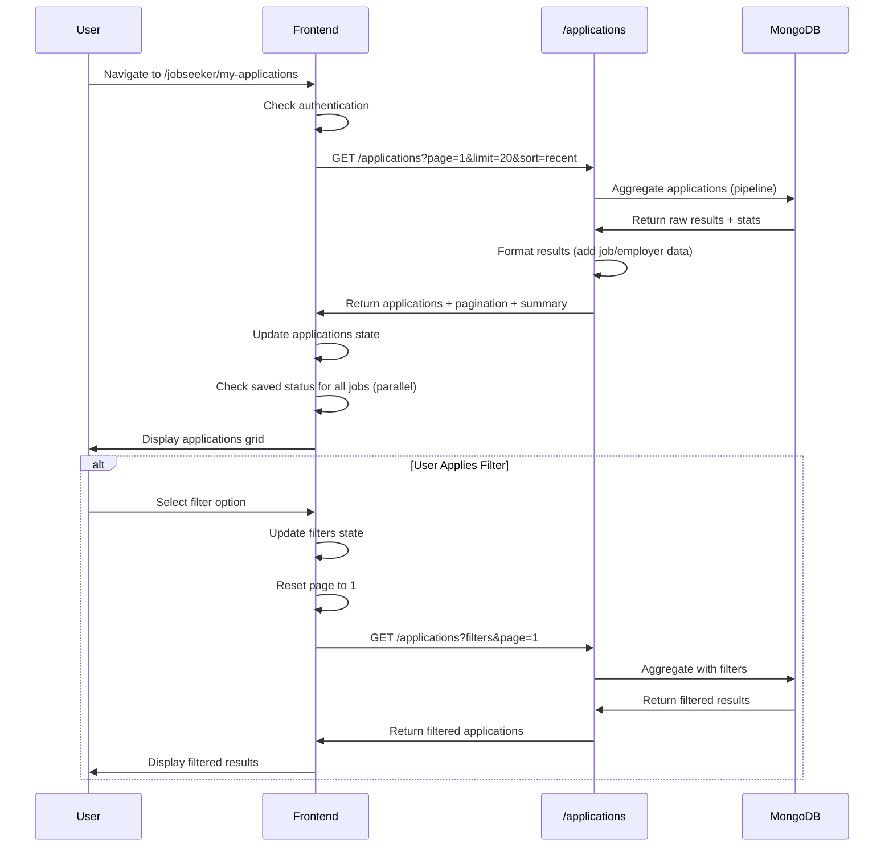
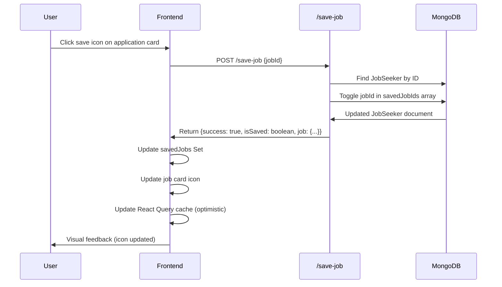

# Feature: Job Applications

## Overview

**Purpose**: The Job Applications feature allows job seekers to view, search, filter, and track all their job applications in one place. It provides comprehensive application status tracking, timeline visualization, employer engagement indicators, and summary statistics.

**User Story**: As a job seeker, I want to view all my job applications in one place so that I can track their status, see updates from employers, monitor timeline changes, and quickly access job details.

**Key Functionality**:
- View all job applications with detailed information
- Search applications (by job title, company name, location)
- Filter by status (pending, reviewed, shortlisted, rejected)
- Filter by submission type (direct, basic-test, video-test, basic+video)
- Filter by job type (Full-time, Part-time, etc.)
- Filter by work mode (Onsite, Hybrid, Remote)
- Sort applications (recent updates, oldest first, company A-Z, status)
- View application timeline (status change history)
- View employer engagement indicators (viewed, resume downloaded)
- Summary statistics (total applications, updates, status breakdown)
- Save/unsave jobs directly from application cards
- Navigate to job detail pages
- Pagination support (20 applications per page)
- Responsive design (desktop and mobile)

**Access Level**: Authenticated (Job Seeker only)

**URL Path**: `/jobseeker/my-applications`

**Authentication Required**: Yes (JWT token via `js_token` cookie)

---

## User Flow

### Primary Flow - View Applications
1. User navigates to `/jobseeker/my-applications`
2. Authentication check via `useJobSeekerAuth` hook
3. If not authenticated: Redirect to `/signin/jobseeker`
4. If authenticated: Applications page loads
5. **Data Loading**:
   - Fetch applications with default filters (page 1, limit 20, sort: recent)
   - Summary statistics calculated (total, updates, status breakdown)
6. **Page Display**:
   - Summary cards (total applications, updates, status breakdown)
   - Search bar and filter controls
   - Application cards grid/list
   - Pagination controls (if multiple pages)
7. User can interact with filters, search, and application cards

### Alternative Flows
- **Apply Filters**: User selects filters → Applications refreshed → Results filtered
- **Search**: User types in search → Debounced search → Applications refreshed → Results filtered
- **Sort**: User selects sort option → Applications refreshed → Results sorted
- **Navigate to Job**: User clicks "View job" link → Navigates to job detail page
- **Save Job**: User clicks save icon → Job saved/unsaved → Icon updates
- **View Timeline**: User views application card → Timeline events displayed chronologically

### Edge Cases
- **No Applications**: Empty state shown with message
- **Filter with No Results**: Empty state shown, filters remain active
- **Loading State**: Skeleton loaders shown during fetch
- **Error State**: Error message displayed, user can retry
- **Single Application**: Pagination hidden
- **Large Timeline**: All timeline events shown (may be lengthy)

---

## Frontend Implementation

### Screen Structure

**Main Page Component**:
- File: `frontend/src/app/jobseeker/(screens)/my-applications/page.jsx`
- Type: Client Component
- Lines: ~876 lines

**Styling**:
- CSS File: `frontend/src/app/jobseeker/(screens)/my-applications/page.css`
- CSS Modules: No
- Responsive: Yes (desktop and mobile)

### Component Hierarchy

```
JobSeekerMyApplicationsScreen (page.jsx)
  ├── useJobSeekerAuth() - Authentication check
  ├── Header Section
  │   ├── Title & Description
  │   └── Reset Filters Button
  ├── Summary Section
  │   ├── Total Applications Card
  │   ├── Application Updates Card
  │   └── Status Breakdown Card
  ├── Toolbar Section
  │   ├── Search Input
  │   ├── Filter Dropdowns (desktop)
  │   │   ├── Status Filter
  │   │   ├── Submission Type Filter
  │   │   ├── Job Type Filter
  │   │   └── Work Mode Filter
  │   ├── Sort Dropdown
  │   └── Mobile Filter Button & Drawer
  ├── Applications List Section
  │   ├── Loading State (skeleton cards)
  │   ├── Error State
  │   ├── Empty State
  │   └── Applications Grid
  │       └── Application Cards (multiple)
  │           ├── Header (company logo, name, job title, status)
  │           ├── Meta Info (applied date, job type, location)
  │           ├── Secondary Meta (submission type, work mode, updates count)
  │           ├── Timeline (status change events)
  │           ├── Employer Engagement (viewed, downloaded indicators)
  │           └── Footer (last update, save button, view job link)
  └── Pagination Section
```

### State Management

**React Query Hook**:
```javascript
const { data, isLoading, isFetching, error } = useJobApplications(queryFilters);
```

**Local State**:
```javascript
const [searchQuery, setSearchQuery] = useState("");
const [debouncedSearch, setDebouncedSearch] = useState("");
const [currentPage, setCurrentPage] = useState(1);
const [filters, setFilters] = useState({
    status: "",
    submissionType: "",
    jobType: "",
    workMode: "",
    sort: "recent"
});
const [showMobileFilters, setShowMobileFilters] = useState(false);
const [isMobile, setIsMobile] = useState(false);
const [savedJobs, setSavedJobs] = useState(new Set());
const [savingJobId, setSavingJobId] = useState(null);
const [openDropdownId, setOpenDropdownId] = useState(null);
```

**Computed Values**:
```javascript
const applications = data?.data || [];
const pagination = data?.pagination || {};
const summary = data?.summary || {
    totalApplications: 0,
    totalUpdates: 0,
    statusBreakdown: []
};
const queryFilters = useMemo(() => ({
    page: currentPage,
    limit: APPLICATIONS_PER_PAGE, // 20
    search: debouncedSearch,
    status: filters.status,
    submissionType: filters.submissionType,
    jobType: filters.jobType,
    workMode: filters.workMode,
    sort: filters.sort
}), [currentPage, debouncedSearch, filters]);
```

### Search Functionality

**Search Input**:
- Placeholder: "Search by company, title, or location"
- Real-time input with debouncing (400ms delay)
- Debounced search triggers new API call
- Page reset to 1 on search change

**Debounce Implementation**:
```javascript
useEffect(() => {
    const timeout = setTimeout(() => {
        setDebouncedSearch(searchQuery.trim());
        setCurrentPage(1);
    }, 400);
    return () => clearTimeout(timeout);
}, [searchQuery]);
```

**Search Scope**:
- Job title
- Company name
- Location

### Filter System

**Filter Categories**:

1. **Status Filter** (Single-select):
   - Options: All statuses, Pending review, Reviewed, Shortlisted, Rejected
   - Values: "", "pending", "reviewed", "shortlisted", "rejected"

2. **Submission Type Filter** (Single-select):
   - Options: All submission types, Direct application, Basic test, Video test, Basic + video
   - Values: "", "direct", "basic-test", "video-test", "basic+video"

3. **Job Type Filter** (Single-select):
   - Options: Any job type, Full-time, Part-time, Internship, Freelance, Contract, Temporary
   - Values: "", "Full-time", "Part-time", etc.

4. **Work Mode Filter** (Single-select):
   - Options: All work modes, Onsite, Hybrid, Remote
   - Values: "", "Onsite", "Hybrid", "Remote"

5. **Sort Options** (Single-select):
   - Options: Recent updates, Oldest first, Company A-Z, Status
   - Values: "recent", "oldest", "company_az", "status"

**Filter Implementation**:
- Dropdown components for each filter
- Single-select (radio-style behavior: clicking same value deselects)
- Sort is always applied (never empty)
- Page reset to 1 on filter change
- Active filter count displayed (excluding sort)

**Filter Change Handler**:
```javascript
const handleFilterChange = (key, value) => {
    setFilters((prev) => ({
        ...prev,
        [key]: key === "sort" ? value : (prev[key] === value ? "" : value)
        // For sort, always set value. For others, toggle (empty if same value selected)
    }));
};
```

### Filter Dropdown Component

**MyApplicationsFilterDropdown Component**:
- Reusable dropdown component
- Props: `id`, `label`, `value`, `options`, `onChange`, `variant`, `isOpen`, `onToggle`
- Click outside to close
- Active option highlighted
- Label shows current selection

**Implementation**:
```javascript
const MyApplicationsFilterDropdown = ({ id, label, value, options, onChange, variant = "default", isOpen, onToggle }) => {
    const dropdownRef = useRef(null);
    
    // Click outside handler
    useEffect(() => {
        if (!isOpen) return;
        const handleClick = (event) => {
            if (dropdownRef.current && !dropdownRef.current.contains(event.target)) {
                onToggle(null, false);
            }
        };
        document.addEventListener("mousedown", handleClick);
        return () => document.removeEventListener("mousedown", handleClick);
    }, [isOpen, onToggle]);
    
    const activeOption = options.find((option) => option.value === value);
    
    return (
        <div className="myapplications-filter-dropdown" ref={dropdownRef}>
            <button onClick={() => onToggle(id, !isOpen)}>
                <span>{label}</span>
                <strong>{activeOption?.label || options[0]?.label}</strong>
                <FaChevronDown />
            </button>
            {isOpen && (
                <div className="myapplications-filter-menu">
                    {options.map((option) => (
                        <button
                            key={option.value}
                            className={option.value === value ? "active" : ""}
                            onClick={() => {
                                onChange(option.value);
                                onToggle(null, false);
                            }}
                        >
                            {option.label}
                        </button>
                    ))}
                </div>
            )}
        </div>
    );
};
```

### Summary Section

**Three Summary Cards**:

1. **Total Applications**:
   - Value: `summary.totalApplications`
   - Label: "Total applications"

2. **Application Updates**:
   - Value: `summary.totalUpdates`
   - Label: "Application updates"

3. **Status Breakdown**:
   - Label: "Statuses"
   - Content: Status chips with counts
   - Chips: Pending, Reviewed, Shortlisted, Rejected (with color coding)
   - Format: "Status: Count"
   - Empty state: "No status updates yet" (if no statuses)

**Status Chips**:
```javascript
const statusChips = summary.statusBreakdown
    ?.filter((item) => item?.status)
    .map((item) => ({
        status: item.status,
        label: item.status.charAt(0).toUpperCase() + item.status.slice(1),
        count: item.count
    })) || [];
```

### Application Card Display

Each application card displays:

**Header**:
- Company logo (or placeholder with initial)
- Company name
- Job title
- Status badge (color-coded: pending=orange, reviewed=blue, shortlisted=green, rejected=red)

**Meta Information**:
- Applied date (formatted: "Applied {date}")
- Job type (with briefcase icon)
- Location (with building icon)

**Secondary Meta**:
- Submission type (formatted: "Submission: {type}")
- Work mode (formatted: "Mode: {mode}")
- Updates count (formatted: "Updates: {count}")

**Timeline**:
- All timeline events displayed chronologically
- Each event shows:
  - Date (formatted)
  - Label (event description)
  - Description (optional, smaller text)
  - Source indicator (dot color: system, jobseeker, employer)
- Events sorted by `createdAt` (oldest first)

**Employer Engagement**:
- Indicators shown if available:
  - "Viewed {relativeTime}" (if `employerEngagement.viewedAt`)
  - "Resume downloaded {relativeTime}" (if `employerEngagement.resumeDownloadedAt`)
  - "{count} employer update(s)" (if `employerUpdates > 0`)
- Empty state: "No employer actions yet"

**Footer**:
- Last update text (latest timeline event or `latestUpdateAt`)
- Save button (bookmark icon, filled if saved)
- "View job" link (to `/{shortId}`)

### Timeline Display

**Timeline Structure**:
```javascript
const timeline = [...(application.statusTimeline || [])].sort(
    (eventA, eventB) => new Date(eventA.createdAt) - new Date(eventB.createdAt)
);
```

**Timeline Event Format**:
- Date: Formatted date (e.g., "15 Jan 2024")
- Label: Event description (e.g., "Application submitted", "Status changed to reviewed")
- Description: Optional additional details
- Source: Visual indicator (dot color based on source: system, jobseeker, employer)

**Timeline Rendering**:
```javascript
{timeline.map((event, index) => (
    <div key={`${applicationId}-event-${index}`} className="myapplications-timeline-item">
        <div className="myapplications-timeline-left">
            <div className={`myapplications-timeline-dot myapplications-timeline-dot-${event.source || "system"}`} />
            <span className="myapplications-timeline-date">
                {formatDate(event.createdAt)}
            </span>
        </div>
        <div className="myapplications-timeline-right">
            <p>{event.label}</p>
            {event.description && <small>{event.description}</small>}
        </div>
    </div>
))}
```

### Save Job Functionality

**Save Handler**:
```javascript
const handleSaveJob = async (jobId) => {
    if (!jobId) return;
    
    const token = Cookies.get("js_token");
    if (!token) {
        toast.error("Please log in to save jobs");
        return;
    }
    
    if (savingJobId) return;
    
    setSavingJobId(jobId);
    try {
        const response = await axios.post(
            `${process.env.NEXT_PUBLIC_JOBSEEKER_URL}/save-job`,
            { jobId },
            { headers: { Authorization: `Bearer ${token}` } }
        );
        
        if (response.data.success) {
            setSavedJobs((prev) => {
                const newSet = new Set(prev);
                if (response.data.isSaved) {
                    newSet.add(jobId);
                } else {
                    newSet.delete(jobId);
                }
                return newSet;
            });
            
            // Update React Query cache for saved jobs lists (optimistic update)
        }
    } catch (err) {
        toast.error(err?.response?.data?.message || "Failed to save job");
    } finally {
        setSavingJobId(null);
    }
};
```

**Saved Status Check**:
- On applications load, check saved status for all jobs
- Uses `/jobseeker/check-saved/{jobId}` endpoint
- Updates `savedJobs` Set with saved job IDs
- Parallel checks with Promise.all

### Pagination

**Pagination Controls**:
- Previous button (disabled on first page or while fetching)
- Page info: "Page {current} of {total}"
- Next button (disabled on last page or while fetching)
- Only shown if `pagination.totalPages > 1`

**Pagination State**:
```javascript
pagination: {
    currentPage: 1,
    totalPages: 10,
    totalRecords: 200,
    limit: 20,
    hasNextPage: true,
    hasPrevPage: false
}
```

**Page Change Handler**:
```javascript
const handlePageChange = (direction) => {
    if (direction === "prev") {
        setCurrentPage((prev) => Math.max(1, prev - 1));
    } else {
        setCurrentPage((prev) => prev + 1);
    }
};
```

### Responsive Design

**Desktop Layout**:
- Filters shown inline in toolbar
- Applications grid (multiple columns)
- Full card details visible

**Mobile Layout**:
- Filter button opens drawer
- Sort dropdown in toolbar
- Applications stack vertically
- Filter drawer (bottom sheet) with overlay
- Body scroll locked when drawer open

**Mobile Filter Drawer**:
- Overlay background (click to close)
- Drawer slides up from bottom
- Contains all filter dropdowns
- "Clear filters" and "Apply filters" buttons
- Close button in header

### API Integration

**Endpoints Called**:

| Endpoint | Method | Purpose | Authentication |
|----------|--------|---------|----------------|
| `/jobseeker/applications` | GET | Fetch applications list | Bearer token |
| `/jobseeker/check-saved/{jobId}` | GET | Check if job is saved | Bearer token |
| `/jobseeker/save-job` | POST | Save/unsave job | Bearer token |

**Environment Variables**:
- `NEXT_PUBLIC_JOBSEEKER_URL`: Base URL for job seeker API

**React Query Configuration**:
- staleTime: 2 minutes
- gcTime: 5 minutes
- refetchOnWindowFocus: false
- Retry: 1 attempt (except on 401)
- On 401 error: Remove token, redirect to home

### UI States

**Loading State**:
- Skeleton cards shown (4 cards)
- Shown when `isLoading || !data`
- Loading spinner not shown (skeleton preferred)

**Error State**:
- Error message displayed
- Message from API response or generic message
- User can retry by refreshing or changing filters

**Empty State**:
- Icon: Briefcase (implied)
- Title: "No applications yet"
- Message: "Once you apply to roles, you'll see live status updates, employer activity, and timelines here."
- Shown when `applications.length === 0` and not loading

**Success State**:
- Applications grid displayed
- Summary cards populated
- Filters and search functional
- No explicit success message

---

## Backend Implementation

### API Endpoints

#### Get Job Applications List

**Route Definition**:
```javascript
// File: backend/src/routes/jobSeekerRoutes.js
router.get("/applications", verifyToken, jobSeekerController.getJobApplicationsList);
```

**Full Endpoint Path**: `/jobseeker/applications`

**HTTP Method**: GET

**Authentication Required**: Yes (Bearer token via `verifyToken` middleware)

**Query Parameters**:
- `page` (optional, default: 1): Page number
- `limit` (optional, default: 20, max: 50): Number of results per page
- `search` (optional): Search term (searches in jobTitle, companyName, location)
- `status` (optional): Filter by application status (pending, reviewed, shortlisted, rejected)
- `submissionType` (optional): Filter by submission type (direct, basic-test, video-test, basic+video)
- `jobType` (optional): Filter by job type
- `workMode` (optional): Filter by work mode
- `sort` (optional, default: "recent"): Sort order (recent, oldest, company_az, status)

**Response Format**:
```json
{
  "success": true,
  "data": [
    {
      "applicationId": "application_id",
      "jobId": "job_id",
      "jobTitle": "Software Engineer",
      "companyName": "Tech Company",
      "companyInitial": "T",
      "companyLogo": "logo_url_or_null",
      "location": "Bangalore",
      "workMode": "Remote",
      "jobType": "Full-time",
      "shortId": "job_short_id",
      "status": "pending",
      "submissionType": "direct",
      "appliedAt": "2024-01-15T10:30:00.000Z",
      "latestUpdateAt": "2024-01-15T10:30:00.000Z",
      "requiresBasicTest": false,
      "requiresVideoProctoredTest": false,
      "statusTimeline": [
        {
          "type": "status_change",
          "label": "Application submitted",
          "description": "",
          "source": "system",
          "createdAt": "2024-01-15T10:30:00.000Z",
          "meta": {}
        }
      ],
      "employerEngagement": {
        "viewedAt": "2024-01-15T11:00:00.000Z",
        "resumeDownloadedAt": null,
        "lastAction": "viewed"
      },
      "totalUpdates": 1,
      "employerUpdates": 0
    }
  ],
  "pagination": {
    "currentPage": 1,
    "totalPages": 10,
    "totalRecords": 200,
    "limit": 20,
    "hasNextPage": true,
    "hasPrevPage": false
  },
  "summary": {
    "totalApplications": 200,
    "totalUpdates": 150,
    "statusBreakdown": [
      { "status": "pending", "count": 80 },
      { "status": "reviewed", "count": 60 },
      { "status": "shortlisted", "count": 40 },
      { "status": "rejected", "count": 20 }
    ]
  }
}
```

**Controller Logic** (`getJobApplicationsList`):
1. Extract and validate query parameters
2. Build MongoDB aggregation pipeline:
   - Stage 1: Match applications by jobSeeker ID
   - Stage 2: Unwind applicants array
   - Stage 3: Match applicant filters (status, submissionType)
   - Stage 4: Lookup job data
   - Stage 5: Unwind job data
   - Stage 6: Lookup employer data
   - Stage 7: Unwind employer data (preserve null)
   - Stage 8: Match job filters (jobType, workMode, search)
   - Stage 9: Add computed fields (latestUpdateAt)
   - Stage 10: Sort by specified order
   - Stage 11: Facet for pagination and statistics:
     - Results: Skip, limit for pagination
     - TotalStats: Count total applications and updates
     - StatusStats: Group by status with counts
3. Execute aggregation pipeline
4. Format results:
   - Map raw results to application objects
   - Include job and employer data
   - Format timeline, engagement, etc.
5. Return formatted response with pagination and summary

**Sort Logic** (`buildApplicationSortStage`):
- `recent`: Sort by `latestUpdateAt` descending, then `appliedAt` descending
- `oldest`: Sort by `appliedAt` ascending
- `company_az`: Sort by company name ascending
- `status`: Sort by status (custom order: pending, reviewed, shortlisted, rejected)

**Employer Update Count** (`countEmployerTimelineUpdates`):
- Counts timeline events where `source === 'employer'`
- Used for employer engagement indicators

### Database Models

**JobApplication Model** (`backend/src/models/jobApplication.js`):
- Schema structure:
  - `job`: ObjectId reference to Job
  - `applicants`: Array of applicant entries
    - `jobSeeker`: ObjectId reference to JobSeeker
    - `status`: String enum (pending, reviewed, shortlisted, rejected)
    - `submissionType`: String enum (direct, basic-test, video-test, basic+video)
    - `appliedAt`: Date
    - `statusTimeline`: Array of timeline events
    - `employerEngagement`: Object (viewedAt, resumeDownloadedAt, lastAction)
    - `profileSnapshot`: Object (snapshot of profile at application time)

**Timeline Event Schema**:
```javascript
{
    type: String,        // Event type
    label: String,       // Display label
    description: String, // Optional description
    source: String,      // Enum: 'system', 'jobseeker', 'employer'
    createdAt: Date,     // Event timestamp
    meta: Object         // Additional metadata
}
```

**Employer Engagement Schema**:
```javascript
{
    viewedAt: Date,              // When employer viewed application
    resumeDownloadedAt: Date,    // When employer downloaded resume
    lastAction: String           // Last action taken
}
```

### Middleware Chain

**Authentication Middleware**:
- `verifyToken`: Validates JWT token, attaches userId
- On failure: Returns 401 Unauthorized

---

## Data Flow

### Applications List Flow



### Save Job Flow



---

## Error Handling

### Frontend Error Handling

**Authentication Errors**:
- 401 responses: Remove token, redirect to home (handled in React Query hook)
- Handled in `retry` and `onError` callbacks

**Network Errors**:
- Error message displayed: "Unable to load applications. Please try again."
- Error persists until user navigates or refreshes
- No automatic retry (except React Query retry logic)

**Save Job Errors**:
- 401 error: Toast error, prompt to log in
- Other errors: Toast error with message from API
- Save state not updated on error

### Backend Error Handling

**Authentication Errors**:
- Missing/invalid token: 401 Unauthorized
- User not found: 404 Not Found

**Query Errors**:
- Database errors: 500 Internal Server Error
- Invalid parameters: Handled gracefully (defaults used)

**Status Codes**:
- 200: Success
- 401: Unauthorized (authentication required)
- 404: Not Found (resource not found)
- 500: Internal Server Error

**Error Messages**:
- Generic messages (no sensitive info exposed)
- Error details logged to console

---

## Security Features

### Authentication
- JWT token required for all endpoints
- Token validated via middleware
- User can only access their own applications

### Authorization
- `req.userId` from token used to filter queries
- Applications filtered by jobSeeker ID in aggregation
- No cross-user data access possible

### Input Validation
- Query parameters validated (page, limit, etc.)
- Limit constraints (max 50)
- Search terms sanitized (regex escaping)
- Status and submissionType validated against enums

### Data Protection
- Sensitive data not exposed
- Profile snapshots only shown for user's own applications
- Employer data only includes public fields (companyName, companyLogo)

---

## UI/UX Details

### Layout Structure

**Page Sections** (top to bottom):
1. Header: Title, description, reset filters button
2. Summary Grid: 3 summary cards
3. Toolbar: Search, filters, sort
4. Applications List: Grid or empty state
5. Pagination: Controls (if multiple pages)

### Visual Design

**Application Card**:
- White background, rounded corners
- Shadow for depth
- Hover effect (slight elevation)
- Clear visual hierarchy

**Status Badges**:
- Color coding:
  - Pending: Orange (#f59e0b)
  - Reviewed: Blue (#3b82f6)
  - Shortlisted: Green (#10b981)
  - Rejected: Red (#ef4444)
- Capitalized first letter

**Timeline**:
- Vertical timeline with dots
- Left side: Date and source indicator
- Right side: Event label and description
- Chronological order (oldest to newest)

**Summary Cards**:
- Clean card design
- Large numbers for values
- Status chips with color coding
- Responsive grid layout

**Filter Dropdowns**:
- Consistent styling
- Active option highlighted
- Click outside to close
- Clear visual feedback

### Responsive Design

**Desktop**:
- Filters inline in toolbar
- Applications grid (2-3 columns)
- Full card details visible
- Side-by-side layout

**Mobile**:
- Filter button in toolbar
- Filter drawer (bottom sheet)
- Applications stack vertically
- Touch-friendly button sizes
- Optimized spacing

### Accessibility

**Keyboard Navigation**:
- Tab order logical through filters and cards
- Enter to activate buttons
- Escape to close dropdowns
- Arrow keys for navigation

**Screen Reader Support**:
- Semantic HTML elements
- ARIA labels on buttons
- Descriptive link text
- Status badges announced

---

## Testing Considerations

### Test Scenarios

**Happy Path**:
1. User views applications → All applications displayed → Summary correct
2. User applies status filter → Applications filtered → Counts updated
3. User searches → Results filtered → Search term highlighted
4. User sorts → Applications reordered → Order correct
5. User saves job → Job saved → Icon updated → Saved jobs list updated

**Filter Scenarios**:
1. Single filter applied → Correct applications shown
2. Multiple filters applied → Applications matching all filters shown
3. Filter with no results → Empty state shown
4. Clear filters → All filters reset → All applications shown

**Pagination**:
1. Multiple pages → Pagination shown → Navigation works
2. First page → Previous disabled
3. Last page → Next disabled
4. Page navigation → Correct page loaded

**Timeline**:
1. Timeline with multiple events → All events shown → Chronological order
2. Timeline with employer events → Employer events counted correctly
3. Timeline empty → No timeline shown (initial state only)

**Edge Cases**:
1. No applications → Empty state shown
2. Single application → Pagination hidden
3. Large timeline → All events displayed (may scroll)
4. Network error → Error message shown
5. Authentication expired → Redirect to home
6. Saved status check fails → Gracefully handles (defaults to not saved)

**Performance**:
1. Large number of applications → Pagination handles efficiently
2. Multiple filters → Query performance acceptable
3. Saved status checks → Parallel checks efficient
4. Timeline rendering → Performance acceptable for large timelines

---

## Related Features

- **Job Seeker Home Dashboard** (`/jobseeker/home`): Shows recent applications summary
- **Job Detail Page** (`/{shortId}`): Individual job view with apply functionality
- **Saved Jobs** (`/jobseeker/saved-jobs`): List of saved jobs
- **Job Search** (`/jobs`): Job browsing and searching

---

## Additional Notes

**Dependencies**:
- `@tanstack/react-query`: Data fetching and caching
- `axios`: HTTP client
- `js-cookie`: Cookie management
- `react-hot-toast`: Toast notifications
- `react-icons/fa`: Icon library

**Performance Optimizations**:
- React Query caching reduces API calls
- Debounced search prevents excessive API calls
- Parallel saved status checks (Promise.all)
- Pagination limits result set size
- Memoized filter calculations

**Known Limitations**:
- No real-time updates (requires page refresh or manual refetch)
- Timeline events not grouped (all shown individually)
- No filter presets or saved searches
- No export functionality
- No bulk actions

**Future Enhancements**:
- Real-time updates (WebSocket/SSE integration)
- Timeline event grouping (by date, by type)
- Filter presets
- Export applications (CSV, PDF)
- Bulk actions (delete applications, etc.)
- Application notes/comments
- Email notifications for status changes
- Application analytics/charts
- Sort by last update date (separate from recent)

---

## Code References

### Frontend Files
- `frontend/src/app/jobseeker/(screens)/my-applications/page.jsx` - Main component (~876 lines)
- `frontend/src/app/jobseeker/(screens)/my-applications/page.css` - Styling
- `frontend/src/hooks/useJobApplications.js` - Applications hook

### Backend Files
- `backend/src/routes/jobSeekerRoutes.js` - Route definitions
- `backend/src/controllers/jobSeekerController.js` - Controller function:
  - `getJobApplicationsList` (lines 1687-1875)
- `backend/src/models/jobApplication.js` - JobApplication model schema
- `backend/src/models/job.js` - Job model schema
- `backend/src/models/employer.js` - Employer model schema

---

*Last Updated: [Current Date]*
*Documented By: TSD Documentation System*

