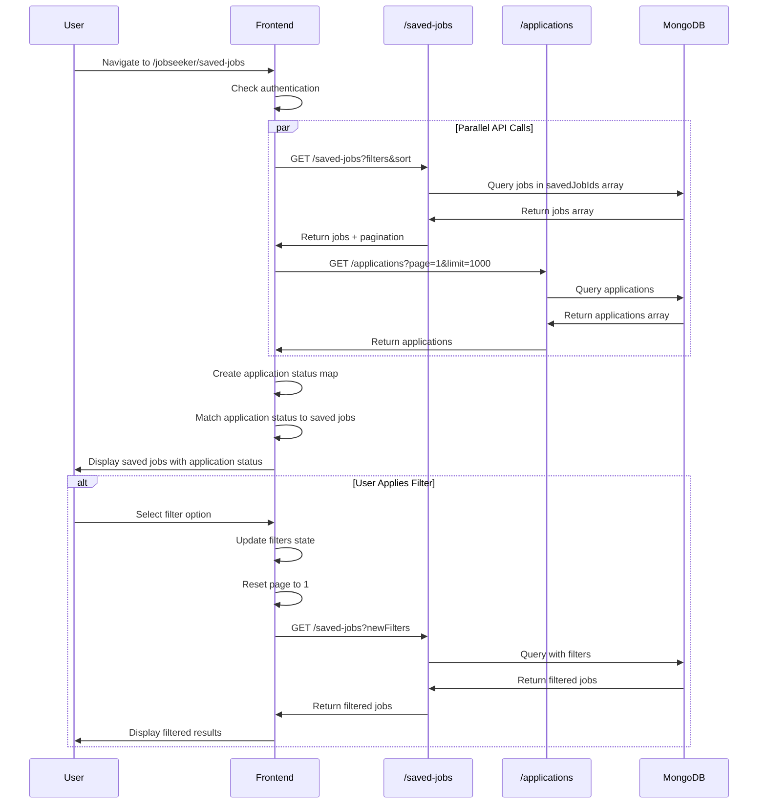
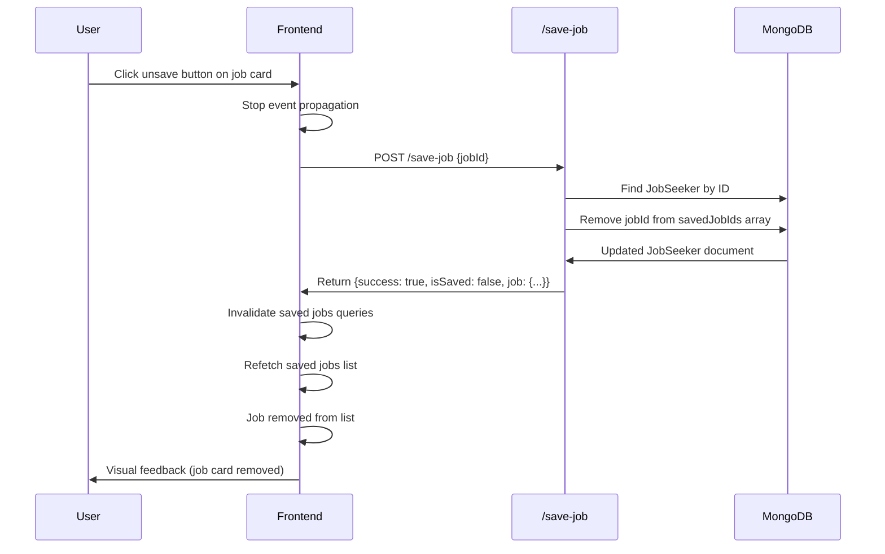

# Feature: Saved Jobs

## Overview

**Purpose**: The Saved Jobs feature allows job seekers to view, search, filter, and manage all jobs they have saved for later review. It provides functionality to unsave jobs and displays application status for saved jobs that have been applied to.

**User Story**: As a job seeker, I want to view all my saved jobs in one place so that I can easily find jobs I'm interested in, see which ones I've already applied to, and manage my saved jobs list.

**Key Functionality**:
- View all saved jobs with detailed information
- Search saved jobs (by job title, company name, location)
- Filter by status (Draft, Active, Inactive, Closed)
- Filter by job type (Full-time, Part-time, etc.)
- Filter by work mode (Onsite, Hybrid, Remote)
- Sort by various fields (Posted Date, Opening Date, Closing Date, Job Title, Status) with ascending/descending order
- Unsave jobs directly from the list
- View application status for saved jobs that have been applied to
- Navigate to job detail pages
- Pagination support (20 jobs per page)
- Responsive design (desktop and mobile)
- Empty state with call-to-action

**Access Level**: Authenticated (Job Seeker only)

**URL Path**: `/jobseeker/saved-jobs`

**Authentication Required**: Yes (JWT token via `js_token` cookie)

---

## User Flow

### Primary Flow - View Saved Jobs
1. User navigates to `/jobseeker/saved-jobs`
2. Authentication check via `useJobSeekerAuth` hook
3. If not authenticated: Redirect to `/signin/jobseeker`
4. If authenticated: Saved jobs page loads
5. **Data Loading**:
   - Fetch saved jobs with default filters (page 1, limit 20, sortBy: createdAt, sortOrder: desc)
   - Fetch all applications (limit 1000) to check applied status
6. **Page Display**:
   - Header with title and job count
   - Search bar and filter/sort controls
   - Saved jobs list (grid/cards)
   - Pagination controls (if multiple pages)
7. User can interact with search, filters, sort, and job cards

### Alternative Flows
- **Apply Filters**: User selects filters → Jobs refreshed → Results filtered
- **Search**: User types in search → Debounced search → Jobs refreshed → Results filtered
- **Sort**: User selects sort option → Jobs refreshed → Results sorted
- **Unsave Job**: User clicks unsave button → Job removed from saved list → List refreshed
- **Navigate to Job**: User clicks job card → Navigates to job detail page
- **View Application Status**: Saved job has application → Application status displayed on card

### Edge Cases
- **No Saved Jobs**: Empty state shown with message and "Explore Jobs" button
- **Filter with No Results**: Empty state shown (same as no saved jobs)
- **Loading State**: Loading spinner shown during fetch
- **Error State**: Error message displayed, retry button available
- **Single Saved Job**: Pagination hidden
- **Application Status Check**: Fetches up to 1000 applications to map applied status

---

## Frontend Implementation

### Screen Structure

**Main Page Component**:
- File: `frontend/src/app/jobseeker/(screens)/saved-jobs/page.jsx`
- Type: Client Component
- Lines: ~635 lines

**Styling**:
- CSS File: `frontend/src/app/jobseeker/(screens)/saved-jobs/page.css`
- CSS Modules: No
- Responsive: Yes (desktop and mobile)

### Component Hierarchy

```
SavedJobsScreen (page.jsx)
  ├── useJobSeekerAuth() - Authentication check
  ├── Header Section
  │   ├── Title & Job Count
  │   ├── Search Bar
  │   └── Action Buttons (Filter, Sort)
  ├── Filters Section (desktop only)
  │   ├── Status Filter
  │   ├── Job Type Filter
  │   └── Work Mode Filter
  ├── Mobile Filter Drawer (mobile only)
  │   └── All Filters
  ├── Content Section
  │   ├── Loading State
  │   ├── Error State
  │   ├── Empty State
  │   └── Jobs List
  │       └── Job Cards (multiple)
  │           ├── Header (logo, title, company, meta)
  │           ├── Description
  │           ├── Skills
  │           └── Footer (application status/date, unsave button)
  └── Pagination Section
```

### State Management

**React Query Hooks**:
```javascript
// Saved jobs data
const { data: jobsData, isLoading, error, refetch } = useSavedJobs(filters);

// Toggle save/unsave mutation
const toggleSaveMutation = useToggleSaveJob();

// Applications data (for checking applied status)
const { data: applicationsData } = useJobApplications({ page: 1, limit: 1000 });
```

**Local State**:
```javascript
const [mounted, setMounted] = useState(false);
const [searchQuery, setSearchQuery] = useState("");
const [debouncedSearch, setDebouncedSearch] = useState("");
const [statusFilter, setStatusFilter] = useState("");
const [jobTypeFilter, setJobTypeFilter] = useState("");
const [workModeFilter, setWorkModeFilter] = useState("");
const [sortBy, setSortBy] = useState("createdAt");
const [sortOrder, setSortOrder] = useState("desc");
const [currentPage, setCurrentPage] = useState(1);
const [showFilters, setShowFilters] = useState(false);
const [showSortDropdown, setShowSortDropdown] = useState(false);
const [isMobile, setIsMobile] = useState(false);
```

**Computed Values**:
```javascript
const jobs = jobsData?.data || [];
const pagination = jobsData?.pagination || {};
const applications = applicationsData?.data || [];

// Create application status map
const applicationStatusMap = new Map();
applications.forEach((app) => {
    if (app.jobId) {
        const timeline = [...(app.statusTimeline || [])].sort(
            (a, b) => new Date(a.createdAt) - new Date(b.createdAt)
        );
        const latestEvent = timeline[timeline.length - 1];
        applicationStatusMap.set(app.jobId, {
            status: app.status,
            latestEvent: latestEvent,
            appliedAt: app.appliedAt
        });
    }
});

const filters = {
    page: currentPage,
    limit: 20,
    search: debouncedSearch,
    status: statusFilter,
    jobType: jobTypeFilter,
    workMode: workModeFilter,
    sortBy,
    sortOrder,
};
```

### Search Functionality

**Search Input**:
- Placeholder: "Search saved jobs..."
- Real-time input with debouncing (500ms delay)
- Debounced search triggers new API call
- Page reset to 1 on search change
- Search icon button to trigger search manually

**Debounce Implementation**:
```javascript
useEffect(() => {
    const timer = setTimeout(() => {
        setDebouncedSearch(searchQuery);
        setCurrentPage(1);
    }, 500);
    return () => clearTimeout(timer);
}, [searchQuery]);
```

**Search Scope**:
- Job title
- Company name
- Location

### Filter System

**Filter Categories**:

1. **Status Filter** (Single-select):
   - Options: All, Draft, Active, Inactive, Closed
   - Values: "", "Draft", "Active", "Inactive", "Closed"

2. **Job Type Filter** (Single-select):
   - Options: All, Full-time, Part-time, Internship, Freelance, Contract, Temporary
   - Values: "", "Full-time", "Part-time", etc.

3. **Work Mode Filter** (Single-select):
   - Options: All, Onsite, Hybrid, Remote
   - Values: "", "Onsite", "Hybrid", "Remote"

**Sort Options**:
- Posted Date (createdAt)
- Opening Date (applicationOpeningDate)
- Closing Date (applicationClosingDate)
- Job Title (jobTitle)
- Status (status)

Each sort option supports ascending/descending order (toggle by clicking same option twice).

**Filter Implementation**:
- Custom FilterDropdown component
- Single-select dropdowns
- "Clear Filters" button when filters are active
- Page reset to 1 on filter change
- Active filter count displayed

**Filter Dropdown Component**:
```javascript
const FilterDropdown = ({ id, label, value, options, onChange, variant }) => {
    const [isOpen, setIsOpen] = useState(false);
    const dropdownRef = useRef(null);
    
    // Click outside handler
    useEffect(() => {
        const handleClickOutside = (event) => {
            if (dropdownRef.current && !dropdownRef.current.contains(event.target)) {
                setIsOpen(false);
            }
        };
        if (isOpen) {
            document.addEventListener("mousedown", handleClickOutside);
        }
        return () => document.removeEventListener("mousedown", handleClickOutside);
    }, [isOpen]);
    
    const selectedLabel = value || "All";
    
    return (
        <div className={`saved-jobs-filter-group`} ref={dropdownRef}>
            <button onClick={() => setIsOpen((prev) => !prev)}>
                <span>{label}</span>
                <span>{selectedLabel}</span>
                <HiChevronDown />
            </button>
            {isOpen && (
                <div className="saved-jobs-filter-menu">
                    {options.map((option) => (
                        <button
                            key={option}
                            className={value === option ? "active" : ""}
                            onClick={() => {
                                onChange(option);
                                setIsOpen(false);
                            }}
                        >
                            <span>{option || "All"}</span>
                            {value === option && <FaCheck />}
                        </button>
                    ))}
                </div>
            )}
        </div>
    );
};
```

### Sort Functionality

**Sort Dropdown**:
- Button shows current sort field
- Dropdown shows all sort options
- Active option highlighted with order indicator (↑ or ↓)
- Clicking same option toggles order (desc ↔ asc)
- Clicking different option sets new sort field (default desc)

**Sort Implementation**:
```javascript
const handleSortChange = (newSortBy) => {
    if (sortBy === newSortBy) {
        // Toggle order if same field
        setSortOrder(sortOrder === 'desc' ? 'asc' : 'desc');
    } else {
        // Set new field with default desc order
        setSortBy(newSortBy);
        setSortOrder('desc');
    }
    setShowSortDropdown(false);
};
```

### Job Card Display

Each job card displays:

**Header**:
- Company logo (or placeholder with initial)
- Job title
- Company name
- Meta information:
  - Location (with map marker icon)
  - Experience (if available, with briefcase icon)
  - Salary range (with money icon, formatted in Lakhs)

**Description**:
- Job description truncated to 150 characters
- "..." appended if truncated

**Skills**:
- Up to 5 skill tags displayed
- "+X more" indicator if more skills exist

**Footer**:
- **Left Side**:
  - If applied: Application status with check icon
    - Format: "{latestEvent.label} on {relativeTime}" (if latestEvent exists)
    - Or: "Applied on {relativeTime}" (if no latestEvent)
  - If not applied: Posted date (formatted: "Today", "X days ago", or full date)
- **Right Side**:
  - Unsave button (bookmark icon with "Saved" text)
  - Clicking unsaves the job

**Application Status Integration**:
- Fetches all applications (limit 1000) on page load
- Creates a Map of jobId → application status
- For each saved job, checks if application exists
- Displays application status on card if found

### Unsave Job Functionality

**Unsave Handler**:
```javascript
const handleToggleSave = async (jobId, e) => {
    e.stopPropagation(); // Prevent card click
    
    try {
        await toggleSaveMutation.mutateAsync({ jobId });
        // Mutation automatically invalidates saved jobs queries
        // List will refetch and update
    } catch (err) {
        console.error("Failed to toggle save:", err);
        // Error handling (could show toast notification)
    }
};
```

**Mutation Configuration**:
- On success: Invalidates all saved jobs list queries
- Causes automatic refetch of saved jobs list
- Updates UI to remove unsaved job

### Pagination

**Pagination Controls**:
- Previous button (disabled on first page or while loading)
- Page info: "Page {current} of {total}"
- Next button (disabled on last page or while loading)
- Only shown if `pagination.totalPages > 1`

**Pagination State**:
```javascript
pagination: {
    currentPage: 1,
    totalPages: 5,
    totalJobs: 100,
    limit: 20,
    hasNextPage: true,
    hasPrevPage: false
}
```

**Page Change Handler**:
```javascript
const handlePageChange = (direction) => {
    if (direction === "prev") {
        setCurrentPage((prev) => Math.max(1, prev - 1));
    } else {
        setCurrentPage((prev) => prev + 1);
    }
};
```

### Responsive Design

**Desktop Layout**:
- Filters shown inline below header
- Jobs list grid (multiple columns)
- Full card details visible

**Mobile Layout**:
- Filter button in header (opens drawer)
- Sort dropdown in header
- Jobs list stacks vertically
- Filter drawer (bottom sheet) with overlay
- Body scroll locked when drawer open

**Mobile Filter Drawer**:
- Overlay background (click to close)
- Drawer slides up from bottom
- Contains all filter dropdowns
- "Clear Filters" button
- Close button in header

### API Integration

**Endpoints Called**:

| Endpoint | Method | Purpose | Authentication |
|----------|--------|---------|----------------|
| `/jobseeker/saved-jobs` | GET | Fetch saved jobs list | Bearer token |
| `/jobseeker/save-job` | POST | Toggle save/unsave job | Bearer token |
| `/jobseeker/applications` | GET | Fetch applications (for status check) | Bearer token |

**Environment Variables**:
- `NEXT_PUBLIC_JOBSEEKER_URL`: Base URL for job seeker API

**React Query Configuration**:
- **Saved Jobs**: staleTime: 2 minutes, gcTime: 5 minutes, refetchOnMount: false
- **Applications**: Used only for status mapping (limit 1000)
- **Toggle Save**: Invalidates saved jobs lists on success
- On 401 error: Removes token, redirects to home

### UI States

**Loading State**:
- CircularProgress spinner
- Message: "Loading saved jobs..."
- Shown during initial fetch

**Error State**:
- Error message displayed
- Retry button available
- User can manually retry

**Empty State**:
- Icon: Bookmark
- Title: "No saved jobs"
- Message: "Start saving jobs to see them here"
- Button: "Explore Jobs" (links to `/jobs`)
- Shown when `jobs.length === 0` and not loading

**Success State**:
- Jobs list displayed
- Job count shown in header
- Filters and search functional
- No explicit success message

---

## Backend Implementation

### API Endpoints

#### Get Saved Jobs

**Route Definition**:
```javascript
router.get("/saved-jobs", verifyToken, jobSeekerController.getSavedJobs);
```

**Full Endpoint Path**: `/jobseeker/saved-jobs`

**HTTP Method**: GET

**Authentication Required**: Yes

**Query Parameters**:
- `page` (optional, default: 1): Page number
- `limit` (optional, default: 20): Number of results per page
- `search` (optional): Search term (searches in jobTitle, companyName, location)
- `status` (optional): Filter by job status (Draft, Active, Inactive, Closed)
- `jobType` (optional): Filter by job type
- `workMode` (optional): Filter by work mode
- `sortBy` (optional, default: "createdAt"): Sort field (createdAt, applicationOpeningDate, applicationClosingDate, jobTitle, status)
- `sortOrder` (optional, default: "desc"): Sort order (asc, desc)

**Response Format**:
```json
{
  "success": true,
  "data": [
    {
      "_id": "job_id",
      "jobTitle": "Software Engineer",
      "companyName": "Tech Company",
      "location": "Bangalore",
      "workMode": "Remote",
      "jobType": "Full-time",
      "status": "Active",
      "minSalary": 500000,
      "maxSalary": 1000000,
      "experience": "2-5 years",
      "jobDescription": "Job description text...",
      "skills": ["JavaScript", "React", "Node.js"],
      "applicationOpeningDate": "2024-01-15T00:00:00.000Z",
      "applicationClosingDate": "2024-02-15T23:59:59.999Z",
      "createdAt": "2024-01-15T10:30:00.000Z",
      "shortId": "job_short_id",
      "employerId": {
        "_id": "employer_id",
        "companyName": "Tech Company",
        "companyLogo": "logo_url_or_null"
      }
    }
  ],
  "pagination": {
    "currentPage": 1,
    "totalPages": 5,
    "totalJobs": 100,
    "limit": 20,
    "hasNextPage": true,
    "hasPrevPage": false
  }
}
```

**Controller Logic** (`getSavedJobs`):
1. Find job seeker by ID, select `savedJobIds` array
2. If no saved jobs, return empty array with pagination
3. Build MongoDB query:
   - Base query: `{ _id: { $in: savedJobIds } }`
   - Add search filter (regex on jobTitle, companyName, location)
   - Add status filter
   - Add jobType filter
   - Add workMode filter
4. Build sort object:
   - Validate sortBy field (must be in validSortFields)
   - Set sort order (1 for asc, -1 for desc)
5. Calculate pagination (skip, limit)
6. Get total count with filters applied
7. Query jobs with:
   - `.populate('employerId', 'companyName companyLogo')` for employer data
   - `.sort(sortObj)`
   - `.skip(skip).limit(limit)`
8. Calculate total pages
9. Return jobs array with pagination info

**Valid Sort Fields**:
- `createdAt`: Posted date
- `applicationOpeningDate`: Opening date
- `applicationClosingDate`: Closing date
- `jobTitle`: Job title (alphabetical)
- `status`: Job status

**Note**: There's a discrepancy in the code - the validSortFields array in `getSavedJobs` only includes `['createdAt', 'applicationOpeningDate']`, but the frontend sends other fields. The backend should handle all fields properly.

#### Toggle Save Job

**Route Definition**:
```javascript
router.post("/save-job", verifyToken, jobSeekerController.toggleSaveJob);
```

**Full Endpoint Path**: `/jobseeker/save-job`

**HTTP Method**: POST

**Authentication Required**: Yes

**Request Body**:
```json
{
  "jobId": "job_id"
}
```

**Response Format**:
```json
{
  "success": true,
  "message": "Job saved successfully" or "Job unsaved successfully",
  "isSaved": true,
  "job": {
    // Full job object
  }
}
```

**Controller Logic** (`toggleSaveJob`):
1. Validate jobId parameter
2. Check if job exists
3. Find job seeker by ID
4. Get current `savedJobIds` array
5. Check if jobId already in array:
   - If yes: Remove from array (unsave)
   - If no: Add to array (save)
6. Update job seeker document with new `savedJobIds` array
7. Populate job data
8. Return success response with `isSaved` boolean and job data

### Database Models

**JobSeeker Model** (`backend/src/models/jobSeeker.js`):
- `savedJobIds`: Array of ObjectIds (references to Job documents)
- Used to store list of saved job IDs

**Job Model** (`backend/src/models/job.js`):
- All job fields used for display
- Populated with employer data

**Employer Model** (populated):
- `companyName`: String
- `companyLogo`: String (base64 or URL)

### Middleware Chain

**Authentication Middleware**:
- `verifyToken`: Validates JWT token, attaches userId
- On failure: Returns 401 Unauthorized

---

## Data Flow

### Saved Jobs List Flow



### Unsave Job Flow



---

## Error Handling

### Frontend Error Handling

**Authentication Errors**:
- 401 responses: Remove token, redirect to home (handled in React Query hook)
- Handled in `retry` and `onError` callbacks

**Network Errors**:
- Error message displayed: "Failed to load saved jobs"
- Retry button available
- User can manually retry

**Unsave Errors**:
- Errors logged to console
- Job remains in list (no UI feedback currently)
- Could be enhanced with toast notifications

### Backend Error Handling

**Authentication Errors**:
- Missing/invalid token: 401 Unauthorized
- User not found: 404 Not Found

**Validation Errors**:
- Invalid jobId: 400 Bad Request
- Job not found: 404 Not Found

**Query Errors**:
- Database errors: 500 Internal Server Error
- Invalid parameters: Handled gracefully (defaults used)

**Status Codes**:
- 200: Success
- 400: Bad Request (validation errors)
- 401: Unauthorized (authentication required)
- 404: Not Found (job or user not found)
- 500: Internal Server Error

**Error Messages**:
- Generic messages (no sensitive info exposed)
- Error details logged to console

---

## Security Features

### Authentication
- JWT token required for all endpoints
- Token validated via middleware
- User can only access their own saved jobs

### Authorization
- `req.userId` from token used to get savedJobIds
- Only jobs in user's savedJobIds array returned
- No cross-user data access possible

### Input Validation
- Query parameters validated (page, limit, etc.)
- Limit constraints (reasonable max)
- Search terms sanitized (regex escaping)
- Sort fields validated against whitelist
- JobId validated in toggle save endpoint

### Data Protection
- Sensitive data not exposed
- Only public job fields returned
- Application status only shown for user's own applications

---

## UI/UX Details

### Layout Structure

**Page Sections** (top to bottom):
1. Header: Title, job count, search, filter/sort buttons
2. Filters: Desktop filters (below header)
3. Content: Jobs list or empty/error state
4. Pagination: Controls (if multiple pages)

### Visual Design

**Job Card**:
- White background, rounded corners
- Shadow for depth
- Hover effect (slight elevation)
- Clickable entire card (cursor: pointer)
- Unsave button not clickable area (separate click handler)

**Application Status Indicator**:
- Green check icon
- Status text with relative time
- Shown only if job has been applied to

**Filter Dropdowns**:
- Consistent styling
- Active option highlighted with check mark
- Click outside to close
- Clear visual feedback

**Sort Dropdown**:
- Sort order indicator (↑ or ↓) for active option
- Clear indication of current sort
- Toggle behavior (click same option to change order)

### Responsive Design

**Breakpoints**:
- Desktop: >768px (filters visible)
- Mobile: ≤768px (drawer on button click)

**Mobile Optimizations**:
- Touch-friendly button sizes
- Scrollable filter drawer
- Body scroll locked when drawer open
- Optimized job card layout

### Accessibility

**Keyboard Navigation**:
- Tab order logical
- Enter/Space for buttons
- Escape to close dropdowns/drawers
- Arrow keys for navigation

**Screen Reader Support**:
- Semantic HTML elements
- ARIA labels on buttons
- Descriptive link text
- Status indicators announced

---

## Testing Considerations

### Test Scenarios

**Happy Path**:
1. User views saved jobs → All saved jobs displayed
2. User searches → Results filtered → Search term matches
3. User applies filter → Jobs filtered → Filter correct
4. User sorts → Jobs reordered → Sort correct
5. User unsaves job → Job removed → List updated

**Filter Scenarios**:
1. Single filter applied → Correct jobs shown
2. Multiple filters applied → Jobs matching all filters shown
3. Filter with no results → Empty state shown
4. Clear filters → All filters reset → All saved jobs shown

**Sort Scenarios**:
1. Sort by different fields → Correct order
2. Toggle sort order → Order reversed
3. Sort with filters → Filters maintained, sort applied

**Unsave Scenarios**:
1. Unsave job → Job removed → List refreshed
2. Unsave on last page → Navigate to previous page if needed
3. Unsave with filters → Filtered list updated correctly

**Application Status**:
1. Saved job with application → Status shown on card
2. Saved job without application → Posted date shown
3. Application status updates → Status reflects latest event

**Edge Cases**:
1. No saved jobs → Empty state shown with CTA
2. Single saved job → Pagination hidden
3. Network error → Error message shown, retry available
4. Authentication expired → Redirect to home
5. Large number of saved jobs → Pagination handles efficiently

---

## Related Features

- **Job Search** (`/jobs`): Where users can save jobs
- **Job Applications** (`/jobseeker/my-applications`): Used to check applied status
- **Job Detail Page** (`/{shortId}`): Individual job view with save functionality
- **Job Seeker Home Dashboard** (`/jobseeker/home`): Shows saved jobs count

---

## Additional Notes

**Dependencies**:
- `@tanstack/react-query`: Data fetching and caching
- `axios`: HTTP client
- `js-cookie`: Cookie management
- `@mui/material`: Loading spinner
- `react-icons/fa`: Icon library
- `react-icons/hi2`: Chevron down icon

**Performance Considerations**:
- Saved jobs cached via React Query
- Applications fetched once (limit 1000) for status mapping
- Debounced search prevents excessive API calls
- Pagination limits result set size (20 per page)

**Known Limitations**:
- Applications limit of 1000 may not cover all applications for users with many applications
- No real-time updates (requires manual refresh or navigation)
- Unsave error handling could be improved (toast notifications)
- Sort field validation discrepancy in backend (should support all frontend fields)

**Future Enhancements**:
- Real-time updates (WebSocket/SSE integration)
- Bulk unsave functionality
- Saved jobs folders/categories
- Notes/comments on saved jobs
- Reminders for saved jobs (deadline alerts)
- Export saved jobs list
- Share saved jobs list
- Sort by salary
- Filter by salary range
- Filter by application status

---

## Code References

### Frontend Files
- `frontend/src/app/jobseeker/(screens)/saved-jobs/page.jsx` - Main component (~635 lines)
- `frontend/src/app/jobseeker/(screens)/saved-jobs/page.css` - Styling
- `frontend/src/hooks/useSavedJobs.js` - Saved jobs hooks

### Backend Files
- `backend/src/routes/jobSeekerRoutes.js` - Route definitions
- `backend/src/controllers/jobSeekerController.js` - Controller functions:
  - `getSavedJobs` (lines 1542-1649)
  - `toggleSaveJob` (lines 1467-1539)
- `backend/src/models/jobSeeker.js` - JobSeeker model (savedJobIds field)
- `backend/src/models/job.js` - Job model schema
- `backend/src/models/employer.js` - Employer model schema

---

*Last Updated: [Current Date]*
*Documented By: TSD Documentation System*

