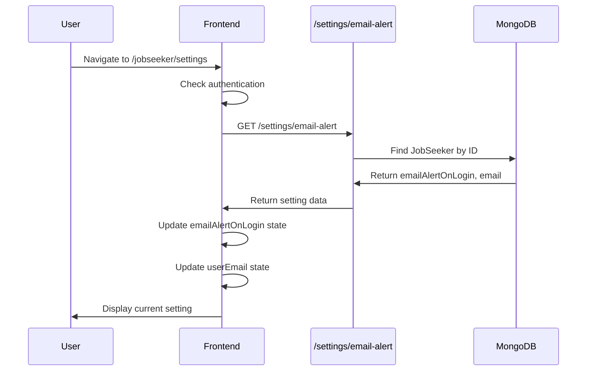
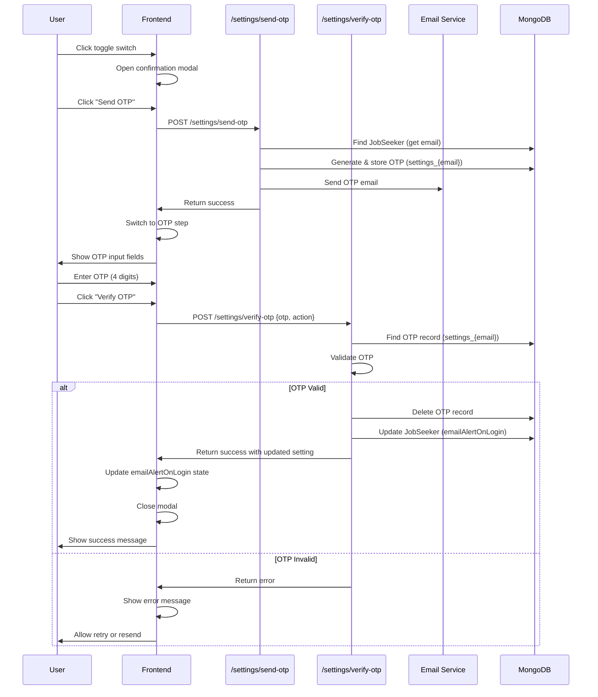

# Feature: Job Seeker Settings

## Overview

**Purpose**: The Job Seeker Settings feature allows job seekers to manage their account preferences, specifically email alert settings. It provides a secure way to enable or disable email alerts on login with OTP verification to ensure the user has access to their registered email address.

**User Story**: As a job seeker, I want to manage my email alert preferences so that I can control when I receive email notifications about account activity (specifically login alerts).

**Key Functionality**:
- View current email alert preference (email alert on login)
- Enable/disable email alert on login
- OTP verification required for both enable and disable actions
- Two-step modal process (confirmation → OTP verification)
- OTP sent to registered email address
- 4-digit OTP input with auto-focus and auto-advance
- Resend OTP functionality
- Close confirmation when exiting OTP verification
- Session expiration handling
- Loading states and error handling

**Access Level**: Authenticated (Job Seeker only)

**URL Path**: `/jobseeker/settings`

**Authentication Required**: Yes (JWT token via `js_token` cookie)

---

## User Flow

### Primary Flow - View Settings
1. User navigates to `/jobseeker/settings`
2. Authentication check via `useJobSeekerAuth` hook
3. If not authenticated: Redirect to `/signin/jobseeker`
4. If authenticated: Settings page loads
5. **Data Loading**:
   - Fetch current email alert setting from API
   - Display current preference (enabled/disabled)
6. **Page Display**:
   - Email preferences section
   - Toggle switch showing current state
   - Description of the setting

### Enable Email Alert Flow
1. User clicks toggle switch (when disabled)
2. **Confirmation Modal Opens**:
   - Shows user's email address
   - Explains that OTP will be sent
   - "Send OTP" and "Cancel" buttons
3. User clicks "Send OTP"
4. OTP sent to registered email
5. **OTP Verification Modal**:
   - Shows 4-digit OTP input fields
   - Auto-focus on first input
   - User enters OTP (auto-advances between fields)
   - "Verify OTP" and "Resend OTP" buttons
6. User enters OTP and clicks "Verify OTP"
7. OTP verified on backend
8. Setting updated (enabled)
9. Modal closes, toggle updated, success message shown

### Disable Email Alert Flow
1. User clicks toggle switch (when enabled)
2. **Confirmation Modal Opens**:
   - Shows user's email address
   - Explains that OTP will be sent
   - "Send OTP" and "Cancel" buttons
3. User clicks "Send OTP"
4. OTP sent to registered email
5. **OTP Verification Modal**:
   - Shows 4-digit OTP input fields
   - User enters OTP
   - "Verify OTP" and "Resend OTP" buttons
6. User enters OTP and clicks "Verify OTP"
7. OTP verified on backend
8. Setting updated (disabled)
9. Modal closes, toggle updated, success message shown

### Alternative Flows
- **Resend OTP**: User clicks "Resend OTP" → New OTP sent → OTP input cleared → Success message
- **Close Modal (Confirmation)**: User clicks close/cancel → Modal closes, no changes
- **Close Modal (OTP)**: User clicks close → Confirmation modal shown → User confirms → Modal closes, changes cancelled
- **Invalid OTP**: User enters wrong OTP → Error message shown → User can retry or resend
- **OTP Expired/Not Found**: Backend returns error → Error message shown → User can resend OTP
- **Session Expired**: Token invalid/expired → Warning message shown → User must sign in again

### Edge Cases
- **No Email on Account**: Error handling, user cannot enable alerts
- **OTP Input**: Only digits allowed, max 1 digit per field
- **Backspace Navigation**: Backspace moves focus to previous field if current is empty
- **Auto-advance**: Entering digit automatically focuses next field
- **Disabled States**: Buttons disabled during API calls (sending OTP, verifying OTP)
- **Network Errors**: Error messages shown, user can retry

---

## Frontend Implementation

### Screen Structure

**Main Page Component**:
- File: `frontend/src/app/jobseeker/(screens)/settings/page.jsx`
- Type: Client Component
- Lines: ~479 lines

**Styling**:
- CSS File: `frontend/src/app/jobseeker/(screens)/settings/page.css`
- CSS Modules: No
- Responsive: Yes

### Component Hierarchy

```
SettingsPage (page.jsx)
  ├── useJobSeekerAuth() - Authentication check
  ├── Loading State (conditional)
  ├── Session Expired Warning (conditional)
  ├── Settings Card
  │   ├── Header (title, subtitle)
  │   └── Preference Block
  │       └── Email Alert Preference
  │           ├── Content (title, description)
  │           └── Toggle Switch
  ├── Confirmation/OTP Modal (conditional)
  │   ├── Overlay
  │   ├── Modal Container
  │   │   ├── Header (title, close button)
  │   │   └── Body
  │   │       ├── Confirmation Step (conditional)
  │   │       │   ├── Description text
  │   │       │   └── Actions (Cancel, Send OTP)
  │   │       └── OTP Step (conditional)
  │   │           ├── Description text
  │   │           ├── Error message (conditional)
  │   │           ├── OTP Input Fields (4 fields)
  │   │           └── Actions (Resend OTP, Verify OTP)
  └── Close Confirmation Modal (conditional)
      ├── Overlay
      └── Modal Container
          ├── Header
          └── Body (message, actions)
```

### State Management

**Local State**:
```javascript
const [isLoading, setIsLoading] = useState(true);
const [isSaving, setIsSaving] = useState(false);
const [emailAlertOnLogin, setEmailAlertOnLogin] = useState(false);
const [sessionExpired, setSessionExpired] = useState(false);
const [showModal, setShowModal] = useState(false);
const [modalStep, setModalStep] = useState('confirmation'); // 'confirmation' or 'otp'
const [modalAction, setModalAction] = useState(null); // 'enable' or 'disable'
const [showCloseConfirmation, setShowCloseConfirmation] = useState(false);
const [otp, setOtp] = useState(["", "", "", ""]);
const [sendingOtp, setSendingOtp] = useState(false);
const [verifyingOtp, setVerifyingOtp] = useState(false);
const [otpError, setOtpError] = useState("");
const [userEmail, setUserEmail] = useState("");
```

### Email Alert Setting Display

**Preference Block**:
- Title: "Receive email alert when login"
- Description: "Get an email notification every time you log in to your account. This helps you stay aware of account activity."
- Toggle Switch: Shows current state (enabled/disabled)
- Toggle Click Handler: Opens confirmation modal

**Toggle Switch**:
- Visual toggle button (on/off state)
- `aria-pressed` attribute for accessibility
- `aria-label` for screen readers
- Disabled during loading, saving, or when session expired

### OTP Modal System

**Modal States**:
- `showModal`: Controls modal visibility
- `modalStep`: Current step ('confirmation' or 'otp')
- `modalAction`: Action type ('enable' or 'disable')
- `showCloseConfirmation`: Controls close confirmation modal

**Confirmation Step**:
- Shows user's email address
- Explains what will happen (OTP will be sent)
- Two buttons:
  - Cancel (closes modal)
  - Send OTP (proceeds to OTP step)

**OTP Step**:
- Shows user's email address
- Instructions text
- 4-digit OTP input fields
- Error message (if any)
- Two buttons:
  - Resend OTP (sends new OTP)
  - Verify OTP (verifies and updates setting)

**OTP Input Fields**:
- 4 separate input fields (one digit each)
- `inputMode="numeric"` for mobile keyboard
- `maxLength={1}` per field
- Auto-focus on first field when modal opens
- Auto-advance to next field on input
- Backspace moves to previous field if current is empty
- Disabled during sending/verifying OTP
- Error styling when OTP error exists

**OTP Input Handler**:
```javascript
const handleOtpChange = (index, value) => {
    if (!/^\d*$/.test(value)) return; // Only digits allowed
    
    // Clear error when user starts typing
    if (otpError) {
        setOtpError("");
    }
    
    const newOtp = [...otp];
    newOtp[index] = value.slice(-1); // Only take last character
    setOtp(newOtp);
    
    // Auto-focus next input
    if (value && index < 3) {
        const nextInput = document.getElementById(`otp-input-${index + 1}`);
        if (nextInput) nextInput.focus();
    }
};
```

**OTP Key Handler**:
```javascript
const handleOtpKeyDown = (index, e) => {
    if (e.key === "Backspace" && !otp[index] && index > 0) {
        const prevInput = document.getElementById(`otp-input-${index - 1}`);
        if (prevInput) prevInput.focus();
    }
};
```

### API Integration

**Endpoints Called**:

| Endpoint | Method | Purpose | Authentication |
|----------|--------|---------|----------------|
| `/jobseeker/settings/email-alert` | GET | Fetch current setting | Bearer token |
| `/jobseeker/settings/send-otp` | POST | Send OTP to email | Bearer token |
| `/jobseeker/settings/verify-otp` | POST | Verify OTP and update setting | Bearer token |

**Environment Variables**:
- `NEXT_PUBLIC_JOBSEEKER_URL`: Base URL for job seeker API

**Fetch Email Alert Setting**:
```javascript
const fetchEmailAlertSetting = async () => {
    const token = Cookies.get("js_token");
    if (!token) {
        setSessionExpired(true);
        setIsLoading(false);
        return;
    }
    
    try {
        const response = await axios.get(
            `${process.env.NEXT_PUBLIC_JOBSEEKER_URL}/settings/email-alert`,
            { headers: { Authorization: `Bearer ${token}` } }
        );
        
        const serverValue = response.data?.data?.emailAlertOnLogin ?? response.data?.emailAlertOnLogin ?? false;
        setEmailAlertOnLogin(Boolean(serverValue));
        
        if (response.data?.data?.email) {
            setUserEmail(response.data.data.email);
        }
    } catch (error) {
        if (error?.response?.status === 401) {
            setSessionExpired(true);
        } else {
            toast.error(error?.response?.data?.message || "Unable to load settings.");
        }
    } finally {
        setIsLoading(false);
    }
};
```

**Send OTP**:
```javascript
const handleSendOtp = async () => {
    const token = Cookies.get("js_token");
    if (!token) {
        setSessionExpired(true);
        toast.error("Your session expired. Please sign in again.");
        return;
    }
    
    setSendingOtp(true);
    try {
        const response = await axios.post(
            `${process.env.NEXT_PUBLIC_JOBSEEKER_URL}/settings/send-otp`,
            {},
            { headers: { Authorization: `Bearer ${token}` } }
        );
        
        if (response.data.success) {
            toast.success("OTP sent to your registered email address.");
            setModalStep('otp');
            setOtpError("");
            setOtp(["", "", "", ""]);
            // Auto-focus first OTP input
            setTimeout(() => {
                const firstInput = document.getElementById('otp-input-0');
                if (firstInput) firstInput.focus();
            }, 100);
        } else {
            const errorMsg = response.data.message || "Failed to send OTP.";
            toast.error(errorMsg);
            setOtpError(errorMsg);
        }
    } catch (error) {
        const errorMsg = error?.response?.data?.message || "Failed to send OTP.";
        toast.error(errorMsg);
        setOtpError(errorMsg);
    } finally {
        setSendingOtp(false);
    }
};
```

**Verify OTP**:
```javascript
const handleVerifyOtp = async () => {
    const token = Cookies.get("js_token");
    if (!token) {
        setSessionExpired(true);
        toast.error("Your session expired. Please sign in again.");
        return;
    }
    
    const otpString = otp.join("");
    if (otpString.length !== 4) {
        setOtpError("Please enter the complete OTP.");
        return;
    }
    
    setOtpError("");
    setVerifyingOtp(true);
    try {
        const response = await axios.post(
            `${process.env.NEXT_PUBLIC_JOBSEEKER_URL}/settings/verify-otp`,
            { otp: otpString, action: modalAction },
            { headers: { Authorization: `Bearer ${token}` } }
        );
        
        if (response.data.success) {
            if (modalAction === 'enable') {
                setEmailAlertOnLogin(true);
                toast.success("Email alert on login enabled successfully.");
            } else if (modalAction === 'disable') {
                setEmailAlertOnLogin(false);
                toast.success("Email alert on login disabled successfully.");
            }
            setShowModal(false);
            setModalStep('confirmation');
            setModalAction(null);
            setOtp(["", "", "", ""]);
            setOtpError("");
        } else {
            const errorMsg = response.data.message || "Invalid OTP. Please try again.";
            setOtpError(errorMsg);
            toast.error(errorMsg);
        }
    } catch (error) {
        const errorMsg = error?.response?.data?.message || "Failed to verify OTP.";
        setOtpError(errorMsg);
        toast.error(errorMsg);
    } finally {
        setVerifyingOtp(false);
    }
};
```

### Modal Management

**Open Modal**:
- Triggered by toggle switch click
- Sets `modalAction` based on current state ('enable' or 'disable')
- Sets `modalStep` to 'confirmation'
- Shows modal

**Close Modal (Confirmation Step)**:
- Direct close (no confirmation needed)
- Resets modal state

**Close Modal (OTP Step)**:
- Shows close confirmation modal
- User can continue verification or exit
- If exit confirmed: Modal closes, changes cancelled

**Close Confirmation Modal**:
- Two options:
  - "Continue Verification": Closes confirmation, returns to OTP step
  - "Exit Verification": Closes all modals, cancels changes

### UI States

**Loading State**:
- CircularProgress spinner
- Message: "Loading your preferences…"
- Shown during initial fetch

**Session Expired State**:
- Warning banner displayed
- Message: "Please sign in again to manage settings."
- Toggle disabled

**Error State**:
- Error messages shown via toast notifications
- OTP error shown in modal (inline)
- User can retry operations

**Success State**:
- Success messages shown via toast notifications
- Setting updated in UI
- Modal closed automatically

---

## Backend Implementation

### API Endpoints

#### Get Email Alert Setting

**Route Definition**:
```javascript
router.get("/settings/email-alert", verifyToken, jobSeekerController.getEmailAlertSetting);
```

**Full Endpoint Path**: `/jobseeker/settings/email-alert`

**HTTP Method**: GET

**Authentication Required**: Yes

**Response Format**:
```json
{
  "success": true,
  "data": {
    "emailAlertOnLogin": false,
    "email": "user@example.com"
  }
}
```

**Controller Logic** (`getEmailAlertSetting`):
1. Find job seeker by ID
2. Select `emailAlertOnLogin` and `email` fields
3. Return current setting value and email address

#### Send OTP for Settings Verification

**Route Definition**:
```javascript
router.post("/settings/send-otp", verifyToken, jobSeekerController.sendSettingsOtp);
```

**Full Endpoint Path**: `/jobseeker/settings/send-otp`

**HTTP Method**: POST

**Authentication Required**: Yes

**Request Body**: None (empty object)

**Response Format**:
```json
{
  "success": true,
  "message": "OTP sent to your registered email address"
}
```

**Controller Logic** (`sendSettingsOtp`):
1. Find job seeker by ID, select email
2. Validate email exists
3. Generate 4-digit OTP
4. Store OTP in UserOtp collection with key `settings_{email}`
5. Delete any existing OTP records for this user (cleanup)
6. Send OTP email via email service
7. Return success response

**OTP Storage**:
- Collection: `UserOtp`
- Key format: `settings_{email}` (e.g., "settings_user@example.com")
- OTP: 4-digit number
- Expiry: Handled by email service or application logic

#### Verify OTP and Update Setting

**Route Definition**:
```javascript
router.post("/settings/verify-otp", verifyToken, jobSeekerController.verifySettingsOtp);
```

**Full Endpoint Path**: `/jobseeker/settings/verify-otp`

**HTTP Method**: POST

**Authentication Required**: Yes

**Request Body**:
```json
{
  "otp": "1234",
  "action": "enable" // or "disable"
}
```

**Response Format**:
```json
{
  "success": true,
  "message": "Email alert setting updated successfully",
  "data": {
    "emailAlertOnLogin": true,
    "email": "user@example.com"
  }
}
```

**Controller Logic** (`verifySettingsOtp`):
1. Validate OTP and action parameters
2. Find job seeker by ID, select email
3. Validate email exists
4. Find OTP record with key `settings_{email}`
5. Check if OTP record exists
6. Compare provided OTP with stored OTP
7. If valid:
   - Delete OTP record (cleanup)
   - Update job seeker's `emailAlertOnLogin` field based on action
   - Return success with updated setting
8. If invalid: Return error message

**Action Handling**:
- `action === 'enable'`: Set `emailAlertOnLogin = true`
- `action === 'disable'`: Set `emailAlertOnLogin = false`

### Database Models

**JobSeeker Model** (`backend/src/models/jobSeeker.js`):
- `emailAlertOnLogin`: Boolean (default: false)
- `email`: String (required, used for OTP)

**UserOtp Model** (`backend/src/models/userOtp.js`):
- `userData`: String (e.g., "settings_user@example.com")
- `userOtp`: Number (4-digit OTP)
- Used for temporary OTP storage

### Middleware Chain

**Authentication Middleware**:
- `verifyToken`: Validates JWT token, attaches userId
- On failure: Returns 401 Unauthorized

---

## Data Flow

### Fetch Setting Flow



### Enable/Disable Flow with OTP



---

## Error Handling

### Frontend Error Handling

**Authentication Errors**:
- 401 responses: Set sessionExpired flag, show warning banner
- Toast error message shown
- Toggle disabled

**Network Errors**:
- Error message shown via toast
- OTP errors shown inline in modal
- User can retry operations

**Validation Errors**:
- OTP length: Checked before API call
- Only digits allowed in OTP inputs
- Error messages shown inline

**OTP Errors**:
- Invalid OTP: Error shown, user can retry
- OTP not found/expired: Error shown, user can resend
- Network errors: Generic error message, user can retry

### Backend Error Handling

**Authentication Errors**:
- Missing/invalid token: 401 Unauthorized
- User not found: 404 Not Found

**Validation Errors**:
- Missing OTP: 400 Bad Request
- Invalid action: 400 Bad Request (must be 'enable' or 'disable')
- Invalid OTP format: Handled in comparison

**OTP Errors**:
- OTP not found: Returns success: false with message
- Invalid OTP: Returns success: false with message
- Note: OTP errors return 200 status with success: false (not 4xx)

**Email Errors**:
- Email sending failures: Logged, but may still return success
- Missing email: 404 Not Found

**Status Codes**:
- 200: Success (or OTP validation error with success: false)
- 400: Bad Request (validation errors)
- 401: Unauthorized (authentication required)
- 404: Not Found (user or email not found)
- 500: Internal Server Error

---

## Security Features

### Authentication
- JWT token required for all endpoints
- Token validated via middleware
- User can only access their own settings

### Authorization
- `req.userId` from token used for all operations
- Settings updated only for authenticated user
- No cross-user access possible

### OTP Verification
- OTP required for both enable and disable actions
- OTP sent to registered email address only
- OTP stored temporarily in database
- OTP deleted after successful verification
- OTP expiry handled (implicit in UserOtp model or explicit logic)

### Input Validation
- OTP validated (must be 4 digits)
- Action validated (must be 'enable' or 'disable')
- Email validated (must exist on account)
- Type validation (emailAlertOnLogin must be boolean if directly updated)

### Data Protection
- Sensitive data not exposed
- Email address shown only to authenticated user
- OTP stored securely (deleted after use)
- Password never exposed

---

## UI/UX Details

### Layout Structure

**Page Sections**:
1. Loading state (during initial fetch)
2. Session expired warning (if session invalid)
3. Settings card with preference block

### Visual Design

**Settings Card**:
- White background, rounded corners
- Border for definition
- Padding for spacing
- Header with eyebrow text, title, subtitle

**Preference Block**:
- Light background (#f8fafc)
- Rounded corners
- Border for definition
- Padding for spacing

**Toggle Switch**:
- Custom styled toggle button
- Visual on/off states
- Smooth transitions
- Disabled state styling

**Modal**:
- Overlay background (semi-transparent)
- Centered modal container
- White background, rounded corners
- Header with title and close button
- Body with content and actions
- Footer with action buttons

**OTP Input Fields**:
- 4 separate input fields
- Square/rounded design
- Centered text
- Border styling
- Error state styling (red border)
- Disabled state styling

### Responsive Design

**Desktop**:
- Centered page layout
- Full-width settings card
- Modal centered on screen

**Mobile**:
- Responsive padding
- Modal adapts to screen size
- Touch-friendly button sizes
- Optimized spacing

### Accessibility

**Keyboard Navigation**:
- Tab order logical
- Enter/Space for buttons
- Escape to close modal (when allowed)
- Tab navigation through OTP inputs
- Backspace navigation in OTP inputs

**Screen Reader Support**:
- Semantic HTML elements
- ARIA labels on toggle
- ARIA pressed state on toggle
- Descriptive button labels
- Error messages announced

**Visual Indicators**:
- Clear toggle state (on/off)
- Loading indicators
- Error states
- Disabled states

---

## Testing Considerations

### Test Scenarios

**Happy Path**:
1. User views settings → Current setting displayed correctly
2. User enables alert → OTP sent → OTP entered → Setting enabled → Success shown
3. User disables alert → OTP sent → OTP entered → Setting disabled → Success shown

**OTP Flow**:
1. Send OTP → OTP sent → Email received → OTP step shown
2. Enter valid OTP → Setting updated → Success shown
3. Enter invalid OTP → Error shown → User can retry
4. Resend OTP → New OTP sent → OTP input cleared

**Modal Flow**:
1. Open modal → Confirmation step shown
2. Send OTP → OTP step shown
3. Close confirmation → Modal closes, no changes
4. Close OTP → Confirmation shown → Exit → Modal closes, changes cancelled

**Edge Cases**:
1. Session expired → Warning shown, toggle disabled
2. Network error → Error message shown, user can retry
3. OTP expired/not found → Error shown, user can resend
4. Invalid OTP → Error shown, user can retry
5. Incomplete OTP → Verify button disabled
6. Non-digit input → Rejected, not entered
7. Backspace navigation → Focus moves to previous field

**Validation**:
1. OTP must be 4 digits → Verify disabled if incomplete
2. Only digits allowed → Non-digits rejected
3. Action must be enable/disable → Validated on backend

**Error Handling**:
1. API errors → Error messages shown
2. Network errors → Generic error messages
3. Authentication errors → Session expired warning

---

## Related Features

- **Job Seeker Profile** (`/jobseeker/profile`): Profile management
- **Job Seeker Home Dashboard** (`/jobseeker/home`): Dashboard overview
- **Email Alert System**: Backend system that sends emails when alerts are enabled

---

## Additional Notes

**Dependencies**:
- `axios`: HTTP client
- `js-cookie`: Cookie management
- `react-hot-toast`: Toast notifications
- `@mui/material`: Loading spinner
- `react-icons/fa`: Icon library

**OTP Mechanism**:
- 4-digit OTP
- Sent via email
- Stored temporarily in database
- Deleted after successful verification
- Required for both enable and disable actions

**Security Considerations**:
- OTP verification ensures user has access to email
- Prevents unauthorized setting changes
- OTP deleted after use (cannot be reused)
- Session validation on all operations

**Known Limitations**:
- Only one setting currently (email alert on login)
- No settings export/import
- No email change functionality
- OTP expiry not explicitly shown to user
- No OTP attempt limiting (could be added for security)

**Future Enhancements**:
- Additional settings (password change, email change, etc.)
- Notification preferences (email frequency, etc.)
- Privacy settings
- Account deletion
- Data export
- Two-factor authentication
- OTP attempt limiting
- OTP expiry timer display
- Multiple email addresses
- Email verification status

---

## Code References

### Frontend Files
- `frontend/src/app/jobseeker/(screens)/settings/page.jsx` - Main component (~479 lines)
- `frontend/src/app/jobseeker/(screens)/settings/page.css` - Styling

### Backend Files
- `backend/src/routes/jobSeekerRoutes.js` - Route definitions:
  - Line 75: GET `/settings/email-alert`
  - Line 79: POST `/settings/send-otp`
  - Line 80: POST `/settings/verify-otp`
- `backend/src/controllers/jobSeekerController.js` - Controller functions:
  - `getEmailAlertSetting` (lines 4253-4278)
  - `sendSettingsOtp` (lines 4391-4449)
  - `verifySettingsOtp` (lines 4452-4519)
- `backend/src/models/jobSeeker.js` - JobSeeker model (emailAlertOnLogin field)
- `backend/src/models/userOtp.js` - UserOtp model (for OTP storage)

---

*Last Updated: [Current Date]*
*Documented By: TSD Documentation System*

