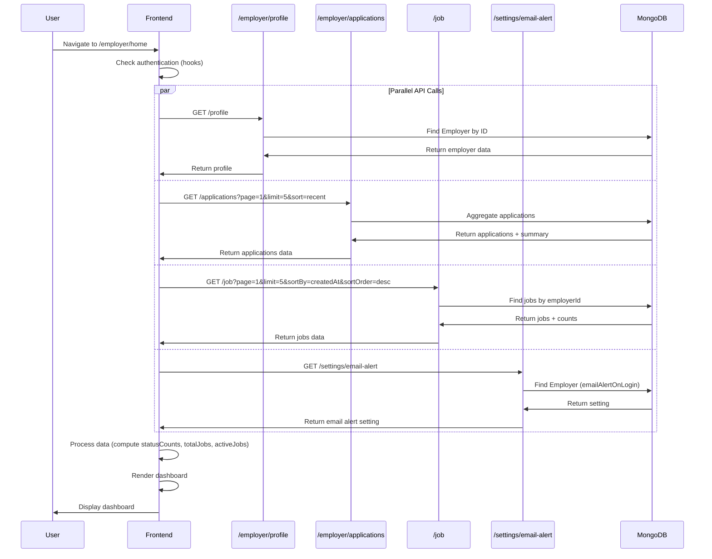
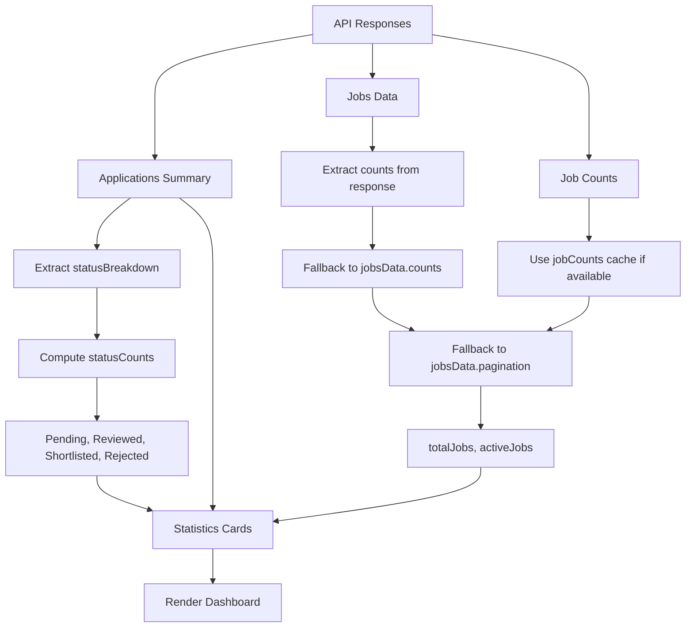

# Feature: Employer Home Dashboard

## Overview

**Purpose**: The Employer Home Dashboard provides employers with a comprehensive overview of their hiring activity, including job statistics, application counts, recent applications, recent jobs, and quick access to key actions. It serves as the central hub for employers to monitor their recruitment pipeline and take immediate action on their hiring needs.

**User Story**: As an employer, I want to view a dashboard that shows me an overview of my hiring activity (jobs posted, applications received, status breakdowns) so that I can quickly understand my recruitment status and take action on pending items.

**Key Functionality**:
- Welcome section with personalized greeting
- Security banner for email alert settings (if disabled)
- Statistics cards showing:
  - Total Jobs (all jobs posted)
  - Active Jobs (jobs with "Active" status)
  - Total Applications (all applications received)
  - Pending Review (applications with "pending" status)
  - Shortlisted (applications with "shortlisted" status)
  - Rejected (applications with "rejected" status)
- Quick action buttons:
  - Post New Job
  - View Applications
  - View All Jobs
- Recent Applications section (5 most recent)
- Recent Jobs section (5 most recent)
- Activity Summary section (if applications exist)
- Empty state (if no jobs posted)

**Access Level**: Authenticated (Employer only)

**URL Path**: `/employer/home`

**Authentication Required**: Yes (JWT token via `emp_token` cookie)

---

## User Flow

### Primary Flow - View Dashboard
1. User navigates to `/employer/home`
2. Authentication check (via hooks - redirects to sign-in if not authenticated)
3. **Data Loading** (4 parallel API calls):
   - Fetch employer profile (for name display)
   - Fetch recent applications (page 1, limit 5, sorted by recent)
   - Fetch recent jobs (page 1, limit 5, sorted by createdAt desc)
   - Fetch job counts (total and active jobs)
   - Fetch email alert setting (for security banner)
4. **Page Display**:
   - Welcome message with employer's first name
   - Security banner (if email alert disabled)
   - Statistics cards (6 cards with counts)
   - Quick action buttons (3 buttons)
   - Recent Applications list (if applications exist)
   - Recent Jobs list (if jobs exist)
   - Activity Summary (if applications exist)
   - Empty state (if no jobs and no applications)

### Quick Actions Flow
1. User clicks "Post New Job" → Navigate to `/employer/post-job`
2. User clicks "View Applications" → Navigate to `/employer/applications`
3. User clicks "View All Jobs" → Navigate to `/employer/jobs`

### Recent Applications Flow
1. User clicks on an application item → Navigate to `/employer/applications?jobId={jobId}`
2. User clicks "View All" link → Navigate to `/employer/applications`

### Recent Jobs Flow
1. User clicks on a job item → Navigate to `/employer/jobs`
2. User clicks "View All" link → Navigate to `/employer/jobs`

### Security Banner Flow
1. If email alert on login is disabled → Security banner displayed
2. User clicks "Enable in Settings" → Navigate to `/employer/settings`

---

## Frontend Implementation

### Screen Structure

**Main Page Component**:
- File: `frontend/src/app/employer/(screens)/home/page.jsx`
- Type: Server Component (wraps client component with Suspense)
- Wrapper: `HomePageClient.jsx` (Client Component)

**Client Component**:
- File: `frontend/src/app/employer/(screens)/home/HomePageClient.jsx`
- Type: Client Component
- Lines: ~485 lines

**Styling**:
- CSS File: `frontend/src/app/employer/(screens)/home/page.css`
- CSS Modules: No
- Responsive: Yes

### Component Hierarchy

```
Page (page.jsx - Server Component)
  └── Suspense
      └── LoadingFallback (conditional)
      └── EmployerHomeScreen (HomePageClient.jsx - Client Component)
          ├── useEmployerApplications() - React Query hook
          ├── useEmployerJobs() - React Query hook
          ├── useEmployerProfile() - React Query hook
          ├── useEmployerJobCounts() - React Query hook
          ├── Welcome Section
          ├── Security Banner (conditional)
          ├── Loading State (conditional)
          ├── Main Content (conditional)
          │   ├── Stats Cards (6 cards)
          │   ├── Quick Actions (3 buttons)
          │   ├── Recent Applications Card (conditional)
          │   │   ├── Header (title, "View All" link)
          │   │   └── Applications List (5 items)
          │   │       └── Application Item (clickable)
          │   │           ├── Candidate Info (avatar, name, email)
          │   │           ├── Status Badge
          │   │           ├── Job Info (title, location, type, mode)
          │   │           └── Meta (applied date, submission type, last update)
          │   ├── Recent Jobs Card (conditional)
          │   │   ├── Header (title, "View All" link)
          │   │   └── Jobs List (5 items)
          │   │       └── Job Item (clickable)
          │   │           ├── Job Info (title, location, type, mode)
          │   │           ├── Status Badge
          │   │           └── Posted Date
          │   ├── Activity Summary Card (conditional)
          │   │   ├── Header (title)
          │   │   └── Content
          │   │       ├── Activity Stats (3 stats)
          │   │       ├── Summary Text
          │   │       └── Action Link
          │   └── Empty State (conditional)
          │       ├── Icon
          │       ├── Title
          │       ├── Description
          │       └── Action Button
```

### State Management

**React Query Hooks**:
```javascript
// Fetch recent applications
const { data: applicationsData, isLoading: loadingApplications } = useEmployerApplications({
    page: 1,
    limit: 5,
    sort: "recent"
});

// Fetch recent jobs
const { data: jobsData, isLoading: loadingJobs } = useEmployerJobs({
    page: 1,
    limit: 5,
    sortBy: "createdAt",
    sortOrder: "desc"
});

// Fetch employer profile
const { data: profileData, isLoading: loadingProfile } = useEmployerProfile();

// Fetch job counts
const { data: jobCounts, isLoading: loadingJobCounts } = useEmployerJobCounts();
```

**Local State**:
```javascript
const [mounted, setMounted] = useState(false); // Prevent hydration mismatch
const [emailAlertOnLogin, setEmailAlertOnLogin] = useState(null);
const [emailAlertChecked, setEmailAlertChecked] = useState(false);
```

**Computed Values**:
```javascript
const applications = applicationsData?.data || [];
const applicationsSummary = applicationsData?.summary || {
    totalApplications: 0,
    statusBreakdown: []
};
const jobs = jobsData?.data || [];
const totalJobs = jobCounts?.totalJobs ?? jobsData?.pagination?.totalJobs ?? jobsData?.counts?.totalJobs ?? 0;
const activeJobs = jobCounts?.activeJobs ?? jobsData?.counts?.activeJobs ?? jobs.filter(job => job.status?.toLowerCase() === 'active').length;

// Status counts from applications summary
const statusCounts = useMemo(() => {
    const breakdown = applicationsSummary.statusBreakdown || [];
    return {
        pending: breakdown.find(s => s.status === 'pending')?.count || 0,
        reviewed: breakdown.find(s => s.status === 'reviewed')?.count || 0,
        shortlisted: breakdown.find(s => s.status === 'shortlisted')?.count || 0,
        rejected: breakdown.find(s => s.status === 'rejected')?.count || 0
    };
}, [applicationsSummary]);

const isLoading = loadingApplications || loadingJobs || loadingProfile || loadingJobCounts;
const employerName = (!mounted || isLoading) ? "Employer" : (profileData?.fullName || profileData?.companyName || "Employer");
const showSkeleton = !mounted || isLoading;
const showSecurityBanner = emailAlertChecked && emailAlertOnLogin === false;
```

### Welcome Section

**Purpose**: Personalized greeting for the employer

**Display**:
- Title: "Welcome back, {firstName}!"
  - Uses first word of fullName or companyName
  - Falls back to "Employer" if not available or during loading
- Subtitle: "Here's an overview of your hiring activity"

**Implementation**:
- Uses `profileData?.fullName || profileData?.companyName` to get name
- Splits name to get first name: `employerName.split(' ')[0]`
- Handles loading state with default "Employer"

### Security Banner

**Purpose**: Encourage employers to enable email alerts on login for account security

**Display Conditions**:
- Shown only if `emailAlertChecked === true` AND `emailAlertOnLogin === false`
- Hidden during loading or if email alert is enabled

**Content**:
- Shield icon
- Title: "Protect your account with login email alerts"
- Description: "Email alerts on login are currently disabled. Turn them on to get notified whenever someone signs in. You can enable this from Settings → Email preferences."
- Button: "Enable in Settings" (navigates to `/employer/settings`)

**Implementation**:
- Fetches email alert setting on mount via API call
- Stores result in local state
- Banner shown/hidden based on state

### Statistics Cards

**Purpose**: Display key hiring metrics at a glance

**Cards** (6 total):
1. **Total Jobs**
   - Icon: Briefcase (primary color)
   - Label: "Total Jobs"
   - Value: Total number of jobs posted by employer
   - Source: `jobCounts?.totalJobs` or fallback to `jobsData?.pagination?.totalJobs` or `jobsData?.counts?.totalJobs`

2. **Active Jobs**
   - Icon: Check Circle (success color)
   - Label: "Active Jobs"
   - Value: Number of jobs with "Active" status
   - Source: `jobCounts?.activeJobs` or fallback to `jobsData?.counts?.activeJobs` or count from jobs array

3. **Total Applications**
   - Icon: Users (info color)
   - Label: "Total Applications"
   - Value: Total number of applications received
   - Source: `applicationsSummary.totalApplications`

4. **Pending Review**
   - Icon: Clock (warning color)
   - Label: "Pending Review"
   - Value: Number of applications with "pending" status
   - Source: `statusCounts.pending` (from applications summary breakdown)

5. **Shortlisted**
   - Icon: Check Circle (success color)
   - Label: "Shortlisted"
   - Value: Number of applications with "shortlisted" status
   - Source: `statusCounts.shortlisted` (from applications summary breakdown)

6. **Rejected**
   - Icon: Times Circle (danger color)
   - Label: "Rejected"
   - Value: Number of applications with "rejected" status
   - Source: `statusCounts.rejected` (from applications summary breakdown)

**Card Structure**:
- Icon container (colored background)
- Content container
  - Label (small text)
  - Value (large number)

### Quick Actions

**Purpose**: Provide quick access to common actions

**Buttons** (3 total):
1. **Post New Job** (Primary style)
   - Icon: Plus Circle
   - Text: "Post New Job"
   - Link: `/employer/post-job`

2. **View Applications** (Secondary style)
   - Icon: Users
   - Text: "View Applications"
   - Link: `/employer/applications`

3. **View All Jobs** (Secondary style)
   - Icon: Briefcase
   - Text: "View All Jobs"
   - Link: `/employer/jobs`

**Implementation**:
- Uses Next.js `Link` component for client-side navigation
- Styled as buttons with icons

### Recent Applications Section

**Purpose**: Show the 5 most recent applications for quick review

**Display Conditions**:
- Shown only if `applications.length > 0`
- Displays up to 5 applications (already limited by API call)

**Section Structure**:
- Header:
  - Title: "Recent Applications"
  - Link: "View All" (with arrow icon) → `/employer/applications`
- Applications List:
  - Each application is a clickable card
  - Clicking navigates to `/employer/applications?jobId={jobId}`

**Application Item Display**:
- **Application Header**:
  - Candidate avatar (initial letter in circle)
  - Candidate name
  - Candidate email
  - Status badge (color-coded: pending, reviewed, shortlisted, rejected)
- **Job Info**:
  - Job title
  - Location (with map icon)
  - Work mode and job type (e.g., "Remote • Full-time")
- **Application Meta**:
  - Applied date: "Applied {formatted date}"
  - Submission type: "Direct", "Basic Test", or "Video Proctored"
  - Last update: "Last update {relative time}" (from latest timeline event)

**Helper Functions**:
- `getCandidateInitial(name)`: Returns first letter of name (uppercase)
- `formatDate(dateString)`: Formats date as "MMM DD, YYYY"
- `formatRelativeTime(dateString)`: Returns relative time (e.g., "2hrs ago", "3 days ago")
- `formatSubmissionType(type)`: Formats submission type for display
- `getStatusColor(status)`: Returns color code for status
- `getStatusBadgeClass(status)`: Returns CSS class for status badge

**Timeline Processing**:
- Sorts status timeline by `createdAt` (oldest first)
- Gets latest event from sorted timeline
- Displays relative time of latest event

### Recent Jobs Section

**Purpose**: Show the 5 most recent jobs posted

**Display Conditions**:
- Shown only if `jobs.length > 0`
- Displays up to 5 jobs (already limited by API call)

**Section Structure**:
- Header:
  - Title: "Recent Jobs"
  - Link: "View All" (with arrow icon) → `/employer/jobs`
- Jobs List:
  - Each job is a clickable card
  - Clicking navigates to `/employer/jobs`

**Job Item Display**:
- **Job Header**:
  - Job title
  - Location (with map icon)
  - Work mode and job type (e.g., "Remote • Full-time")
  - Status badge (color-coded based on job status)
- **Job Footer**:
  - Posted date: "Posted {formatted date}"

**Status Badge**:
- CSS class based on status: `employee-homescreen-job-status-{status.toLowerCase()}`
- Status text capitalized (first letter uppercase)

### Activity Summary Section

**Purpose**: Provide summary and actionable insights

**Display Conditions**:
- Shown only if `applicationsSummary.totalApplications > 0`

**Section Structure**:
- Header:
  - Title: "Activity Summary"
- Content:
  - Activity Stats (3 stats):
    - Total Applications (with Users icon)
    - Pending Review (with Clock icon)
    - Shortlisted (with Check Circle icon)
  - Summary Text:
    - Dynamic message based on pending count
    - Example: "You have 3 applications pending review. Review them to find the best candidates for your open positions."
  - Action Link:
    - "Review Applications" (with arrow icon) → `/employer/applications`

### Empty State

**Purpose**: Guide new employers to post their first job

**Display Conditions**:
- Shown only if `totalJobs === 0 && applications.length === 0`

**Content**:
- Icon: Briefcase
- Title: "Get Started with Hiring"
- Description: "You haven't posted any jobs yet. Start by creating your first job posting to attract talented candidates."
- Button: "Post Your First Job" (with Plus Circle icon) → `/employer/post-job`

### API Integration

**Endpoints Called**:

| Endpoint | Method | Purpose | Authentication |
|----------|--------|---------|----------------|
| `/employer/profile` | GET | Fetch employer profile (for name) | Bearer token |
| `/employer/applications` | GET | Fetch recent applications | Bearer token |
| `/job` | GET | Fetch recent jobs and job counts | Bearer token |
| `/employer/settings/email-alert` | GET | Fetch email alert setting | Bearer token |

**Environment Variables**:
- `NEXT_PUBLIC_EMPLOYER_URL`: Base URL for employer API
- `NEXT_PUBLIC_JOB_URL`: Base URL for job API

**Query Parameters**:

**Applications API**:
```
page=1
limit=5
sort=recent
```

**Jobs API**:
```
page=1
limit=5
sortBy=createdAt
sortOrder=desc
```

**Email Alert API**:
- No parameters (uses authentication token)

### React Query Hooks

**useEmployerApplications**:
- Query key: `['employer', 'applications', 'list', { filters }]`
- Stale time: 2 minutes
- Cache time: 5 minutes
- Retries: 1 (except on 401)
- Auto-redirects on 401

**useEmployerJobs**:
- Query key: `['employer', 'jobs', 'list', { filters }]`
- Stale time: 2 minutes
- Cache time: 5 minutes
- Retries: 1 (except on 401)
- Auto-redirects on 401
- Updates job counts cache on success

**useEmployerProfile**:
- Query key: `['employer', 'profile', 'data']`
- Stale time: 5 minutes
- Cache time: 10 minutes
- Retries: 1 (except on 401)
- Auto-redirects on 401

**useEmployerJobCounts**:
- Query key: `['employer', 'jobCounts']`
- Stale time: 5 minutes
- Cache time: 10 minutes
- Retries: 1 (except on 401)
- Auto-redirects on 401
- Fetches with minimal limit (page=1, limit=1) to get counts from response

**Email Alert Fetch**:
- Direct `axios` call (not React Query)
- Fetches on component mount
- Stores result in local state
- Silent error handling (doesn't show banner on error)

### Loading States

**Initial Loading**:
- Shows skeleton/loading state if:
  - Component not mounted (`!mounted`)
  - Any of the 4 main queries are loading
- Loading UI:
  - CircularProgress spinner
  - Text: "Loading your dashboard..."

**Individual Query Loading**:
- Queries load in parallel
- Dashboard shows loading state until all queries complete
- No partial loading states (all or nothing)

**Hydration Prevention**:
- Uses `mounted` state to prevent hydration mismatch
- Sets `mounted = true` in `useEffect` after mount
- Uses default values during SSR/initial render

---

## Backend Implementation

### API Endpoints

#### Get Employer Profile

**Route Definition**:
```javascript
router.get("/profile", verifyToken, employerController.getProfile);
```

**Full Endpoint Path**: `/employer/profile`

**HTTP Method**: GET

**Authentication Required**: Yes

**Response Format**:
```json
{
  "success": true,
  "data": {
    "fullName": "John Doe",
    "companyName": "Acme Corp",
    "email": "john@acme.com",
    // ... other profile fields (password excluded)
  }
}
```

**Controller Logic** (`getProfile`):
1. Find employer by ID (from `req.userId`)
2. Select all fields except password
3. Return employer data

#### Get Employer Applications

**Route Definition**:
```javascript
router.get("/applications", verifyToken, employerController.getEmployerApplications);
```

**Full Endpoint Path**: `/employer/applications`

**HTTP Method**: GET

**Authentication Required**: Yes

**Query Parameters**:
- `page` (default: 1)
- `limit` (default: 20)
- `search` (optional)
- `status` (optional)
- `submissionType` (optional)
- `jobId` (optional)
- `sort` (default: "recent")

**Response Format**:
```json
{
  "success": true,
  "data": [
    {
      "applicationId": "...",
      "jobId": "...",
      "jobTitle": "...",
      "location": "...",
      "workMode": "...",
      "jobType": "...",
      "candidateName": "...",
      "candidateEmail": "...",
      "status": "pending",
      "submissionType": "direct",
      "appliedAt": "...",
      "statusTimeline": [...]
    }
  ],
  "summary": {
    "totalApplications": 100,
    "statusBreakdown": [
      { "status": "pending", "count": 20 },
      { "status": "reviewed", "count": 30 },
      { "status": "shortlisted", "count": 40 },
      { "status": "rejected", "count": 10 }
    ]
  },
  "pagination": {
    "currentPage": 1,
    "totalPages": 5,
    "totalApplications": 100,
    "limit": 20,
    "hasNextPage": true,
    "hasPrevPage": false
  }
}
```

**Controller Logic** (`getEmployerApplications`):
1. Extract query parameters (page, limit, filters, sort)
2. Build MongoDB aggregation pipeline:
   - Match applications for employer's jobs
   - Lookup job data
   - Lookup candidate data
   - Apply filters (search, status, submissionType, jobId)
   - Sort by specified order
   - Facet for pagination and statistics
3. Calculate total applications and status breakdown
4. Format results with candidate and job data
5. Return paginated results with summary

#### Get Employer Jobs

**Route Definition**:
```javascript
router.get("/", verifyToken, jobController.getEmployerJobs);
```

**Full Endpoint Path**: `/job` (job routes, authenticated)

**HTTP Method**: GET

**Authentication Required**: Yes

**Query Parameters**:
- `page` (default: 1)
- `limit` (default: 10)
- `search` (optional)
- `status` (optional)
- `jobType` (optional)
- `workMode` (optional)
- `sortBy` (default: "createdAt")
- `sortOrder` (default: "desc")

**Response Format**:
```json
{
  "success": true,
  "data": [
    {
      "_id": "...",
      "jobTitle": "...",
      "companyName": "...",
      "location": "...",
      "workMode": "...",
      "jobType": "...",
      "status": "Active",
      "createdAt": "...",
      // ... other job fields
    }
  ],
  "pagination": {
    "currentPage": 1,
    "totalPages": 5,
    "totalJobs": 50,
    "limit": 10,
    "hasNextPage": true,
    "hasPrevPage": false
  },
  "counts": {
    "totalJobs": 50,
    "activeJobs": 30
  }
}
```

**Controller Logic** (`getEmployerJobs`):
1. Extract query parameters
2. Build query filter:
   - Always filter by `employerId: req.userId`
   - Add search filter (jobTitle, companyName, location)
   - Add status, jobType, workMode filters if provided
3. Build sort object
4. Calculate pagination (skip, limit)
5. Execute query with pagination
6. Get total count (with filters applied)
7. Get counts for all employer jobs (without filters) for dashboard stats:
   - Total jobs count
   - Active jobs count (status === 'Active')
8. Return paginated results with counts

**Note**: The counts are calculated separately (without filters) to provide accurate dashboard statistics regardless of current filters.

#### Get Email Alert Setting

**Route Definition**:
```javascript
router.get("/settings/email-alert", verifyToken, employerController.getEmailAlertSetting);
```

**Full Endpoint Path**: `/employer/settings/email-alert`

**HTTP Method**: GET

**Authentication Required**: Yes

**Response Format**:
```json
{
  "success": true,
  "data": {
    "emailAlertOnLogin": false,
    "email": "employer@example.com"
  }
}
```

**Controller Logic** (`getEmailAlertSetting`):
1. Find employer by ID
2. Select `emailAlertOnLogin` and `email` fields
3. Return current setting value and email address

### Database Models

**Employer Model** (`backend/src/models/employer.js`):
- `fullName`: String
- `companyName`: String
- `email`: String
- `emailAlertOnLogin`: Boolean (default: false)
- Other profile fields...

**Job Model** (`backend/src/models/job.js`):
- `employerId`: ObjectId (reference to Employer)
- `jobTitle`: String
- `companyName`: String
- `location`: String
- `status`: String (e.g., "Active", "Draft", "Closed")
- `workMode`: String (e.g., "Remote", "On-site")
- `jobType`: String (e.g., "Full-time", "Part-time")
- `createdAt`: Date
- Other job fields...

**JobApplication Model** (`backend/src/models/jobApplication.js`):
- `jobId`: ObjectId (reference to Job)
- `applicants`: Array of applicant objects
  - `jobSeekerId`: ObjectId (reference to JobSeeker)
  - `status`: String (e.g., "pending", "reviewed", "shortlisted", "rejected")
  - `statusTimeline`: Array of timeline events
  - `submissionType`: String (e.g., "direct", "basic_test", "video_proctored_test")
  - `appliedAt`: Date
  - `profileSnapshot`: Object (snapshot of candidate profile at application time)
- Other application fields...

### Middleware Chain

**Authentication Middleware**:
- `verifyToken`: Validates JWT token, attaches userId
- On failure: Returns 401 Unauthorized

---

## Data Flow

### Dashboard Load Flow



### Statistics Computation Flow



---

## Error Handling

### Frontend Error Handling

**Authentication Errors**:
- 401 responses: Auto-redirect to `/signin/employer` (handled by hooks)
- Token removed from cookies
- No error messages shown (automatic redirect)

**Network Errors**:
- React Query retries once (except on 401)
- Errors logged to console
- Loading state shows until queries complete or error
- Dashboard may show partial data if some queries succeed

**Email Alert Fetch Errors**:
- Silent error handling (no user-visible error)
- On error: `emailAlertOnLogin` set to `true` (banner hidden)
- Banner only shown if explicitly disabled

**Data Validation**:
- Fallback values used for all counts (0 if undefined)
- Safe property access with optional chaining
- Default values for employer name ("Employer")

### Backend Error Handling

**Authentication Errors**:
- Missing/invalid token: 401 Unauthorized
- User not found: 404 Not Found

**Validation Errors**:
- Invalid query parameters: Uses defaults or ignored
- Invalid filters: Returns empty results or error

**Database Errors**:
- Connection errors: 500 Internal Server Error
- Query errors: 500 Internal Server Error
- Logged to console

**Status Codes**:
- 200: Success
- 400: Bad Request (validation errors)
- 401: Unauthorized (authentication required)
- 404: Not Found
- 500: Internal Server Error

---

## Security Features

### Authentication
- JWT token required for all endpoints
- Token validated via middleware
- Employer can only access their own data

### Authorization
- `req.userId` from token used for all operations
- Jobs filtered by `employerId: req.userId`
- Applications filtered by employer's jobs
- Profile returned only for authenticated employer

### Data Protection
- Passwords excluded from profile responses
- Sensitive data not exposed
- Profile snapshots in applications preserve historical data

---

## UI/UX Details

### Layout Structure

**Page Sections** (in order):
1. Welcome section (top)
2. Security banner (conditional, below welcome)
3. Statistics cards (grid layout)
4. Quick actions (horizontal buttons)
5. Recent Applications (card)
6. Recent Jobs (card)
7. Activity Summary (card)
8. Empty state (conditional, if no data)

### Visual Design

**Statistics Cards**:
- Grid layout (responsive: 2-3 columns)
- Colored icon containers (primary, success, info, warning, danger)
- Large number values
- Small label text
- Consistent spacing and styling

**Application Items**:
- Card-based layout
- Candidate avatar (initial letter)
- Status badges (color-coded)
- Hover effects (clickable)
- Clear information hierarchy

**Job Items**:
- Card-based layout
- Status badges (color-coded)
- Hover effects (clickable)
- Clear information hierarchy

**Quick Actions**:
- Button group (horizontal)
- Primary button (Post New Job) stands out
- Secondary buttons (View Applications, View All Jobs)
- Icons with text

**Security Banner**:
- Prominent placement (below welcome)
- Warning/informational styling
- Clear call-to-action button

**Empty State**:
- Centered layout
- Large icon
- Descriptive text
- Prominent action button

### Responsive Design

**Desktop**:
- Multi-column grid for statistics (3 columns)
- Full-width sections
- Spacious padding and margins

**Tablet**:
- 2-column grid for statistics
- Adjusted spacing
- Maintained readability

**Mobile**:
- Single-column layout
- Stacked statistics cards
- Full-width buttons
- Optimized spacing
- Touch-friendly targets

### Accessibility

**Keyboard Navigation**:
- Tab order logical
- All interactive elements keyboard accessible
- Enter/Space for button activation

**Screen Reader Support**:
- Semantic HTML elements
- Descriptive button labels
- Status information announced
- Icon alt text (where applicable)

**Visual Indicators**:
- Clear status colors
- Loading indicators
- Hover states
- Focus states

---

## Testing Considerations

### Test Scenarios

**Happy Path**:
1. User views dashboard → All data loads correctly → Statistics displayed
2. User has jobs and applications → Recent items shown → Statistics accurate
3. User clicks quick actions → Navigation works → Correct pages opened

**Empty States**:
1. New employer (no jobs) → Empty state shown → Post job button works
2. Employer with jobs but no applications → Applications section hidden

**Security Banner**:
1. Email alert disabled → Banner shown → Settings link works
2. Email alert enabled → Banner hidden
3. Email alert fetch error → Banner hidden (silent failure)

**Data Loading**:
1. All queries succeed → Dashboard displays → All sections populated
2. Some queries fail → Dashboard displays partial data → No errors shown
3. All queries fail → Loading state persists or error handling

**Navigation**:
1. Click application → Navigates to applications with jobId filter
2. Click job → Navigates to jobs page
3. Click "View All" links → Navigates to respective pages
4. Click quick actions → Navigates to correct pages

**Statistics Accuracy**:
1. Status counts match applications summary
2. Total/Active jobs match actual counts
3. Numbers update correctly on data refresh

**Edge Cases**:
1. Large numbers → Formatting correct → No overflow
2. Long names → Truncation or wrapping → Readability maintained
3. Missing data → Fallback values used → No crashes
4. Rapid navigation → Loading states shown → No flickering

---

## Related Features

- **Employer Profile** (`/employer/profile`): Profile management
- **Post Job** (`/employer/post-job`): Create new job posting
- **Employer Applications** (`/employer/applications`): Full applications list
- **Employer Jobs** (`/employer/jobs`): Full jobs list
- **Employer Settings** (`/employer/settings`): Account settings including email alerts

---

## Additional Notes

**Dependencies**:
- `@tanstack/react-query`: Data fetching and caching
- `axios`: HTTP client
- `js-cookie`: Cookie management
- `@mui/material`: Loading spinner
- `react-icons/fa`: Icon library
- `next/navigation`: Routing

**Performance Optimizations**:
- Parallel data fetching (4 queries)
- React Query caching (reduces API calls)
- Memoized computed values (`statusCounts`)
- Minimal data fetching (limits: 5 items for recent lists)
- Stale-while-revalidate pattern (shows cached data while fetching)

**Data Caching Strategy**:
- Profile: 5 minutes stale time, 10 minutes cache time
- Applications: 2 minutes stale time, 5 minutes cache time
- Jobs: 2 minutes stale time, 5 minutes cache time
- Job Counts: 5 minutes stale time, 10 minutes cache time
- Counts updated optimistically when jobs are created/updated/deleted

**Known Limitations**:
- Recent items limited to 5 (not configurable)
- Statistics are snapshots (not real-time)
- Email alert banner fetch is separate (not using React Query)
- No refresh button (reloads on navigation)

**Future Enhancements**:
- Real-time statistics updates (WebSocket)
- Configurable recent items count
- Export statistics
- Date range filters for statistics
- Charts/graphs for visual analytics
- Notifications/alert system integration
- Dashboard customization (widgets)
- Recent activity feed
- Performance metrics
- Hiring funnel visualization

---

## Code References

### Frontend Files
- `frontend/src/app/employer/(screens)/home/page.jsx` - Server component wrapper (~29 lines)
- `frontend/src/app/employer/(screens)/home/HomePageClient.jsx` - Main client component (~485 lines)
- `frontend/src/app/employer/(screens)/home/page.css` - Styling
- `frontend/src/hooks/useEmployerProfile.js` - Profile hook (~113 lines)
- `frontend/src/hooks/useEmployerApplications.js` - Applications hook (~75 lines)
- `frontend/src/hooks/useEmployerJobs.js` - Jobs hook (~290 lines)
- `frontend/src/hooks/useEmployerJobCounts.js` - Job counts hook (~85 lines)

### Backend Files
- `backend/src/routes/employerRoutes.js` - Route definitions:
  - Line 24: GET `/profile`
  - Line 67: GET `/applications`
  - Line 61: GET `/settings/email-alert`
- `backend/src/routes/jobRoutes.js` - Job routes:
  - GET `/` (authenticated) - Get employer jobs
- `backend/src/controllers/employerController.js` - Controller functions:
  - `getProfile` (lines 362-387)
  - `getEmployerApplications` (lines 945-1164)
  - `getEmailAlertSetting` (similar to job seeker version)
- `backend/src/controllers/jobController.js` - Controller functions:
  - `getEmployerJobs` (lines 247-337)
- `backend/src/models/employer.js` - Employer model
- `backend/src/models/job.js` - Job model
- `backend/src/models/jobApplication.js` - JobApplication model

---

*Last Updated: [Current Date]*
*Documented By: TSD Documentation System*

