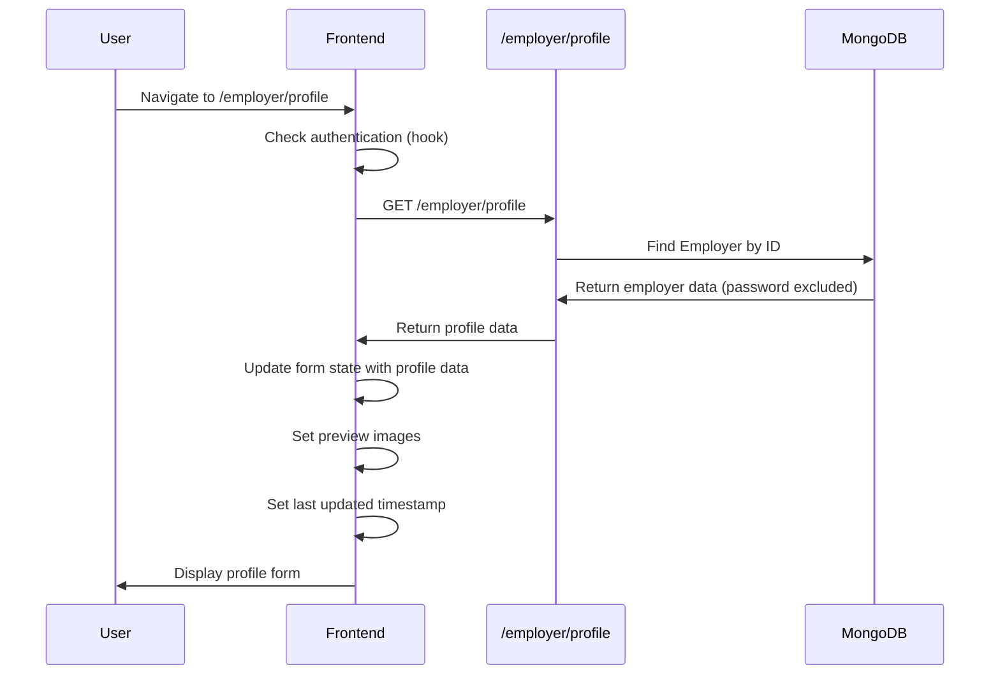
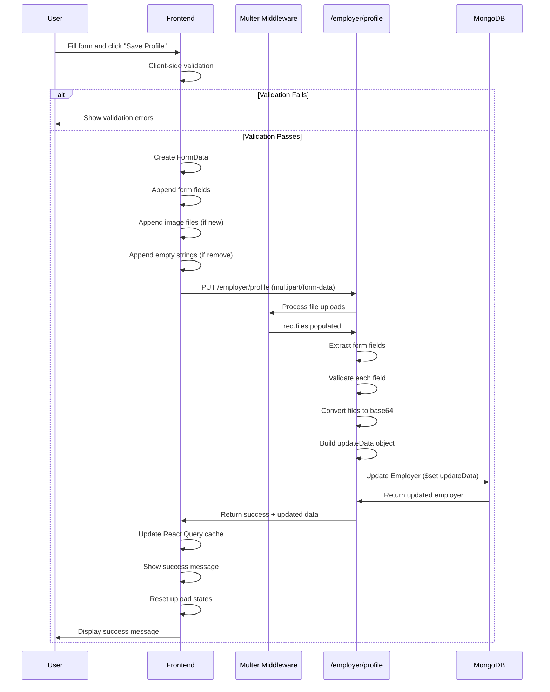

# Feature: Employer Profile

## Overview

**Purpose**: The Employer Profile feature allows employers to view and manage their personal and company information. It provides a comprehensive form interface for updating profile details, uploading profile pictures and company logos, and tracking profile completion.

**User Story**: As an employer, I want to manage my profile information (personal details and company information) so that I can maintain accurate information on the platform and present my company professionally to job seekers.

**Key Functionality**:
- View current profile information
- Update personal information (name, mobile, gender, address)
- Update company information (company name, GST number, address, website, description, industry type, company size, year established)
- Upload/remove profile picture
- Upload/remove company logo
- Profile completion calculation and display
- Client-side and server-side validation
- File upload handling (images, max 2MB)
- Form submission with loading states
- Success/error messaging
- Last updated timestamp
- Mobile-responsive custom dropdowns

**Access Level**: Authenticated (Employer only)

**URL Path**: `/employer/profile`

**Authentication Required**: Yes (JWT token via `emp_token` cookie)

---

## User Flow

### Primary Flow - View and Edit Profile
1. User navigates to `/employer/profile`
2. Authentication check (via hooks - redirects to sign-in if not authenticated)
3. **Data Loading**:
   - Fetch employer profile from API
   - Display current profile data in form fields
   - Show profile picture and company logo previews
   - Display last updated timestamp
4. **Profile Display**:
   - Personal Information section
   - Company Information section
   - Profile completion percentage (in footer)
5. **Edit Profile**:
   - User modifies form fields
   - User uploads new profile picture (optional)
   - User uploads new company logo (optional)
   - User removes existing images (optional)
   - User clicks "Save Profile" button
6. **Form Validation**:
   - Client-side validation runs
   - Validation errors displayed if any
   - If valid: Form data submitted
7. **Submit**:
   - FormData created with all fields
   - Image files included if uploaded
   - Empty strings sent if images removed
   - API call made to update profile
8. **Success**:
   - Profile updated in database
   - Success message displayed
   - Form state reset (clear upload states)
   - Last updated timestamp updated
   - Profile completion recalculated

### Image Upload Flow
1. User clicks camera icon on profile picture or company logo
2. File picker opens
3. User selects image file
4. **Validation**:
   - File size checked (must be < 2MB)
   - File type checked (must be image)
   - If invalid: Error message shown
5. If valid:
   - File converted to base64 data URL
   - Preview image displayed
   - File stored in state for upload

### Remove Image Flow
1. User clicks trash icon on existing image
2. Preview cleared
3. Remove flag set (removeProfilePicture or removeCompanyLogo)
4. On submit: Empty string sent to API to remove image

### Dropdown Selection Flow
1. User clicks dropdown (Gender or Company Size)
2. Dropdown menu opens
3. On mobile: Position calculated dynamically
4. User selects option
5. Dropdown closes
6. Selected value updated in form

---

## Frontend Implementation

### Screen Structure

**Main Page Component**:
- File: `frontend/src/app/employer/(screens)/profile/page.jsx`
- Type: Server Component (wraps client component with Suspense)
- Wrapper: `ProfilePageClient.jsx` (Client Component)

**Client Component**:
- File: `frontend/src/app/employer/(screens)/profile/ProfilePageClient.jsx`
- Type: Client Component
- Lines: ~836 lines

**Styling**:
- CSS File: `frontend/src/app/employer/(screens)/profile/page.css`
- CSS Modules: No
- Responsive: Yes

### Component Hierarchy

```
Page (page.jsx - Server Component)
  └── Suspense
      └── LoadingFallback (conditional)
      └── EmployerProfileScreen (ProfilePageClient.jsx - Client Component)
          ├── useEmployerProfile() - React Query hook
          ├── useUpdateEmployerProfile() - React Query mutation
          ├── Header
          │   ├── Title ("Company Profile")
          │   └── Last Updated (conditional)
          ├── Error Message (conditional)
          ├── Success Message (conditional)
          ├── Form
          │   ├── Personal Information Section
          │   │   ├── Profile Picture Section
          │   │   │   ├── Image Preview / Placeholder
          │   │   │   ├── Upload Button (camera icon)
          │   │   │   └── Remove Button (trash icon, conditional)
          │   │   └── Form Fields
          │   │       ├── Full Name (required, text input)
          │   │       ├── Email (disabled, text input)
          │   │       ├── Mobile Number (tel input)
          │   │       ├── Gender (custom dropdown)
          │   │       └── Address (textarea)
          │   └── Company Information Section
          │       ├── Company Logo Section
          │       │   ├── Logo Preview / Placeholder
          │       │   ├── Upload Button (camera icon)
          │       │   └── Remove Button (trash icon, conditional)
          │       └── Form Fields
          │           ├── Company Name (required, text input)
          │           ├── GST Number (text input with hint)
          │           ├── Industry Type (text input)
          │           ├── Company Size (custom dropdown)
          │           ├── Year Established (number input)
          │           ├── Company Website (text input)
          │           ├── Company Address (textarea)
          │           └── Company Description (textarea with counter)
          └── Fixed Footer
              ├── Profile Completion
              └── Save Button
```

### State Management

**React Query Hooks**:
```javascript
// Fetch profile
const { data: profileData, isLoading: loading, error: profileError } = useEmployerProfile();

// Update profile mutation
const updateProfileMutation = useUpdateEmployerProfile();
```

**Local State - Personal Information**:
```javascript
const [fullName, setFullName] = useState("");
const [email, setEmail] = useState("");
const [mobileNumber, setMobileNumber] = useState("");
const [gender, setGender] = useState("");
const [address, setAddress] = useState("");
const [profilePicture, setProfilePicture] = useState(null);
const [profilePicturePreview, setProfilePicturePreview] = useState(null);
const [removeProfilePicture, setRemoveProfilePicture] = useState(false);
```

**Local State - Company Information**:
```javascript
const [companyName, setCompanyName] = useState("");
const [gstNumber, setGstNumber] = useState("");
const [companyAddress, setCompanyAddress] = useState("");
const [companyWebsite, setCompanyWebsite] = useState("");
const [companyDescription, setCompanyDescription] = useState("");
const [industryType, setIndustryType] = useState("");
const [companySize, setCompanySize] = useState("");
const [yearEstablished, setYearEstablished] = useState("");
const [companyLogo, setCompanyLogo] = useState(null);
const [companyLogoPreview, setCompanyLogoPreview] = useState(null);
const [removeCompanyLogo, setRemoveCompanyLogo] = useState(false);
```

**Local State - UI**:
```javascript
const [error, setError] = useState("");
const [success, setSuccess] = useState("");
const [mounted, setMounted] = useState(false);
const [lastUpdated, setLastUpdated] = useState(null);
const [errors, setErrors] = useState({});
const [showGenderDropdown, setShowGenderDropdown] = useState(false);
const [showCompanySizeDropdown, setShowCompanySizeDropdown] = useState(false);
const [isMobile, setIsMobile] = useState(false);
```

**Dropdown Position State**:
```javascript
const [genderDropdownPosition, setGenderDropdownPosition] = useState({ top: 0, left: 0, width: 0 });
const [companySizeDropdownPosition, setCompanySizeDropdownPosition] = useState({ top: 0, left: 0, width: 0 });
```

**Dropdown Options**:
```javascript
const genderOptions = ["Male", "Female", "Other"];
const companySizeOptions = [
    { value: "1-10", label: "1-10 employees" },
    { value: "11-50", label: "11-50 employees" },
    { value: "51-200", label: "51-200 employees" },
    { value: "201-500", label: "201-500 employees" },
    { value: "501-1000", label: "501-1000 employees" },
    { value: "1000+", label: "1000+ employees" }
];
```

### Form Fields

#### Personal Information Section

**Full Name**:
- Type: Text input
- Required: Yes (indicated with asterisk)
- Validation: 3-40 characters
- Placeholder: "Enter your full name"
- Real-time error clearing on change

**Email**:
- Type: Email input
- Required: No (but always present)
- Editable: No (disabled)
- Styled: Gray background, cursor not-allowed
- Purpose: Display only (cannot be changed)

**Mobile Number**:
- Type: Tel input
- Required: No
- Validation: 10 digits (if provided)
- Placeholder: "10-digit mobile number"
- Max length: 10
- Input filter: Only digits allowed
- Real-time error clearing on change

**Gender**:
- Type: Custom dropdown
- Required: No
- Options: "Male", "Female", "Other", or empty
- Default: Empty (shows "Select Gender")
- Mobile: Fixed positioning for dropdown menu
- Desktop: Absolute positioning
- Features: Click outside to close, scroll to close on mobile

**Address**:
- Type: Textarea
- Required: No
- Rows: 3
- Placeholder: "Enter your full address"

#### Company Information Section

**Company Name**:
- Type: Text input
- Required: Yes (indicated with asterisk)
- Validation: 2-100 characters
- Placeholder: "Enter company name"
- Real-time error clearing on change

**GST Number**:
- Type: Text input
- Required: No
- Validation: GST format (15 characters: 2 digits + 10 alphanumeric + 1 digit + Z + 1 alphanumeric)
- Placeholder: "22AAAAA0000A1Z5"
- Max length: 15
- Input filter: Uppercase, alphanumeric only
- Hint: "Format: 2 digits + 10 alphanumeric + 1 digit + Z + 1 alphanumeric"
- Real-time error clearing on change

**Industry Type**:
- Type: Text input
- Required: No
- Placeholder: "e.g., IT, Manufacturing, Healthcare"

**Company Size**:
- Type: Custom dropdown
- Required: No
- Options: Predefined ranges (1-10, 11-50, 51-200, 201-500, 501-1000, 1000+)
- Default: Empty (shows "Select Size")
- Mobile: Fixed positioning for dropdown menu
- Desktop: Absolute positioning
- Features: Click outside to close, scroll to close on mobile

**Year Established**:
- Type: Number input
- Required: No
- Validation: Between 1800 and current year
- Placeholder: "e.g., 2020"
- Min: 1800
- Max: Current year
- Input filter: Only valid years allowed

**Company Website**:
- Type: Text input
- Required: No
- Validation: Valid URL format (if provided)
- Placeholder: "https://www.example.com"
- Real-time error clearing on change

**Company Address**:
- Type: Textarea
- Required: No
- Rows: 3
- Placeholder: "Enter company address"

**Company Description**:
- Type: Textarea
- Required: No
- Rows: 5
- Max length: 2000 characters
- Placeholder: "Describe your company, its mission, and values..."
- Character counter: "{length}/2000 characters"
- Validation: Max 2000 characters
- Real-time error clearing on change

### Image Upload Handling

#### Profile Picture

**Upload Flow**:
1. User clicks camera icon
2. File input opens
3. File selected and validated
4. FileReader converts to base64
5. Preview updated
6. File stored in state

**Validation**:
- File size: Must be < 2MB
- File type: Must be image (checked via `file.type.startsWith("image/")`)

**Remove Flow**:
1. User clicks trash icon
2. Preview cleared
3. `removeProfilePicture` flag set to true
4. On submit: Empty string sent to API

**Display**:
- If preview exists: Show image
- If no preview: Show placeholder with initials
- Initials: First letter of first word + first letter of last word (or single letter if one word)

#### Company Logo

**Upload Flow**: Same as profile picture

**Validation**: Same as profile picture (2MB, image type)

**Remove Flow**: Same as profile picture (uses `removeCompanyLogo` flag)

**Display**:
- If preview exists: Show image
- If no preview: Show placeholder with building icon
- Hint text: "Upload Company Logo"

### Profile Completion Calculation

**Purpose**: Show percentage of profile fields filled

**Algorithm**:
```javascript
const fields = [
    { value: fullName, weight: 10 },
    { value: mobileNumber, weight: 8 },
    { value: gender, weight: 5 },
    { value: address, weight: 8 },
    { value: companyName, weight: 12 },
    { value: gstNumber, weight: 10 },
    { value: companyAddress, weight: 10 },
    { value: companyWebsite, weight: 8 },
    { value: industryType, weight: 8 },
    { value: companySize, weight: 8 },
    { value: yearEstablished, weight: 8 },
    { value: companyDescription, weight: 5 },
    { value: profilePicturePreview || profilePicture, weight: 8 },
    { value: companyLogoPreview || companyLogo, weight: 8 }
];

// Calculate completed weight / total weight * 100
```

**Display**: Shown in footer as "{percentage}%"

### Validation

#### Client-Side Validation

**Full Name**:
- Required: No (but recommended)
- Length: 3-40 characters (if provided)

**Mobile Number**:
- Required: No
- Format: 10 digits (if provided)

**GST Number**:
- Required: No
- Format: 15 characters, GST regex pattern (if provided)

**Company Name**:
- Required: No (but recommended)
- Length: 2-100 characters (if provided)

**Company Website**:
- Required: No
- Format: Valid URL format (if provided)

**Company Description**:
- Required: No
- Max length: 2000 characters

**Validation Timing**:
- On submit (before API call)
- Errors stored in `errors` state object
- Error messages displayed below fields
- General error message shown if validation fails

#### Server-Side Validation

**All client-side validations are also enforced server-side**:
- Full Name: 3-40 characters
- Mobile Number: 10 digits
- Gender: Must be "male", "female", "other", or null
- GST Number: 15 characters, GST format
- Company Name: 2-100 characters
- Company Website: Valid URL format
- Company Description: Max 2000 characters
- Company Size: Must be one of enum values or null
- Year Established: 1800 to current year

**Additional Server Validations**:
- Request body must exist
- Employer must exist
- File uploads: Handled via multer middleware (max 2MB)

### Form Submission

**Process**:
1. Form validation (client-side)
2. If validation fails: Show errors, stop submission
3. If validation passes: Create FormData
4. Append all text fields to FormData
5. Handle images:
   - If remove flag set: Append empty string
   - If new file: Append file
   - If neither: Don't append (keeps existing)
6. Call `updateProfileMutation.mutateAsync(formData)`
7. On success:
   - Show success message
   - Reset image upload states
   - Clear remove flags
   - Update last updated timestamp
   - Hide success message after 3 seconds
8. On error:
   - Show error message
   - Handle 401 (redirect to sign-in)

**FormData Structure**:
```javascript
formData.append("fullName", fullName);
formData.append("mobileNumber", mobileNumber);
formData.append("gender", gender || "");
formData.append("address", address);
formData.append("gstNumber", gstNumber);
formData.append("companyName", companyName);
formData.append("companyAddress", companyAddress);
formData.append("companyWebsite", companyWebsite);
formData.append("companyDescription", companyDescription);
formData.append("industryType", industryType);
formData.append("companySize", companySize || "");
formData.append("yearEstablished", yearEstablished);

// Images (conditional)
if (removeProfilePicture) {
    formData.append("profilePicture", "");
} else if (profilePicture) {
    formData.append("profilePicture", profilePicture);
}

if (removeCompanyLogo) {
    formData.append("companyLogo", "");
} else if (companyLogo) {
    formData.append("companyLogo", companyLogo);
}
```

### API Integration

**Endpoints Called**:

| Endpoint | Method | Purpose | Authentication |
|----------|--------|---------|----------------|
| `/employer/profile` | GET | Fetch profile | Bearer token |
| `/employer/profile` | PUT | Update profile | Bearer token |

**Environment Variables**:
- `NEXT_PUBLIC_EMPLOYER_URL`: Base URL for employer API

**Fetch Profile**:
- Hook: `useEmployerProfile()`
- Query key: `['employer', 'profile', 'data']`
- Stale time: 5 minutes
- Cache time: 10 minutes
- Auto-redirects on 401

**Update Profile**:
- Hook: `useUpdateEmployerProfile()`
- Mutation: Uses FormData with `multipart/form-data` content type
- On success: Updates React Query cache
- Auto-redirects on 401

### Custom Dropdowns

**Purpose**: Replace native select elements for better styling and mobile support

**Gender Dropdown**:
- Options: "Select Gender" (empty), "Male", "Female", "Other"
- Selected value shown in dropdown
- Check icon indicates selected option

**Company Size Dropdown**:
- Options: "Select Size" (empty), predefined ranges
- Selected value label shown in dropdown
- Check icon indicates selected option

**Mobile Behavior**:
- Dropdown menu uses fixed positioning
- Position calculated before opening (synchronous)
- Closes on scroll (better performance than position updates)
- Full width of select element

**Desktop Behavior**:
- Dropdown menu uses absolute positioning
- Position calculated in useEffect
- Below select element

**Features**:
- Click outside to close
- Close on scroll (mobile only)
- Prevents multiple dropdowns open simultaneously
- Smooth animations

### Loading States

**Initial Loading**:
- Shows loading spinner during profile fetch
- Prevents hydration mismatch with `mounted` state

**Submit Loading**:
- Save button shows spinner and "Saving..." text
- Button disabled during submission
- Button also disabled if validation errors exist

### Hydration Prevention

**Issue**: SSR/hydration mismatch with form state

**Solution**:
- Use `mounted` state to track client-side mount
- Show loading state until mounted
- Prevent form rendering until mounted
- Ensures consistent initial render

---

## Backend Implementation

### API Endpoints

#### Get Employer Profile

**Route Definition**:
```javascript
router.get("/profile", verifyToken, employerController.getProfile);
```

**Full Endpoint Path**: `/employer/profile`

**HTTP Method**: GET

**Authentication Required**: Yes

**Response Format**:
```json
{
  "success": true,
  "data": {
    "fullName": "John Doe",
    "email": "john@example.com",
    "mobileNumber": "1234567890",
    "gender": "male",
    "address": "123 Main St",
    "companyName": "Acme Corp",
    "gstNumber": "22AAAAA0000A1Z5",
    "companyAddress": "456 Company St",
    "companyWebsite": "https://www.acme.com",
    "companyDescription": "Company description...",
    "industryType": "IT",
    "companySize": "51-200",
    "yearEstablished": 2020,
    "profilePicture": "data:image/png;base64,...",
    "companyLogo": "data:image/png;base64,...",
    "createdAt": "...",
    "updatedAt": "..."
  }
}
```

**Controller Logic** (`getProfile`):
1. Find employer by ID (from `req.userId`)
2. Select all fields except password (`.select('-password')`)
3. Return employer data

#### Update Employer Profile

**Route Definition**:
```javascript
router.put("/profile", verifyToken, uploadEmployerFiles, employerController.updateProfile);
```

**Full Endpoint Path**: `/employer/profile`

**HTTP Method**: PUT

**Authentication Required**: Yes

**Content Type**: `multipart/form-data`

**Request Body**: FormData with text fields and optional image files

**Response Format**:
```json
{
  "success": true,
  "message": "Profile updated successfully",
  "data": {
    // Updated employer object (same structure as GET response)
  }
}
```

**Controller Logic** (`updateProfile`):
1. Validate request body exists
2. Extract form fields from `req.body`
3. Get current employer (for validation)
4. Build update object (`updateData`):
   - Validate each field if provided
   - Trim string values
   - Set to null/empty if appropriate
5. Handle profile picture:
   - If file uploaded: Convert to base64 data URI
   - If empty string: Set to null (remove)
   - If undefined: Keep existing (don't update)
6. Handle company logo: Same as profile picture
7. Update employer in database with `$set` operator
8. Return updated employer (password excluded)

**Field Validations**:

**Full Name**:
- Length: 3-40 characters
- Trimmed

**Mobile Number**:
- Format: 10 digits (if provided)
- Non-digits removed
- Set to empty string if not provided

**Gender**:
- Must be "male", "female", "other", or null
- Lowercase stored

**Address**:
- Trimmed
- Can be empty string

**GST Number**:
- Format: 15 characters, GST regex (if provided)
- Uppercase, spaces removed
- Set to empty string if not provided

**Company Name**:
- Length: 2-100 characters
- Trimmed

**Company Address**:
- Trimmed
- Can be empty string

**Company Website**:
- Valid URL format (if provided)
- Trimmed
- Set to empty string if not provided

**Company Description**:
- Max length: 2000 characters
- Trimmed
- Can be empty string

**Industry Type**:
- Trimmed
- Can be empty string

**Company Size**:
- Must be one of enum values: "1-10", "11-50", "51-200", "201-500", "501-1000", "1000+"
- Set to null if not provided

**Year Established**:
- Integer between 1800 and current year
- Set to null if not provided

### Middleware Chain

**Upload Middleware** (`uploadEmployerFiles`):
- Uses `multer` for file upload handling
- Accepts `profilePicture` and `companyLogo` fields
- Max file size: 2MB
- File filter: Images only
- Files stored in `req.files`

**Authentication Middleware**:
- `verifyToken`: Validates JWT token, attaches userId
- On failure: Returns 401 Unauthorized

### Database Models

**Employer Model** (`backend/src/models/employer.js`):

**Personal Information Fields**:
- `fullName`: String (required, trim)
- `email`: String (required, unique, lowercase, trim)
- `password`: String (required, excluded from responses)
- `mobileNumber`: String (trim)
- `gender`: String (enum: ["male", "female", "other"])
- `address`: String (trim)
- `profilePicture`: String (base64 or URL, default: null)

**Company Information Fields**:
- `companyName`: String (required, trim)
- `gstNumber`: String (trim, uppercase)
- `companyAddress`: String (trim)
- `companyWebsite`: String (trim)
- `companyDescription`: String (trim)
- `industryType`: String (trim)
- `companySize`: String (enum: ["1-10", "11-50", "51-200", "201-500", "501-1000", "1000+"])
- `yearEstablished`: Number (min: 1800, max: current year)
- `companyLogo`: String (base64 or URL, default: null)

**Other Fields**:
- `notificationPreferences`: Object (nested)
- `emailAlertOnLogin`: Boolean (default: false)
- `createdAt`: Date (timestamps)
- `updatedAt`: Date (timestamps)

**GST Validation Regex**:
```javascript
const gstRegex = /^[0-9]{2}[A-Z]{5}[0-9]{4}[A-Z]{1}[1-9A-Z]{1}Z[0-9A-Z]{1}$/;
```

---

## Data Flow

### Fetch Profile Flow



### Update Profile Flow



---

## Error Handling

### Frontend Error Handling

**Authentication Errors**:
- 401 responses: Auto-redirect to `/signin/employer` (handled by hooks)
- Token removed from cookies
- No error messages shown (automatic redirect)

**Validation Errors**:
- Client-side: Errors displayed below fields
- Server-side: Error message shown in error banner
- Field-specific errors in `errors` state
- General error message if validation fails

**Network Errors**:
- React Query retries once (except on 401)
- Error message shown in error banner
- User can retry by submitting again

**File Upload Errors**:
- File size: "Profile picture/Company logo must be less than 2MB"
- File type: "Please select an image file"
- Displayed immediately on file selection

**Form Submission Errors**:
- Error message shown in error banner
- Form remains editable
- User can correct and resubmit

### Backend Error Handling

**Authentication Errors**:
- Missing/invalid token: 401 Unauthorized
- User not found: 404 Not Found

**Validation Errors**:
- Invalid field values: 400 Bad Request
- Specific error messages for each validation failure
- Returns immediately on first validation error

**File Upload Errors**:
- Handled by multer middleware:
  - File size too large: 400 Bad Request
  - Invalid file type: 400 Bad Request
  - Error messages in response

**Database Errors**:
- Connection errors: 500 Internal Server Error
- Query errors: 500 Internal Server Error
- Logged to console

**Status Codes**:
- 200: Success
- 400: Bad Request (validation/file errors)
- 401: Unauthorized (authentication required)
- 404: Not Found (employer not found)
- 500: Internal Server Error

---

## Security Features

### Authentication
- JWT token required for all endpoints
- Token validated via middleware
- Employer can only access their own profile

### Authorization
- `req.userId` from token used for all operations
- Profile updated only for authenticated employer
- No cross-user access possible

### Input Validation
- Client-side validation for immediate feedback
- Server-side validation for security
- All string inputs trimmed
- Type validation (numbers, enums)
- Length validation (min/max)
- Format validation (GST, URL, mobile)

### File Upload Security
- File size limit (2MB)
- File type restriction (images only)
- Files converted to base64 (stored in database)
- No direct file system access from frontend

### Data Protection
- Password excluded from all responses
- Sensitive data validated and sanitized
- XSS protection via React's built-in escaping
- CSRF protection via same-origin policy and token validation

---

## UI/UX Details

### Layout Structure

**Page Sections** (in order):
1. Header (title, last updated)
2. Error message banner (conditional)
3. Success message banner (conditional)
4. Form:
   - Personal Information section
   - Company Information section
5. Fixed footer (profile completion, save button)

### Visual Design

**Header**:
- Large title ("Company Profile")
- Subtitle with last updated date (if available)

**Form Sections**:
- Section headers with icons
- Grid layout for form fields
- Full-width fields for textareas
- Consistent spacing

**Image Uploads**:
- Circular preview (profile picture)
- Square preview (company logo)
- Placeholder with initials/icon
- Camera icon for upload
- Trash icon for removal
- Hover effects

**Custom Dropdowns**:
- Styled select button
- Dropdown menu with options
- Check icon for selected option
- Smooth animations
- Mobile-friendly positioning

**Footer**:
- Fixed at bottom
- Profile completion on left
- Save button on right
- Disabled state when saving or errors

**Error/Success Messages**:
- Banner at top of form
- Color-coded (red for errors, green for success)
- Auto-hide success after 3 seconds

### Responsive Design

**Desktop**:
- Multi-column grid layout
- Full-width textareas
- Absolute positioned dropdowns
- Fixed footer

**Tablet**:
- Adjusted grid columns
- Maintained spacing
- Responsive dropdowns

**Mobile**:
- Single-column layout
- Full-width inputs
- Fixed positioned dropdowns (mobile-specific)
- Touch-friendly targets
- Scrollable form content
- Fixed footer (accessible via scroll)

### Accessibility

**Keyboard Navigation**:
- Tab order logical
- All inputs keyboard accessible
- Dropdowns keyboard accessible
- Save button keyboard accessible

**Screen Reader Support**:
- Semantic HTML elements
- Label associations
- Error announcements
- Required field indicators
- Button states announced

**Visual Indicators**:
- Required fields marked with asterisk
- Error states (red borders, error messages)
- Success states (success message)
- Disabled states (grayed out)
- Focus states (outline)

---

## Testing Considerations

### Test Scenarios

**Happy Path**:
1. User views profile → Profile data loaded → Form populated correctly
2. User updates fields → Validation passes → Profile updated → Success shown
3. User uploads image → Image validated → Preview shown → Profile updated → Image saved

**Validation**:
1. Full name too short/long → Error shown → Cannot submit
2. Invalid mobile number → Error shown → Cannot submit
3. Invalid GST number → Error shown → Cannot submit
4. Invalid website URL → Error shown → Cannot submit
5. Company description too long → Error shown → Cannot submit

**File Upload**:
1. File too large → Error shown immediately → File rejected
2. Non-image file → Error shown immediately → File rejected
3. Valid image → Preview shown → File included in submission
4. Remove image → Preview cleared → Empty string sent on submit

**Dropdowns**:
1. Select gender → Dropdown opens → Option selected → Dropdown closes → Value updated
2. Select company size → Dropdown opens → Option selected → Dropdown closes → Value updated
3. Click outside → Dropdown closes
4. Scroll on mobile → Dropdown closes

**Edge Cases**:
1. Empty profile → Form shows empty fields → Can fill and save
2. Partial profile → Profile completion shows correct percentage
3. All fields filled → Profile completion shows 100%
4. Network error → Error message shown → Can retry
5. Session expired → Redirect to sign-in

**Profile Completion**:
1. Fields filled incrementally → Percentage updates correctly
2. Fields cleared → Percentage decreases correctly
3. Images uploaded → Percentage increases correctly
4. Images removed → Percentage decreases correctly

---

## Related Features

- **Employer Home Dashboard** (`/employer/home`): Shows profile name in welcome message
- **Post Job** (`/employer/post-job`): May use company name from profile
- **Employer Settings** (`/employer/settings`): Additional settings management

---

## Additional Notes

**Dependencies**:
- `@tanstack/react-query`: Data fetching and caching
- `axios`: HTTP client
- `js-cookie`: Cookie management
- `@mui/material`: Loading spinner
- `react-icons/fa`: Icon library
- `react-icons/hi2`: Dropdown icons
- `next/navigation`: Routing

**File Upload Strategy**:
- Files converted to base64 data URIs
- Stored as strings in database
- No separate file storage system
- Max size: 2MB per image
- Supported formats: All image types

**Performance Optimizations**:
- React Query caching (reduces API calls)
- Client-side validation (immediate feedback)
- Memoized profile completion calculation
- Optimistic cache updates on success

**Known Limitations**:
- Images stored as base64 (database size concerns)
- No image compression/resizing
- No image cropping/editing
- Profile completion calculation is client-side only
- No draft saving (form state lost on refresh)

**Future Enhancements**:
- Image compression/resizing before upload
- Image cropping/editing tools
- Draft saving (localStorage or backend)
- Profile preview mode
- Profile sharing/public view
- Multiple company profiles support
- Profile verification badges
- Social media links
- Company certifications/credentials
- Team members listing
- Company culture/values section
- Office photos gallery

---

## Code References

### Frontend Files
- `frontend/src/app/employer/(screens)/profile/page.jsx` - Server component wrapper (~29 lines)
- `frontend/src/app/employer/(screens)/profile/ProfilePageClient.jsx` - Main client component (~836 lines)
- `frontend/src/app/employer/(screens)/profile/page.css` - Styling
- `frontend/src/hooks/useEmployerProfile.js` - Profile hooks (~113 lines)

### Backend Files
- `backend/src/routes/employerRoutes.js` - Route definitions:
  - Line 24: GET `/profile`
  - Lines 26-55: PUT `/profile` (with upload middleware)
- `backend/src/controllers/employerController.js` - Controller functions:
  - `getProfile` (lines 362-387)
  - `updateProfile` (lines 390-612)
- `backend/src/models/employer.js` - Employer model schema
- `backend/src/middleware/uploadEmployerFiles.js` - File upload middleware

---

*Last Updated: [Current Date]*
*Documented By: TSD Documentation System*

