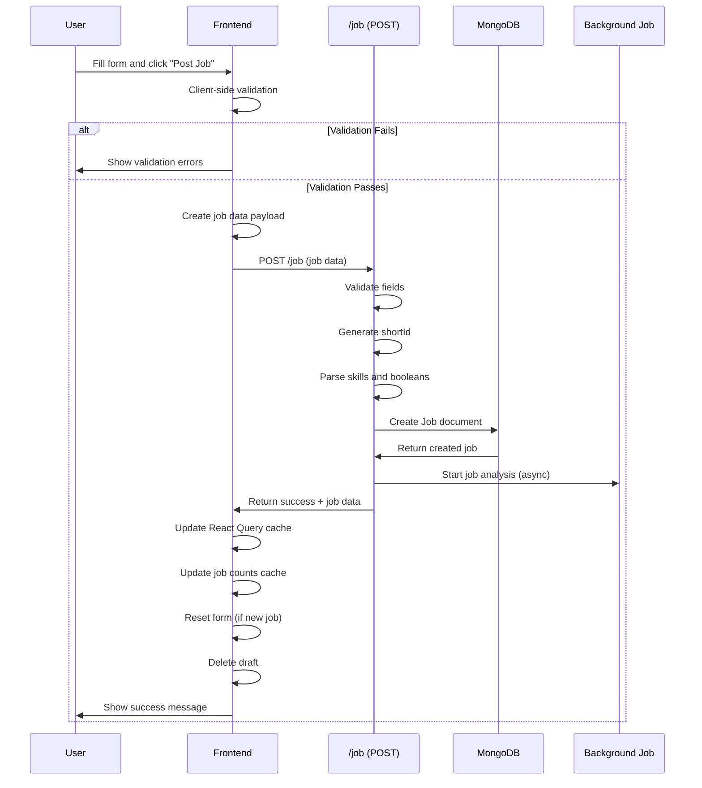
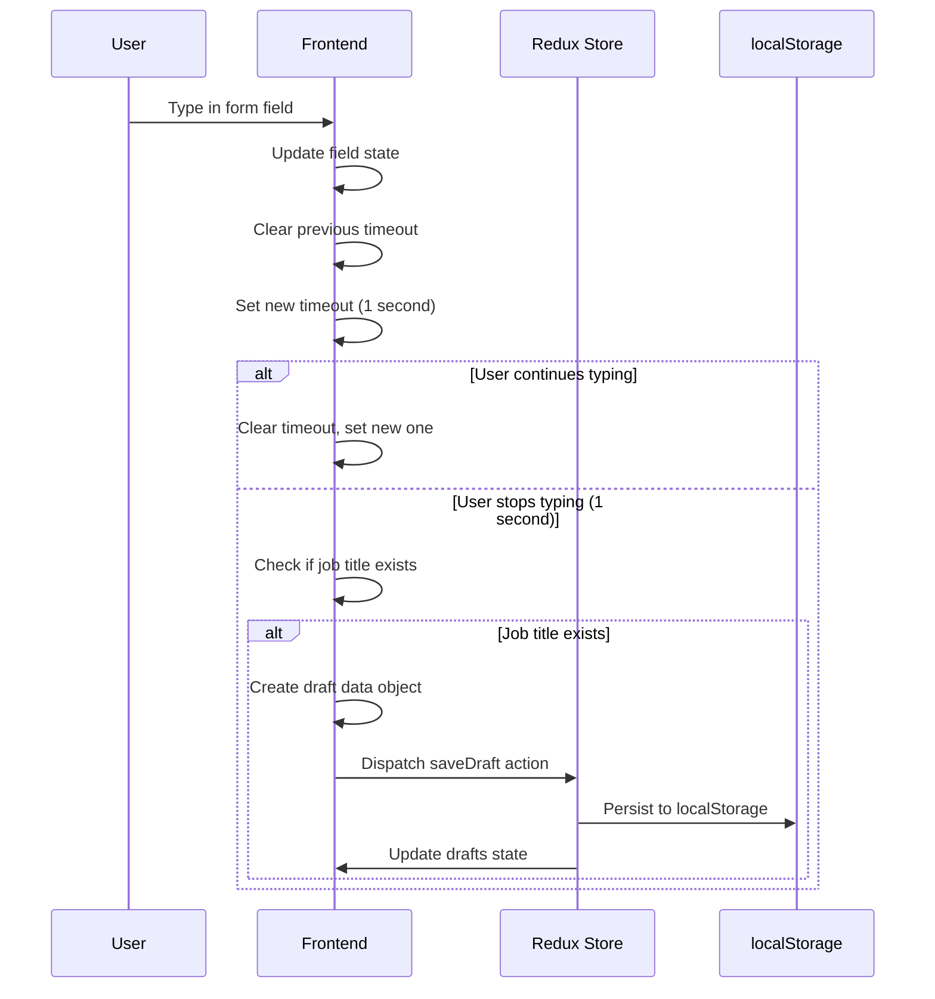

# Feature: Post Job

## Overview

**Purpose**: The Post Job feature allows employers to create and edit job postings. It provides a comprehensive form interface with multiple sections, draft saving functionality, AI-powered job description generation, and support for both manual job posting and Smart Post integration.

**User Story**: As an employer, I want to create job postings with detailed information (job title, company details, requirements, skills, etc.) so that I can attract qualified candidates to apply for open positions.

**Key Functionality**:
- Create new job postings
- Edit existing job postings
- Draft saving (auto-save and manual)
- AI-powered job description generation
- Skills selection
- Multiple form sections (Basic Information, Salary & Dates, Detailed Information)
- Custom dropdowns for various fields
- Custom location and qualification inputs
- Assessment requirements configuration
- Form validation (client-side and server-side)
- Auto-fill from employer profile
- Submit as Draft or Active status
- Smart Post integration

**Access Level**: Authenticated (Employer only)

**URL Path**: `/employer/post-job`

**Authentication Required**: Yes (JWT token via `emp_token` cookie)

---

## User Flow

### Primary Flow - Create New Job
1. User navigates to `/employer/post-job`
2. Authentication check (via hooks - redirects to sign-in if not authenticated)
3. **Form Initialization**:
   - Profile data fetched for auto-fill
   - Company name and email auto-filled from profile
   - Drafts initialized (if available)
   - Form fields initialized with empty/default values
4. **Form Filling**:
   - User fills Basic Information section (job title, company name, job type, department, etc.)
   - User fills Salary & Dates section (salary range, openings, dates, email)
   - User fills Detailed Information section (job description, responsibilities, requirements, perks, skills)
   - User configures assessment requirements
5. **Optional Actions**:
   - User can use AI Generate modal to generate job description
   - User can select skills using SkillSelector component
   - User can save draft manually or auto-save occurs
   - User can load existing drafts
6. **Form Validation**:
   - Client-side validation runs on blur and submit
   - Validation errors displayed inline
7. **Submit**:
   - User clicks "Post Job" or "Save as Draft" button
   - Form validated
   - API call made to create job
   - On success: Success message shown, form reset (if new job), redirect or callback (if edit mode)

### Edit Flow
1. User opens job edit modal/page
2. Job data fetched by ID
3. Form populated with existing job data
4. User modifies fields
5. User clicks "Update Job" button
6. Form validated
7. API call made to update job
8. On success: Success message shown, callback executed, modal closed

### Draft Flow
1. User fills form fields
2. Auto-save triggers after 1 second of inactivity
3. Draft saved to Redux store (localStorage)
4. User can click "Drafts" button to view saved drafts
5. User can load draft into form
6. User can create new draft (saves current, resets form)
7. On job posting: Draft deleted

### AI Generation Flow
1. User clicks "AI Generate" button or opens AI modal (via ?ai=true query param)
2. AI Generate modal opens
3. User provides inputs or uses current form data
4. User clicks "Generate" (immediate) or "Generate in Background"
5. If immediate: Job description generated and filled into form
6. If background: Generation task started, draft created/updated when complete
7. User notified when generation completes

### Smart Post Flow
1. User creates job from Smart Post job data
2. Form pre-filled with Smart Post job data
3. User can edit fields
4. User submits form
5. Job created from Smart Post, Smart Post job deleted

---

## Frontend Implementation

### Screen Structure

**Main Page Component**:
- File: `frontend/src/app/employer/(screens)/post-job/page.jsx`
- Type: Server Component (wraps client component with Suspense)
- Wrapper: `PostJobPageClient.jsx` (Client Component)

**Client Component**:
- File: `frontend/src/app/employer/(screens)/post-job/PostJobPageClient.jsx`
- Type: Client Component
- Lines: ~2070+ lines (very large component)

**Component Props** (for edit mode/Smart Post):
- `isEditMode`: Boolean (default: false)
- `jobId`: String (for edit mode)
- `onClose`: Function (callback for edit mode)
- `onSuccess`: Function (callback on success)
- `scrollContainerRef`: Ref (for scroll handling in edit mode)
- `initialJobData`: Object (for Smart Post)
- `isSmartPost`: Boolean (default: false)
- `smartPostJobId`: String (for Smart Post)

**Styling**:
- CSS File: `frontend/src/app/employer/(screens)/post-job/page.css`
- CSS Modules: No
- Responsive: Yes

### Component Hierarchy

```
Page (page.jsx - Server Component)
  └── Suspense
      └── LoadingFallback
      └── PostJobScreen (PostJobPageClient.jsx - Client Component)
          ├── useEmployerProfile() - Profile hook
          ├── usePostJob() - Post job mutation
          ├── useUpdateJob() - Update job mutation
          ├── useJobById() - Fetch job for edit mode
          ├── usePostSmartPostJob() - Smart Post mutation
          ├── Redux (drafts state management)
          ├── BackgroundGenerationContext (AI generation)
          ├── Header (conditional, not shown in edit mode)
          │   ├── Title ("Post a New Job")
          │   └── Actions
          │       ├── New Draft Button
          │       └── Drafts Button
          ├── Error/Success Messages
          ├── Form
          │   ├── Basic Information Section
          │   │   ├── Job Title (required, text input)
          │   │   ├── Company Name (required, text input, editable with icon)
          │   │   ├── Job Type (custom dropdown)
          │   │   ├── Department (custom dropdown)
          │   │   ├── Employment Type (custom dropdown)
          │   │   ├── Experience (custom dropdown)
          │   │   ├── Work Mode (required, custom dropdown)
          │   │   ├── Location (custom dropdown with custom option)
          │   │   └── Highest Qualification (custom dropdown with custom option)
          │   ├── Salary & Dates Section
          │   │   ├── Min Salary (number input)
          │   │   ├── Max Salary (number input)
          │   │   ├── Number of Openings (number input)
          │   │   ├── Application Opening Date (required, date input)
          │   │   ├── Application Closing Date (required, date input)
          │   │   └── Hiring Manager Email (required, email input, editable with icon)
          │   └── Detailed Information Section
          │       ├── Job Description (required, textarea, min 50 chars)
          │       ├── Responsibilities (textarea)
          │       ├── Requirements (textarea)
          │       ├── Perks and Benefits (textarea)
          │       ├── Skills (SkillSelector component)
          │       └── Assessment Requirements
          │           ├── Requires Basic Test (toggle, default: true)
          │           └── Requires Video Proctored Test (toggle, default: false)
          ├── Form Actions (Footer)
          │   ├── Save as Draft Button
          │   └── Post Job Button
          ├── DraftsSidebar (conditional)
          └── AIGenerateModal (conditional)
```

### State Management

**React Query Hooks**:
```javascript
// Fetch profile for auto-fill
const { data: profileData } = useEmployerProfile();

// Post job mutation
const postJobMutation = usePostJob();

// Update job mutation
const updateJobMutation = useUpdateJob();

// Fetch job for edit mode
const { data: jobData, isLoading: loadingJob } = useJobById(isEditMode && jobId ? jobId : null);

// Smart Post mutation
const postSmartPostMutation = usePostSmartPostJob();
```

**Redux State** (Drafts):
```javascript
const dispatch = useDispatch();
const drafts = useSelector((state) => state.drafts.drafts);
```

**Background Generation Context**:
```javascript
const { activeTasks, completedTasks, removeCompletedTask } = useBackgroundGeneration();
```

**Local State - Basic Information**:
```javascript
const [jobTitle, setJobTitle] = useState("");
const [companyName, setCompanyName] = useState("");
const [isEditingCompanyName, setIsEditingCompanyName] = useState(false);
const [jobType, setJobType] = useState("");
const [showJobTypeDropdown, setShowJobTypeDropdown] = useState(false);
const [department, setDepartment] = useState("");
const [showDepartmentDropdown, setShowDepartmentDropdown] = useState(false);
const [employmentType, setEmploymentType] = useState("");
const [showEmploymentTypeDropdown, setShowEmploymentTypeDropdown] = useState(false);
const [experience, setExperience] = useState("");
const [showExperienceDropdown, setShowExperienceDropdown] = useState(false);
const [workMode, setWorkMode] = useState("");
const [showWorkModeDropdown, setShowWorkModeDropdown] = useState(false);
const [location, setLocation] = useState("");
const [showLocationDropdown, setShowLocationDropdown] = useState(false);
const [isCustomLocation, setIsCustomLocation] = useState(false);
const [customLocation, setCustomLocation] = useState("");
const [highestQualification, setHighestQualification] = useState("");
const [showQualificationDropdown, setShowQualificationDropdown] = useState(false);
const [isCustomQualification, setIsCustomQualification] = useState(false);
const [customQualification, setCustomQualification] = useState("");
```

**Local State - Salary & Dates**:
```javascript
const [minSalary, setMinSalary] = useState("");
const [maxSalary, setMaxSalary] = useState("");
const [numberOfOpenings, setNumberOfOpenings] = useState("");
const [applicationOpeningDate, setApplicationOpeningDate] = useState("");
const [applicationClosingDate, setApplicationClosingDate] = useState("");
const [hiringManagerEmail, setHiringManagerEmail] = useState("");
const [isEditingEmail, setIsEditingEmail] = useState(false);
```

**Local State - Detailed Information**:
```javascript
const [jobDescription, setJobDescription] = useState("");
const [responsibilities, setResponsibilities] = useState("");
const [requirements, setRequirements] = useState("");
const [perksAndBenefits, setPerksAndBenefits] = useState("");
const [skills, setSkills] = useState([]);
const [requiresBasicTest, setRequiresBasicTest] = useState(true);
const [requiresVideoProctoredTest, setRequiresVideoProctoredTest] = useState(false);
```

**Local State - UI**:
```javascript
const [error, setError] = useState("");
const [success, setSuccess] = useState("");
const [errors, setErrors] = useState({});
const [showDraftsSidebar, setShowDraftsSidebar] = useState(false);
const [showAIModal, setShowAIModal] = useState(false);
const [currentDraftId, setCurrentDraftId] = useState(null);
const [aiDraftId, setAiDraftId] = useState(null);
const [mounted, setMounted] = useState(false);
const [isMobile, setIsMobile] = useState(false);
```

**Dropdown Position States** (for mobile):
```javascript
const [jobTypeDropdownPosition, setJobTypeDropdownPosition] = useState({ top: 0, left: 0, width: 0 });
// ... similar for all 7 dropdowns
```

### Form Fields

#### Basic Information Section

**Job Title**:
- Type: Text input
- Required: Yes
- Validation: Minimum 3 characters, max 100 characters
- Placeholder: "e.g., Senior Software Engineer"
- Real-time validation on change and blur

**Company Name**:
- Type: Text input
- Required: Yes
- Validation: Minimum 2 characters, max 100 characters
- Auto-filled from profile
- Editable with edit icon button
- Shows non-editable state when not editing

**Job Type**:
- Type: Custom dropdown
- Required: Yes
- Options: ["Full-time", "Part-time", "Internship", "Freelance", "Contract", "Temporary"]

**Department**:
- Type: Custom dropdown
- Required: No
- Options: ["IT/Software", "Sales & Marketing", "HR", "Finance", "Operations", "Engineering", "Product", "Design", "Customer Support", "Legal", "Administration", "Manufacturing", "Healthcare", "Education", "Other"]

**Employment Type**:
- Type: Custom dropdown
- Required: No
- Default: "Permanent"
- Options: ["Permanent", "Contract", "Temporary"]

**Experience**:
- Type: Custom dropdown
- Required: No
- Options: ["Fresher", "0-1 years", "1-2 years", "2-3 years", "3-5 years", "5-7 years", "7-10 years", "10+ years"]

**Work Mode**:
- Type: Custom dropdown
- Required: Yes
- Options: ["Onsite", "Hybrid", "Remote"]

**Location**:
- Type: Custom dropdown with custom input option
- Required: Yes
- Options: Popular Indian cities (16 options)
- Custom option: "Other" allows custom text input
- State: `location` (selected value) or `customLocation` (if custom)

**Highest Qualification**:
- Type: Custom dropdown with custom input option
- Required: No
- Options: ["10th Pass", "12th Pass", "Diploma", "Bachelor's Degree", "Master's Degree", "MBA", "Ph.D.", "Professional Degree", "Technical Certification", "Other"]
- Custom option: "Other" allows custom text input
- State: `highestQualification` (selected value) or `customQualification` (if custom)

#### Salary & Dates Section

**Min Salary**:
- Type: Number input
- Required: No
- Validation: Must be >= 0 (if provided)
- Placeholder: "e.g., 500000"

**Max Salary**:
- Type: Number input
- Required: No
- Validation: Must be >= 0 and >= minSalary (if both provided)

**Number of Openings**:
- Type: Number input
- Required: No
- Validation: Must be >= 1 and integer (if provided)

**Application Opening Date**:
- Type: Date input
- Required: Yes
- Validation: Cannot be in the past (for new jobs, not edit mode)
- Format: YYYY-MM-DD

**Application Closing Date**:
- Type: Date input
- Required: Yes
- Validation: Must be after opening date

**Hiring Manager Email**:
- Type: Email input
- Required: Yes
- Validation: Valid email format
- Auto-filled from profile email
- Editable with edit icon button
- Shows non-editable state when not editing

#### Detailed Information Section

**Job Description**:
- Type: Textarea
- Required: Yes
- Validation: Minimum 50 characters
- Placeholder: "Describe the role, responsibilities, and what makes this job great..."

**Responsibilities**:
- Type: Textarea
- Required: No
- Placeholder: "List key responsibilities and duties..."

**Requirements**:
- Type: Textarea
- Required: No
- Placeholder: "List required skills, experience, and qualifications..."

**Perks and Benefits**:
- Type: Textarea
- Required: No
- Placeholder: "List perks, benefits, and what you offer..."

**Skills**:
- Type: SkillSelector component
- Required: No
- Multiple selection
- Search functionality
- Skills stored as array of strings

**Assessment Requirements**:
- **Requires Basic Test**: Toggle (default: true)
- **Requires Video Proctored Test**: Toggle (default: false)

### Dropdown Options

**Job Types**: Full-time, Part-time, Internship, Freelance, Contract, Temporary

**Employment Types**: Permanent, Contract, Temporary

**Work Modes**: Onsite, Hybrid, Remote

**Experience Levels**: Fresher, 0-1 years, 1-2 years, 2-3 years, 3-5 years, 5-7 years, 7-10 years, 10+ years

**Departments**: IT/Software, Sales & Marketing, HR, Finance, Operations, Engineering, Product, Design, Customer Support, Legal, Administration, Manufacturing, Healthcare, Education, Other

**Popular Locations** (16 options):
- Bangalore, Karnataka
- Mumbai, Maharashtra
- Delhi NCR
- Hyderabad, Telangana
- Pune, Maharashtra
- Chennai, Tamil Nadu
- Kolkata, West Bengal
- Ahmedabad, Gujarat
- Jaipur, Rajasthan
- Chandigarh, Punjab
- Indore, Madhya Pradesh
- Gurgaon, Haryana
- Noida, Uttar Pradesh
- Kochi, Kerala
- Coimbatore, Tamil Nadu
- Goa

**Qualifications**: 10th Pass, 12th Pass, Diploma, Bachelor's Degree, Master's Degree, MBA, Ph.D., Professional Degree, Technical Certification, Other

### Custom Dropdowns

**Implementation**: All dropdowns use custom components (not native select)

**Features**:
- Click to open/close
- Check icon for selected option
- Click outside to close
- Mobile: Fixed positioning (calculated synchronously)
- Desktop: Absolute positioning (calculated in useEffect)
- Scroll to close on mobile
- Prevents multiple dropdowns open simultaneously

**Dropdowns** (7 total):
1. Job Type
2. Department
3. Employment Type
4. Experience
5. Work Mode
6. Location (with custom option)
7. Highest Qualification (with custom option)

### Draft Functionality

**Purpose**: Save job posting drafts locally for later editing

**Storage**: Redux store (persisted to localStorage)

**Auto-Save**:
- Triggers after 1 second of inactivity
- Saves when any form field changes
- Only saves if job title exists
- Not saved in edit mode or Smart Post mode
- Debounced to prevent excessive saves

**Manual Save**:
- "Save as Draft" button submits form with status="Draft"
- Draft also saved via auto-save

**Load Draft**:
- Click "Drafts" button to open sidebar
- Select draft from list
- Form populated with draft data
- Draft ID tracked for updates

**New Draft**:
- "New Draft" button saves current form, then resets
- Creates fresh draft for new job posting

**Draft Deletion**:
- Draft deleted when job posted successfully
- User can manually delete drafts from sidebar

**Draft Data Structure**:
```javascript
{
    id: string (optional, for existing drafts),
    jobTitle: string,
    companyName: string,
    jobType: string,
    department: string,
    employmentType: string,
    experience: string,
    workMode: string,
    location: string,
    isCustomLocation: boolean,
    customLocation: string,
    highestQualification: string,
    isCustomQualification: boolean,
    customQualification: string,
    minSalary: string,
    maxSalary: string,
    numberOfOpenings: string,
    applicationOpeningDate: string,
    applicationClosingDate: string,
    hiringManagerEmail: string,
    jobDescription: string,
    responsibilities: string,
    requirements: string,
    perksAndBenefits: string,
    requiresBasicTest: boolean,
    requiresVideoProctoredTest: boolean,
    skills: string[]
}
```

### AI Generation Integration

**Purpose**: Generate job descriptions using AI

**Components**:
- `AIGenerateModal`: Modal component for AI generation
- `BackgroundGenerationContext`: Context for background generation tasks

**Modes**:
1. **Immediate Generation**: Generates and fills form immediately
2. **Background Generation**: Generates in background, updates draft when complete

**Integration**:
- Modal receives current form data
- User can generate full job description
- Generated content fills form fields (job description, responsibilities, requirements, perks, skills)
- Background generation creates/updates draft automatically

**Query Parameter**: `?ai=true` auto-opens AI modal on page load

### Validation

#### Client-Side Validation

**Required Fields**:
- Job Title (min 3 chars)
- Company Name (min 2 chars)
- Work Mode (must select)
- Location (must select or enter custom)
- Application Opening Date (must select)
- Application Closing Date (must select)
- Hiring Manager Email (valid email)
- Job Description (min 50 chars)

**Optional Fields Validation**:
- Min Salary: >= 0 (if provided)
- Max Salary: >= 0 and >= minSalary (if provided)
- Number of Openings: >= 1 and integer (if provided)
- Dates: Closing date must be after opening date
- Opening date cannot be in past (for new jobs only, not edit mode)

**Validation Timing**:
- On blur (for text inputs)
- On change (for some fields)
- On submit (all fields)

**Error Display**: Inline errors below fields

#### Server-Side Validation

All client-side validations are also enforced server-side:
- Required fields checked
- Date validation
- Email validation
- Salary range validation
- Field length limits

### Form Submission

**Submit Modes**:
1. **Post as Active**: `handleSubmit(e, "Active")` - Job posted with Active status
2. **Save as Draft**: `handleSubmit(e, "Draft")` - Job posted with Draft status

**Process**:
1. Form validation (client-side)
2. If validation fails: Show errors, stop submission
3. If validation passes: Create job data payload
4. Determine mode:
   - Edit mode: Call `updateJobMutation`
   - Smart Post: Call `postSmartPostMutation`
   - New job: Call `postJobMutation`
5. On success:
   - Show success message
   - If new job: Reset form, delete draft
   - If edit mode: Execute callback, close modal
   - If Smart Post: Execute callback
6. On error: Show error message

**Job Data Payload**:
```javascript
{
    jobTitle: string (trimmed),
    companyName: string (trimmed),
    jobType: string,
    department: string (trimmed) || "",
    employmentType: string || "Permanent",
    experience: string || "",
    workMode: string,
    location: string (trimmed, final location),
    highestQualification: string (trimmed, final qualification),
    minSalary: number || null,
    maxSalary: number || null,
    numberOfOpenings: number || null,
    applicationOpeningDate: string (ISO date),
    applicationClosingDate: string (ISO date),
    hiringManagerEmail: string (trimmed, lowercase),
    jobDescription: string (trimmed),
    responsibilities: string (trimmed) || "",
    requirements: string (trimmed) || "",
    perksAndBenefits: string (trimmed) || "",
    skills: string[] (trimmed, filtered),
    requiresBasicTest: boolean,
    requiresVideoProctoredTest: boolean,
    status: string ("Active" or "Draft")
}
```

### API Integration

**Endpoints Called**:

| Endpoint | Method | Purpose | Authentication |
|----------|--------|---------|----------------|
| `/employer/profile` | GET | Fetch profile (for auto-fill) | Bearer token |
| `/job` | POST | Create new job | Bearer token |
| `/job/:jobId` | PUT | Update job | Bearer token |
| `/job/:jobId` | GET | Fetch job (for edit mode) | Bearer token |
| `/employer/smart-post/:id/post` | POST | Post job from Smart Post | Bearer token |

**Environment Variables**:
- `NEXT_PUBLIC_EMPLOYER_URL`: Base URL for employer API
- `NEXT_PUBLIC_JOB_URL`: Base URL for job API

**Post Job Hook** (`usePostJob`):
- Mutation: Creates new job
- On success: Invalidates queries, updates job counts cache, optimistically updates employer jobs list

**Update Job Hook** (`useUpdateJob`):
- Mutation: Updates existing job
- On success: Updates cache, updates job counts if status changed

**React Query Cache Management**:
- Job lists invalidated on create/update
- Job counts cache updated optimistically
- Employer jobs list updated optimistically (new jobs appear immediately)

---

## Backend Implementation

### API Endpoints

#### Post New Job

**Route Definition**:
```javascript
router.post("/", verifyToken, jobController.postJob);
```

**Full Endpoint Path**: `/job`

**HTTP Method**: POST

**Authentication Required**: Yes

**Request Body**:
```json
{
  "jobTitle": "Senior Software Engineer",
  "companyName": "Acme Corp",
  "jobType": "Full-time",
  "department": "IT/Software",
  "employmentType": "Permanent",
  "experience": "5-7 years",
  "workMode": "Remote",
  "location": "Bangalore, Karnataka",
  "highestQualification": "Bachelor's Degree",
  "minSalary": 1000000,
  "maxSalary": 1500000,
  "numberOfOpenings": 3,
  "applicationOpeningDate": "2024-01-01",
  "applicationClosingDate": "2024-02-01",
  "hiringManagerEmail": "hr@acme.com",
  "jobDescription": "Job description text...",
  "responsibilities": "Responsibilities text...",
  "requirements": "Requirements text...",
  "perksAndBenefits": "Perks text...",
  "skills": ["JavaScript", "React", "Node.js"],
  "requiresBasicTest": true,
  "requiresVideoProctoredTest": false,
  "status": "Active"
}
```

**Response Format**:
```json
{
  "success": true,
  "message": "Job posted successfully",
  "data": {
    "_id": "...",
    "jobTitle": "...",
    // ... full job object
  }
}
```

**Controller Logic** (`postJob`):
1. Extract request body fields
2. Validate required fields
3. Validate dates:
   - Opening date cannot be in past
   - Closing date must be after opening date
4. Validate salary range (if both provided)
5. Validate email format
6. Generate unique shortId
7. Parse skills input (handles array or string)
8. Parse boolean fields (requiresBasicTest, requiresVideoProctoredTest)
9. Create Job document in database
10. Start background job analysis (non-blocking)
11. Return created job

**ShortId Generation**:
- 7-character unique identifier
- Used for public job URLs
- Stored in `shortId` field

**Background Job Analysis**:
- Triggered after job creation
- Runs asynchronously (non-blocking)
- Analyzes job for matching candidates, keywords, etc.

#### Update Job

**Route Definition**:
```javascript
router.put("/:jobId", verifyToken, jobController.updateJob);
```

**Full Endpoint Path**: `/job/:jobId`

**HTTP Method**: PUT

**Authentication Required**: Yes

**Request Body**: Same structure as POST (all fields optional for update)

**Response Format**:
```json
{
  "success": true,
  "message": "Job updated successfully",
  "data": {
    // Updated job object
  }
}
```

**Controller Logic** (`updateJob`):
1. Find job by ID and employerId (authorization check)
2. Validate provided fields (same validations as POST)
3. Build update object with provided fields only
4. Update job in database
5. Return updated job

### Database Models

**Job Model** (`backend/src/models/job.js`):

**Basic Information Fields**:
- `employerId`: ObjectId (required, ref: Employer)
- `jobTitle`: String (required, trim, maxlength: 100)
- `companyName`: String (required, trim, maxlength: 100)
- `jobType`: String (required, enum: ['Full-time', 'Part-time', 'Internship', 'Freelance', 'Contract', 'Temporary'])
- `department`: String (trim, maxlength: 100)
- `employmentType`: String (enum: ['Permanent', 'Contract', 'Temporary'], default: 'Permanent')
- `experience`: String (trim)
- `workMode`: String (required, enum: ['Onsite', 'Hybrid', 'Remote'])
- `location`: String (required, trim, maxlength: 200)
- `highestQualification`: String (trim, maxlength: 100)

**Salary & Dates Fields**:
- `minSalary`: Number (min: 0)
- `maxSalary`: Number (min: 0)
- `numberOfOpenings`: Number (min: 1, default: null)
- `applicationOpeningDate`: Date (required)
- `applicationClosingDate`: Date (required)
- `hiringManagerEmail`: String (required, trim, lowercase)

**Detailed Information Fields**:
- `jobDescription`: String (required, trim)
- `responsibilities`: String (trim)
- `requirements`: String (trim)
- `perksAndBenefits`: String (trim)
- `skills`: [String] (default: [])
- `requiresBasicTest`: Boolean (default: true)
- `requiresVideoProctoredTest`: Boolean (default: false)

**Status & Metadata Fields**:
- `status`: String (enum: ['Draft', 'Active', 'Inactive', 'Closed'], default: 'Draft')
- `views`: Number (default: 0)
- `applicationsCount`: Number (default: 0)
- `shortId`: String (unique, sparse, trim, maxlength: 7)
- `socialShareContent`: String (trim, default: null)
- `postingMethod`: String (enum: ['manual', 'smart-post'], default: 'manual')
- `createdAt`: Date (timestamps)
- `updatedAt`: Date (timestamps)

**Indexes**:
- `employerId`: 1
- `status`: 1
- `applicationClosingDate`: 1
- `createdAt`: -1
- Compound: `status`: 1, `applicationClosingDate`: 1

### Middleware Chain

**Authentication Middleware**:
- `verifyToken`: Validates JWT token, attaches userId
- On failure: Returns 401 Unauthorized

---

## Data Flow

### Create Job Flow



### Draft Auto-Save Flow



---

## Error Handling

### Frontend Error Handling

**Authentication Errors**:
- 401 responses: Auto-redirect to `/signin/employer` (handled by hooks)
- Token removed from cookies

**Validation Errors**:
- Client-side: Errors displayed inline below fields
- Server-side: Error message shown in error banner
- Field-specific errors in `errors` state
- General error message if validation fails

**Network Errors**:
- React Query retries once (except on 401)
- Error message shown in error banner
- User can retry by submitting again

**Draft Errors**:
- Silently handled (no user-visible errors)
- Drafts stored in localStorage (may fail silently)

### Backend Error Handling

**Authentication Errors**:
- Missing/invalid token: 401 Unauthorized

**Validation Errors**:
- Missing required fields: 400 Bad Request
- Invalid date format: 400 Bad Request
- Invalid date ranges: 400 Bad Request
- Invalid salary ranges: 400 Bad Request
- Invalid email: 400 Bad Request

**Authorization Errors**:
- Job not found or not owned by employer: 404 Not Found

**Database Errors**:
- Connection errors: 500 Internal Server Error
- Duplicate shortId: Handled by retry logic
- Query errors: 500 Internal Server Error

**Status Codes**:
- 201: Created (new job)
- 200: Success (update)
- 400: Bad Request (validation errors)
- 401: Unauthorized (authentication required)
- 404: Not Found (job not found)
- 500: Internal Server Error

---

## Security Features

### Authentication
- JWT token required for all endpoints
- Token validated via middleware
- Employer can only create/update their own jobs

### Authorization
- `req.userId` from token used for all operations
- Jobs filtered by `employerId: req.userId` on update
- Employers cannot update other employers' jobs

### Input Validation
- Client-side validation for immediate feedback
- Server-side validation for security
- All string inputs trimmed
- Type validation (numbers, enums, dates)
- Length validation (maxlength constraints)
- Format validation (email, dates)

### Data Protection
- Email addresses lowercased and trimmed
- Sensitive data validated and sanitized
- XSS protection via React's built-in escaping
- CSRF protection via same-origin policy and token validation

---

## UI/UX Details

### Layout Structure

**Page Sections** (in order):
1. Header (title, actions) - hidden in edit mode
2. Error/Success messages
3. Form:
   - Basic Information section
   - Salary & Dates section
   - Detailed Information section
4. Form actions (footer buttons)
5. Drafts sidebar (conditional, overlay)
6. AI Generate modal (conditional, overlay)

### Visual Design

**Form Sections**:
- Clear section headers with subtitles
- Grid layout for form fields
- Full-width fields for textareas
- Consistent spacing and styling

**Custom Dropdowns**:
- Styled select buttons
- Dropdown menus with options
- Check icon for selected option
- Smooth animations
- Mobile-friendly positioning

**Buttons**:
- "Save as Draft" (secondary style)
- "Post Job" (primary style)
- "New Draft" (header button)
- "Drafts" (header button)

**Error/Success Messages**:
- Banner at top of form
- Color-coded (red for errors, green for success)
- Auto-hide success after timeout

### Responsive Design

**Desktop**:
- Multi-column grid layout
- Full-width textareas
- Absolute positioned dropdowns
- Sidebar overlays

**Mobile**:
- Single-column layout
- Full-width inputs
- Fixed positioned dropdowns (mobile-specific)
- Touch-friendly targets
- Mobile menu for header actions

### Accessibility

**Keyboard Navigation**:
- Tab order logical
- All inputs keyboard accessible
- Dropdowns keyboard accessible
- Buttons keyboard accessible

**Screen Reader Support**:
- Semantic HTML elements
- Label associations
- Error announcements
- Required field indicators
- Button states announced

**Visual Indicators**:
- Required fields marked with asterisk
- Error states (red borders, error messages)
- Success states (success message)
- Disabled states (grayed out)
- Focus states (outline)

---

## Testing Considerations

### Test Scenarios

**Happy Path**:
1. User creates job → Form filled → Validation passes → Job created → Success shown
2. User edits job → Form populated → Changes made → Job updated → Success shown
3. User saves draft → Draft saved → Draft loaded → Form populated correctly

**Validation**:
1. Required fields empty → Errors shown → Cannot submit
2. Invalid email → Error shown → Cannot submit
3. Invalid date ranges → Error shown → Cannot submit
4. Invalid salary ranges → Error shown → Cannot submit
5. Job description too short → Error shown → Cannot submit

**Draft Functionality**:
1. Form changes → Auto-save triggers → Draft saved
2. Load draft → Form populated → All fields correct
3. New draft → Current saved → Form reset → New draft created
4. Post job → Draft deleted

**AI Generation**:
1. Generate immediate → Content fills form → Fields updated
2. Generate background → Task started → Draft updated when complete

**Dropdowns**:
1. Select option → Dropdown closes → Value updated
2. Custom location/qualification → Custom input shown → Value saved
3. Click outside → Dropdown closes
4. Scroll on mobile → Dropdown closes

**Edge Cases**:
1. Network error → Error message shown → Can retry
2. Session expired → Redirect to sign-in
3. Large form data → Submission works → All data saved
4. Special characters → Properly escaped → Saved correctly

---

## Related Features

- **Employer Profile** (`/employer/profile`): Source for auto-fill data
- **Employer Jobs** (`/employer/jobs`): Lists posted jobs
- **Smart Post** (`/employer/smart-post`): AI-powered job posting
- **Job Search** (`/jobs`): Public job listings
- **Job Applications** (`/employer/applications`): Applications for posted jobs

---

## Additional Notes

**Dependencies**:
- `@tanstack/react-query`: Data fetching and caching
- `axios`: HTTP client
- `js-cookie`: Cookie management
- `react-redux`: State management for drafts
- `@mui/material`: Loading spinner
- `react-icons/fa`: Icon library
- `react-icons/hi2`: Dropdown icons
- `react-hot-toast`: Toast notifications
- `next/navigation`: Routing

**Complexity**:
- Very large component (~2000+ lines)
- Multiple form sections
- 7 custom dropdowns
- Draft functionality
- AI integration
- Edit mode support
- Smart Post integration

**Performance Optimizations**:
- Debounced auto-save (1 second)
- React Query caching
- Optimistic cache updates
- Mobile dropdown positioning (synchronous calculation)

**Known Limitations**:
- Drafts stored only in localStorage (not synced across devices)
- No draft versioning
- No form progress saving (partial saves)
- Large component may impact initial load time

**Future Enhancements**:
- Server-side draft storage
- Draft versioning
- Form templates
- Bulk job posting
- Job posting analytics
- A/B testing for job descriptions
- Multi-language support
- Rich text editor for job descriptions
- Job posting preview
- Social media sharing integration
- Job posting scheduling
- Application form customization

---

## Code References

### Frontend Files
- `frontend/src/app/employer/(screens)/post-job/page.jsx` - Server component wrapper (~33 lines)
- `frontend/src/app/employer/(screens)/post-job/PostJobPageClient.jsx` - Main client component (~2070+ lines)
- `frontend/src/app/employer/(screens)/post-job/page.css` - Styling
- `frontend/src/hooks/usePostJob.js` - Post job hook (~110 lines)
- `frontend/src/hooks/useEmployerJobs.js` - Update job and fetch job hooks
- `frontend/src/components/draftsSidebar/DraftsSidebar.jsx` - Drafts sidebar component
- `frontend/src/components/aiGenerateModal/AIGenerateModal.jsx` - AI generation modal
- `frontend/src/components/skills/SkillSelector.jsx` - Skills selector component
- `frontend/src/store/draftsSlice.js` - Redux slice for drafts

### Backend Files
- `backend/src/routes/jobRoutes.js` - Route definitions:
  - Line 17: POST `/` (create job)
  - Line 25: PUT `/:jobId` (update job)
- `backend/src/controllers/jobController.js` - Controller functions:
  - `postJob` (lines 110-244)
  - `updateJob` (similar structure)
- `backend/src/models/job.js` - Job model schema

---

*Last Updated: [Current Date]*
*Documented By: TSD Documentation System*

