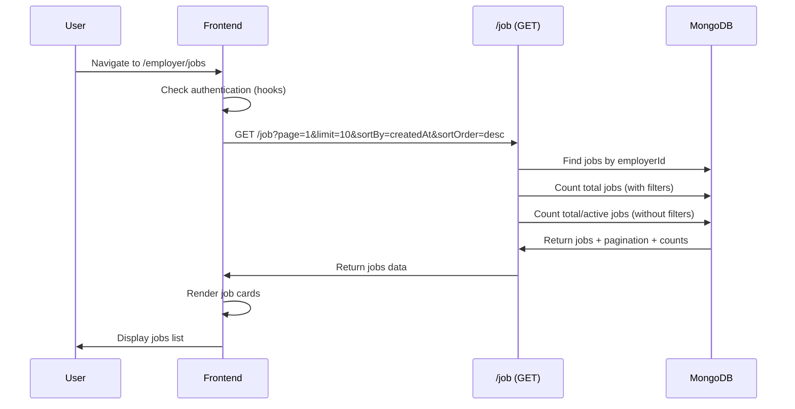
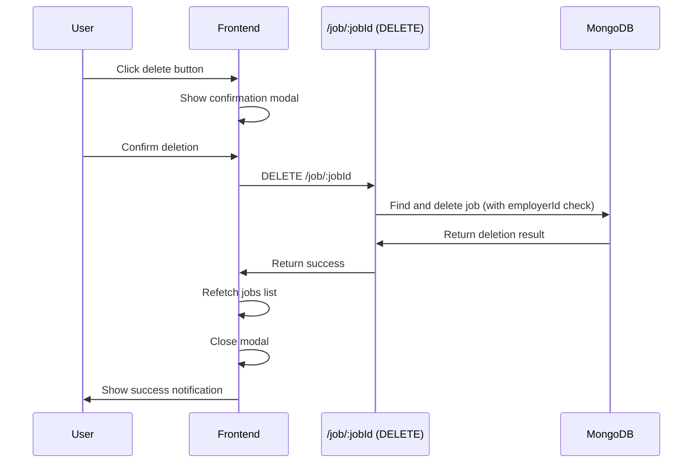
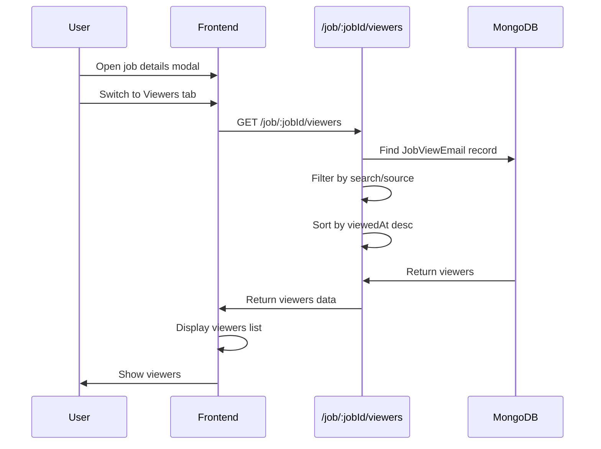

# Feature: Job Management

## Overview

**Purpose**: The Job Management feature allows employers to view, filter, sort, edit, delete, and manage all their job postings in one place. It provides comprehensive job management capabilities including viewing job details, tracking viewers, updating statuses, sharing jobs, and generating social share content.

**User Story**: As an employer, I want to manage all my job postings (view, filter, sort, edit, delete, update status) so that I can effectively track and maintain my job listings.

**Key Functionality**:
- View all job postings (paginated list)
- Search jobs (by title, company, location)
- Filter jobs (by status, job type, work mode)
- Sort jobs (by multiple fields, ascending/descending)
- View job details (modal with details and viewers tabs)
- Edit jobs (modal with full edit form)
- Delete jobs (with confirmation)
- Update job status (Draft, Active, Inactive, Closed)
- Share job link (copy to clipboard)
- Generate social share content (bulk and single job)
- Track job viewers (with search and source filtering)
- Download viewers as CSV
- View job statistics (applications count, views)
- Pagination for large job lists
- Empty states and loading states

**Access Level**: Authenticated (Employer only)

**URL Path**: `/employer/jobs`

**Authentication Required**: Yes (JWT token via `emp_token` cookie)

---

## User Flow

### Primary Flow - View Jobs List
1. User navigates to `/employer/jobs`
2. Authentication check (via hooks - redirects to sign-in if not authenticated)
3. **Data Loading**:
   - Fetch jobs list with default filters (page 1, limit 10, sorted by createdAt desc)
   - Fetch total jobs count (for header display)
4. **Page Display**:
   - Header with title, subtitle, job counts, and "Generate Social Share" button
   - Search and filters bar
   - Filters panel (collapsible)
   - Jobs grid (job cards)
   - Pagination (if multiple pages)

### Search Flow
1. User types in search input
2. Search query debounced (300ms delay)
3. When debounced query changes:
   - Current page reset to 1
   - API call made with new search query
   - Jobs list updated with filtered results

### Filter Flow
1. User clicks "Filters" button
2. Filters panel opens
3. User selects filter values (Status, Job Type, Work Mode)
4. Current page reset to 1
5. API call made with new filters
6. Jobs list updated
7. Active filter count badge shown on Filters button

### Sort Flow
1. User clicks "Sort" button
2. Sort dropdown opens
3. User selects sort field and order
4. Current page reset to 1
5. API call made with new sort parameters
6. Jobs list updated

### View Job Flow
1. User clicks on job card
2. View job modal opens with "Details" tab active
3. User can view all job information
4. User can switch to "Viewers" tab
5. Viewers list loads (if not already loaded)
6. User can search viewers or filter by source
7. User can download viewers as CSV

### Edit Job Flow
1. User clicks "Edit" button on job card
2. Edit job modal opens (side panel)
3. PostJobScreen component loaded in edit mode
4. Form pre-filled with job data
5. User makes changes
6. User clicks "Update Job" button
7. Job updated via API
8. Jobs list refetched
9. Modal closes

### Delete Job Flow
1. User clicks "Delete" button on job card
2. Delete confirmation modal opens
3. User confirms deletion
4. Job deleted via API
5. Jobs list refetched (job removed)
6. Modal closes

### Update Status Flow
1. User clicks "Status" button on job card
2. Update status modal opens
3. Current status selected by default
4. User selects new status
5. User clicks "Update Status" button
6. Job status updated via API
7. Jobs list refetched
8. Modal closes

### Share Job Flow
1. User clicks "Share" button on job card
2. Job URL copied to clipboard (using shortId)
3. Success toast notification shown

### Viewers Flow
1. User opens job details modal
2. User switches to "Viewers" tab
3. Viewers list fetched from API
4. User can search viewers by email
5. User can filter by source (All, Logged in, From prompt)
6. User can download viewers as CSV

---

## Frontend Implementation

### Screen Structure

**Main Page Component**:
- File: `frontend/src/app/employer/(screens)/jobs/page.jsx`
- Type: Server Component (wraps client component with Suspense)
- Wrapper: `JobsPageClient.jsx` (Client Component)

**Client Component**:
- File: `frontend/src/app/employer/(screens)/jobs/JobsPageClient.jsx`
- Type: Client Component
- Lines: ~1635 lines

**Styling**:
- CSS File: `frontend/src/app/employer/(screens)/jobs/page.css`
- CSS Modules: No
- Responsive: Yes

### Component Hierarchy

```
Page (page.jsx - Server Component)
  └── Suspense
      └── LoadingFallback
      └── MyJobsScreen (JobsPageClient.jsx - Client Component)
          ├── useEmployerJobs() - React Query hook (for filtered jobs)
          ├── useEmployerJobs() - React Query hook (for total count)
          ├── useDeleteJob() - React Query mutation
          ├── useUpdateJob() - React Query mutation
          ├── Header
          │   ├── Title and Subtitle
          │   ├── Job Counts (Total, Filtered)
          │   └── Generate Social Share Button
          ├── Search and Filters Bar
          │   ├── Search Input
          │   └── Actions (Filters Toggle, Sort Dropdown)
          ├── Filters Panel (conditional)
          │   ├── Status Filter (custom dropdown)
          │   ├── Job Type Filter (custom dropdown)
          │   ├── Work Mode Filter (custom dropdown)
          │   └── Clear Filters Button (conditional)
          ├── Error Message (conditional)
          ├── Loading State (conditional)
          ├── Empty State (conditional)
          ├── Jobs Grid
          │   └── Job Cards (map)
          │       ├── Job Card Header (title, status badge)
          │       ├── Job Card Body (info rows, skills)
          │       ├── Job Card Footer (stats, posted date)
          │       └── Job Card Actions (share, social share, applications, status, edit, delete)
          ├── Pagination (conditional)
          ├── View Job Modal (conditional)
          │   ├── Header (title, close button)
          │   ├── Tabs (Details, Viewers)
          │   ├── Details Tab
          │   │   ├── Job Info Grid
          │   │   ├── Job Description
          │   │   ├── Responsibilities
          │   │   ├── Requirements
          │   │   ├── Skills
          │   │   ├── Perks & Benefits
          │   │   └── Statistics (applications, views)
          │   └── Viewers Tab
          │       ├── Search Input
          │       ├── Source Filter
          │       ├── Download CSV Button
          │       └── Viewers List
          ├── Delete Confirmation Modal (conditional)
          ├── Edit Job Modal (conditional)
          │   └── PostJobScreen (in edit mode)
          ├── Update Status Modal (conditional)
          ├── Social Share Modal (conditional)
          ├── Bulk Social Share Progress Indicator (conditional)
          └── Single Job Social Share Modal (conditional)
```

### State Management

**React Query Hooks**:
```javascript
// Fetch jobs with filters
const { data: jobsData, isLoading, error, refetch } = useEmployerJobs(filters);

// Fetch total jobs count (without filters)
const { data: totalJobsData } = useEmployerJobs(totalJobsFilters);

// Delete job mutation
const deleteJobMutation = useDeleteJob();

// Update job mutation
const updateJobMutation = useUpdateJob();
```

**Filter and Pagination State**:
```javascript
const [searchQuery, setSearchQuery] = useState("");
const [debouncedSearch, setDebouncedSearch] = useState("");
const [statusFilter, setStatusFilter] = useState("");
const [jobTypeFilter, setJobTypeFilter] = useState("");
const [workModeFilter, setWorkModeFilter] = useState("");
const [sortBy, setSortBy] = useState("createdAt");
const [sortOrder, setSortOrder] = useState("desc");
const [currentPage, setCurrentPage] = useState(1);
```

**UI State**:
```javascript
const [showFilters, setShowFilters] = useState(false);
const [showSortDropdown, setShowSortDropdown] = useState(false);
const [showStatusFilter, setShowStatusFilter] = useState(false);
const [showJobTypeFilter, setShowJobTypeFilter] = useState(false);
const [showWorkModeFilter, setShowWorkModeFilter] = useState(false);
const [selectedJob, setSelectedJob] = useState(null);
const [showViewModal, setShowViewModal] = useState(false);
const [showDeleteModal, setShowDeleteModal] = useState(false);
const [showEditModal, setShowEditModal] = useState(false);
const [showStatusModal, setShowStatusModal] = useState(false);
const [jobToDelete, setJobToDelete] = useState(null);
const [jobToEdit, setJobToEdit] = useState(null);
const [jobToUpdateStatus, setJobToUpdateStatus] = useState(null);
const [selectedStatus, setSelectedStatus] = useState("");
const [showSocialShareModal, setShowSocialShareModal] = useState(false);
const [showSingleJobSocialShareModal, setShowSingleJobSocialShareModal] = useState(false);
const [selectedJobForSocialShare, setSelectedJobForSocialShare] = useState(null);
```

**Viewers State** (for view modal):
```javascript
const [activeViewTab, setActiveViewTab] = useState("details");
const [viewers, setViewers] = useState([]);
const [viewersLoading, setViewersLoading] = useState(false);
const [viewerSearch, setViewerSearch] = useState("");
const [viewerSource, setViewerSource] = useState("all");
const [viewerFilterOpen, setViewerFilterOpen] = useState(false);
const [downloadingViewers, setDownloadingViewers] = useState(false);
```

**Bulk Social Share State**:
```javascript
const [bulkProgress, setBulkProgress] = useState(0);
const [isBulkActive, setIsBulkActive] = useState(false);
const [isBulkCompleted, setIsBulkCompleted] = useState(false);
const [isBulkError, setIsBulkError] = useState(false);
const [bulkErrorMessage, setBulkErrorMessage] = useState("");
```

### Search Functionality

**Implementation**:
- Search input with search icon
- Real-time input tracking
- Debounced search (300ms delay)
- Searches in: jobTitle, companyName, location
- Resets current page to 1 on search
- Case-insensitive search

**Debounce Logic**:
```javascript
useEffect(() => {
    const timer = setTimeout(() => {
        setDebouncedSearch(searchQuery);
        setCurrentPage(1);
    }, 300);
    return () => clearTimeout(timer);
}, [searchQuery]);
```

### Filter Functionality

**Filters Available**:
1. **Status**: All, Draft, Active, Inactive, Closed
2. **Job Type**: All, Full-time, Part-time, Internship, Freelance, Contract, Temporary
3. **Work Mode**: All, Onsite, Hybrid, Remote

**Filter Implementation**:
- Collapsible filters panel
- Custom dropdowns for each filter
- Active filter count badge
- "Clear All Filters" button (shown when filters active)
- Filters combined with AND logic
- Resets current page to 1 when filter changes

**Active Filter Count**:
```javascript
const activeFiltersCount = [
    debouncedSearch,
    statusFilter,
    jobTypeFilter,
    workModeFilter,
].filter(Boolean).length;
```

### Sort Functionality

**Sort Options**:
- Posted Date (createdAt)
- Opening Date (applicationOpeningDate)
- Closing Date (applicationClosingDate)
- Job Title (jobTitle)
- Status (status)

**Sort Order**:
- Descending (default)
- Ascending

**Sort Implementation**:
- Custom dropdown with two sections (Sort By, Order)
- Selected option highlighted
- Check icon for selected option
- Resets current page to 1 when sort changes

### Job Cards

**Job Card Structure**:
- **Header**: Job title and status badge
- **Body**:
  - Company name
  - Location
  - Job type, work mode, number of openings
  - Salary range
  - Opening date
  - Closing date
  - Skills (first 5, with "& more" indicator if more exist)
- **Footer**:
  - Applications count
  - Views count
  - Posted date
- **Actions**:
  - Share button (copy link)
  - Social share button (with indicator if content exists)
  - Applications button (navigate to applications page)
  - Status button (update status)
  - Edit button (edit job)
  - Delete button (delete job)

**Status Badge**:
- Color-coded by status:
  - Active: Green
  - Draft: Gray/Orange
  - Inactive: Yellow
  - Closed: Red
- Icon indicator for each status

**Skill Display**:
- Shows first 5 skills as tags
- Shows "& more" tag if more than 5 skills
- Clickable (opens view modal)

### View Job Modal

**Modal Structure**:
- Header with title and close button
- Tabs: Details and Viewers
- Body (tab-specific content)
- Footer with Close and Edit buttons

**Details Tab**:
- Job title and status badge
- Information grid (12 fields):
  - Company Name
  - Job Type
  - Department
  - Employment Type
  - Location
  - Work Mode
  - Experience
  - Qualification
  - Number of Openings
  - Salary Range
  - Opening Date
  - Closing Date
  - Hiring Manager Email
- Job Description (if exists)
- Responsibilities (if exists)
- Requirements (if exists)
- Key Skills (if exists, displayed as chips)
- Perks & Benefits (if exists)
- Statistics cards:
  - Applications count
  - Views count

**Viewers Tab**:
- Search input (filters by email)
- Source filter dropdown (All, Logged in, From prompt)
- Download CSV button (if viewers exist)
- Viewers list:
  - Email address
  - Source badge (Logged in / From prompt)
  - Viewed at timestamp
- Loading state (while fetching)
- Empty state (no viewers)

**Viewer Data**:
- Email (required)
- Viewed At (date/time)
- isLogin (boolean: true if logged-in user, false if from email prompt)

**Download Viewers CSV**:
- CSV format with headers: Email, Viewed At
- File name: `job-viewers-{job-title-slug}.csv`
- Timestamps formatted: en-IN locale with date and time styles

### Edit Job Modal

**Modal Component**: `EditJobModal`

**Implementation**:
- Side panel modal (slides in from right)
- Full-screen on mobile, 90% width max 1000px on desktop
- Uses `PostJobScreen` component in edit mode
- Prevents body scroll when open
- Closes on backdrop click or close button

**Edit Job Screen Props**:
- `isEditMode={true}`
- `jobId={job._id}`
- `onClose`: Close callback
- `onSuccess`: Success callback (refetches jobs list)

### Delete Confirmation Modal

**Modal Structure**:
- Header with title and close button
- Body: Confirmation message with job title
- Footer: Cancel and Delete buttons

**Delete Process**:
1. User clicks delete button
2. Confirmation modal opens
3. User confirms deletion
4. API call made to delete job
5. Jobs list refetched
6. Modal closes
7. Success notification shown

### Update Status Modal

**Modal Structure**:
- Header with title and close button
- Body:
  - Job info preview (title, company name)
  - Status selection (radio-style options)
    - Draft
    - Active
    - Inactive
    - Closed
- Footer: Cancel and Update Status buttons

**Status Options**:
- Visual indicators (icons) for each status
- Current status pre-selected
- Update button disabled if same status selected

**Update Process**:
1. User clicks status button
2. Status modal opens with current status selected
3. User selects new status
4. User clicks "Update Status"
5. API call made to update status
6. Jobs list refetched
7. Modal closes
8. Success notification shown

### Share Job Functionality

**Implementation**:
- Uses job's `shortId` to generate URL
- Format: `${window.location.origin}/${shortId}`
- Copies to clipboard using `navigator.clipboard.writeText`
- Fallback: Creates temporary input element for older browsers
- Success toast notification shown

**Error Handling**:
- If shortId missing: Error toast shown
- If clipboard API fails: Fallback method used

### Social Share Functionality

**Bulk Social Share**:
- "Generate Social Share" button in header
- Opens `SocialShareModal`
- Generates social share content for multiple jobs
- Progress indicator shown during generation
- Polls for completion status

**Single Job Social Share**:
- Social share button on each job card
- Opens `SingleJobSocialShareModal`
- Generates social share content for single job
- Indicator shown if content already exists (check icon)

### Pagination

**Implementation**:
- Shown only if total pages > 1
- Displays: Page X of Y (Z total jobs)
- Previous button (disabled if first page or loading)
- Next button (disabled if last page or loading)
- Page changes trigger API call with new page number

**Pagination Data**:
- `currentPage`: Current page number
- `totalPages`: Total number of pages
- `totalJobs`: Total number of jobs (with current filters)
- `hasNextPage`: Boolean
- `hasPrevPage`: Boolean

### Empty States

**No Jobs** (no filters):
- Icon: Briefcase
- Title: "No jobs found"
- Message: "Start by posting your first job"
- Action button: "Post a Job" (navigates to `/employer/post-job`)

**No Jobs** (with filters):
- Icon: Briefcase
- Title: "No jobs found"
- Message: "Try adjusting your filters or search query"
- No action button

### API Integration

**Endpoints Called**:

| Endpoint | Method | Purpose | Authentication |
|----------|--------|---------|----------------|
| `/job` | GET | Fetch jobs list with filters | Bearer token |
| `/job/:jobId` | PUT | Update job (edit, status) | Bearer token |
| `/job/:jobId` | DELETE | Delete job | Bearer token |
| `/job/:jobId/viewers` | GET | Fetch job viewers | Bearer token |

**Environment Variables**:
- `NEXT_PUBLIC_JOB_URL`: Base URL for job API

**Fetch Jobs** (with filters):
```
GET /job?page=1&limit=10&search=&status=&jobType=&workMode=&sortBy=createdAt&sortOrder=desc
```

**Fetch Total Count** (without filters):
```
GET /job?page=1&limit=1&search=&status=&jobType=&workMode=&sortBy=createdAt&sortOrder=desc
```

**Update Job**:
```
PUT /job/:jobId
Body: { status: "Active" } // or full job data for edit
```

**Delete Job**:
```
DELETE /job/:jobId
```

**Get Viewers**:
```
GET /job/:jobId/viewers?q=&source=
```

### React Query Configuration

**useEmployerJobs Hook**:
- Query key: `['employer', 'jobs', 'list', { filters }]`
- Stale time: 2 minutes
- Cache time: 5 minutes
- Retries: 1 (except on 401)
- Auto-redirects on 401
- Updates job counts cache on success

**Cache Invalidation**:
- Jobs list invalidated on:
  - Job updated (edit or status change)
  - Job deleted
  - Job created (from Post Job page)

---

## Backend Implementation

### API Endpoints

#### Get Employer Jobs

**Route Definition**:
```javascript
router.get("/", verifyToken, jobController.getEmployerJobs);
```

**Full Endpoint Path**: `/job`

**HTTP Method**: GET

**Authentication Required**: Yes

**Query Parameters**:
- `page` (default: 1)
- `limit` (default: 10)
- `search` (optional, searches jobTitle, companyName, location)
- `status` (optional, enum: Draft, Active, Inactive, Closed)
- `jobType` (optional, enum: Full-time, Part-time, Internship, Freelance, Contract, Temporary)
- `workMode` (optional, enum: Onsite, Hybrid, Remote)
- `sortBy` (default: "createdAt", enum: createdAt, applicationOpeningDate, applicationClosingDate, jobTitle, status)
- `sortOrder` (default: "desc", enum: asc, desc)

**Response Format**:
```json
{
  "success": true,
  "data": [
    {
      "_id": "...",
      "jobTitle": "...",
      "companyName": "...",
      "status": "Active",
      // ... full job object
    }
  ],
  "pagination": {
    "currentPage": 1,
    "totalPages": 5,
    "totalJobs": 50,
    "limit": 10,
    "hasNextPage": true,
    "hasPrevPage": false
  },
  "counts": {
    "totalJobs": 50,
    "activeJobs": 30
  }
}
```

**Controller Logic** (`getEmployerJobs`):
1. Extract query parameters
2. Build query filter:
   - Always filter by `employerId: req.userId`
   - Add search filter (jobTitle, companyName, location) if provided
   - Add status filter if provided
   - Add jobType filter if provided
   - Add workMode filter if provided
3. Build sort object (validate sort field, apply sort order)
4. Calculate pagination (skip, limit)
5. Execute query with pagination
6. Get total count (with filters applied) for pagination
7. Get counts for all employer jobs (without filters) for dashboard stats:
   - Total jobs count
   - Active jobs count
8. Return paginated results with counts

#### Update Job

**Route Definition**:
```javascript
router.put("/:jobId", verifyToken, jobController.updateJob);
```

**Full Endpoint Path**: `/job/:jobId`

**HTTP Method**: PUT

**Authentication Required**: Yes

**Request Body**: Partial job data (all fields optional)

**Response Format**:
```json
{
  "success": true,
  "message": "Job updated successfully",
  "data": {
    // Updated job object
  }
}
```

**Controller Logic** (`updateJob`):
1. Validate dates if provided (opening date, closing date)
2. Validate salary range if both provided
3. Validate email if provided
4. Trim string fields
5. Parse skills input
6. Parse boolean fields (requiresBasicTest, requiresVideoProctoredTest)
7. Generate shortId if job doesn't have one
8. Find and update job (with employerId check for authorization)
9. Return updated job

#### Delete Job

**Route Definition**:
```javascript
router.delete("/:jobId", verifyToken, jobController.deleteJob);
```

**Full Endpoint Path**: `/job/:jobId`

**HTTP Method**: DELETE

**Authentication Required**: Yes

**Response Format**:
```json
{
  "success": true,
  "message": "Job deleted successfully"
}
```

**Controller Logic** (`deleteJob`):
1. Find and delete job (with employerId check for authorization)
2. Return success message
3. If job not found or not owned by employer: Return 404

#### Get Job Viewers

**Route Definition**:
```javascript
router.get("/:jobId/viewers", verifyToken, jobController.getJobViewers);
```

**Full Endpoint Path**: `/job/:jobId/viewers`

**HTTP Method**: GET

**Authentication Required**: Yes

**Query Parameters**:
- `q` (optional, search by email)
- `source` (optional, filter by source: "login" or "prompt")

**Response Format**:
```json
{
  "success": true,
  "data": [
    {
      "email": "user@example.com",
      "viewedAt": "2024-01-01T12:00:00Z",
      "isLogin": true
    }
  ],
  "total": 10
}
```

**Controller Logic** (`getJobViewers`):
1. Validate jobId
2. Find job and verify ownership (authorization check)
3. Find JobViewEmail record for job
4. Get views array
5. Filter by search query (email) if provided
6. Filter by source (login/prompt) if provided
7. Sort by viewedAt (descending)
8. Return filtered and sorted viewers

### Database Models

**Job Model** (`backend/src/models/job.js`):
- See Job Management Feature #15 documentation for full schema
- Key fields used: `_id`, `employerId`, `status`, `jobType`, `workMode`, `jobTitle`, `companyName`, `location`, `shortId`, `views`, `applicationsCount`, etc.

**JobViewEmail Model** (`backend/src/models/jobViewEmail.js`):

**Schema**:
```javascript
{
    job: ObjectId (ref: Job, required, unique),
    views: [
        {
            email: String (required, lowercase, trim),
            viewedAt: Date (default: Date.now),
            isLogin: Boolean (default: false)
        }
    ],
    createdAt: Date,
    updatedAt: Date
}
```

**Indexes**:
- `{ job: 1, "views.email": 1 }` (unique, sparse) - Prevents duplicate emails per job

### Middleware Chain

**Authentication Middleware**:
- `verifyToken`: Validates JWT token, attaches userId
- On failure: Returns 401 Unauthorized

---

## Data Flow

### Fetch Jobs Flow



### Delete Job Flow



### View Viewers Flow



---

## Error Handling

### Frontend Error Handling

**Authentication Errors**:
- 401 responses: Auto-redirect to `/signin/employer` (handled by hooks)
- Token removed from cookies

**Network Errors**:
- React Query retries once (except on 401)
- Error message shown in error banner
- User can retry by refetching

**Delete Errors**:
- Error logged to console
- Modal remains open (user can retry)

**Update Errors**:
- Error logged to console
- Modal remains open (user can retry)

**Viewers Errors**:
- Error logged to console
- Empty list shown

**Share Errors**:
- Error toast shown
- Fallback method attempted (if clipboard API fails)

### Backend Error Handling

**Authentication Errors**:
- Missing/invalid token: 401 Unauthorized

**Authorization Errors**:
- Job not found or not owned by employer: 404 Not Found (delete, update)
- Job not owned by employer: 403 Forbidden (viewers)

**Validation Errors**:
- Invalid date format: 400 Bad Request
- Invalid date ranges: 400 Bad Request
- Invalid salary ranges: 400 Bad Request
- Invalid email: 400 Bad Request
- Invalid jobId: 400 Bad Request

**Database Errors**:
- Connection errors: 500 Internal Server Error
- Query errors: 500 Internal Server Error
- Logged to console

**Status Codes**:
- 200: Success
- 400: Bad Request (validation errors)
- 401: Unauthorized (authentication required)
- 403: Forbidden (authorization failed)
- 404: Not Found (job not found)
- 500: Internal Server Error

---

## Security Features

### Authentication
- JWT token required for all endpoints
- Token validated via middleware
- Employer can only access their own jobs

### Authorization
- `req.userId` from token used for all operations
- Jobs filtered by `employerId: req.userId`
- Delete/update operations check ownership
- Viewers endpoint checks ownership

### Data Protection
- Sensitive data validated and sanitized
- XSS protection via React's built-in escaping
- CSRF protection via same-origin policy and token validation
- Email addresses lowercased in viewers

---

## UI/UX Details

### Layout Structure

**Page Sections** (in order):
1. Header (title, subtitle, counts, action button)
2. Search and filters bar
3. Filters panel (collapsible)
4. Error message (conditional)
5. Loading state (conditional)
6. Empty state (conditional)
7. Jobs grid
8. Pagination (conditional)
9. Modals (conditional, overlays)

### Visual Design

**Job Cards**:
- Card-based layout with hover effects
- Clear information hierarchy
- Status badges with color coding
- Skill tags for easy scanning
- Statistics displayed prominently
- Action buttons clearly visible

**Modals**:
- Overlay background (semi-transparent)
- Centered or side-panel layout
- Clear header with close button
- Scrollable body
- Footer with action buttons

**Status Badges**:
- Color-coded (Active: green, Draft: gray/orange, Inactive: yellow, Closed: red)
- Icon indicators
- Clear text labels

**Filters**:
- Collapsible panel
- Custom dropdowns
- Active filter count badge
- Clear all button

**Pagination**:
- Previous/Next buttons
- Page information
- Disabled states for first/last page

### Responsive Design

**Desktop**:
- Multi-column grid for job cards
- Side-panel modals
- Full-width filters panel
- Spacious padding and margins

**Tablet**:
- Adjusted grid columns
- Maintained spacing
- Responsive modals

**Mobile**:
- Single-column layout
- Full-width job cards
- Full-screen modals
- Touch-friendly targets
- Optimized spacing
- Mobile-optimized dropdowns (fixed positioning)

### Accessibility

**Keyboard Navigation**:
- Tab order logical
- All interactive elements keyboard accessible
- Modal focus trap
- Escape key closes modals

**Screen Reader Support**:
- Semantic HTML elements
- ARIA labels where needed
- Button states announced
- Modal roles and labels

**Visual Indicators**:
- Clear status colors
- Loading indicators
- Error states
- Success states
- Disabled states
- Focus states

---

## Testing Considerations

### Test Scenarios

**Happy Path**:
1. View jobs list → Jobs displayed correctly → Pagination works
2. Search jobs → Results filtered → Search works correctly
3. Filter jobs → Results filtered → Filters work correctly
4. Sort jobs → Results sorted → Sort works correctly
5. View job details → Modal opens → All information displayed
6. Edit job → Modal opens → Form pre-filled → Job updated → List refreshed
7. Delete job → Confirmation shown → Job deleted → List refreshed
8. Update status → Modal opens → Status updated → List refreshed

**Viewers**:
1. Open viewers tab → Viewers loaded → List displayed
2. Search viewers → Results filtered → Search works
3. Filter by source → Results filtered → Filter works
4. Download CSV → CSV file downloaded → Format correct

**Edge Cases**:
1. No jobs → Empty state shown → Post job button works
2. No jobs with filters → Empty state shown → Clear filters works
3. Network error → Error message shown → Can retry
4. Session expired → Redirect to sign-in
5. Large job list → Pagination works → Navigation works
6. Rapid filter changes → Only latest request processed
7. Delete last job on page → Previous page shown
8. Viewers with no data → Empty state shown

**Pagination**:
1. Multiple pages → Pagination shown → Navigation works
2. First page → Previous disabled → Next enabled
3. Last page → Next disabled → Previous enabled
4. Page change → Jobs refreshed → Correct page shown

---

## Related Features

- **Post Job** (`/employer/post-job`): Creates new jobs
- **Employer Applications** (`/employer/applications`): View applications for jobs
- **Employer Home Dashboard** (`/employer/home`): Shows job statistics
- **Social Share** (`/employer/jobs`): Generate social share content

---

## Additional Notes

**Dependencies**:
- `@tanstack/react-query`: Data fetching and caching
- `axios`: HTTP client
- `js-cookie`: Cookie management
- `@mui/material`: Loading spinner
- `react-icons/fa`: Icon library
- `react-icons/hi2`: Dropdown icons
- `react-hot-toast`: Toast notifications
- `next/navigation`: Routing

**Performance Optimizations**:
- Debounced search (300ms)
- React Query caching (reduces API calls)
- Pagination (limits data fetched)
- Separate query for total count (minimal data)
- Optimistic cache updates on mutations

**Known Limitations**:
- Viewers list not paginated (could be slow for jobs with many viewers)
- No bulk operations (delete, status update for multiple jobs)
- No job export functionality
- No advanced filtering (date ranges, salary ranges)
- No job analytics dashboard

**Future Enhancements**:
- Bulk operations (delete, status update)
- Advanced filters (date ranges, salary ranges)
- Job export (CSV, Excel)
- Job analytics dashboard
- Job performance metrics
- Viewers analytics
- Job templates
- Job duplication
- Scheduled status changes
- Job expiry alerts
- Application statistics per job
- Job performance comparison

---

## Code References

### Frontend Files
- `frontend/src/app/employer/(screens)/jobs/page.jsx` - Server component wrapper (~29 lines)
- `frontend/src/app/employer/(screens)/jobs/JobsPageClient.jsx` - Main client component (~1635 lines)
- `frontend/src/app/employer/(screens)/jobs/page.css` - Styling
- `frontend/src/hooks/useEmployerJobs.js` - Jobs hooks
- `frontend/src/components/editJobModal/EditJobModal.jsx` - Edit modal component (~105 lines)
- `frontend/src/components/socialShareModal/SocialShareModal.jsx` - Social share modal
- `frontend/src/components/singleJobSocialShareModal/SingleJobSocialShareModal.jsx` - Single job social share modal
- `frontend/src/components/bulkSocialShareProgressIndicator/BulkSocialShareProgressIndicator.jsx` - Progress indicator

### Backend Files
- `backend/src/routes/jobRoutes.js` - Route definitions:
  - Line 22: GET `/` (get employer jobs)
  - Line 24: GET `/:jobId/viewers` (get viewers)
  - Line 25: PUT `/:jobId` (update job)
  - Line 26: DELETE `/:jobId` (delete job)
- `backend/src/controllers/jobController.js` - Controller functions:
  - `getEmployerJobs` (lines 247-337)
  - `updateJob` (lines 370-477)
  - `deleteJob` (lines 704-732)
  - `getJobViewers` (lines 571-629)
- `backend/src/models/job.js` - Job model schema
- `backend/src/models/jobViewEmail.js` - JobViewEmail model schema

---

*Last Updated: [Current Date]*
*Documented By: TSD Documentation System*

