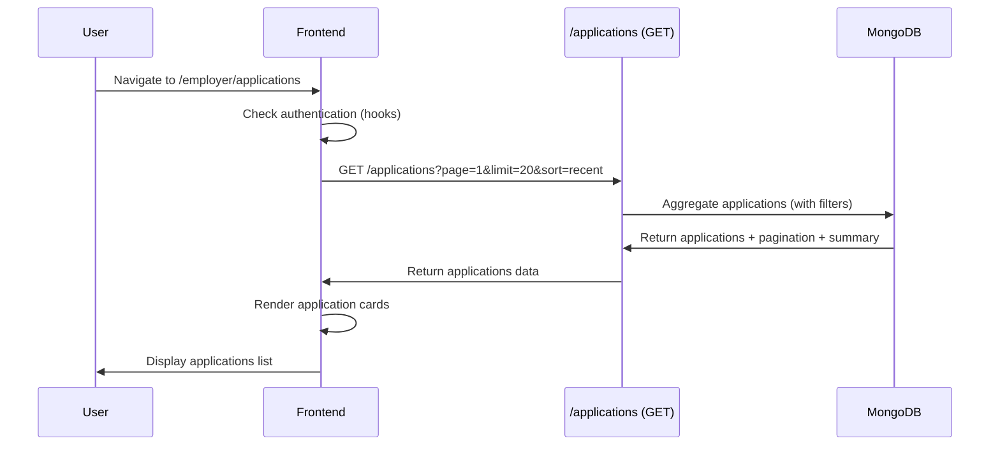
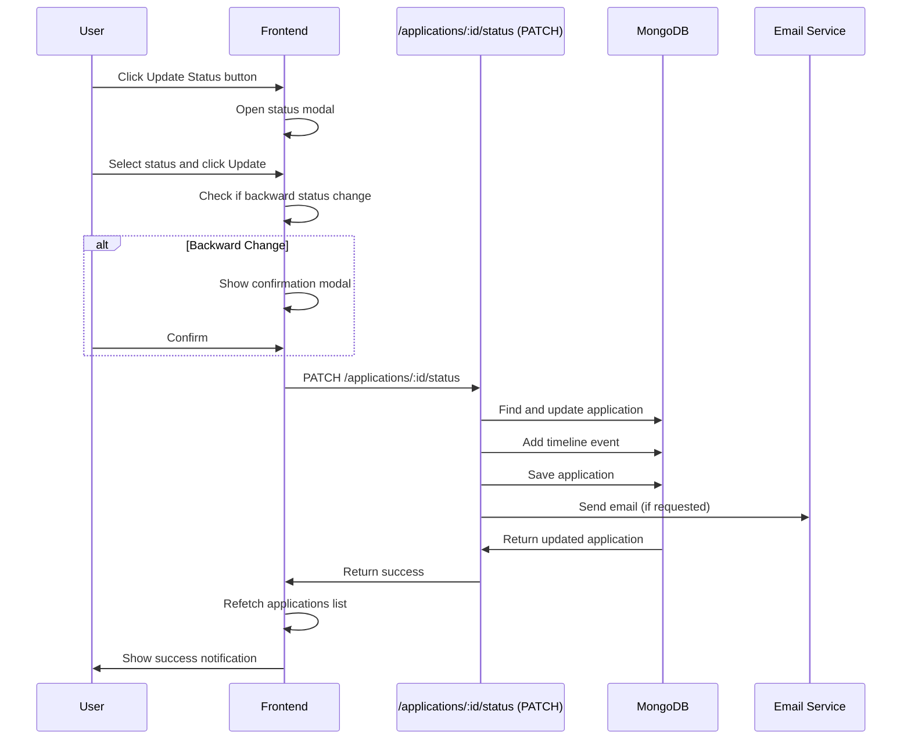
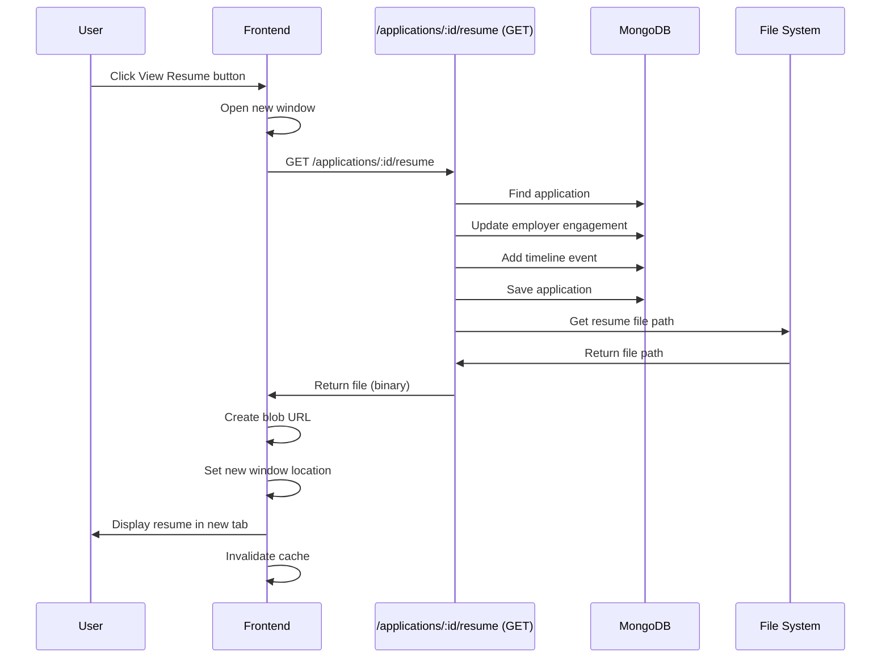

# Feature: Application Management

## Overview

**Purpose**: The Application Management feature allows employers to view, filter, sort, and manage all job applications they receive. It provides comprehensive application management capabilities including viewing candidate details, updating application statuses, viewing resumes, reviewing test assessments, and tracking application progress.

**User Story**: As an employer, I want to manage all job applications (view, filter, sort, update status, view resume, review tests) so that I can effectively evaluate candidates and make hiring decisions.

**Key Functionality**:
- View all job applications (paginated list)
- Search applications (by candidate name, email, job title, company, location)
- Filter applications (by status, submission type, job)
- Sort applications (by recency, name, status)
- View application details (job and candidate information)
- Update application status (Pending, Reviewed, Shortlisted, Rejected)
- View candidate resume (opens in new tab)
- View test summary (basic and video proctoring assessments)
- Track application timeline
- Email notifications for status updates
- Multi-select job filtering with search
- Status change confirmation (for backward status changes)
- Application statistics (total applications, status breakdown)
- Pagination for large application lists
- Empty states and loading states

**Access Level**: Authenticated (Employer only)

**URL Path**: `/employer/applications` (with optional `?jobId=xxx` query parameter)

**Authentication Required**: Yes (JWT token via `emp_token` cookie)

---

## User Flow

### Primary Flow - View Applications List
1. User navigates to `/employer/applications` (or with `?jobId=xxx`)
2. Authentication check (via hooks - redirects if not authenticated)
3. **Data Loading**:
   - Fetch applications list with default filters (page 1, limit 20, sorted by recent)
   - If `jobId` in URL, filter by that job
4. **Page Display**:
   - Header with title, subtitle, and total applications count
   - Search bar
   - Filter controls (Status, Submission Type, Job)
   - Sort dropdown
   - Applications list (application cards)
   - Pagination (if multiple pages)

### Search Flow
1. User types in search input
2. Search query debounced (500ms delay)
3. When debounced query changes:
   - Current page reset to 1
   - API call made with new search query
   - Applications list updated with filtered results
   - Searches in: candidate name, candidate email, job title, company name, location

### Filter Flow
1. User clicks filter dropdown (Status, Submission Type, or Job)
2. Filter dropdown opens
3. User selects filter value
4. Current page reset to 1
5. API call made with new filter
6. Applications list updated
7. Active filter count badge shown on Filters button

### Job Filter Flow
1. User clicks "Job" filter
2. Job filter drawer opens (side panel)
3. User can search jobs (debounced 500ms)
4. User can select multiple jobs (checkboxes)
5. User clicks "Apply" button
6. Job filter applied
7. Drawer closes
8. Applications list refreshed with selected jobs

### Update Status Flow
1. User clicks "Update Status" button on application card
2. Status update modal opens
3. Current status displayed
4. User selects new status
5. Option to send email notification (checkbox, default: checked)
6. User clicks "Update Status" button
7. If backward status change:
   - Confirmation modal shown
   - User confirms or cancels
8. Status updated via API
9. Email notification sent (if requested)
10. Timeline event added
11. Applications list refetched
12. Modal closes
13. Success notification shown

### View Resume Flow
1. User clicks "View Resume" button on application card
2. New browser tab/window opens
3. Resume fetched via API with authentication
4. Resume displayed in new tab (PDF/DOC/DOCX)
5. Employer engagement tracked (viewedAt, resume_viewed timeline event)
6. Applications list cache invalidated (to show timeline update)

### View Test Summary Flow
1. User clicks "View Summary" button on application card
2. Test summary modal opens
3. Loading state shown
4. Test summary data fetched via API
5. Summary displayed:
   - Candidate and job information
   - Basic test results (if available): score, readiness review, attempt history
   - Video test results (if available): score, AI summary, video recording link
6. User can close modal

---

## Frontend Implementation

### Screen Structure

**Main Page Component**:
- File: `frontend/src/app/employer/(screens)/applications/page.jsx`
- Type: Server Component (wraps client component with Suspense)
- Wrapper: `ApplicationsPageClient.jsx` (Client Component)

**Client Component**:
- File: `frontend/src/app/employer/(screens)/applications/ApplicationsPageClient.jsx`
- Type: Client Component
- Lines: ~1615 lines

**Styling**:
- CSS File: `frontend/src/app/employer/(screens)/applications/page.css`
- CSS Modules: No
- Responsive: Yes

### Component Hierarchy

```
Page (page.jsx - Server Component)
  └── Suspense
      └── LoadingFallback
      └── ApplicationsPageClient (Client Component)
          ├── useEmployerApplications() - React Query hook
          ├── useEmployerJobs() - React Query hook (for job filter)
          ├── useMutation() - Status update mutation
          ├── Header
          │   ├── Title and Subtitle
          │   └── Total Applications Summary Card
          ├── Search and Actions Bar
          │   ├── Search Input
          │   ├── Filters (Desktop)
          │   ├── Filter Button (Mobile)
          │   └── Sort Dropdown
          ├── Mobile Filter Drawer (conditional)
          │   └── Filter Controls
          ├── Applications List
          │   └── Application Cards (map)
          │       ├── Job Section
          │       │   ├── Job Title and Company
          │       │   ├── Status Badge
          │       │   └── Job Meta (location, type, work mode)
          │       ├── Candidate Section
          │       │   ├── Candidate Avatar and Info
          │       │   ├── Candidate Details (email, experience, qualification)
          │       │   ├── Skills List
          │       │   ├── Applied Date and Submission Type
          │       │   └── Action Buttons
          │       │       ├── Update Status
          │       │       ├── View Summary (conditional)
          │       │       └── View Resume (conditional)
          ├── Pagination (conditional)
          ├── Status Update Modal (conditional)
          │   ├── Candidate and Job Info
          │   ├── Status Options
          │   ├── Email Notification Checkbox
          │   └── Action Buttons
          ├── Close Confirmation Modal (conditional)
          ├── Backward Status Confirmation Modal (conditional)
          ├── Job Filter Drawer (conditional)
          │   ├── Job Search
          │   ├── Jobs List (with checkboxes)
          │   ├── Pagination (if multiple pages)
          │   └── Action Buttons (Discard, Apply)
          └── Test Summary Modal (conditional)
              ├── Candidate Info
              ├── Job Info
              ├── Basic Test Section (conditional)
              │   ├── Score Card
              │   ├── Readiness Review
              │   ├── Readiness Responses
              │   └── Attempt History
              ├── Video Test Section (conditional)
              │   ├── Score Card
              │   ├── AI Summary
              │   └── Video Recording Link
              └── Close Button
```

### State Management

**React Query Hooks**:
```javascript
// Fetch applications with filters
const { data, isLoading, isFetching, error } = useEmployerApplications(queryFilters);

// Fetch jobs for job filter drawer
const { data: jobsData, isLoading: isLoadingJobs } = useEmployerJobs({
    page: jobFilterPage,
    limit: 10,
    search: debouncedJobSearch,
    status: "Active"
});

// Update status mutation
const updateStatusMutation = useMutation({
    mutationFn: async ({ applicationId, status, sendEmail }) => {
        // API call to update status
    },
    onSuccess: () => {
        // Invalidate queries and show success
    }
});
```

**Filter and Pagination State**:
```javascript
const [searchQuery, setSearchQuery] = useState("");
const [debouncedSearch, setDebouncedSearch] = useState("");
const [filters, setFilters] = useState({
    status: "",
    submissionType: "",
    jobIds: jobIdFromUrl ? [jobIdFromUrl] : [],
    sort: "recent"
});
const [currentPage, setCurrentPage] = useState(1);
```

**UI State**:
```javascript
const [showMobileFilters, setShowMobileFilters] = useState(false);
const [showSortDropdown, setShowSortDropdown] = useState(false);
const [openDropdownId, setOpenDropdownId] = useState(null);
const [showJobFilterDrawer, setShowJobFilterDrawer] = useState(false);
const [showStatusModal, setShowStatusModal] = useState(false);
const [showTestSummaryModal, setShowTestSummaryModal] = useState(false);
const [showCloseConfirmation, setShowCloseConfirmation] = useState(false);
const [showBackwardStatusConfirmation, setShowBackwardStatusConfirmation] = useState(false);
```

**Status Update State**:
```javascript
const [selectedApplication, setSelectedApplication] = useState(null);
const [selectedStatus, setSelectedStatus] = useState("");
const [sendEmailNotification, setSendEmailNotification] = useState(true);
const [pendingStatusUpdate, setPendingStatusUpdate] = useState(null);
```

**Job Filter State**:
```javascript
const [jobSearchQuery, setJobSearchQuery] = useState("");
const [debouncedJobSearch, setDebouncedJobSearch] = useState("");
const [jobFilterPage, setJobFilterPage] = useState(1);
const [selectedJobIds, setSelectedJobIds] = useState([]);
```

**Test Summary State**:
```javascript
const [testSummaryData, setTestSummaryData] = useState(null);
const [testSummaryLoading, setTestSummaryLoading] = useState(false);
```

### Search Functionality

**Implementation**:
- Search input with search icon
- Real-time input tracking
- Debounced search (500ms delay)
- Searches in: candidate name, candidate email, job title, company name, location
- Resets current page to 1 on search
- Case-insensitive search

**Debounce Logic**:
```javascript
useEffect(() => {
    const timer = setTimeout(() => {
        setDebouncedSearch(searchQuery);
        setCurrentPage(1);
    }, 500);
    return () => clearTimeout(timer);
}, [searchQuery]);
```

### Filter Functionality

**Filters Available**:
1. **Status**: All, Pending, Reviewed, Shortlisted, Rejected
2. **Submission Type**: All, Direct Application, Basic Test, Video Test, Basic + Video Test
3. **Job**: All, or multiple jobs selected from drawer

**Filter Implementation**:
- Custom dropdowns for Status and Submission Type
- Job filter opens a drawer (side panel) with multi-select
- Active filter count badge shown on Filters button (mobile)
- "Clear Filters" button (shown when filters active)
- Filters combined with AND logic
- Resets current page to 1 when filter changes

**Active Filter Count**:
```javascript
const activeFiltersCount = [
    filters.status, 
    filters.submissionType, 
    ...(filters.jobIds && filters.jobIds.length > 0 ? filters.jobIds : [])
].filter(Boolean).length;
```

**Job Filter Drawer**:
- Side panel that opens from right
- Job search input (debounced 500ms)
- Jobs list with checkboxes (multi-select)
- Pagination for jobs (10 per page)
- "Discard" button (closes without applying)
- "Apply" button (applies selected jobs and closes)

### Sort Functionality

**Sort Options**:
- Most Recent (default)
- Oldest First
- Name (A-Z)
- Status

**Sort Implementation**:
- Custom dropdown
- Selected option highlighted
- Resets current page to 1 when sort changes

### Application Cards

**Card Structure**:
- **Job Section** (top):
  - Job title and company name
  - Status badge (color-coded)
  - Job meta: location, job type, work mode
- **Candidate Section** (main):
  - Candidate avatar (initial) and name
  - Candidate details:
    - Email
    - Experience (years)
    - Qualification
  - Skills list (first 5, with "& X more" indicator if more exist)
  - Footer:
    - Applied date (relative time)
    - Submission type badge
    - Action buttons:
      - Update Status
      - View Summary (if has test)
      - View Resume (if resume available)

**Status Badge**:
- Color-coded by status:
  - Pending: Orange/Yellow
  - Reviewed: Blue
  - Shortlisted: Green
  - Rejected: Red

**Skills Display**:
- Shows first 5 skills as tags
- Shows "& X more" tag if more than 5 skills
- Skills from candidate profile or profile snapshot

### Status Update Modal

**Modal Structure**:
- Header with title and close button
- Body:
  - Candidate and job information display
  - Current status badge
  - Status selection grid (4 options):
    - Pending Review (orange)
    - Reviewed (blue)
    - Shortlisted (green)
    - Rejected (red)
  - Email notification checkbox (default: checked)
- Footer:
  - Cancel button
  - Update Status button (disabled if same status or no status selected)

**Status Selection**:
- Visual indicators (colored borders and backgrounds)
- Current status pre-selected
- Selected status highlighted
- Update button disabled if same status selected

**Backward Status Change Detection**:
- Status hierarchy: pending (1) → reviewed (2) → shortlisted (3)
- Rejected is a final state (can happen from any state)
- Moving to earlier status triggers confirmation modal
- Confirmation modal asks user to confirm backward movement

**Update Process**:
1. User selects new status
2. System checks if backward change
3. If backward: Confirmation modal shown
4. If forward or rejected: Update proceeds directly
5. API call made with status and email flag
6. Timeline event added
7. Email sent (if requested)
8. Applications list refetched
9. Modal closes
10. Success notification shown

### View Resume Functionality

**Implementation**:
- Opens resume in new browser tab/window
- Fetches resume via API with authentication token
- Supports PDF, DOC, DOCX formats
- Uses blob response type
- Creates object URL for blob
- Sets new window location to blob URL

**Tracking**:
- Updates `employerEngagement.viewedAt`
- Sets `employerEngagement.lastAction` to 'resume_viewed'
- Adds timeline event (if not already added):
  - Type: 'resume_viewed'
  - Label: 'Resume Viewed'
  - Description: 'Employer viewed your resume'
  - Source: 'employer'
- Invalidates applications cache to show timeline update

**Error Handling**:
- 401 errors: Removes token, shows error, redirects to sign-in
- Other errors: Shows error toast, closes new window

### Test Summary Modal

**Modal Structure**:
- Header with title and close button
- Body (scrollable):
  - Candidate information (avatar, name, email, experience, qualification)
  - Job information (title, company)
  - Basic Test Section (if available):
    - Section header with "Passed" badge
    - Score card (donut chart with score out of 100)
    - Score details (correct/incorrect answers)
    - Readiness Review:
      - Summary
      - Fit Verdict
      - Highlights (bulleted list)
      - Concerns (bulleted list)
      - Recommendations (bulleted list)
    - Readiness Responses (question-answer pairs)
    - Attempt History (bar chart showing all attempts with scores)
  - Video Test Section (if available):
    - Section header with "Passed"/"Failed" badge
    - Score card (donut chart with score out of 100)
    - Score details (correct/incorrect/unanswered)
    - AI Summary:
      - Summary text
      - Highlights (bulleted list)
      - Concerns (bulleted list)
      - Risk Score (if available)
    - Video Recording link (opens in new tab)
- Footer: Close button

**Loading State**:
- Shows loading spinner while fetching
- Displays "Loading test summary..." message

**Empty State**:
- Shows "No test summary available" if no data

### Pagination

**Implementation**:
- Shown only if total pages > 1
- Displays: Page X of Y
- Previous button (disabled if first page or loading)
- Next button (disabled if last page or loading)
- Page changes trigger API call with new page number

**Pagination Data**:
- `currentPage`: Current page number
- `totalPages`: Total number of pages
- `totalRecords`: Total number of applications (with current filters)
- `hasNextPage`: Boolean
- `hasPrevPage`: Boolean

### Empty States

**No Applications**:
- Icon: User icon
- Title: "No applications found"
- Message: "Applications will appear here when candidates apply to your jobs"

### API Integration

**Endpoints Called**:

| Endpoint | Method | Purpose | Authentication |
|----------|--------|---------|----------------|
| `/applications` | GET | Fetch applications list with filters | Bearer token |
| `/applications/:applicationId/status` | PATCH | Update application status | Bearer token |
| `/applications/:applicationId/resume` | GET | View candidate resume | Bearer token |
| `/applications/:applicationId/test-summary` | GET | Get test assessment summary | Bearer token |

**Environment Variables**:
- `NEXT_PUBLIC_EMPLOYER_URL`: Base URL for employer API

**Fetch Applications** (with filters):
```
GET /applications?page=1&limit=20&search=&status=&submissionType=&jobIds=&sort=recent
```

**Update Status**:
```
PATCH /applications/:applicationId/status
Body: { status: "shortlisted", sendEmail: true }
```

**View Resume**:
```
GET /applications/:applicationId/resume
Response: Binary file (PDF/DOC/DOCX)
```

**Get Test Summary**:
```
GET /applications/:applicationId/test-summary
```

### React Query Configuration

**useEmployerApplications Hook**:
- Query key: `['employer', 'applications', 'list', { filters }]`
- Stale time: 2 minutes
- Cache time: 5 minutes
- Refetch on mount: false
- Refetch on window focus: false
- Retries: 1 (except on 401)
- Auto-redirects on 401
- Enabled only when token exists

**Cache Invalidation**:
- Applications list invalidated on:
  - Status updated
  - Resume viewed (to show timeline update)

---

## Backend Implementation

### API Endpoints

#### Get Employer Applications

**Route Definition**:
```javascript
router.get("/applications", verifyToken, employerController.getEmployerApplications);
```

**Full Endpoint Path**: `/applications`

**HTTP Method**: GET

**Authentication Required**: Yes

**Query Parameters**:
- `page` (default: 1)
- `limit` (default: 20, max: 50)
- `search` (optional, searches candidate name, email, job title, company, location)
- `status` (optional, enum: pending, reviewed, shortlisted, rejected)
- `submissionType` (optional, enum: direct, basic-test, video-test, basic+video)
- `jobId` (optional, single job ID - backward compatibility)
- `jobIds` (optional, comma-separated job IDs - multiple jobs)
- `sort` (default: "recent", enum: recent, oldest, name_az, status)

**Response Format**:
```json
{
  "success": true,
  "data": [
    {
      "applicationId": "...",
      "jobId": "...",
      "jobTitle": "...",
      "companyName": "...",
      "location": "...",
      "workMode": "...",
      "jobType": "...",
      "shortId": "...",
      "candidateId": "...",
      "candidateName": "...",
      "candidateEmail": "...",
      "candidateInitial": "A",
      "candidateExperience": 5,
      "candidateQualification": "...",
      "candidateSkills": ["..."],
      "candidateResume": "...",
      "status": "pending",
      "submissionType": "direct",
      "hasBasicTest": false,
      "hasVideoTest": false,
      "basicAssessmentId": null,
      "videoAssessmentId": null,
      "appliedAt": "2024-01-01T12:00:00Z",
      "latestUpdateAt": "2024-01-01T12:00:00Z",
      "statusTimeline": [...],
      "employerEngagement": {
        "viewedAt": null,
        "resumeDownloadedAt": null,
        "lastAction": null
      }
    }
  ],
  "pagination": {
    "currentPage": 1,
    "totalPages": 5,
    "totalRecords": 100,
    "limit": 20,
    "hasNextPage": true,
    "hasPrevPage": false
  },
  "summary": {
    "totalApplications": 100,
    "statusBreakdown": [
      { "status": "pending", "count": 50 },
      { "status": "reviewed", "count": 30 },
      { "status": "shortlisted", "count": 15 },
      { "status": "rejected", "count": 5 }
    ]
  }
}
```

**Controller Logic** (`getEmployerApplications`):
1. Extract query parameters
2. Build applicant match filter (status, submissionType)
3. Build job match filter (employerId, jobIds/jobId if provided)
4. Build search filter (for job and candidate fields)
5. Build aggregation pipeline:
   - Match applications by employer
   - Unwind applicants array
   - Match applicants by status/submissionType
   - Lookup job data
   - Unwind job data
   - Match jobs by employerId and jobIds
   - Lookup candidate data (jobseekers)
   - Unwind candidate data (preserve nulls)
   - Match candidates by search (if provided)
   - Add fields (latestUpdateAt)
   - Sort by selected sort option
   - Facet: results (with pagination), totalStats, statusStats
6. Format results:
   - Use candidate data or profile snapshot
   - Derive candidate initial from name
   - Format all fields
7. Return paginated results with summary

#### Update Application Status

**Route Definition**:
```javascript
router.patch("/applications/:applicationId/status", verifyToken, employerController.updateApplicationStatus);
```

**Full Endpoint Path**: `/applications/:applicationId/status`

**HTTP Method**: PATCH

**Authentication Required**: Yes

**Request Body**:
```json
{
  "status": "shortlisted",
  "sendEmail": true
}
```

**Response Format**:
```json
{
  "success": true,
  "message": "Application status updated successfully",
  "data": {
    "applicationId": "...",
    "status": "shortlisted",
    "oldStatus": "pending",
    "updatedAt": "2024-01-01T12:00:00Z"
  }
}
```

**Controller Logic** (`updateApplicationStatus`):
1. Validate applicationId
2. Validate status (must be one of: pending, reviewed, shortlisted, rejected)
3. Find application by employerId and applicationId
4. Find specific applicant entry
5. Check if status is same (return early if same)
6. Update status and lastStatusUpdatedAt
7. Add timeline event:
   - Type: 'status_update'
   - Label: Status label
   - Description: Status change description
   - Source: 'employer'
8. Save application
9. Send email notification (if requested):
   - Fetch job seeker
   - Send status update email
   - Don't fail request if email fails
10. Return success response

**Email Notification**:
- Sent via `sendApplicationStatusUpdateEmail` function
- Includes job details and status change
- Only sent if `sendEmail` is true
- Errors logged but don't fail the request

#### View Application Resume

**Route Definition**:
```javascript
router.get("/applications/:applicationId/resume", verifyToken, employerController.viewApplicationResume);
```

**Full Endpoint Path**: `/applications/:applicationId/resume`

**HTTP Method**: GET

**Authentication Required**: Yes

**Response**: Binary file (PDF/DOC/DOCX) with appropriate Content-Type headers

**Controller Logic** (`viewApplicationResume`):
1. Validate applicationId
2. Find application by employerId and applicationId
3. Find specific applicant entry
4. Get resume path from profileSnapshot or populated jobSeeker
5. Get file path using `getResumeFile` helper
6. Update employer engagement:
   - Set `viewedAt` (if not already set)
   - Set `lastAction` to 'resume_viewed'
7. Add timeline event (if not already added):
   - Type: 'resume_viewed'
   - Label: 'Resume Viewed'
   - Source: 'employer'
8. Save application
9. Determine content type from file extension
10. Set response headers (Content-Disposition: inline, Content-Type)
11. Send file using `res.sendFile()`

**File Path Resolution**:
- Helper function `getResumeFile` resolves resume path
- Handles different path formats (relative, absolute)
- Returns null if file not found

#### Get Application Test Summary

**Route Definition**:
```javascript
router.get("/applications/:applicationId/test-summary", verifyToken, employerController.getApplicationTestSummary);
```

**Full Endpoint Path**: `/applications/:applicationId/test-summary`

**HTTP Method**: GET

**Authentication Required**: Yes

**Response Format**:
```json
{
  "success": true,
  "data": {
    "applicationId": "...",
    "jobId": "...",
    "jobTitle": "...",
    "companyName": "...",
    "candidateName": "...",
    "candidateEmail": "...",
    "candidateExperience": 5,
    "candidateQualification": "...",
    "candidateSkills": ["..."],
    "candidateResume": "...",
    "submissionType": "basic-test",
    "hasBasicTest": true,
    "hasVideoTest": false,
    "basicTest": {
      "assessmentId": "...",
      "currentAttempt": {
        "attemptId": "...",
        "score": 85,
        "technicalSummary": {
          "correctAnswers": 17,
          "totalQuestions": 20,
          "incorrectAnswers": 3
        },
        "readinessReview": {
          "summary": "...",
          "fitVerdict": "...",
          "highlights": ["..."],
          "concerns": ["..."],
          "recommendations": ["..."]
        },
        "readinessPairs": [...]
      },
      "allAttempts": [...]
    },
    "videoTest": null
  }
}
```

**Controller Logic** (`getApplicationTestSummary`):
1. Validate applicationId
2. Find application by employerId and applicationId
3. Find specific applicant entry
4. Build summary object with candidate and job info
5. Fetch basic test data (if available):
   - Find BasicAssessment by assessmentId
   - Get current attempt (latest passed attempt)
   - Include score, technical summary, readiness review, readiness pairs
   - Include all attempts for attempt history
6. Fetch video test data (if available):
   - Find VideoProctoredAssessment by assessmentId
   - Get latest passed attempt
   - Include score, MCQ summary, AI summary, video URL, violations
7. Return summary data

### Database Models

**JobApplication Model** (`backend/src/models/jobApplication.js`):
- See related documentation for full schema
- Key fields: `employer`, `job`, `applicants[]`, `statusTimeline`, `employerEngagement`

**BasicAssessment Model** (`backend/src/models/basicAssessment.js`):
- Stores basic test assessments
- Key fields: `jobSeeker`, `job`, `attempts[]`, `currentAttempt`

**VideoProctoredAssessment Model** (`backend/src/models/videoProctoredAssessment.js`):
- Stores video proctored test assessments
- Key fields: `jobSeeker`, `job`, `attempts[]`, `latestPassedAttempt`

**JobSeeker Model** (`backend/src/models/jobSeeker.js`):
- Candidate profile data
- Key fields: `fullName`, `email`, `experienceInYears`, `highestQualification`, `skills`, `resume`

### Middleware Chain

**Authentication Middleware**:
- `verifyToken`: Validates JWT token, attaches userId
- On failure: Returns 401 Unauthorized

---

## Data Flow

### Fetch Applications Flow



### Update Status Flow



### View Resume Flow



---

## Error Handling

### Frontend Error Handling

**Authentication Errors**:
- 401 responses: Auto-redirect to `/` (handled by hooks)
- Token removed from cookies

**Network Errors**:
- React Query retries once (except on 401)
- Error message shown in error banner
- User can retry by clicking Retry button

**Status Update Errors**:
- Error logged to console
- Error toast shown
- Modal remains open (user can retry)

**Resume View Errors**:
- 401 errors: Removes token, shows error, redirects to sign-in
- Other errors: Shows error toast, closes new window

**Test Summary Errors**:
- Error logged to console
- Error toast shown
- Modal closes

### Backend Error Handling

**Authentication Errors**:
- Missing/invalid token: 401 Unauthorized

**Authorization Errors**:
- Application not found or not owned by employer: 404 Not Found

**Validation Errors**:
- Invalid applicationId: 400 Bad Request
- Invalid status: 400 Bad Request
- Invalid date ranges: 400 Bad Request

**Database Errors**:
- Connection errors: 500 Internal Server Error
- Query errors: 500 Internal Server Error
- Logged to console

**File Errors**:
- Resume file not found: 404 Not Found
- File system errors: 500 Internal Server Error

**Email Errors**:
- Email sending failures logged but don't fail the request
- Status update still succeeds even if email fails

**Status Codes**:
- 200: Success
- 400: Bad Request (validation errors)
- 401: Unauthorized (authentication required)
- 404: Not Found (application/resume not found)
- 500: Internal Server Error

---

## Security Features

### Authentication
- JWT token required for all endpoints
- Token validated via middleware
- Employer can only access their own applications

### Authorization
- `req.userId` from token used for all operations
- Applications filtered by `employerId`
- All operations check application ownership
- Resume access restricted to application owner

### Data Protection
- Sensitive data validated and sanitized
- XSS protection via React's built-in escaping
- CSRF protection via same-origin policy and token validation
- Search queries escaped to prevent regex injection
- File paths validated to prevent directory traversal

---

## UI/UX Details

### Layout Structure

**Page Sections** (in order):
1. Header (title, subtitle, summary card)
2. Search and actions bar
3. Mobile filter drawer (conditional, overlay)
4. Error message (conditional)
5. Loading state (conditional)
6. Empty state (conditional)
7. Applications list
8. Pagination (conditional)
9. Modals (conditional, overlays)

### Visual Design

**Application Cards**:
- Card-based layout with clear sections
- Job section at top (distinct styling)
- Candidate section below (main content)
- Status badges with color coding
- Skill tags for easy scanning
- Action buttons clearly visible
- Hover effects for interactivity

**Modals**:
- Overlay background (semi-transparent)
- Centered modal layout
- Clear header with close button
- Scrollable body
- Footer with action buttons

**Status Badges**:
- Color-coded (Pending: orange, Reviewed: blue, Shortlisted: green, Rejected: red)
- Clear text labels
- Consistent styling

**Filters**:
- Custom dropdowns
- Active filter count badge
- Clear all button
- Job filter drawer (side panel)

**Pagination**:
- Previous/Next buttons
- Page information
- Disabled states for first/last page

### Responsive Design

**Desktop**:
- Multi-column layout
- Desktop filters inline
- Full-width cards
- Side panels for drawers
- Spacious padding and margins

**Tablet**:
- Adjusted layout
- Maintained spacing
- Responsive modals

**Mobile**:
- Single-column layout
- Mobile filter button
- Full-screen filter drawer
- Full-width cards
- Touch-friendly targets
- Optimized spacing

### Accessibility

**Keyboard Navigation**:
- Tab order logical
- All interactive elements keyboard accessible
- Modal focus trap
- Escape key closes modals

**Screen Reader Support**:
- Semantic HTML elements
- ARIA labels where needed
- Button states announced
- Modal roles and labels

**Visual Indicators**:
- Clear status colors
- Loading indicators
- Error states
- Success states
- Disabled states
- Focus states

---

## Testing Considerations

### Test Scenarios

**Happy Path**:
1. View applications list → Applications displayed correctly → Pagination works
2. Search applications → Results filtered → Search works correctly
3. Filter applications → Results filtered → Filters work correctly
4. Sort applications → Results sorted → Sort works correctly
5. Update status → Status updated → Timeline updated → Email sent
6. View resume → Resume opens in new tab → Engagement tracked
7. View test summary → Summary displayed → All sections shown

**Status Updates**:
1. Forward status change → Update proceeds directly
2. Backward status change → Confirmation shown → Update proceeds after confirm
3. Same status → Update button disabled
4. Email notification → Email sent when checked
5. No email → Email not sent when unchecked

**Filters**:
1. Single filter → Results filtered correctly
2. Multiple filters → Results filtered correctly (AND logic)
3. Job filter (single) → Results filtered correctly
4. Job filter (multiple) → Results filtered correctly
5. Clear filters → All filters cleared → All results shown

**Edge Cases**:
1. No applications → Empty state shown
2. Network error → Error message shown → Can retry
3. Session expired → Redirect to sign-in
4. Large application list → Pagination works → Navigation works
5. Rapid filter changes → Only latest request processed
6. Resume not found → Error shown
7. Test summary not available → Empty state shown
8. Backward status from rejected → Allowed (not backward)

**Pagination**:
1. Multiple pages → Pagination shown → Navigation works
2. First page → Previous disabled → Next enabled
3. Last page → Next disabled → Previous enabled
4. Page change → Applications refreshed → Correct page shown

---

## Related Features

- **Job Management** (`/employer/jobs`): Jobs linked from applications
- **Post Job** (`/employer/post-job`): Jobs receive applications
- **Employer Home Dashboard** (`/employer/home`): Shows application statistics
- **Job Seeker Application** (Job Seeker feature): Applications created by job seekers

---

## Additional Notes

**Dependencies**:
- `@tanstack/react-query`: Data fetching and caching
- `axios`: HTTP client
- `js-cookie`: Cookie management
- `@mui/material`: Loading spinner
- `react-icons/fa`: Icon library
- `react-icons/hi2`: Dropdown icons
- `react-hot-toast`: Toast notifications
- `next/navigation`: Routing

**Performance Optimizations**:
- Debounced search (500ms)
- Debounced job search (500ms)
- React Query caching (reduces API calls)
- Pagination (limits data fetched)
- Separate aggregation for summary (efficient)
- Profile snapshot used (avoids unnecessary lookups)

**Known Limitations**:
- Resume viewing requires new tab (could use iframe)
- Test summary modal doesn't auto-refresh
- No bulk status updates
- No application export functionality
- No advanced filtering (date ranges, experience ranges)
- Job filter drawer doesn't show selected count in dropdown

**Future Enhancements**:
- Bulk operations (status update, export)
- Advanced filters (date ranges, experience ranges)
- Application export (CSV, Excel)
- Application analytics dashboard
- Candidate comparison view
- Application notes/comments
- Interview scheduling integration
- Application templates/notes
- Email templates for status updates
- Application status automation
- Candidate communication history
- Application scoring/rating
- Duplicate application detection
- Application cloning
- Application merge
- Application archive
- Application restore
- Application deletion

---

## Code References

### Frontend Files
- `frontend/src/app/employer/(screens)/applications/page.jsx` - Server component wrapper (~30 lines)
- `frontend/src/app/employer/(screens)/applications/ApplicationsPageClient.jsx` - Main client component (~1615 lines)
- `frontend/src/app/employer/(screens)/applications/page.css` - Styling
- `frontend/src/hooks/useEmployerApplications.js` - Applications hook (~75 lines)
- `frontend/src/hooks/useEmployerJobs.js` - Jobs hook (for job filter)

### Backend Files
- `backend/src/routes/employerRoutes.js` - Route definitions:
  - Line 67: GET `/applications` (get applications)
  - Line 68: PATCH `/applications/:applicationId/status` (update status)
  - Line 69: GET `/applications/:applicationId/resume` (view resume)
  - Line 70: GET `/applications/:applicationId/test-summary` (get test summary)
- `backend/src/controllers/employerController.js` - Controller functions:
  - `getEmployerApplications` (lines 945-1164)
  - `updateApplicationStatus` (lines 1166-1287)
  - `viewApplicationResume` (lines 1413-1527)
  - `getApplicationTestSummary` (lines 1529-1745)
- `backend/src/models/jobApplication.js` - JobApplication model schema
- `backend/src/models/basicAssessment.js` - BasicAssessment model schema
- `backend/src/models/videoProctoredAssessment.js` - VideoProctoredAssessment model schema

---

*Last Updated: [Current Date]*
*Documented By: TSD Documentation System*

