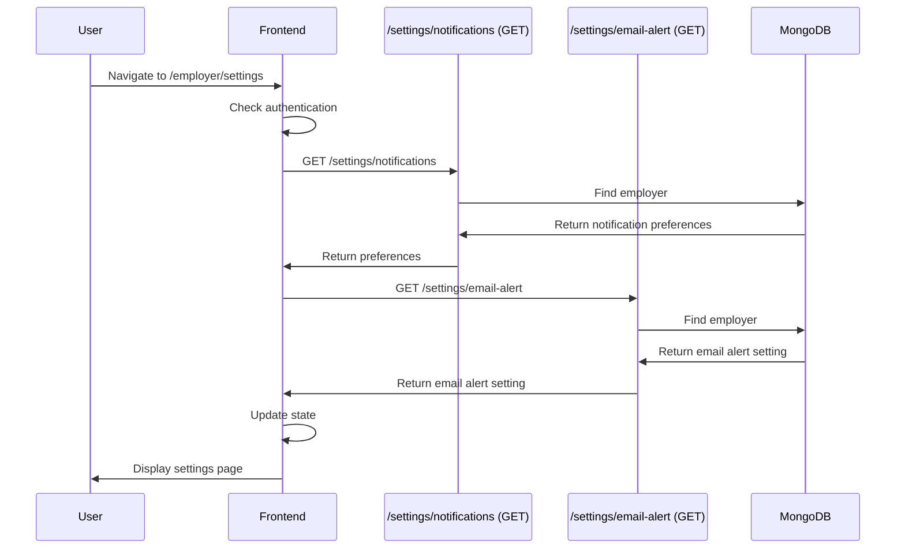
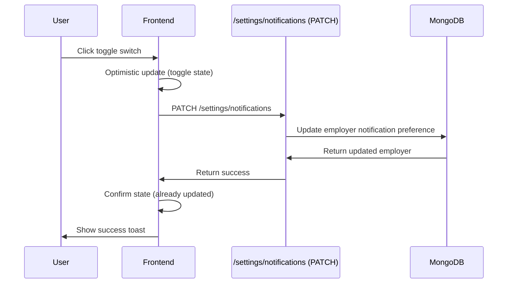
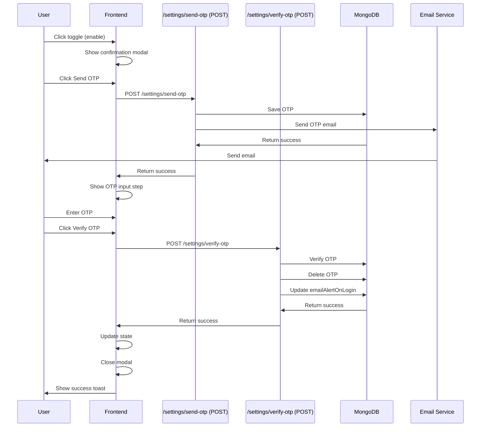

# Feature: Employer Settings

## Overview

**Purpose**: The Employer Settings feature allows employers to manage their account preferences, specifically email notification settings. It provides toggles for email notifications about applications and a secure OTP-verified way to enable or disable email alerts on login.

**User Story**: As an employer, I want to manage my email notification preferences so that I can control when I receive email notifications about applications and account activity (specifically login alerts).

**Key Functionality**:
- View current notification preferences (direct applications, basic test completions)
- Toggle email notifications for direct applications (no OTP required)
- Toggle email notifications for basic test completions (no OTP required)
- View current email alert preference (email alert on login)
- Enable/disable email alert on login (requires OTP verification)
- Two-step modal process for email alert on login (confirmation → OTP verification)
- OTP sent to registered email address
- 4-digit OTP input with auto-focus and auto-advance
- Resend OTP functionality
- Close confirmation when exiting OTP verification
- Link to profile page
- Session expiration handling
- Loading states and error handling

**Access Level**: Authenticated (Employer only)

**URL Path**: `/employer/settings`

**Authentication Required**: Yes (JWT token via `emp_token` cookie)

---

## User Flow

### Primary Flow - View Settings
1. User navigates to `/employer/settings`
2. Authentication check (server component wrapper)
3. If not authenticated: Redirect to sign-in
4. If authenticated: Settings page loads
5. **Data Loading**:
   - Fetch current notification settings from API
   - Fetch current email alert setting from API
   - Display current preferences (enabled/disabled states)
6. **Page Display**:
   - Email delivery preferences section (with two toggles)
   - Email preferences section (email alert on login)
   - Profile update section (link to profile page)

### Toggle Notification Preference Flow
1. User clicks toggle switch (for Direct Applications or Basic Test Completions)
2. Toggle state updates immediately (optimistic update)
3. API call made to update preference
4. On success: Success toast notification shown, state confirmed
5. On error: Toggle reverted to previous state, error toast shown

### Enable Email Alert on Login Flow
1. User clicks toggle switch (when disabled)
2. **Confirmation Modal Opens**:
   - Shows user's email address
   - Explains that OTP will be sent
   - "Send OTP" and "Cancel" buttons
3. User clicks "Send OTP"
4. OTP sent to registered email
5. **OTP Verification Modal**:
   - Shows 4-digit OTP input fields
   - Auto-focus on first input
   - User enters OTP (auto-advances between fields)
   - "Verify OTP" and "Resend OTP" buttons
6. User enters OTP and clicks "Verify OTP"
7. OTP verified on backend
8. Setting updated (enabled)
9. Modal closes, toggle updated, success message shown

### Disable Email Alert on Login Flow
1. User clicks toggle switch (when enabled)
2. **Confirmation Modal Opens**:
   - Shows user's email address
   - Explains that OTP will be sent
   - "Send OTP" and "Cancel" buttons
3. User clicks "Send OTP"
4. OTP sent to registered email
5. **OTP Verification Modal**:
   - Shows 4-digit OTP input fields
   - User enters OTP
   - "Verify OTP" and "Resend OTP" buttons
6. User enters OTP and clicks "Verify OTP"
7. OTP verified on backend
8. Setting updated (disabled)
9. Modal closes, toggle updated, success message shown

### Alternative Flows
- **Resend OTP**: User clicks "Resend OTP" → New OTP sent → OTP input cleared → Success message
- **Close Modal (Confirmation)**: User clicks close/cancel → Modal closes, no changes
- **Close Modal (OTP)**: User clicks close → Confirmation modal shown → User confirms → Modal closes, changes cancelled
- **Invalid OTP**: User enters wrong OTP → Error message shown → User can retry or resend
- **OTP Expired/Not Found**: Backend returns error → Error message shown → User can resend OTP
- **Session Expired**: Token invalid/expired → Warning message shown → User must sign in again

### Edge Cases
- **No Email on Account**: Error handling, user cannot enable alerts
- **OTP Input**: Only digits allowed, max 1 digit per field
- **Backspace Navigation**: Backspace moves focus to previous field if current is empty
- **Auto-advance**: Entering digit automatically focuses next field
- **Disabled States**: Buttons disabled during API calls (sending OTP, verifying OTP)
- **Network Errors**: Error messages shown, user can retry
- **Partial Updates**: If update fails, toggle reverted to previous state

---

## Frontend Implementation

### Screen Structure

**Main Page Component**:
- File: `frontend/src/app/employer/(screens)/settings/page.jsx`
- Type: Server Component (wraps client component with Suspense)
- Wrapper: `SettingsPageClient.jsx` (Client Component)

**Client Component**:
- File: `frontend/src/app/employer/(screens)/settings/SettingsPageClient.jsx`
- Type: Client Component
- Lines: ~645 lines

**Styling**:
- CSS File: `frontend/src/app/employer/(screens)/settings/page.css`
- CSS Modules: No
- Responsive: Yes

### Component Hierarchy

```
Page (page.jsx - Server Component)
  └── Suspense
      └── LoadingFallback
      └── SettingsPage (SettingsPageClient.jsx - Client Component)
          ├── Loading State (conditional)
          ├── Session Expired Warning (conditional)
          ├── Email Delivery Preferences Section
          │   ├── Header (title, subtitle)
          │   ├── Direct Applications Preference
          │   │   ├── Content (title, description)
          │   │   └── Toggle Switch
          │   └── Basic Test Completions Preference
          │       ├── Content (title, description)
          │       └── Toggle Switch
          ├── Email Preferences Section
          │   ├── Header (title, subtitle)
          │   └── Email Alert on Login Preference
          │       ├── Content (title, description)
          │       └── Toggle Switch
          ├── Profile Update Section
          │   ├── Header (title, subtitle)
          │   ├── Description
          │   └── Link Button (to /employer/profile)
          ├── OTP Modal (conditional)
          │   ├── Overlay
          │   ├── Modal Container
          │   ├── Header (title, close button)
          │   └── Body (conditional content)
          │       ├── Confirmation Step
          │       │   ├── Text (with email)
          │       │   └── Action Buttons (Cancel, Send OTP)
          │       └── OTP Step
          │           ├── Text (with email)
          │           ├── Error Message (conditional)
          │           ├── OTP Input Fields (4 inputs)
          │           └── Action Buttons (Resend OTP, Verify OTP)
          └── Close Confirmation Modal (conditional)
              ├── Overlay
              ├── Modal Container
              ├── Header (title, close button)
              ├── Body (confirmation text)
              └── Action Buttons (Continue Verification, Exit Verification)
```

### State Management

**Notification Settings State**:
```javascript
const [notifyWithoutTest, setNotifyWithoutTest] = useState(false);
const [notifyBasicTest, setNotifyBasicTest] = useState(false);
```

**Email Alert State**:
```javascript
const [emailAlertOnLogin, setEmailAlertOnLogin] = useState(false);
```

**Modal State**:
```javascript
const [showModal, setShowModal] = useState(false);
const [modalStep, setModalStep] = useState('confirmation'); // 'confirmation' or 'otp'
const [modalAction, setModalAction] = useState(null); // 'enable' or 'disable'
const [showCloseConfirmation, setShowCloseConfirmation] = useState(false);
```

**OTP State**:
```javascript
const [otp, setOtp] = useState(["", "", "", ""]);
const [sendingOtp, setSendingOtp] = useState(false);
const [verifyingOtp, setVerifyingOtp] = useState(false);
const [otpError, setOtpError] = useState("");
const [userEmail, setUserEmail] = useState("");
```

**Loading and Error State**:
```javascript
const [isLoading, setIsLoading] = useState(true);
const [isSaving, setIsSaving] = useState(false);
const [sessionExpired, setSessionExpired] = useState(false);
```

### Notification Preferences

**Two Notification Types**:

1. **Direct Applications** (`notifyApplicationsWithoutTest`):
   - Toggle for applications without required tests
   - Description: "Get notified the moment someone submits to a role with no required tests"
   - Updated via PATCH `/settings/notifications`
   - No OTP required

2. **Basic Test Completions** (`notifyBasicTestCompletion`):
   - Toggle for basic test completions
   - Description: "Once a candidate clears the required basic test, we'll email you their readiness summary"
   - Updated via PATCH `/settings/notifications`
   - No OTP required

**Toggle Implementation**:
- Optimistic update (toggle changes immediately)
- API call to update preference
- On error: Toggle reverted to previous state
- Success toast notification shown

### Email Alert on Login

**Setting**: `emailAlertOnLogin`

**Toggle Implementation**:
- Opens confirmation modal (doesn't toggle immediately)
- Requires OTP verification for both enable and disable
- Two-step process: Confirmation → OTP Verification

### OTP Modal Flow

**Step 1: Confirmation**:
- Shows user's email address
- Explains OTP will be sent
- "Cancel" and "Send OTP" buttons
- Backdrop click closes modal (if not sending OTP)

**Step 2: OTP Verification**:
- Shows 4-digit OTP input fields
- Auto-focus on first input after OTP sent
- Auto-advance to next field on input
- Backspace navigation to previous field
- "Resend OTP" and "Verify OTP" buttons
- Verify button disabled until all 4 digits entered
- Error message displayed if verification fails
- Backdrop click disabled during OTP step

**Close Confirmation Modal**:
- Shown when user tries to close OTP verification step
- "Continue Verification" and "Exit Verification" buttons
- Exit cancels the operation

### OTP Input Handling

**Input Validation**:
- Only digits allowed (`/^\d*$/`)
- Max 1 digit per field
- Auto-advance to next field on input
- Backspace moves to previous field if current is empty

**Focus Management**:
- Auto-focus first input after OTP sent
- Focus moves forward on input
- Focus moves backward on backspace (if current empty)

### API Integration

**Endpoints Called**:

| Endpoint | Method | Purpose | Authentication |
|----------|--------|---------|----------------|
| `/settings/notifications` | GET | Fetch notification preferences | Bearer token |
| `/settings/notifications` | PATCH | Update notification preferences | Bearer token |
| `/settings/email-alert` | GET | Fetch email alert setting | Bearer token |
| `/settings/send-otp` | POST | Send OTP for email alert setting | Bearer token |
| `/settings/verify-otp` | POST | Verify OTP and update email alert | Bearer token |

**Environment Variables**:
- `NEXT_PUBLIC_EMPLOYER_URL`: Base URL for employer API

**Fetch Notification Settings**:
```
GET /settings/notifications
Response: {
  success: true,
  data: {
    notifyApplicationsWithoutTest: boolean,
    notifyBasicTestCompletion: boolean
  }
}
```

**Update Notification Setting**:
```
PATCH /settings/notifications
Body: { notifyApplicationsWithoutTest: true } // or notifyBasicTestCompletion
```

**Fetch Email Alert Setting**:
```
GET /settings/email-alert
Response: {
  success: true,
  data: {
    emailAlertOnLogin: boolean,
    email: string
  }
}
```

**Send OTP**:
```
POST /settings/send-otp
Response: {
  success: true,
  message: "OTP sent successfully"
}
```

**Verify OTP**:
```
POST /settings/verify-otp
Body: { otp: "1234", action: "enable" } // or "disable"
Response: {
  success: true,
  message: "OTP verified successfully. Email alert on login enabled."
}
```

---

## Backend Implementation

### API Endpoints

#### Get Notification Settings

**Route Definition**:
```javascript
router.get("/settings/notifications", verifyToken, employerController.getNotificationSettings);
```

**Full Endpoint Path**: `/settings/notifications`

**HTTP Method**: GET

**Authentication Required**: Yes

**Response Format**:
```json
{
  "success": true,
  "data": {
    "notifyApplicationsWithoutTest": true,
    "notifyBasicTestCompletion": true
  }
}
```

**Controller Logic** (`getNotificationSettings`):
1. Find employer by userId
2. Get notification preferences (defaults to true if not set)
3. Return current preferences

#### Update Notification Settings

**Route Definition**:
```javascript
router.patch("/settings/notifications", verifyToken, employerController.updateNotificationSettings);
```

**Full Endpoint Path**: `/settings/notifications`

**HTTP Method**: PATCH

**Authentication Required**: Yes

**Request Body**: Partial update (one or both fields)
```json
{
  "notifyApplicationsWithoutTest": true,
  "notifyBasicTestCompletion": false
}
```

**Response Format**:
```json
{
  "success": true,
  "message": "Notification preferences updated"
}
```

**Controller Logic** (`updateNotificationSettings`):
1. Validate request body (both fields must be boolean if provided)
2. Build update object with only provided fields
3. Update employer using `$set` operator
4. Return success response

#### Get Email Alert Setting

**Route Definition**:
```javascript
router.get("/settings/email-alert", verifyToken, employerController.getEmailAlertSetting);
```

**Full Endpoint Path**: `/settings/email-alert`

**HTTP Method**: GET

**Authentication Required**: Yes

**Response Format**:
```json
{
  "success": true,
  "data": {
    "emailAlertOnLogin": true,
    "email": "employer@example.com"
  }
}
```

**Controller Logic** (`getEmailAlertSetting`):
1. Find employer by userId
2. Return emailAlertOnLogin and email fields

#### Send OTP for Settings Verification

**Route Definition**:
```javascript
router.post("/settings/send-otp", verifyToken, employerController.sendSettingsOtp);
```

**Full Endpoint Path**: `/settings/send-otp`

**HTTP Method**: POST

**Authentication Required**: Yes

**Response Format**:
```json
{
  "success": true,
  "message": "OTP sent successfully"
}
```

**Controller Logic** (`sendSettingsOtp`):
1. Find employer by userId
2. Generate 4-digit OTP (1000-9999)
3. Save OTP to UserOtp model with key `employer_settings_{email}`
4. Send OTP via email using `sendMail`
5. Return success response

**OTP Storage**:
- Model: `UserOtp`
- Key format: `employer_settings_{email}`
- Upsert operation (create or update)

#### Verify OTP for Settings

**Route Definition**:
```javascript
router.post("/settings/verify-otp", verifyToken, employerController.verifySettingsOtp);
```

**Full Endpoint Path**: `/settings/verify-otp`

**HTTP Method**: POST

**Authentication Required**: Yes

**Request Body**:
```json
{
  "otp": "1234",
  "action": "enable"
}
```

**Response Format**:
```json
{
  "success": true,
  "message": "OTP verified successfully. Email alert on login enabled."
}
```

**Controller Logic** (`verifySettingsOtp`):
1. Validate OTP and action (must be 'enable' or 'disable')
2. Find employer by userId
3. Find OTP record by key `employer_settings_{email}`
4. Verify OTP matches
5. Delete OTP record (cleanup)
6. Update emailAlertOnLogin based on action
7. Return success response

### Database Models

**Employer Model** (`backend/src/models/employer.js`):
- `notificationPreferences.notifyApplicationsWithoutTest`: Boolean (default: true)
- `notificationPreferences.notifyBasicTestCompletion`: Boolean (default: true)
- `emailAlertOnLogin`: Boolean
- `email`: String

**UserOtp Model** (`backend/src/models/userOtp.js`):
- `userData`: String (key: `employer_settings_{email}`)
- `userOtp`: Number (4-digit OTP)
- `createdAt`: Date

### Middleware Chain

**Authentication Middleware**:
- `verifyToken`: Validates JWT token, attaches userId
- On failure: Returns 401 Unauthorized

---

## Data Flow

### Fetch Settings Flow



### Update Notification Preference Flow



### Enable Email Alert Flow



---

## Error Handling

### Frontend Error Handling

**Authentication Errors**:
- 401 responses: Session expired warning shown, user must sign in again
- Token removed from cookies

**Network Errors**:
- Error toast notifications shown
- For notification preferences: Toggle reverted to previous state
- For OTP operations: Error message shown in modal, user can retry

**Validation Errors**:
- OTP incomplete: Error message shown, verify button disabled
- Invalid OTP: Error message shown in modal, user can retry or resend

**Session Expiration**:
- Warning banner shown at top of page
- All toggles disabled
- User must sign in again

### Backend Error Handling

**Authentication Errors**:
- Missing/invalid token: 401 Unauthorized

**Validation Errors**:
- Invalid boolean values: 400 Bad Request
- Missing OTP: 400 Bad Request
- Invalid action: 400 Bad Request
- Missing required fields: 400 Bad Request

**Not Found Errors**:
- Employer not found: 404 Not Found
- OTP not found: 200 OK with success: false (allows resend)

**Email Errors**:
- Email sending failures logged but don't fail the request
- OTP still saved even if email fails

**Status Codes**:
- 200: Success (or success: false for invalid OTP)
- 400: Bad Request (validation errors)
- 401: Unauthorized (authentication required)
- 404: Not Found (employer not found)
- 500: Internal Server Error

---

## Security Features

### Authentication
- JWT token required for all endpoints
- Token validated via middleware
- Employer can only access their own settings

### Authorization
- `req.userId` from token used for all operations
- All operations check employer ownership

### Data Protection
- Sensitive data validated and sanitized
- XSS protection via React's built-in escaping
- CSRF protection via same-origin policy and token validation
- OTP verification required for email alert changes (security-critical setting)

### OTP Security
- 4-digit OTP (1000-9999 range)
- OTP stored with unique key per email
- OTP deleted after successful verification
- OTP verification prevents unauthorized changes

---

## UI/UX Details

### Layout Structure

**Page Sections** (in order):
1. Loading state (conditional)
2. Session expired warning (conditional)
3. Email Delivery Preferences section (highlight card)
4. Email Preferences section (simple card)
5. Profile Update section (simple card)
6. OTP Modal (conditional, overlay)
7. Close Confirmation Modal (conditional, overlay)

### Visual Design

**Settings Cards**:
- Card-based layout with clear sections
- Headers with eyebrow text, title, and subtitle
- Preference blocks with content and toggle switch
- Highlight card for email delivery preferences (more prominent)

**Toggle Switches**:
- Custom toggle switch design
- Visual state (on/off) clearly indicated
- Smooth animation on toggle
- Disabled state when saving or session expired

**Modals**:
- Overlay background (semi-transparent)
- Centered modal layout
- Clear header with title and close button
- Scrollable body (if needed)
- Action buttons in footer

**OTP Input**:
- 4 individual input fields
- Large, easy-to-read inputs
- Error state styling (red border/text)
- Auto-focus and auto-advance for better UX

### Responsive Design

**Desktop**:
- Spacious card layout
- Clear section separation
- Readable text and comfortable spacing

**Tablet**:
- Maintained spacing
- Responsive modals

**Mobile**:
- Full-width cards
- Touch-friendly toggle switches
- Optimized spacing
- Full-screen modals

### Accessibility

**Keyboard Navigation**:
- Tab order logical
- All interactive elements keyboard accessible
- Modal focus trap
- Escape key closes modals

**Screen Reader Support**:
- Semantic HTML elements
- ARIA labels on toggle switches (aria-pressed, aria-label)
- Button states announced
- Modal roles and labels

**Visual Indicators**:
- Clear toggle states
- Loading indicators (spinners)
- Error states (red styling)
- Success states (toast notifications)
- Disabled states
- Focus states

---

## Testing Considerations

### Test Scenarios

**Happy Path**:
1. View settings → Settings displayed correctly → All toggles show current state
2. Toggle notification preference → Preference updated → Success message shown
3. Enable email alert → Modal opens → OTP sent → OTP entered → Setting enabled → Success message shown
4. Disable email alert → Modal opens → OTP sent → OTP entered → Setting disabled → Success message shown

**Notification Preferences**:
1. Toggle Direct Applications → Preference updated → Success shown
2. Toggle Basic Test Completions → Preference updated → Success shown
3. Network error → Toggle reverted → Error shown

**Email Alert on Login**:
1. Enable flow → Confirmation → OTP → Verification → Enabled
2. Disable flow → Confirmation → OTP → Verification → Disabled
3. Resend OTP → New OTP sent → OTP input cleared → Success shown
4. Invalid OTP → Error shown → User can retry
5. OTP expired → Error shown → User can resend

**Edge Cases**:
1. Session expired → Warning shown → Toggles disabled
2. Network error → Error shown → User can retry
3. Close modal (confirmation) → Modal closes → No changes
4. Close modal (OTP) → Confirmation shown → User can exit or continue
5. OTP input → Only digits accepted → Auto-advance works → Backspace navigation works
6. Partial OTP → Verify button disabled
7. Rapid toggling → Only latest request processed

---

## Related Features

- **Employer Profile** (`/employer/profile`): Linked from settings page
- **Employer Home Dashboard** (`/employer/home`): Uses notification preferences
- **Application Management** (`/employer/applications`): Uses notification preferences
- **Job Seeker Settings** (`/jobseeker/settings`): Similar OTP verification flow

---

## Additional Notes

**Dependencies**:
- `axios`: HTTP client
- `js-cookie`: Cookie management
- `@mui/material`: Loading spinner
- `react-icons/fa`: Icon library
- `react-hot-toast`: Toast notifications

**Performance Optimizations**:
- Optimistic updates for notification preferences (immediate feedback)
- Separate API calls for notification settings and email alert (can be optimized)

**Known Limitations**:
- Notification preferences don't have OTP verification (less secure but more convenient)
- No bulk update for notification preferences
- OTP doesn't expire automatically (deleted only after verification or resend)
- No email preference for video test completions

**Future Enhancements**:
- Add notification preference for video test completions
- Add email preference for job posting updates
- Add email preference for application status changes
- Add notification frequency settings (instant, daily digest, weekly digest)
- Add email template preferences
- Add SMS notification preferences
- Add push notification preferences
- OTP expiration handling
- Resend OTP with timer/countdown
- Bulk update for notification preferences
- Export settings
- Settings history/audit log

---

## Code References

### Frontend Files
- `frontend/src/app/employer/(screens)/settings/page.jsx` - Server component wrapper (~30 lines)
- `frontend/src/app/employer/(screens)/settings/SettingsPageClient.jsx` - Main client component (~645 lines)
- `frontend/src/app/employer/(screens)/settings/page.css` - Styling

### Backend Files
- `backend/src/routes/employerRoutes.js` - Route definitions:
  - Line 57: GET `/settings/notifications` (get notification settings)
  - Line 58: PATCH `/settings/notifications` (update notification settings)
  - Line 61: GET `/settings/email-alert` (get email alert setting)
  - Line 62: PATCH `/settings/email-alert` (update email alert setting - unused in frontend)
  - Line 63: POST `/settings/send-otp` (send OTP)
  - Line 64: POST `/settings/verify-otp` (verify OTP)
- `backend/src/controllers/employerController.js` - Controller functions:
  - `getNotificationSettings` (lines 614-643)
  - `updateNotificationSettings` (lines 645-698)
  - `getEmailAlertSetting` (lines 712-737)
  - `updateEmailAlertSetting` (lines 740-778, unused in frontend)
  - `sendSettingsOtp` (lines 781-839)
  - `verifySettingsOtp` (lines 842-909)
- `backend/src/models/employer.js` - Employer model schema
- `backend/src/models/userOtp.js` - UserOtp model schema

---

*Last Updated: [Current Date]*
*Documented By: TSD Documentation System*

