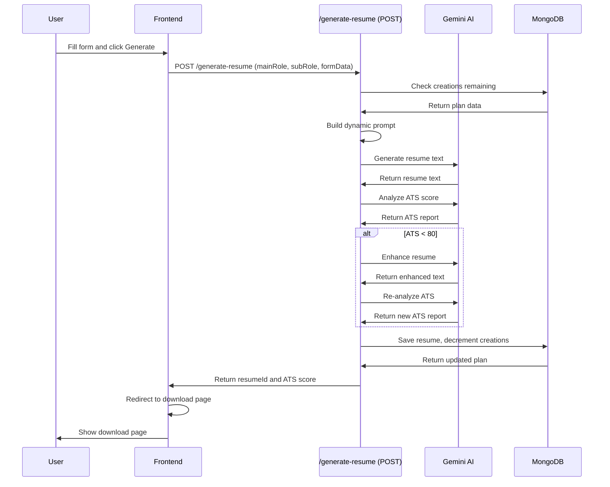
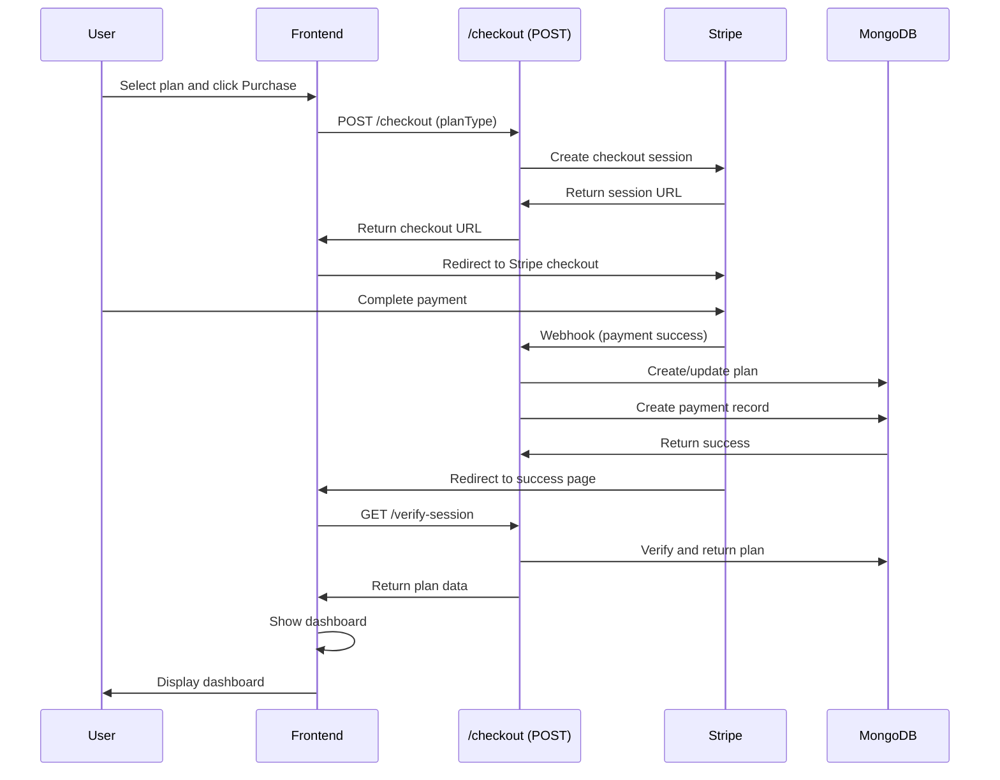

# Feature: Resume Builder

## Overview

**Purpose**: The Resume Builder is a premium feature that allows job seekers to create, enhance, and download professional resumes using AI-powered generation. It includes plan management, payment integration, multiple resume templates, ATS score optimization, and comprehensive resume management capabilities.

**User Story**: As a job seeker, I want to create professional, ATS-optimized resumes using AI so that I can stand out to employers and increase my chances of getting hired.

**Key Functionality**:
- Plan selection and purchase (Basic, Premium, Organization plans)
- Payment integration (Stripe checkout)
- Resume creation with role-based forms
- AI-powered resume generation (Gemini AI)
- ATS score analysis and optimization
- Resume enhancement
- Multiple resume templates
- PDF download with templates
- Resume management (view, edit, delete)
- Draft management (localStorage-based)
- Plan management (active plan switching, usage tracking)
- Payment history
- Transaction history
- Usage tracking (creations, downloads, enhancements remaining)
- Dashboard with statistics
- Role and sub-role selection

**Access Level**: Authenticated (Job Seeker only, requires plan purchase)

**URL Path**: `/jobseeker/resume-builder` (main entry point)

**Sub-paths**:
- `/jobseeker/resume-builder/create` - Role selection and form
- `/jobseeker/resume-builder/create/form` - Resume creation form
- `/jobseeker/resume-builder/download` - Resume download with templates
- `/jobseeker/resume-builder/transactions` - Transaction history

**Authentication Required**: Yes (JWT token via `js_token` cookie)

---

## User Flow

### Primary Flow - Initial Access
1. User navigates to `/jobseeker/resume-builder`
2. Authentication check (redirects if not authenticated)
3. **Plan Check**:
   - If user has no plan → Show pricing page
   - If user has plan → Show dashboard
4. **Pricing Page** (if no plan):
   - Display plan options (Basic, Premium, Organization)
   - Show features and benefits for each plan
   - User selects plan and clicks "Purchase"
   - Redirected to Stripe checkout
   - After payment → Redirected back → Dashboard shown

### Dashboard Flow
1. User lands on dashboard (if has plan)
2. **Data Loading**:
   - Fetch plan data
   - Fetch plan configuration
   - Fetch payment history
   - Fetch usage counts (creations, downloads, enhancements)
   - Fetch all generated resumes
3. **Dashboard Display**:
   - Usage statistics cards (creations, downloads, enhancements)
   - Plan selector (if multiple plans available)
   - Recent resumes list
   - Quick actions (Create Resume, View Transactions)
   - Plan details and upgrade option

### Create Resume Flow
1. User clicks "Create Resume" button
2. Navigate to `/jobseeker/resume-builder/create`
3. **Role Selection Page**:
   - Display main roles (categories)
   - User selects main role
   - Display sub-roles for selected main role
   - User selects sub-role
   - User clicks "Continue"
4. Navigate to `/jobseeker/resume-builder/create/form?mainRole=X&subRole=Y`
5. **Form Page**:
   - Check creations remaining
   - Display multi-step form based on selected role
   - User fills in form sections (Personal Information, Experience, Education, etc.)
   - User can save as draft (stored in localStorage)
   - User can navigate between steps
   - User clicks "Generate Resume"
6. **Generation Process**:
   - API call to generate resume
   - AI generates resume text
   - ATS score analyzed
   - If ATS < 80 → Auto-enhancement
   - Resume saved to database
   - Creations count decremented
   - Redirect to download page

### Download Resume Flow
1. User navigates to download page (after generation or from dashboard)
2. **Download Page**:
   - Display generated resume text
   - Display ATS score
   - Select template (multiple templates available)
   - Preview resume in selected template
   - User clicks "Download PDF"
3. **Download Process**:
   - Check downloads remaining
   - Generate PDF with selected template
   - Downloads count decremented
   - PDF file downloaded

### Enhancement Flow
1. User views existing resume
2. User clicks "Enhance Resume"
3. Check enhancements remaining
4. AI enhances resume
5. ATS score re-analyzed
6. Enhanced resume saved
7. Enhancements count decremented

---

## Frontend Implementation

### Screen Structure

**Main Pages**:
1. **Resume Builder Main Page** (`/jobseeker/resume-builder`)
   - File: `frontend/src/app/jobseeker/(screens)/resume-builder/page.jsx`
   - Component: `ResumeBuilderPageClient.jsx`
   - Purpose: Entry point, shows pricing or dashboard

2. **Dashboard** (`/jobseeker/resume-builder` - when plan exists)
   - File: `frontend/src/app/jobseeker/(screens)/resume-builder/dashboard.jsx`
   - Component: `ResumeBuilderDashboard`
   - Purpose: Main dashboard with statistics and resume management

3. **Role Selection** (`/jobseeker/resume-builder/create`)
   - File: `frontend/src/app/jobseeker/(screens)/resume-builder/create/page.jsx`
   - Component: `CreateResumePage`
   - Purpose: Select main role and sub-role

4. **Resume Creation Form** (`/jobseeker/resume-builder/create/form`)
   - File: `frontend/src/app/jobseeker/(screens)/resume-builder/create/form/page.jsx`
   - Component: `CreateResumeFormPageClient.jsx`
   - Purpose: Multi-step form for resume data collection

5. **Download/Preview** (`/jobseeker/resume-builder/download`)
   - File: `frontend/src/app/jobseeker/(screens)/resume-builder/download/page.jsx`
   - Component: `DownloadResumePageClient.jsx`
   - Purpose: Preview and download resume with templates

6. **Transactions** (`/jobseeker/resume-builder/transactions`)
   - File: `frontend/src/app/jobseeker/(screens)/resume-builder/transactions/page.jsx`
   - Component: `TransactionsPageClient.jsx`
   - Purpose: View payment and transaction history

### Component Hierarchy

```
ResumeBuilderPageClient (Main Entry)
  ├── Pricing Section (if no plan)
  │   ├── Plan Cards (Basic, Premium, Organization)
  │   │   ├── Plan Name
  │   │   ├── Plan Price
  │   │   ├── Plan Features List
  │   │   └── Purchase Button
  │   └── Plan Comparison
  └── ResumeBuilderDashboard (if has plan)
      ├── Usage Statistics Cards
      │   ├── Creations Remaining
      │   ├── Downloads Remaining
      │   └── Enhancements Remaining
      ├── Plan Selector (if multiple plans)
      ├── Recent Resumes List
      ├── Quick Actions
      └── Plan Details Section

CreateResumePage (Role Selection)
  ├── Main Role Selection
  ├── Sub-Role Selection
  ├── Drafts Panel (side panel)
  └── Continue Button

CreateResumeFormPageClient (Form)
  ├── Step Indicator
  ├── Form Sections (dynamic based on role)
  │   ├── Personal Information
  │   ├── Experience
  │   ├── Education
  │   ├── Skills
  │   ├── Projects (if applicable)
  │   └── Additional Sections
  ├── Navigation Buttons (Previous, Next)
  ├── Draft Save Button
  └── Generate Resume Button

DownloadResumePageClient (Download)
  ├── Resume Preview
  ├── ATS Score Display
  ├── Template Selector
  ├── Template Preview
  └── Download PDF Button

TransactionsPageClient (Transactions)
  ├── Payment History List
  ├── Transaction History List
  └── Filters/Search (if applicable)
```

### State Management

**React Query Hooks** (from `useResumeBuilder`):
```javascript
// Plan management
const { data: planData } = useResumeBuilderPlan();
const { data: planConfigData } = useResumeBuilderPlanConfig();
const updateActivePlanMutation = useUpdateActivePlan();

// Usage tracking
const { data: creationsRemaining } = useResumeBuilderCreations();
const { data: downloadsRemaining } = useResumeBuilderDownloads();
const { data: enhancementsRemaining } = useResumeBuilderEnhancements();

// Resumes
const { data: generatedResumes } = useAllResumes();
const generateResumeMutation = useGenerateResume();

// Payments
const { data: payments } = useResumeBuilderPayments();
const createCheckoutMutation = useCreateCheckoutSession();
```

**Local State (Form)**:
```javascript
const [currentStep, setCurrentStep] = useState(0);
const [formData, setFormData] = useState({});
const [selectedSection, setSelectedSection] = useState(null);
const [currentSections, setCurrentSections] = useState([]);
const [loading, setLoading] = useState(false);
const [completed, setCompleted] = useState(false);
```

**Local State (Drafts)**:
```javascript
// Stored in localStorage
const [drafts, setDrafts] = useState([]);
const draftKey = `resumebuilder_draft_${userId}_${roleKey}`;
```

### Form Sections and Fields

**Dynamic Form Structure**:
- Form sections are determined by selected role (mainRole + subRole)
- Sections defined in `sectionsAndFields` utility
- Each section has fields with labels and validation
- Multi-entry sections (like Experience) support multiple entries

**Common Sections**:
- Personal Information (name, email, phone, location, etc.)
- Professional Summary
- Experience (multiple entries)
- Education (multiple entries)
- Skills
- Projects (role-dependent)
- Certifications (role-dependent)
- Additional sections (role-dependent)

### Draft Management

**Storage**:
- Drafts stored in localStorage
- Key format: `resumebuilder_draft_${userId}_${roleKey}`
- Role key: `${mainRole}_${subRole}` (normalized)

**Draft Operations**:
- Save draft: Store formData in localStorage
- Load draft: Retrieve from localStorage on page load
- Delete draft: Remove from localStorage
- List drafts: Scan localStorage for user's drafts

### ATS Score Display

**Score Levels**:
- 90-100: Excellent
- 80-89: Good
- 70-79: Average
- Below 70: Poor

**Display**:
- Score shown as number (e.g., "85/100")
- Color-coded based on level
- Score details (issues, keywords, suggestions) shown if available

### Template System

**Templates**:
- Multiple resume templates available
- Templates defined in `ResumeTemplates` component
- User can preview before download
- Template selection affects PDF output

**Template Features**:
- Different layouts and styles
- Consistent formatting
- ATS-friendly structure
- Professional appearance

---

## Backend Implementation

### API Endpoints

#### Plan Management

**Get Job Seeker Plan**:
```
GET /resume-builder/plan
Response: {
  success: true,
  hasPlan: boolean,
  plan: {
    planType: string,
    planCounts: Map/Object,
    activePlanType: string,
    resumes: Array,
    // ... other plan fields
  }
}
```

**Get Plan Configuration**:
```
GET /resume-builder/plan-config
Response: {
  success: true,
  plans: {
    basic: { name, price, benefits, features },
    premium: { name, price, benefits, features },
    organization: { name, price, benefits, features }
  },
  features: { featureCode: { name, displayName } },
  userPlan: {
    planType: string,
    planCounts: Object,
    activePlanType: string
  }
}
```

**Update Active Plan**:
```
PUT /resume-builder/active-plan
Body: { activePlanType: "premium" }
Response: {
  success: true,
  message: "Active plan updated"
}
```

#### Usage Tracking

**Check Creations Remaining**:
```
GET /resume-builder/check-creations
Response: {
  success: true,
  creationsRemaining: number
}
```

**Check Downloads Remaining**:
```
GET /resume-builder/check-downloads
Response: {
  success: true,
  downloadsRemaining: number
}
```

**Check Enhancements Remaining**:
```
GET /resume-builder/check-enhancements
Response: {
  success: true,
  enhancementsRemaining: number
}
```

#### Resume Generation

**Generate Resume**:
```
POST /resume-builder/generate-resume
Body: {
  mainRole: string,
  subRole: string,
  formData: Object
}
Response: {
  success: true,
  message: "Resume generated successfully",
  data: {
    resumeId: string,
    atsScore: number,
    scoreLevel: string
  }
}
```

**Process**:
1. Validate request (mainRole, subRole, formData)
2. Check creations remaining
3. Build dynamic prompt from form data
4. Generate resume text using Gemini AI
5. Analyze ATS score
6. If ATS < 80, auto-enhance resume
7. Save resume to JobSeekerResumePlan
8. Decrement creations count
9. Return resume ID and ATS score

**Get Resume by ID**:
```
GET /resume-builder/get-resume?resumeId=xxx
Response: {
  success: true,
  data: {
    id: string,
    title: string,
    text: string,
    atsScore: number,
    created_at: Date,
    type: string
  },
  downloads_remaining: number,
  plan_type: string
}
```

**Get All Resumes**:
```
GET /resume-builder/get-all-resumes
Response: {
  success: true,
  data: Array<Resume>
}
```

**Update Downloads**:
```
POST /resume-builder/update-downloads
Body: { resumeId: string }
Response: {
  success: true,
  downloadsRemaining: number
}
```

#### Payment Integration

**Create Checkout Session**:
```
POST /resume-builder/checkout
Body: { planType: "premium" }
Response: {
  success: true,
  url: string  // Stripe checkout URL
}
```

**Verify Checkout Session**:
```
GET /resume-builder/verify-session?session_id=xxx
Response: {
  success: true,
  plan: { ... }
}
```

**Get Payment History**:
```
GET /resume-builder/payments
Response: {
  success: true,
  data: Array<Payment>
}
```

### Database Models

**JobSeekerResumePlan** (`backend/src/models/jobSeekerResumePlan.js`):
- `jobSeekerId`: ObjectId (ref: JobSeeker)
- `planType`: String (basic, premium, organization)
- `planCounts`: Map (planType → { creations, enhancements, downloads })
- `activePlanType`: String
- `resumes`: Array (resume objects)
- `createdAt`: Date
- `updatedAt`: Date

**Payment** (`backend/src/models/payment.js`):
- `jobSeekerId`: ObjectId (ref: JobSeeker)
- `amount`: Number
- `currency`: String
- `planType`: String
- `stripeSessionId`: String
- `status`: String
- `createdAt`: Date

**Resume Object Structure** (stored in `resumes` array):
- `id`: String (UUID)
- `title`: String
- `text`: String (resume content)
- `atsScore`: Number
- `created_at`: Date
- `type`: String ("Create", "Enhance")

### AI Integration

**Gemini AI**:
- Model: Gemini 1.5 Flash (configurable)
- API Key: From environment variables
- Used for:
  - Resume text generation
  - ATS score analysis
  - Resume enhancement

**Resume Generation Prompt**:
- Dynamic prompt built from form data
- Role-specific sections and fields
- Structured output format
- ATS-optimization guidelines

**ATS Analysis**:
- Analyzes resume for ATS compatibility
- Returns score (0-100)
- Provides issues, keywords, suggestions
- Used for auto-enhancement if score < 80

**Auto-Enhancement**:
- Triggered if ATS score < 80
- Re-generates resume with enhancement prompt
- Maintains original factual details
- Improves keyword density and clarity
- Re-checks ATS score after enhancement

### Plan Configuration

**Plans**:
- **Basic**: Entry-level plan with limited features
- **Premium**: Mid-tier plan with more features
- **Organization**: Enterprise plan with all features

**Plan Benefits** (configurable):
- Creations: Number of resumes that can be created
- Enhancements: Number of resume enhancements
- Downloads: Number of PDF downloads

**Plan Features** (configurable):
- Feature codes mapped to display names
- Features can be enabled/disabled per plan
- Standard features (ATS score, templates) always available

---

## Data Flow

### Generate Resume Flow



### Purchase Plan Flow



---

## Error Handling

### Frontend Error Handling

**Authentication Errors**:
- 401 responses: Redirect to sign-in
- Token removed from cookies

**Plan Errors**:
- No plan: Show pricing page
- Plan expired: Show upgrade option
- Insufficient credits: Show upgrade option

**Generation Errors**:
- API errors: Error toast shown
- AI errors: Error message displayed
- Validation errors: Form validation shown

**Payment Errors**:
- Checkout errors: Error toast shown
- Payment failures: Error message displayed

### Backend Error Handling

**Validation Errors**:
- Missing fields: 400 Bad Request
- Invalid plan type: 400 Bad Request
- Invalid form data: 400 Bad Request

**Resource Errors**:
- No creations remaining: 403 Forbidden
- No downloads remaining: 403 Forbidden
- No enhancements remaining: 403 Forbidden
- Resume not found: 404 Not Found

**AI Errors**:
- API key not configured: 500 Internal Server Error
- Generation failures: 500 Internal Server Error
- JSON parse errors: 500 Internal Server Error

**Payment Errors**:
- Stripe API errors: 500 Internal Server Error
- Session verification failures: 400 Bad Request

---

## Security Features

### Authentication
- JWT token required for all endpoints
- Token validated via middleware
- Job seeker can only access their own data

### Authorization
- `req.userId` from token used for all operations
- All operations check job seeker ownership
- Payment verification prevents unauthorized access

### Data Protection
- Sensitive data validated and sanitized
- XSS protection via React's built-in escaping
- CSRF protection via same-origin policy and token validation
- Payment data handled securely via Stripe

---

## UI/UX Details

### Dashboard
- Usage statistics prominently displayed
- Plan selector (if multiple plans)
- Recent resumes with ATS scores
- Quick actions for common tasks
- Plan details and upgrade options

### Form
- Multi-step wizard interface
- Progress indicator
- Section navigation
- Auto-save drafts
- Validation feedback
- Responsive design

### Templates
- Visual template preview
- Template comparison
- Professional designs
- ATS-friendly formats

---

## Testing Considerations

### Test Scenarios

**Happy Path**:
1. Purchase plan → Redirect to Stripe → Complete payment → Dashboard shown
2. Create resume → Fill form → Generate → Resume created → Download available
3. Download resume → Select template → PDF downloaded → Count decremented
4. Enhance resume → Resume enhanced → ATS score improved → Count decremented

**Edge Cases**:
1. No plan → Pricing page shown
2. No creations remaining → Upgrade prompt shown
3. Form validation → Errors shown
4. AI generation failure → Error message shown
5. Payment failure → Error message shown
6. Draft management → Drafts saved/loaded correctly

---

## Related Features

- **Job Seeker Profile** (`/jobseeker/profile`): Resume can be uploaded to profile
- **Job Applications** (`/jobseeker/applications`): Resumes used in applications
- **Payment System**: Stripe integration for plan purchases

---

## Additional Notes

**Dependencies**:
- `@google/generative-ai`: Gemini AI integration
- `stripe`: Payment processing
- `uuid`: Resume ID generation
- `@tanstack/react-query`: Data fetching
- `js-cookie`: Cookie management
- `jwt-decode`: Token decoding

**Configuration**:
- Plan configuration in `backend/src/config/resumeBuilderPlanConfig.js`
- Section/field definitions in `backend/src/utils/sectionsAndFields.js`
- Gemini model configurable via environment variables

**Known Limitations**:
- Drafts stored in localStorage (not synced across devices)
- No resume editing after generation (must regenerate)
- Template selection limited to available templates
- ATS score may vary based on AI analysis

**Future Enhancements**:
- Resume editing after generation
- More template options
- Resume sharing/collaboration
- Resume versioning
- Cloud-based draft storage
- Resume analytics
- Job-specific resume optimization
- Resume comparison
- Bulk operations
- Resume export (multiple formats)

---

## Code References

### Frontend Files
- `frontend/src/app/jobseeker/(screens)/resume-builder/page.jsx` - Main entry point
- `frontend/src/app/jobseeker/(screens)/resume-builder/ResumeBuilderPageClient.jsx` - Main client component
- `frontend/src/app/jobseeker/(screens)/resume-builder/dashboard.jsx` - Dashboard component
- `frontend/src/app/jobseeker/(screens)/resume-builder/create/page.jsx` - Role selection
- `frontend/src/app/jobseeker/(screens)/resume-builder/create/form/CreateResumeFormPageClient.jsx` - Form component
- `frontend/src/app/jobseeker/(screens)/resume-builder/download/DownloadResumePageClient.jsx` - Download component
- `frontend/src/app/jobseeker/(screens)/resume-builder/transactions/TransactionsPageClient.jsx` - Transactions component
- `frontend/src/hooks/useResumeBuilder.js` - React Query hooks

### Backend Files
- `backend/src/routes/jobSeekerRoutes.js` - Route definitions (lines 88-101)
- `backend/src/controllers/resumeBuilderController.js` - Controller functions
- `backend/src/models/jobSeekerResumePlan.js` - Plan model
- `backend/src/models/payment.js` - Payment model
- `backend/src/config/resumeBuilderPlanConfig.js` - Plan configuration
- `backend/src/utils/sectionsAndFields.js` - Section/field definitions

---

*Last Updated: [Current Date]*
*Documented By: TSD Documentation System*

