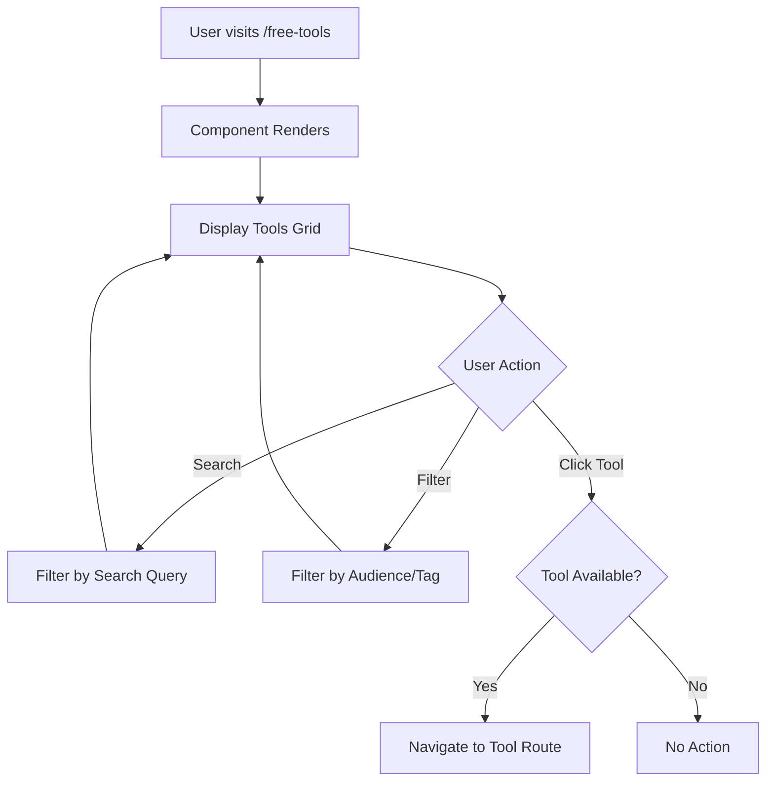

# Feature: Free Tools

## Overview

**Purpose**: The Free Tools page provides a centralized listing of all available and upcoming free tools on the platform. It allows users to discover, search, and filter tools based on their role and needs, with direct navigation to available tools.

**User Story**: As a user (job seeker or employer), I want to browse and discover free tools available on the platform so that I can find useful utilities to help with my tasks.

**Key Functionality**:
- Display list of available and upcoming tools
- Search tools by name or description
- Filter tools by audience (All, New, Job Seeker, Employer)
- Navigate to available tools
- Visual indicators for available vs. coming soon tools
- Tool cards with icons, names, and descriptions
- Responsive grid layout
- Empty state handling

**Access Level**: Public (No authentication required)

**URL Path**: `/free-tools`

**Authentication Required**: No

---

## User Flow

### Primary Flow - Browse Tools
1. User navigates to `/free-tools`
2. **Page Display**:
   - Header with title and description
   - Search bar
   - Filter buttons (All, New, Job Seeker, Employer)
   - Grid of tool cards
3. User can:
   - Browse all tools
   - Search for specific tools
   - Filter by audience type
   - Click on available tools to navigate

### Search Flow
1. User types in search input
2. Tools filtered in real-time
3. Only tools matching search query (name or description) are shown
4. Empty state shown if no matches

### Filter Flow
1. User clicks filter button (All, New, Job Seeker, Employer)
2. Tools filtered based on selected filter
3. Active filter highlighted
4. Grid updated with filtered tools

### Navigate to Tool Flow
1. User clicks on an available tool card (not "Coming Soon")
2. Navigation to tool's route (e.g., `/compress-pdf`)
3. If tool is "Coming Soon", no navigation occurs

---

## Frontend Implementation

### Screen Structure

**Main Page Component**:
- File: `frontend/src/app/free-tools/page.jsx`
- Type: Client Component (simple wrapper)
- Component: `FreeToolsPageClient.jsx`

**Client Component**:
- File: `frontend/src/app/free-tools/FreeToolsPageClient.jsx`
- Type: Client Component
- Lines: ~231 lines

**Styling**:
- CSS File: `frontend/src/app/free-tools/page.css`
- CSS Modules: No
- Responsive: Yes

### Component Hierarchy

```
FreeToolsPage (page.jsx)
  └── FreeToolsPageClient (Client Component)
      ├── Header Section
      │   ├── Title and Description
      │   └── Search and Filters
      │       ├── Search Input
      │       └── Filter Buttons (All, New, Job Seeker, Employer)
      ├── Tools Grid (conditional)
      │   └── Tool Cards (map)
      │       ├── Coming Soon Tag (conditional)
      │       ├── Available Tag (conditional, e.g., "New")
      │       ├── Icon Wrapper
      │       ├── Tool Icon
      │       ├── Tool Name
      │       └── Tool Description
      └── Empty State (conditional)
          ├── Empty Icon
          └── Empty Message
```

### State Management

**Local State**:
```javascript
const [searchQuery, setSearchQuery] = useState('');
const [activeFilter, setActiveFilter] = useState('all');
```

**Tools Data** (hardcoded in component):
```javascript
const tools = [
    {
        id: 'pdf-compressor',
        name: 'PDF Compressor',
        description: 'Reduce PDF file size quickly and easily',
        icon: HiDocumentText,
        route: '/compress-pdf',
        color: '#ef4444',
        comingSoon: false,
        tag: 'New',
        audience: ['jobseeker', 'employer']
    },
    // ... more tools
];
```

### Tools List

**Currently Available**:
1. **PDF Compressor** (`/compress-pdf`)
   - Available for: Job Seekers and Employers
   - Tag: "New"
   - Status: Available

**Coming Soon**:
1. Interview Questions Generator
   - Available for: Job Seekers and Employers
2. JD Generator
   - Available for: Employers only
3. JD Strength Analyzer
   - Available for: Employers only
4. PDF to Word
   - Available for: Job Seekers and Employers
5. Bulk Mailer
   - Available for: Employers only
6. Resume Scanner
   - Available for: Job Seekers and Employers
7. Word to PDF
   - Available for: Job Seekers and Employers

### Search Functionality

**Implementation**:
- Real-time search as user types
- Searches in tool name and description
- Case-insensitive matching
- Updates filtered tools immediately

**Search Logic**:
```javascript
const matchesSearch = tool.name.toLowerCase().includes(searchQuery.toLowerCase()) ||
                    tool.description.toLowerCase().includes(searchQuery.toLowerCase());
```

### Filter Functionality

**Filter Options**:
- **All**: Shows all tools
- **New**: Shows only tools with tag "New"
- **Job Seeker**: Shows tools available for job seekers
- **Employer**: Shows tools available for employers

**Filter Logic**:
```javascript
if (activeFilter === 'all') return true;
if (activeFilter === 'new') return tool.tag === 'New';
if (activeFilter === 'jobseeker') return tool.audience.includes('jobseeker');
if (activeFilter === 'employer') return tool.audience.includes('employer');
```

### Tool Cards

**Card Structure**:
- Icon wrapper (with colored background)
- Tool icon (from react-icons/hi2)
- Tool name (heading)
- Tool description (paragraph)
- Tags (Coming Soon or Available tag)

**Card States**:
- **Available**: Clickable, hover effects, available tag (if applicable)
- **Coming Soon**: Non-clickable, reduced opacity, "Coming Soon" tag

**Card Styling**:
- Color-coded icons (each tool has unique color)
- Hover effects (lift and shadow for available tools)
- Responsive grid layout
- Rounded corners and shadows

### Navigation

**Click Handling**:
- Available tools: Navigate to tool route
- Coming soon tools: No navigation (click disabled)

**Implementation**:
```javascript
const handleToolClick = (tool) => {
    if (tool.comingSoon) {
        return; // Don't navigate if coming soon
    }
    if (tool.route) {
        router.push(tool.route);
    }
};
```

### Empty State

**Display Conditions**:
- No tools match search query
- No tools match active filter

**Empty State Content**:
- Icon: Wrench/Screwdriver icon
- Message: 
  - "No tools found matching your search." (if search active)
  - "More tools coming soon!" (if no search)

---

## Backend Implementation

**No Backend Required**: This is a pure frontend feature with no backend API endpoints. All tool data is hardcoded in the component.

**Future Considerations**:
- Tools list could be moved to a backend API for dynamic management
- Tool analytics could be tracked via backend
- Tool availability status could be managed via backend

---

## Data Flow

### Simple Client-Side Flow



---

## Error Handling

### Frontend Error Handling

**Navigation Errors**:
- Invalid routes: Handled by Next.js router
- Route not found: 404 page shown

**No Specific Error Cases**:
- This is a simple listing page with no API calls
- No complex error scenarios

---

## Security Features

**No Security Requirements**:
- Public page (no authentication)
- No sensitive data
- No user input stored
- No API calls

---

## UI/UX Details

### Layout Structure

**Page Sections**:
1. Header (title, description, search, filters)
2. Tools Grid (responsive cards)
3. Empty State (conditional)

### Visual Design

**Header**:
- Title: "Free Tools"
- Description: Brief explanation
- Search bar with icon
- Filter buttons (horizontal layout)

**Tool Cards**:
- Card-based layout
- Icon with colored background (15% opacity)
- Tool name (heading)
- Description (paragraph)
- Tags (positioned absolutely in corner)
- Hover effects for available tools
- Reduced opacity for coming soon tools

**Grid Layout**:
- Responsive grid (auto-fill, minmax 280px)
- Gap between cards
- Max width container
- Centered layout

**Colors**:
- Each tool has unique color
- Tag colors:
  - Coming Soon: Purple gradient
  - Available (New): Green gradient

### Responsive Design

**Desktop**:
- Multi-column grid (3-4 columns depending on screen size)
- Spacious padding and margins
- Full-width header with side-by-side layout

**Tablet**:
- 2-3 column grid
- Maintained spacing

**Mobile**:
- Single column grid
- Stacked header layout
- Touch-friendly targets
- Optimized spacing

### Accessibility

**Keyboard Navigation**:
- Tab order logical
- All interactive elements keyboard accessible
- Enter/Space activates buttons and cards

**Screen Reader Support**:
- Semantic HTML elements
- Clear heading structure
- Descriptive text for icons (via aria-labels if needed)

**Visual Indicators**:
- Clear distinction between available and coming soon
- Active filter highlighted
- Hover states for available tools
- Focus states for keyboard navigation

---

## Testing Considerations

### Test Scenarios

**Happy Path**:
1. View tools list → All tools displayed → Grid rendered correctly
2. Search tools → Results filtered → Search works correctly
3. Filter tools → Results filtered → Filter works correctly
4. Click available tool → Navigate to tool route → Navigation works
5. Click coming soon tool → No navigation → Correct behavior

**Edge Cases**:
1. No search results → Empty state shown → Message appropriate
2. Filter with no results → Empty state shown → Message appropriate
3. Search with special characters → Filtering works correctly
4. Rapid filter changes → Only latest filter applied
5. Rapid search input → Results update correctly

**Visual Tests**:
1. Card hover effects work
2. Tags displayed correctly
3. Icons render correctly
4. Colors match tool configuration
5. Responsive layout works on all screen sizes

---

## Related Features

- **PDF Compressor** (`/compress-pdf`): Currently available tool linked from this page
- **Other Tools**: Future tools will be added to this list as they become available

---

## Additional Notes

**Dependencies**:
- `react-icons/hi2`: Icon library for tool icons
- `next/navigation`: Routing for navigation

**Configuration**:
- Tools list hardcoded in component
- Easy to add new tools by adding to `tools` array
- Tool properties:
  - `id`: Unique identifier
  - `name`: Display name
  - `description`: Tool description
  - `icon`: React icon component
  - `route`: Navigation route (null if coming soon)
  - `color`: Icon color (hex code)
  - `comingSoon`: Boolean flag
  - `tag`: Optional tag (e.g., "New")
  - `audience`: Array of audience types ('jobseeker', 'employer')

**Known Limitations**:
- Tools list is hardcoded (not dynamic)
- No backend management of tools
- No analytics tracking
- No tool popularity/usage metrics

**Future Enhancements**:
- Move tools list to backend API
- Add tool analytics/tracking
- Add tool popularity indicators
- Add tool categories
- Add tool ratings/reviews
- Add tool usage statistics
- Add featured tools section
- Add recently added tools section
- Add tool search history
- Add tool favorites/bookmarks
- Admin interface for managing tools
- Tool availability scheduling
- Tool maintenance mode
- Tool update notifications

---

## Code References

### Frontend Files
- `frontend/src/app/free-tools/page.jsx` - Simple wrapper component (~8 lines)
- `frontend/src/app/free-tools/FreeToolsPageClient.jsx` - Main client component (~231 lines)
- `frontend/src/app/free-tools/page.css` - Styling

### Backend Files
- None (pure frontend feature)

---

*Last Updated: [Current Date]*
*Documented By: TSD Documentation System*

