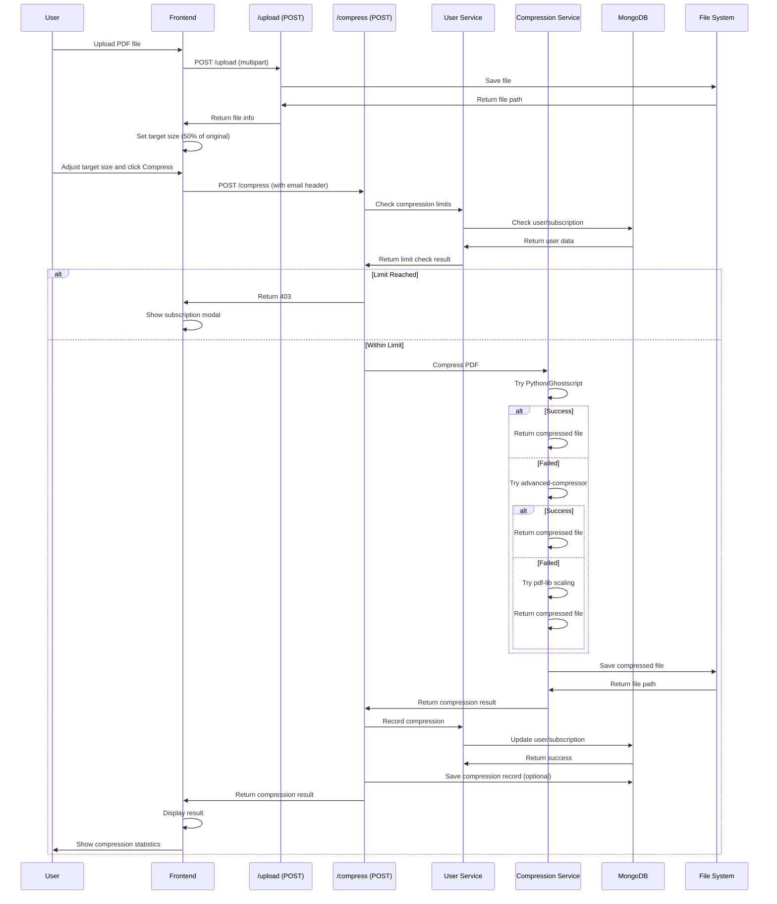
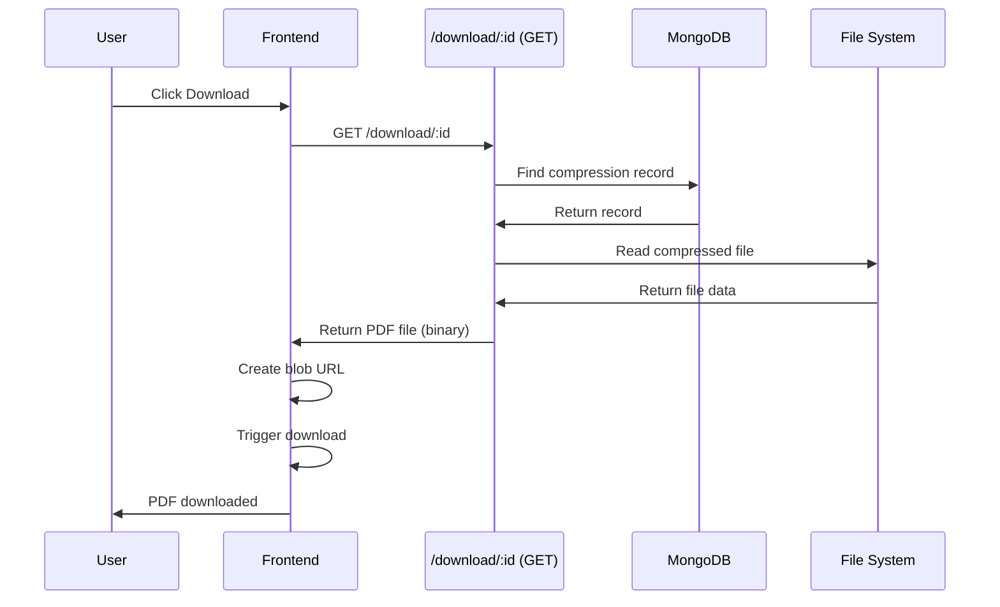

# Feature: PDF Compressor

## Overview

**Purpose**: The PDF Compressor is a free tool that allows users to reduce PDF file sizes by compressing them to a target file size. It includes subscription plans for unlimited compressions, email-based user tracking, and multiple compression methods for optimal results.

**User Story**: As a user (job seeker or employer), I want to compress PDF files to reduce their size so that I can upload them more easily or share them more efficiently.

**Key Functionality**:
- PDF file upload (drag & drop or click to browse)
- Email collection (stored in localStorage)
- Target file size selection (slider with MB range)
- PDF compression with multiple methods (Python/Ghostscript, pdf-lib, advanced-compressor)
- Compression result display (original size, compressed size, compression ratio)
- Download compressed PDF
- Free tier (1 compression per day)
- Subscription plans (Daily, Monthly, Yearly)
- Payment integration for subscriptions
- Usage tracking and limits
- Google OAuth callback (for Google Drive integration)
- PDF Dashboard integration
- Error handling for missing compression tools
- Installation guidance for required tools

**Access Level**: Public (No authentication required, but email required)

**URL Path**: `/compress-pdf`

**Sub-paths**:
- `/compress-pdf/callback` - Google OAuth callback

**Authentication Required**: No (but email required for compression)

---

## User Flow

### Primary Flow - Compress PDF
1. User navigates to `/compress-pdf`
2. **Email Collection** (if not already collected):
   - Email input modal shown
   - User enters email
   - Email saved to localStorage
3. **File Upload**:
   - User drags & drops PDF or clicks to browse
   - File validated (PDF only, max 100MB)
   - File uploaded to server
   - Upload success shown
4. **Compression Settings**:
   - Target size slider shown (default: 50% of original size)
   - User adjusts target size (0.1 MB to file size or 10 MB, whichever is larger)
   - User clicks "Compress PDF"
5. **Compression Process**:
   - Usage limit checked (free: 1/day, subscription: based on plan)
   - If limit reached: Subscription modal shown
   - If within limit: Compression starts
   - Multiple compression methods tried (best result used)
   - Compression result displayed
6. **Download**:
   - User views compression statistics
   - User clicks "Download Compressed PDF"
   - PDF file downloaded

### Subscription Flow
1. User reaches compression limit
2. Subscription modal opens
3. User views available plans (Daily, Monthly, Yearly)
4. User selects plan
5. Payment form opens
6. User enters payment details
7. Subscription created
8. Compression retried automatically

### Google OAuth Flow (Future)
1. User clicks Google Drive integration
2. Redirected to Google OAuth
3. User authorizes access
4. Callback received at `/compress-pdf/callback`
5. Google Drive files accessible

---

## Frontend Implementation

### Screen Structure

**Main Page Component**:
- File: `frontend/src/app/compress-pdf/page.jsx`
- Type: Client Component
- Lines: ~631 lines

**Styling**:
- CSS File: `frontend/src/app/compress-pdf/compress.css`
- CSS Modules: No
- Responsive: Yes

**OAuth Callback**:
- File: `frontend/src/app/compress-pdf/callback/page.jsx`
- Component: `GoogleOAuthCallbackClient.jsx`

### Component Hierarchy

```
CompressPdfPage (page.jsx - Client Component)
  ├── Header
  │   ├── Title and Description
  │   └── PDF Dashboard Button
  ├── Email Input Modal (conditional)
  │   ├── Close Button
  │   ├── Title and Description
  │   ├── Email Input
  │   └── Submit Button
  ├── Upload Area Card
  │   └── Dropzone
  │       ├── Upload Icon
  │       ├── Upload Text
  │       ├── File Info (if uploaded)
  │       └── Remove File Button
  ├── Compression Settings Card (conditional)
  │   ├── Settings Title
  │   ├── Target Size Slider
  │   │   ├── Label and Value Display
  │   │   ├── Range Slider
  │   │   └── Min/Max Labels
  │   └── Compress Button
  ├── Compression Result Card (conditional)
  │   ├── Result Title
  │   ├── Statistics
  │   │   ├── Original Size
  │   │   ├── Compressed Size
  │   │   └── Compression Ratio
  │   └── Action Buttons
  │       ├── Download Button
  │       └── Compress Another Button
  ├── Subscription Modal (conditional)
  │   ├── Close Button
  │   ├── Title and Description
  │   └── Plan Cards Grid
  │       └── Plan Cards (Daily, Monthly, Yearly)
  │           ├── Plan Name
  │           ├── Plan Price
  │           ├── Plan Duration
  │           ├── Compressions Allowed
  │           └── Subscribe Button
  └── Payment Form Modal (conditional)
      └── PaymentForm Component
```

### State Management

**File State**:
```javascript
const [uploadedFile, setUploadedFile] = useState(null);
const [uploading, setUploading] = useState(false);
const [compressing, setCompressing] = useState(false);
const [compressionResult, setCompressionResult] = useState(null);
```

**Settings State**:
```javascript
const [targetSizeMB, setTargetSizeMB] = useState(1); // Always in MB
```

**Email State**:
```javascript
const [userEmail, setUserEmailState] = useState('');
const [showEmailInput, setShowEmailInput] = useState(false);
```

**Subscription State**:
```javascript
const [showSubscriptionModal, setShowSubscriptionModal] = useState(false);
const [subscriptionPlans, setSubscriptionPlans] = useState([]);
const [selectedPlan, setSelectedPlan] = useState(null);
const [showPaymentForm, setShowPaymentForm] = useState(false);
const [subscribing, setSubscribing] = useState(false);
```

### File Upload

**Implementation**:
- Uses `react-dropzone` library
- Drag & drop support
- Click to browse support
- File validation (PDF only, max 100MB)
- Single file upload only

**Dropzone Configuration**:
```javascript
const { getRootProps, getInputProps, isDragActive } = useDropzone({
    onDrop,
    accept: {
        'application/pdf': ['.pdf'],
    },
    multiple: false,
});
```

**Upload Process**:
1. File validated (type, size)
2. File uploaded via `pdfApi.upload()`
3. File info stored in state
4. Target size initialized (50% of original, minimum 0.1 MB)
5. Success toast shown

### Compression Settings

**Target Size Slider**:
- Min value: 0.1 MB (fixed)
- Max value: File size or 10 MB, whichever is larger
- Step: 0.1 MB
- Default: 50% of original file size (minimum 0.1 MB)
- Real-time value display

**Slider Calculation**:
```javascript
const getMaxSliderValue = () => {
    if (!uploadedFile) return 10;
    const fileSizeMB = uploadedFile.size / (1024 * 1024);
    return Math.max(Math.ceil(fileSizeMB), 10);
};
```

### Compression Process

**Compression Flow**:
1. Validate uploaded file exists
2. Validate target size
3. Check email (from localStorage)
4. Re-upload file (if needed)
5. Call compression API with:
   - File ID
   - File path
   - Original filename and size
   - Compression type: 'fileSize'
   - Target size (value and unit: MB)
   - Email
6. Display result or handle errors

**Error Handling**:
- 403 (Limit reached): Show subscription modal
- 400 (Email required): Show email input modal
- 400 (Tools missing): Show installation links
- 500 (Server error): Show error message
- Network errors: Show error message

### Compression Result

**Statistics Display**:
- Original Size (formatted in MB)
- Compressed Size (formatted in MB)
- Compression Ratio (percentage)

**Actions**:
- Download compressed PDF
- Compress another PDF (reset form)

### Subscription Plans

**Plan Types**:
- **Daily**: ₹10, 10 compressions, 1 day duration
- **Monthly**: ₹249, 300 compressions, 30 days duration
- **Yearly**: ₹2199, 3600 compressions, 365 days duration

**Plan Selection**:
- User clicks plan card
- Payment form opens
- User enters payment details
- Subscription created
- Compression retried automatically

### Email Management

**Storage**:
- Email stored in localStorage
- Key: `pdf_compression_user_email`
- Normalized (lowercase, trimmed)

**Email Utilities** (`pdfUserId.js`):
- `getUserEmail()`: Get email from localStorage
- `setUserEmail(email)`: Save email to localStorage
- `clearUserEmail()`: Remove email from localStorage
- `ensureUserEmail()`: Get email (alias for getUserEmail)

**Email in Requests**:
- Email sent via `x-user-email` header
- Also included in request body as fallback
- Required for compression operations

### API Integration

**PDF API Client** (`pdfApi.js`):
```javascript
// Upload PDF
pdfApi.upload(file)

// Compress PDF
pdfApi.compress(compressData)

// Download PDF
pdfApi.download(id)

// Get history
pdfApi.getHistory()

// Get stats
pdfApi.getStats()

// Get plans
pdfApi.getPlans()

// Create subscription
pdfApi.createSubscription(data)
```

**Request Interceptor**:
- Automatically adds `x-user-email` header to all requests
- Gets email from localStorage or request body

---

## Backend Implementation

### API Endpoints

#### Upload PDF

**Route Definition**:
```javascript
router.post('/upload', upload.single('pdf'), pdfController.uploadPdf);
```

**Full Endpoint Path**: `/api/pdf/upload`

**HTTP Method**: POST

**Authentication Required**: No

**Request**: Multipart form data with PDF file

**Response Format**:
```json
{
  "success": true,
  "message": "PDF uploaded successfully",
  "file": {
    "originalFilename": "document.pdf",
    "originalPath": "/uploads/pdf/uuid-filename.pdf",
    "originalSize": 1024000,
    "mimetype": "application/pdf"
  }
}
```

**Controller Logic** (`uploadPdf`):
1. Validate file exists
2. Return file information
3. File stored in `uploads/pdf/` directory
4. Filename: `{uuid}-{originalname}`

#### Compress PDF

**Route Definition**:
```javascript
router.post('/compress', validateCompressRequest, pdfController.compressPdf);
```

**Full Endpoint Path**: `/api/pdf/compress`

**HTTP Method**: POST

**Authentication Required**: No (but email required)

**Request Body**:
```json
{
  "fileId": "uuid-filename.pdf",
  "filePath": "/uploads/pdf/uuid-filename.pdf",
  "originalFilename": "document.pdf",
  "originalSize": 1024000,
  "compressionType": "fileSize",
  "email": "user@example.com",
  "settings": {
    "targetSize": {
      "value": 0.5,
      "unit": "MB"
    }
  }
}
```

**Response Format**:
```json
{
  "success": true,
  "message": "PDF compressed successfully",
  "compression": {
    "id": "compression-id",
    "originalSize": 1024000,
    "compressedSize": 512000,
    "compressionRatio": "50.00",
    "downloadUrl": "/api/pdf/download/compression-id",
    "filename": "compressed_uuid.pdf",
    "filePath": "/compressed/pdf/compressed_uuid.pdf"
  }
}
```

**Controller Logic** (`compressPdf`):
1. Validate request (fileId, compressionType, settings)
2. Get email from request (header or body)
3. Check compression limits (`canUserCompress`)
4. If limit reached: Return 403 with subscription prompt
5. Validate file exists
6. Create compression record (optional, with timeout)
7. Compress PDF using compression service
8. Record compression usage
9. Update compression record
10. Return compression result

**Error Handling**:
- Missing tools (Ghostscript/Python): 400 with installation links
- Limit reached: 403 with subscription prompt
- Email required: 400 with email prompt
- File not found: 404
- Compression failures: 500 with error message

#### Download PDF

**Route Definition**:
```javascript
router.get('/download/:id', pdfController.downloadPdf);
```

**Full Endpoint Path**: `/api/pdf/download/:id`

**HTTP Method**: GET

**Authentication Required**: No

**Response**: Binary PDF file

**Controller Logic** (`downloadPdf`):
1. Find compression record by ID
2. Get compressed file path
3. Check file exists
4. Set response headers (Content-Type, Content-Disposition)
5. Send file

#### Get Compression History

**Route Definition**:
```javascript
router.get('/history', pdfController.getCompressionHistory);
```

**Full Endpoint Path**: `/api/pdf/history`

**HTTP Method**: GET

**Authentication Required**: No (but email required)

**Response Format**:
```json
{
  "success": true,
  "data": [
    {
      "id": "...",
      "originalFilename": "...",
      "originalSize": 1024000,
      "compressedSize": 512000,
      "compressionRatio": 50.00,
      "createdAt": "2024-01-01T12:00:00Z"
    }
  ]
}
```

### Subscription Endpoints

#### Get Plans

**Route Definition**:
```javascript
router.get('/plans', subscriptionController.getPlans);
```

**Full Endpoint Path**: `/api/subscription/plans`

**HTTP Method**: GET

**Authentication Required**: No

**Response Format**:
```json
{
  "success": true,
  "plans": [
    {
      "type": "daily",
      "name": "Daily Plan",
      "amount": 10,
      "duration": "1 day",
      "compressionsAllowed": 10,
      "description": "..."
    },
    // ... monthly, yearly
  ]
}
```

#### Create Subscription

**Route Definition**:
```javascript
router.post('/create', subscriptionController.createSubscription);
```

**Full Endpoint Path**: `/api/subscription/create`

**HTTP Method**: POST

**Authentication Required**: No (but email required)

**Request Body**:
```json
{
  "planType": "monthly",
  "paymentData": {
    "cardNumber": "...",
    "cardHolderName": "...",
    "expiryMonth": "...",
    "expiryYear": "...",
    "cvv": "..."
  }
}
```

**Response Format**:
```json
{
  "success": true,
  "message": "Subscription activated successfully",
  "subscription": {
    "id": "...",
    "planType": "monthly",
    "totalAllowed": 300,
    "used": 0,
    "remaining": 300,
    "amount": 249,
    "startDate": "2024-01-01T12:00:00Z",
    "endDate": "2024-01-31T12:00:00Z",
    "transactionId": "...",
    "status": "active"
  }
}
```

#### Get User Stats

**Route Definition**:
```javascript
router.get('/stats', subscriptionController.getUserStats);
```

**Full Endpoint Path**: `/api/subscription/stats`

**HTTP Method**: GET

**Authentication Required**: No (but email required)

**Response Format**:
```json
{
  "success": true,
  "stats": {
    "dailyCompressionsUsed": 1,
    "dailyCompressionsRemaining": 0,
    "totalCompressionsUsed": 10,
    "isFree": false,
    "subscription": {
      "planType": "monthly",
      "totalAllowed": 300,
      "used": 10,
      "remaining": 290,
      "startDate": "2024-01-01T12:00:00Z",
      "endDate": "2024-01-31T12:00:00Z",
      "status": "active",
      "amount": 249
    },
    "allSubscriptions": [...]
  }
}
```

### Compression Service

**Service File**: `backend/src/services/pdfCompressionService.js`

**Compression Methods** (tried in order):

1. **Python/Ghostscript** (Best quality):
   - Uses Python script with Ghostscript
   - Quality presets: screen, ebook, printer
   - Best compression results
   - Requires Python and Ghostscript installed

2. **Advanced PDF Compressor** (If available):
   - Uses `advanced-pdf-compressor` package
   - Good compression results
   - Fallback if Python unavailable

3. **PDF-lib Scaling** (Fallback):
   - Uses `pdf-lib` library
   - Scales PDF pages
   - Iterative approach to reach target size
   - Works without external tools

4. **Image-based Compression** (If needed):
   - Converts PDF pages to images
   - Compresses images
   - Rebuilds PDF
   - More aggressive compression

**Compression Strategy**:
- Try methods in order of quality
- Use best result (smallest file size)
- Target size tolerance: ±10%
- Maximum iterations: 15 (for iterative methods)

### User Service

**Service File**: `backend/src/services/pdfUserService.js`

**User Management**:
- Get or create user by email
- Track daily compression count
- Reset daily count at midnight
- Track total compressions

**Compression Limits**:
- **Free tier**: 1 compression per day
- **Subscription**: Based on plan (10, 300, or 3600 compressions)
- Auto-activate next subscription when current expires

**Usage Tracking**:
- Record each compression
- Update daily count
- Update subscription usage
- Track total compressions

### Database Models

**PdfUser Model** (`backend/src/models/pdfUser.js`):
- `email`: String (required, unique, lowercase)
- `dailyCompressionCount`: Number (default: 0)
- `lastCompressionDate`: Date
- `totalCompressionsUsed`: Number (default: 0)
- `activeSubscriptionId`: ObjectId (ref: PdfSubscription)

**PdfSubscription Model** (`backend/src/models/pdfSubscription.js`):
- `userId`: ObjectId (ref: PdfUser)
- `planType`: String (enum: daily, monthly, yearly)
- `totalCompressionsAllowed`: Number
- `compressionsUsed`: Number (default: 0)
- `amount`: Number
- `paymentStatus`: String
- `transactionId`: String
- `startDate`: Date
- `endDate`: Date
- `status`: String (enum: active, pre-subscribed, expired)

**PdfCompression Model** (`backend/src/models/pdfCompression.js`):
- `originalFilename`: String
- `originalPath`: String
- `originalSize`: Number
- `compressedFilename`: String
- `compressedPath`: String
- `compressedSize`: Number
- `compressionType`: String (enum: fileSize)
- `compressionSettings`: Object
- `compressionRatio`: Number
- `status`: String (enum: pending, processing, completed, failed)
- `error`: String
- `createdAt`: Date
- `updatedAt`: Date

### Middleware

**File Upload Middleware**:
- `multer` configured for PDF files only
- Max file size: 100MB
- Storage: `uploads/pdf/` directory
- Filename: `{uuid}-{originalname}`

**Validation Middleware**:
- `validateCompressRequest`: Validates compression request body
- Checks compressionType (must be 'fileSize')
- Checks settings object

---

## Data Flow

### Compress PDF Flow



### Download Flow



---

## Error Handling

### Frontend Error Handling

**Upload Errors**:
- Invalid file type: Error toast shown
- File too large: Error toast shown
- Upload failure: Error toast shown

**Compression Errors**:
- 403 (Limit reached): Subscription modal shown
- 400 (Email required): Email input modal shown
- 400 (Tools missing): Error toast with installation links
- 500 (Server error): Error toast shown
- Network errors: Error toast shown

**Download Errors**:
- File not found: Error toast shown
- Download failure: Error toast shown

### Backend Error Handling

**Validation Errors**:
- Missing fields: 400 Bad Request
- Invalid compression type: 400 Bad Request
- Invalid file: 400 Bad Request

**Resource Errors**:
- Compression limit reached: 403 Forbidden
- File not found: 404 Not Found
- Compression record not found: 404 Not Found

**Compression Errors**:
- Missing tools (Ghostscript/Python): 400 Bad Request with installation links
- Compression failures: 500 Internal Server Error
- File system errors: 500 Internal Server Error

**Database Errors**:
- MongoDB connection failures: Logged but don't block compression
- Timeout protection: 5-second timeout for DB operations
- Fail-open approach: Compression continues even if DB fails

**Status Codes**:
- 200: Success
- 400: Bad Request (validation, missing tools)
- 403: Forbidden (limit reached)
- 404: Not Found (file, record)
- 500: Internal Server Error

---

## Security Features

### Data Protection
- File uploads validated (type, size)
- Email normalized and validated
- File paths sanitized
- XSS protection via React's built-in escaping
- CSRF protection via same-origin policy

### Usage Limits
- Free tier: 1 compression per day (email-based)
- Subscription: Based on plan
- Limits enforced server-side
- Daily count reset at midnight

### File Storage
- Files stored in secure directories
- Unique filenames (UUID-based)
- Temporary storage (can be cleaned up)
- Compressed files in separate directory

---

## UI/UX Details

### Layout Structure

**Page Sections** (in order):
1. Header (title, description, dashboard button)
2. Email input modal (conditional, overlay)
3. Upload area card
4. Compression settings card (conditional)
5. Compression result card (conditional)
6. Subscription modal (conditional, overlay)
7. Payment form modal (conditional, overlay)

### Visual Design

**Upload Area**:
- Large dropzone with drag & drop support
- Visual feedback when dragging
- File info display when uploaded
- Remove file button

**Slider**:
- Custom styled range slider
- Real-time value display
- Min/max labels
- Progress indicator

**Result Display**:
- Statistics cards (original, compressed, ratio)
- Color-coded values (success for compressed size)
- Download button (prominent)
- Compress another button (secondary)

**Modals**:
- Overlay background (semi-transparent)
- Centered modal layout
- Clear header with close button
- Scrollable body (if needed)

### Responsive Design

**Desktop**:
- Spacious card layout
- Full-width upload area
- Clear section separation

**Tablet**:
- Maintained spacing
- Responsive modals

**Mobile**:
- Full-width cards
- Touch-friendly targets
- Optimized spacing
- Full-screen modals

### Accessibility

**Keyboard Navigation**:
- Tab order logical
- All interactive elements keyboard accessible
- Modal focus trap
- Escape key closes modals

**Screen Reader Support**:
- Semantic HTML elements
- ARIA labels where needed
- Button states announced
- Modal roles and labels

**Visual Indicators**:
- Loading states (spinners)
- Success states (checkmarks)
- Error states (error messages)
- Disabled states
- Focus states

---

## Testing Considerations

### Test Scenarios

**Happy Path**:
1. Upload PDF → File uploaded → Settings shown
2. Compress PDF → Compression successful → Result shown → Download works
3. Subscribe → Plan selected → Payment → Subscription active → Compression retried

**Error Cases**:
1. Invalid file type → Error shown
2. File too large → Error shown
3. Limit reached → Subscription modal shown
4. Missing email → Email modal shown
5. Compression failure → Error shown
6. Download failure → Error shown

**Edge Cases**:
1. Very small PDF → Compression works
2. Very large PDF → Compression works (within limits)
3. Already compressed PDF → Compression still works
4. Multiple rapid uploads → Only latest processed
5. Network interruption → Error shown, can retry

---

## Related Features

- **Free Tools** (`/free-tools`): Listed as available tool
- **PDF Dashboard** (`/pdf-dashboard`): View compression history and stats
- **Google OAuth** (`/compress-pdf/callback`): Google Drive integration

---

## Additional Notes

**Dependencies**:
- `react-dropzone`: File upload with drag & drop
- `pdf-lib`: PDF manipulation (fallback compression)
- `sharp`: Image processing (if needed)
- `pdf2pic`: PDF to image conversion (if needed)
- `advanced-pdf-compressor`: Advanced compression (if available)
- Python: External dependency for best compression
- Ghostscript: External dependency for best compression
- `axios`: HTTP client
- `react-hot-toast`: Toast notifications
- `lucide-react`: Icons

**Compression Methods**:
- **Primary**: Python/Ghostscript (best quality, requires installation)
- **Secondary**: Advanced PDF Compressor (if package available)
- **Fallback**: PDF-lib scaling (works without external tools)
- **Last Resort**: Image-based compression (most aggressive)

**File Storage**:
- Uploads: `uploads/pdf/` directory
- Compressed: `compressed/pdf/` directory
- Files can be cleaned up periodically

**Usage Limits**:
- Free: 1 compression per day (email-based tracking)
- Daily Plan: 10 compressions, 1 day
- Monthly Plan: 300 compressions, 30 days
- Yearly Plan: 3600 compressions, 365 days

**Known Limitations**:
- Requires external tools (Python/Ghostscript) for best compression
- File size limit: 100MB
- Compression may not always reach exact target size
- Database operations have timeout (5 seconds)

**Future Enhancements**:
- Google Drive integration (OAuth callback ready)
- Batch compression
- Compression quality presets
- Compression history page
- File sharing
- Compression analytics
- More compression methods
- Cloud storage integration
- API for programmatic access
- Webhook notifications
- Compression scheduling
- File format conversion
- PDF merging
- PDF splitting
- PDF watermarking

---

## Code References

### Frontend Files
- `frontend/src/app/compress-pdf/page.jsx` - Main component (~631 lines)
- `frontend/src/app/compress-pdf/compress.css` - Styling
- `frontend/src/app/compress-pdf/callback/page.jsx` - OAuth callback
- `frontend/src/lib/pdfApi.js` - API client (~112 lines)
- `frontend/src/lib/pdfUserId.js` - Email management utility (~28 lines)
- `frontend/src/components/PaymentForm.jsx` - Payment form component

### Backend Files
- `backend/src/routes/pdfRoutes.js` - Route definitions:
  - Line 62: POST `/upload` (upload PDF)
  - Line 63: POST `/compress` (compress PDF)
  - Line 64: GET `/download/:id` (download PDF)
  - Line 65: GET `/history` (get history)
- `backend/src/routes/pdfSubscriptionRoutes.js` - Subscription routes:
  - Line 7: POST `/create` (create subscription)
  - Line 8: GET `/stats` (get user stats)
  - Line 9: GET `/plans` (get plans)
- `backend/src/controllers/pdfController.js` - Controller functions:
  - `uploadPdf` (lines 12-41)
  - `compressPdf` (lines 46-275)
  - `downloadPdf` (lines 280-310)
  - `getCompressionHistory` (if implemented)
- `backend/src/controllers/pdfSubscriptionController.js` - Subscription controller:
  - `createSubscription` (lines 9-141)
  - `getUserStats` (lines 146+)
  - `getPlans` (if implemented)
- `backend/src/services/pdfCompressionService.js` - Compression service (~1245 lines)
- `backend/src/services/pdfUserService.js` - User service (~311 lines)
- `backend/src/models/pdfUser.js` - PdfUser model
- `backend/src/models/pdfSubscription.js` - PdfSubscription model
- `backend/src/models/pdfCompression.js` - PdfCompression model (~67 lines)

---

*Last Updated: [Current Date]*
*Documented By: TSD Documentation System*

