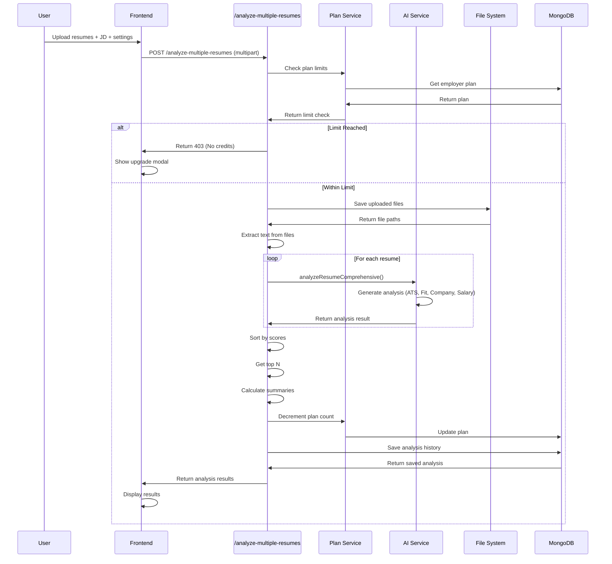
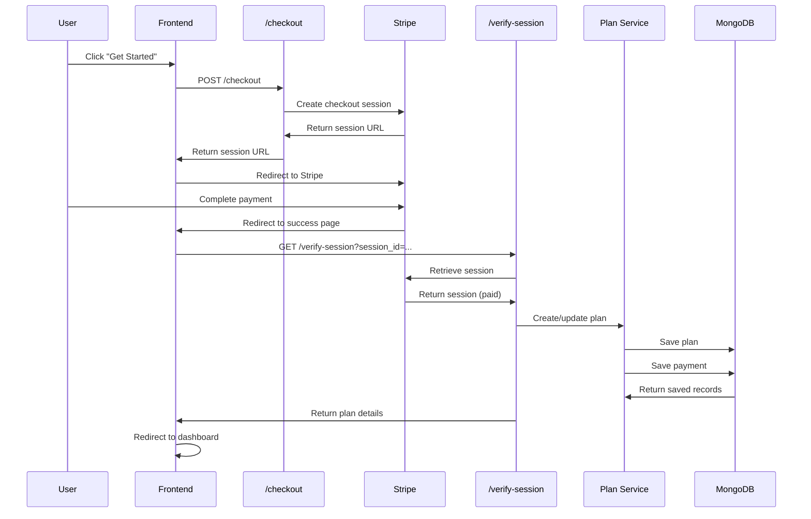

# Feature: Smart Select

## Overview

**Purpose**: Smart Select is an AI-powered resume analysis tool for employers that enables comprehensive candidate evaluation through automated resume screening, ATS scoring, job matching, company trajectory analysis, and salary benchmarking. It helps employers identify the best candidates from multiple resumes efficiently.

**User Story**: As an employer, I want to analyze multiple candidate resumes against a job description using AI, so that I can quickly identify top candidates with ATS scores, job match percentages, company fit, and salary estimates.

**Key Functionality**:
- Upload multiple resumes (PDF, DOCX) for batch analysis
- Upload or generate job descriptions
- AI-powered comprehensive resume analysis:
  - ATS (Applicant Tracking System) scoring
  - Job match scoring (fit score)
  - Company trajectory matching (Startup, Mid-size, Enterprise)
  - Salary benchmarking and estimation
  - Candidate pros/cons identification
  - Skills matching and keyword analysis
  - Issues identification (critical, warning, info)
  - Career progression analysis
- Top N candidate ranking and recommendation
- Side-by-side candidate comparison
- Multiple view modes (Summary, Skills, Comparison)
- Report generation and export (PDF, Excel, DOC)
- Plan-based subscription system (Basic, Premium, Organization)
- Multiple plan support with active plan switching
- Analysis history tracking
- Payment integration via Stripe
- Transaction history

**Access Level**: Employer only (Authentication required)

**URL Paths**:
- `/employer/smart-select` - Landing/Pricing page
- `/employer/smart-select?upgrade-plan` - Pricing page (upgrade mode)
- `/employer/smart-select/dashboard` - Dashboard (auto-redirected if plan exists)
- `/employer/smart-select/analyze` - Analyze page
- `/employer/smart-select/analyze?analysisId={id}` - View previous analysis
- `/employer/smart-select/transactions` - Payment transactions page

**Authentication Required**: Yes (Employer JWT token)

---

## User Flow

### Primary Flow - Purchase Plan and Analyze Resumes
1. **Landing/Pricing Page** (`/employer/smart-select`):
   - User views plan options (Basic, Premium, Organization)
   - User views features, benefits, and FAQs
   - User clicks "Get Started" or "Choose Plan"
2. **Payment Flow**:
   - Checkout session created
   - Redirect to Stripe payment page
   - Payment completed
   - Redirect to success page
   - Plan activated automatically
3. **Dashboard** (`/employer/smart-select/dashboard`):
   - User views plan details and remaining analyses
   - User views analysis history
   - User can switch active plan (if multiple plans)
   - User clicks "Analyze Resume"
4. **Analyze Page** (`/employer/smart-select/analyze`):
   - **Input Section**:
     - User uploads resume files (multiple PDF/DOCX)
     - User uploads or generates job description (optional, based on plan)
     - User sets Top N candidates (optional)
     - User enables advanced options (Company Trajectory, Salary Benchmarking - based on plan)
   - **Analysis Process**:
     - User clicks "Analyze"
     - Usage limits checked
     - Files uploaded and processed
     - AI analysis runs (progress indicators shown)
     - Results displayed
   - **Results Section**:
     - Summary view: Statistics, charts, top candidates
     - Skills view: Skills comparison across candidates
     - Comparison view: Side-by-side candidate comparison
     - User can download reports (PDF, Excel, DOC - based on plan)
     - User can view individual resume details

### View Previous Analysis Flow
1. User navigates to dashboard
2. User clicks "View" on a previous analysis
3. Analysis loaded from history
4. Results displayed (same as new analysis)

### Plan Management Flow
1. User has multiple plans (e.g., Premium and Organization)
2. User views dashboard
3. User selects active plan from dropdown
4. Plan switched, counts updated
5. User can analyze using selected plan's features

---

## Frontend Implementation

### Screen Structure

**Main Landing/Pricing Page**:
- File: `frontend/src/app/employer/(screens)/smart-select/page.jsx`
- Component: `SmartSelectPageClient.jsx`
- Type: Client Component

**Dashboard**:
- File: `frontend/src/app/employer/(screens)/smart-select/dashboard.jsx`
- Type: Client Component

**Analyze Page**:
- File: `frontend/src/app/employer/(screens)/smart-select/analyze/page.jsx`
- Type: Client Component
- Lines: ~3200+ lines (very complex)

**Transactions Page**:
- File: `frontend/src/app/employer/(screens)/smart-select/transactions/page.jsx`
- Component: `TransactionsPageClient.jsx`
- Type: Client Component

**Styling**:
- CSS Files:
  - `page.css` - Landing page styling
  - `dashboard.css` - Dashboard styling
  - `analyze/page.css` - Analyze page styling
  - `transactions/page.css` - Transactions page styling

### Component Hierarchy

```
SmartSelectPage (page.jsx)
  └── SmartSelectPageClient
      ├── Hero Section
      ├── Features Section
      ├── Pricing Section
      │   └── Plan Cards (Basic, Premium, Organization)
      ├── FAQ Section
      └── Footer

SmartSelectDashboard (dashboard.jsx)
  ├── Header (Title, Analyze Button)
  ├── Stats Grid
  │   ├── Analyses Remaining Card
  │   ├── Total Transactions Card
  │   └── Plan Type Card
  ├── Analysis History Section
  │   └── History List
  │       └── History Items
  │           ├── Analysis Info
  │           ├── Top Resumes Preview
  │           └── View Button
  └── Plan Details Card
      ├── Plan Switcher (if multiple plans)
      ├── Plan Details
      └── Action Buttons

SmartSelectAnalyze (analyze/page.jsx)
  ├── Header (Title, Back Button)
  ├── Sidebar (History Drawer)
  │   └── Analysis History List
  ├── Main Content
  │   ├── Input Section
  │   │   ├── Resume Upload Area
  │   │   ├── Job Description Section
  │   │   │   ├── JD Input/Upload
  │   │   │   └── AI JD Generator (conditional)
  │   │   ├── Top N Input
  │   │   └── Advanced Options (conditional)
  │   │       ├── Company Trajectory
  │   │       └── Salary Benchmarking
  │   ├── Analyze Button
  │   ├── Progress Section (conditional)
  │   │   └── Progress Steps
  │   └── Results Section (conditional)
  │       ├── View Mode Selector (Summary, Skills, Comparison)
  │       ├── Summary View
  │       │   ├── Statistics Cards
  │       │   ├── Charts (ATS, Company Fit, Salary)
  │       │   ├── Top Candidates List
  │       │   └── Download Buttons
  │       ├── Skills View
  │       │   ├── Required Skills List
  │       │   └── Candidate Skills Comparison
  │       └── Comparison View
  │           ├── Career Progression Chart
  │           └── Side-by-Side Comparison
  └── Modals
      ├── No Credits Modal
      ├── Upgrade Modal
      ├── Report Generation Modal
      └── JD Generator Modal

SmartSelectTransactions (transactions/page.jsx)
  ├── Header (Title, Back Button)
  ├── Filters
  │   ├── Search Input
  │   ├── Status Filter
  │   └── Date Filter
  └── Transactions List
      └── Transaction Items
```

### State Management

**Plan and Configuration State**:
- Fetched via React Query hooks:
  - `useSmartSelectPlan()` - Current plan and usage
  - `useSmartSelectPlanConfig()` - Plan configurations and features
  - `useSmartSelectPayments()` - Payment history
  - `useSmartSelectAnalysisHistory()` - Analysis history
  - `useUpdateActivePlan()` - Mutation for switching active plan

**Analyze Page State** (Complex):
```javascript
// Files
const [resumes, setResumes] = useState([]);
const [jdFile, setJdFile] = useState(null);

// Job Description
const [jobDesc, setJobDesc] = useState("");
const [generatedJD, setGeneratedJD] = useState("");
const [generatingJD, setGeneratingJD] = useState(false);

// Settings
const [topN, setTopN] = useState("");
const [companyType, setCompanyType] = useState("startup");
const [companyComparisonEnabled, setCompanyComparisonEnabled] = useState(false);
const [salaryBenchmarkEnabled, setSalaryBenchmarkEnabled] = useState(false);
const [salaryUseJobDescription, setSalaryUseJobDescription] = useState(false);
const [salaryRole, setSalaryRole] = useState("");
const [salaryLocation, setSalaryLocation] = useState("");
const [salaryExperience, setSalaryExperience] = useState("");

// Analysis
const [analyzing, setAnalyzing] = useState(false);
const [stepIndex, setStepIndex] = useState(0);
const [progress, setProgress] = useState(0);
const [results, setResults] = useState(null);
const [error, setError] = useState("");

// UI State
const [sidebarOpen, setSidebarOpen] = useState(false);
const [viewMode, setViewMode] = useState('detailed');
const [showNoCreditsModal, setShowNoCreditsModal] = useState(false);
const [showUpgradeModal, setShowUpgradeModal] = useState(false);
const [reportModalOpen, setReportModalOpen] = useState(false);
const [showJobDescriptionModal, setShowJobDescriptionModal] = useState(false);
const [resultsView, setResultsView] = useState('summary');
```

### Plan Configuration

**Plans Available**:
1. **Basic Plan** (₹149):
   - 2 analyses
   - 10 resumes per analysis
   - PDF reports only
   - No advanced features

2. **Premium Plan** (₹1,299):
   - 10 analyses
   - 20 resumes per analysis
   - PDF reports + Excel/DOC export
   - Company Trajectory Match
   - JD Document Upload

3. **Organization Plan** (₹5,999):
   - 50 analyses
   - 200 resumes per analysis
   - All export formats
   - All features:
     - Company Trajectory Match
     - JD Document Upload
     - AI JD Generator
     - Salary Benchmarking
     - Excel & Word Report Export

**Features** (Feature Codes):
- `smart-select-001`: Company Trajectory Match
- `smart-select-002`: Upload JD Document
- `smart-select-003`: Generate AI Job Description
- `smart-select-004`: Salary Benchmarking
- `smart-select-005`: Export Reports (Excel/DOC)

### File Upload

**Resume Upload**:
- Multiple file upload (PDF, DOCX)
- Drag & drop support
- File validation (type, size)
- File preview and removal
- Maximum files based on plan

**JD Upload** (if feature available):
- Single file upload (PDF, DOCX)
- Text extraction
- Display extracted text

### Analysis Process

**Steps** (Progress Indicators):
1. Uploading Resumes
2. Processing Files
3. Analyzing Resumes
4. Calculating Scores
5. Ranking Candidates
6. Generating Reports
7. Finalizing

**Analysis Request**:
- Files uploaded via multipart form data
- Job description (text or extracted from file)
- Top N value (optional)
- Company type (if enabled)
- Salary benchmark settings (if enabled)

### Results Display

**Summary View**:
- Statistics cards (Total resumes, Top candidates, Average scores)
- Charts:
  - ATS Score Chart (Top 5 candidates)
  - Company Fit Chart (if enabled)
  - Salary Chart (if enabled)
  - Issues Pie Chart
  - Cons Frequency Chart
- Top candidates list with scores
- Download buttons (PDF, Excel, DOC - based on plan)

**Skills View**:
- Required skills list (from JD)
- Candidate skills matrix
- Skills matching visualization

**Comparison View**:
- Career progression timeline chart
- Side-by-side candidate comparison
- Detailed candidate cards

### Report Generation

**Report Formats** (Based on plan):
- PDF (all plans)
- Excel/CSV (Premium, Organization)
- Word/DOC (Premium, Organization)

**Report Content**:
- Analysis summary
- Top candidates
- Detailed candidate analyses
- Charts and visualizations
- Statistics

---

## Backend Implementation

### API Endpoints

#### Checkout Session Creation

**Route Definition**:
```javascript
router.post("/smart-select/checkout", verifyToken, smartSelectController.createCheckoutSession);
```

**Full Endpoint Path**: `/api/employer/smart-select/checkout`

**HTTP Method**: POST

**Authentication Required**: Yes (JWT token)

**Request Body**:
```json
{
  "planType": "premium",
  "currency": "inr"
}
```

**Response Format**:
```json
{
  "success": true,
  "url": "https://checkout.stripe.com/...",
  "sessionId": "cs_..."
}
```

**Controller Logic** (`createCheckoutSession`):
1. Validate plan type
2. Get employer details
3. Get plan price from config
4. Create Stripe checkout session
5. Return session URL

#### Verify Checkout Session

**Route Definition**:
```javascript
router.get("/smart-select/verify-session", smartSelectController.verifyCheckoutSession);
```

**Full Endpoint Path**: `/api/employer/smart-select/verify-session`

**HTTP Method**: GET

**Authentication Required**: No (called from payment callback)

**Query Parameters**:
- `session_id`: Stripe checkout session ID

**Response Format**:
```json
{
  "success": true,
  "message": "Payment verified and plan activated",
  "plan": {
    "planType": "premium",
    "analyzeRemaining": 10,
    "planCounts": { "premium": 10 }
  }
}
```

**Controller Logic** (`verifyCheckoutSession`):
1. Validate session ID format
2. Retrieve Stripe session
3. Verify payment status
4. Create or update employer plan
5. Create payment record
6. Return plan details

#### Get Employer Plan

**Route Definition**:
```javascript
router.get("/smart-select/plan", verifyToken, smartSelectController.getEmployerPlan);
```

**Full Endpoint Path**: `/api/employer/smart-select/plan`

**HTTP Method**: GET

**Authentication Required**: Yes

**Response Format**:
```json
{
  "success": true,
  "hasPlan": true,
  "plan": {
    "planType": "premium",
    "analyzeRemaining": 8,
    "planCounts": {
      "premium": 8
    },
    "activePlanType": "premium"
  }
}
```

**Controller Logic** (`getEmployerPlan`):
1. Find employer plan
2. Return plan details and counts
3. Return null if no plan

#### Get Plan Configuration

**Route Definition**:
```javascript
router.get("/smart-select/plan-config", verifyToken, smartSelectController.getPlanConfiguration);
```

**Full Endpoint Path**: `/api/employer/smart-select/plan-config`

**HTTP Method**: GET

**Authentication Required**: Yes

**Response Format**:
```json
{
  "success": true,
  "data": {
    "userPlan": {
      "planCounts": { "premium": 8 },
      "activePlanType": "premium"
    },
    "plans": {
      "basic": { "name": "Basic", "amount": 149, "benefits": {...}, "features": [...] },
      "premium": { ... },
      "organization": { ... }
    },
    "features": {
      "smart-select-001": { "code": "...", "name": "...", "displayName": "..." },
      ...
    }
  }
}
```

**Controller Logic** (`getPlanConfiguration`):
1. Get employer plan
2. Get all plan configs
3. Get feature definitions
4. Return combined configuration

#### Update Active Plan

**Route Definition**:
```javascript
router.put("/smart-select/active-plan", verifyToken, smartSelectController.updateActivePlan);
```

**Full Endpoint Path**: `/api/employer/smart-select/active-plan`

**HTTP Method**: PUT

**Authentication Required**: Yes

**Request Body**:
```json
{
  "activePlanType": "organization"
}
```

**Response Format**:
```json
{
  "success": true,
  "message": "Active plan updated",
  "plan": { ... }
}
```

**Controller Logic** (`updateActivePlan`):
1. Validate plan type
2. Check if plan has counts
3. Update active plan type
4. Return updated plan

#### Analyze Multiple Resumes

**Route Definition**:
```javascript
router.post("/smart-select/analyze-multiple-resumes", verifyToken, uploadSmartSelectFiles, smartSelectController.analyzeMultipleResumes);
```

**Full Endpoint Path**: `/api/employer/smart-select/analyze-multiple-resumes`

**HTTP Method**: POST

**Authentication Required**: Yes

**Request**: Multipart form data
- Files: Resume files (PDF, DOCX)
- `jobDescription`: Job description text (optional)
- `topN`: Number of top candidates (optional)
- `companyType`: Company type for trajectory matching (optional)
- `salaryBenchmarkEnabled`: Boolean (optional)
- `salaryUseJobDescription`: Boolean (optional)
- `salaryBenchmarkRole`: Role for salary benchmarking (optional)
- `salaryBenchmarkLocation`: Location for salary benchmarking (optional)
- `salaryBenchmarkExperience`: Experience years (optional)

**Response Format**:
```json
{
  "success": true,
  "analysisId": "uuid",
  "data": {
    "allAnalyses": [...],
    "topResumes": [...],
    "totalResumes": 10,
    "jobDescription": "...",
    "companyFitSummary": {...},
    "salarySummary": {...}
  }
}
```

**Controller Logic** (`analyzeMultipleResumes`):
1. Validate employer authentication
2. Get employer plan and check limits
3. Validate plan features (company type, salary benchmarking)
4. Process uploaded files (extract text from PDF/DOCX)
5. Extract job description (from text or file)
6. For each resume:
   - Extract text
   - Build analysis context (JD, company type, salary context)
   - Call AI service for comprehensive analysis
   - Store analysis result
7. Sort analyses by fit score or ATS score
8. Get top N resumes
9. Calculate summary statistics:
   - Company fit summary (if enabled)
   - Salary summary (if enabled)
10. Decrement plan count
11. Save analysis to history
12. Return analysis results

#### Get Analysis by ID

**Route Definition**:
```javascript
router.get("/smart-select/analysis/:analysisId", verifyToken, smartSelectController.getAnalysisById);
```

**Full Endpoint Path**: `/api/employer/smart-select/analysis/:analysisId`

**HTTP Method**: GET

**Authentication Required**: Yes

**Response Format**: Same as analyze response

**Controller Logic** (`getAnalysisById`):
1. Find analysis in history
2. Verify employer ownership
3. Return analysis data

#### Get Analysis History

**Route Definition**:
```javascript
router.get("/smart-select/analysis-history", verifyToken, smartSelectController.getAnalysisHistory);
```

**Full Endpoint Path**: `/api/employer/smart-select/analysis-history`

**HTTP Method**: GET

**Authentication Required**: Yes

**Query Parameters**:
- `limit`: Number of results (optional)
- `offset`: Pagination offset (optional)

**Response Format**:
```json
{
  "success": true,
  "data": [
    {
      "analysisId": "uuid",
      "jobDescription": "...",
      "totalResumes": 10,
      "topN": 5,
      "createdAt": "2024-01-01T12:00:00Z",
      "companyFitSummary": {...},
      "salarySummary": {...},
      "topResumes": [...]
    },
    ...
  ]
}
```

**Controller Logic** (`getAnalysisHistory`):
1. Find all analyses for employer
2. Sort by creation date (descending)
3. Return analysis summaries

#### Get Payment History

**Route Definition**:
```javascript
router.get("/smart-select/payments", verifyToken, smartSelectController.getPaymentHistory);
```

**Full Endpoint Path**: `/api/employer/smart-select/payments`

**HTTP Method**: GET

**Authentication Required**: Yes

**Response Format**:
```json
{
  "success": true,
  "payments": [
    {
      "id": "...",
      "planType": "premium",
      "amount": 1299,
      "status": "paid",
      "sessionId": "cs_...",
      "createdAt": "2024-01-01T12:00:00Z"
    },
    ...
  ]
}
```

**Controller Logic** (`getPaymentHistory`):
1. Find all payments for employer
2. Sort by creation date (descending)
3. Return payment list

#### Check Analyzes

**Route Definition**:
```javascript
router.get("/smart-select/check-analyzes", verifyToken, smartSelectController.checkAnalyzes);
```

**Full Endpoint Path**: `/api/employer/smart-select/check-analyzes`

**HTTP Method**: GET

**Authentication Required**: Yes

**Response Format**:
```json
{
  "success": true,
  "canAnalyze": true,
  "analyzeRemaining": 8,
  "planCounts": { "premium": 8 }
}
```

**Controller Logic** (`checkAnalyzes`):
1. Get employer plan
2. Check remaining analyses
3. Return availability status

#### Download Analyzed Resume

**Route Definition**:
```javascript
router.get("/smart-select/download-resume/:analysisId/:fileName", verifyToken, smartSelectController.downloadAnalyzedResume);
```

**Full Endpoint Path**: `/api/employer/smart-select/download-resume/:analysisId/:fileName`

**HTTP Method**: GET

**Authentication Required**: Yes

**Response**: Binary file (PDF or DOCX)

**Controller Logic** (`downloadAnalyzedResume`):
1. Find analysis
2. Verify employer ownership
3. Find resume file path
4. Return file

### AI Analysis Service

**Service File**: `backend/src/services/smartSelectAIService.js`

**Function**: `analyzeResumeComprehensive(resumeText, jobDescription, fileName, companyType, salaryContext)`

**Analysis Components**:

1. **ATS Score** (0-100):
   - Keyword relevance
   - Section completeness
   - Formatting quality
   - Quantified achievements
   - Action verbs usage

2. **Fit Score** (0-100):
   - Job description matching
   - Skills alignment
   - Experience relevance
   - Education matching

3. **Company Context Fit Score** (0-100, if enabled):
   - Company type alignment (Startup, Mid-size, Enterprise)
   - Work style compatibility
   - Growth trajectory match

4. **Salary Estimate** (if enabled):
   - Market median salary
   - Estimated range (min, max)
   - Currency and unit
   - Confidence level
   - Notes

5. **Candidate Information**:
   - Name, email, phone
   - Experience years
   - Current role
   - Location
   - Company history
   - Skills
   - Education
   - Pros (strengths)
   - Cons (weaknesses)
   - Issues (critical, warning, info)
   - Matched keywords
   - Missing keywords
   - Recommendations

**AI Provider**: Together AI or Google Gemini (configurable)

### Database Models

**UserResumeAnalyzePlan Model** (`backend/src/models/userResumeAnalyzePlan.js`):
- `employerId`: ObjectId (ref: Employer, unique)
- `planType`: String (enum: basic, premium, organization)
- `paymentIds`: Array of ObjectIds (ref: Payment)
- `analyzeRemaining`: Number (total remaining analyses)
- `planCounts`: Map (counts per plan type, e.g., { premium: 10, organization: 50 })
- `activePlanType`: String (currently selected plan)
- `createdAt`, `updatedAt`: Date

**ResumeAnalysisHistory Model** (`backend/src/models/resumeAnalysisHistory.js`):
- `analysisId`: String (unique UUID)
- `employerId`: ObjectId (ref: Employer)
- `jobDescription`: String
- `topN`: Number
- `totalResumes`: Number
- `analysesData`: Mixed (full analysis results)
- `topResumesData`: Mixed (top N resumes data)
- `analyzeRemaining`: Number (remaining at time of analysis)
- `createdAt`, `updatedAt`: Date

**Payment Model** (shared, `backend/src/models/payment.js`):
- Used for tracking Smart Select payments
- Links to plan via `paymentIds` array

### Plan Configuration

**Config File**: `backend/src/config/smartSelectPlanConfig.js`

**Plan Prices**:
```javascript
{
  basic: { name: "Basic", amount: 149 },
  premium: { name: "Premium", amount: 1299 },
  organization: { name: "Organization", amount: 5999 }
}
```

**Plan Benefits**:
```javascript
{
  basic: { analyzeCount: 2, resumeLimitPerAnalyze: 10 },
  premium: { analyzeCount: 10, resumeLimitPerAnalyze: 20 },
  organization: { analyzeCount: 50, resumeLimitPerAnalyze: 200 }
}
```

**Plan Features**:
- Basic: No additional features
- Premium: Company Trajectory, JD Upload, Excel/DOC Export
- Organization: All features including AI JD Generator and Salary Benchmarking

### File Upload Middleware

**Middleware**: `uploadSmartSelectFiles`
- Multiple file support
- File types: PDF, DOCX
- Max file size: Configured limit
- Storage: `uploads/smart-select/analyze/{analysisId}/`

---

## Data Flow

### Analyze Resumes Flow



### Payment Flow



---

## Error Handling

### Frontend Error Handling

**Plan Loading Errors**:
- 401 (Unauthorized): Redirect to login
- Network errors: Error toast
- Plan not found: Show "Get Started" screen

**Analysis Errors**:
- 403 (No credits): Show upgrade modal
- 400 (Validation): Show error message
- 413 (File too large): Show file size error
- 500 (Server error): Show generic error

**Payment Errors**:
- Stripe errors: Show payment error message
- Session verification failure: Show error, redirect to pricing

### Backend Error Handling

**Validation Errors**:
- Missing required fields: 400 Bad Request
- Invalid plan type: 400 Bad Request
- File type not supported: 400 Bad Request

**Resource Errors**:
- No plan: 403 Forbidden (or return null)
- Plan limit reached: 403 Forbidden
- Analysis not found: 404 Not Found
- Unauthorized access: 401 Unauthorized

**Processing Errors**:
- File extraction failures: Continue with next file, log error
- AI analysis failures: Return partial results or error
- Database errors: 500 Internal Server Error

**Status Codes**:
- 200: Success
- 400: Bad Request (validation)
- 401: Unauthorized
- 403: Forbidden (limits)
- 404: Not Found
- 500: Internal Server Error

---

## Security Features

### Authentication
- JWT token required for all endpoints (except verify-session)
- Token validated on each request
- Employer ID extracted from token

### Authorization
- Plan ownership verified
- Analysis ownership verified
- File access restricted to owner

### Data Protection
- File uploads validated (type, size)
- File paths sanitized
- XSS protection via React's built-in escaping
- CSRF protection via same-origin policy

### Payment Security
- Stripe handles payment processing
- Session IDs validated
- Payment status verified before plan activation

---

## UI/UX Details

### Landing Page
- Hero section with value proposition
- Features showcase
- Pricing comparison table
- FAQ section
- Call-to-action buttons

### Dashboard
- Clear statistics display
- Analysis history with previews
- Plan details and switcher
- Quick action buttons

### Analyze Page
- Step-by-step progress indicators
- File upload with drag & drop
- Real-time validation
- Multiple view modes
- Interactive charts
- Download options

### Responsive Design
- Mobile-friendly layouts
- Touch-optimized interactions
- Adaptive grid layouts
- Collapsible sections

### Accessibility
- Keyboard navigation
- Screen reader support
- ARIA labels
- Focus management

---

## Testing Considerations

### Test Scenarios

**Happy Path**:
1. Purchase plan → Plan activated → Dashboard shown
2. Upload resumes + JD → Analysis successful → Results displayed
3. View previous analysis → Analysis loaded → Results displayed
4. Download report → Report generated → File downloaded

**Error Cases**:
1. No plan → Upgrade screen shown
2. Limit reached → Upgrade modal shown
3. Invalid file type → Error message shown
4. Analysis failure → Error message shown

**Edge Cases**:
1. Multiple plans → Plan switcher works
2. Large file uploads → Progress shown
3. Network interruption → Error handling
4. Concurrent analyses → Limits enforced

---

## Related Features

- **Smart Post** (`/employer/smart-post`): Related AI feature for job posting
- **Payment Flows** (`/payment-success`, `/payment-cancel`): Shared payment handling
- **Employer Dashboard** (`/employer/home`): Main employer dashboard

---

## Additional Notes

**Dependencies**:
- `@tanstack/react-query`: Data fetching and caching
- `axios`: HTTP client
- `react-hot-toast`: Toast notifications
- `stripe`: Payment processing
- `pdf-parse`: PDF text extraction
- `mammoth`: DOCX text extraction
- `together-ai` or `@google/generative-ai`: AI analysis
- `multer`: File upload handling

**Plan Management**:
- Employers can have multiple plans
- Plans are tracked separately in `planCounts` Map
- Active plan determines feature availability
- Counts decrement from active plan first

**Analysis Storage**:
- Full analysis stored in `ResumeAnalysisHistory`
- Files stored in `uploads/smart-select/analyze/{analysisId}/`
- Files can be cleaned up periodically

**Known Limitations**:
- AI analysis can take time for large batches
- File size limits apply
- Analysis history grows over time
- Concurrent analyses limited by plan

**Future Enhancements**:
- Real-time analysis progress via WebSocket
- Batch analysis scheduling
- Custom scoring weights
- Integration with ATS systems
- Candidate comparison templates
- Automated interview scheduling
- Candidate communication tools
- Analytics dashboard
- Team collaboration features

---

## Code References

### Frontend Files
- `frontend/src/app/employer/(screens)/smart-select/page.jsx` - Landing page
- `frontend/src/app/employer/(screens)/smart-select/SmartSelectPageClient.jsx` - Landing page client component
- `frontend/src/app/employer/(screens)/smart-select/dashboard.jsx` - Dashboard (~700 lines)
- `frontend/src/app/employer/(screens)/smart-select/analyze/page.jsx` - Analyze page (~3200+ lines)
- `frontend/src/app/employer/(screens)/smart-select/transactions/page.jsx` - Transactions page
- `frontend/src/app/employer/(screens)/smart-select/transactions/TransactionsPageClient.jsx` - Transactions client component
- `frontend/src/hooks/useSmartSelect.js` - React Query hooks (~247 lines)

### Backend Files
- `backend/src/routes/employerRoutes.js` - Route definitions:
  - Line 75: POST `/smart-select/checkout`
  - Line 77: GET `/smart-select/verify-session`
  - Line 78: GET `/smart-select/plan`
  - Line 79: GET `/smart-select/plan-config`
  - Line 80: PUT `/smart-select/active-plan`
  - Line 81: GET `/smart-select/payments`
  - Line 82: GET `/smart-select/analysis-history`
  - Line 83: GET `/smart-select/check-analyzes`
  - Line 85: GET `/smart-select/download-resume/:analysisId/:fileName`
  - Line 86: GET `/smart-select/analysis/:analysisId`
  - Line 87: POST `/smart-select/analyze-multiple-resumes`
- `backend/src/controllers/smartSelectController.js` - Controller functions (~1400+ lines)
- `backend/src/services/smartSelectAIService.js` - AI analysis service (~277+ lines)
- `backend/src/config/smartSelectPlanConfig.js` - Plan configuration (~204 lines)
- `backend/src/models/userResumeAnalyzePlan.js` - Plan model (~43 lines)
- `backend/src/models/resumeAnalysisHistory.js` - History model (~50 lines)

---

*Last Updated: [Current Date]*
*Documented By: TSD Documentation System*

