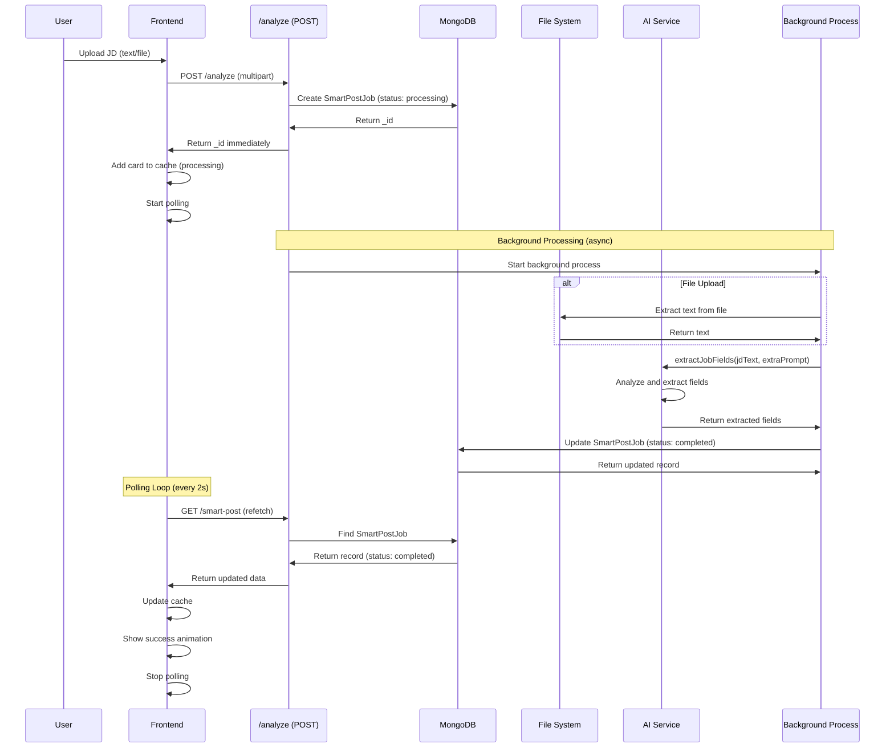
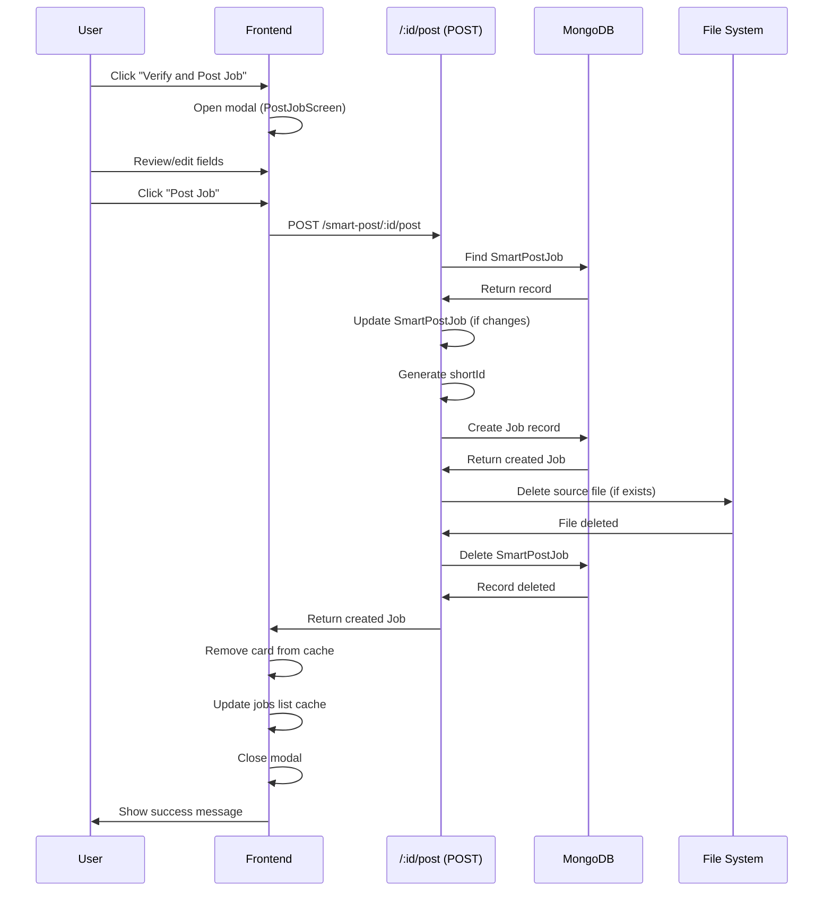

# Feature: Smart Post

## Overview

**Purpose**: Smart Post is an AI-powered job posting tool that automatically extracts and structures job details from job description text or files. Employers can upload job descriptions, and the system uses AI to extract all relevant job fields, creating structured job postings that can be reviewed and posted directly.

**User Story**: As an employer, I want to upload a job description document or paste job description text, so that AI can automatically extract all job details and create a structured job posting that I can review and post.

**Key Functionality**:
- Upload job descriptions as text or files (PDF, DOCX)
- AI-powered field extraction from job descriptions
- Background processing with status tracking (processing, completed, failed)
- Real-time polling for status updates
- Review extracted job details
- Edit extracted fields before posting
- Post job directly from Smart Post analysis
- Delete Smart Post jobs
- View all Smart Post analyses
- Multiple file support (batch processing)
- Extra prompt for additional instructions to AI

**Access Level**: Employer only (Authentication required)

**URL Path**: `/employer/smart-post`

**Authentication Required**: Yes (Employer JWT token)

---

## User Flow

### Primary Flow - Analyze and Post Job
1. **Navigate to Smart Post** (`/employer/smart-post`):
   - User views existing Smart Post analyses
   - User clicks "Add JD" button
2. **Add Job Description**:
   - **Option A - Text Input**:
     - User pastes job description text
     - User optionally adds extra prompt/instructions
     - User clicks "Start Analysis"
   - **Option B - File Upload**:
     - User uploads one or more JD files (PDF, DOCX)
     - User optionally adds extra prompt/instructions
     - User clicks "Start Analysis"
3. **Analysis Process** (Background):
   - Document created immediately with status "processing"
   - Card shown with loading state
   - AI extraction runs in background
   - Frontend polls for status updates (every 2 seconds)
   - Status updates to "completed" when ready
   - Success animation shown on completion
4. **Review Extracted Details**:
   - User views completed card with extracted fields
   - User sees job title, company, location, salary, etc.
   - User clicks "Verify and Post Job"
5. **Verify and Post**:
   - Modal opens with full job form (pre-filled with extracted data)
   - User can review and edit all fields
   - User clicks "Post Job" or "Save as Draft"
   - Job posted successfully
   - Smart Post card removed from list

### View Existing Analyses Flow
1. User navigates to Smart Post page
2. All analyses displayed (newest first)
3. User can view any completed analysis
4. User can delete unwanted analyses
5. User can post jobs from completed analyses

### Delete Smart Post Flow
1. User clicks delete button on a card
2. Confirmation modal shown
3. User confirms deletion
4. Smart Post job deleted
5. Card removed from list

---

## Frontend Implementation

### Screen Structure

**Main Page Component**:
- File: `frontend/src/app/employer/(screens)/smart-post/page.jsx`
- Component: `SmartPostPageClient.jsx`
- Type: Client Component
- Lines: ~377 lines

**Styling**:
- CSS File: `frontend/src/app/employer/(screens)/smart-post/page.css`
- CSS Modules: No
- Responsive: Yes

**Components Used**:
- `SmartPostCard` - Card component for displaying analyses
- `SmartPostAddJDModal` - Modal for adding JD (text/file)
- `SmartPostVerifyModal` - Modal for verifying and posting job
- `SmartPostDeleteModal` - Modal for delete confirmation

### Component Hierarchy

```
SmartPostPage (page.jsx)
  └── SmartPostPageClient
      ├── Header Section
      │   ├── Title and Icon
      │   ├── Subtitle
      │   ├── Count Info
      │   └── Add JD Button
      ├── Results Container
      │   ├── Loading State (conditional)
      │   ├── Smart Post Cards (map)
      │   │   └── SmartPostCard
      │   │       ├── Loading Card (if processing)
      │   │       │   ├── Source Info
      │   │       │   └── Loading Spinner
      │   │       └── Completed Card (if completed)
      │   │           ├── Success Overlay (animation)
      │   │           ├── Job Details Preview
      │   │           │   ├── Job Title
      │   │           │   ├── Company Name
      │   │           │   ├── Location
      │   │           │   ├── Job Type
      │   │           │   └── Source Info
      │   │           ├── Action Buttons
      │   │           │   ├── Delete Button
      │   │           │   └── Verify and Post Button
      │   │           ├── SmartPostVerifyModal
      │   │           └── SmartPostDeleteModal
      │   └── Empty State (conditional)
      └── SmartPostAddJDModal
          ├── Tab Switcher (Text/File)
          ├── Text Input Tab
          │   ├── JD Text Area
          │   └── Extra Prompt Input
          ├── File Upload Tab
          │   ├── File Upload Area
          │   └── Extra Prompt Input
          └── Start Analysis Button
```

### State Management

**Local State**:
```javascript
const [isModalOpen, setIsModalOpen] = useState(false);
const [isScrolled, setIsScrolled] = useState(false);
const [processingCardIds, setProcessingCardIds] = useState(new Set());
const [newlyCompletedIds, setNewlyCompletedIds] = useState(new Set());
```

**React Query Hooks**:
- `useAnalyzeSmartPost()` - Mutation for analyzing JD
- `useSmartPostJobs()` - Query for fetching all Smart Post jobs
- `usePostSmartPostJob()` - Mutation for posting job from Smart Post
- `useDeleteSmartPostJob()` - Mutation for deleting Smart Post job

**Polling Mechanism**:
- Polling intervals stored in `pollingIntervalsRef` (Map)
- Polls every 2 seconds for processing cards
- Stops polling when card status is "completed" or "failed"
- Auto-cleanup after 5 minutes (safety timeout)

### Status Tracking

**Card Statuses**:
- `processing`: Analysis in progress
- `completed`: Analysis successful, ready to post
- `failed`: Analysis failed (error occurred)

**Status Updates**:
- Cards created immediately with "processing" status
- Frontend polls backend every 2 seconds
- Cache updated when status changes
- Success animation triggered on completion
- Polling stops when completed/failed

### Smart Post Card

**Loading State**:
- Shows source type (text preview or filename)
- Shows loading spinner
- Displays "Analyzing job description..." message

**Completed State**:
- Shows extracted job details preview:
  - Job title
  - Company name
  - Location
  - Job type
  - Source information
- Success overlay animation (on completion)
- Action buttons:
  - Delete button
  - "Verify and Post Job" button

**Delete Functionality**:
- Delete button triggers confirmation modal
- On confirmation, calls delete API
- Card removed from cache on success
- Associated file deleted from server

### Add JD Modal

**Tabs**:
- **Text Tab**: Text area for pasting JD + optional extra prompt
- **File Tab**: File upload area + optional extra prompt

**File Upload**:
- Multiple file support
- Drag & drop support
- File types: PDF, DOCX
- File validation

**Analysis Start**:
- Form validation
- Creates FormData with JD text or files
- Includes extra prompt if provided
- Calls analyze API
- Cards added to cache immediately
- Polling starts for each new card

### Verify and Post Modal

**Modal Content**:
- Reuses `PostJobScreen` component
- Pre-filled with extracted job data
- All fields editable
- Can save as draft or post directly

**Post Flow**:
- Calls `postJobFromSmartPost` API
- Job created from Smart Post data
- Smart Post job deleted
- Job added to employer's jobs
- Modal closes
- Success message shown

---

## Backend Implementation

### API Endpoints

#### Analyze Smart Post

**Route Definition**:
```javascript
router.post("/smart-post/analyze", verifyToken, uploadSmartPost.array("files", 10), employerController.analyzeSmartPost);
```

**Full Endpoint Path**: `/api/employer/smart-post/analyze`

**HTTP Method**: POST

**Authentication Required**: Yes

**Request**: Multipart form data
- `jdText`: Job description text (optional if files provided)
- `extraPrompt`: Additional instructions for AI (optional)
- `files`: Array of files (PDF, DOCX) - max 10 (optional if jdText provided)

**Response Format**:
```json
{
  "success": true,
  "message": "Analysis started",
  "data": [
    {
      "_id": "smart-post-id",
      "status": "processing",
      "sourceType": "text",
      "sourceText": "Job description preview..."
    },
    // ... more if multiple files
  ]
}
```

**Controller Logic** (`analyzeSmartPost`):
1. Validate input (either jdText or files required)
2. Get employer details (for defaults)
3. **For Text Input**:
   - Create `SmartPostJob` record immediately with status "processing"
   - Return _id immediately
   - Process AI extraction in background (async)
   - Update record when complete
4. **For Files**:
   - For each file:
     - Create `SmartPostJob` record immediately with status "processing"
     - Save file to `uploads/smart-post/{employerId}/`
     - Return _id immediately
     - Process file extraction and AI analysis in background (async)
     - Update record when complete
5. Return immediately with all _ids (processing happens in background)

**Background Processing**:
- Extract text from file (if file upload)
- Call AI service to extract job fields
- Update SmartPostJob record with extracted data
- Set status to "completed" or "failed"

#### Get All Smart Post Jobs

**Route Definition**:
```javascript
router.get("/smart-post", verifyToken, employerController.getSmartPostJobs);
```

**Full Endpoint Path**: `/api/employer/smart-post`

**HTTP Method**: GET

**Authentication Required**: Yes

**Response Format**:
```json
{
  "success": true,
  "data": [
    {
      "_id": "...",
      "employerId": "...",
      "sourceType": "text",
      "sourceText": "...",
      "status": "completed",
      "jobTitle": "...",
      "companyName": "...",
      "location": "...",
      // ... all extracted fields
      "createdAt": "2024-01-01T12:00:00Z",
      "updatedAt": "2024-01-01T12:05:00Z"
    },
    ...
  ]
}
```

**Controller Logic** (`getSmartPostJobs`):
1. Find all SmartPostJob records for employer
2. Sort by creation date (newest first)
3. Return all records

#### Get Smart Post Job by ID

**Route Definition**:
```javascript
router.get("/smart-post/:id", verifyToken, employerController.getSmartPostJob);
```

**Full Endpoint Path**: `/api/employer/smart-post/:id`

**HTTP Method**: GET

**Authentication Required**: Yes

**Response Format**:
```json
{
  "success": true,
  "data": {
    "_id": "...",
    // ... full SmartPostJob record
  }
}
```

**Controller Logic** (`getSmartPostJob`):
1. Find SmartPostJob by ID
2. Verify employer ownership
3. Return record or 404

#### Post Job from Smart Post

**Route Definition**:
```javascript
router.post("/smart-post/:id/post", verifyToken, employerController.postJobFromSmartPost);
```

**Full Endpoint Path**: `/api/employer/smart-post/:id/post`

**HTTP Method**: POST

**Authentication Required**: Yes

**Request Body**:
```json
{
  "jobTitle": "...",
  "companyName": "...",
  // ... any fields to update before posting
  "status": "Draft" // or "Active"
}
```

**Response Format**:
```json
{
  "success": true,
  "message": "Job posted successfully",
  "data": {
    "_id": "...",
    // ... created Job record
  }
}
```

**Controller Logic** (`postJobFromSmartPost`):
1. Find SmartPostJob by ID
2. Verify employer ownership and status is "completed"
3. Update SmartPostJob with any changes from request body
4. Validate required fields
5. Generate unique shortId
6. Create Job record from SmartPostJob data
7. Delete associated file (if exists)
8. Delete SmartPostJob record
9. Return created Job

#### Delete Smart Post Job

**Route Definition**:
```javascript
router.delete("/smart-post/:id", verifyToken, employerController.deleteSmartPostJob);
```

**Full Endpoint Path**: `/api/employer/smart-post/:id`

**HTTP Method**: DELETE

**Authentication Required**: Yes

**Response Format**:
```json
{
  "success": true,
  "message": "Smart post job deleted successfully"
}
```

**Controller Logic** (`deleteSmartPostJob`):
1. Find and delete SmartPostJob by ID
2. Verify employer ownership
3. Delete associated file (if exists)
4. Return success or 404

### Smart Post Service

**Service File**: `backend/src/services/smartPostService.js`

**Main Functions**:

1. **`extractTextFromFile(filePath)`**:
   - Extracts text from PDF using `pdf-parse`
   - Extracts text from DOCX using `mammoth`
   - Returns extracted text

2. **`extractJobFields(jdText, extraPrompt, employerCompanyName, employerEmail)`**:
   - Builds comprehensive extraction prompt
   - Calls AI (Gemini, Together AI, or OpenAI)
   - Parses JSON response
   - Returns extracted job fields

3. **`buildExtractionPrompt(jdText, extraPrompt, employerCompanyName, employerEmail)`**:
   - Constructs detailed AI prompt with:
     - Job description text
     - Extra instructions (if provided)
     - Default company name and email
     - Date rules (India timezone, opening/closing dates)
     - Hiring manager email rules
     - Field extraction requirements
     - JSON structure specification

**AI Providers**:
- Google Gemini (default, configurable via `GEMINI_MODEL`)
- Together AI (configurable)
- OpenAI (configurable)

**Extracted Fields**:
- Basic Information:
  - `jobTitle`
  - `companyName`
  - `jobType` (Full-time, Part-time, Internship, etc.)
  - `department`
  - `employmentType` (Permanent, Contract, Temporary)
  - `experience`
  - `workMode` (Onsite, Hybrid, Remote)
  - `location`
  - `highestQualification`
- Compensation:
  - `minSalary`
  - `maxSalary`
  - `numberOfOpenings`
- Dates:
  - `applicationOpeningDate` (ISO format, India timezone)
  - `applicationClosingDate` (ISO format, India timezone)
- Contact:
  - `hiringManagerEmail`
- Detailed Information:
  - `jobDescription` (comprehensive, AI-expanded)
  - `responsibilities` (detailed list)
  - `requirements` (comprehensive requirements)
  - `perksAndBenefits` (generated based on role/industry)
- Skills:
  - `skills` (array of extracted and inferred skills)
- Assessment:
  - `requiresBasicTest` (default: true)
  - `requiresVideoProctoredTest` (default: false)

**AI Prompt Features**:
- Deep analysis and inference (not just extraction)
- Industry-standard field generation
- Skill inference from role requirements
- Salary range inference from experience/location
- Date handling (India timezone, validation)
- Email extraction from JD
- Comprehensive field expansion

### Database Model

**SmartPostJob Model** (`backend/src/models/smartPostJob.js`):

**Smart Post Specific Fields**:
- `employerId`: ObjectId (ref: Employer)
- `sourceType`: String (enum: 'text', 'file')
- `sourceText`: String (if sourceType is 'text')
- `sourceFileName`: String (if sourceType is 'file')
- `sourceFilePath`: String (file path if file upload)
- `extraPrompt`: String (additional AI instructions)
- `status`: String (enum: 'processing', 'completed', 'failed', 'posted')
- `errorMessage`: String (if failed)
- `postedJobId`: ObjectId (ref: Job, if posted)

**All Job Schema Fields** (extracted fields):
- All fields from Job schema (jobTitle, companyName, jobType, location, etc.)
- `jobStatus`: String (enum: 'Draft', 'Active', 'Inactive', 'Closed')
- `views`, `applicationsCount`, `shortId`, `socialShareContent`

**Indexes**:
- `employerId`
- `status`
- `jobStatus`
- `applicationClosingDate`
- `createdAt` (descending)

### File Upload Middleware

**Middleware**: `uploadSmartPost`
- Multiple file support (max 10 files)
- File types: PDF, DOCX
- Storage: `uploads/smart-post/{employerId}/`
- File naming: UUID-based unique names

---

## Data Flow

### Analyze Smart Post Flow



### Post Job from Smart Post Flow



---

## Error Handling

### Frontend Error Handling

**Analysis Errors**:
- Network errors: Logged, no UI feedback (processing continues)
- Validation errors: Shown in modal before submission
- File upload errors: Validation messages shown

**Post Errors**:
- 404 (Smart Post not found): Error message shown
- 400 (Validation): Error message shown
- 500 (Server error): Generic error message shown

**Delete Errors**:
- 404 (Not found): Error message shown
- Network errors: Error toast shown

### Backend Error Handling

**Analysis Errors**:
- Missing input: 400 Bad Request
- File extraction failures: Status set to "failed", errorMessage saved
- AI extraction failures: Status set to "failed", errorMessage saved
- Database errors: 500 Internal Server Error

**Post Errors**:
- Smart Post not found: 404 Not Found
- Status not "completed": 400 Bad Request
- Missing required fields: 400 Bad Request
- File deletion failures: Logged, doesn't block posting
- Job creation failures: 500 Internal Server Error

**Delete Errors**:
- Smart Post not found: 404 Not Found
- File deletion failures: Logged, doesn't block deletion
- Database errors: 500 Internal Server Error

**Status Codes**:
- 200: Success
- 201: Created (job posted)
- 400: Bad Request (validation)
- 404: Not Found
- 500: Internal Server Error

---

## Security Features

### Authentication
- JWT token required for all endpoints
- Token validated on each request
- Employer ID extracted from token

### Authorization
- Smart Post ownership verified
- Only employer who created Smart Post can access/delete/post
- Files stored per employer (isolated directories)

### Data Protection
- File uploads validated (type, size)
- File paths sanitized
- XSS protection via React's built-in escaping
- CSRF protection via same-origin policy

### File Security
- Files stored in employer-specific directories
- Files deleted after posting or deletion
- Unique file names (UUID-based)

---

## UI/UX Details

### Layout Structure

**Page Sections**:
1. Header (title, subtitle, count, add button)
2. Results container (cards grid)
3. Empty state (if no analyses)
4. Modals (Add JD, Verify, Delete)

### Visual Design

**Header**:
- Title with icon
- Subtitle description
- Count information
- "Add JD" button (prominent)

**Cards**:
- Clean card design
- Status indicators
- Job details preview
- Action buttons

**Loading State**:
- Spinner animation
- Source information display
- Status message

**Completed State**:
- Success overlay animation (on completion)
- Job details preview
- Action buttons

### Responsive Design

**Desktop**:
- Grid layout for cards
- Spacious padding
- Full-width modals

**Tablet**:
- Maintained grid
- Optimized spacing

**Mobile**:
- Single column layout
- Full-width cards
- Full-screen modals
- Touch-friendly buttons

### Accessibility

**Keyboard Navigation**:
- Tab order logical
- All interactive elements keyboard accessible
- Modal focus trap
- Escape key closes modals

**Screen Reader Support**:
- Semantic HTML elements
- ARIA labels where needed
- Status announcements
- Loading states announced

**Visual Indicators**:
- Loading states (spinners)
- Success states (animations)
- Error states (messages)
- Status badges

---

## Testing Considerations

### Test Scenarios

**Happy Path**:
1. Upload text JD → Analysis started → Card shown → Status updated → Post job → Success
2. Upload file JD → Analysis started → Card shown → Status updated → Post job → Success
3. Multiple files → Multiple cards → All processed → Post individually

**Error Cases**:
1. Invalid file type → Validation error shown
2. Missing JD text/files → Validation error shown
3. AI extraction failure → Status "failed" → Error message shown
4. Post with missing fields → Validation error shown
5. Delete non-existent Smart Post → 404 error shown

**Edge Cases**:
1. Very long JD text → Handled correctly
2. Large files → Upload succeeds, processing may take time
3. Network interruption during polling → Polling continues on reconnect
4. Concurrent analyses → All processed independently
5. Post job then delete Smart Post → Job exists, Smart Post deleted

**Status Updates**:
1. Polling stops on completion → Verified
2. Polling stops on failure → Verified
3. Success animation triggers → Verified
4. Cache updates correctly → Verified

---

## Related Features

- **Post Job** (`/employer/post-job`): Manual job posting (reuses PostJobScreen component)
- **Job Management** (`/employer/jobs`): View and manage posted jobs
- **Smart Select** (`/employer/smart-select`): Related AI feature for resume analysis

---

## Additional Notes

**Dependencies**:
- `@tanstack/react-query`: Data fetching, caching, polling
- `axios`: HTTP client
- `pdf-parse`: PDF text extraction
- `mammoth`: DOCX text extraction
- `@google/generative-ai` or `together-ai` or `openai`: AI extraction
- `multer`: File upload handling

**Background Processing**:
- Uses async/await pattern
- Processing happens in background (non-blocking)
- Frontend polls for status updates
- No WebSocket required (polling-based)

**Date Handling**:
- All dates in India timezone (IST)
- Opening date defaults to today if not found or in past
- Closing date defaults to 1 month after opening date
- Dates validated (opening < closing)

**AI Prompt Engineering**:
- Comprehensive prompt with detailed instructions
- Infers missing fields based on context
- Generates industry-standard content
- Follows strict JSON format requirements

**File Management**:
- Files stored per employer (isolated)
- Files deleted after posting or Smart Post deletion
- Unique file names prevent conflicts
- File paths stored in database

**Known Limitations**:
- Polling interval fixed at 2 seconds (could be optimized)
- Maximum 10 files per batch
- File size limits apply
- AI extraction quality depends on JD clarity

**Future Enhancements**:
- WebSocket for real-time status updates (replace polling)
- Batch posting (post multiple jobs at once)
- Template system (save common fields)
- JD templates library
- Integration with external JD sources
- Advanced editing capabilities
- Version history
- Export Smart Post analyses
- AI suggestions for improving JD
- Multi-language support
- OCR for image-based JDs

---

## Code References

### Frontend Files
- `frontend/src/app/employer/(screens)/smart-post/page.jsx` - Main page (~30 lines)
- `frontend/src/app/employer/(screens)/smart-post/SmartPostPageClient.jsx` - Client component (~377 lines)
- `frontend/src/app/employer/(screens)/smart-post/page.css` - Styling
- `frontend/src/components/smartPostCard/SmartPostCard.jsx` - Card component (~245+ lines)
- `frontend/src/components/smartPostAddJDModal/SmartPostAddJDModal.jsx` - Add JD modal
- `frontend/src/components/smartPostVerifyModal/SmartPostVerifyModal.jsx` - Verify modal
- `frontend/src/components/smartPostDeleteModal/SmartPostDeleteModal.jsx` - Delete modal
- `frontend/src/hooks/useSmartPost.js` - React Query hooks (~222 lines)

### Backend Files
- `backend/src/routes/employerRoutes.js` - Route definitions:
  - Line 90: POST `/smart-post/analyze`
  - Line 91: GET `/smart-post`
  - Line 92: GET `/smart-post/:id`
  - Line 93: POST `/smart-post/:id/post`
  - Line 94: DELETE `/smart-post/:id`
- `backend/src/controllers/employerController.js` - Controller functions:
  - `analyzeSmartPost` (lines 2016-2153)
  - `getSmartPostJob` (lines 2160-2188)
  - `getSmartPostJobs` (lines 2195-2213)
  - `postJobFromSmartPost` (lines 2220-2372)
  - `deleteSmartPostJob` (lines 2379-2440+)
- `backend/src/services/smartPostService.js` - Service functions (~380+ lines):
  - `extractTextFromFile`
  - `extractJobFields`
  - `buildExtractionPrompt`
- `backend/src/models/smartPostJob.js` - Database model (~221 lines)

---

*Last Updated: [Current Date]*
*Documented By: TSD Documentation System*

