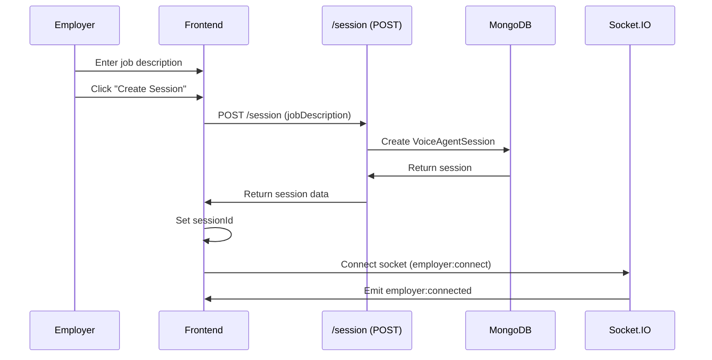
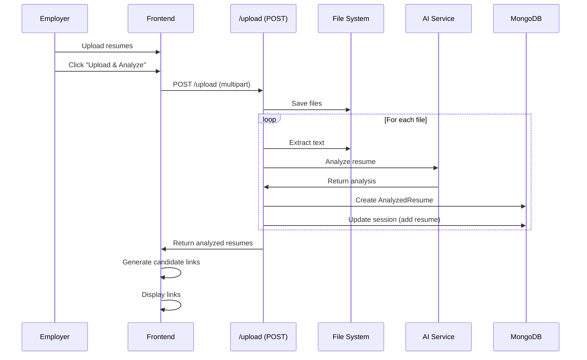
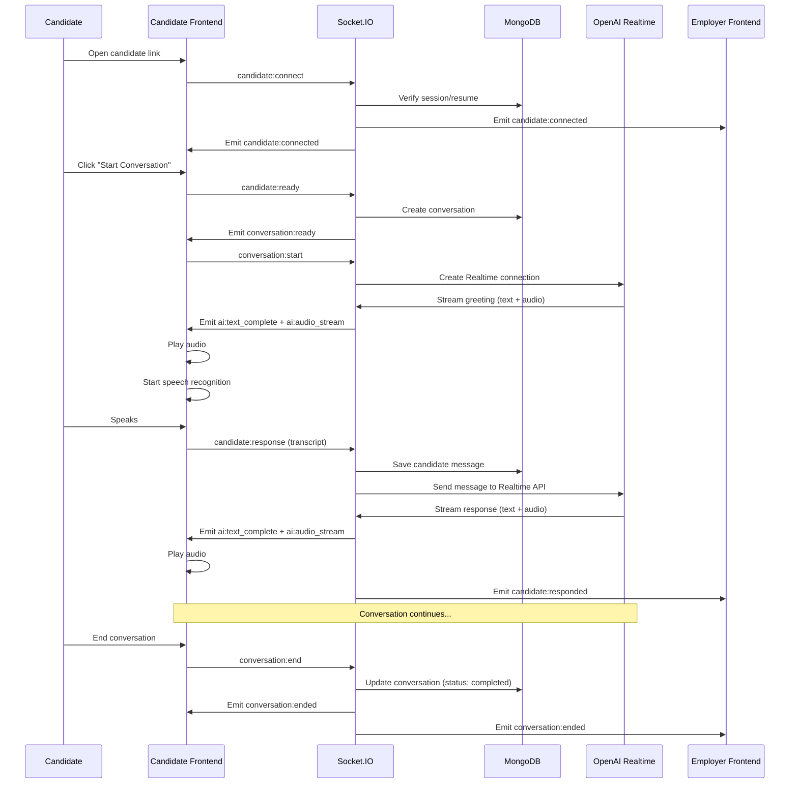

# Feature: Voice Agent

## Overview

**Purpose**: Voice Agent is an AI-powered automated phone interview system that enables employers to conduct voice interviews with candidates using AI. The system analyzes candidate resumes, generates unique interview links, and conducts real-time voice conversations where candidates interact with an AI recruiter via their browser.

**User Story**: As an employer, I want to conduct automated voice interviews with multiple candidates simultaneously, so that I can screen candidates efficiently using AI while candidates can participate from their browsers without phone calls.

**Key Functionality**:
- Create voice agent sessions with job descriptions
- Upload and analyze multiple candidate resumes
- AI-powered resume analysis (extracts candidate information)
- Generate unique candidate links for each resume
- Real-time voice conversations via WebSocket
- AI-powered voice agent conducts interviews
- Multiple AI providers support (OpenAI Realtime, Gemini Realtime, Murf)
- Browser-based speech recognition for candidate input
- Real-time audio streaming (PCM16, 24kHz)
- Conversation tracking and storage
- Session and conversation management
- Employer monitoring via Socket.IO events
- Candidate-side interface for voice conversations

**Access Level**: Employer only (Authentication required for session creation), Public access for candidates (via unique links)

**URL Paths**:
- `/employer/voice-agent` - Employer session management page
- `/voice-agent/[resumeId]?sessionId={id}` - Candidate conversation page (public)

**Authentication Required**: 
- Employer session creation: Yes (JWT token)
- Candidate conversation: No (public access via unique link)

---

## User Flow

### Employer Flow - Create and Manage Sessions
1. **Create Session** (`/employer/voice-agent`):
   - User enters job description
   - User clicks "Create Session"
   - Session created with status "pending"
2. **Upload Resumes**:
   - User uploads resume files (PDF, DOC, DOCX)
   - User clicks "Upload & Analyze Resumes"
   - Files analyzed using AI
   - Candidate information extracted
   - Resumes added to session
3. **Start Session**:
   - User clicks "Start Voice Agent"
   - Session status changes to "connecting"
   - Candidate links generated
   - Links displayed for copying/sharing
4. **Monitor Conversations**:
   - Real-time updates via Socket.IO
   - See candidate connection status
   - View conversation events
   - Track completion status

### Candidate Flow - Participate in Interview
1. **Receive Link**:
   - Candidate receives unique link via email/SMS/share
   - Link format: `/voice-agent/{resumeId}?sessionId={sessionId}`
2. **Connect to Session**:
   - Candidate opens link
   - Socket.IO connection established
   - Candidate connected to session
   - Status: "connected"
3. **Start Conversation**:
   - Candidate clicks "Connect & Start Conversation"
   - Conversation record created
   - AI voice agent initiates greeting
   - Status: "in_conversation"
4. **Voice Interview**:
   - Candidate speaks (browser speech recognition)
   - AI responds with voice (real-time audio streaming)
   - Back-and-forth conversation
   - Messages displayed in UI
   - Status indicators (listening, speaking)
5. **End Conversation**:
   - Candidate or AI ends conversation
   - Conversation saved
   - Status: "ended"

---

## Frontend Implementation

### Screen Structure

**Employer Page**:
- File: `frontend/src/app/employer/(screens)/voice-agent/page.jsx`
- Component: `VoiceAgentPageClient.jsx`
- Type: Client Component
- Lines: ~436 lines

**Candidate Page**:
- File: `frontend/src/app/voice-agent/[resumeId]/page.jsx`
- Type: Client Component
- Lines: ~1313 lines (very complex)

**Styling**:
- CSS Files:
  - `frontend/src/app/employer/(screens)/voice-agent/page.css`
  - `frontend/src/app/voice-agent/[resumeId]/page.css`

### Component Hierarchy

```
VoiceAgentPage (Employer)
  ├── Create Session Section (if no session)
  │   ├── Job Description Textarea
  │   └── Create Session Button
  └── Session Section (if session exists)
      ├── Session Info
      │   ├── Session ID
      │   ├── Status
      │   └── Candidate Count
      ├── Resume Upload
      │   ├── File Input
      │   └── Upload & Analyze Button
      ├── Analyzed Resumes List
      │   └── Resume Items
      │       ├── Candidate Name
      │       ├── Phone Number
      │       └── Status
      ├── Candidate Links Section (if session started)
      │   ├── Link Items (for each candidate)
      │   │   ├── Candidate Name
      │   │   ├── Link Input
      │   │   └── Copy Button
      │   └── Usage Note
      └── Start Voice Agent Button
      └── Connection Status

VoiceAgentCandidatePage
  ├── Status Section
  │   ├── Status Badge
  │   ├── Speaking Indicator (if AI speaking)
  │   ├── Listening Indicator (if listening)
  │   └── Interim Transcript
  ├── Connection Prompt (if not connected)
  ├── Connect Button (if connected but not ready)
  └── Conversation Section (if conversation ready)
      ├── Messages Container
      │   └── Message Items
      │       ├── Speaker (AI/Candidate)
      │       ├── Message Content
      │       └── Timestamp
      ├── Manual Input Section (if speech not supported)
      │   ├── Text Input
      │   └── Send Button
      └── End Conversation Button
```

### State Management

**Employer Page State**:
```javascript
const [sessionId, setSessionId] = useState(null);
const [jobDescription, setJobDescription] = useState("");
const [resumes, setResumes] = useState([]);
const [session, setSession] = useState(null);
const [loading, setLoading] = useState(false);
const [analyzing, setAnalyzing] = useState(false);
const [socket, setSocket] = useState(null);
const [connected, setConnected] = useState(false);
const [candidateLinks, setCandidateLinks] = useState([]);
```

**Candidate Page State** (Complex):
```javascript
const [sessionId, setSessionId] = useState(null);
const [connected, setConnected] = useState(false);
const [conversationReady, setConversationReady] = useState(false);
const [conversationId, setConversationId] = useState(null);
const [status, setStatus] = useState("waiting");
const [socket, setSocket] = useState(null);
const [messages, setMessages] = useState([]);
const [isListening, setIsListening] = useState(false);
const [isSpeaking, setIsSpeaking] = useState(false);
const [speechDetected, setSpeechDetected] = useState(false);
const [interimTranscript, setInterimTranscript] = useState("");
const [speechSupported, setSpeechSupported] = useState(false);
const [manualInput, setManualInput] = useState("");
const [useManualInput, setUseManualInput] = useState(false);
```

**Audio State Management** (Candidate Page):
- `audioContextRef`: Web Audio API context (24kHz)
- `audioBuffersByResponseRef`: Map for storing audio chunks by responseId
- `currentResponseIdRef`: Current response ID
- `expectedSeqRef`: Expected sequence number
- `dedupeSetRef`: Set for deduplication
- `recognitionRef`: Speech recognition instance
- `silenceTimeoutRef`: Timeout for silence detection

### Socket.IO Integration

**Employer Socket Events**:
- `employer:connect`: Connect as employer
- `employer:connected`: Connection confirmed
- `candidate:connected`: Candidate connected notification
- `conversation:started`: Conversation started notification
- `candidate:responded`: Candidate response notification
- `conversation:ended`: Conversation ended notification
- `session:started`: Session started notification
- `error`: Error events

**Candidate Socket Events**:
- `candidate:connect`: Connect as candidate
- `candidate:connected`: Connection confirmed
- `conversation:ready`: Conversation ready to start
- `ai:streaming`: AI text streaming (token by token)
- `ai:text_complete`: AI text complete (UI update only)
- `ai:audio_stream`: AI audio streaming (PCM16 chunks)
- `ai:audio_complete`: All audio chunks sent
- `ai:response_complete`: Response complete
- `conversation:ended`: Conversation ended
- `error`: Error events

**Socket Events Emitted (Candidate)**:
- `candidate:connect`: Initial connection
- `candidate:ready`: Ready to start conversation
- `conversation:start`: Start conversation
- `candidate:response`: Send candidate response
- `conversation:end`: End conversation

### Speech Recognition

**Browser Speech Recognition**:
- Uses Web Speech API (SpeechRecognition or webkitSpeechRecognition)
- Continuous listening mode
- Interim results for visual feedback
- Language: English (en-US)
- Auto-send after silence (0.8 seconds)

**Recognition Flow**:
1. Start recognition when conversation ready
2. Listen continuously
3. Detect speech (interim results)
4. Wait for silence (0.8 seconds)
5. Send final transcript
6. Stop recognition when AI starts speaking
7. Restart recognition after AI finishes speaking

### Audio Playback

**Audio Processing**:
- AudioContext initialized at 24kHz (matches OpenAI Realtime)
- PCM16 audio chunks received via Socket.IO
- Chunks stored with sequence numbers
- Ordered playback (sequential)
- Audio processing chain:
  - High-pass filter (60Hz cutoff)
  - EQ boost (3kHz, +2dB)
  - Compression (natural dynamics)
  - Gain smoothing

**Audio Format Support**:
- PCM16 (primary, real-time streaming)
- MP3 (fallback for Murf provider)
- Automatic format detection
- Format-specific decoding

**Playback Flow**:
1. Receive audio chunk with responseId and seq
2. Store chunk in pending map
3. Play chunks in sequence order
4. Deduplicate chunks
5. Wait for last chunk to finish
6. Restart speech recognition

### Candidate Links

**Link Generation**:
- Format: `${window.location.origin}/voice-agent/${resumeId}?sessionId=${sessionId}`
- Generated after resume analysis
- Displayed when session status is "connecting" or "in_progress"
- Copy-to-clipboard functionality
- One link per candidate

---

## Backend Implementation

### API Endpoints

#### Create Session

**Route Definition**:
```javascript
router.post("/session", verifyToken, voiceAgentController.createSession);
```

**Full Endpoint Path**: `/api/voice-agent/session`

**HTTP Method**: POST

**Authentication Required**: Yes

**Request Body**:
```json
{
  "jobDescription": "Job description text..."
}
```

**Response Format**:
```json
{
  "success": true,
  "message": "Voice agent session created successfully",
  "data": {
    "_id": "session-id",
    "employerId": "...",
    "jobDescription": "...",
    "status": "pending",
    "socketRoomId": "voice-agent-...",
    "createdAt": "2024-01-01T12:00:00Z"
  }
}
```

**Controller Logic** (`createSession`):
1. Validate job description
2. Create VoiceAgentSession record
3. Generate unique socketRoomId
4. Return session data

#### Upload and Analyze Resumes

**Route Definition**:
```javascript
router.post("/session/:sessionId/upload", verifyToken, uploadVoiceAgentResumes, voiceAgentController.uploadAndAnalyzeResumes);
```

**Full Endpoint Path**: `/api/voice-agent/session/:sessionId/upload`

**HTTP Method**: POST

**Authentication Required**: Yes

**Request**: Multipart form data
- `sessionId`: Session ID
- `jobDescription`: Job description (optional, uses session JD if not provided)
- `resumes`: Array of resume files (PDF, DOC, DOCX)

**Response Format**:
```json
{
  "success": true,
  "message": "Analyzed 3 resume(s)",
  "data": {
    "session": { /* updated session */ },
    "analyzedResumes": [ /* array of AnalyzedResume records */ ],
    "errors": [ /* any errors during processing */ ]
  }
}
```

**Controller Logic** (`uploadAndAnalyzeResumes`):
1. Validate session ID and ownership
2. Validate files
3. Update session status to "analyzing"
4. For each file:
   - Extract text (PDF/DOCX)
   - Analyze resume using AI service
   - Create AnalyzedResume record
   - Add to session.resumes array
5. Update session (totalCandidates, status)
6. Return analyzed resumes

#### Start Session

**Route Definition**:
```javascript
router.post("/session/:sessionId/start", verifyToken, voiceAgentController.startSession);
```

**Full Endpoint Path**: `/api/voice-agent/session/:sessionId/start`

**HTTP Method**: POST

**Authentication Required**: Yes

**Response Format**:
```json
{
  "success": true,
  "message": "Voice agent session started",
  "data": { /* updated session */ }
}
```

**Controller Logic** (`startSession`):
1. Validate session ID and ownership
2. Check resumes exist
3. Update session status to "connecting"
4. Set startedAt timestamp
5. Set currentCandidateIndex to 0
6. Emit Socket.IO events:
   - `session:started` to employer
   - `candidate:ready_to_connect` for first candidate
7. Return updated session

#### Get Session by ID

**Route Definition**:
```javascript
router.get("/session/:sessionId", verifyToken, voiceAgentController.getSessionById);
```

**Full Endpoint Path**: `/api/voice-agent/session/:sessionId`

**HTTP Method**: GET

**Authentication Required**: Yes

**Response Format**:
```json
{
  "success": true,
  "data": { /* full session with populated resumes */ }
}
```

**Controller Logic** (`getSessionById`):
1. Find session by ID
2. Verify employer ownership
3. Populate resumes array
4. Return session

#### Get All Sessions

**Route Definition**:
```javascript
router.get("/sessions", verifyToken, voiceAgentController.getSessions);
```

**Full Endpoint Path**: `/api/voice-agent/sessions`

**HTTP Method**: GET

**Authentication Required**: Yes

**Response Format**:
```json
{
  "success": true,
  "data": [ /* array of sessions */ ]
}
```

**Controller Logic** (`getSessions`):
1. Find all sessions for employer
2. Sort by creation date (newest first)
3. Populate resumes
4. Return sessions

#### Get Conversation

**Route Definition**:
```javascript
router.get("/conversation/:resumeId", verifyToken, voiceAgentController.getConversation);
```

**Full Endpoint Path**: `/api/voice-agent/conversation/:resumeId`

**HTTP Method**: GET

**Authentication Required**: Yes

**Response Format**:
```json
{
  "success": true,
  "data": { /* full conversation with messages */ }
}
```

**Controller Logic** (`getConversation`):
1. Find conversation by resumeId
2. Verify employer owns the session
3. Populate sessionId
4. Return conversation

### Socket.IO Server

**Server File**: `backend/src/socket/socketServer.js`

**Socket Events Handled**:

1. **Employer Connection**:
   - `employer:connect`: Join employer room, store employerId

2. **Candidate Connection**:
   - `candidate:connect`: Verify session/resume, join candidate room, notify employer

3. **Conversation Start**:
   - `candidate:ready`: Create conversation record, notify employer
   - `conversation:start`: Initialize AI connection (OpenAI Realtime/Gemini/Murf)

4. **Conversation Flow**:
   - `candidate:response`: Save message, generate AI response, stream audio
   - Real-time message handling via WebSocket (OpenAI Realtime API)

5. **Conversation End**:
   - `conversation:end`: Update conversation status, update session, notify employer

**AI Provider Support**:
- **OpenAI Realtime** (default): Real-time streaming voice conversations
- **Gemini Realtime**: Alternative real-time provider
- **Murf**: Text-to-speech with streaming chunks

### AI Integration

**OpenAI Realtime Service** (`backend/src/services/openaiRealtimeService.js`):
- Creates WebSocket connection to OpenAI Realtime API
- Configures session (voice: "marin", format: PCM16, 24kHz)
- Handles streaming responses (text + audio)
- Manages conversation context
- Language detection (English only)

**Key Features**:
- Real-time audio streaming (PCM16, 24kHz)
- Semantic VAD (Voice Activity Detection)
- System prompt with recruiter persona
- Conversation history management
- Response streaming (token by token)
- Audio chunk streaming

**Murf Service** (`backend/src/services/murfSpeechService.js`):
- Text-to-speech streaming
- Supports PCM and MP3 formats
- Streaming audio chunks
- Fallback to MP3 if PCM fails

### Resume Analysis Service

**Service**: `backend/src/services/resumeAnalysisService.js`

**Analysis Process**:
1. Extract text from file (PDF/DOCX)
2. Analyze resume using AI
3. Extract candidate information:
   - Name, email, phone
   - Experience, skills
   - Education
   - Current company/role
4. Return structured data

### Database Models

**VoiceAgentSession Model** (`backend/src/models/voiceAgentSession.js`):
- `employerId`: ObjectId (ref: Employer)
- `jobDescription`: String
- `status`: String (enum: pending, analyzing, connecting, in_progress, completed, paused, cancelled)
- `totalCandidates`: Number
- `processedCandidates`: Number
- `currentCandidateIndex`: Number
- `resumes`: Array of:
  - `resumeId`: ObjectId (ref: AnalyzedResume)
  - `candidateName`: String
  - `phoneNumber`: String
  - `status`: String (enum: pending, analyzing, ready, connecting, in_call, completed, failed)
  - `connectionStatus`: String (enum: not_connected, waiting_for_candidate, connected, in_conversation, ended)
  - Timestamps (analyzedAt, connectedAt, conversationStartedAt, conversationEndedAt)
- `startedAt`: Date
- `completedAt`: Date
- `socketRoomId`: String (unique)

**VoiceAgentConversation Model** (`backend/src/models/voiceAgentConversation.js`):
- `sessionId`: ObjectId (ref: VoiceAgentSession)
- `resumeId`: ObjectId (ref: AnalyzedResume)
- `candidateName`: String
- `phoneNumber`: String
- `jobDescription`: String
- `messages`: Array of:
  - `speaker`: String (enum: ai, candidate)
  - `message`: String
  - `audioUrl`: String (optional)
  - `timestamp`: Date
- `summary`: String
- `candidateResponses`: Mixed (structured responses)
- `assessment`: Object (interested, available, salaryExpectation, noticePeriod, additionalNotes)
- `status`: String (enum: initiated, in_progress, completed, failed, cancelled)
- `duration`: Number (seconds)
- `startedAt`: Date
- `endedAt`: Date

**AnalyzedResume Model** (`backend/src/models/analyzedResume.js`):
- `employerId`: ObjectId (ref: Employer)
- `sessionId`: ObjectId (ref: VoiceAgentSession)
- `originalFileName`: String
- `filePath`: String
- `candidateName`: String
- `phoneNumber`: String
- `email`: String
- `experience`: String
- `skills`: Array of String
- `education`: Array of Object (degree, institution, year)
- `currentCompany`: String
- `currentRole`: String
- `yearsOfExperience`: Number
- `extractedData`: Mixed (full extracted data)
- `analysisStatus`: String (enum: pending, processing, completed, failed)
- `analysisError`: String
- `analyzedAt`: Date

### File Upload Middleware

**Middleware**: `uploadVoiceAgentResumes`
- Multiple file support
- File types: PDF, DOC, DOCX
- Storage: `uploads/voice-agent/{employerId}/`
- File naming: UUID-based

---

## Data Flow

### Session Creation Flow



### Resume Analysis Flow



### Conversation Flow



---

## Error Handling

### Frontend Error Handling

**Employer Page Errors**:
- Session creation failure: Error toast
- Resume upload failure: Error toast
- Socket connection errors: Error toast
- 404 route errors: Detailed error message

**Candidate Page Errors**:
- Connection failures: Error toast
- Speech recognition errors: Fallback to manual input
- Audio playback errors: Logged, continue conversation
- Socket errors: Error toast
- Conversation errors: Error toast

### Backend Error Handling

**Session Errors**:
- Missing job description: 400 Bad Request
- Session not found: 404 Not Found
- Unauthorized access: 401 Unauthorized

**Resume Analysis Errors**:
- File extraction failures: Logged, continue with next file
- AI analysis failures: Logged, mark as failed
- Validation errors: 400 Bad Request

**Socket Errors**:
- Invalid session/resume: Error event
- Connection failures: Error event
- AI service failures: Error event
- Conversation errors: Logged, error event

**Status Codes**:
- 200: Success
- 201: Created
- 400: Bad Request
- 401: Unauthorized
- 404: Not Found
- 500: Internal Server Error

---

## Security Features

### Authentication
- JWT token required for employer endpoints
- Token validated on each request
- Employer ID extracted from token

### Authorization
- Session ownership verified
- Resume ownership verified
- Conversation access verified via session ownership

### Data Protection
- File uploads validated (type, size)
- File paths sanitized
- Socket rooms isolated per employer/candidate
- Candidate links include sessionId (validated)

### Real-time Security
- Socket rooms used for message isolation
- Session/resume validation on connection
- Conversation ownership checks

---

## UI/UX Details

### Employer Page
- Simple form layout
- Status indicators
- Candidate links with copy functionality
- Real-time connection status
- Resume list display

### Candidate Page
- Clean conversation interface
- Status badges
- Visual indicators (speaking, listening)
- Message bubbles (AI vs candidate)
- Manual input fallback
- End conversation button

### Audio Experience
- 24kHz sample rate for quality
- Audio processing for clarity
- Smooth playback (ordered chunks)
- No audio interruptions
- Natural voice (OpenAI Realtime)

### Speech Recognition
- Visual feedback (interim transcripts)
- Speech detection indicator
- Auto-send after silence
- Fallback to manual input if unsupported

---

## Testing Considerations

### Test Scenarios

**Happy Path**:
1. Create session → Session created → Upload resumes → Resumes analyzed → Start session → Links generated → Candidate connects → Conversation starts → Messages exchanged → Conversation ends

**Error Cases**:
1. Missing job description → Validation error
2. No files uploaded → Validation error
3. Invalid file type → Validation error
4. Session not found → 404 error
5. Speech recognition failure → Fallback to manual input
6. Audio playback failure → Logged, continue

**Edge Cases**:
1. Multiple candidates simultaneously → All handled independently
2. Network interruptions → Socket reconnection
3. Long conversations → Memory management
4. Audio chunk ordering → Sequential playback
5. Speech recognition timeout → Auto-restart

---

## Related Features

- **Smart Select** (`/employer/smart-select`): Resume analysis (shared service)
- **Job Postings** (`/employer/post-job`): Related to job descriptions
- **Application Management** (`/employer/applications`): Related to candidate management

---

## Additional Notes

**Dependencies**:
- `socket.io-client`: Socket.IO client
- `ws`: WebSocket for OpenAI Realtime
- `openai`: OpenAI SDK
- `@google/generative-ai`: Gemini SDK
- `axios`: HTTP client (Murf)
- `pdf-parse`: PDF text extraction
- `mammoth`: DOCX text extraction
- Web Speech API (browser)
- Web Audio API (browser)

**AI Providers**:
- **OpenAI Realtime** (default): High-quality real-time voice
  - Voice: "marin" (natural, human-like)
  - Format: PCM16, 24kHz
  - Semantic VAD for turn detection
- **Gemini Realtime**: Alternative provider
- **Murf**: Text-to-speech streaming (PCM/MP3)

**Audio Specifications**:
- Sample Rate: 24kHz (matches OpenAI Realtime)
- Format: PCM16 (primary), MP3 (fallback)
- Channels: Mono
- Processing: High-pass filter, EQ, compression

**Real-time Features**:
- WebSocket-based communication
- Low-latency audio streaming
- Ordered chunk playback
- Deduplication
- Automatic reconnection

**Known Limitations**:
- Speech recognition requires browser support
- Audio quality depends on browser/device
- Network latency affects real-time experience
- Concurrent conversations limited by server resources
- Browser microphone permission required

**Future Enhancements**:
- Recording of conversations
- Transcription export
- Conversation analytics
- AI-powered assessment summaries
- Integration with job applications
- Scheduling system
- SMS/email notifications
- Mobile app support
- Video support
- Multi-language support
- Conversation templates
- Custom AI prompts per session
- Conversation review and rating

---

## Code References

### Frontend Files
- `frontend/src/app/employer/(screens)/voice-agent/page.jsx` - Employer page (~30 lines)
- `frontend/src/app/employer/(screens)/voice-agent/VoiceAgentPageClient.jsx` - Employer client component (~436 lines)
- `frontend/src/app/employer/(screens)/voice-agent/page.css` - Employer styling
- `frontend/src/app/voice-agent/[resumeId]/page.jsx` - Candidate page (~1313 lines)
- `frontend/src/app/voice-agent/[resumeId]/page.css` - Candidate styling

### Backend Files
- `backend/src/routes/voiceAgentRoutes.js` - Route definitions (~17 lines):
  - Line 9: POST `/session`
  - Line 10: POST `/session/:sessionId/upload`
  - Line 11: POST `/session/:sessionId/start`
  - Line 12: GET `/sessions`
  - Line 13: GET `/session/:sessionId`
  - Line 14: GET `/conversation/:resumeId`
- `backend/src/controllers/voiceAgentController.js` - Controller functions (~340 lines):
  - `createSession` (lines 12-42)
  - `uploadAndAnalyzeResumes` (lines 47-154)
  - `startSession` (lines 159-229)
  - `getSessions` (lines 234-254)
  - `getSessionById` (lines 259-288)
  - `getConversation` (lines 293-330)
- `backend/src/socket/socketServer.js` - Socket.IO server (~1232+ lines):
  - Employer connection (lines 245-267)
  - Candidate connection (lines 283-342)
  - Conversation start (lines 345-771)
  - Candidate response (lines 444-635)
  - Conversation end (lines 949-1020+)
- `backend/src/services/openaiRealtimeService.js` - OpenAI Realtime service (~479+ lines)
- `backend/src/services/murfSpeechService.js` - Murf TTS service (~88+ lines)
- `backend/src/services/resumeAnalysisService.js` - Resume analysis service
- `backend/src/middleware/uploadVoiceAgentResumes.js` - File upload middleware
- `backend/src/models/voiceAgentSession.js` - Session model (~78 lines)
- `backend/src/models/voiceAgentConversation.js` - Conversation model (~95 lines)
- `backend/src/models/analyzedResume.js` - Analyzed Resume model (~101 lines)

---

*Last Updated: [Current Date]*
*Documented By: TSD Documentation System*

