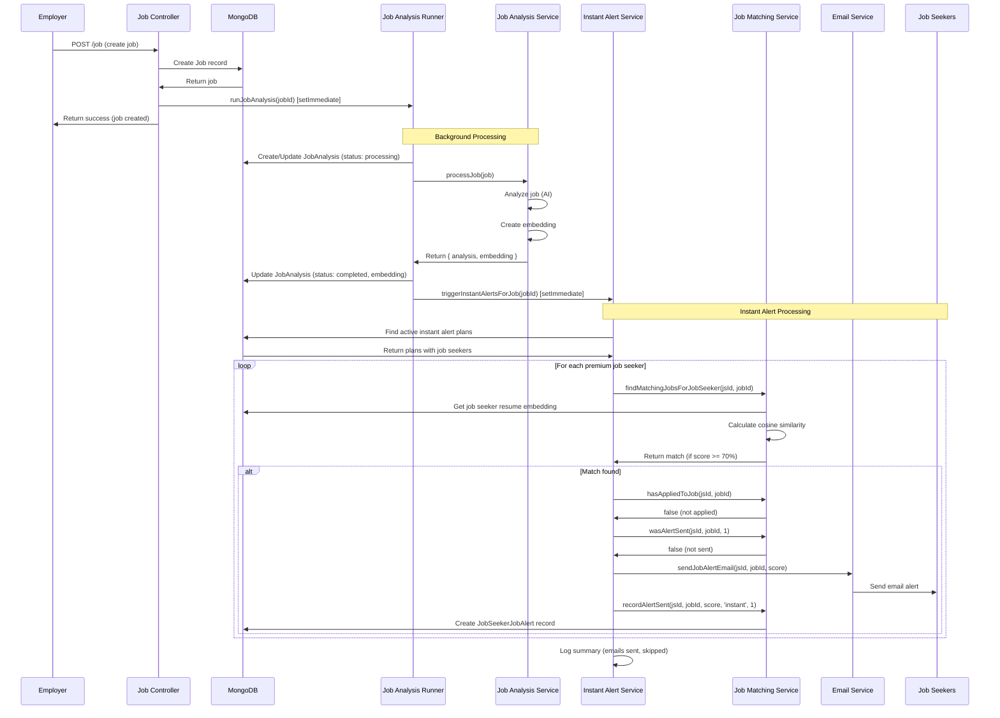
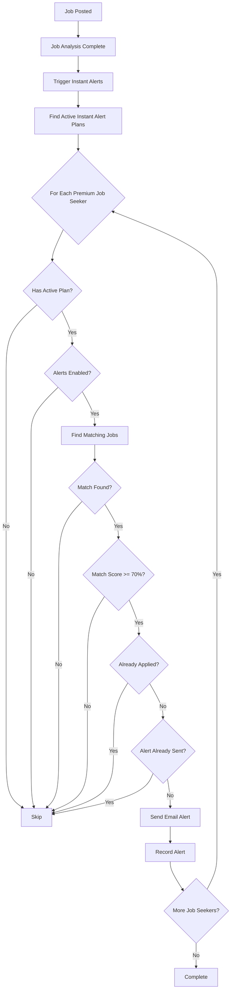

# Feature: Instant Job Alerts - Employer

## Overview

**Purpose**: Instant Job Alerts is an automated system that immediately notifies premium job seekers (those with active instant alert plans) when employers post new jobs that match their resume. This feature provides employers with enhanced job visibility by ensuring their newly posted jobs are immediately promoted to qualified, premium job seekers who are actively looking for opportunities.

**User Story**: As an employer, when I post a new job, I want it to be immediately matched with relevant premium job seekers and sent to them via instant alerts, so that I can receive applications from highly qualified candidates faster.

**Key Functionality**:
- Automatic triggering when new jobs are posted
- Real-time job analysis and embedding generation
- Immediate matching with premium job seekers' resumes
- Instant email alerts sent to matching candidates
- No manual intervention required from employers
- Background processing (non-blocking)
- Only sends to job seekers with active instant alert plans
- Prevents duplicate alerts
- Skips job seekers who have already applied
- Works with both full job analysis and embedding-only fallback

**Access Level**: Automatic (triggered when employer posts jobs), no direct employer UI

**URL Path**: N/A (Backend service, automatically triggered)

**Authentication Required**: N/A (Backend service)

---

## User Flow

### Employer Flow - Automatic Process
1. **Employer Posts Job** (`/employer/post-job`):
   - Employer fills out job posting form
   - Employer clicks "Post Job"
   - Job is created in database
   - Background job analysis is triggered (non-blocking)
2. **Job Analysis** (Background):
   - Job is analyzed using AI service
   - Job embedding is created (mathematical representation)
   - JobAnalysis record is saved
   - Status: "completed" or "embedding_only"
3. **Instant Alert Trigger** (Automatic):
   - System detects job analysis completion
   - Calls `triggerInstantAlertsForJob(jobId)`
   - Process runs in background (non-blocking)
4. **Matching Process** (Background):
   - Finds all job seekers with active instant alert plans
   - For each premium job seeker:
     - Checks if alerts are enabled (`jobAlertOnResumeMatch`)
     - Matches job with job seeker's resume (embedding similarity)
     - Checks if match score meets threshold (default: 70%)
     - Skips if already applied
     - Skips if instant alert already sent
     - Sends email alert if match found
     - Records alert in database
5. **Result**:
   - Premium job seekers receive instant email notifications
   - Employer receives applications from qualified candidates
   - No action required from employer

### System Flow - Background Processing
1. Job posted → JobAnalysis triggered
2. JobAnalysis completes → Instant alerts triggered
3. Premium job seekers matched → Emails sent
4. Applications flow back to employer

---

## Frontend Implementation

**Note**: This feature has no direct frontend component for employers. It operates entirely in the backend as an automatic service triggered when jobs are posted.

**Related Frontend**:
- Job posting form (`/employer/post-job`) - triggers the process
- Job seeker instant alert purchase (`/jobseeker/instant-alerts`) - enables job seekers to subscribe

---

## Backend Implementation

### Service Integration

**Trigger Point**: `backend/src/services/jobAnalysisRunner.js`

**Integration Code**:
```javascript
// After job analysis completes successfully
setImmediate(() => {
    const { triggerInstantAlertsForJob } = require('./jobInstantAlertService');
    triggerInstantAlertsForJob(jobId).catch(err => {
        console.error('Error triggering instant alerts:', err);
    });
});
```

**Service File**: `backend/src/services/jobInstantAlertService.js`

### Instant Alert Service

**Main Function**: `triggerInstantAlertsForJob(jobId)`

**Function Logic**:
1. **Check System Status**:
   - Verifies `JOB_ALERT_INSTANT_ENABLED` environment variable
   - Returns early if disabled (default: enabled)
   
2. **Find Premium Job Seekers**:
   - Queries `JobSeekerInstantAlertPlan` for active plans
   - Filters: `status: 'active'`, `endDate >= now()`
   - Populates job seeker data (email, `jobAlertOnResumeMatch`)
   
3. **Process Each Job Seeker**:
   - **Validation**:
     - Checks if job seeker exists
     - Checks if `jobAlertOnResumeMatch` is enabled
     - Verifies active plan exists
   
   - **Matching**:
     - Calls `findMatchingJobsForJobSeeker(jobSeekerId, jobId)`
     - Returns jobs matching the specific job ID
     - Uses embedding similarity (cosine similarity)
     - Match score threshold: 70% (configurable)
   
   - **Filters**:
     - Skips if already applied (`hasAppliedToJob`)
     - Skips if instant alert already sent (interval day 1)
     - Skips if no match found
   
   - **Send Alert**:
     - Calls `sendJobAlertEmail(jobSeekerId, jobId, matchScore)`
     - Records alert: `recordAlertSent(jobSeekerId, jobId, matchScore, 'instant', intervalDay)`
     - Logs success/failure
   
4. **Summary**:
   - Logs total emails sent
   - Logs total skipped
   - Handles errors gracefully (continues processing)

**Error Handling**:
- Individual job seeker errors are caught and logged
- Process continues for remaining job seekers
- Overall errors are caught and logged (non-blocking)

### Job Analysis Runner Integration

**File**: `backend/src/services/jobAnalysisRunner.js`

**Trigger Points**:
1. **After Successful Job Analysis** (line 79-85):
   - Job analysis completes with full analysis
   - Embedding created successfully
   - Status: "completed"
   - Triggers instant alerts immediately

2. **After Embedding-Only Fallback** (line 118-124):
   - Full analysis failed
   - Embedding-only fallback succeeded
   - Status: "embedding_only"
   - Still triggers instant alerts (matching can work with embeddings only)

**Implementation**:
- Uses `setImmediate()` for non-blocking execution
- Errors are caught and logged (don't affect job posting)
- Async execution ensures job posting completes quickly

### Job Matching Service

**Service**: `backend/src/services/jobMatchingService.js`

**Key Functions Used**:

1. **`findMatchingJobsForJobSeeker(jobSeekerId, jobId)`**:
   - Finds matching jobs for a job seeker
   - Can filter by specific jobId
   - Uses cosine similarity on embeddings
   - Returns matches above threshold (default: 70%)

2. **`hasAppliedToJob(jobSeekerId, jobId)`**:
   - Checks if job seeker has already applied
   - Queries JobApplication collection
   - Returns boolean

3. **`wasAlertSent(jobSeekerId, jobId, intervalDay)`**:
   - Checks if alert already sent for this job/interval
   - Queries JobSeekerJobAlert collection
   - Prevents duplicate alerts

4. **`getAlertIntervals()`**:
   - Returns configured alert intervals
   - Default: [1, 3, 7] (days)
   - Instant alerts use first interval (day 1)

5. **`recordAlertSent(jobSeekerId, jobId, matchScore, alertType, intervalDay)`**:
   - Records alert in database
   - Creates JobSeekerJobAlert record
   - `alertType`: 'instant' for instant alerts

6. **`hasActiveInstantAlertPlan(jobSeekerId)`**:
   - Verifies job seeker has active instant alert plan
   - Queries JobSeekerInstantAlertPlan
   - Returns boolean

### Email Service

**Service**: `backend/src/services/jobAlertEmailService.js`

**Function**: `sendJobAlertEmail(jobSeekerId, jobId, matchScore)`

**Email Content**:
- Job details (title, company, location, etc.)
- Match score percentage
- Job description preview
- Link to view full job details
- Link to apply
- Personalized greeting

**Email Delivery**:
- Uses email service (Nodemailer or similar)
- Handles rate limiting
- Returns boolean (success/failure)

### Database Models

**JobSeekerInstantAlertPlan** (`backend/src/models/jobSeekerInstantAlertPlan.js`):
- `jobSeekerId`: ObjectId (ref: JobSeeker)
- `startDate`: Date
- `endDate`: Date
- `paymentDate`: Date
- `sessionId`: String (Stripe session ID)
- `status`: String (enum: active, pending, expired, cancelled)
- `amount`: Number
- `currency`: String (default: 'inr')
- `paymentId`: ObjectId (ref: JobSeekerInstantAlertPayment)

**JobSeekerJobAlert** (`backend/src/models/jobSeekerJobAlert.js`):
- `jobSeekerId`: ObjectId (ref: JobSeeker)
- `jobId`: ObjectId (ref: Job)
- `matchScore`: Number (0-100)
- `sentAt`: Date
- `alertType`: String (enum: 'instant', 'scheduled')
- `intervalDay`: Number (1, 3, 7, etc.)
- Unique index: `{ jobSeekerId, jobId, intervalDay }`

**JobAnalysis** (`backend/src/models/jobAnalysis.js`):
- `jobId`: ObjectId (ref: Job)
- `status`: String (completed, embedding_only, failed, etc.)
- `embedding`: Array of Numbers (vector embedding)
- `embeddingOnly`: Boolean
- Other analysis fields (summary, skills, etc.)

**JobSeekerResumeAnalysis** (`backend/src/models/jobSeekerResumeAnalysis.js`):
- `jobSeekerId`: ObjectId (ref: JobSeeker)
- `embedding`: Array of Numbers (vector embedding)
- `status`: String (completed, failed, etc.)

**JobSeeker** (`backend/src/models/jobSeeker.js`):
- `jobAlertOnResumeMatch`: Boolean (must be true)
- `email`: String (for sending alerts)

---

## Data Flow

### Job Posting and Instant Alert Flow



### Matching Algorithm



---

## Configuration

### Environment Variables

**`JOB_ALERT_INSTANT_ENABLED`**:
- Type: Boolean/String
- Default: `true` (if not set)
- Values: `'true'`, `'1'`, `'yes'` (case-insensitive) = enabled
- Purpose: Master switch for instant alert system
- Location: `jobInstantAlertService.js`

**`INSTANT_ALERT_PRICE`**:
- Type: Number
- Default: `200`
- Purpose: Price for instant alert plan (in currency unit)
- Location: `jobSeekerInstantAlertController.js`

**`INSTANT_ALERT_CURRENCY`**:
- Type: String
- Default: `'inr'`
- Purpose: Currency for instant alert plan pricing
- Location: `jobSeekerInstantAlertController.js`

**`INSTANT_ALERT_DURATION_DAYS`**:
- Type: Number
- Default: `30`
- Purpose: Duration of instant alert plan (in days)
- Location: `jobSeekerInstantAlertController.js`

### Matching Threshold

**Default Match Score Threshold**: 70%

- Location: `jobMatchingService.js`
- Configurable via service configuration
- Matches below threshold are skipped
- Higher threshold = more selective matching

---

## Error Handling

### Service-Level Errors

**Instant Alert Service Errors**:
- Individual job seeker processing errors: Caught, logged, continue processing
- Overall service errors: Caught, logged, non-blocking
- Email sending errors: Logged, continue with next job seeker

**Job Analysis Errors**:
- Full analysis failure: Falls back to embedding-only
- Embedding-only also triggers instant alerts
- Complete failure: No instant alerts (job still posted)

### Error Recovery

**No Retry Mechanism**:
- Instant alerts are fire-and-forget
- If processing fails, alerts are not retried
- Scheduled alerts (cron) may catch missed matches later

**Error Logging**:
- All errors logged to console
- Error details include jobId, jobSeekerId, error message
- Summary logs include total sent/skipped counts

---

## Performance Considerations

### Scalability

**Non-Blocking Design**:
- Instant alerts run in background (`setImmediate`)
- Job posting completes immediately
- Alert processing doesn't delay job creation

**Efficient Queries**:
- Indexed queries on JobSeekerInstantAlertPlan
- Indexed queries on JobSeekerJobAlert
- Populated queries with selective fields
- Batch processing not needed (single job at a time)

**Memory Efficiency**:
- Processes one job at a time
- Processes job seekers sequentially (not in parallel)
- No large batch loading

### Performance Characteristics

**Typical Execution Time**:
- Depends on number of active instant alert plans
- Typical: 1-5 seconds for 100 premium job seekers
- Scales linearly with number of premium job seekers

**Database Load**:
- Read-heavy (queries for plans, matches, alerts)
- Write operations (recording alerts) are minimal
- Indexes ensure fast lookups

---

## Security Features

### Data Protection
- Job seeker email addresses used only for alerts
- No sensitive data exposed in logs
- Alert records stored securely

### Access Control
- Only active premium plans receive alerts
- Plan validation before processing
- Job seeker preference respected (`jobAlertOnResumeMatch`)

### Spam Prevention
- Duplicate alert prevention (unique index)
- Already-applied filtering
- Respects job seeker alert preferences

---

## Related Features

- **Job Posting** (`/employer/post-job`): Triggers the instant alert process
- **Job Analysis** (`backend/src/services/jobAnalysisRunner.js`): Creates job embeddings
- **Scheduled Job Alerts** (`backend/src/services/jobAlertCronService.js`): Alternative alert system (scheduled)
- **Job Seeker Instant Alert Plans**: Premium feature for job seekers
- **Job Matching Service**: Core matching algorithm

---

## Additional Notes

**Benefits for Employers**:
1. **Enhanced Visibility**: Jobs immediately promoted to premium job seekers
2. **Higher Quality Applications**: Premium job seekers are actively looking
3. **Faster Response**: Instant alerts lead to faster applications
4. **No Additional Cost**: Automatic benefit when posting jobs
5. **No Manual Work**: Fully automated process

**Difference from Scheduled Alerts**:
- **Instant Alerts**: Triggered immediately when job is posted
- **Scheduled Alerts**: Run on cron schedule (daily), process all jobs/job seekers
- **Target Audience**: Instant alerts only for premium job seekers
- **Frequency**: Instant alerts sent once per job (interval day 1)

**System Status**:
- Enabled by default (`JOB_ALERT_INSTANT_ENABLED=true`)
- Can be disabled via environment variable
- Graceful handling when disabled (logs, no errors)

**Monitoring**:
- Logs include summary statistics
- Can track emails sent vs skipped
- Error logs for debugging

**Future Enhancements**:
- Employer dashboard showing instant alert statistics
- Configuration per job (opt-in/opt-out)
- A/B testing for match thresholds
- Real-time notifications to employer
- Analytics on instant alert effectiveness
- Batch processing for high-volume employers
- Custom alert templates
- Priority alert tiers

---

## Code References

### Backend Files
- `backend/src/services/jobInstantAlertService.js` - Main instant alert service (~122 lines):
  - `isInstantAlertEnabled()` (lines 14-23)
  - `triggerInstantAlertsForJob()` (lines 29-117)
- `backend/src/services/jobAnalysisRunner.js` - Job analysis runner (~143 lines):
  - `runJobAnalysis()` (lines 37-140)
  - Instant alert trigger (lines 79-85, 118-124)
- `backend/src/services/jobMatchingService.js` - Job matching service:
  - `findMatchingJobsForJobSeeker()` - Matching algorithm
  - `hasAppliedToJob()` - Application check
  - `wasAlertSent()` - Duplicate check
  - `getAlertIntervals()` - Interval configuration
  - `recordAlertSent()` - Alert recording
  - `hasActiveInstantAlertPlan()` - Plan validation
- `backend/src/services/jobAlertEmailService.js` - Email service:
  - `sendJobAlertEmail()` - Email sending
- `backend/src/controllers/jobController.js` - Job controller:
  - `postJob()` (line 110+) - Triggers job analysis
- `backend/src/models/jobSeekerInstantAlertPlan.js` - Plan model (~26 lines)
- `backend/src/models/jobSeekerJobAlert.js` - Alert record model (~41 lines)
- `backend/src/models/jobAnalysis.js` - Job analysis model
- `backend/src/models/jobSeekerResumeAnalysis.js` - Resume analysis model

### Environment Variables
- `JOB_ALERT_INSTANT_ENABLED` - Master switch
- `INSTANT_ALERT_PRICE` - Plan pricing
- `INSTANT_ALERT_CURRENCY` - Currency
- `INSTANT_ALERT_DURATION_DAYS` - Plan duration

---

*Last Updated: [Current Date]*
*Documented By: TSD Documentation System*

