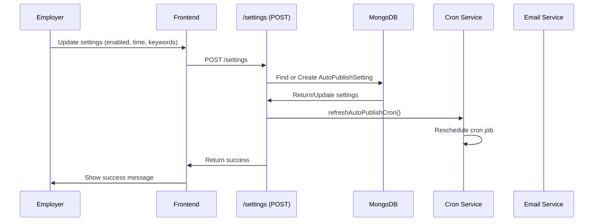
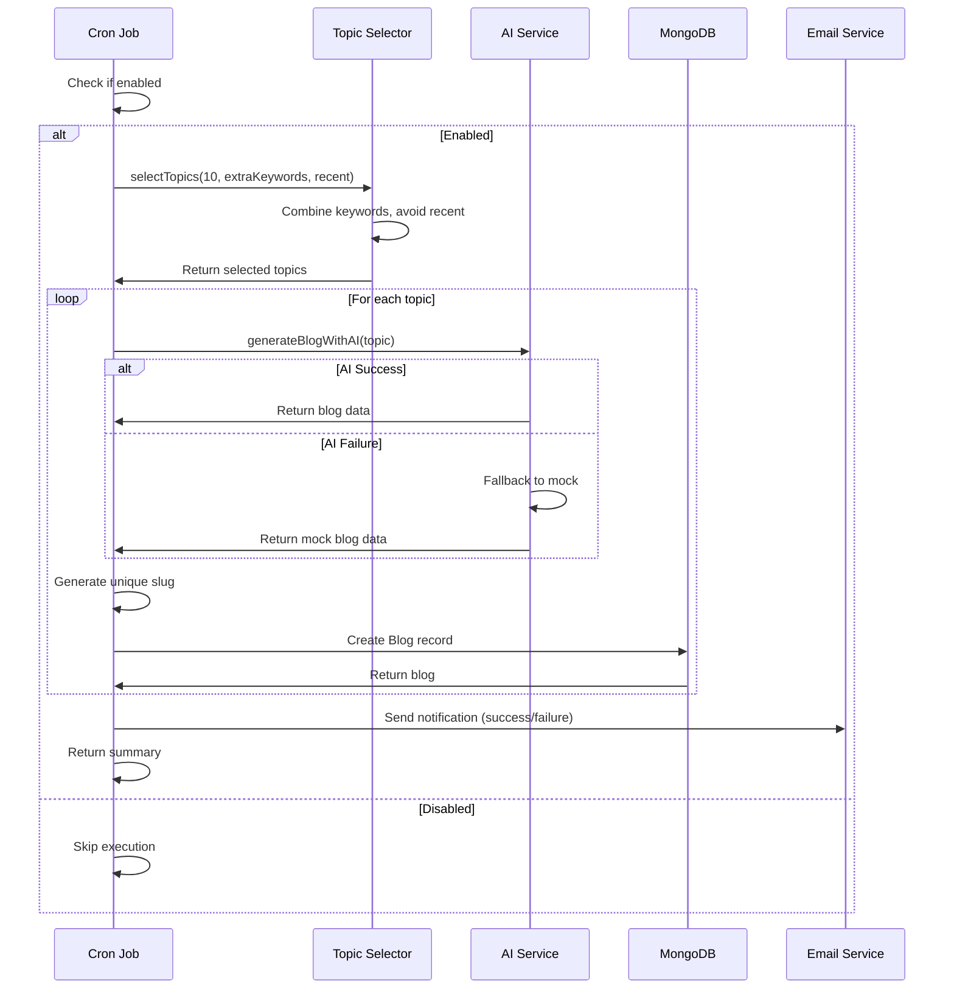

# Feature: Blog Agent

## Overview

**Purpose**: Blog Agent is an automated blog publishing system that enables employers to schedule and manage daily automatic blog content generation and publishing. The system uses AI to generate recruitment-related blog posts on scheduled topics and publishes them automatically at specified times, helping employers maintain an active content marketing presence.

**User Story**: As an employer, I want to automatically generate and publish blog posts about recruitment topics on a daily schedule, so that I can maintain consistent content marketing without manual effort.

**Key Functionality**:
- Configure auto-publishing settings (enable/disable, schedule time)
- Add custom keywords/topics for blog generation
- View internal keyword pool (employer, job seeker, market, tech categories)
- Schedule daily blog generation at specific times (IST timezone)
- Automatic AI-powered blog content generation
- Email notifications on blog publishing (success/failure)
- Manual trigger for testing
- Access control (restricted to authorized employers)
- Topic selection algorithm (avoids recent topics)
- Fallback to mock content if AI fails
- Unique slug generation

**Access Level**: Restricted (Only authorized employers via middleware)

**URL Path**: `/employer/blog-agent`

**Authentication Required**: Yes (Employer JWT token + access check)

---

## User Flow

### Configure Blog Publisher Settings
1. **Navigate to Blog Agent** (`/employer/blog-agent`):
   - User accesses the Blog Publisher page
   - Settings are loaded from database
2. **Configure Settings**:
   - **Toggle Auto Publish**: Enable/disable automatic publishing
   - **Set Daily Publish Time**: Choose time in HH:mm format (default: 09:00 IST)
   - **Add Extra Keywords**: Add comma-separated custom topics/keywords
   - **View Keywords**: Show/hide internal keyword pool (reference only)
3. **Save Settings**:
   - User clicks "Save settings"
   - Settings saved to database
   - Cron job schedule updated
   - If enabled and time has passed today, blog generation runs immediately
4. **Email Notifications**:
   - Success: Email sent with list of generated blogs
   - Failure: Email sent with error details
   - Notifications sent to configured email addresses

### Automatic Blog Generation Flow
1. **Cron Job Triggered**:
   - Runs daily at scheduled time (IST)
   - Checks if auto-publish is enabled
   - If disabled, skips execution
2. **Topic Selection**:
   - Combines internal keywords and extra keywords
   - Selects topics avoiding recent ones (prevents duplicates)
   - Generates 10 blogs per run (configurable)
3. **Blog Generation**:
   - For each topic:
     - Calls AI service to generate blog content
     - Falls back to mock generator if AI fails
     - Generates unique slug
     - Creates Blog record with status "published"
4. **Email Notification**:
   - Success email with generated blog titles
   - Failure email with error details (if any blogs failed)
5. **Retry Logic**:
   - Retries up to 3 times on failure
   - 10-minute delay between retries
   - Final failure notification sent

---

## Frontend Implementation

### Screen Structure

**Main Page Component**:
- File: `frontend/src/app/employer/(screens)/blog-agent/page.jsx`
- Component: `BlogAgentPageClient.jsx`
- Type: Client Component
- Lines: ~260 lines

**Styling**:
- CSS File: `frontend/src/app/employer/(screens)/blog-agent/page.css`
- CSS Modules: No
- Responsive: Yes

### Component Hierarchy

```
BlogAgentPage (page.jsx)
  └── BlogAgentPageClient
      ├── Header Section
      │   ├── Eyebrow Text ("Automation")
      │   ├── Title ("Blog Publisher")
      │   └── Subtitle
      ├── Loading State (if not mounted or loading)
      │   └── Loading Message
      ├── Error State (if error)
      │   └── Error Message
      └── Form (if loaded successfully)
          ├── Auto Publish Toggle
          │   ├── Label
          │   └── Switch Component
          ├── Daily Publish Time
          │   ├── Label
          │   └── Time Input (HH:mm)
          ├── Extra Keywords Section
          │   ├── Label
          │   ├── Textarea (comma-separated)
          │   ├── Show/Hide Keywords Button
          │   └── Keyword Panel (conditional)
          │       ├── Panel Title
          │       └── Keyword Grid
          │           └── Keyword Chips (4 categories)
          ├── Notification Emails (if configured)
          │   ├── Label
          │   ├── Info Text
          │   └── Email Chips
          └── Save Button
```

### State Management

**Local State**:
```javascript
const [mounted, setMounted] = useState(false);
const [enabled, setEnabled] = useState(initialSettings?.enabled ?? false);
const [time, setTime] = useState(initialSettings?.time ?? '09:00');
const [extraKeywords, setExtraKeywords] = useState(initialSettings?.extraKeywords?.join(', ') ?? '');
const [showKeywords, setShowKeywords] = useState(false);
```

**React Query Hooks**:
- `useBlogPublisherSettings()` - Query for fetching settings
- `useUpdateBlogPublisherSettings()` - Mutation for updating settings

**Internal Keywords** (Hardcoded):
- **Employer** (17 keywords): hiring trends, recruitment strategies, best hiring practices, etc.
- **Job Seeker** (14 keywords): resume writing tips, interview questions, job search strategies, etc.
- **Market** (9 keywords): salary trends, job market analysis, future jobs, etc.
- **Tech** (8 keywords): AI jobs, data science careers, cloud computing, etc.

### Form Handling

**Form Submission**:
- Validates inputs
- Converts comma-separated keywords to array
- Calls update mutation
- Shows success/error alert
- Cache updated on success

**Keyword Management**:
- Comma-separated input in textarea
- Split by comma and trim on save
- Filter empty strings
- Internal keywords shown for reference only (not editable)

**Access Control**:
- Redirects to `/employer/home` if 403 error (access denied)
- Middleware checks authorization on backend

---

## Backend Implementation

### API Endpoints

#### Get Blog Publisher Settings

**Route Definition**:
```javascript
router.get('/settings', verifyToken, checkBlogPublisherAccess, getBlogPublisherSettings);
```

**Full Endpoint Path**: `/api/blog-publisher/settings`

**HTTP Method**: GET

**Authentication Required**: Yes (JWT + access check)

**Response Format**:
```json
{
  "enabled": true,
  "time": "09:00",
  "keywords": ["keyword1", "keyword2"],
  "allowedEmails": ["email1@example.com", "email2@example.com"]
}
```

**Controller Logic** (`getBlogPublisherSettings`):
1. Find AutoPublishSetting document (single document)
2. Get allowed emails from `BLOG_PUBLISHER_EMAILS` env variable
3. Return settings or defaults if not exists
4. Always returns valid JSON (never throws)

#### Save Blog Publisher Settings

**Route Definition**:
```javascript
router.post('/settings', verifyToken, checkBlogPublisherAccess, saveBlogPublisherSettings);
```

**Full Endpoint Path**: `/api/blog-publisher/settings`

**HTTP Method**: POST

**Authentication Required**: Yes (JWT + access check)

**Request Body**:
```json
{
  "enabled": true,
  "time": "09:00",
  "keywords": ["keyword1", "keyword2"]
}
```

**Response Format**:
```json
{
  "success": true,
  "enabled": true,
  "time": "09:00",
  "keywords": ["keyword1", "keyword2"]
}
```

**Controller Logic** (`saveBlogPublisherSettings`):
1. Validate and sanitize inputs:
   - `enabled`: Boolean
   - `time`: HH:mm format, default "09:00"
   - `keywords`: Array of strings
2. Find or create AutoPublishSetting document
3. Update settings
4. Refresh cron schedule (`refreshAutoPublishCron`)
5. If enabled and scheduled time passed today, run immediately (background)
6. Return updated settings

#### Trigger Auto-Publish (Manual)

**Route Definition**:
```javascript
router.post('/trigger', verifyToken, checkBlogPublisherAccess, triggerAutoPublish);
```

**Full Endpoint Path**: `/api/blog-publisher/trigger`

**HTTP Method**: POST

**Authentication Required**: Yes (JWT + access check)

**Response Format**:
```json
{
  "success": true,
  "message": "Auto-publish job completed. Generated 10 blog(s).",
  "generated": 10,
  "errors": []
}
```

**Controller Logic** (`triggerAutoPublish`):
1. Call `runAutoPublishJobManually()`
2. Return result with generated count and errors

### Cron Service

**Service File**: `backend/src/services/cronService.js`

**Main Functions**:

1. **`runAutoPublishJob()`**:
   - Checks if enabled
   - Selects topics (10 blogs per run)
   - Generates blogs sequentially
   - Creates unique slugs
   - Sends email notifications (success/failure)
   - Returns summary

2. **`scheduleJob()`**:
   - Stops existing cron task
   - Builds cron expression from time (IST to UTC)
   - Schedules daily job
   - Runs immediately if time has passed today

3. **`refreshAutoPublishCron()`**:
   - Reschedules cron based on current settings

4. **`initAutoPublishCron()`**:
   - Initializes cron on server start
   - Ensures settings exist
   - Schedules job

5. **`runAutoPublishJobManually()`**:
   - Manual trigger for testing
   - Uses retry logic

**Retry Logic**:
- Maximum 3 retries
- 10-minute delay between retries
- Final failure sends email notification

### Topic Selection

**Service File**: `backend/src/utils/topicSelector.js`

**Function**: `selectTopics(count, extraKeywords, recentTopics)`

**Logic**:
1. Combines internal keywords with extra keywords
2. Removes recent topics (avoids duplicates)
3. Selects specified count of topics
4. Updates recent topics list
5. Returns selected topics and updated recent list

**Internal Keywords** (same as frontend):
- Employer, Job Seeker, Market, Tech categories

### AI Blog Generation

**Service File**: `backend/src/services/aiClient.js`

**Function**: `generateBlogWithAI(topic)`

**AI Provider**: Google Gemini

**Process**:
1. Checks if Gemini API key configured
2. Falls back to mock generator if no API key
3. Constructs SEO-friendly prompt:
   - Target audience: Job seekers and employers
   - Tone: Professional, helpful, clear, engaging
   - Length: 700-900 words
   - Format: Clean HTML (h2, h3, p tags)
   - Structure: Introduction, concepts, best practices, applications, outlook, conclusion
4. Generates content with timeout (30 seconds)
5. Cleans content (removes markdown, validates HTML)
6. Generates title and slug
7. Falls back to mock if AI fails
8. Returns blog data: `{ title, slug, topic, content, status }`

### Mock Blog Generator

**Service File**: `backend/src/utils/mockBlogGenerator.js`

**Function**: `generateMockBlog(topic)`

**Features**:
- Generates realistic blog content without AI
- Uses template structure
- Includes topic in content
- Generates title and slug
- Always succeeds (fallback)

### Email Service

**Email Notifications**:
- **Success**: List of generated blog titles
- **Failure**: Error details
- **Recipients**: Configured via `BLOG_PUBLISHER_EMAILS` env variable
- **Service**: Uses `emailService.js` (`sendAlertEmail`)

### Database Models

**AutoPublishSetting Model** (`backend/src/models/AutoPublishSetting.js`):
- `enabled`: Boolean (default: false)
- `time`: String (HH:mm format, default: "09:00")
- `extraKeywords`: Array of String (default: [])
- Single document (no unique identifier needed)

**Blog Model** (`backend/src/models/Blog.js`):
- `title`: String (required)
- `slug`: String (required, unique)
- `topic`: String (required)
- `content`: String (required, HTML)
- `status`: String (enum: 'draft', 'published', default: 'published')
- `createdAt`: Date (default: Date.now)

### Access Control Middleware

**Middleware**: `checkBlogPublisherAccess`

**Logic**:
- Checks if employer email is in allowed list
- Allowed emails from `BLOG_PUBLISHER_EMAILS` env variable
- Returns 403 if not authorized
- Allows request if authorized

---

## Data Flow

### Settings Update Flow



### Auto-Publish Execution Flow



---

## Configuration

### Environment Variables

**`BLOG_PUBLISHER_EMAILS`**:
- Type: String (comma-separated)
- Example: `"email1@example.com,email2@example.com"`
- Purpose: Email addresses to receive blog publishing notifications
- Location: Used in `blogPublisherController.js` and `cronService.js`

**`GEMINI_API_KEY`**:
- Type: String
- Purpose: API key for Google Gemini AI service
- Location: `aiClient.js`
- Required: No (falls back to mock if missing)

**`GEMINI_MODEL`** or **`BLOG_GEMINI_MODEL`**:
- Type: String
- Default: `'gemini-1.5-flash'`
- Purpose: Gemini model to use for blog generation
- Location: `aiClient.js`

### Constants

**`DEFAULT_TIME`**: `'09:00'` (IST)
**`BLOGS_PER_RUN`**: `10`
**`MAX_RETRIES`**: `3`
**`RETRY_DELAY_MS`**: `10 * 60 * 1000` (10 minutes)

---

## Error Handling

### Frontend Error Handling

**Settings Loading Errors**:
- 403 (Access Denied): Redirects to `/employer/home`
- Network errors: Shows error message
- Other errors: Shows error message, form not displayed

**Settings Update Errors**:
- Validation errors: Alert shown
- Network errors: Alert shown
- 401 (Unauthorized): Redirects to login

### Backend Error Handling

**Settings Errors**:
- Database errors: Returns default values (graceful degradation)
- Validation errors: Uses safe defaults
- Always returns valid JSON (never throws)

**Blog Generation Errors**:
- AI failures: Falls back to mock generator
- Individual blog errors: Logged, continues with next blog
- Overall failures: Retry logic (3 attempts, 10-minute delay)
- Final failure: Email notification sent

**Cron Errors**:
- Initialization errors: Logged, cron not scheduled
- Execution errors: Retry logic
- Schedule errors: Logged, continues

---

## Security Features

### Authentication
- JWT token required for all endpoints
- Token validated on each request
- Employer ID extracted from token

### Authorization
- Middleware checks employer email against allowed list
- `BLOG_PUBLISHER_EMAILS` env variable contains authorized emails
- 403 Forbidden if not authorized

### Data Protection
- Settings validation and sanitization
- Safe defaults for invalid inputs
- Input trimming and filtering

---

## UI/UX Details

### Layout Structure

**Header Section**:
- Eyebrow text ("Automation")
- Main title ("Blog Publisher")
- Subtitle (description)

**Form Layout**:
- Clean, minimal design
- Toggle switch for enable/disable
- Time picker for schedule
- Textarea for keywords
- Expandable keyword reference panel
- Email list display (read-only)

### Visual Design

**Toggle Switch**:
- Custom styled switch component
- Smooth animation
- Clear on/off states

**Keyword Panel**:
- Expandable/collapsible
- Grid layout for keywords
- Chip-style display
- Organized by category

**Email Display**:
- Chip-style email addresses
- Read-only (configured via env)
- Info text explaining purpose

### Responsive Design

**Desktop**:
- Full-width form
- Comfortable spacing
- Clear hierarchy

**Mobile**:
- Stacked layout
- Full-width inputs
- Touch-friendly controls

### Accessibility

**Keyboard Navigation**:
- Tab order logical
- All interactive elements accessible
- Form submission with Enter key

**Screen Reader Support**:
- Semantic HTML
- Proper labels
- ARIA attributes where needed

---

## Testing Considerations

### Test Scenarios

**Happy Path**:
1. Load settings → Settings displayed → Update settings → Save → Cron updated → Success
2. Enable auto-publish → Set time → Save → Cron scheduled → Blogs generated at time

**Error Cases**:
1. Access denied (403) → Redirect to home
2. Invalid time format → Default time used
3. AI generation failure → Mock content generated
4. Database errors → Default values returned

**Edge Cases**:
1. No settings exist → Defaults returned
2. Empty keywords → Empty array saved
3. Time in past → Immediate execution triggered
4. Multiple rapid saves → Last save wins
5. Cron already scheduled → Old cron stopped, new scheduled

**Cron Execution**:
1. Enabled at scheduled time → Blogs generated
2. Disabled → Job skipped
3. AI failures → Mock blogs generated
4. Partial failures → Success email with error details
5. Complete failure → Retry logic → Final failure email

---

## Related Features

- **Blogs** (`/blogs`): Public blog listing and viewing
- **Blog Comments**: Commenting on blogs
- **Blog Views**: Tracking blog viewership

---

## Additional Notes

**Benefits for Employers**:
1. **Automated Content Marketing**: Consistent blog publishing without manual effort
2. **SEO Benefits**: Regular content updates improve search rankings
3. **Brand Awareness**: Maintains active content presence
4. **Time Savings**: No need to manually write blog posts
5. **Topic Variety**: Combines internal and custom keywords

**Topic Selection Strategy**:
- Avoids recent topics (prevents duplicate content)
- Combines internal pool with custom keywords
- Distributes topics across categories
- Ensures variety over time

**AI Generation**:
- Uses Google Gemini (configurable model)
- SEO-optimized prompts
- Professional tone
- Structured HTML output
- Graceful fallback to mock content

**Cron Scheduling**:
- IST timezone (converted to UTC for cron)
- Daily execution at scheduled time
- Immediate execution if time passed today
- Dynamic rescheduling on settings update

**Email Notifications**:
- Success notifications include blog titles
- Failure notifications include error details
- Sent to configured email addresses
- HTML and plain text formats

**Known Limitations**:
- Single settings document (not per-employer)
- Access control via email whitelist (not role-based)
- 10 blogs per run (fixed, not configurable)
- Internal keywords hardcoded (not editable via UI)

**Future Enhancements**:
- Per-employer settings
- Role-based access control
- Customizable blogs per run
- Blog editing before publishing
- Blog categories and tags
- Analytics dashboard
- Custom blog templates
- Multi-language support
- Social media auto-posting
- Blog preview before publishing
- Scheduled publishing (future dates)
- Blog draft management
- Content quality scoring
- Topic performance analytics

---

## Code References

### Frontend Files
- `frontend/src/app/employer/(screens)/blog-agent/page.jsx` - Main page (~31 lines)
- `frontend/src/app/employer/(screens)/blog-agent/BlogAgentPageClient.jsx` - Client component (~260 lines)
- `frontend/src/app/employer/(screens)/blog-agent/page.css` - Styling
- `frontend/src/hooks/useBlogPublisher.js` - React Query hooks (~139 lines)

### Backend Files
- `backend/src/routes/blogPublisherRoutes.js` - Route definitions (~22 lines):
  - Line 13: GET `/settings`
  - Line 16: POST `/settings`
  - Line 19: POST `/trigger`
- `backend/src/controllers/blogPublisherController.js` - Controller functions (~175 lines):
  - `getBlogPublisherSettings` (lines 11-50)
  - `saveBlogPublisherSettings` (lines 57-138)
  - `triggerAutoPublish` (lines 143-168)
- `backend/src/services/cronService.js` - Cron service (~284+ lines):
  - `runAutoPublishJob` (lines 104-193)
  - `scheduleJob` (lines 218-260)
  - `refreshAutoPublishCron` (lines 271-273)
  - `initAutoPublishCron` (lines 262-269)
  - `runAutoPublishJobManually` (lines 275-277)
- `backend/src/services/aiClient.js` - AI service (~116+ lines):
  - `generateBlogWithAI` (lines 25-112)
- `backend/src/utils/mockBlogGenerator.js` - Mock generator (~72 lines)
- `backend/src/utils/topicSelector.js` - Topic selection utility
- `backend/src/models/AutoPublishSetting.js` - Settings model (~13 lines)
- `backend/src/models/Blog.js` - Blog model (~32 lines)
- `backend/src/middleware/blogPublisherAuthMiddleware.js` - Access control middleware

### Environment Variables
- `BLOG_PUBLISHER_EMAILS` - Authorized email addresses
- `GEMINI_API_KEY` - Gemini API key
- `GEMINI_MODEL` or `BLOG_GEMINI_MODEL` - Model selection

---

*Last Updated: [Current Date]*
*Documented By: TSD Documentation System*

