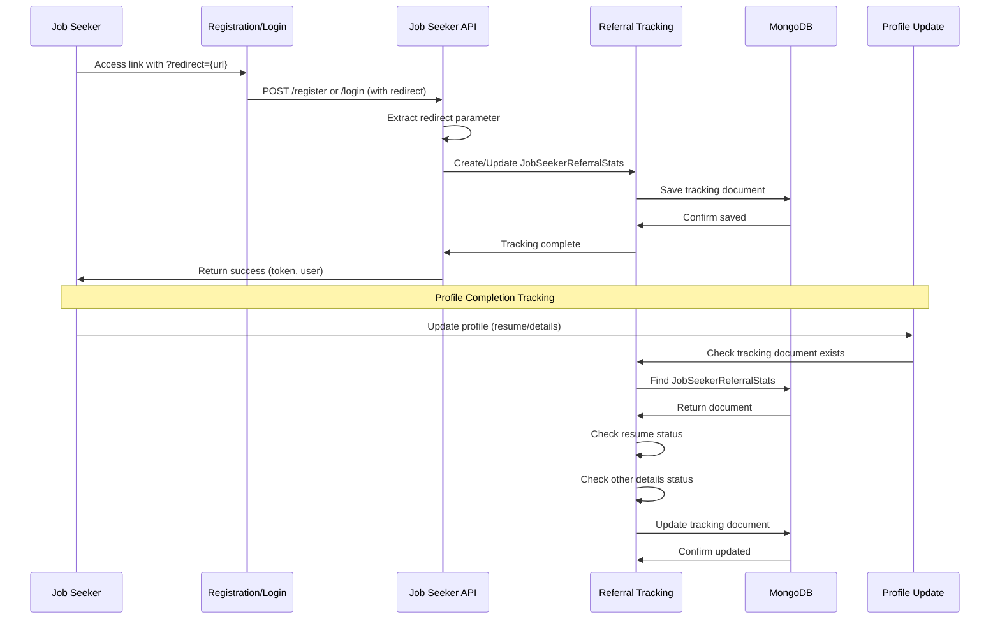
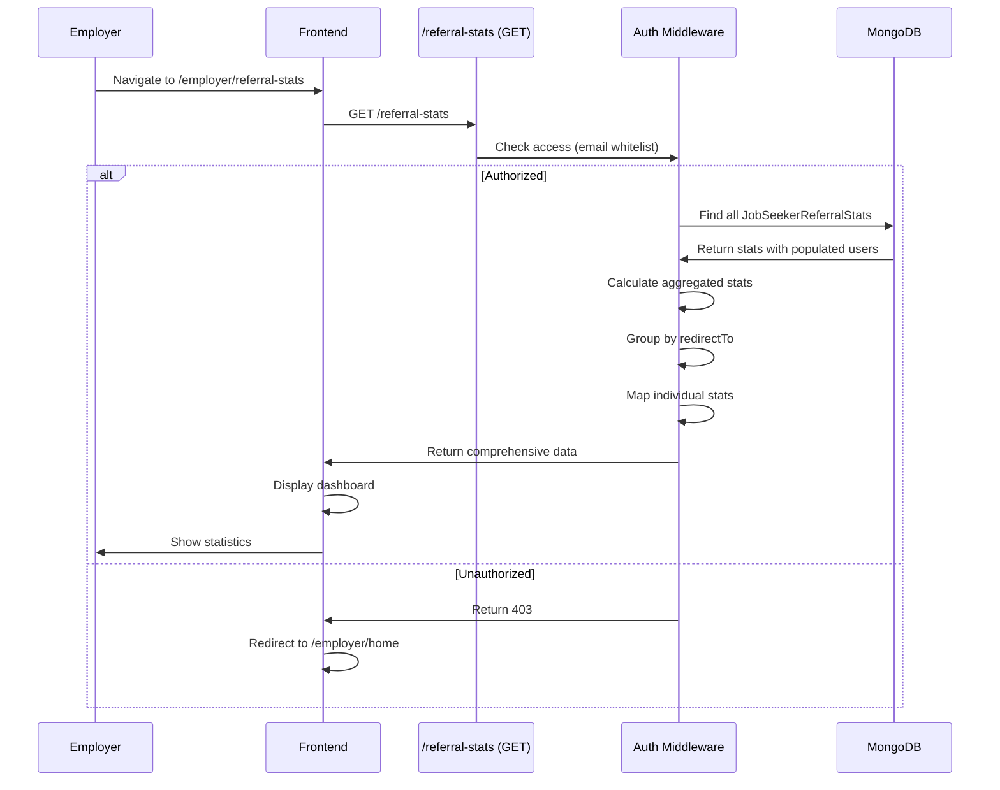

# Feature: Referral Stats

## Overview

**Purpose**: Referral Stats is a tracking and analytics system that monitors job seeker referrals through redirect URLs. It tracks when job seekers register or log in via referral links, monitors their profile completion status, and provides comprehensive statistics to authorized employers. This helps employers measure the effectiveness of their referral campaigns and track user engagement.

**User Story**: As an employer, I want to track job seekers who register or log in through my referral links, see their profile completion status, and view aggregated statistics, so that I can measure the success of my referral campaigns and understand user engagement.

**Key Functionality**:
- Automatic referral tracking via redirect/returnUrl parameters
- Tracks new vs existing users
- Monitors profile completion (resume saved, other details filled)
- Aggregated statistics (totals, completion rates)
- Statistics grouped by redirect URL
- Individual referral records with user details
- Access control (restricted to authorized employers)
- Real-time profile completion updates
- Dashboard with summary cards and detailed tables

**Access Level**: Restricted (Only authorized employers via middleware)

**URL Path**: `/employer/referral-stats`

**Authentication Required**: Yes (Employer JWT token + access check)

---

## User Flow

### View Referral Statistics
1. **Navigate to Referral Stats** (`/employer/referral-stats`):
   - User accesses the Referral Statistics page
   - Access control middleware checks authorization
   - If unauthorized (403), redirects to `/employer/home`
2. **View Dashboard**:
   - Summary cards displayed:
     - Total Referrals
     - New Users
     - Existing Users
     - With Resume
     - With Other Details
     - Completed Profiles
     - Completion Rate (%)
   - Statistics by Redirect URL table (if data exists)
   - Individual Referral Records table (if data exists)
3. **Review Data**:
   - User views aggregated statistics
   - User reviews redirect URL performance
   - User examines individual referral records
   - User can see profile completion status per user

### Referral Tracking Flow (Automatic)
1. **Job Seeker Accesses Referral Link**:
   - Link format: `/signup/jobseeker?redirect={url}` or `/signin/jobseeker?redirect={url}`
   - Redirect parameter captured from query string
2. **Registration/Login**:
   - User registers new account or logs in
   - System captures redirect parameter
   - Tracking document created/updated
3. **Profile Completion Tracking**:
   - System tracks resume upload/update
   - System tracks other profile details (skills, experience, etc.)
   - Tracking document updated automatically

---

## Frontend Implementation

### Screen Structure

**Main Page Component**:
- File: `frontend/src/app/employer/(screens)/referral-stats/page.jsx`
- Component: `ReferralStatsPageClient.jsx`
- Type: Client Component
- Lines: ~180 lines

**Styling**:
- CSS File: `frontend/src/app/employer/(screens)/referral-stats/page.css`
- CSS Modules: No
- Responsive: Yes

### Component Hierarchy

```
ReferralStatsPage (page.jsx)
  └── ReferralStatsPageClient
      ├── Loading State (if loading)
      │   ├── CircularProgress
      │   └── Loading Message
      ├── Error State (if error)
      │   └── Error Message
      └── Content (if loaded)
          ├── Header Section
          │   ├── Title ("Referral Statistics")
          │   └── Subtitle
          ├── Summary Cards Grid
          │   ├── Total Referrals Card
          │   ├── New Users Card
          │   ├── Existing Users Card
          │   ├── With Resume Card
          │   ├── With Other Details Card
          │   ├── Completed Profiles Card (highlight)
          │   └── Completion Rate Card (highlight)
          ├── Statistics by Redirect URL Section (if data exists)
          │   ├── Section Title
          │   └── Table
          │       ├── Table Header
          │       │   ├── Redirect URL
          │       │   ├── Total
          │       │   ├── New Users
          │       │   ├── Existing Users
          │       │   ├── With Resume
          │       │   ├── With Details
          │       │   └── Completed
          │       └── Table Body (map redirect groups)
          └── Individual Referral Records Section (if data exists)
              ├── Section Title
              └── Table
                  ├── Table Header
                  │   ├── User Name
                  │   ├── User Email
                  │   ├── Redirect To
                  │   ├── Account Type
                  │   ├── Resume Saved
                  │   ├── Details Filled
                  │   └── Created At
                  └── Table Body (map individual stats)
                      └── Table Rows
                          ├── Badge Components (Account Type, Yes/No)
                          └── Date Display
          └── Empty State (if no data)
              └── Empty Message
```

### State Management

**Local State**:
```javascript
const [mounted, setMounted] = useState(false);
```

**React Query Hook**:
- `useReferralStats()` - Query for fetching referral statistics

**Data Structure**:
```javascript
{
  summary: {
    totalReferrals: number,
    existingUsers: number,
    newUsers: number,
    withResume: number,
    withOtherDetails: number,
    completedProfiles: number,
    completionRate: string (percentage)
  },
  byRedirect: [
    {
      redirectTo: string,
      count: number,
      existingUsers: number,
      newUsers: number,
      withResume: number,
      withOtherDetails: number,
      completedProfiles: number
    }
  ],
  individualStats: [
    {
      _id: string,
      userId: string,
      userName: string,
      userEmail: string,
      redirectTo: string,
      alreadyHadAccount: boolean,
      isResumeSaved: boolean,
      isOtherDetailsFilled: boolean,
      createdAt: date,
      updatedAt: date
    }
  ]
}
```

### UI Components

**Summary Cards**:
- Grid layout
- Large value display
- Label below value
- Highlight styling for completion metrics

**Tables**:
- Responsive table design
- Clear headers
- Badge components for status indicators:
  - Account Type: "New" (badge-new) or "Existing" (badge-existing)
  - Yes/No: "Yes" (badge-yes) or "No" (badge-no)

**Badges**:
- Color-coded status indicators
- Account type badges (new vs existing)
- Completion status badges (yes vs no)

---

## Backend Implementation

### API Endpoints

#### Get Referral Statistics

**Route Definition**:
```javascript
router.get('/', verifyToken, checkReferralStatsAccess, getReferralStats);
```

**Full Endpoint Path**: `/api/referral-stats`

**HTTP Method**: GET

**Authentication Required**: Yes (JWT + access check)

**Response Format**:
```json
{
  "success": true,
  "data": {
    "summary": {
      "totalReferrals": 100,
      "existingUsers": 40,
      "newUsers": 60,
      "withResume": 75,
      "withOtherDetails": 80,
      "completedProfiles": 65,
      "completionRate": "65.00"
    },
    "byRedirect": [
      {
        "redirectTo": "/jobs",
        "count": 50,
        "existingUsers": 20,
        "newUsers": 30,
        "withResume": 40,
        "withOtherDetails": 45,
        "completedProfiles": 35
      }
    ],
    "individualStats": [
      {
        "_id": "...",
        "userId": "...",
        "userName": "John Doe",
        "userEmail": "john@example.com",
        "redirectTo": "/jobs",
        "alreadyHadAccount": false,
        "isResumeSaved": true,
        "isOtherDetailsFilled": true,
        "createdAt": "2024-01-01T12:00:00Z",
        "updatedAt": "2024-01-02T12:00:00Z"
      }
    ]
  }
}
```

**Controller Logic** (`getReferralStats`):
1. Find all JobSeekerReferralStats records
2. Populate user data (fullName, email)
3. Sort by creation date (newest first)
4. Calculate aggregated statistics:
   - Total referrals
   - Existing users count
   - New users count
   - With resume count
   - With other details count
   - Completed profiles count
   - Completion rate (percentage)
5. Group by redirectTo URL
6. Calculate statistics per redirect group
7. Map individual stats with user information
8. Return comprehensive data structure

#### Get Referral Stats Access

**Route Definition**:
```javascript
router.get('/access', verifyToken, checkReferralStatsAccess, getReferralStatsAccess);
```

**Full Endpoint Path**: `/api/referral-stats/access`

**HTTP Method**: GET

**Authentication Required**: Yes (JWT + access check)

**Response Format**:
```json
{
  "success": true,
  "allowedEmails": ["email1@example.com", "email2@example.com"]
}
```

**Controller Logic** (`getReferralStatsAccess`):
1. Get allowed emails from `REFERRAL_STATS_EMAILS` env variable
2. Return email list

### Referral Tracking Integration

**Registration Tracking** (`registerJobSeeker` in `jobSeekerController.js`):
1. User registers with redirect parameter
2. Extract redirect from query or body (`redirect` or `returnUrl`)
3. Create JobSeekerReferralStats document:
   - `userId`: New user ID
   - `redirectTo`: Redirect parameter
   - `alreadyHadAccount`: false (new user)
   - `isResumeSaved`: false (initial)
   - `isOtherDetailsFilled`: false (initial)
4. Tracking errors don't fail registration

**Login Tracking** (`loginJobSeeker` in `jobSeekerController.js`):
1. User logs in with redirect parameter
2. Extract redirect from query or body
3. Check if tracking document exists:
   - If not exists: Create new document
     - `alreadyHadAccount`: true (existing user)
     - `isResumeSaved`: Current resume status
     - `isOtherDetailsFilled`: Current profile status
   - If exists: Update existing document
     - Update redirectTo if changed
     - Update resume status if changed
     - Update other details status if changed
4. Tracking errors don't fail login

**Profile Update Tracking** (`updateProfile` in `jobSeekerController.js`):
1. User updates profile
2. Find existing tracking document
3. Check resume status (resume field exists and not empty)
4. Check other details status (various fields filled):
   - mobileNumber, skills, experienceInYears, currentLocation
   - highestQualification, languages, gender, dateOfBirth
   - passoutYear, noticePeriod, currentCTC, expectedCTC
   - linkedinUrl, githubUrl, address, profilePicture
5. Update tracking document:
   - `isResumeSaved`: Updated status
   - `isOtherDetailsFilled`: Updated status
6. Tracking errors don't fail profile update

### Database Model

**JobSeekerReferralStats Model** (`backend/src/models/jobSeekerReferralStats.js`):

**Schema Fields**:
- `userId`: ObjectId (ref: JobSeeker, required, unique)
- `redirectTo`: String (required) - The redirect URL parameter
- `alreadyHadAccount`: Boolean (required, default: false)
- `isResumeSaved`: Boolean (default: false)
- `isOtherDetailsFilled`: Boolean (default: false)
- `createdAt`: Date (automatic)
- `updatedAt`: Date (automatic)

**Indexes**:
- `userId`: Index for faster lookups

**Constraints**:
- One document per user (unique userId)
- Referral stats are updated, not duplicated

### Access Control Middleware

**Middleware**: `checkReferralStatsAccess`

**File**: `backend/src/middleware/referralStatsAuthMiddleware.js`

**Logic**:
1. Get allowed emails from `REFERRAL_STATS_EMAILS` env variable
2. If no allowed emails configured, deny access (403)
3. Get employer from database (using userId from token)
4. Check if employer email is in allowed list (case-insensitive)
5. If not in list, deny access (403)
6. If in list, allow request (next())

---

## Data Flow

### Referral Tracking Flow



### Statistics Retrieval Flow



---

## Configuration

### Environment Variables

**`REFERRAL_STATS_EMAILS`**:
- Type: String (comma-separated)
- Example: `"email1@example.com,email2@example.com"`
- Purpose: Email addresses authorized to access referral statistics
- Location: Used in `referralStatsAuthMiddleware.js` and `referralStatsController.js`
- Required: Yes (for access control)

---

## Error Handling

### Frontend Error Handling

**Access Errors**:
- 403 (Access Denied): Redirects to `/employer/home`
- Network errors: Shows error message
- Other errors: Shows error message

**Loading States**:
- Shows loading spinner while fetching
- Prevents hydration mismatch with `mounted` state

### Backend Error Handling

**Statistics Fetch Errors**:
- Database errors: Returns 500 with error message
- Populate errors: Logged, continues processing
- Always returns structured JSON response

**Tracking Errors**:
- Registration tracking errors: Logged, registration continues
- Login tracking errors: Logged, login continues
- Profile update tracking errors: Logged, update continues
- Tracking failures never block user operations

---

## Security Features

### Authentication
- JWT token required for all endpoints
- Token validated on each request
- Employer ID extracted from token

### Authorization
- Middleware checks employer email against allowed list
- `REFERRAL_STATS_EMAILS` env variable contains authorized emails
- 403 Forbidden if not authorized
- Case-insensitive email comparison

### Data Protection
- User data populated with selective fields (fullName, email only)
- No sensitive data exposed
- Individual stats show anonymized user information
- Access restricted to authorized employers only

---

## UI/UX Details

### Layout Structure

**Header Section**:
- Title: "Referral Statistics"
- Subtitle: Description text

**Summary Cards**:
- Grid layout (responsive)
- Large value numbers
- Clear labels
- Highlight styling for key metrics (completion rate, completed profiles)

**Tables**:
- Responsive table design
- Scrollable on mobile
- Clear column headers
- Badge components for visual status

**Badges**:
- Color-coded:
  - Account Type: New (green) / Existing (blue)
  - Completion: Yes (green) / No (gray)
- Inline display
- Consistent styling

### Visual Design

**Summary Cards**:
- Card-based design
- Large, readable numbers
- Highlight styling for completion metrics
- Consistent spacing

**Tables**:
- Clean, readable layout
- Alternating row colors (if implemented)
- Clear column alignment
- Responsive design

**Empty State**:
- Clear message when no data
- Helpful text

### Responsive Design

**Desktop**:
- Full-width layout
- Grid layout for summary cards
- Full table display
- Comfortable spacing

**Tablet**:
- Maintained grid
- Scrollable tables if needed

**Mobile**:
- Stacked card layout
- Horizontal scroll for tables
- Touch-friendly spacing

### Accessibility

**Keyboard Navigation**:
- Tab order logical
- All interactive elements accessible
- Table navigation supported

**Screen Reader Support**:
- Semantic HTML
- Proper table headers
- ARIA labels where needed
- Status announcements

---

## Testing Considerations

### Test Scenarios

**Happy Path**:
1. Authorized employer accesses page → Statistics displayed → Summary cards shown → Tables populated
2. Multiple referrals → Aggregated correctly → Grouped by redirect → Individual records shown

**Error Cases**:
1. Unauthorized access (403) → Redirect to home
2. No data → Empty state shown
3. Network error → Error message displayed
4. Database error → Error message displayed

**Tracking Scenarios**:
1. New user registration with redirect → Tracking document created
2. Existing user login with redirect → Tracking document created/updated
3. Profile update → Resume status updated → Other details status updated
4. Multiple profile updates → Tracking document updated correctly

**Edge Cases**:
1. User with no redirect → No tracking document created
2. User updates profile before referral tracking → Tracking created on next login
3. Multiple redirects for same user → Last redirect saved
4. Profile completion changes → Tracking updated correctly
5. Large dataset → Statistics calculated correctly

---

## Related Features

- **Job Seeker Registration** (`/signup/jobseeker`): Captures redirect parameter
- **Job Seeker Login** (`/signin/jobseeker`): Captures redirect parameter
- **Job Seeker Profile** (`/jobseeker/profile`): Updates tracking on profile changes

---

## Additional Notes

**Benefits for Employers**:
1. **Campaign Measurement**: Track effectiveness of referral links
2. **User Engagement**: Monitor profile completion rates
3. **Data-Driven Decisions**: Analytics for referral strategy
4. **Conversion Tracking**: See which redirects perform best
5. **User Segmentation**: Identify new vs existing users

**Referral Link Format**:
- Registration: `/signup/jobseeker?redirect={url}`
- Login: `/signin/jobseeker?redirect={url}`
- Alternative: `returnUrl` parameter (supported)

**Tracking Logic**:
- One document per user (unique userId)
- Tracks first referral source
- Updates profile completion status automatically
- Non-blocking (errors don't affect user operations)

**Profile Completion Criteria**:
- **Resume Saved**: Resume field exists and not empty
- **Other Details Filled**: At least one of:
  - mobileNumber, skills, experienceInYears, currentLocation
  - highestQualification, languages, gender, dateOfBirth
  - passoutYear, noticePeriod, currentCTC, expectedCTC
  - linkedinUrl, githubUrl, address, profilePicture
- **Completed Profile**: Both resume saved AND other details filled

**Statistics Calculation**:
- Aggregated across all referrals
- Grouped by redirect URL
- Completion rate: (completedProfiles / totalReferrals) * 100
- Real-time updates on profile changes

**Known Limitations**:
- Single document per user (only tracks first referral)
- Access control via email whitelist (not role-based)
- No time-based filtering (shows all time data)
- No export functionality
- No filtering/search capabilities

**Future Enhancements**:
- Time-based filtering (date ranges)
- Export to CSV/Excel
- Search and filter individual records
- Charts and visualizations
- Referral link generation
- Rewards/incentives system
- Email notifications on milestones
- Campaign performance analytics
- A/B testing support
- Custom redirect parameter parsing
- Integration with analytics tools
- Real-time updates (WebSocket)
- Historical trend analysis
- Referral source attribution
- Multi-source tracking

---

## Code References

### Frontend Files
- `frontend/src/app/employer/(screens)/referral-stats/page.jsx` - Main page (~30 lines)
- `frontend/src/app/employer/(screens)/referral-stats/ReferralStatsPageClient.jsx` - Client component (~180 lines)
- `frontend/src/app/employer/(screens)/referral-stats/page.css` - Styling
- `frontend/src/hooks/useReferralStats.js` - React Query hook (~41 lines)

### Backend Files
- `backend/src/routes/referralStatsRoutes.js` - Route definitions (~18 lines):
  - Line 12: GET `/`
  - Line 15: GET `/access`
- `backend/src/controllers/referralStatsController.js` - Controller functions (~109 lines):
  - `getReferralStats` (lines 8-80)
  - `getReferralStatsAccess` (lines 85-102)
- `backend/src/controllers/jobSeekerController.js` - Referral tracking integration:
  - `registerJobSeeker` (lines 253-273) - Registration tracking
  - `loginJobSeeker` (lines 391-450) - Login tracking
  - `updateProfile` (lines 1113-1148) - Profile completion tracking
- `backend/src/models/jobSeekerReferralStats.js` - Database model (~38 lines)
- `backend/src/middleware/referralStatsAuthMiddleware.js` - Access control middleware (~53 lines)

### Environment Variables
- `REFERRAL_STATS_EMAILS` - Authorized email addresses (comma-separated)

---

*Last Updated: [Current Date]*
*Documented By: TSD Documentation System*

