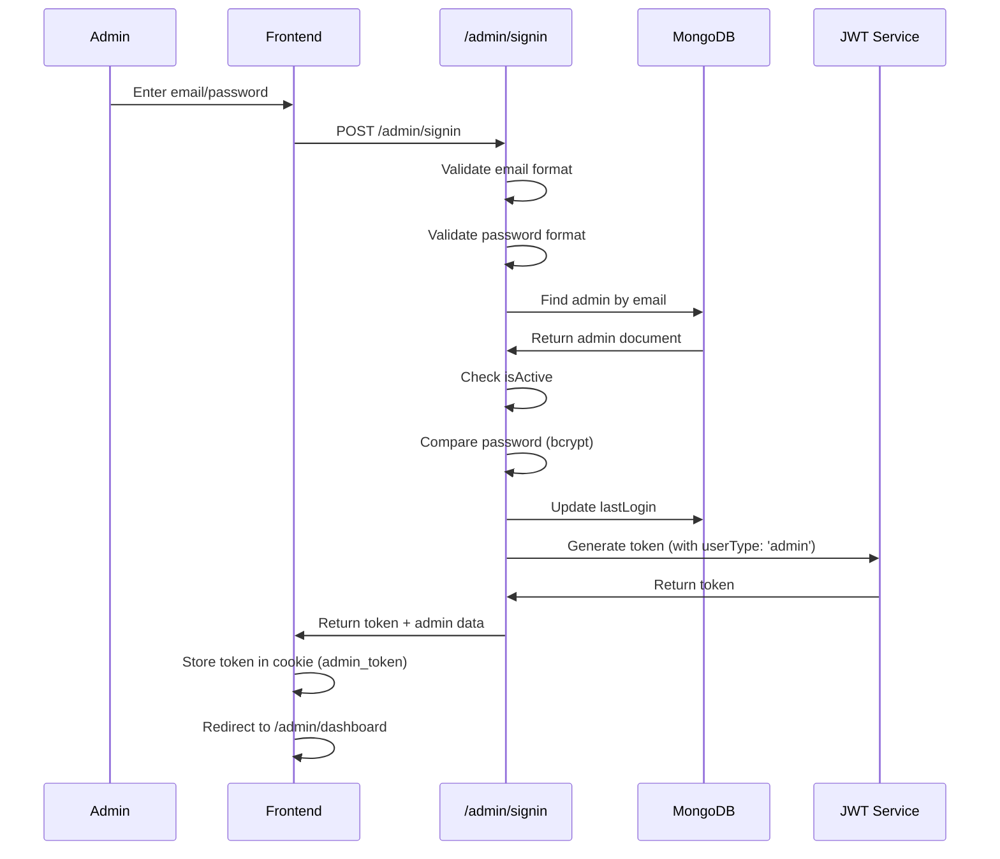
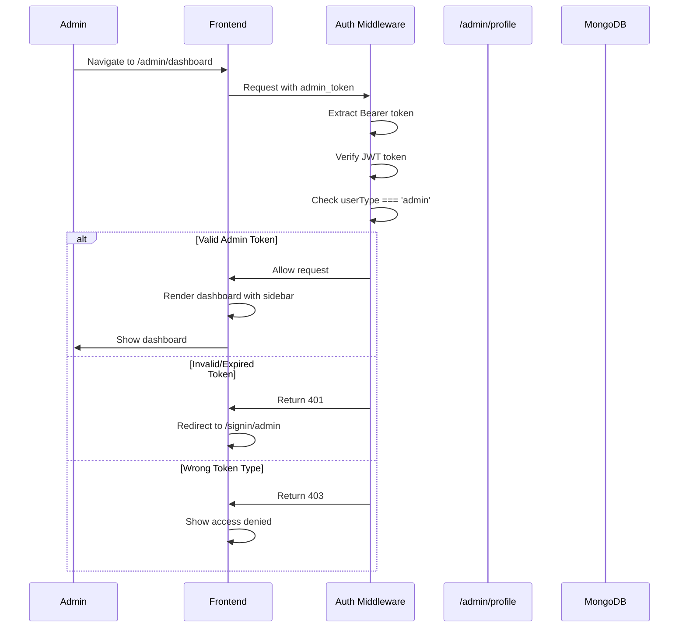
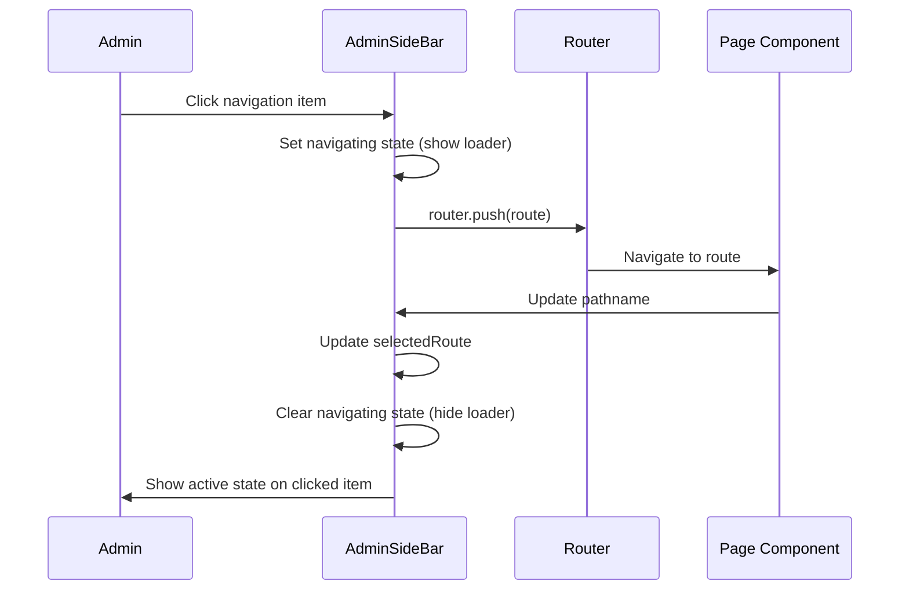

# Feature: Admin Dashboard

## Overview

**Purpose**: The Admin Dashboard is the main administrative interface for platform administrators. It provides access to system management, monitoring, and administrative tools. Currently, the dashboard is a placeholder with basic structure and navigation, with content planned for future implementation.

**User Story**: As an admin, I want to access an administrative dashboard where I can view system statistics, manage platform settings, monitor system health, and access administrative tools, so that I can effectively manage and maintain the platform.

**Key Functionality**:
- Admin authentication and authorization
- Dashboard page structure (placeholder)
- Navigation sidebar with menu items
- Admin profile management
- Job alert system testing tools
- Role-based access control
- Admin session management
- Protected routes with middleware

**Access Level**: Admin Only (Role-based access control)

**URL Path**: `/admin/dashboard`

**Authentication Required**: Yes (Admin JWT token)

**Status**: Under Development (Dashboard content placeholder, authentication and routing fully implemented)

---

## User Flow

### Admin Authentication Flow
1. **Navigate to Admin Sign-In** (`/signin/admin`):
   - Admin enters email and password
   - System validates credentials
   - System checks if admin account is active
   - System generates JWT token with admin role
   - System updates last login timestamp
   - Admin redirected to `/admin/dashboard`
2. **Access Dashboard**:
   - Admin accesses `/admin` (redirects to `/admin/dashboard`)
   - Middleware verifies admin token
   - Dashboard page rendered with sidebar navigation
   - Currently shows placeholder content

### Dashboard Navigation
1. **Navigate Between Sections**:
   - Admin clicks sidebar menu items
   - Navigation with loading indicators
   - Active route highlighting
   - Smooth transitions
2. **Sign Out**:
   - Admin clicks logout button
   - Token removed from cookies
   - Auth event dispatched
   - Redirected to home page

---

## Frontend Implementation

### Screen Structure

**Main Page Component**:
- File: `frontend/src/app/admin/page.jsx`
- Type: Server Component
- Lines: ~5 lines
- Purpose: Redirects to `/admin/dashboard`

**Dashboard Page Component**:
- File: `frontend/src/app/admin/(screens)/dashboard/page.jsx`
- Type: Client Component
- Lines: ~15 lines
- Status: Placeholder (content planned)

**Layout Component**:
- File: `frontend/src/app/admin/(screens)/layout.jsx`
- Type: Client Component
- Lines: ~18 lines
- Purpose: Provides sidebar navigation wrapper

### Component Hierarchy

```
AdminIndex (page.jsx)
  └── Redirects to /admin/dashboard

AdminMainScreenLayout (layout.jsx)
  ├── AdminSideBar
  │   ├── Dashboard Nav Item
  │   ├── Smart Filter Nav Item
  │   └── Logout Button
  └── Main Content Area
      └── {children} (Dashboard/other pages)

AdminDashboardPage (dashboard/page.jsx)
  ├── Header Section
  │   ├── Title ("Admin Dashboard")
  │   └── Description (placeholder text)
  └── Content Area (planned)
```

### State Management

**Sidebar Navigation State**:
```javascript
const [selectedRoute, setSelectedRoute] = useState(pathname);
const [signingOut, setSigningOut] = useState(false);
const [navigating, setNavigating] = useState(false);
const [navigatingTo, setNavigatingTo] = useState(null);
```

**Auth State**:
- Managed via cookies (`admin_token`)
- Auth updates via window events
- Router navigation for redirects

### UI Components

**AdminSideBar Component** (`frontend/src/components/SideBar/AdminSideBar.jsx`):
- Navigation menu with icon indicators
- Active route highlighting
- Loading indicators during navigation
- Logout functionality
- Responsive sidebar design

**Navigation Items**:
1. **Dashboard** (`/admin/dashboard`):
   - Icon: ChartBar (filled/outline based on active state)
   - Active state styling
   - Loading spinner during navigation
2. **Smart Filter** (`/admin/smart-filter`):
   - Icon: AdjustmentsHorizontal (filled/outline based on active state)
   - Active state styling
   - Loading spinner during navigation
3. **Logout Button**:
   - Icon: SignOutBold
   - Loading spinner during sign out
   - Removes token and redirects

### Styling

**CSS File**: `frontend/src/components/SideBar/AdminSideBar.css`

**Layout Structure**:
- Flex layout (sidebar + main content)
- Sidebar fixed width
- Main content area with background color (#eeeeee)
- Padding and spacing for content areas

---

## Backend Implementation

### API Endpoints

#### Admin Sign-In

**Route Definition**:
```javascript
router.post("/signin", adminController.signinAdmin);
```

**Full Endpoint Path**: `/api/admin/signin`

**HTTP Method**: POST

**Authentication Required**: No (public endpoint)

**Request Format**:
```json
{
  "email": "admin@example.com",
  "password": "SecurePass123!"
}
```

**Response Format**:
```json
{
  "success": true,
  "message": "Sign in successful",
  "token": "eyJhbGciOiJIUzI1NiIsInR5cCI6IkpXVCJ9...",
  "data": {
    "_id": "...",
    "fullName": "Admin Name",
    "email": "admin@example.com",
    "role": "admin",
    "lastLogin": "2024-01-01T12:00:00Z"
  }
}
```

**Controller Logic** (`signinAdmin`):
1. Validate email and password presence
2. Validate email format (regex)
3. Validate password format (uppercase, lowercase, number, special char, 8+ chars)
4. Find admin by email (case-insensitive)
5. Check if admin exists
6. Check if admin account is active (`isActive: true`)
7. Compare password with bcrypt hash
8. Update `lastLogin` timestamp
9. Generate JWT token with:
   - `userId`: Admin ID
   - `userName`: Admin full name
   - `role`: Admin role
   - `userType`: 'admin'
10. Use `ADMIN_JWT_SECRET` or fallback to `JWT_SECRET`
11. Return token and admin data

#### Get Admin Profile

**Route Definition**:
```javascript
router.get("/profile", verifyAdminToken, adminController.getProfile);
```

**Full Endpoint Path**: `/api/admin/profile`

**HTTP Method**: GET

**Authentication Required**: Yes (Admin JWT token)

**Response Format**:
```json
{
  "success": true,
  "data": {
    "_id": "...",
    "fullName": "Admin Name",
    "email": "admin@example.com",
    "role": "admin",
    "isActive": true,
    "lastLogin": "2024-01-01T12:00:00Z",
    "createdAt": "2024-01-01T12:00:00Z",
    "updatedAt": "2024-01-01T12:00:00Z"
  }
}
```

**Controller Logic** (`getProfile`):
1. Find admin by ID (from token)
2. Exclude password field from response
3. Return admin data

#### Job Alert System Testing Endpoints

**Get Job Alert Status**:
- Route: `GET /api/admin/test/job-alert/status`
- Purpose: Get job alert system status
- Authentication: Admin token required
- Controller: `getJobAlertStatus`
- Uses: `jobAlertTestService.getJobAlertSystemStatus()`

**Test Job Alert for Job Seeker**:
- Route: `GET /api/admin/test/job-alert/:jobSeekerId`
- Purpose: Test job alert functionality for specific job seeker
- Authentication: Admin token required
- Controller: `testJobAlert`
- Uses: `jobAlertTestService.testJobAlertForJobSeeker(jobSeekerId)`

**Test Send Job Alert Email**:
- Route: `POST /api/admin/test/job-alert/send`
- Purpose: Manually trigger job alert email
- Authentication: Admin token required
- Controller: `testSendJobAlert`
- Request Body: `{ jobSeekerId, jobId }`
- Uses: `jobAlertTestService.testSendEmailAlert(jobSeekerId, jobId)`

**Run Job Matching**:
- Route: `POST /api/admin/test/job-alert/run-matching`
- Purpose: Manually trigger job matching process
- Authentication: Admin token required
- Controller: `runJobMatching`
- Uses: `jobAlertCronService.runScheduledJobMatching()`

### Database Model

**Admin Model** (`backend/src/models/admin.js`):

**Schema Fields**:
- `fullName`: String (required, trimmed)
- `email`: String (required, trimmed, lowercase, unique)
- `password`: String (required, hashed with bcrypt)
- `role`: String (required, enum: ['admin', 'super_admin', 'moderator', 'support'], default: 'admin')
- `isActive`: Boolean (default: true)
- `lastLogin`: Date (optional)
- `createdAt`: Date (automatic)
- `updatedAt`: Date (automatic)

**Indexes**:
- `email`: Unique index (via unique: true)
- `role`: Index for role-based queries

**Validation**:
- Email format validation (regex in controller)
- Password complexity validation (regex in controller)
- Role enum validation

### Authentication Middleware

**Middleware**: `verifyAdminToken`

**File**: `backend/src/middleware/adminAuthMiddleware.js`

**Logic**:
1. Extract Bearer token from Authorization header
2. Verify token using `ADMIN_JWT_SECRET` (or fallback)
3. Check `userType === 'admin'` in decoded token
4. Attach `userId`, `userRole`, `userType` to request object
5. Continue to next middleware/controller
6. Return 401 if token invalid/expired
7. Return 403 if token type is not admin

**Token Payload Structure**:
```javascript
{
  userId: string,      // Admin MongoDB _id
  userName: string,    // Admin fullName
  role: string,        // Admin role (admin, super_admin, etc.)
  userType: 'admin'    // Always 'admin' for admin tokens
}
```

---

## Data Flow

### Admin Sign-In Flow



### Dashboard Access Flow



### Navigation Flow



---

## Configuration

### Environment Variables

**`ADMIN_JWT_SECRET`**:
- Type: String
- Purpose: Secret key for signing/admin JWT tokens
- Fallback: `JWT_SECRET` (if `ADMIN_JWT_SECRET` not set)
- Default (development): `"A123B456cdef1234567"`
- Location: Used in `adminAuthMiddleware.js` and `adminController.js`
- Required: Recommended (for production security)

---

## Error Handling

### Frontend Error Handling

**Authentication Errors**:
- 401 (Unauthorized): Redirect to sign-in page
- 403 (Forbidden): Show access denied message
- Network errors: Handle gracefully

**Navigation Errors**:
- Route not found: 404 page
- Navigation failures: Log error, show user-friendly message

### Backend Error Handling

**Sign-In Errors**:
- Missing email/password: 400 Bad Request
- Invalid email format: 400 Bad Request
- Invalid password format: 400 Bad Request
- Admin not found: 200 OK (with success: false, for security)
- Account inactive: 403 Forbidden
- Invalid password: 200 OK (with success: false, for security)
- Database errors: 500 Internal Server Error
- Always returns structured JSON response

**Profile Errors**:
- Admin not found: 404 Not Found
- Database errors: 500 Internal Server Error

**Middleware Errors**:
- No token: 401 Unauthorized
- Invalid token: 401 Unauthorized
- Wrong token type: 403 Forbidden
- Always returns JSON error response

---

## Security Features

### Authentication
- Bcrypt password hashing
- JWT token-based authentication
- Separate admin JWT secret (recommended)
- Token expiration support
- Role-based token validation

### Authorization
- Admin-specific middleware (`verifyAdminToken`)
- Token type validation (`userType === 'admin'`)
- Role-based access control (via `role` field)
- Account status check (`isActive` field)

### Password Security
- Strong password requirements:
  - At least 8 characters
  - Uppercase letter
  - Lowercase letter
  - Number
  - Special character
- Bcrypt hashing with salt
- Password never returned in API responses

### Account Management
- Account activation/deactivation (`isActive` field)
- Last login tracking
- Role-based permissions (enum: admin, super_admin, moderator, support)

---

## UI/UX Details

### Layout Structure

**Sidebar Navigation**:
- Fixed sidebar on left
- Navigation items with icons
- Active route highlighting
- Loading indicators during navigation
- Logout button in footer

**Main Content Area**:
- Flexible content area
- Background color: #eeeeee
- Padding: 40px
- Minimum height: calc(100vh - 64px)

**Dashboard Page (Current)**:
- Title: "Admin Dashboard" (32px, bold)
- Description: Placeholder text (16px, gray)
- Content area ready for future implementation

### Visual Design

**Sidebar**:
- Clean, minimal design
- Icon + text navigation items
- Active state styling
- Loading spinners (16px, 4px thickness)
- Footer logout button

**Typography**:
- Dashboard title: 32px, weight 700, color #111827
- Description: 16px, color #6b7280
- Navigation items: Standard font size

### Responsive Design

**Desktop**:
- Sidebar fixed width
- Main content area flexible
- Full-height layout

**Tablet/Mobile**:
- Responsive sidebar (collapse/expand if implemented)
- Adaptable content area

### Accessibility

**Keyboard Navigation**:
- Tab order logical
- All interactive elements accessible
- Navigation keyboard support

**Screen Reader Support**:
- Semantic HTML
- ARIA labels where needed
- Icon descriptions

---

## Testing Considerations

### Test Scenarios

**Happy Path**:
1. Admin signs in with valid credentials → Token generated → Redirected to dashboard
2. Admin accesses dashboard → Sidebar shown → Dashboard content displayed
3. Admin navigates between sections → Route changes → Active state updates

**Error Cases**:
1. Invalid email format → Validation error
2. Weak password → Validation error
3. Wrong credentials → Generic error message
4. Inactive account → Access denied (403)
5. Invalid/expired token → Redirect to sign-in (401)
6. Wrong token type → Access denied (403)

**Security Tests**:
1. Password not in response
2. Token validation works correctly
3. Admin-only endpoints protected
4. Account deactivation blocks access
5. Password complexity enforced

**Edge Cases**:
1. Missing token → Redirect to sign-in
2. Malformed token → Error handling
3. Database connection failure → Error message
4. Concurrent login attempts → Handled correctly

---

## Related Features

- **Admin Sign-In** (`/signin/admin`): Admin authentication
- **Admin Smart Filter** (`/admin/smart-filter`): Administrative filtering tool (planned)
- **Job Alert Testing**: Admin tools for testing job alert system
- **Admin Profile**: Admin profile management (via `/api/admin/profile`)

---

## Additional Notes

**Current Implementation Status**:
- ✅ Admin authentication fully implemented
- ✅ Admin model and database schema complete
- ✅ Admin routes and middleware functional
- ✅ Sidebar navigation implemented
- ✅ Layout structure in place
- ⏳ Dashboard content (placeholder - planned)
- ⏳ Statistics display (planned)
- ⏳ System monitoring tools (planned)
- ⏳ User management interface (planned)
- ⏳ Platform settings (planned)

**Admin Roles**:
- `admin`: Standard admin role
- `super_admin`: Super administrator (highest privileges)
- `moderator`: Moderator role (limited permissions)
- `support`: Support role (customer support access)

**Token Management**:
- Admin tokens stored in `admin_token` cookie
- Separate JWT secret recommended for admin tokens
- Token includes `userType: 'admin'` for validation
- Token includes role for future role-based features

**Future Enhancements (Planned)**:
1. **Dashboard Statistics**:
   - Total users (job seekers, employers)
   - Total jobs posted
   - Total applications
   - Platform usage metrics
   - Revenue statistics
   - Growth charts and trends
2. **User Management**:
   - View all users
   - Search and filter users
   - Activate/deactivate accounts
   - View user details
   - Edit user information
3. **Job Management**:
   - View all jobs
   - Moderate job postings
   - Edit/delete jobs
   - Job analytics
4. **System Monitoring**:
   - Server health status
   - API performance metrics
   - Error logs and monitoring
   - Database statistics
5. **Platform Settings**:
   - Global settings management
   - Feature flags
   - Email configuration
   - Payment settings
6. **Analytics**:
   - User growth analytics
   - Job posting trends
   - Application statistics
   - Revenue reports
7. **Content Management**:
   - Blog management
   - Static content editing
   - Email templates
8. **Security**:
   - Audit logs
   - Security monitoring
   - Access logs
   - Failed login attempts tracking

**Admin Sidebar Navigation**:
- Currently includes: Dashboard, Smart Filter
- Extensible for future menu items
- Active route highlighting
- Smooth navigation transitions

**Job Alert Testing Tools**:
- Available for testing job alert system
- Manual job matching trigger
- Job alert status checking
- Email testing capabilities

**Known Limitations**:
- Dashboard content not yet implemented
- No statistics display currently
- No user management interface
- No system monitoring dashboard
- No analytics visualizations
- Limited admin tools currently available

---

## Code References

### Frontend Files
- `frontend/src/app/admin/page.jsx` - Index page (redirect) (~5 lines)
- `frontend/src/app/admin/(screens)/dashboard/page.jsx` - Dashboard page (~15 lines, placeholder)
- `frontend/src/app/admin/(screens)/layout.jsx` - Layout with sidebar (~18 lines)
- `frontend/src/app/admin/(screens)/smart-filter/page.jsx` - Smart Filter page (~15 lines, placeholder)
- `frontend/src/components/SideBar/AdminSideBar.jsx` - Admin sidebar navigation (~115 lines)
- `frontend/src/components/SideBar/AdminSideBar.css` - Sidebar styling
- `frontend/src/app/signin/admin/page.jsx` - Admin sign-in page wrapper
- `frontend/src/app/signin/admin/AdminSigninClient.jsx` - Admin sign-in client component

### Backend Files
- `backend/src/routes/adminRoutes.js` - Admin route definitions (~20 lines):
  - Line 8: POST `/signin`
  - Line 11: GET `/profile`
  - Lines 14-17: Job alert testing routes
- `backend/src/controllers/adminController.js` - Admin controller functions (~212 lines):
  - `signinAdmin` (lines 12-93)
  - `getProfile` (lines 96-119)
  - `getJobAlertStatus` (lines 122-137)
  - `testJobAlert` (lines 140-156)
  - `testSendJobAlert` (lines 159-181)
  - `runJobMatching` (lines 184-201)
- `backend/src/models/admin.js` - Admin database model (~47 lines)
- `backend/src/middleware/adminAuthMiddleware.js` - Admin authentication middleware (~33 lines)

### Environment Variables
- `ADMIN_JWT_SECRET` - Admin JWT secret key (recommended)
- `JWT_SECRET` - Fallback JWT secret (if ADMIN_JWT_SECRET not set)

---

*Last Updated: [Current Date]*
*Documented By: TSD Documentation System*
*Status: Under Development (Authentication and routing complete, dashboard content planned)*

