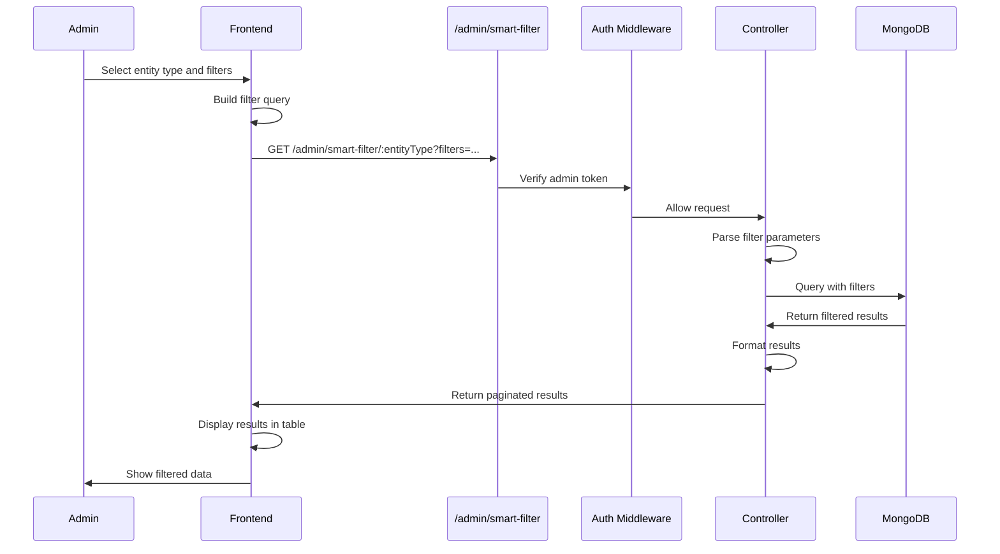
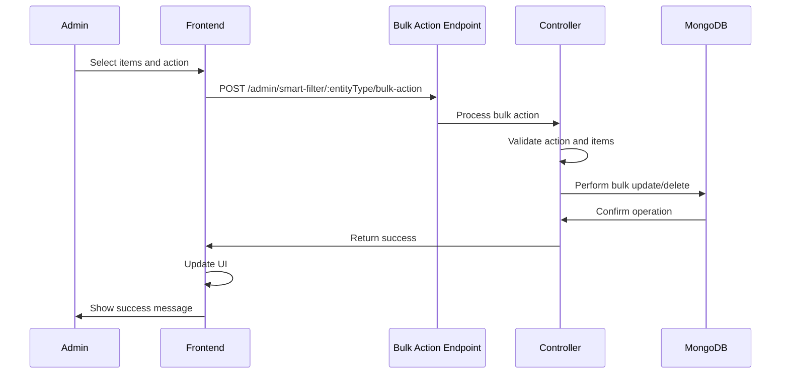

# Feature: Admin Smart Filter

## Overview

**Purpose**: Admin Smart Filter is a planned administrative tool for filtering and managing platform data. The feature is currently under development with a placeholder page structure in place. It is designed to provide admins with advanced filtering capabilities for managing users, jobs, applications, and other platform entities.

**User Story**: As an admin, I want to use smart filtering tools to efficiently search, filter, and manage platform data, so that I can quickly find and manage users, jobs, applications, and other entities based on various criteria.

**Key Functionality** (Planned):
- Advanced filtering interface for platform data
- Multi-criteria filtering options
- Search and filter users (job seekers, employers)
- Search and filter jobs
- Search and filter applications
- Export filtered results
- Saved filter presets
- Bulk operations on filtered results

**Access Level**: Admin Only (Role-based access control)

**URL Path**: `/admin/smart-filter`

**Authentication Required**: Yes (Admin JWT token)

**Status**: Under Development (Page structure and navigation in place, functionality planned but not yet implemented)

---

## User Flow

### Access Smart Filter
1. **Navigate to Smart Filter** (`/admin/smart-filter`):
   - Admin clicks "Smart Filter" in sidebar navigation
   - Middleware verifies admin token
   - Smart Filter page rendered
   - Currently shows placeholder content

### Smart Filter Usage (Planned)
1. **Select Entity Type**:
   - Admin selects entity to filter (users, jobs, applications, etc.)
   - Filter interface updates based on selection
2. **Apply Filters**:
   - Admin selects filter criteria
   - Admin enters search terms
   - Admin sets date ranges
   - Admin applies multiple filters
3. **View Results**:
   - Filtered results displayed in table/list
   - Results paginated
   - Results sorted
4. **Take Actions**:
   - Admin selects items from filtered results
   - Admin performs bulk operations
   - Admin exports filtered results
   - Admin saves filter preset

---

## Frontend Implementation

### Screen Structure

**Smart Filter Page Component**:
- File: `frontend/src/app/admin/(screens)/smart-filter/page.jsx`
- Type: Client Component
- Lines: ~15 lines
- Status: Placeholder (functionality planned)

### Component Hierarchy

```
AdminMainScreenLayout (layout.jsx)
  ├── AdminSideBar
  │   ├── Dashboard Nav Item
  │   ├── Smart Filter Nav Item (active)
  │   └── Logout Button
  └── Main Content Area
      └── AdminSmartFilterPage (smart-filter/page.jsx)
          ├── Header Section
          │   ├── Title ("Smart Filter")
          │   └── Description (placeholder text)
          └── Content Area (planned)
              ├── Entity Type Selector (planned)
              ├── Filter Interface (planned)
              ├── Results Table (planned)
              └── Action Buttons (planned)
```

### State Management

**Current State** (Placeholder):
- No state management currently (placeholder page)

**Planned State** (Future Implementation):
```javascript
// Planned state structure
const [entityType, setEntityType] = useState('users');
const [filters, setFilters] = useState({});
const [searchTerm, setSearchTerm] = useState('');
const [results, setResults] = useState([]);
const [selectedItems, setSelectedItems] = useState([]);
const [loading, setLoading] = useState(false);
const [pagination, setPagination] = useState({ page: 1, limit: 20 });
```

### UI Components

**Current Components** (Placeholder):
- Header with title and description
- Basic layout structure

**Planned Components** (Future Implementation):
1. **Entity Type Selector**:
   - Dropdown or tabs for selecting entity type
   - Options: Users, Jobs, Applications, etc.
2. **Filter Panel**:
   - Dynamic filter fields based on entity type
   - Date range pickers
   - Multi-select dropdowns
   - Text search inputs
   - Checkboxes for boolean filters
3. **Results Table**:
   - Sortable columns
   - Pagination controls
   - Row selection checkboxes
   - Action buttons per row
4. **Action Bar**:
   - Bulk action buttons
   - Export button
   - Save filter preset button
   - Clear filters button

### Styling

**Current Styling**:
- Consistent with Admin Dashboard styling
- Padding: 40px
- Minimum height: calc(100vh - 64px)
- Title: 32px, weight 700, color #111827
- Description: 16px, color #6b7280

**Planned Styling** (Future Implementation):
- Filter panel with card-based design
- Table with responsive design
- Action buttons with consistent styling
- Form inputs with validation styling

---

## Backend Implementation

### API Endpoints

**Current Status**: No backend endpoints implemented yet

**Planned Endpoints** (Future Implementation):

#### Get Filtered Results

**Planned Route**: `GET /api/admin/smart-filter/:entityType`

**Planned Parameters**:
- Query parameters for filters
- Pagination parameters (page, limit)
- Sort parameters (sortBy, sortOrder)

**Planned Response**:
```json
{
  "success": true,
  "data": {
    "results": [],
    "pagination": {
      "currentPage": 1,
      "totalPages": 10,
      "totalItems": 200,
      "limit": 20
    },
    "filters": {}
  }
}
```

#### Get Filter Options

**Planned Route**: `GET /api/admin/smart-filter/:entityType/options`

**Planned Purpose**: Get available filter options for entity type

**Planned Response**:
```json
{
  "success": true,
  "data": {
    "filterOptions": {
      "status": ["active", "inactive"],
      "role": ["admin", "employer", "jobseeker"],
      // ... other filter options
    }
  }
}
```

#### Bulk Actions

**Planned Route**: `POST /api/admin/smart-filter/:entityType/bulk-action`

**Planned Purpose**: Perform bulk operations on filtered items

**Planned Request**:
```json
{
  "action": "activate" | "deactivate" | "delete" | "export",
  "itemIds": ["id1", "id2", "id3"]
}
```

#### Save Filter Preset

**Planned Route**: `POST /api/admin/smart-filter/presets`

**Planned Purpose**: Save a filter configuration as a preset

#### Get Filter Presets

**Planned Route**: `GET /api/admin/smart-filter/presets`

**Planned Purpose**: Get all saved filter presets

#### Export Filtered Results

**Planned Route**: `POST /api/admin/smart-filter/:entityType/export`

**Planned Purpose**: Export filtered results to CSV/Excel

**Planned Parameters**:
- Query parameters matching filter endpoint
- Export format (csv, excel)

### Database Models

**Current Status**: No specific models for Smart Filter

**Planned Models** (Future Implementation):

**FilterPreset Model** (Planned):
```javascript
{
  _id: ObjectId,
  adminId: ObjectId (ref: Admin),
  name: String,
  entityType: String,
  filters: Object,
  createdAt: Date,
  updatedAt: Date
}
```

### Controller Logic

**Current Status**: No controller functions implemented

**Planned Controller Functions** (Future Implementation):
1. `getFilteredResults` - Get filtered results for entity type
2. `getFilterOptions` - Get available filter options
3. `performBulkAction` - Execute bulk operations
4. `saveFilterPreset` - Save filter configuration
5. `getFilterPresets` - Get all saved presets
6. `deleteFilterPreset` - Delete a saved preset
7. `exportFilteredResults` - Export results to file

---

## Data Flow

### Planned Data Flow (Future Implementation)



### Planned Bulk Action Flow (Future Implementation)



---

## Configuration

### Environment Variables

**Current Status**: No specific configuration needed yet

**Planned Configuration** (Future Implementation):
- Filter result limits
- Export file size limits
- Bulk action limits
- Cache settings for filter options

---

## Error Handling

### Current Error Handling

**Placeholder Page**:
- No specific error handling (static placeholder)

### Planned Error Handling (Future Implementation)

**Frontend Error Handling**:
- Network errors: Show error message, allow retry
- Invalid filters: Show validation errors
- Empty results: Show "No results found" message
- Loading states: Show loading indicators
- Export errors: Show error notification

**Backend Error Handling**:
- Invalid entity type: 400 Bad Request
- Invalid filters: 400 Bad Request with details
- Unauthorized: 401 Unauthorized
- Forbidden: 403 Forbidden
- Database errors: 500 Internal Server Error
- Always return structured JSON responses

---

## Security Features

### Authentication
- Admin JWT token required for all endpoints
- Token validated on each request via middleware

### Authorization
- Admin-specific middleware (`verifyAdminToken`)
- Token type validation (`userType === 'admin'`)
- Role-based access control (if implemented)

### Data Protection
- Admin-only access to filtered data
- Sensitive data filtered appropriately
- Export files protected
- Bulk actions logged for audit

### Planned Security (Future Implementation):
- Filter injection prevention
- Rate limiting on filter queries
- Export file access control
- Audit logging for admin actions
- Input validation and sanitization

---

## UI/UX Details

### Current Layout

**Header Section**:
- Title: "Smart Filter" (32px, bold, color #111827)
- Description: Placeholder text (16px, color #6b7280)

**Content Area**:
- Empty content area ready for implementation
- Consistent padding and spacing

### Planned Layout (Future Implementation)

**Filter Panel**:
- Left sidebar or top section
- Collapsible filter groups
- Clear visual hierarchy
- Apply/Reset buttons

**Results Section**:
- Main content area
- Sortable table
- Pagination controls
- Row actions menu

**Action Bar**:
- Sticky top bar
- Selected items count
- Bulk action dropdown
- Export button
- Clear selection button

### Visual Design

**Current Design**:
- Consistent with Admin Dashboard
- Clean, minimal placeholder

**Planned Design** (Future Implementation):
- Card-based filter panel
- Data table with alternating row colors
- Icon buttons for actions
- Badge indicators for active filters
- Progress indicators for bulk operations

### Responsive Design

**Current**: Responsive layout structure in place

**Planned** (Future Implementation):
- Mobile: Collapsible filter panel, stackable table
- Tablet: Side-by-side filters and results
- Desktop: Full layout with sidebar filters

### Accessibility

**Current**: Basic semantic HTML

**Planned** (Future Implementation):
- Keyboard navigation support
- Screen reader announcements
- ARIA labels for all interactive elements
- Focus management
- Keyboard shortcuts for common actions

---

## Testing Considerations

### Current Testing

**Placeholder Page**:
- Route renders correctly
- Navigation works
- Authentication required

### Planned Testing (Future Implementation)

**Happy Path**:
1. Select entity type → Filter options load
2. Apply filters → Results display
3. Select items → Bulk actions enabled
4. Export results → File downloads
5. Save filter preset → Preset saved and retrievable

**Error Cases**:
1. Invalid filters → Validation errors
2. No results → Empty state message
3. Network error → Error message with retry
4. Export failure → Error notification
5. Bulk action failure → Partial success handling

**Security Tests**:
1. Unauthorized access → Redirect/error
2. Invalid token → 401 response
3. Filter injection attempts → Sanitized
4. Export access control → Verified
5. Bulk action permissions → Checked

**Edge Cases**:
1. Large result sets → Pagination works
2. Complex filters → Query performance
3. Concurrent exports → Rate limiting
4. Deleted entities → Graceful handling
5. Filter preset management → CRUD operations

---

## Related Features

- **Admin Dashboard** (`/admin/dashboard`): Main admin interface
- **Admin Sign-In** (`/signin/admin`): Admin authentication
- **Job Search & Browsing** (`/jobs`): Public job filtering (different feature)
- **Job Management** (`/employer/jobs`): Employer job filtering (different feature)

---

## Additional Notes

**Current Implementation Status**:
- ✅ Page structure in place
- ✅ Navigation link in AdminSideBar
- ✅ Route configured
- ✅ Authentication required
- ⏳ Filter interface (planned)
- ⏳ Backend endpoints (planned)
- ⏳ Database queries (planned)
- ⏳ Export functionality (planned)
- ⏳ Bulk operations (planned)
- ⏳ Filter presets (planned)

**Feature Purpose**:
The Admin Smart Filter is designed to provide administrators with powerful filtering capabilities to efficiently manage and search through platform data. This tool will be essential for:
- User management (finding specific users)
- Job moderation (filtering jobs by various criteria)
- Application review (filtering applications)
- System monitoring (filtering logs and events)
- Data analysis (exporting filtered datasets)

**Planned Entity Types** (Future Implementation):
1. **Users**:
   - Job Seekers
   - Employers
   - Admins
2. **Jobs**:
   - All jobs
   - By status
   - By employer
   - By date range
3. **Applications**:
   - By job
   - By status
   - By date
   - By job seeker
4. **Payments**:
   - By user
   - By plan
   - By date range
   - By status
5. **Analytics**:
   - Platform statistics
   - User activity
   - Job performance
   - Revenue data

**Planned Filter Types** (Future Implementation):
1. **Text Search**: Full-text search across fields
2. **Date Range**: Start and end date filtering
3. **Status Filters**: Dropdown with status options
4. **Category Filters**: Multi-select categories
5. **Boolean Filters**: Yes/No checkboxes
6. **Numeric Range**: Min/max value filters
7. **Relationship Filters**: Filter by related entities

**Planned Bulk Actions** (Future Implementation):
1. **Activate/Deactivate**: Change status of multiple items
2. **Delete**: Remove multiple items
3. **Export**: Export selected items
4. **Assign**: Assign items to categories/users
5. **Tag**: Apply tags to multiple items
6. **Notify**: Send notifications to selected users

**Known Limitations**:
- Feature not yet implemented
- No backend support currently
- No filtering logic available
- No export functionality
- No bulk operations
- No filter presets

**Future Enhancements**:
1. Advanced search with AI
2. Saved filter presets with sharing
3. Scheduled filter reports
4. Filter templates for common queries
5. Real-time filter suggestions
6. Filter performance analytics
7. Custom filter builder
8. Integration with analytics tools
9. API access for filters
10. Filter history and recent filters
11. Collaborative filtering (share filters with team)
12. Filter validation and testing
13. Advanced export formats (JSON, XML)
14. Filter-based automations
15. Dashboard widgets from filters

---

## Code References

### Frontend Files
- `frontend/src/app/admin/(screens)/smart-filter/page.jsx` - Smart Filter page (~15 lines, placeholder)
- `frontend/src/app/admin/(screens)/layout.jsx` - Layout with sidebar (~18 lines)
- `frontend/src/components/SideBar/AdminSideBar.jsx` - Admin sidebar navigation (~115 lines):
  - Lines 79-91: Smart Filter navigation item

### Backend Files
- **No backend implementation currently**

### Planned Backend Files (Future Implementation)
- `backend/src/routes/adminRoutes.js` - Add Smart Filter routes
- `backend/src/controllers/adminSmartFilterController.js` - Controller functions (planned)
- `backend/src/models/filterPreset.js` - Filter preset model (planned)
- `backend/src/services/smartFilterService.js` - Filter logic service (planned)

---

*Last Updated: [Current Date]*
*Documented By: TSD Documentation System*
*Status: Under Development (Page structure and navigation complete, functionality planned but not yet implemented)*

