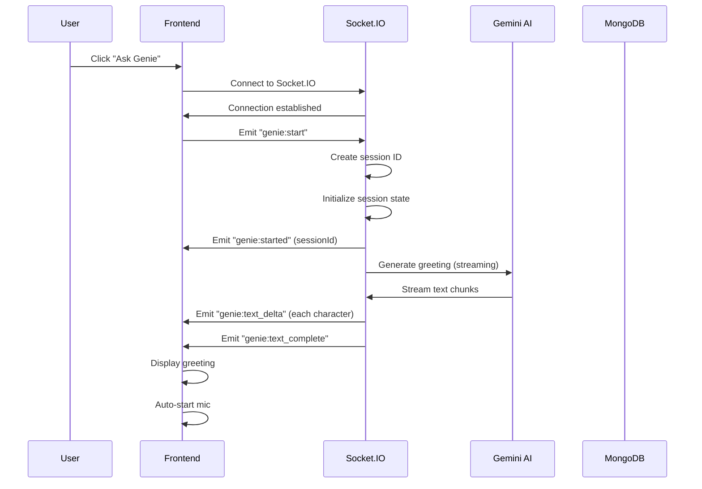
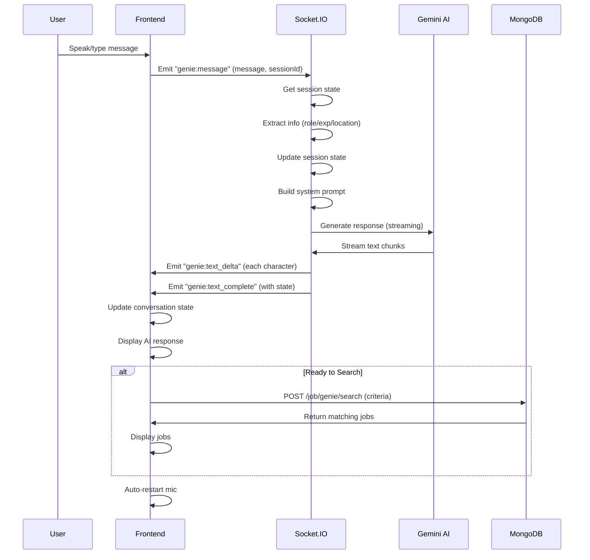
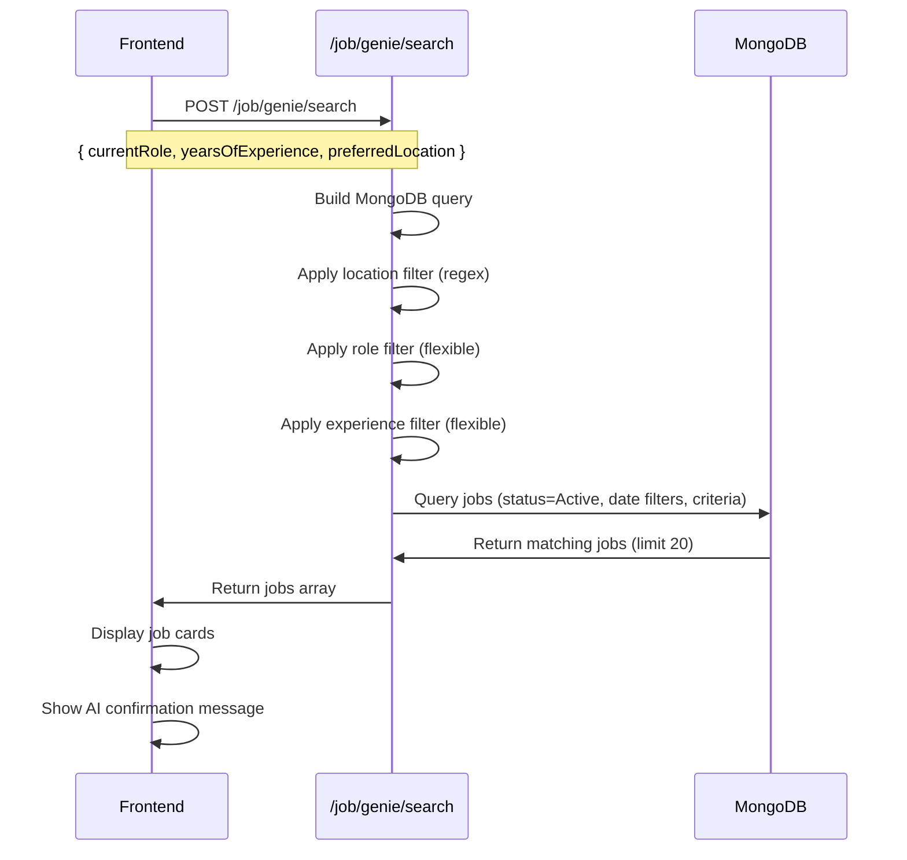

# Feature: Genie

## Overview

**Purpose**: Genie is an AI-powered job search assistant that uses natural language conversation to help job seekers find jobs. It collects job search criteria (role, experience, location) through a conversational interface, supports both voice and text input, and provides real-time streaming AI responses. Once all information is collected, Genie searches for matching jobs and displays them to the user.

**User Story**: As a job seeker, I want to interact with an AI assistant using natural language (voice or text) to describe what I'm looking for, so that I can quickly find relevant jobs without manually filling out search forms.

**Key Functionality**:
- AI-powered conversational interface
- Voice input support (Web Speech API)
- Text input support
- Real-time streaming AI responses via Socket.IO
- Conversation state management (role, experience, location)
- Information extraction from natural language
- Intelligent job search based on collected criteria
- Job results display with key details
- Session-based conversation tracking
- Auto-mic enable/disable for voice interactions

**Access Level**: Public (No authentication required)

**URL Path**: `/genie`

**Authentication Required**: No

---

## User Flow

### Start Conversation
1. **Navigate to Genie** (`/genie`):
   - User lands on Genie page
   - "Ask Genie" button displayed
   - User clicks button to start conversation
2. **Initialize Session**:
   - Socket.IO connection established
   - Genie session created with unique ID
   - Initial greeting streamed character-by-character
   - Conversation state initialized (asking_role)

### Conversational Flow
1. **Collect Role Information**:
   - Genie asks: "What is your current role or the role you're looking for?"
   - User responds via voice or text
   - AI extracts role from user message
   - State updates to `asking_experience`
   - Genie confirms and asks next question
2. **Collect Experience Information**:
   - Genie asks: "How many years of experience do you have?"
   - User responds (e.g., "3 years", "fresher", "entry level")
   - AI extracts years of experience (numbers or keywords)
   - State updates to `asking_location`
   - Genie confirms and asks next question
3. **Collect Location Information**:
   - Genie asks: "What is your preferred location?"
   - User responds with location
   - AI extracts location
   - State updates to `done`
   - Genie confirms and indicates ready to search

### Job Search
1. **Trigger Search**:
   - When all information collected, Genie signals `[SEARCH_JOBS]`
   - Frontend triggers job search API call
   - Search uses collected criteria (role, experience, location)
2. **Display Results**:
   - Jobs matching criteria displayed below conversation
   - Each job shows: title, company, location, experience, work mode
   - Link to view full job details
   - Genie confirms number of jobs found

### Voice Input Flow
1. **Enable Voice**:
   - User clicks microphone button
   - Web Speech API starts listening
   - "Listening..." indicator shown
   - Auto-mic enabled (restarts after AI response)
2. **Voice Recognition**:
   - Speech recognition captures audio
   - Interim results displayed in input field
   - Final transcript sent as message
   - Auto-stop after silence (2 seconds)
3. **Auto-Mic Management**:
   - Mic automatically restarts after AI finishes speaking
   - Mic disabled during AI processing
   - User can manually toggle mic on/off

---

## Frontend Implementation

### Screen Structure

**Main Page Component**:
- File: `frontend/src/app/genie/page.jsx`
- Type: Client Component Wrapper
- Lines: ~9 lines

**Genie Page Client Component**:
- File: `frontend/src/app/genie/GeniePageClient.jsx`
- Type: Client Component
- Lines: ~588 lines

**Styling**:
- CSS File: `frontend/src/app/genie/page.css`
- CSS Modules: No
- Responsive: Yes

### Component Hierarchy

```
GeniePage (page.jsx)
  └── GeniePageClient
      ├── Title Section
      │   └── "Meet Genie - Your Job Search Assistant"
      ├── Start Section (if conversation not started)
      │   ├── "Ask Genie" Button
      │   └── Description Text
      └── Conversation Section (if conversation started)
          ├── Status Indicators
          │   ├── Connection Status
          │   └── Listening Indicator
          ├── Messages Container
          │   └── Message List
          │       ├── User Messages
          │       ├── AI Messages (with streaming)
          │       └── Loading Indicator
          ├── Input Section
          │   ├── Textarea Input
          │   └── Action Buttons
          │       ├── Microphone Toggle
          │       └── Send Button
          ├── Jobs Loading Indicator (if loading)
          └── Jobs Section (if jobs found)
              ├── Jobs Title
              └── Jobs List
                  └── Job Cards
                      ├── Job Title
                      ├── Company Name
                      ├── Location
                      ├── Experience
                      ├── Work Mode
                      └── View Job Link
```

### State Management

**Local State**:
```javascript
const [isConnected, setIsConnected] = useState(false);
const [isListening, setIsListening] = useState(false);
const [isLoading, setIsLoading] = useState(false);
const [conversationStarted, setConversationStarted] = useState(false);
const [messages, setMessages] = useState([]);
const [jobs, setJobs] = useState([]);
const [loadingJobs, setLoadingJobs] = useState(false);
const [userInput, setUserInput] = useState("");

// Conversation state
const [currentRole, setCurrentRole] = useState(null);
const [yearsOfExperience, setYearsOfExperience] = useState(null);
const [preferredLocation, setPreferredLocation] = useState(null);
```

**Refs**:
```javascript
const recognitionRef = useRef(null); // Speech recognition instance
const messagesEndRef = useRef(null); // Auto-scroll target
const socketRef = useRef(null); // Socket.IO connection
const silenceTimeoutRef = useRef(null); // Voice input timeout
const autoMicEnabledRef = useRef(true); // Auto-mic control
const lastInterimTranscriptRef = useRef(""); // Interim speech text
const currentStreamingMessageRef = useRef(""); // Streaming message buffer
const streamingMessageIndexRef = useRef(-1); // Current streaming message index
const sessionIdRef = useRef(null); // Genie session ID
```

**Socket.IO Events**:
- `connect` - Socket connection established
- `genie:started` - Genie session started
- `genie:text_delta` - Streaming text character (character-by-character)
- `genie:text_complete` - Streaming text complete (full message)
- `genie:error` - Error occurred
- `disconnect` - Socket disconnected

**Socket.IO Emissions**:
- `genie:start` - Start Genie session
- `genie:message` - Send user message

### UI Components

**Start Button**:
- Large, prominent button
- Gradient background
- Loading spinner when initializing
- "Ask Genie" text

**Status Indicators**:
- Connection status: Connected/Connecting (color-coded)
- Listening indicator: "🎤 Listening..." (animated pulse)

**Messages Display**:
- User messages: Right-aligned, blue background
- AI messages: Left-aligned, gray background
- Streaming indicator: Blinking cursor (▋)
- Auto-scroll to bottom on new messages

**Input Section**:
- Textarea for text input
- Placeholder changes based on listening state
- Disabled during loading/AI processing
- Enter key to send (Shift+Enter for new line)

**Action Buttons**:
- Microphone button: Toggle voice input (icon changes)
- Send button: Send text message (disabled if empty)

**Job Cards**:
- Card-based layout
- Job title (heading)
- Company name
- Location with icon
- Experience with icon
- Work mode with icon
- "View Job Details" link

### Speech Recognition

**Initialization**:
- Checks for Web Speech API support
- Creates SpeechRecognition instance
- Configured for continuous recognition
- Language: en-US
- Interim results enabled

**Event Handlers**:
- `onresult`: Processes speech recognition results
  - Interim results: Update input field
  - Final results: Send message immediately
  - Silence timeout: Auto-send after 2 seconds of silence
- `onerror`: Handles recognition errors
  - Ignores "no-speech" and "aborted" errors
  - Shows error for other errors
- `onend`: Auto-restart logic
  - Restarts if auto-mic enabled and not manually stopped

---

## Backend Implementation

### API Endpoints

#### Get Genie Greeting

**Route Definition**:
```javascript
router.get("/greeting", genieController.getGreeting);
```

**Full Endpoint Path**: `/genie/greeting`

**HTTP Method**: GET

**Authentication Required**: No (public endpoint)

**Response Format**:
```json
{
  "success": true,
  "message": "Hi! I think you're looking for jobs. Tell me some details and I'll find the best jobs that suit you. What is your current role or the role you're looking for?"
}
```

**Controller Logic** (`getGreeting`):
1. Initialize Gemini AI client
2. Check if GEMINI_API_KEY configured
3. Get model (default: 'gemini-2.5-flash')
4. Build greeting prompt
5. Generate content with Gemini
6. Return greeting text

**Note**: This endpoint exists but is not currently used by the frontend (greeting sent via Socket.IO instead)

#### Process Genie Message

**Route Definition**:
```javascript
router.post("/message", genieController.processMessage);
```

**Full Endpoint Path**: `/genie/message`

**HTTP Method**: POST

**Authentication Required**: No (public endpoint)

**Request Format**:
```json
{
  "message": "I'm looking for a software developer role",
  "conversationState": "asking_role",
  "currentRole": null,
  "yearsOfExperience": null,
  "preferredLocation": null
}
```

**Response Format**:
```json
{
  "success": true,
  "message": "Great! How many years of experience do you have?",
  "extractedRole": "Software developer",
  "extractedYears": null,
  "extractedLocation": null,
  "readyToSearch": false,
  "conversationState": "asking_experience"
}
```

**Controller Logic** (`processMessage`):
1. Validate message presence
2. Initialize Gemini AI client
3. Extract information from message:
   - **Role extraction**: Parse role from message (remove filler words, capitalize)
   - **Experience extraction**: Match numbers or keywords (fresher, entry, etc.)
   - **Location extraction**: Take remaining text as location
4. Determine conversation state based on collected info
5. Build system prompt with context and next instruction
6. Generate AI response with Gemini
7. Return response with extracted data and updated state

**Information Extraction Logic**:
- Role: Removes "I am", "I'm", "looking for", etc. and capitalizes
- Experience: Regex match for numbers or keyword matching (fresher=0)
- Location: Takes remaining text (if not a confirmation word)

**Note**: This endpoint exists but is not currently used by the frontend (messages sent via Socket.IO instead)

#### Search Jobs for Genie

**Route Definition**:
```javascript
router.post("/genie/search", jobController.searchJobsForGenie);
```

**Full Endpoint Path**: `/job/genie/search`

**HTTP Method**: POST

**Authentication Required**: No (public endpoint)

**Request Format**:
```json
{
  "currentRole": "Software developer",
  "yearsOfExperience": 3,
  "preferredLocation": "Bangalore"
}
```

**Response Format**:
```json
{
  "success": true,
  "data": [
    {
      "_id": "...",
      "jobTitle": "Software Developer",
      "companyName": "Tech Corp",
      "location": "Bangalore, India",
      "experience": "2-5 years",
      "workMode": "Remote",
      "shortId": "abc123",
      "employerId": {
        "companyName": "Tech Corp",
        "companyLogo": "..."
      }
    }
  ],
  "count": 10
}
```

**Controller Logic** (`searchJobsForGenie`):
1. Extract search criteria from request body
2. Build MongoDB query:
   - Status: 'Active' only
   - Application closing date: Not passed
   - Application opening date: Passed or today
3. Apply location filter (regex match, case-insensitive)
4. Apply role filter (flexible matching):
   - Split role into terms
   - Match jobTitle with any term (OR condition)
   - Also try full role match
5. Apply experience filter (flexible matching):
   - Match exact years
   - Match ranges that include user's experience
   - Handle fresher/entry level (0 years)
   - Handle different experience brackets
6. Combine all conditions with $and
7. Query jobs with:
   - Populate employer data (companyName, companyLogo)
   - Sort by createdAt (recent first)
   - Limit to 20 results
8. Return matching jobs

### Socket.IO Implementation

**Socket Server**: `backend/src/socket/socketServer.js`

**Genie Session Management**:
- `genieSessions` Map: Stores session state
  - Key: sessionId (e.g., "genie_socketId_timestamp")
  - Value: `{ conversationState, currentRole, yearsOfExperience, preferredLocation }`

**Socket Events Handled**:

1. **`genie:start`**:
   - Create unique session ID
   - Initialize session state (all fields null, state: 'asking_role')
   - Store session in Map
   - Emit `genie:started` with sessionId
   - Send streaming greeting via `sendStreamingGreeting`

2. **`genie:message`**:
   - Get session state from Map
   - Extract information from message:
     - Role: Extract if not present, skip confirmations
     - Experience: Regex match or keyword match
     - Location: Extract if not present, skip confirmations
   - Update session state based on extracted info
   - Build system prompt with context and next question
   - Send streaming response via `sendStreamingResponse`
   - Update session in Map
   - Emit `genie:text_complete` with updated state and `readyToSearch` flag

3. **`genie:disconnect`**:
   - Clean up session from Map
   - Close any Gemini connections

**Helper Functions**:

1. **`sendStreamingGreeting`**:
   - Initialize Gemini AI client
   - Build greeting prompt
   - Use `generateContentStream` for streaming
   - Emit each character via `genie:text_delta` (with 20ms delay)
   - Emit `genie:text_complete` when done

2. **`sendStreamingResponse`**:
   - Initialize Gemini AI client
   - Use `generateContentStream` for streaming
   - Emit each character via `genie:text_delta` (with 10ms delay)
   - Emit `genie:text_complete` with:
     - fullText
     - conversationState
     - currentRole
     - yearsOfExperience
     - preferredLocation
     - readyToSearch (boolean)

### Database Models

**No specific models for Genie**:
- Sessions stored in memory (Map)
- Jobs queried from existing Job model
- No persistent conversation storage

---

## Data Flow

### Conversation Initialization Flow



### Message Processing Flow



### Job Search Flow



---

## Configuration

### Environment Variables

**`GEMINI_API_KEY`**:
- Type: String
- Purpose: API key for Google Gemini AI
- Required: Yes (for Genie functionality)
- Location: Used in `genieController.js` and `socketServer.js`

**`GEMINI_MODEL`**:
- Type: String
- Default: `'gemini-2.5-flash'`
- Purpose: Gemini model to use for Genie
- Location: Used in `genieController.js` and `socketServer.js`

**Socket.IO Configuration**:
- CORS configured in socket server initialization
- Transports: ['websocket', 'polling']
- No authentication required (public endpoint)

---

## Error Handling

### Frontend Error Handling

**Socket Connection Errors**:
- Connection failures: Show error, allow retry
- Disconnection: Show disconnected status, attempt reconnection
- Socket errors: Emit `genie:error` event, display error message

**Speech Recognition Errors**:
- Not supported: Show error toast, disable voice input
- Errors: Log and handle gracefully (ignore "no-speech", "aborted")
- Auto-restart: Only if auto-mic enabled and not manually stopped

**API Errors**:
- Job search errors: Show error toast, display error message in chat
- Network errors: Show error message, allow retry

**State Management**:
- Missing session: Handle gracefully, prevent message sending
- Missing criteria: Show error when trying to search
- Streaming errors: Handle incomplete messages gracefully

### Backend Error Handling

**Gemini API Errors**:
- API key missing: Return 500 with "Gemini API not configured"
- Generation errors: Log error, return 500 with error message
- Always return structured JSON response

**Socket.IO Errors**:
- Session not found: Emit `genie:error` event
- Generation errors: Emit `genie:error` event
- Connection errors: Handle in disconnect handler

**Job Search Errors**:
- Missing criteria: Query works with partial criteria (flexible matching)
- Database errors: Return 500 with error message
- Always return structured JSON response

---

## Security Features

### Authentication
- No authentication required (public feature)
- Socket.IO connections open to all

### Input Validation
- Message validation: Check for empty messages
- Sanitization: Handle user input safely in prompts
- Injection prevention: Use parameterized queries for job search

### Rate Limiting
- No rate limiting currently implemented (consider for production)
- Socket.IO connections limited by server capacity

### Data Privacy
- Session data stored in memory only (not persisted)
- No user data stored between sessions
- Job search uses public job data only

---

## UI/UX Details

### Layout Structure

**Page Layout**:
- Full-page gradient background (purple gradient)
- Centered white container with rounded corners
- Maximum width: 900px
- Padding: 2rem
- Box shadow for depth

**Title Section**:
- Centered heading
- Large font size (2rem)
- Purple color (#667eea)
- Bold weight (700)

**Start Section**:
- Centered layout
- Large button (gradient background)
- Description text below button
- Spacious padding (3rem vertical)

**Conversation Section**:
- Flex column layout
- Status indicators at top
- Messages container (scrollable)
- Input section at bottom (sticky)

**Job Cards**:
- Card-based layout
- Spacing between cards
- Key information highlighted
- Clear call-to-action link

### Visual Design

**Color Scheme**:
- Primary gradient: #667eea to #764ba2
- Background: White container on gradient background
- User messages: Blue background
- AI messages: Gray background
- Status indicators: Green (connected), Red (disconnected), Yellow (listening)

**Typography**:
- Font family: 'Roboto Flex', sans-serif
- Title: 2rem, bold
- Body text: 1rem
- Messages: Standard size
- Job cards: Varied sizes for hierarchy

**Animations**:
- Button hover: Translate up, enhanced shadow
- Listening indicator: Pulse animation
- Streaming cursor: Blinking animation
- Loading spinner: Rotation animation

### Responsive Design

**Desktop**:
- Full layout with sidebar space
- Maximum width container
- Comfortable padding and spacing

**Tablet**:
- Maintained layout structure
- Adjusted padding if needed

**Mobile**:
- Full-width container
- Adjusted font sizes
- Touch-friendly button sizes
- Optimized message display

### Accessibility

**Keyboard Navigation**:
- Tab order: Button → Input → Action buttons
- Enter key: Send message
- Shift+Enter: New line in textarea

**Screen Reader Support**:
- Semantic HTML structure
- ARIA labels for buttons (title attributes)
- Status announcements (connection, listening)
- Message roles (user vs AI)

**Voice Input**:
- Browser permission required
- Clear indicator when listening
- Error handling for unsupported browsers

---

## Testing Considerations

### Test Scenarios

**Happy Path**:
1. Start conversation → Socket connects → Greeting received → Message sent → AI responds → All info collected → Jobs searched → Results displayed
2. Voice input → Speech recognized → Message sent → AI responds → Conversation continues
3. Text input → Message sent → AI responds → All criteria collected → Jobs displayed

**Error Cases**:
1. No Gemini API key → Error message shown
2. Socket connection fails → Error handling → Retry option
3. Speech recognition not supported → Error toast → Text input only
4. Job search fails → Error message in chat
5. No jobs found → AI message with suggestion

**Edge Cases**:
1. User provides all info in one message → AI extracts all → Searches immediately
2. User confirms with "yes" → AI skips extraction → Continues asking
3. Multiple sessions → Each session independent
4. Socket disconnect → Reconnection handling
5. Rapid messages → Queue handling → State consistency
6. Long messages → Truncation or handling
7. Special characters in input → Proper encoding
8. Empty search criteria → Partial matching works
9. Invalid experience format → Keyword matching (fresher, entry)
10. Location variations → Regex matching handles

**Voice Input Tests**:
1. Speech recognition start/stop
2. Interim vs final results
3. Silence timeout (2 seconds)
4. Auto-restart after AI response
5. Manual toggle (enable/disable)
6. Error recovery (restart on error)
7. Multiple browsers/devices
8. Background tab handling

**Streaming Tests**:
1. Character-by-character display
2. Multiple streaming messages
3. Streaming interruption handling
4. Complete message finalization
5. State updates during streaming

---

## Related Features

- **Job Search & Browsing** (`/jobs`): Traditional job search interface
- **Job Seeker Home Dashboard** (`/jobseeker/home`): Job seeker main interface
- **Voice Agent** (`/voice-agent/[resumeId]`): Different voice feature (for interviews)

---

## Additional Notes

**Architecture Notes**:
- Genie uses Socket.IO for real-time streaming (not REST API for conversation)
- REST endpoints (`/genie/greeting`, `/genie/message`) exist but are not used by frontend
- Session state stored in memory (Map) - not persisted
- Each Socket.IO connection gets unique session ID

**AI Integration**:
- Uses Google Gemini AI (gemini-2.5-flash model)
- Streaming responses for real-time feel
- Character-by-character streaming with delays (10-20ms per character)
- Context-aware prompts based on conversation state

**Information Extraction**:
- Rule-based extraction (regex, keyword matching)
- Handles variations in user input
- Skips confirmation words ("yes", "correct", etc.)
- Flexible matching for better user experience

**Job Search Flexibility**:
- Location: Partial matching (regex)
- Role: Term-based matching (OR logic)
- Experience: Range matching and keyword matching
- Returns up to 20 most recent matching jobs

**Voice Input Features**:
- Web Speech API integration
- Continuous recognition mode
- Interim results display
- Auto-stop after silence
- Auto-restart for hands-free interaction
- Manual control toggle

**Performance Considerations**:
- Streaming delays (10-20ms per character) balance real-time feel with performance
- Job search limited to 20 results
- Session cleanup on disconnect
- No database queries for conversation state

**Known Limitations**:
- Sessions not persisted (lost on page refresh)
- No conversation history beyond current session
- Job search limited to 20 results
- Voice input requires browser support and permissions
- No authentication (public feature)
- No rate limiting
- Experience matching is rule-based (not AI-powered)

**Future Enhancements**:
1. Persist conversations (database storage)
2. Conversation history for returning users
3. Multi-turn conversations (refine search)
4. Save favorite searches
5. Email job results
6. More flexible job matching (AI-powered)
7. Additional search criteria (salary, work mode, etc.)
8. Voice output (text-to-speech for AI responses)
9. Multi-language support
10. Conversation analytics
11. A/B testing for prompts
12. User feedback collection
13. Integration with job seeker profiles (auto-fill from profile)
14. Smart suggestions based on conversation context
15. Resume analysis integration
16. Job recommendations after search
17. Comparison features for multiple jobs
18. Export search results
19. Share conversation link
20. Mobile app support

---

## Code References

### Frontend Files
- `frontend/src/app/genie/page.jsx` - Page wrapper (~9 lines)
- `frontend/src/app/genie/GeniePageClient.jsx` - Main component (~588 lines):
  - Lines 10-34: State and refs
  - Lines 46-59: Cleanup effects
  - Lines 61-76: Auto-scroll and auto-mic effects
  - Lines 78-171: Speech recognition initialization
  - Lines 173-220: Voice input start/stop
  - Lines 222-345: Conversation start and Socket.IO setup
  - Lines 347-371: Message sending
  - Lines 373-432: Job search
  - Lines 434-449: Input handlers
  - Lines 451-584: Render logic
- `frontend/src/app/genie/page.css` - Styling (~424 lines)

### Backend Files
- `backend/src/routes/genieRoutes.js` - Route definitions (~11 lines):
  - Line 7: GET `/greeting`
  - Line 8: POST `/message`
- `backend/src/controllers/genieController.js` - Controller functions (~223 lines):
  - `getGreeting` (lines 21-55)
  - `processMessage` (lines 60-217)
- `backend/src/routes/jobRoutes.js` - Job search route (~14):
  - Line 14: POST `/genie/search`
- `backend/src/controllers/jobController.js` - Job search controller:
  - `searchJobsForGenie` (lines 1150-1267)
- `backend/src/socket/socketServer.js` - Socket.IO implementation:
  - Line 113: `genieSessions` Map definition
  - Lines 1000-1026: `genie:start` handler
  - Lines 1028-1075: `sendStreamingGreeting` helper
  - Lines 1077-1158: `genie:message` handler
  - Lines 1160-1210: `sendStreamingResponse` helper
  - Lines 1212-1218: `genie:disconnect` handler
- `backend/src/app.js` - Route registration:
  - Line 15: Import genieRoutes
  - Line 81: Use `/genie` routes

### Environment Variables
- `GEMINI_API_KEY` - Google Gemini API key (required)
- `GEMINI_MODEL` - Gemini model name (default: 'gemini-2.5-flash')

---

*Last Updated: [Current Date]*
*Documented By: TSD Documentation System*

