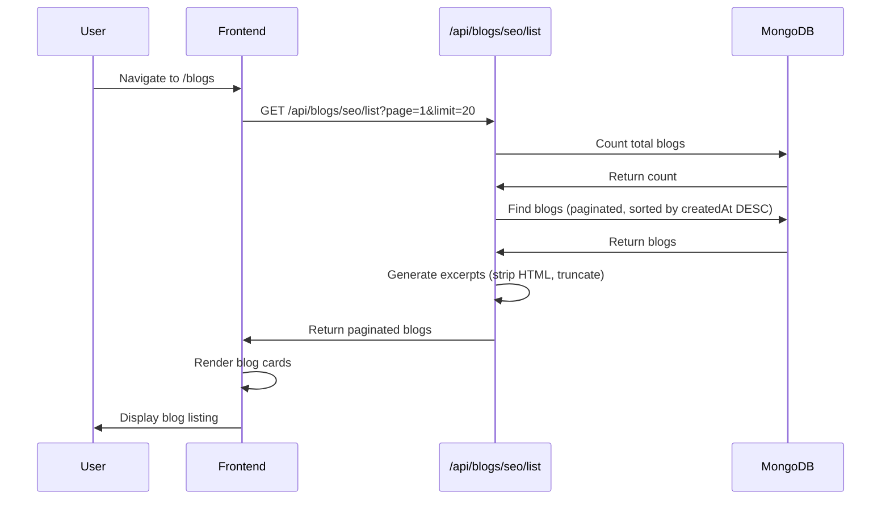
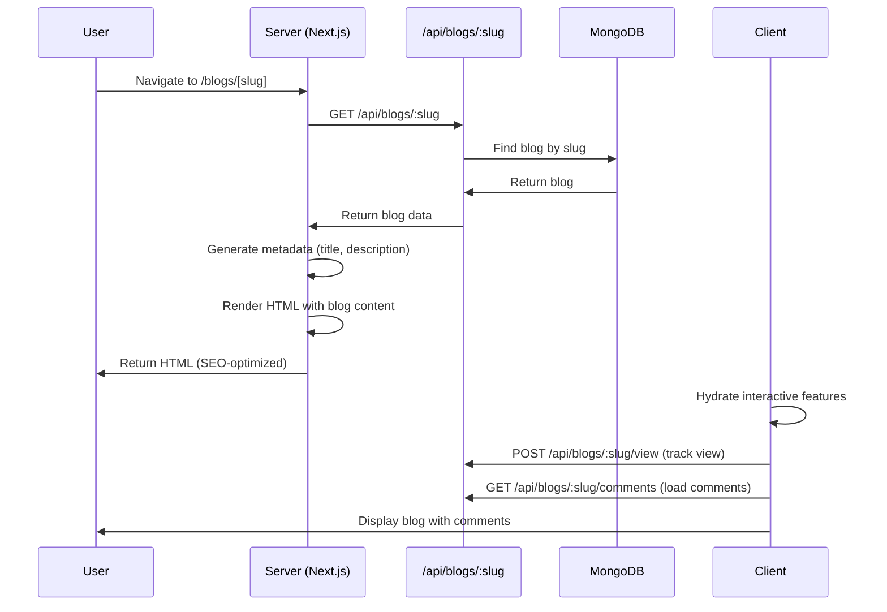
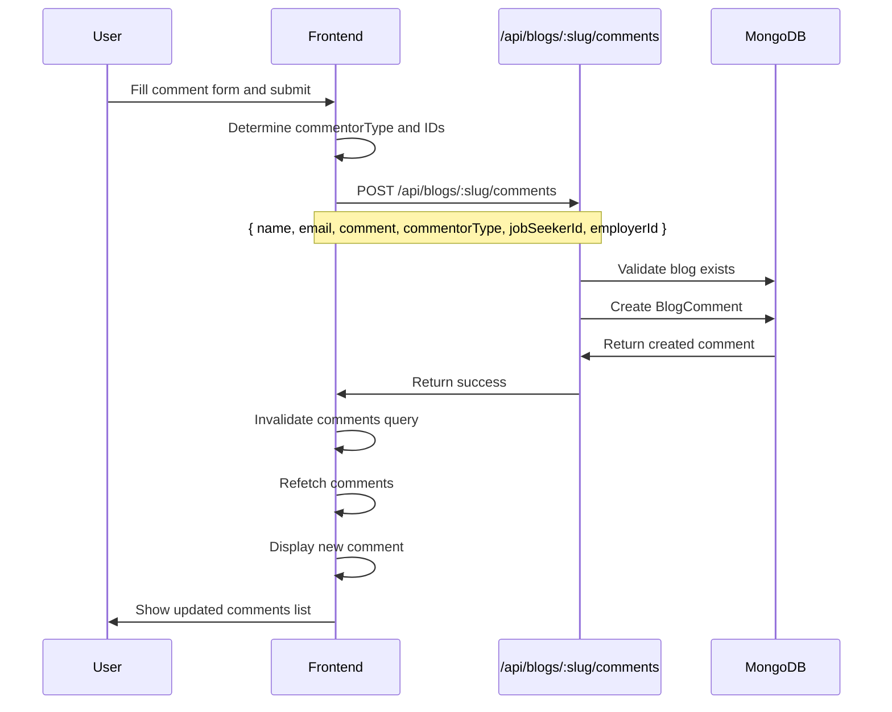
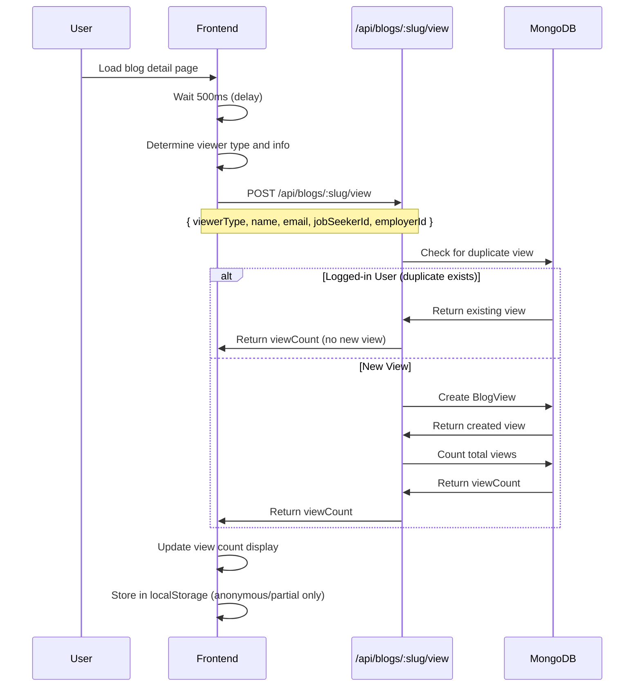

# Feature: Blogs

## Overview

**Purpose**: Blogs is a content management and display system that allows employers and job seekers to view blog posts about recruitment insights, hiring strategies, market trends, and career growth. The feature includes blog listing with pagination, individual blog detail pages with server-side rendering for SEO, a comment system with infinite scroll, and view tracking. Blogs are generated using AI (via Blog Agent) and can be published automatically or manually.

**User Story**: As a user (employer or job seeker), I want to read blog posts about recruitment and career topics, view blog details, leave comments, and see engagement metrics, so that I can stay informed about industry trends and share my thoughts with the community.

**Key Functionality**:
- Blog listing with pagination (SEO-optimized)
- Blog detail page with server-side rendering
- Comment system with infinite scroll
- View tracking and analytics
- Support for logged-in users (job seekers, employers)
- Anonymous and partial user support
- Email confirmation for comment notifications
- Server-side rendering for SEO
- Metadata generation for search engines
- Responsive design

**Access Level**: Public (No authentication required, but logged-in users get enhanced features)

**URL Paths**: 
- `/blogs` - Blog listing page
- `/blogs/[slug]` - Blog detail page

**Authentication Required**: No (optional for enhanced features)

---

## User Flow

### View Blog Listing
1. **Navigate to Blogs** (`/blogs`):
   - User accesses blog listing page
   - Server-side rendering shows blogs immediately
   - Pagination controls displayed (if more than 20 blogs)
   - User can click on any blog card to view details
2. **Browse Blogs**:
   - User sees grid of blog cards
   - Each card shows: topic badge, date, title, excerpt
   - User scrolls through pagination if needed
   - User clicks "Read more" or card to view blog

### View Blog Details
1. **Access Blog** (`/blogs/[slug]`):
   - User clicks on blog card or link
   - Blog fetched server-side for SEO
   - Full blog content displayed
   - View count tracked automatically
   - Comments section displayed below content
2. **Read Blog**:
   - User reads HTML content
   - User sees metadata (topic, date, views, comments count, status)
   - User can navigate back to blog listing
   - View is tracked in background

### Comment on Blog
1. **View Comments**:
   - Comments section displays existing comments (infinite scroll)
   - User sees comment count
   - User can load more comments if available
2. **Add Comment**:
   - **Logged-in User**:
     - Name and email auto-filled from account
     - Form collapsed (user info displayed)
     - User can expand to change name/email
     - User types comment
     - User submits comment
     - Comment appears immediately after submission
   - **Anonymous User**:
     - User fills name (optional, defaults to "Anonymous")
     - User fills email (optional)
     - User types comment
     - User submits comment
     - Name/email saved to localStorage for future comments
     - Comment appears after submission
3. **Email Confirmation**:
   - If email provided, user can check box to receive emails
   - Email confirmation stored with comment
   - Used for sending blog recommendations, jobs, etc.

### View Tracking
1. **Automatic Tracking**:
   - View tracked when blog page loads (500ms delay)
   - Tracking based on user type:
     - **Logged-in Job Seeker**: Tracked by jobSeekerId (no duplicates)
     - **Logged-in Employer**: Tracked by employerId (no duplicates)
     - **Anonymous**: Tracked with IP/session (may have duplicates)
     - **Partial**: Upgraded from anonymous if name/email provided
2. **View Count Display**:
   - View count fetched and displayed
   - Updated periodically (30s stale time)
   - Shows in blog metadata

---

## Frontend Implementation

### Screen Structure

**Blog Listing Page**:
- File: `frontend/src/app/blogs/page.jsx`
- Component: `BlogsPageClient.jsx`
- Type: Client Component
- Lines: ~190 lines

**Blog Detail Page**:
- File: `frontend/src/app/blogs/[slug]/page.jsx`
- Type: Server Component (for SEO)
- Lines: ~167 lines
- Client Component: `BlogDetailPageClient.jsx` (~164 lines)

**Comment Section Component**:
- File: `frontend/src/app/blogs/[slug]/CommentSection.jsx`
- Type: Client Component
- Lines: ~397 lines

**Styling**:
- CSS Files: `page.css` (listing and detail), `comments.css` (comments)

### Component Hierarchy

```
BlogsPage (page.jsx)
  └── BlogsPageClient
      ├── Header Section
      │   ├── Eyebrow Text ("Recruitment Insights")
      │   ├── Title ("Blogs for Employers & Job Seekers")
      │   └── Subtitle
      ├── Blog Grid (if blogs exist)
      │   └── Blog Cards (map)
      │       ├── Topic Badge
      │       ├── Date
      │       ├── Title
      │       ├── Excerpt
      │       └── Read More Link
      ├── Pagination (if totalPages > 1)
      │   ├── Page Info
      │   ├── Previous Button
      │   ├── Page Numbers
      │   └── Next Button
      └── Empty State (if no blogs)

BlogDetailPage (page.jsx) - Server Component
  ├── Header (Back Link)
  ├── Article (Server-rendered)
  │   ├── Title
  │   ├── Meta (Topic, Date, Status)
  │   └── Content (HTML)
  └── BlogDetailPageClient (Client Component)
      └── CommentSection
          ├── Comments Header
          ├── Comment Form
          │   ├── User Info Display (if collapsed)
          │   ├── Name Field (if expanded)
          │   ├── Email Field (if expanded)
          │   ├── Email Confirmation Checkbox
          │   ├── Comment Textarea
          │   └── Submit Button
          └── Comments List
              ├── Comment Items (map)
              │   ├── Author Name
              │   ├── Date
              │   └── Comment Text
              └── Load More Button (if hasMore)
```

### State Management

**Blog Listing State**:
```javascript
const [currentPage, setCurrentPage] = useState(1);
```

**Blog Detail State**:
```javascript
// Uses server-side initial data
const blog = initialBlog || data?.blog; // Server or client data
```

**Comment Section State**:
```javascript
const [name, setName] = useState('');
const [email, setEmail] = useState('');
const [emailConfirmed, setEmailConfirmed] = useState(false);
const [comment, setComment] = useState('');
const [showForm, setShowForm] = useState(true);
const [isSubmitting, setIsSubmitting] = useState(false);
const [userType, setUserType] = useState(null); // 'jobseeker', 'employer', or null
```

**React Query Hooks**:
- `useSeoBlogs(page)` - Fetch paginated blogs for listing
- `useBlogBySlug(slug)` - Fetch single blog by slug
- `useBlogComments(slug)` - Fetch comments with infinite scroll
- `useCreateComment(slug)` - Create new comment mutation
- `useTrackBlogView(slug, blogId)` - Track blog view mutation
- `useBlogViewCount(slug)` - Fetch view count
- `useJobSeekerProfile()` - Get job seeker profile (if logged in)
- `useEmployerProfile()` - Get employer profile (if logged in)

### UI Components

**Blog Cards**:
- Card layout with hover effects
- Topic badge (icon + text)
- Date display (formatted)
- Title (heading)
- Excerpt (truncated HTML content)
- "Read more" link with arrow icon

**Pagination**:
- Page info (showing X - Y of Z blogs)
- Previous/Next buttons (disabled at boundaries)
- Page numbers (smart ellipsis, shows 5 pages max)
- Active page highlighted

**Blog Detail**:
- Back link to blog listing
- Large title
- Meta information badges:
  - Topic badge
  - View count (with icon)
  - Comment count (with icon)
  - Date (formatted, with icon)
  - Status badge (published/draft)
- HTML content (dangerouslySetInnerHTML)

**Comment Form**:
- Collapsible user info section
- Name input (auto-filled for logged-in users)
- Email input (auto-filled for logged-in users)
- Email confirmation checkbox (if email provided)
- Comment textarea (required, max 2000 chars)
- Character counter
- Submit button (disabled when submitting or empty)

**Comments List**:
- Infinite scroll implementation
- Comment items:
  - Author name (with icon)
  - Date (formatted)
  - Comment text
- Load more button (if more comments available)
- Empty state message
- Loading spinner

---

## Backend Implementation

### API Endpoints

#### Get SEO Blogs (Pagination)

**Route Definition**:
```javascript
router.get('/seo/list', getSeoBlogs);
```

**Full Endpoint Path**: `/api/blogs/seo/list`

**HTTP Method**: GET

**Authentication Required**: No (public endpoint)

**Query Parameters**:
- `page` (optional, default: 1): Page number
- `limit` (optional, default: 20): Items per page

**Response Format**:
```json
{
  "success": true,
  "count": 20,
  "totalCount": 100,
  "page": 1,
  "limit": 20,
  "totalPages": 5,
  "blogs": [
    {
      "_id": "...",
      "title": "Blog Title",
      "topic": "Recruitment",
      "slug": "blog-title",
      "createdAt": "2024-01-01T12:00:00Z",
      "status": "published",
      "excerpt": "Blog excerpt text..."
    }
  ]
}
```

**Controller Logic** (`getSeoBlogs`):
1. Parse pagination parameters (page, limit)
2. Calculate skip value
3. Count total blogs
4. Fetch paginated blogs (sorted by createdAt DESC)
5. Select only needed fields (title, topic, content, createdAt, slug, status)
6. Generate excerpts from content (strip HTML, truncate to 220 chars)
7. Calculate total pages
8. Return paginated results with metadata

#### Get Blog by Slug

**Route Definition**:
```javascript
router.get('/:slug', getBlogBySlug);
```

**Full Endpoint Path**: `/api/blogs/:slug`

**HTTP Method**: GET

**Authentication Required**: No (public endpoint)

**Response Format**:
```json
{
  "success": true,
  "blog": {
    "_id": "...",
    "title": "Blog Title",
    "slug": "blog-title",
    "topic": "Recruitment",
    "content": "<html>...</html>",
    "status": "published",
    "createdAt": "2024-01-01T12:00:00Z"
  }
}
```

**Controller Logic** (`getBlogBySlug`):
1. Find blog by slug
2. Return 404 if not found
3. Return full blog data (including HTML content)

#### Get All Blogs

**Route Definition**:
```javascript
router.get('/', getBlogs);
```

**Full Endpoint Path**: `/api/blogs`

**HTTP Method**: GET

**Authentication Required**: No (public endpoint)

**Response Format**:
```json
{
  "success": true,
  "count": 100,
  "blogs": [
    {
      "_id": "...",
      "title": "Blog Title",
      "slug": "blog-title",
      "topic": "Recruitment",
      "status": "published",
      "createdAt": "2024-01-01T12:00:00Z"
      // Note: content excluded
    }
  ]
}
```

**Controller Logic** (`getBlogs`):
1. Find all blogs
2. Sort by createdAt DESC
3. Exclude content field (for list view)
4. Return all blogs

#### Create Comment

**Route Definition**:
```javascript
router.post('/:slug/comments', createComment);
```

**Full Endpoint Path**: `/api/blogs/:slug/comments`

**HTTP Method**: POST

**Authentication Required**: No (public endpoint)

**Request Format**:
```json
{
  "name": "John Doe",
  "email": "john@example.com",
  "emailConfirmed": true,
  "comment": "Great blog post!",
  "commentorType": "jobseeker",
  "jobSeekerId": "...",
  "employerId": null
}
```

**Response Format**:
```json
{
  "success": true,
  "message": "Comment added successfully",
  "comment": {
    "_id": "...",
    "name": "John Doe",
    "comment": "Great blog post!",
    "createdAt": "2024-01-01T12:00:00Z"
  }
}
```

**Controller Logic** (`createComment`):
1. Validate blog exists (by slug)
2. Validate comment is required and not empty
3. Validate commentorType (enum: jobseeker, employer, anonymous, partial)
4. Validate email format if provided
5. Create BlogComment document:
   - blogId, blogSlug
   - name (default: 'Anonymous' if not provided)
   - email (lowercase, trimmed)
   - emailConfirmed (if email provided)
   - commentorType
   - jobSeekerId or employerId (if applicable)
   - comment (trimmed, max 2000 chars)
   - isApproved (default: true - auto-approve)
6. Return created comment (limited fields)

#### Get Comments (Infinite Scroll)

**Route Definition**:
```javascript
router.get('/:slug/comments', getComments);
```

**Full Endpoint Path**: `/api/blogs/:slug/comments`

**HTTP Method**: GET

**Authentication Required**: No (public endpoint)

**Query Parameters**:
- `limit` (optional, default: 10): Comments per page
- `lastId` (optional): Last comment ID for pagination

**Response Format**:
```json
{
  "success": true,
  "comments": [
    {
      "_id": "...",
      "name": "John Doe",
      "comment": "Great blog post!",
      "createdAt": "2024-01-01T12:00:00Z"
    }
  ],
  "hasMore": true,
  "totalCount": 50,
  "lastId": "..."
}
```

**Controller Logic** (`getComments`):
1. Validate blog exists (by slug)
2. Parse limit parameter
3. Build query:
   - blogSlug = slug
   - isApproved = true
   - If lastId provided: createdAt < lastComment.createdAt
4. Fetch comments (sorted by createdAt DESC)
5. Fetch limit + 1 to check if more available
6. Remove extra comment if hasMore
7. Get total count
8. Return comments with pagination metadata

#### Track Blog View

**Route Definition**:
```javascript
router.post('/:slug/view', trackBlogView);
```

**Full Endpoint Path**: `/api/blogs/:slug/view`

**HTTP Method**: POST

**Authentication Required**: No (public endpoint)

**Request Format**:
```json
{
  "viewerType": "jobseeker",
  "name": "John Doe",
  "email": "john@example.com",
  "jobSeekerId": "...",
  "employerId": null
}
```

**Response Format**:
```json
{
  "success": true,
  "message": "View tracked successfully",
  "viewCount": 150
}
```

**Controller Logic** (`trackBlogView`):
1. Validate blog exists (by slug)
2. Validate viewerType (enum: jobseeker, employer, anonymous, partial)
3. Check for duplicate views:
   - **Logged-in users**: Check existing view by blogId + jobSeekerId/employerId
   - If exists, return viewCount without creating duplicate
4. Handle partial views:
   - If viewerType is 'partial', check for recent anonymous view (last 24 hours)
   - If found, update anonymous view to partial (with name/email)
   - Return without creating new view
5. Create new BlogView document:
   - blogId, blogSlug
   - viewerType
   - name, email (trimmed, lowercase for email)
   - jobSeekerId or employerId (if applicable)
   - viewedAt (default: Date.now)
6. Get total view count
7. Return success with view count

#### Get Blog View Count

**Route Definition**:
```javascript
router.get('/:slug/views', getBlogViewCount);
```

**Full Endpoint Path**: `/api/blogs/:slug/views`

**HTTP Method**: GET

**Authentication Required**: No (public endpoint)

**Response Format**:
```json
{
  "success": true,
  "viewCount": 150
}
```

**Controller Logic** (`getBlogViewCount`):
1. Validate blog exists (by slug)
2. Count BlogView documents for blogId
3. Return view count

### Database Models

**Blog Model** (`backend/src/models/Blog.js`):

**Schema Fields**:
- `title`: String (required)
- `slug`: String (required, unique)
- `topic`: String (required)
- `content`: String (required) - HTML content
- `status`: String (enum: ['draft', 'published'], default: 'published')
- `createdAt`: Date (default: Date.now)

**Indexes**:
- `slug`: Unique index

**BlogComment Model** (`backend/src/models/BlogComment.js`):

**Schema Fields**:
- `blogId`: ObjectId (ref: Blog, required, indexed)
- `blogSlug`: String (required, indexed)
- `name`: String (default: 'Anonymous', maxlength: 100)
- `email`: String (trimmed, lowercase, maxlength: 255, default: null)
- `emailConfirmed`: Boolean (default: false)
- `commentorType`: String (enum: ['jobseeker', 'employer', 'anonymous', 'partial'], required, indexed)
- `jobSeekerId`: ObjectId (ref: JobSeeker, default: null, indexed)
- `employerId`: ObjectId (ref: Employer, default: null, indexed)
- `comment`: String (required, trimmed, maxlength: 2000)
- `isApproved`: Boolean (default: true - auto-approve)
- `createdAt`: Date (default: Date.now, indexed)
- `updatedAt`: Date (automatic)

**Indexes**:
- `blogId`: Index
- `blogSlug`: Index
- `isApproved`: Index
- `commentorType`: Index
- Compound: `{ blogId: 1, createdAt: -1 }`
- Compound: `{ blogSlug: 1, createdAt: -1 }`
- Compound: `{ isApproved: 1, createdAt: -1 }`
- Compound: `{ blogId: 1, jobSeekerId: 1 }` (sparse)
- Compound: `{ blogId: 1, employerId: 1 }` (sparse)

**BlogView Model** (`backend/src/models/BlogView.js`):

**Schema Fields**:
- `blogId`: ObjectId (ref: Blog, required, indexed)
- `blogSlug`: String (required, indexed)
- `viewerType`: String (enum: ['jobseeker', 'employer', 'anonymous', 'partial'], required, indexed)
- `name`: String (trimmed, maxlength: 100, default: null)
- `email`: String (trimmed, lowercase, maxlength: 255, default: null)
- `jobSeekerId`: ObjectId (ref: JobSeeker, default: null, indexed)
- `employerId`: ObjectId (ref: Employer, default: null, indexed)
- `viewedAt`: Date (default: Date.now, indexed)
- `createdAt`: Date (automatic)
- `updatedAt`: Date (automatic)

**Indexes**:
- `blogId`: Index
- `blogSlug`: Index
- `viewerType`: Index
- Compound: `{ blogId: 1, viewedAt: -1 }`
- Compound: `{ blogSlug: 1, viewedAt: -1 }`
- Compound: `{ blogId: 1, jobSeekerId: 1 }` (sparse) - prevents duplicates
- Compound: `{ blogId: 1, employerId: 1 }` (sparse) - prevents duplicates

---

## Data Flow

### Blog Listing Flow



### Blog Detail Flow (Server-Side Rendering)



### Comment Submission Flow



### View Tracking Flow



---

## Configuration

### Environment Variables

**`NEXT_PUBLIC_BLOG_API_URL`**:
- Type: String
- Default: `'http://localhost:4000'`
- Purpose: Base URL for blog API
- Location: Used in hooks and server-side fetching
- Required: Yes (for blog functionality)

**`NEXT_PUBLIC_FRONTEND_URL`**:
- Type: String
- Default: `'https://atract.in'`
- Purpose: Base URL for canonical links in metadata
- Location: Used in generateMetadata
- Required: Recommended (for SEO)

---

## Error Handling

### Frontend Error Handling

**Blog Listing Errors**:
- Network errors: Show user-friendly message ("Unable to connect to blog server")
- 404 errors: Show "Blogs endpoint not found"
- Other errors: Show error message
- Loading states: Show spinner

**Blog Detail Errors**:
- Network errors: Show error message
- 404 errors: Show "Blog not found" with back link
- Server-side errors: Return error page
- Client-side errors: Show error message

**Comment Errors**:
- Validation errors: Show alert with error message
- Network errors: Show alert with error message
- Submission errors: Show alert, allow retry

**View Tracking Errors**:
- Errors logged but don't block page rendering
- View tracking failures are silent (non-blocking)

### Backend Error Handling

**Blog Endpoints**:
- Blog not found: Return 404 with error message
- Database errors: Pass to error middleware (500)
- Always return structured JSON response

**Comment Endpoints**:
- Blog not found: Return 404
- Validation errors: Return 400 with error details
- Invalid commentorType: Return 400
- Invalid email format: Return 400
- Database errors: Pass to error middleware (500)

**View Tracking Endpoints**:
- Blog not found: Return 404
- Invalid viewerType: Return 400
- Duplicate views: Return 200 with existing viewCount (not an error)
- Database errors: Pass to error middleware (500)

---

## Security Features

### Authentication
- No authentication required (public feature)
- Optional authentication for enhanced features (auto-fill, user tracking)

### Input Validation
- Comment length: Max 2000 characters
- Name length: Max 100 characters
- Email length: Max 255 characters
- Email format validation (regex)
- Comment required (not empty)
- CommentorType enum validation

### Data Protection
- Email addresses stored in lowercase
- Names trimmed
- Comments trimmed
- HTML content sanitized on display (React handles XSS via dangerouslySetInnerHTML, but content should be trusted)

### Spam Prevention
- Comments auto-approved (no moderation currently)
- View tracking prevents duplicates for logged-in users
- Rate limiting not implemented (consider for production)

---

## UI/UX Details

### Layout Structure

**Blog Listing**:
- Header section with title and subtitle
- Grid layout for blog cards
- Pagination at bottom (if multiple pages)
- Empty state if no blogs

**Blog Detail**:
- Back link at top
- Large title
- Meta badges in row
- Full-width content area
- Comment section below content

**Comment Section**:
- Header with comment count
- Comment form at top
- Comments list below
- Load more button at bottom

### Visual Design

**Blog Cards**:
- Card-based design with hover effects
- Topic badge with icon
- Date with icon
- Title as heading
- Excerpt text
- "Read more" link with arrow

**Meta Badges**:
- Small badges with icons
- Color-coded (topic, status)
- Inline display

**Comment Form**:
- Clean form layout
- Collapsible user info section
- Required field indicators
- Character counter
- Submit button with loading state

**Comments**:
- List layout
- Author name prominent
- Date in smaller text
- Comment text in readable format
- Load more button styled consistently

### Responsive Design

**Desktop**:
- Multi-column grid for blog cards
- Full-width content area
- Side-by-side form fields

**Tablet**:
- Maintained grid layout
- Adjusted spacing

**Mobile**:
- Single column layout
- Stacked form fields
- Touch-friendly buttons

### Accessibility

**Semantic HTML**:
- Proper article tags
- Heading hierarchy
- Form labels
- Button labels

**Keyboard Navigation**:
- Tab order logical
- Enter to submit forms
- Disabled state for buttons

**Screen Reader Support**:
- ARIA labels where needed
- Icon descriptions
- Status announcements

---

## Testing Considerations

### Test Scenarios

**Happy Path**:
1. View blog listing → Blogs displayed → Pagination works → Click blog → Blog detail shown
2. View blog detail → Content displayed → View tracked → Comments loaded → Add comment → Comment appears
3. Logged-in user comments → Name/email auto-filled → Submit → Comment posted

**Error Cases**:
1. Blog not found → 404 error shown
2. Network error → Error message displayed
3. Invalid comment → Validation error shown
4. Comment submission fails → Error alert, allow retry

**Edge Cases**:
1. Empty blog listing → Empty state shown
2. No comments → Empty state with message
3. Many comments → Infinite scroll works
4. Duplicate view from logged-in user → No duplicate created
5. Partial user upgrade → Anonymous view updated to partial
6. Long comments → Truncation/capping works
7. Special characters in comments → Proper encoding
8. Server-side rendering → SEO metadata generated correctly

---

## Related Features

- **Blog Agent** (`/employer/blog-agent`): Blog generation and auto-publishing
- **Job Search & Browsing** (`/jobs`): Public job listings
- **Posts** (`/posts`): Similar feature (different content type)

---

## Additional Notes

**SEO Optimization**:
- Server-side rendering for blog detail pages
- Metadata generation (title, description, canonical URL)
- HTML content in initial HTML (not loaded via API)
- Semantic HTML structure
- Proper heading hierarchy

**View Tracking Intelligence**:
- Prevents duplicates for logged-in users (by jobSeekerId/employerId)
- Upgrades anonymous views to partial (if name/email provided within 24 hours)
- Allows multiple views for anonymous users (no unique identifier)
- View count cached with 30s stale time

**Comment System Features**:
- Infinite scroll for performance
- Auto-approval (isApproved: true by default)
- User type tracking (jobseeker, employer, anonymous, partial)
- Email confirmation for marketing purposes
- localStorage persistence for anonymous users

**User Experience Enhancements**:
- Auto-fill for logged-in users
- Form collapse for better UX
- Saved user info for anonymous users
- Character counter for comments
- Loading states for all async operations
- Smooth scroll to new comments

**Known Limitations**:
- Comments auto-approved (no moderation system)
- No comment editing/deletion
- No comment replies/nesting
- No rate limiting on comments
- View tracking allows duplicates for anonymous users
- No email notifications for comment replies
- No comment sorting options
- No comment filtering/search

**Future Enhancements**:
1. Comment moderation system
2. Comment editing and deletion
3. Comment replies/nesting
4. Comment reactions (likes, etc.)
5. Comment sorting (newest, oldest, most liked)
6. Comment search/filter
7. Email notifications for replies
8. Comment spam detection
9. Rich text editor for comments
10. Comment attachments
11. Comment reporting system
12. Admin comment management
13. Comment analytics
14. Featured comments
15. Comment voting system

---

## Code References

### Frontend Files
- `frontend/src/app/blogs/page.jsx` - Blog listing page wrapper (~31 lines)
- `frontend/src/app/blogs/BlogsPageClient.jsx` - Blog listing client component (~190 lines)
- `frontend/src/app/blogs/[slug]/page.jsx` - Blog detail server component (~167 lines)
- `frontend/src/app/blogs/[slug]/BlogDetailPageClient.jsx` - Blog detail client component (~164 lines)
- `frontend/src/app/blogs/[slug]/CommentSection.jsx` - Comment section component (~397 lines)
- `frontend/src/app/blogs/page.css` - Blog listing and detail styles
- `frontend/src/app/blogs/[slug]/comments.css` - Comment section styles
- `frontend/src/hooks/useBlogs.js` - Blog data hooks (~136 lines)
- `frontend/src/hooks/useBlogView.js` - Blog view tracking hooks (~203 lines)
- `frontend/src/hooks/useBlogComments.js` - Blog comment hooks (~83 lines)

### Backend Files
- `backend/src/routes/blogRoutes.js` - Blog route definitions (~33 lines):
  - Line 19: POST `/generate`
  - Line 20: GET `/`
  - Line 21: GET `/seo/list`
  - Line 22: GET `/:slug`
  - Line 25: POST `/:slug/comments`
  - Line 26: GET `/:slug/comments`
  - Line 29: POST `/:slug/view`
  - Line 30: GET `/:slug/views`
- `backend/src/controllers/blogController.js` - Blog controller functions (~178 lines):
  - `generateBlogs` (lines 15-83)
  - `getSeoBlogs` (lines 88-128)
  - `getBlogs` (lines 133-147)
  - `getBlogBySlug` (lines 152-170)
- `backend/src/controllers/blogCommentController.js` - Comment controller functions (~150 lines):
  - `createComment` (lines 7-77)
  - `getComments` (lines 82-144)
- `backend/src/controllers/blogViewController.js` - View tracking controller functions (~137 lines):
  - `trackBlogView` (lines 7-103)
  - `getBlogViewCount` (lines 108-130)
- `backend/src/models/Blog.js` - Blog database model (~34 lines)
- `backend/src/models/BlogComment.js` - BlogComment database model (~79 lines)
- `backend/src/models/BlogView.js` - BlogView database model (~65 lines)

### Environment Variables
- `NEXT_PUBLIC_BLOG_API_URL` - Blog API base URL (default: 'http://localhost:4000')
- `NEXT_PUBLIC_FRONTEND_URL` - Frontend base URL for canonical links (default: 'https://atract.in')

---

*Last Updated: [Current Date]*
*Documented By: TSD Documentation System*

