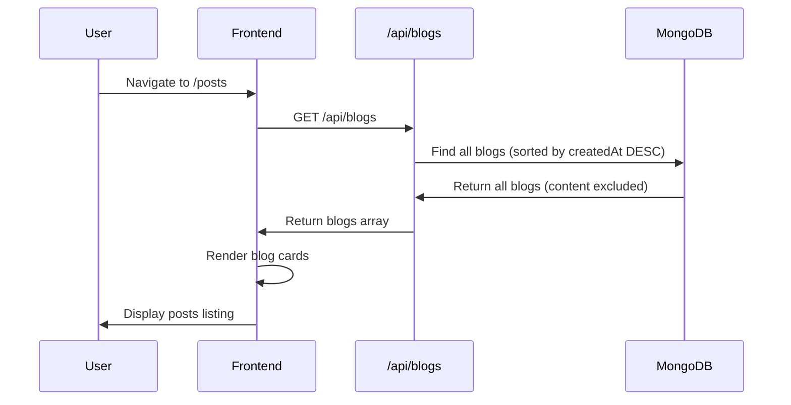
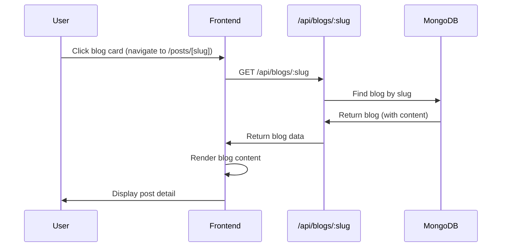

# Feature: Posts

## Overview

**Purpose**: Posts is a simplified blog viewing interface that displays all generated blog posts in a simple list format. It provides a basic way to view and navigate blog content without the advanced features of the main Blogs feature (no pagination, comments, or view tracking). Posts uses the same backend Blog API but with a simplified frontend interface.

**User Story**: As a user, I want to view all generated blog posts in a simple list format and read individual posts, so that I can quickly browse and read blog content without additional features like comments or pagination.

**Key Functionality**:
- Simple blog listing (all blogs, no pagination)
- Blog detail page with full content
- Click-to-navigate interface
- Status display (published/draft)
- Basic metadata display (topic, date)
- Client-side rendering

**Access Level**: Public (No authentication required)

**URL Paths**: 
- `/posts` - Posts listing page
- `/posts/[slug]` - Post detail page

**Authentication Required**: No

**Note**: This feature uses the same Blog backend API (`/api/blogs`) as the Blogs feature but provides a simpler frontend interface without pagination, comments, or view tracking.

---

## User Flow

### View Posts Listing
1. **Navigate to Posts** (`/posts`):
   - User accesses posts listing page
   - All blogs fetched from backend
   - Simple list of blog cards displayed
   - No pagination (shows all blogs)
2. **Browse Posts**:
   - User sees list of blog cards
   - Each card shows: title, topic, date, status
   - User clicks on any card to view details

### View Post Details
1. **Access Post** (`/posts/[slug]`):
   - User clicks on blog card
   - Blog fetched from backend by slug
   - Full blog content displayed
   - Back link to posts listing
2. **Read Post**:
   - User reads HTML content
   - User sees metadata (topic, date, status)
   - User can navigate back to posts listing

---

## Frontend Implementation

### Screen Structure

**Posts Listing Page**:
- File: `frontend/src/app/posts/page.jsx`
- Component: `PostsPageClient.jsx`
- Type: Client Component
- Lines: ~78 lines

**Post Detail Page**:
- File: `frontend/src/app/posts/[slug]/page.jsx`
- Type: Server Component (wrapper)
- Lines: ~54 lines
- Client Component: `PostDetailPageClient.jsx` (~88 lines)

**Styling**:
- CSS Files: `page.css` (shared styles with blogs, uses blogview-* classes)

### Component Hierarchy

```
PostsPage (page.jsx)
  └── PostsPageClient
      ├── Header Section
      │   ├── Title ("Generated Blogs")
      │   └── "Generate New Blogs" Link
      ├── Blog List (if blogs exist)
      │   └── Blog Cards (map)
      │       ├── Title
      │       ├── Meta (Topic, Date)
      │       └── Status Badge
      └── Empty State (if no blogs)
          ├── Empty Message
          └── "Generate Your First Blog" Link

PostDetailPage (page.jsx) - Server Component Wrapper
  └── PostDetailPageClient (Client Component)
      ├── Header (Back Link)
      └── Article
          ├── Title
          ├── Meta (Topic, Date, Status)
          └── Content (HTML)
```

### State Management

**Posts Listing State**:
- No local state (uses React Query hook)

**Post Detail State**:
- No local state (uses React Query hook)

**React Query Hooks**:
- `useBlogs()` - Fetch all blogs (for listing)
- `useBlogBySlug(slug)` - Fetch single blog by slug (for detail)

### UI Components

**Blog Cards**:
- Card layout (clickable)
- Title (heading)
- Meta section:
  - Topic badge
  - Date (formatted)
- Status badge (published/draft, color-coded)
- Click handler navigates to detail page

**Post Detail**:
- Back link to posts listing
- Large title
- Meta information:
  - Topic badge
  - Date (formatted)
  - Status badge (published/draft)
- HTML content (dangerouslySetInnerHTML)

---

## Backend Implementation

**Note**: Posts feature uses the same backend API as Blogs feature. No separate backend implementation exists.

### API Endpoints Used

#### Get All Blogs

**Route**: `GET /api/blogs`

**Purpose**: Fetch all blogs for listing (used by Posts listing page)

**Response Format**:
```json
{
  "success": true,
  "count": 100,
  "blogs": [
    {
      "_id": "...",
      "title": "Blog Title",
      "slug": "blog-title",
      "topic": "Recruitment",
      "status": "published",
      "createdAt": "2024-01-01T12:00:00Z"
      // Note: content excluded
    }
  ]
}
```

#### Get Blog by Slug

**Route**: `GET /api/blogs/:slug`

**Purpose**: Fetch single blog for detail view (used by Posts detail page)

**Response Format**:
```json
{
  "success": true,
  "blog": {
    "_id": "...",
    "title": "Blog Title",
    "slug": "blog-title",
    "topic": "Recruitment",
    "content": "<html>...</html>",
    "status": "published",
    "createdAt": "2024-01-01T12:00:00Z"
  }
}
```

**Backend Files** (Shared with Blogs):
- `backend/src/routes/blogRoutes.js`
- `backend/src/controllers/blogController.js`
- `backend/src/models/Blog.js`

**For detailed backend implementation, see Feature #31: Blogs documentation.**

---

## Data Flow

### Posts Listing Flow



### Post Detail Flow



---

## Configuration

### Environment Variables

**`NEXT_PUBLIC_BLOG_API_URL`**:
- Type: String
- Default: `'http://localhost:4000'`
- Purpose: Base URL for blog API
- Location: Used in hooks
- Required: Yes (for posts functionality)

**Note**: Posts uses the same environment variables as Blogs feature.

---

## Error Handling

### Frontend Error Handling

**Posts Listing Errors**:
- Network errors: Show error message
- API errors: Show error message
- Loading states: Show "Loading blogs..." message

**Post Detail Errors**:
- Network errors: Show error message with back link
- 404 errors: Show "Blog not found" with back link
- Loading states: Show "Loading blog..." message

### Backend Error Handling

**Note**: Error handling is the same as Blogs feature. See Feature #31: Blogs documentation for details.

---

## Security Features

### Authentication
- No authentication required (public feature)

### Input Validation
- Slug validation (URL parameter)
- Backend validates slug format

### Data Protection
- Same security as Blogs feature
- HTML content sanitized by React (dangerouslySetInnerHTML)

---

## UI/UX Details

### Layout Structure

**Posts Listing**:
- Header with title and action link
- Simple list layout (no grid)
- Blog cards displayed vertically
- Empty state with call-to-action

**Post Detail**:
- Back link at top
- Large title
- Meta badges in row
- Full-width content area

### Visual Design

**Blog Cards**:
- Card-based design (clickable)
- Title prominent
- Meta information below title
- Status badge color-coded

**Meta Badges**:
- Topic badge
- Date display
- Status badge (published = green, draft = gray)

### Responsive Design

**Desktop**:
- Full-width layout
- Comfortable spacing
- Clickable cards with hover effects

**Tablet**:
- Maintained layout structure
- Adjusted spacing

**Mobile**:
- Single column layout
- Touch-friendly card sizes
- Responsive typography

### Accessibility

**Semantic HTML**:
- Proper article tags
- Heading hierarchy
- Link labels

**Keyboard Navigation**:
- Tab order logical
- Enter to activate links/cards

**Screen Reader Support**:
- Semantic structure
- Link descriptions

---

## Testing Considerations

### Test Scenarios

**Happy Path**:
1. View posts listing → All blogs displayed → Click card → Post detail shown
2. View post detail → Content displayed → Click back → Return to listing

**Error Cases**:
1. Blog not found → 404 error shown with back link
2. Network error → Error message displayed
3. Empty listing → Empty state shown with call-to-action

**Edge Cases**:
1. No blogs → Empty state displayed
2. Invalid slug → Error handling
3. Long blog titles → Proper truncation/wrapping
4. Special characters in content → Proper HTML rendering

---

## Related Features

- **Blogs** (`/blogs`): Full-featured blog interface with pagination, comments, and view tracking (uses same backend)
- **Blog Agent** (`/employer/blog-agent`): Blog generation and auto-publishing

---

## Additional Notes

**Design Rationale**:
Posts provides a simplified interface for viewing blogs without the complexity of:
- Pagination (shows all blogs at once)
- Comments system
- View tracking
- SEO optimization (server-side rendering)
- Metadata generation

This makes it suitable for:
- Internal/admin viewing
- Simple content browsing
- Quick blog management

**Differences from Blogs Feature**:

| Feature | Blogs (`/blogs`) | Posts (`/posts`) |
|---------|-----------------|------------------|
| Pagination | Yes (20 per page) | No (shows all) |
| Comments | Yes (with infinite scroll) | No |
| View Tracking | Yes | No |
| Server-Side Rendering | Yes (SEO optimized) | No (client-side) |
| Metadata Generation | Yes | No |
| UI Complexity | High (full-featured) | Low (simple) |
| Use Case | Public blog viewing | Simple content browsing |

**Code Reuse**:
- Uses same React Query hooks as Blogs (`useBlogs`, `useBlogBySlug`)
- Uses same backend API endpoints
- Uses same CSS classes (blogview-* prefix)
- Shares same Blog model and controllers

**Known Limitations**:
- No pagination (may be slow with many blogs)
- No comments or engagement features
- No view tracking or analytics
- No SEO optimization (client-side rendering)
- No filtering or search
- No sorting options

**Future Enhancements**:
1. Add pagination for better performance
2. Add filtering and search
3. Add sorting options
4. Add server-side rendering for SEO
5. Add view tracking
6. Add comments system
7. Add metadata generation
8. Consider merging with Blogs feature or making it an admin view

---

## Code References

### Frontend Files
- `frontend/src/app/posts/page.jsx` - Posts listing page wrapper (~30 lines)
- `frontend/src/app/posts/PostsPageClient.jsx` - Posts listing client component (~78 lines)
- `frontend/src/app/posts/[slug]/page.jsx` - Post detail server wrapper (~54 lines)
- `frontend/src/app/posts/[slug]/PostDetailPageClient.jsx` - Post detail client component (~88 lines)
- `frontend/src/app/posts/page.css` - Posts styling (uses blogview-* classes)
- `frontend/src/hooks/useBlogs.js` - Blog data hooks (shared with Blogs feature)

### Backend Files
**Note**: Posts uses the same backend as Blogs feature.
- `backend/src/routes/blogRoutes.js` - Blog routes (shared)
- `backend/src/controllers/blogController.js` - Blog controllers (shared)
- `backend/src/models/Blog.js` - Blog model (shared)

**For detailed backend implementation, refer to Feature #31: Blogs documentation.**

### Environment Variables
- `NEXT_PUBLIC_BLOG_API_URL` - Blog API base URL (default: 'http://localhost:4000')

---

*Last Updated: [Current Date]*
*Documented By: TSD Documentation System*
*Note: This feature uses the same backend API as Blogs (Feature #31) but provides a simplified frontend interface.*

