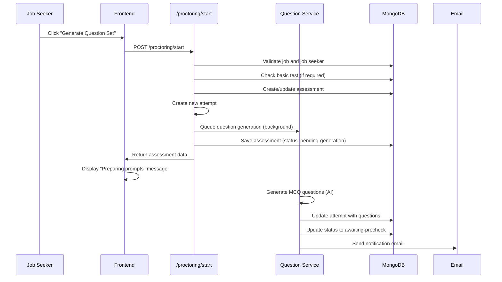
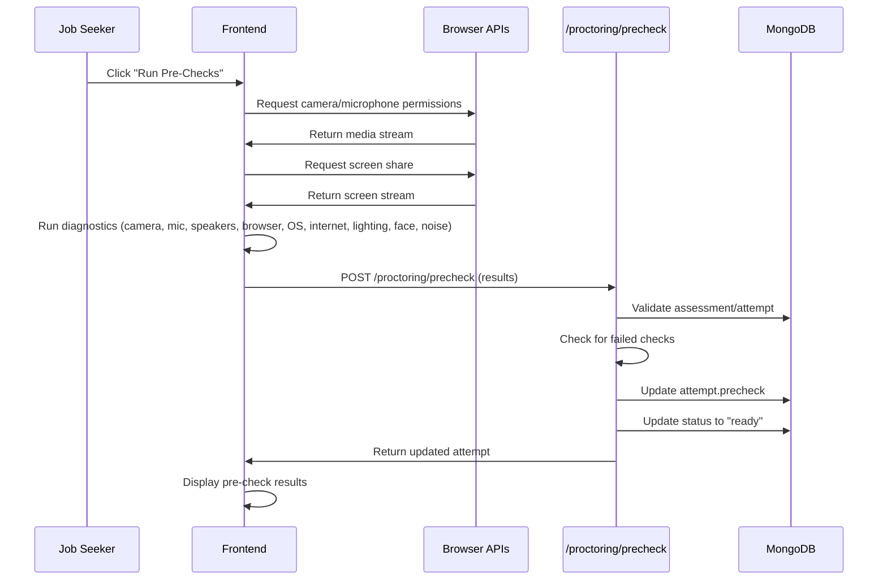
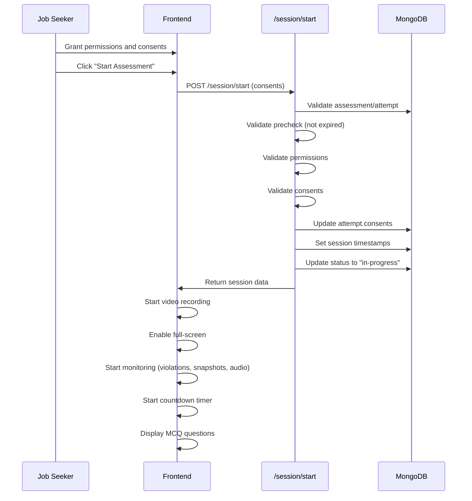
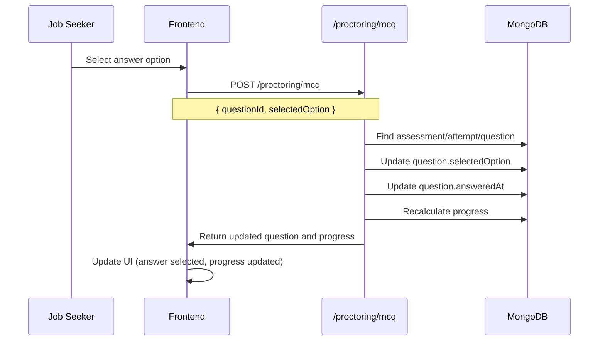
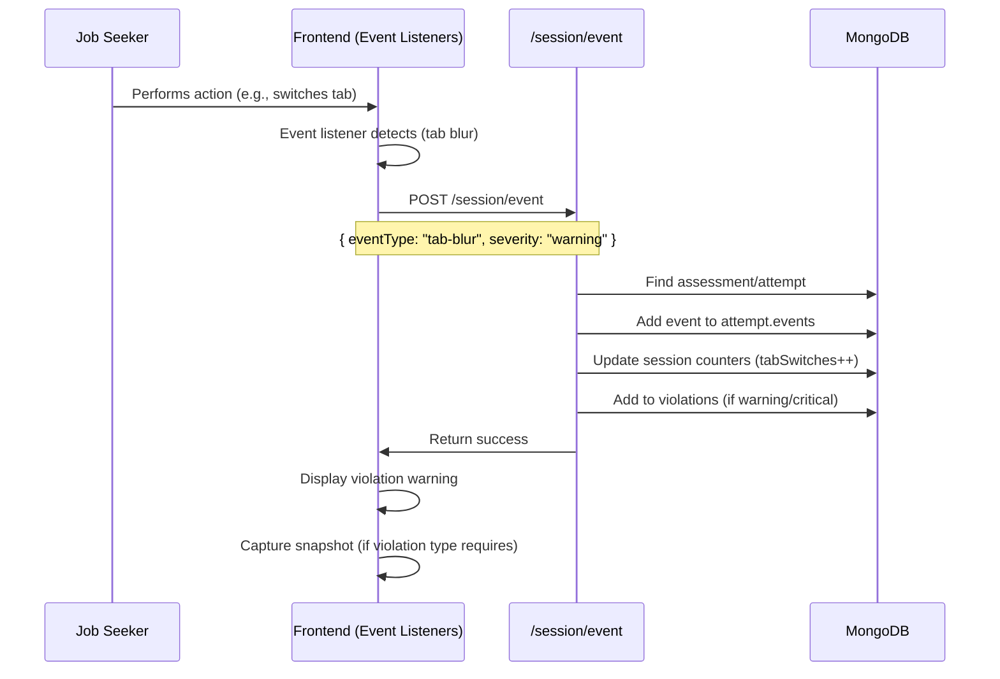
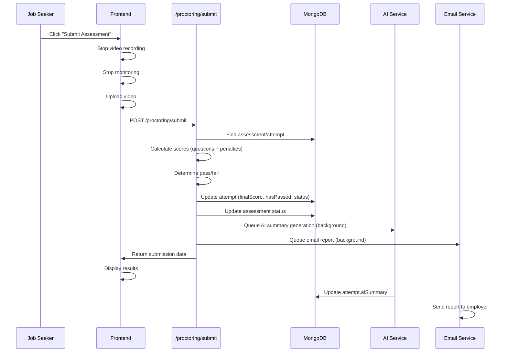

# Feature: Video Proctoring

## Overview

**Purpose**: Video Proctoring is an advanced assessment system that enables employers to conduct secure, AI-monitored video assessments for job candidates. It includes comprehensive system pre-checks, real-time monitoring, violation detection, video/audio recording, MCQ question answering, and automated integrity checks. The system ensures assessment integrity through various monitoring mechanisms including face detection, browser activity tracking, and behavioral analysis.

**User Story**: As a job seeker, I want to take a video-proctored assessment that ensures my system is ready, records my answers and behavior, and provides a fair evaluation of my skills. As an employer, I want to conduct secure assessments with integrity monitoring to ensure candidates follow guidelines and provide authentic responses.

**Key Functionality**:
- Question set generation (AI-powered, tailored to job)
- System pre-checks (camera, microphone, speakers, browser, OS, internet, lighting, face detection, background noise)
- Media permissions management (camera, microphone, screen sharing)
- Consent collection (recording, integrity agreements)
- MCQ question answering with progress tracking
- Real-time video/audio recording
- Violation detection and logging (tab switches, copy/paste, dev tools, face monitoring, etc.)
- Session monitoring with countdown timer
- Random snapshots and audio samples during session
- Full-screen enforcement
- Submission with scoring and AI analysis
- Email reports for employers
- Multiple attempt support

**Access Level**: Job Seeker (Authentication required)

**URL Path**: `/jobseeker/proctoring/[jobId]`

**Authentication Required**: Yes (Job Seeker JWT token)

---

## User Flow

### Start Assessment
1. **Navigate to Proctoring** (`/jobseeker/proctoring/[jobId]`):
   - Job seeker accesses proctoring portal for a specific job
   - System checks if job requires video proctored test
   - System checks if basic test passed (if required)
   - Assessment status fetched
2. **Generate Question Set**:
   - If no attempts exist or status is "not-started", show generation panel
   - Job seeker clicks "Generate Question Set"
   - System generates MCQ questions using AI (tailored to job)
   - Status changes to "pending-generation" → "awaiting-precheck"
   - Email notification sent when ready

### System Pre-Checks
1. **Run Pre-Checks**:
   - System prompts to run pre-checks
   - Pre-checks validate:
     - Camera (video feed quality)
     - Microphone (audio input)
     - Speakers (audio output)
     - Browser (compatibility)
     - Operating System (compatibility)
     - Internet (connection quality)
     - Lighting (environment brightness)
     - Face Detection (face visibility)
     - Background Noise (audio clarity)
2. **Pre-Check Results**:
   - Each check shows status: pending, passed, warning, failed
   - Failed checks prevent proceeding
   - Warning checks allow proceeding with caution
   - Results stored in attempt record
   - Status changes to "ready"

### Grant Permissions
1. **Request Media Permissions**:
   - System requests camera permission
   - System requests microphone permission
   - System requests screen sharing permission
   - Permissions tracked and stored
2. **Grant Consents**:
   - Job seeker accepts recording consent
   - Job seeker accepts integrity guidelines
   - Both consents required to proceed

### Start Session
1. **Launch Assessment**:
   - Job seeker clicks "Start Assessment"
   - System validates pre-checks completed (within 15 minutes)
   - System validates permissions granted
   - System validates consents accepted
   - Full-screen mode enforced
   - Status changes to "in-progress"
   - Countdown timer starts
2. **Video Recording**:
   - Video recording starts automatically
   - Screen sharing captured
   - Audio captured
   - Recording continues throughout session

### Answer Questions
1. **MCQ Navigation**:
   - Questions displayed one at a time
   - Job seeker selects answer option
   - Progress tracked (answered, remaining, marked)
   - Can mark questions for review
   - Can navigate between questions
   - Timer shows remaining time
2. **Progress Tracking**:
   - Each answer saved immediately
   - Progress updated in real-time
   - Local state syncs with backend

### Monitoring During Session
1. **Violation Detection**:
   - Tab/window blur detection
   - Copy/paste detection
   - Right-click detection
   - Dev tools detection
   - Full-screen exit detection
   - Face monitoring (missing, multiple, looking away)
   - Camera covered detection
   - Microphone muted detection
   - Network drop detection
   - Background noise detection
2. **Random Sampling**:
   - Random snapshots captured (every ~80-95 seconds)
   - Random audio samples captured (every ~105-125 seconds)
   - Face detection checks (every 15 seconds)
   - Mic monitoring (every 12 seconds)

### Submit Assessment
1. **Review and Submit**:
   - Job seeker reviews answers
   - Job seeker clicks "Submit Assessment"
   - Confirmation prompt shown
   - Video recording stops
   - All monitoring stops
   - Submission processed
2. **Scoring and Analysis**:
   - Questions scored automatically
   - Violations penalized
   - Final score calculated
   - AI analysis generates summary
   - Status changes to "submitted" → "passed"/"failed"/"flagged"
   - Email report sent to employer

---

## Frontend Implementation

### Screen Structure

**Proctoring Portal Page**:
- File: `frontend/src/app/jobseeker/proctoring/[jobId]/page.jsx`
- Component: `VideoProctoringPortal.jsx`
- Type: Client Component
- Lines: ~1979 lines (large component)

**Styling**:
- CSS File: `frontend/src/components/videoProctoringPortal/VideoProctoringPortal.css`

### Component Hierarchy

```
VideoProctoringPage (page.jsx)
  └── VideoProctoringPortal
      ├── Header
      │   ├── Exit Button
      │   ├── Title ("Video proctored test")
      │   └── Description
      ├── Status Display (assessment status)
      ├── Generation Panel (if not started)
      │   ├── Generate Button
      │   └── Question Count Input
      ├── Pending Generation Message (if generating)
      ├── Session Panel (if ready/in-progress)
      │   ├── Pre-Check Section
      │   │   ├── Pre-Check Results Display
      │   │   └── Run Pre-Check Button
      │   ├── Permissions Section
      │   │   ├── Camera Permission
      │   │   ├── Microphone Permission
      │   │   └── Screen Share Permission
      │   ├── Consent Section
      │   │   ├── Recording Consent Checkbox
      │   │   └── Integrity Consent Checkbox
      │   ├── Video Preview
      │   ├── MCQ Questions Section
      │   │   ├── Question Display
      │   │   ├── Answer Options
      │   │   ├── Navigation (Previous/Next)
      │   │   ├── Mark for Review Toggle
      │   │   ├── Progress Indicator
      │   │   └── Timer Display
      │   └── Submit Button
      ├── Violations Panel (if violations occur)
      └── Submission Results (if submitted)
```

### State Management

**Local State**:
```javascript
const [token, setToken] = useState(null);
const [loading, setLoading] = useState(true);
const [assessment, setAssessment] = useState(null);
const [activeAttempt, setActiveAttempt] = useState(null);
const [precheckRunning, setPrecheckRunning] = useState(false);
const [precheckResults, setPrecheckResults] = useState({});
const [permissionsGranted, setPermissionsGranted] = useState({
    camera: false,
    microphone: false,
    screen: false
});
const [sessionState, setSessionState] = useState({
    status: "idle",
    countdownSeconds: 0,
    remainingSeconds: 0
});
const [violations, setViolations] = useState([]);
const [mcqQuestions, setMcqQuestions] = useState([]);
const [mcqIndex, setMcqIndex] = useState(0);
const [agreements, setAgreements] = useState({
    recording: false,
    integrity: false
});
const [isSubmittingAttempt, setIsSubmittingAttempt] = useState(false);
```

**Refs**:
```javascript
const videoRef = useRef(null); // Video element
const streamRef = useRef(null); // Media stream
const screenStreamRef = useRef(null); // Screen share stream
const mediaRecorderRef = useRef(null); // MediaRecorder instance
const recordedChunksRef = useRef([]); // Video chunks
const snapshotIntervalRef = useRef(null); // Snapshot interval
const audioIntervalRef = useRef(null); // Audio sample interval
const faceIntervalRef = useRef(null); // Face detection interval
const micMonitorRef = useRef(null); // Mic monitoring interval
const timerRef = useRef(null); // Countdown timer
const guardsCleanupRef = useRef(null); // Event listeners cleanup
```

### UI Components

**Status Display**:
- Current assessment status badge
- Attempt information
- Job details

**Generation Panel**:
- Generate button
- Question count input (default: 15)
- Generation progress/status

**Pre-Check Section**:
- List of pre-check requirements
- Status indicator per requirement (passed/warning/failed)
- Run pre-check button
- Results display

**Permissions Section**:
- Camera permission status
- Microphone permission status
- Screen share permission status
- Request buttons

**Consent Section**:
- Recording consent checkbox
- Integrity guidelines checkbox
- Both required to proceed

**Video Preview**:
- Live camera feed
- Screen share overlay (if enabled)

**MCQ Section**:
- Question prompt
- Answer options (radio buttons)
- Navigation buttons (Previous/Next)
- Mark for review checkbox
- Progress indicator
- Timer countdown
- Question counter

**Violations Panel**:
- List of detected violations
- Severity indicators (info/warning/critical)
- Timestamps

**Submit Section**:
- Submit button
- Confirmation modal
- Submission status

---

## Backend Implementation

### API Endpoints

#### Get Video Proctoring Status

**Route Definition**:
```javascript
router.get("/jobs/:jobId/proctoring", verifyToken, videoProctoringController.getVideoProctoringStatus);
```

**Full Endpoint Path**: `/jobseeker/jobs/:jobId/proctoring`

**HTTP Method**: GET

**Authentication Required**: Yes (Job Seeker JWT token)

**Query Parameters**:
- `includeQuestions` (optional, default: false): Include MCQ questions in response

**Response Format**:
```json
{
  "success": true,
  "data": {
    "jobId": "...",
    "jobSeekerId": "...",
    "status": "ready",
    "activeAttemptId": "...",
    "activeAttempt": {
      "attemptId": "...",
      "status": "ready",
      "configuration": {
        "questionCount": 15,
        "countdownSeconds": 1200
      },
      "precheck": { ... },
      "permissions": { ... },
      "consents": { ... },
      "mcqQuestions": [ ... ],
      "progress": { ... }
    },
    "attemptsSummary": [ ... ]
  }
}
```

**Controller Logic** (`getVideoProctoringStatus`):
1. Get job by identifier (jobId)
2. Validate job requires video proctored test
3. Find VideoProctoringAssessment (job + jobSeeker)
4. If not found, return empty assessment payload
5. Refresh assessment status (auto-update based on attempts)
6. Build assessment payload with active attempt
7. Include questions if requested
8. Return assessment data

#### Start Video Proctoring Assessment

**Route Definition**:
```javascript
router.post("/jobs/:jobId/proctoring/start", verifyToken, videoProctoringController.startVideoProctoringAssessment);
```

**Full Endpoint Path**: `/jobseeker/jobs/:jobId/proctoring/start`

**HTTP Method**: POST

**Authentication Required**: Yes (Job Seeker JWT token)

**Request Format**:
```json
{
  "questionCount": 15,
  "runInBackground": false,
  "forceNew": false
}
```

**Response Format**:
```json
{
  "success": true,
  "message": "Question set generation started",
  "data": {
    "jobId": "...",
    "status": "pending-generation",
    "activeAttempt": { ... }
  }
}
```

**Controller Logic** (`startVideoProctoringAssessment`):
1. Validate job exists and requires video proctored test
2. Check hiring window (applicationClosingDate)
3. Get job seeker profile
4. Check basic test passed (if required)
5. Find or create VideoProctoringAssessment
6. Check for active attempt (if exists and not forceNew, return existing)
7. Normalize question count (clamp to valid range)
8. Calculate countdown seconds
9. Create new attempt with status "pending-generation"
10. Queue question generation (background job)
11. Save assessment
12. Return assessment payload

#### Log Proctoring Precheck

**Route Definition**:
```javascript
router.post("/jobs/:jobId/proctoring/:attemptId/precheck", verifyToken, videoProctoringController.logProctoringPrecheck);
```

**Full Endpoint Path**: `/jobseeker/jobs/:jobId/proctoring/:attemptId/precheck`

**HTTP Method**: POST

**Authentication Required**: Yes (Job Seeker JWT token)

**Request Format**:
```json
{
  "results": {
    "camera": { "status": "passed", "metrics": { ... } },
    "microphone": { "status": "passed", "metrics": { ... } },
    ...
  },
  "summary": "All baseline signals look healthy."
}
```

**Response Format**:
```json
{
  "success": true,
  "message": "Pre-checks logged successfully.",
  "data": {
    "attemptId": "...",
    "status": "ready",
    "precheck": { ... }
  }
}
```

**Controller Logic** (`logProctoringPrecheck`):
1. Validate job and assessment exist
2. Find attempt by attemptId
3. Validate attempt status allows precheck
4. Check for failed checks (prevent proceeding if any)
5. Update attempt.precheck with results
6. Update attempt status to "ready"
7. Update assessment status to "ready"
8. Save assessment
9. Return updated attempt data

#### Acknowledge Media Permissions

**Route Definition**:
```javascript
router.post("/jobs/:jobId/proctoring/:attemptId/permissions", verifyToken, videoProctoringController.acknowledgeMediaPermissions);
```

**Full Endpoint Path**: `/jobseeker/jobs/:jobId/proctoring/:attemptId/permissions`

**HTTP Method**: POST

**Authentication Required**: Yes (Job Seeker JWT token)

**Request Format**:
```json
{
  "cameraGranted": true,
  "microphoneGranted": true,
  "screenGranted": true
}
```

**Controller Logic** (`acknowledgeMediaPermissions`):
1. Validate job and assessment exist
2. Find attempt by attemptId
3. Update attempt.permissions with granted permissions
4. Set grantedAt timestamp
5. Save assessment
6. Return permissions data

#### Update Proctoring MCQ Progress

**Route Definition**:
```javascript
router.post("/jobs/:jobId/proctoring/:attemptId/mcq", verifyToken, videoProctoringController.updateProctoringMcqProgress);
```

**Full Endpoint Path**: `/jobseeker/jobs/:jobId/proctoring/:attemptId/mcq`

**HTTP Method**: POST

**Authentication Required**: Yes (Job Seeker JWT token)

**Request Format**:
```json
{
  "questionId": "...",
  "selectedOption": 2,
  "isMarked": false
}
```

**Controller Logic** (`updateProctoringMcqProgress`):
1. Validate questionId provided
2. Validate job and assessment exist
3. Find attempt and question
4. Update question.selectedOption (if provided)
5. Update question.isMarked (if provided)
6. Set question.answeredAt timestamp
7. Recalculate attempt.progress (answered, remaining, marked counts)
8. Save assessment
9. Return updated question and progress

#### Start Proctoring Session

**Route Definition**:
```javascript
router.post("/jobs/:jobId/proctoring/:attemptId/session/start", verifyToken, videoProctoringController.startProctoringSession);
```

**Full Endpoint Path**: `/jobseeker/jobs/:jobId/proctoring/:attemptId/session/start`

**HTTP Method**: POST

**Authentication Required**: Yes (Job Seeker JWT token)

**Request Format**:
```json
{
  "consents": {
    "recording": true,
    "integrity": true
  }
}
```

**Controller Logic** (`startProctoringSession`):
1. Validate job and assessment exist
2. Find attempt by attemptId
3. Validate precheck completed
4. Check precheck TTL (15 minutes, must rerun if expired)
5. Validate permissions granted (camera, microphone, screen)
6. Validate consents accepted (recording, integrity)
7. Update attempt.consents
8. Initialize session timestamps:
   - startedAt: current time
   - countdownStartedAt: current time
   - countdownEndsAt: current time + countdownSeconds
9. Update attempt status to "in-progress"
10. Update assessment status to "in-progress"
11. Save assessment
12. Return session data

#### Record Proctoring Event

**Route Definition**:
```javascript
router.post("/jobs/:jobId/proctoring/:attemptId/session/event", verifyToken, videoProctoringController.recordProctoringEvent);
```

**Full Endpoint Path**: `/jobseeker/jobs/:jobId/proctoring/:attemptId/session/event`

**HTTP Method**: POST

**Authentication Required**: Yes (Job Seeker JWT token)

**Request Format**:
```json
{
  "eventType": "tab-blur",
  "severity": "warning",
  "note": "Browser tab lost focus.",
  "payload": { ... }
}
```

**Controller Logic** (`recordProctoringEvent`):
1. Validate job and assessment exist
2. Find attempt by attemptId
3. Validate attempt status is "in-progress"
4. Determine event severity (from restrictedEventMap)
5. Create event object with timestamp
6. Add to attempt.events array
7. Update session counters (e.g., tabSwitches, copyEvents)
8. If violation event (critical/warning), add to attempt.violations
9. Save assessment
10. Return success

#### Store Proctoring Asset (Snapshot/Audio)

**Route Definition**:
```javascript
router.post("/jobs/:jobId/proctoring/:attemptId/assets/:assetType", verifyToken, uploadProctoringAsset, videoProctoringController.storeProctoringAsset);
```

**Full Endpoint Path**: `/jobseeker/jobs/:jobId/proctoring/:attemptId/assets/:assetType`

**HTTP Method**: POST

**Authentication Required**: Yes (Job Seeker JWT token)

**Asset Types**: `snapshot` or `audio`

**Controller Logic** (`storeProctoringAsset`):
1. Validate job and assessment exist
2. Find attempt by attemptId
3. Get uploaded file from multer
4. Validate asset type
5. Build asset metadata (storedPath, publicUrl, sizeBytes, capturedAt)
6. Add to attempt.media.snapshots or attempt.media.audioSamples
7. Update session counters (randomSnapshotCount or randomAudioCount)
8. Save assessment
9. Return asset data

#### Store Proctoring Video

**Route Definition**:
```javascript
router.post("/jobs/:jobId/proctoring/:attemptId/video", verifyToken, uploadProctoringVideo, videoProctoringController.storeProctoringVideo);
```

**Full Endpoint Path**: `/jobseeker/jobs/:jobId/proctoring/:attemptId/video`

**HTTP Method**: POST

**Authentication Required**: Yes (Job Seeker JWT token)

**Controller Logic** (`storeProctoringVideo`):
1. Validate job and assessment exist
2. Find attempt by attemptId
3. Get uploaded video file from multer
4. Compress video (using ffmpeg or fallback)
5. Delete original uncompressed video
6. Build video metadata:
   - storedPath: compressed path
   - videoUrl: public URL
   - sizeBytes: compressed size
   - durationMs: video duration
   - codec: video codec
   - uploadedAt: current time
7. Update attempt.media.recording
8. Save assessment
9. Return video data

#### Submit Video Proctoring Attempt

**Route Definition**:
```javascript
router.post("/jobs/:jobId/proctoring/:attemptId/submit", verifyToken, videoProctoringController.submitVideoProctoringAttempt);
```

**Full Endpoint Path**: `/jobseeker/jobs/:jobId/proctoring/:attemptId/submit`

**HTTP Method**: POST

**Authentication Required**: Yes (Job Seeker JWT token)

**Controller Logic** (`submitVideoProctoringAttempt`):
1. Validate job and assessment exist
2. Find attempt by attemptId
3. Validate attempt status is "in-progress"
4. Calculate scores:
   - Question scores (correct answers)
   - Violation penalties
   - Final score
5. Determine pass/fail based on score threshold
6. Generate AI summary (background job)
7. Update attempt:
   - status: "submitted" → "passed"/"failed"/"flagged"
   - finalScore
   - scoreBreakdown
   - hasPassed
   - session.endedAt
8. Update assessment status
9. Save assessment
10. Queue email report (background job)
11. Return submission data

### Database Model

**VideoProctoringAssessment Model** (`backend/src/models/videoProctoringAssessment.js`):

**Main Schema Fields**:
- `job`: ObjectId (ref: Job, required)
- `jobSeeker`: ObjectId (ref: JobSeeker, required)
- `status`: String (enum: not-started, pending-generation, awaiting-precheck, ready, in-progress, submitted, flagged, failed, passed)
- `latestAttemptNumber`: Number (default: 0)
- `attempts`: Array of attemptSchema
- `lastInteractionAt`: Date (default: Date.now)

**Attempt Schema Fields**:
- `attemptId`: String (unique, auto-generated)
- `attemptNumber`: Number (required)
- `status`: String (enum: same as assessment status)
- `configuration`: Object (questionCount, countdownSeconds)
- `generation`: Object (status, queuedAt, startedAt, completedAt, error)
- `mcqQuestions`: Array of mcqQuestionSchema
- `precheck`: precheckSchema
- `permissions`: permissionSchema (camera, microphone, screen, grantedAt, reminders)
- `consents`: consentSchema (recording, integrity, acceptedAt)
- `session`: Object (startedAt, endedAt, countdownStartedAt, countdownEndsAt, violation counters)
- `progress`: Object (total, answered, remaining, marked)
- `events`: Array of eventSchema
- `violations`: Array of eventSchema
- `media`: Object (snapshots, audioSamples, recording)
- `aiSummary`: aiSummarySchema
- `finalScore`: Number
- `scoreBreakdown`: Object (questionScore, violationPenalty)
- `hasPassed`: Boolean
- `reportEmailStatus`: String (enum: pending, sent, failed, skipped)

**Indexes**:
- Compound unique: `{ job: 1, jobSeeker: 1 }`

---

## Data Flow

### Assessment Start Flow



### Pre-Check Flow



### Session Start Flow



### MCQ Answer Flow



### Violation Detection Flow



### Submission Flow



---

## Configuration

### Environment Variables

**`PROCTORING_DEFAULT_QUESTION_COUNT`**:
- Type: Number
- Default: 15
- Purpose: Default number of MCQ questions per assessment
- Location: Used in `startVideoProctoringAssessment`

**`NEXT_PUBLIC_PROCTORING_DEFAULT_QUESTION_COUNT`**:
- Type: Number
- Default: 15
- Purpose: Frontend default question count
- Location: Used in VideoProctoringPortal component

**`NEXT_PUBLIC_JOBSEEKER_URL`**:
- Type: String
- Purpose: Base URL for job seeker API
- Location: Used in frontend API calls
- Required: Yes

---

## Error Handling

### Frontend Error Handling

**Assessment Errors**:
- Job not found: Show error message
- Job doesn't require proctoring: Show error message
- Basic test not passed: Show error message (412)
- Network errors: Show error toast
- Generation errors: Show error toast, allow retry

**Pre-Check Errors**:
- Failed checks: Show failed requirements, prevent proceeding
- Permission denied: Show error, request again
- Pre-check expired: Show error, require rerun

**Session Errors**:
- Pre-check expired: Show error, require rerun (428)
- Permissions missing: Show error, require permissions
- Consents missing: Show error, require consents
- Network errors: Log event, continue session

**Submission Errors**:
- Validation errors: Show error message
- Upload errors: Show error, allow retry
- Network errors: Show error message

### Backend Error Handling

**All Endpoints**:
- Job not found: Return 404
- Assessment not found: Return 404
- Attempt not found: Return 404
- Invalid status transitions: Return 400
- Validation errors: Return 400 with details
- Database errors: Return 500
- Always return structured JSON response

**Specific Error Codes**:
- 412: Precondition failed (basic test not passed, precheck failed)
- 428: Precondition required (precheck expired)

---

## Security Features

### Authentication
- JWT token required for all endpoints
- Job seeker must be authenticated
- User ID extracted from token

### Authorization
- Job seeker can only access their own assessments
- Job validation (must require video proctored test)
- Attempt validation (must belong to job seeker)

### Integrity Checks
- Full-screen enforcement
- Tab/window blur detection
- Copy/paste prevention
- Dev tools detection
- Right-click prevention
- Face monitoring
- Video/audio recording
- Random snapshots and audio samples
- Network monitoring

### Data Protection
- Video files compressed before storage
- Media assets stored securely
- Attempt data stored with timestamps
- Violations logged for audit

---

## UI/UX Details

### Layout Structure

**Portal Shell**:
- Full-page layout
- Header with exit button
- Main content area
- Status indicators
- Violations panel (overlay)

**Generation Panel**:
- Card layout
- Generate button
- Question count input
- Generation status

**Pre-Check Section**:
- Requirement list
- Status indicators per requirement
- Run button
- Results display

**Session Panel**:
- Video preview area
- MCQ question area
- Progress indicator
- Timer display
- Navigation controls

### Visual Design

**Status Badges**:
- Color-coded by status
- Clear labels

**Pre-Check Indicators**:
- Passed: Green
- Warning: Yellow
- Failed: Red
- Pending: Gray

**Violation Alerts**:
- Severity-based styling (info/warning/critical)
- Timestamp display
- Dismissible

**MCQ Interface**:
- Clear question display
- Radio button options
- Mark for review toggle
- Progress bar
- Countdown timer

---

## Testing Considerations

### Test Scenarios

**Happy Path**:
1. Start assessment → Generate questions → Run pre-checks → Grant permissions → Accept consents → Start session → Answer questions → Submit → Pass
2. Pre-checks all pass → Session starts → No violations → Submission successful

**Error Cases**:
1. Pre-check fails → Cannot proceed
2. Permissions denied → Cannot start session
3. Pre-check expired → Must rerun
4. Basic test not passed → Cannot start (if required)
5. Job closing date passed → Cannot start

**Violation Scenarios**:
1. Tab switch detected → Violation logged → Warning shown
2. Copy detected → Violation logged
3. Face missing → Violation logged
4. Multiple violations → Flagged status possible

**Edge Cases**:
1. Multiple attempts → Latest attempt tracked
2. Session timeout → Submission required
3. Network drop → Event logged, session continues
4. Browser refresh → Attempt state preserved
5. Video upload failure → Retry mechanism

---

## Related Features

- **Basic Assessment** (`/jobseeker/jobs/:jobId/assessment`): Basic test (may be required before video proctoring)
- **Application Management** (`/employer/applications`): Employers view proctoring results
- **Job Posting** (`/employer/post-job`): Employers enable video proctored test

---

## Additional Notes

**Assessment States**:
1. **not-started**: No attempts created
2. **pending-generation**: Questions being generated
3. **awaiting-precheck**: Questions ready, pre-checks required
4. **ready**: Pre-checks passed, ready to start
5. **in-progress**: Session active
6. **submitted**: Submitted, being processed
7. **passed**: Score above threshold
8. **failed**: Score below threshold
9. **flagged**: Significant violations detected

**Pre-Check Requirements**:
1. Camera: Video feed working, quality acceptable
2. Microphone: Audio input working
3. Speakers: Audio output working
4. Browser: Compatible browser detected
5. OS: Operating system compatible
6. Internet: Connection quality acceptable
7. Lighting: Environment brightness adequate
8. Face Detection: Face visible in frame
9. Background Noise: Audio clarity acceptable

**Violation Types**:
- **Warning**: Tab blur, window blur, copy, paste, right-click, mic muted, face missing, face away, background noise
- **Critical**: Exit fullscreen, dev tools open, multiple faces, camera covered, screen share ended

**Question Generation**:
- AI-powered question generation
- Tailored to job requirements
- Background processing
- Email notification when ready

**Scoring System**:
- Question score: Sum of correct answers
- Violation penalties: Deductions for violations
- Final score: Question score - penalties
- Pass threshold: Configurable

**AI Summary**:
- Generated after submission
- Includes verdict (pass/review/fail)
- Risk score
- Highlights and concerns
- Recommendations
- Violations summary

**Email Reports**:
- Sent to employer after submission
- Includes assessment summary
- Includes video recording link
- Includes AI analysis
- Includes violation log

**Known Limitations**:
- Pre-check TTL: 15 minutes (must rerun if expired)
- Browser compatibility: Requires modern browser with WebRTC
- Face detection: Requires browser Face Detection API or fallback
- Video compression: Requires ffmpeg or falls back to uncompressed
- Network dependency: Requires stable connection for video upload

**Future Enhancements**:
1. Extended pre-check TTL
2. Offline mode support
3. More violation detection types
4. Real-time proctoring (live monitoring)
5. AI-powered cheating detection
6. Browser extension for enhanced monitoring
7. Mobile app support
8. Multiple language support
9. Adaptive question difficulty
10. Question bank system

---

## Code References

### Frontend Files
- `frontend/src/app/jobseeker/proctoring/[jobId]/page.jsx` - Page wrapper (~31 lines)
- `frontend/src/components/videoProctoringPortal/VideoProctoringPortal.jsx` - Main component (~1979 lines)
- `frontend/src/components/videoProctoringPortal/VideoProctoringPortal.css` - Styling

### Backend Files
- `backend/src/routes/jobSeekerRoutes.js` - Route definitions (lines 111-120):
  - Line 111: GET `/jobs/:jobId/proctoring`
  - Line 112: POST `/jobs/:jobId/proctoring/start`
  - Line 113: POST `/jobs/:jobId/proctoring/:attemptId/precheck`
  - Line 114: POST `/jobs/:jobId/proctoring/:attemptId/permissions`
  - Line 115: POST `/jobs/:jobId/proctoring/:attemptId/mcq`
  - Line 116: POST `/jobs/:jobId/proctoring/:attemptId/session/start`
  - Line 117: POST `/jobs/:jobId/proctoring/:attemptId/session/event`
  - Line 118: POST `/jobs/:jobId/proctoring/:attemptId/assets/:assetType`
  - Line 119: POST `/jobs/:jobId/proctoring/:attemptId/video`
  - Line 120: POST `/jobs/:jobId/proctoring/:attemptId/submit`
- `backend/src/controllers/videoProctoringController.js` - Controller functions (~1778 lines):
  - `getVideoProctoringStatus` (lines 40-95)
  - `startVideoProctoringAssessment` (lines 97-268)
  - `logProctoringPrecheck` (lines 270-352)
  - `acknowledgeMediaPermissions` (lines 354-410)
  - `updateProctoringMcqProgress` (lines 412-488)
  - `startProctoringSession` (lines 490-600+)
  - `recordProctoringEvent` (lines 600+)
  - `storeProctoringAsset` (lines 686-774)
  - `storeProctoringVideo` (lines 776-853)
  - `submitVideoProctoringAttempt` (lines 900+)
- `backend/src/models/videoProctoringAssessment.js` - Database model (~342 lines)
- `backend/src/middleware/uploadProctoringMedia.js` - File upload middleware
- `backend/src/services/videoProctoringQuestionService.js` - Question generation service
- `backend/src/services/videoProctoringReporter.js` - Report generation service
- `backend/src/services/proctoringBackgroundQueue.js` - Background job queue

### Environment Variables
- `PROCTORING_DEFAULT_QUESTION_COUNT` - Default question count (backend)
- `NEXT_PUBLIC_PROCTORING_DEFAULT_QUESTION_COUNT` - Default question count (frontend)
- `NEXT_PUBLIC_JOBSEEKER_URL` - Job seeker API base URL

---

*Last Updated: [Current Date]*
*Documented By: TSD Documentation System*

