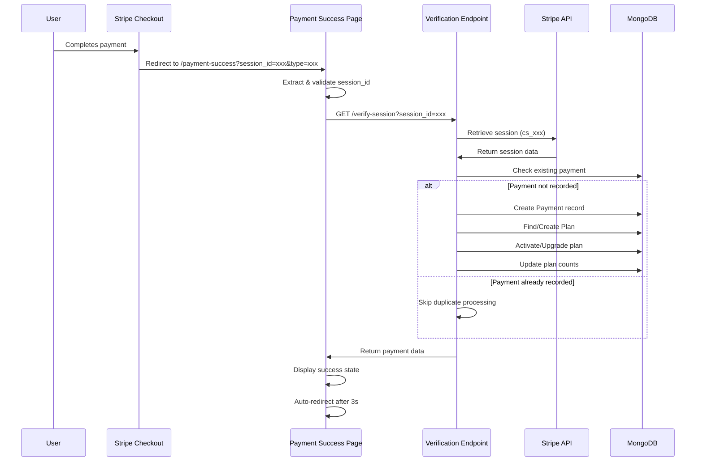
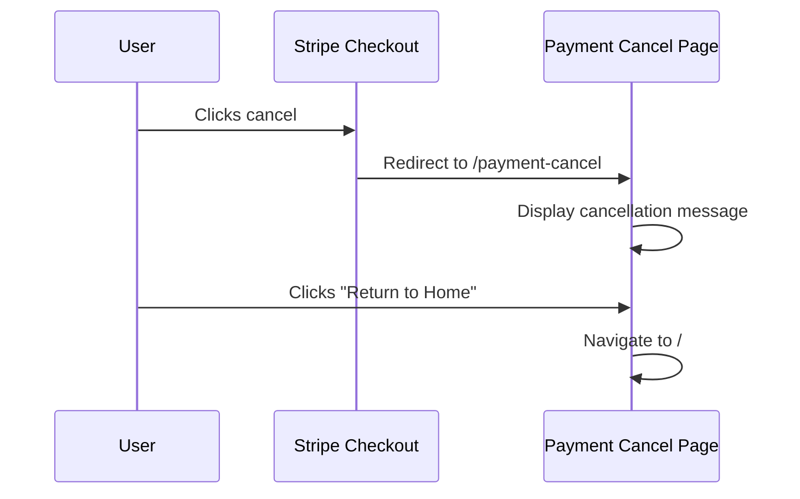

# Feature: Payment Flows

## Overview

**Purpose**: Payment Flows handle the post-payment user experience after Stripe checkout sessions complete. The system provides dedicated pages for payment success and cancellation scenarios, with automatic payment verification and user-friendly feedback. The success page verifies payments with the backend, records transactions, activates plans, and redirects users appropriately based on payment type.

**User Story**: As a user making a payment, I want clear confirmation when my payment succeeds or is cancelled, so I know the status of my transaction and can proceed with using the purchased service. As a system, I need to verify payments securely, prevent duplicate processing, and activate plans automatically upon successful payment.

**Key Functionality**:
- Payment success page with automatic verification
- Payment cancellation page
- Stripe session ID validation and sanitization
- Payment verification API integration
- Automatic plan activation after successful payment
- Duplicate payment prevention
- Payment type-based routing and redirects
- Loading states during verification
- Error handling for failed verifications
- Auto-redirect to appropriate dashboards

**Payment Types Supported**:
- Smart Select (Employer)
- Resume Builder (Job Seeker)
- Instant Alerts (Job Seeker)

**Access Level**: Public (No authentication required for pages, but verification endpoints handle auth)

**URL Paths**: 
- `/payment-success` (with `?session_id=xxx&type=xxx` query params)
- `/payment-cancel`

**Authentication Required**: No (for pages), but verification endpoints may require tokens

---

## User Flow

### Payment Success Flow

1. **Stripe Checkout Completion**:
   - User completes payment on Stripe checkout page
   - Stripe redirects to: `/payment-success?session_id={CHECKOUT_SESSION_ID}&type={payment-type}`
   - Payment type can be: `smart-select`, `resume-builder`, or `instant-alerts`
2. **Page Load**:
   - Payment success page loads
   - Displays loading state ("Hold on... we are verifying your payment")
   - Extracts `session_id` and `type` from URL query parameters
3. **Session ID Validation**:
   - Validates session ID format (must start with `cs_`)
   - Sanitizes session ID (removes invalid characters, limits length)
   - If invalid, shows error state
4. **Payment Verification**:
   - Calls verification endpoint based on payment type:
     - Smart Select: `/employer/smart-select/verify-session`
     - Resume Builder: `/jobseeker/resume-builder/verify-session`
     - Instant Alerts: `/jobseeker/instant-alerts/verify-session`
   - Sends session ID to backend
   - Backend retrieves session from Stripe
   - Backend verifies payment status
   - Backend records payment (if not already recorded)
   - Backend activates plan/benefits
5. **Success Display**:
   - Shows success icon and message
   - Displays payment amount (if available)
   - Shows "Payment Successful" heading
   - Displays action buttons (Back to Home, Go to Dashboard)
6. **Auto-Redirect**:
   - After 3 seconds, automatically redirects to:
     - Smart Select: `/employer/smart-select`
     - Resume Builder: `/jobseeker/resume-builder`
     - Instant Alerts: `/jobseeker/profile`
   - User can also click "Go to Dashboard" to navigate immediately

### Payment Cancellation Flow

1. **Stripe Checkout Cancellation**:
   - User clicks cancel on Stripe checkout page
   - Stripe redirects to: `/payment-cancel`
2. **Cancellation Page Display**:
   - Shows cancellation icon (red X)
   - Displays "Payment Cancelled" heading
   - Shows message: "Your payment was not completed or was cancelled. No charges have been made."
   - Displays support contact information
   - Shows "Return to Home" button
3. **User Action**:
   - User clicks "Return to Home"
   - Redirects to home page (`/`)

---

## Frontend Implementation

### Screen Structure

**Payment Success Page**:
- File: `frontend/src/app/payment-success/page.jsx`
- Component: `PaymentSuccess.jsx`
- Type: Client Component with Suspense
- Lines: ~71 lines (page), ~136 lines (component)

**Payment Cancel Page**:
- File: `frontend/src/app/payment-cancel/page.jsx`
- Component: `PaymentCancel.jsx`
- Type: Client Component
- Lines: ~10 lines (page), ~36 lines (component)

**Styling**:
- CSS Files: 
  - `frontend/src/components/payment/PaymentSuccess.css`
  - `frontend/src/components/payment/PaymentCancel.css`

### Component Hierarchy

```
PaymentSuccessPage (page.jsx)
  └── Suspense (loading fallback)
      └── PaymentSuccessContent
          └── PaymentSuccess
              ├── Loading State (CircularProgress)
              ├── Error State (error message + home button)
              └── Success State
                  ├── Success Icon
                  ├── "Payment Successful" Heading
                  ├── Payment Amount Display
                  ├── Success Message
                  └── Action Buttons
                      ├── Back to Home
                      └── Go to Dashboard

PaymentCancelPage (page.jsx)
  └── PaymentCancel
      ├── Cancel Icon (red X)
      ├── "Payment Cancelled" Heading
      ├── Cancellation Message
      ├── Support Message
      └── Return to Home Button
```

### State Management

**PaymentSuccess Component State**:
```javascript
const [amount, setAmount] = useState(null); // Payment amount
const [loading, setLoading] = useState(true); // Verification in progress
const [error, setError] = useState(false); // Verification failed
```

**PaymentCancel Component State**:
- No state (static display only)

### Payment Type Configuration

**Payment Type Mapping** (`payment-success/page.jsx`):
```javascript
switch (type) {
    case 'smart-select':
        return {
            verificationEndpoint: '/smart-select/verify-session',
            onSuccessRedirect: '/employer/smart-select',
            apiBaseUrl: process.env.NEXT_PUBLIC_EMPLOYER_URL
        };
    case 'instant-alerts':
        return {
            verificationEndpoint: '/instant-alerts/verify-session',
            onSuccessRedirect: '/jobseeker/profile',
            apiBaseUrl: process.env.NEXT_PUBLIC_JOBSEEKER_URL
        };
    case 'resume-builder':
        return {
            verificationEndpoint: '/resume-builder/verify-session',
            onSuccessRedirect: '/jobseeker/resume-builder',
            apiBaseUrl: process.env.NEXT_PUBLIC_JOBSEEKER_URL
        };
    default:
        return {
            verificationEndpoint: '/smart-select/verify-session',
            onSuccessRedirect: '/employer/smart-select',
            apiBaseUrl: process.env.NEXT_PUBLIC_EMPLOYER_URL
        };
}
```

### Session ID Validation

**Validation Logic**:
```javascript
// Clean session_id
let cleanSessionId = sessionId.trim();

// Extract valid session ID format (cs_xxxxx)
const match = cleanSessionId.match(/^(cs_[a-zA-Z0-9_-]{1,63})/);
if (match) {
    cleanSessionId = match[1];
}

// Validate format
if (!cleanSessionId || !cleanSessionId.startsWith('cs_')) {
    // Invalid - show error
}
```

**Security Considerations**:
- Session IDs must start with `cs_` (Stripe checkout session prefix)
- Maximum length validation (66 characters)
- Regex sanitization to prevent injection
- URL encoding when sending to API

### API Integration

**Payment Verification Call**:
```javascript
const token = Cookies.get('emp_token') || Cookies.get('jobseeker_token') || Cookies.get('js_token');
const headers = token ? { Authorization: `Bearer ${token}` } : {};

const response = await axios.get(
    `${apiBaseUrl}${verificationEndpoint}?session_id=${encodeURIComponent(cleanSessionId)}`,
    { headers }
);
```

**Response Handling**:
- Success: Extract payment amount, set success state, auto-redirect after 3 seconds
- Error: Show error message, allow user to return home

### UI Components

**Payment Success - Loading State**:
- CircularProgress spinner (Material-UI)
- Loading message: "Hold on... we are verifying your payment"

**Payment Success - Error State**:
- Red icon (IoCheckmarkDoneCircle with error styling)
- Error heading: "Something went wrong"
- Error message: "We couldn't verify your payment. Please contact support."
- "Back to Home" button

**Payment Success - Success State**:
- Green success icon (IoCheckmarkDoneCircle)
- Heading: "Payment Successful"
- Payment amount display (₹{amount})
- Success message: "Thank you! Your payment was processed successfully."
- Button row:
  - "Back to Home" button (primary gradient)
  - "Go to Dashboard" button (outlined, if onSuccessRedirect provided)

**Payment Cancel - Display**:
- Red X icon (FaTimesCircle)
- Heading: "Payment Cancelled"
- Message: "Your payment was not completed or was cancelled. No charges have been made."
- Support message: "If you need any assistance, please contact our support team."
- "Return to Home" button (primary gradient)

### Styling Details

**Payment Success Styling**:
- Full-page gradient background (blue tones)
- Centered card with white background
- Rounded corners (22px border-radius)
- Box shadow for depth
- Responsive design (mobile-friendly)
- Green success icon with text shadow
- Blue gradient buttons
- Hover effects on buttons

**Payment Cancel Styling**:
- Same background and card structure as success page
- Red cancel icon with text shadow
- Red/gray color scheme for cancellation state
- Similar button styling to success page

---

## Backend Implementation

### Verification Endpoints

All verification endpoints follow a similar pattern but handle different payment types and plan activations.

#### Smart Select Verification

**Route Definition**:
```javascript
router.get("/smart-select/verify-session", smartSelectController.verifyCheckoutSession);
```

**Full Endpoint Path**: `/employer/smart-select/verify-session`

**HTTP Method**: GET

**Authentication Required**: No (session ID validation provides security)

**Query Parameters**:
- `session_id` (required): Stripe checkout session ID

**Response Format**:
```json
{
  "success": true,
  "message": "Payment verified successfully",
  "payment": {
    "sessionId": "cs_...",
    "amount": 999.00
  }
}
```

**Controller Logic** (`verifyCheckoutSession` in `smartSelectController.js`):
1. Validate Stripe configuration
2. Extract and validate session_id (format, length)
3. Retrieve session from Stripe (with payment_intent and line_items expanded)
4. Extract employerId from session metadata
5. Check for existing payment record (prevent duplicates)
6. Create Payment record:
   - employerId
   - planType (from metadata)
   - sessionId
   - amount (from session.amount_total / 100)
   - currency
   - status (from session.payment_status)
   - productType: 'resume_analyzer'
7. Find or create UserResumeAnalyzePlan:
   - If existing plan: Upgrade to higher tier if needed, add analyze counts
   - If new plan: Create with purchased plan type and benefits
8. Update planCounts Map with new purchase
9. Save plan
10. Return payment record

#### Resume Builder Verification

**Route Definition**:
```javascript
router.get("/resume-builder/verify-session", resumeBuilderController.verifyCheckoutSession);
```

**Full Endpoint Path**: `/jobseeker/resume-builder/verify-session`

**HTTP Method**: GET

**Authentication Required**: No (session ID validation provides security)

**Controller Logic** (`verifyCheckoutSession` in `resumeBuilderController.js`):
1. Validate Stripe configuration
2. Extract and validate session_id
3. Retrieve session from Stripe
4. Extract jobSeekerId from session metadata
5. Check for existing payment record
6. Create Payment record:
   - jobSeekerId
   - planType (from metadata)
   - sessionId
   - amount
   - currency
   - status
   - productType: 'resume_builder'
7. Find or create JobSeekerResumePlan:
   - If existing plan: Upgrade tier if needed, add creation/download counts
   - If new plan: Create with purchased plan type and limits
8. Update planCounts Map
9. Save plan
10. Return payment record

#### Instant Alerts Verification

**Route Definition**:
```javascript
router.get("/instant-alerts/verify-session", jobSeekerInstantAlertController.verifyInstantAlertSession);
```

**Full Endpoint Path**: `/jobseeker/instant-alerts/verify-session`

**HTTP Method**: GET

**Authentication Required**: No (session ID validation provides security)

**Controller Logic** (`verifyInstantAlertSession` in `jobSeekerInstantAlertController.js`):
1. Validate Stripe configuration
2. Extract and validate session_id
3. Retrieve session from Stripe
4. Extract jobSeekerId from session metadata
5. Check for existing payment record (JobSeekerInstantAlertPayment model)
6. Extract payment_intent ID
7. Create JobSeekerInstantAlertPayment record:
   - jobSeekerId
   - sessionId
   - paymentIntentId
   - amount
   - currency
   - status
8. Create or update JobSeekerInstantAlertPlan:
   - If existing plan: Extend end date by 30 days (if not expired), or create new plan
   - If new plan: Create with 30-day duration from now
9. Set plan as active
10. Save plan and payment
11. Return payment record

### Session ID Validation (Backend)

**Validation Pattern**:
```javascript
session_id = session_id.trim();
const sessionIdMatch = session_id.match(/^(cs_[a-zA-Z0-9_-]{1,63})/);
if (sessionIdMatch) {
    session_id = sessionIdMatch[1];
}

if (!session_id.startsWith('cs_') || session_id.length > 66) {
    return res.status(400).json({ 
        success: false, 
        message: "Invalid session ID format" 
    });
}
```

**Security Measures**:
- Session ID format validation (must start with `cs_`)
- Length validation (max 66 characters)
- Regex sanitization
- Stripe API validation (session must exist and be valid)
- Metadata validation (user ID must be present)
- Duplicate payment prevention

### Duplicate Payment Prevention

**Strategy**:
```javascript
const existingPayment = await Payment.findOne({ sessionId: session.id });

if (existingPayment) {
    return res.json({
        success: true,
        message: "Transaction already recorded",
        payment: paymentRecord
    });
}
```

**Benefits**:
- Prevents duplicate plan activations
- Prevents duplicate payment records
- Idempotent verification endpoint
- Safe to retry verification

### Plan Activation Logic

**Smart Select Plan Activation**:
- Finds or creates UserResumeAnalyzePlan
- Upgrades to higher tier if new plan is better
- Adds analyze counts to existing plan (if upgrading)
- Maintains planCounts Map per plan type
- Updates analyzeRemaining count

**Resume Builder Plan Activation**:
- Finds or creates JobSeekerResumePlan
- Upgrades tier if needed
- Adds creation/download counts
- Updates remaining limits

**Instant Alerts Plan Activation**:
- Creates JobSeekerInstantAlertPlan
- Sets 30-day duration
- Handles plan extension if existing plan not expired
- Sets as active plan

---

## Data Flow

### Payment Success Flow



### Payment Cancellation Flow



---

## Configuration

### Environment Variables

**`FRONTEND_URL`**:
- Type: String
- Purpose: Base URL for frontend (used in Stripe redirect URLs)
- Example: `https://atract.com` or `http://localhost:3000`
- Location: Used in checkout session creation (backend)
- Required: Yes (with fallback to `http://localhost:3000`)

**`NEXT_PUBLIC_EMPLOYER_URL`**:
- Type: String
- Purpose: Base URL for employer API
- Location: Used in frontend API calls for Smart Select verification
- Required: Yes

**`NEXT_PUBLIC_JOBSEEKER_URL`**:
- Type: String
- Purpose: Base URL for job seeker API
- Location: Used in frontend API calls for Resume Builder and Instant Alerts verification
- Required: Yes

**`STRIPE_SECRET_KEY`**:
- Type: String
- Purpose: Stripe secret key for API authentication
- Location: Used in backend verification endpoints
- Required: Yes (for payment verification to work)

### Stripe Checkout Session Configuration

**Success URL Pattern**:
```
{FRONTEND_URL}/payment-success?session_id={CHECKOUT_SESSION_ID}&type={payment-type}
```

**Cancel URL Pattern**:
```
{FRONTEND_URL}/payment-cancel
```

**Payment Types**:
- `smart-select`: Employer Smart Select plans
- `resume-builder`: Job Seeker Resume Builder plans
- `instant-alerts`: Job Seeker Instant Alerts plans

---

## Error Handling

### Frontend Error Handling

**Invalid Session ID**:
- Missing session_id: Show error state
- Invalid format (not starting with `cs_`): Show error state
- Network errors: Show error state with contact support message
- Verification failed: Show error state

**Error State Display**:
- Red error icon
- "Something went wrong" heading
- Error message: "We couldn't verify your payment. Please contact support."
- "Back to Home" button

**Loading State**:
- Spinner during verification
- Message: "Hold on... we are verifying your payment"
- Prevents multiple verification attempts

### Backend Error Handling

**All Verification Endpoints**:
- Stripe not configured: Return 500 with configuration error message
- Missing session_id: Return 400 with validation error
- Invalid session_id format: Return 400 with format error
- Session not found in Stripe: Stripe API throws error, return 500
- Missing metadata (user ID): Return 400 with metadata error
- Database errors: Return 500 with generic error message
- Always return structured JSON response

**Duplicate Payment Handling**:
- If payment already exists: Return success with existing payment record
- Prevents errors from retry attempts
- Idempotent endpoint behavior

---

## Security Features

### Authentication
- Verification endpoints don't require JWT tokens (session ID validation provides security)
- Frontend optionally sends tokens if available (for user context)
- Session IDs validated against Stripe API (cannot be spoofed)

### Authorization
- Session metadata contains user ID (validated against Stripe records)
- Only session owner can verify their own payment
- Stripe validates session authenticity

### Data Protection
- Session IDs sanitized and validated before use
- URL encoding prevents injection attacks
- Duplicate payment prevention (idempotent operations)
- Stripe handles sensitive payment data (PCI compliance)

### Validation
- Session ID format validation (regex)
- Session ID length validation
- Stripe session existence validation
- Metadata validation (user ID presence)
- Payment status validation (from Stripe)

---

## UI/UX Details

### Layout Structure

**Payment Success Page**:
- Full-page layout with gradient background
- Centered card (max-width: 420px)
- Responsive padding
- Mobile-friendly design

**Payment Cancel Page**:
- Same layout structure as success page
- Consistent styling for familiarity

### Visual Design

**Success State**:
- Green success icon (IoCheckmarkDoneCircle)
- Bold heading ("Payment Successful")
- Large payment amount display (₹X.XX)
- Success message
- Two action buttons (Home, Dashboard)

**Error State**:
- Red error icon
- Error heading
- Error message with support contact
- Single action button (Home)

**Cancel State**:
- Red X icon (FaTimesCircle)
- Cancel heading
- Cancellation message
- Support message
- Single action button (Home)

**Loading State**:
- Material-UI CircularProgress spinner
- Loading message
- Centered layout

### User Experience

**Auto-Redirect**:
- 3-second delay before auto-redirect
- Provides time to see confirmation
- Can click button to navigate immediately

**Error Recovery**:
- Clear error messages
- Easy navigation back home
- Support contact information

**Mobile Optimization**:
- Responsive card sizing
- Adjusted font sizes
- Button layout (stacked on mobile)
- Touch-friendly button sizes

---

## Testing Considerations

### Test Scenarios

**Happy Path**:
1. Complete payment → Redirect to success page → Verification succeeds → Plan activated → Auto-redirect to dashboard
2. Cancel payment → Redirect to cancel page → Display cancellation message → Return home

**Error Cases**:
1. Invalid session ID → Show error state
2. Missing session ID → Show error state
3. Network error during verification → Show error state
4. Stripe API error → Show error state
5. Duplicate verification → Return existing payment (no error)

**Edge Cases**:
1. Session ID with extra characters → Sanitize and use valid portion
2. Very long session ID → Truncate to valid length
3. Multiple rapid verifications → Prevent duplicates
4. Expired session → Stripe returns error, show error state
5. Payment status not "paid" → Backend handles status appropriately

**Payment Type Variations**:
1. Smart Select verification → Correct endpoint called → Employer plan activated
2. Resume Builder verification → Correct endpoint called → Job Seeker plan activated
3. Instant Alerts verification → Correct endpoint called → Job Seeker alert plan activated

---

## Related Features

- **Smart Select** (`/employer/smart-select`): Employer resume analysis feature with plan-based access
- **Resume Builder** (`/jobseeker/resume-builder`): Job seeker resume creation feature with plan-based access
- **Instant Alerts** (Job Seeker Profile): Job seeker instant job alerts feature with plan-based access
- **Stripe Integration**: Payment processing via Stripe Checkout Sessions

---

## Additional Notes

**Payment Verification Flow**:
1. Stripe redirects user to success page with session_id
2. Frontend validates session_id format
3. Frontend calls verification endpoint with session_id
4. Backend retrieves session from Stripe
5. Backend checks for duplicate payment
6. Backend records payment (if new)
7. Backend activates/upgrades plan
8. Backend returns payment data
9. Frontend displays success state
10. Frontend auto-redirects after 3 seconds

**Duplicate Prevention Strategy**:
- Check for existing payment by sessionId
- If exists, return existing payment (no error)
- If new, create payment and activate plan
- Ensures idempotent verification endpoint

**Session ID Security**:
- Must start with `cs_` (Stripe checkout session prefix)
- Maximum 66 characters
- Regex validation prevents injection
- Stripe API validates session authenticity
- Cannot be spoofed or manipulated

**Plan Activation Differences**:
- **Smart Select**: Upgrades tier if better, adds analyze counts, maintains planCounts Map
- **Resume Builder**: Upgrades tier if needed, adds creation/download counts
- **Instant Alerts**: Creates 30-day plan, extends if existing plan not expired

**Auto-Redirect Behavior**:
- Only happens if `onSuccessRedirect` is provided
- 3-second delay allows user to see confirmation
- User can click "Go to Dashboard" to navigate immediately
- "Back to Home" always available as alternative

**Error Recovery**:
- Clear error messages guide users
- Support contact information provided
- Easy navigation back to home
- No data loss on verification failure (can retry)

**Known Limitations**:
- Verification requires network connection
- Stripe API availability dependency
- Session ID must be valid Stripe checkout session
- Payment must be completed in Stripe (status: paid)

**Future Enhancements**:
1. Webhook-based verification (more reliable)
2. Retry mechanism for failed verifications
3. Email notifications on payment success
4. Payment receipt generation
5. Payment history integration
6. Refund handling
7. Partial payment support
8. Multiple payment methods support
9. Payment confirmation emails
10. Analytics tracking for payment flows

---

## Code References

### Frontend Files
- `frontend/src/app/payment-success/page.jsx` - Payment success page wrapper (~71 lines)
- `frontend/src/components/payment/PaymentSuccess.jsx` - Payment success component (~136 lines)
- `frontend/src/components/payment/PaymentSuccess.css` - Payment success styling (~143 lines)
- `frontend/src/app/payment-cancel/page.jsx` - Payment cancel page wrapper (~10 lines)
- `frontend/src/components/payment/PaymentCancel.jsx` - Payment cancel component (~36 lines)
- `frontend/src/components/payment/PaymentCancel.css` - Payment cancel styling (~91 lines)

### Backend Files
- `backend/src/routes/employerRoutes.js` - Smart Select verification route (line 77):
  - `GET /smart-select/verify-session`
- `backend/src/routes/jobSeekerRoutes.js` - Resume Builder and Instant Alerts verification routes (lines 84, 90):
  - `GET /instant-alerts/verify-session`
  - `GET /resume-builder/verify-session`
- `backend/src/controllers/smartSelectController.js` - Smart Select verification logic:
  - `verifyCheckoutSession` (lines 120-266)
- `backend/src/controllers/resumeBuilderController.js` - Resume Builder verification logic:
  - `verifyCheckoutSession` (lines 311-471)
- `backend/src/controllers/jobSeekerInstantAlertController.js` - Instant Alerts verification logic:
  - `verifyInstantAlertSession` (lines 89-187)

### Checkout Session Creation (Referenced)
- `backend/src/controllers/smartSelectController.js` - `createCheckoutSession` (lines 28-115):
  - Line 90: `success_url` with `type=smart-select`
  - Line 91: `cancel_url`
- `backend/src/controllers/resumeBuilderController.js` - `createCheckoutSession` (lines 230-308):
  - Line 292: `success_url` with `type=resume-builder`
  - Line 293: `cancel_url`
- `backend/src/controllers/jobSeekerInstantAlertController.js` - `createInstantAlertCheckoutSession` (lines 26-87):
  - Line 47: `success_url` with `type=instant-alerts`
  - Line 48: `cancel_url`

### Environment Variables
- `FRONTEND_URL` - Frontend base URL (used in checkout session creation)
- `NEXT_PUBLIC_EMPLOYER_URL` - Employer API base URL
- `NEXT_PUBLIC_JOBSEEKER_URL` - Job seeker API base URL
- `STRIPE_SECRET_KEY` - Stripe API secret key

---

*Last Updated: [Current Date]*
*Documented By: TSD Documentation System*

